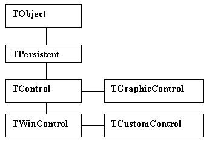
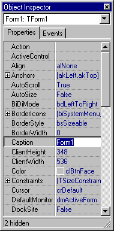

Глава 2. Базовые классы VCL
===========================

- [Введение](#1)
- [Иерархия базовых классов](#2)
- [Класс TObject](#tobject)
- [Класс TPersistent](#3)
- [Класс TComponent](#4)
- [Базовые классы элементов управления](#5)
    - [Класс TControl](#6)
    - [Класс TWinControl](#7)
    - [Класс TGraphicControl](#8)
    - [Класс TCustomControl](#9)


<A NAME="1"></A>
## Введение

Все классы библиотеки визуальных компонентов (VCL) 
произошли от группы базовых классов, которые лежат в основе иерархии. Самый 
общий предок компонентов - это класс TObject, инкапсулирующий простейший объект. 
Как известно (см. гл. 1), каждый объект наследует свойства и методы родительского 
класса. К объекту можно добавить новые свойства и методы, но нельзя удалить 
унаследованные. Объект-наследник в свою очередь может стать родительским для 
нового класса, который унаследует возможности всех своих предков.

Поэтому иерархия базовых классов VCL продумана 
чрезвычайно тщательно - ведь на их основе создано все множество компонентов. 
Особое место среди базовых классов, помимо TObject, занимают TComponent (от 
него происходят все компоненты) и TControl (от него происходят все элементы 
управления).

В этой главе рассматриваются иерархия базовых 
классов и их возможности. Представленные здесь сведения помогут разобраться 
с основными механизмами функционирования компонентов. Также глава послужит справочным 
материалом для тех, кто создает собственные объекты и элементы управления.


<A NAME="2"></A>
## Иерархия базовых классов

В основе всего многообразия классов и компонентов, 
используемых в Delphi, лежат всего лишь несколько базовых классов (рис. 2.1). 
Благодаря механизму наследования свойств и методов, потомки базовых классов 
умеют "общаться" друг с другом, работают в среде разработки, взаимодействуя 
с Палитрой компонентов и Инспектором объектов, распознаются операционной системой 
как элементы управления и окна.

В основе иерархии классов лежит класс TObject. 
Он обеспечивает выполнение важнейших функций "жизнедеятельности" любого объекта. 
Благодаря ему каждый класс получает в наследство механизмы создания экземпляра 
объекта и его уничтожения.

Класс Tpersistent происходит непосредственно от 
класса TObject. Он обеспечивает своих потомков возможностью взаимодействовать 
с другими объектами.

Класс TComponent является важнейшим для всех компонентов. 
Непосредственно от него можно создавать любые невизуальные компоненты.
Механизмы, реализованные в классе TComponent, обеспечивают 
взаимодействие компонента со средой разработки, главным образом с Палитрой компонентов 
и Инспектором объектов. Благодаря возможностям этого класса компоненты начинают 
"работать" уже во время разработки проекта.

:::{.center}
  
Рис. 2.1. Иерархия базовых классов VCL
:::

Класс TControl происходит от класса TComponent. 
Его основное назначение - обеспечить функционирование визуальных компонентов.

Класс TwinControl расширяет возможности разработчиков 
по созданию элементов управления. Он наследует от TControl и обеспечивает создание 
оконных элементов управления. На уровне TwinControl обеспечивается взаимодействие 
с GUI (Graphic User Interface - Графический Интерфейс Пользователя).

На основе класса TwinControl создан еще один дополнительный 
класс - TCustomControl. Он обеспечивает создаваемые на его основе компоненты 
возможностями по использованию канвы - специального объекта, предназначенного 
для рисования графики (подробнее о канве см. гл. 8).

Ниже мы остановимся на основных свойствах и методах 
базовых классов, выделяя только те, которые могут пригодиться в реальной работе. 
Часть из них опубликована и доступна в Инспекторе объектов, часть может быть 
установлена и использована только в программном коде.


<A NAME="tobject"></A>
## Класс TObject


Класс TObject является родоначальником всей иерархии использующихся в
Delphi классов VCL. Он реализует функции, которые обязательно будет
выполнять любой объект, который может быть создан в среде разработки.
Учитывая гигантское разнообразие возможных областей применения объектов
в процессе создания приложений, можно сказать, что круг общих для всех
классов операций весьма невелик.

В первую очередь - это создание экземпляра объекта и его уничтожение.
Любой объект выполняет эти две операции в обязательном порядке. Процесс
создания объекта включает выделение области адресного пространства,
установку указателя на экземпляр объекта, задание начальных значений
свойств и выполнение установочных действий, связанных с назначением
объекта. В общем случае две последние операции могут не выполняться.

Указатель на экземпляр объекта передается в переменную объектного типа,
которая в дальнейшем будет идентифицировать объект в программном коде
приложения. В приведенном выше фрагменте кода переменная объектного типа
someList объявлена как экземпляр типа TStrings. При создании экземпляра
этого типа конструктор Create возвращает в переменную SomeList указатель
на выделенную для нового объекта область памяти. Для этого применяется
метод Newinstance, который вызывается в конструкторе автоматически:

    class function Newinstance: TObject; virtual; 

Объект класса TObject обеспечивает выполнение этого процесса для любого
порожденного от него объекта. А уже внутри конструктора, который
унаследован от класса TObject, можно предусмотреть инициализацию
переменных и выполнение дополнительных операций. Объявление конструктора
выглядит следующим образом:

    constructor Create; 

В конструкторах потомков это объявление может перекрываться, но при
необходимости вызвать конструктор предка используется оператор
inherited:

    constructor TSomeObject.Create;  
    begin  
      inherited Create; 
      ... 
    end; 

Для уничтожения экземпляра объекта в классе TObject предназначены методы
Destroy и Free:

    destructor Destroy; virtual;  
    procedure Free;

Как видно из объявления, настоящим деструктором является метод Destroy.
Он обеспечивает освобождение всех занимаемых экземпляром объекта
ресурсов. Обычно при создании новых классов деструктор всегда
перекрывается для того, чтобы корректно завершить работу с данными.

**Примечание**

Обратите внимание, что обычно унаследованный конструктор вызывается в
первую очередь. Это необходимо для того, чтобы выполнить все нужные
операции при создании объекта до инициализации его собственных свойств.
При уничтожении объекта обычно сначала выполняются завершающие операции
и только в самом конце вызывается унаследованный деструктор, чтобы
выполнить собственно уничтожение объекта.

При уничтожении объектов рекомендуется вместо деструктора использовать
метод Free, который просто вызывает деструктор, но перед этим проверяет,
чтобы указатель на экземпляр объекта был не пустым (не был равен Nil).
Это позволяет избежать серьезных ошибок.

Если объект является владельцем других объектов (например, форма владеет
всеми размещенными на ней компонентами), то его метод Free автоматически
вызовет эти же методы для всех объектов. Поэтому при закрытии формы
разработчик избавлен от необходимости заботиться об уничтожении всех
компонентов.

Для освобождения занимаемой объектом памяти деструктор автоматически
Вызывает метод FreeInstance:

    procedure FreeInstance; virtual; 

Каждый объект должен содержать некоторую информацию о себе, которая
используется приложением и средой разработки. Поэтому класс TObject
содержит ряд методов, обеспечивающих представление этой информации в
потомках.

    class function ClassInfo: Pointer; 

возвращает указатель на таблицу информации времени выполнения (RTTI).
Эта информация используется в среде разработки и в приложении.

    class function ClassName: ShortString; 

возвращает имя типа объекта, которое может быть использовано для
идентификации. Например, один метод-обработчик щелчка на кнопке может
работать с несколькими типами компонентов кнопок:

    procedure TForml.BitBtn1Click(Sender: TObject); 
    begin  
      if Sender is TBitBtn then
        TBitBtn(Sender).Enabled := False; 
      if Sender is TSpeedButton then
        TSpeedButton(Sender).Down := True; 
    end; 

Метод

    class function ClassNamels(const Name: string): Boolean; 

позволяет определить, является ли данный объект того типа, имя которого
передано в параметре Name. В случае положительного ответа функция
возвращает True.

Как известно, программирование для Windows основано на событиях. Каждое
приложение и каждый программный объект должны уметь реагировать на
сообщение о событиях и, в свою очередь, рассылать сообщения. В
выполнении этих операций заключается третья общая для всех объектов
функция.

Метод

    procedure Dispatch(var Message); virtual; 

осуществляет обработку сообщений, поступающих объекту. Он определяет,
сможет ли объект обработать сообщение при помощи собственных
обработчиков событий. В случае отсутствия таких методов сообщение
передается аналогичному методу Dispatch класса-предка (если он есть).

Класс TObject имеет предопределенный обработчик событий:

    procedure DefaultHandler(var Message); virtual; 

Кроме рассмотренных здесь методов, класс TObject имеет еще несколько
методов, которые в основном применяются для взаимодействия объекта со
средой разработки.

В целом класс TObject может служить для создания на его основе некоторых
простых классов для использования в приложениях.


<A NAME="3"></A>
## Класс TPersistent

"Persistent" в переводе с английского означает
"устойчивый", "постоянный". Что же такого постоянного в одноименном классе?  
Ответ таков: виртуальный метод

    procedure Assign(Source: TPersistent);

Этот важнейший метод осуществляет копирование 
содержимого одного объекта (source) в другой (self, то есть в объект, вызвавший 
метод Assign). При этом объект-получатель остается самим собой, чего нельзя 
достигнуть, используя простое присваивание переменных объектного типа:

    FirstObject := SecondObject;

Ведь в этом случае указатель на одну область адресного 
пространства, содержащую экземпляр класса (объект), замещается указателем на 
другую область адресного пространства, содержащую другой объект.

Метод Assign позволяет продублировать объект - 
присвоить одному объекту значения всех свойств другого. При этом объекты не 
обязательно должны быть одного и того же класса; более того, они не обязательно 
должны находиться в отношениях "родитель-потомок"! Данный метод тем и хорош, 
что позволяет полиморфное присвоение. Конструкция

    Clipboard.Assign( Picture );

позволяет скопировать содержимое картинки picture 
в папку обмена Windows (объект clipboard). Какова здесь логика? Известно, что 
в папку обмена можно поместить растровую картинку, текст, метафайл, мультимедийные 
данные и т. п. Метод Assign класса rciipboard переписан таким образом, чтобы 
обеспечить присвоение (то есть реальное перемещение в папку обмена) всех этих 
данных.

    procedure TClipboard.Assign(Source: TPersistent);
    begin
      if Source is TPicture then
        AssignPicture(TPicture(Source))
      else 
        if Source is TGraphic then
          AssignGraphic(TGraphic(Source))
        else 
          inherited Assign(Source);
    end;

Для обеспечения взаимодействия потомков класса 
TPersistent со средой разработки предназначен метод

    function GetNamePath: string; dynamic;

Он возвращает имя объекта для передачи его в Инспектор 
объектов.

Для взаимодействия с потоками при загрузке и сохранении 
компонентов предназначен следующий метод:

    procedure DefineProperties(Filer: TFiler); virtual;

Класс TPersistent никогда не используется напрямую, 
от него порождаются потомки, которые должны уметь передавать другим объектам 
значения своих свойств, но не являться при этом компонентами.


<A NAME="4"></A>
## Класс TComponent

Класс TComponent является предком всех компонентов 
VCL. Он используется в качестве основы для создания невизуальных компонентов 
и реализует основные механизмы, которые обеспечивают функционирование любого 
компонента. В нем появляются первые свойства, которые отображаются в Инспекторе 
объектов. Это свойство

    property Name: TComponentName;

Оно содержит имя экземпляра компонента, которое 
используется для идентификации компонента в приложении.

> **Примечание**  
> Тип TComponentName представляет собой обычную строку.
> 
>     type TComponentName = type string;

Свойство

    property Tag: Longint;

является вспомогательным и не влияет на работу 
компонента. Оно отдано на откуп разработчику, который может присваивать ему 
значения по своему усмотрению. Например, это свойство можно использовать для 
дополнительной, более удобной идентификации компонентов. Пример его использования 
для определения кнопок приведен в предыдущей главе.

Определение метода-конструктора TComponent выглядит 
лаконично, в нем присутствует указатель на единственный параметр AOwner:

    constructor Create(AOwner: TComponent);

Смысл его таков: `owner` - это тот объект, который 
при создании вызывает конструкторы всех объектов, владельцем которых он является, 
а при уничтожении - их деструкторы. Таким образом, поместив при разработке компонент 
на форму, вы можете не заботиться о его создании и уничтожении в программе. 
Все свойства таких компонентов и все связи между ними запоминаются в файле формы 
(.dfm) и при запуске приложения создаются вновь автоматически.

Деструктор компонента:

    destructor Destroy;

уничтожает все дочерние компоненты (вызывая их 
деструкторы) и вычеркивает себя из списка компонента-владельца.

Для реализации описанной иерархии компонентов 
в классе TComponent введен механизм учета и управления компонентами, для которых 
данный компонент является владельцем. Свойства и методы, которые отвечают за 
управление, приведены в табл. 2.1.

**Таблица 2.1.** Методы и свойства для управления списком компонентов

|Свойство (метод)|Описание|
|--------|--------|
|property Components[Index: Integer]: TComponent;     |Содержит индексированный список указателей         всех компонентов, для которых данный компонент является владельцем (Owner)|
|property ComponentCount: Integer;     |Число подчиненных компонентов|
|property Owner: TComponent;     |Указывается, какой компонент является владельцем         данного|
|property Component Index: Integer;     |Индекс данного компонента в списке владельца|
|procedure InsertComponent(AComponent: TComponent) ;     |Вставляет компонент AComponent в список|
|procedure RemoveComponent (AComponent: TComponent);     |Удаляет компонент AComponent из списка|
|procedure FindComponent (AName: string): TComponent;     |Осуществляет поиск компонента по имени         AName     |
|procedure DestroyComponents;     |Предназначен для уничтожения всех компонентов,         подчиненных данному|

Очень важное свойство

    type TComponentState = set of (csLoading, csReading, 
                                   csWriting, csDestroying,
                                   csDesigning, csAncestor,
                                   csUpdating, csFixups) ;
    property ComponentState: TComponentState;

дает представление о текущем состоянии компонента. 
В табл. 2.2 описаны возможные значения свойства. Состояние может измениться 
в результате получения компонентом некоторого сообщения, действий разработчика, 
выполнения акции и т. д. Это свойство активно используется средой разработки.

**Таблица 2.2.** Возможные состояния компонента

|Состояние|Описание|
|--------|--------|
|csLoading    |Устанавливается при загрузке компонента из потока |
|csReading    |Устанавливается при чтении значений свойств из потока|
|csWriting    |Устанавливается при записи значений свойств в поток|
|csDestroying |Устанавливается при уничтожении компонента|
|csDesigning  |Состояние разработки. Устанавливается во время работы с формой во время разработки|
|csAncestor   |Устанавливается при переносе компонента на форму. Для перехода в это состояние должно быть уже установлено состояние csDesigning|
|csUpdating   |Устанавливается при изменении значений свойств и отображения результата на форме-владельце. Для перехода в это состояние должно быть уже установлено состояние csAncestor |
|csFixups     |Устанавливается, если компонент связан с компонентом другой формы, которая еще не загружена в среду разработки|

Для обеспечения работы механизма действий
(Actions) предназначен метод

    function ExecuteAction(Action: TBasicAction):Boolean; dynamic;

Он вызывается автоматически при необходимости 
выполнить акцию, предназначенную для данного компонента.

На уровне класса TComponent обеспечена поддержка 
СОМ-интерфейсов `Unknown` и `IDispatch`.

Посредством свойства

    property ComObject: lUnknown;

вы можете обеспечить использование методов этих интерфейсов.

Таким образом, класс TComponent имеет все для 
использования в качестве предка для создания собственных невизуальных компонентов.

<A NAME="5"></A>
## Базовые классы элементов управления

Вслед за классом TComponent в иерархии базовых 
классов (см. рис. 2.1) располагается группа из трех классов, которые обеспечивают 
создание различных визуальных компонентов. Визуальные компоненты - это разнообразные 
стандартные для Windows и специальные (созданные разработчиками Inprise) элементы 
управления.

Понятно, что визуальные компоненты должны уметь 
отобразить себя на экране монитора и реагировать на целый ряд новых событий 
(реакция на мышь и клавиатуру). Для этого в них встроен специальный механизм, 
обеспечивающий взаимодействие компонентов с графической подсистемой ОС (GUI).

Существует несколько типов элементов управления, 
которые существенно отличаются по своим возможностям и поведению. Каждому типу 
соответствует собственный класс иерархии.

Класс TWinControl обеспечивает использование в 
Delphi оконных элементов управления. Главное отличие оконного элемента управления 
от любых других - наличие дескриптора окна hWnd. Дескриптор окна - это специальный

идентификатор, который операционная система присваивает 
всем объектам, которые должны обладать свойствами окна. Если элемент управления 
имеет дескриптор окна, то он должен уметь выполнять следующие операции:

- получать и передавать фокус управления во время 
  выполнения приложения;
- воспринимать управляющие воздействия от мыши 
  и клавиатуры;
- уметь размещать на себе другие элементы управления.

Оконными элементами управления являются не только 
формы, но и практически все стандартные элементы управления Windows: и списки, 
и редакторы имеют дескриптор окна.

Оконные элементы управления имеют еще одного общего 
предка. Это класс TCustomControl. Он существенно облегчает использование элементов 
управления, так как позволяет управлять отрисовкой компонента путем использования 
специального класса TCanvas - так называемой канвы (см. гл. 13) вместо обращения 
к системным функциям GUI.

Для обеспечения создания обычных (не оконных) 
элементов управления непосредственно от класса TControl порожден класс TGraphicControi. 
Его потомки не могут получать фокус, но используют для визуализации канву.


<A NAME="6"></A>
### Класс TControl

Класс TControl является базовым для всех визуальных 
компонентов и инкапсулирует основные механизмы "поведения" всех компонентов. 
В нем используется множество новых свойств и методов. Недаром в Delphi 5 в Инспекторе 
объектов впервые появилась категоризация методов и свойств (рис. 2.2). Большинство 
из них вводятся как раз в классах TControl и TWinControl.

Рассмотрим только важнейшие свойства и методы по категориям.

:::{.center}
  
Рис. 2.2. Категории свойств визуального компонента. Для представлении их в таком виде 
  нужно отметить флажок **By Category** 
  в пункте меню **Arrange** всплывающего 
  меню Инспектора объектов
:::


**Размер и местоположение элемента управления**

Для определения местоположения и размеров визуального 
компонента введены два опубликованных свойства для задания координат левого 
верхнего угла:

    property Тор: Integer-property Left: Integer;

И два опубликованных свойства для определения 
размеров:

    property Height: Integer;
    property Width: Integer;

Значения свойств задаются в пикселах. Для определения 
местоположения используется система координат рабочей области родителя данного 
компонента. Начало отсчета находится в левом верхнем углу. Оси направлены вправо 
и вниз. Под рабочей областью понимается та часть площади родительского окна 
(формы, панели), которая предназначена для размещения дочерних элементов. Для 
формы верхний левый угол выражен в системе координат экрана. Эти свойства можно 
использовать как на этапе разработки, так и во время выполнения.

По-другому к этим же значениям можно обратиться 
через свойство

    property BoundsRect: TRect;

которое определяет тот же прямоугольник (Left, 
Top, Left+width, тор+Height). Также можно установить положение и размер компонента, 
изменяя координаты верхнего левого угла, длины и ширины методом:

    procedure SetBounds(ALeft, ATop, AWidth, AHeight: Integer);
              virtual;

Свойство

    property ClientOrigin: TPoint;

содержит координаты левого верхнего угла элемента 
управления в системе координат экрана. Координаты любой точки можно пересчитать 
в экранные при помощи метода:

    function ClientToScreen(const Point: TPoint): TPoint;

и наоборот:

    function ScreenToClient(const Point: TPoint): TPoint;

У большинства визуальных компонентов есть так 
называемая рабочая (клиентская) область, в которой могут размещаться дочерние 
элементы управления и которая отрисовывается стандартными методами. Параметры 
рабочей области компонента определяются следующими свойствами:

    property ClientHeight: Integer;

определяет высоту рабочей области в пикселах.

    property ClientWidth: Integer;

определяет ширину рабочей области впикселах. 
Кому-то будет удобнее пользоваться свойством

    property ClientRect: TRect;

значение которого есть ни что иное, как

    (0, 0, ClientWidth, ClientHeight).

Оно доступно только для чтения.

**Выравнивание и масштабирование элемента управления**

Для выравнивания компонента в рабочей области 
его родителя применяется свойство:

    property Align: TAlign;

Тип TAlign объявлен следующим образом:

    type TAlign = (aINone, alTop, alBottom,
                   alLeft, alRight, alClient);

При значении aiNone выравнивание отсутствует. 
При следующих четырех значениях выравнивание осуществляется по соответствующей 
стороне. Значение alciient приводит к тому, что элемент управления изменяет 
свои размеры до размеров рабочей области родителя.

Выравнивание гарантирует, что при изменении размеров 
родителя относительная позиция дочернего элемента не меняется. Это свойство 
имеет приоритет над простым изменением положения и размеров. Если новые координаты 
элемента противоречат способу его выравнивания (например, перемещение вверх 
при alBottom), изменения отвергаются и элемент возвращается к первоначальным 
координатам. Свойство Align незаменимо при организации панелей инструментов 
и строк состояния - они могут перемещаться и видоизменяться вместе с содержащей 
их формой.

Для временного отключения действия свойства Align 
предназначены методы:

    procedure DisableAlign;
    procedure EnableAlign;

Эти методы управляют возможностью выравнивания 
потомков данного элемента, они должны вызываться в паре. Для восстановления 
выравнивания элементов в соответствии с Align есть метод:

    procedure Realign;

В следующем примере использование методов DisableAlign 
и EnableAlign позволяет настроить выравнивание панели по тому краю формы, на 
который пользователь перетащит ее мышью:

```delphi
procedure TForm1.FormCreate(Sender: TObject);
begin
  Panel1.Align := alBottom;
  Moving := False;
end;

procedure TForm1.Panel1MouseDown(Sender: TObject;
Button: TMouseButton; Shift: TShiftState; X, Y: Integer);
begin
   if not Moving then
      begin
         Form1.DisableAlign;
         Moving := True;
      end;
end;

procedure TForm1.Panel1MouseMove(Sender: TObject;
Shift: TShiftState; X, Y: Integer);
begin
   if Moving then with Panel1 do
      begin
         Left := Left + X - Width div 2;
         Top := Top + Y - Height div 2;
         Panel1.Caption := Format('%d,%d',[Left,Top]);
      end;
end;

procedure TForm1.Panel1MouseUp(Sender: TObject;
                               Button: TMouseButton;
                               Shift: TShiftState;
                               X, Y: Integer);
var
  LastPos : TPoint;
  rO, rl, r2 : real;
begin
  if Moving then
    begin
      Moving := False;
      Panel1.Caption := '';
      LastPos := Point(Panel1.Left + X, Panel1.Top + Y) ;
      if LastPos.X<=0 then
        LastPos.X := 1;
      if LastPos.X>=ClientWidth then
        LastPos.X := ClientWidth-1;
      if LastPos.Y<=0 then
        LastPos.Y := 1;
      if LastPos.Y>=ClientHeight then
        LastPos.Y := ClientHeight-1;
      r0 := ClientWidth/ClientHeight;
      rl := LastPos.X/LastPos.Y;
      r2 := LastPos.X/(ClientHeight - LastPos.Y);
      with Panel1 do
        if r1 < r0 then
          if r2 < r0 then
            Align := alLeft
          else
            Align := alBottom
        else
          if r2 < r0 then
            Align := alTop
          else
            Align := alRight;
      Form1.EnableAlign ;
    end;
end;
```

В предыдущей версии Delphi появились два свойства, 
сильно облегчающиеподдержание нормальных 
размера и положения элемента управления при изменении разрешения экрана и 
размера окна. Эти свойства - Constraints и Anchors.

Свойство

    property Anchors: TAnchors;
    type TAnchors = set of TAnchorKind;
    type TAnchorKind = (akTop, akLeft, akRight, akBottom);

обеспечивает фиксацию элемента управления по сторонам 
родительского элемента управления. "Якорь" можно установить по одной, двум, 
трем или четырем сторонам. При задании якоря по любой стороне расстояние между 
данной стороной и элементом управления сохраняется неизменным. По умолчанию 
любой компонент привязан к верхней и левой сторонам ([akLeft, akTop]), то есть 
не двигается при стандартном масштабировании (за нижний правый угол окна). Комбинируя 
установку якорей для различных сторон, можно добиться различных вариантов поведения 
компонента при изменении размеров родителя.

Если по вертикали или горизонтали якорь не установлен 
вообще, то при изменении размеров владельца компонент остается на том же месте 
с учетом изменившегося размера.

С другой стороны, если прикрепить все четыре стороны, 
то получится интересный и нужный во многих случаях эффект. Такой компонент увеличивается 
и уменьшается вместе с формой; но в то же время сохраняется расстояние до всех 
четырех ее краев.

Но как избежать того, что в процессе масштабирования 
элемент управления станет слишком большим или слишком маленьким (вплоть до полного 
исчезновения с экрана)? Тут на помощь приходит свойство

    property Constraints: TSizeConstraints;

Значение этого свойства - четверка чисел
Minwidth, Maxwidth, MinHeight, MaxHeight.
Они могут задаваться в Инспекторе объектов или 
во время выполнения. Об их смысле догадаться нетрудно - это минимальные и максимальные 
размеры компонента. При масштабировании родительского окна гарантируется, что 
размеры компонента будут изменяться только в этих пределах. Наконец, если нужна 
еще более глубокая проработка вопросов масштабирования, можно написать свои 
обработчики двух событий, предусмотренных в классе TControl:

    property OnCanResize: TCanResizeEvent;
    type TCanResizeEvenе = procedure(
         Sender: TObject; 
         var NewWidth, NewHeight: Integer; 
         var Resize: Boolean) of object;
    property OnConstrainedResize: TConstrainedResizeEvent;
    type TConstrainedResizeEvent = procedure(Sender: TObject; 
         var MinWidth, MinHeight, MaxWidth, MaxHeight: Integer) 
         of object;

Описав обработчики этих событий, вы сначала можете 
разрешить или запретить изменение размеров до значений NewWidth, NewHeight (вернув 
значение В параметре Resize). Затем, В Обработчике OnConstrainedResize 

Вы можете задать минимальные и максимальные размеры 
для каждого конкретного случая в отдельности. Наконец, когда масштабирование 
полностью закончено, произойдет событие:

    property OnResize: TNotifyEvent;

> Свойствам 
> Align, Constraints и Anchors не так-то легко "ладить" друг с другом. Одновременное 
> задание их может породить конфликты. Конечно, ваша программа от этого не завершится 
> аварийно, но компоненты могут получить не те позиции и размеры, которые вы ожидали.

Наконец, большинство элементов управления имеет свойство

    property AutoSize: Boolean;

которое обеспечивает автоматическое изменение 
размеров компонента в соответствии с размерами его содержимого (текста, изображения, 
списка, иерархического дерева и т. д.).

**Внешний вид элемента управления**

Для определения цвета рабочей области компонента 
используется свойство:

    property Color: TColor;

При нахождении указателя мыши над компонентом 
изображение курсора может изменяться в соответствии со значением свойства

    property Cursor: TCursor;

С каждым элементом управления связан некий текст, 
который может играть роль заголовка или редактироваться. В зависимости от роли, 
текст может содержаться в свойствах caption:

    property Caption: TCaption;
    TCaption = string[255];

либо Text:

    property Text: TCaption;

Не задумываясь о том, в каком именно свойстве 
содержится текст, получить доступ к нему можно посредством методов:

    function GetTextBuf(Buffer: PChar; BufSize: Integer): Integer;
    procedure SetTextBuf(Buffer: PChar);
    function GetTextLen: Integer;

Все три метода работают, посылая в собственную 
функцию-обработчик сообщений объекта (через вызов метода perform) сообщения 
Windows

    WM_GETTEXT, WM_SETTEXT и WM_GETTEXTLENGTH.

Шрифт для текста компонента задается свойством:

    property Font: TFont;

Класс TFont, задающий все характеристики шрифта, 
подробно рассматривается в главе 8 "Использование графики".

Элемент управления можно сделать видимым или невидимым. 
Для этого применяется свойство

    property Visible: Boolean;

Этих же результатов можно достичь методами show 
(компонент видим) и Hide (компонент невидим).

Для каждого элемента управления можно создать 
собственное всплывающее (контекстное) меню. Ссылка на соответствующий компонент 
трорирмепи (см. гл. 6), хранится в свойстве

    property PopupMenu: TPopupMenu;

Перед тем как происходит вызов меню, инициируется 
событие

    property OnContextPopup: TContextPopupEvent;
    type TContextPopupEvent = procedure(
                                Sender: TObject; 
                                MousePos: TPoint;
                                var Handled: Boolean) of object;

В его обработчике можно изменить значение параметра 
Handled. Если оно равно True, вызов меню не производится.

Текущее состояние элемента управления определяется 
свойством ControlState:

    type TControlState = set of (
      csLButtonDown, csClicked, 
      csPalette, csReadingState, csAlignmentNeeded,
      csFocusing, csCreating, csCustomPaint, 
      csDestroyingHandle, csDocking
    );
    property ControlState: TControlState;

Описание возможных значений свойства представлены 
в табл. 2.3.

Таблица 2.3. Возможные состояния элемента управления

|Состояние|Описание|
|--------|--------|
|csLButtonDown      |Левая кнопка мыши нажата, но еще не отпущена. Используется для реализации события OnMouseDown|
|csClicked          |Левая кнопка мыши нажата, но еще не отпущена. Используется для реализации события OnClick|
|csPalette          |Состояние соответствует режиму изменения палитры. Это реакция на сообщение wm palettchanged|
|csReadingState     |Осуществляется чтение значений свойств из потока (см. табл. 2.1)|
|csAlignmentNeeded  |Осуществляется выравнивание компонента|
|csFocusing         |Элемент управления получает фокус|
|csCreating         |Создаются элемент управления и его дочерние элементы|
|csCustomPaint      |Элемент управления выполняет нестандартные операции отрисовки, заданные разработчиком|
|csDestroyingHandle |Указатель на объект элемента управления уничтожается|
|csDocking          |Элемент управления находится в режиме переноса|

В зависимости от совокупности установленных свойств, 
элемент управления может соответствовать одному из возможных стилей, который 
задается свойством

    type TControlStyle = set of (
          csAcceptsControis, 
          csCaptureMouse, csDesignInteractive, csFramed,
          csClickEvents, csSetCaption, 
          csOpaque, csDoubleClicks, csFixedWidth, csFixedHeight,
          csNoDesignVisible, 
          csReplicatable, csNoStdEvents, csDisplayDragImage,
          csReflector, csActionClient, 
          csMenuEvents
    );
    property ControlStyle: TControlStyle;

Доступность элемента управления в целом определяется 
свойством

    property Enabled: Boolean;

При значении True элемент управления полностью 
работоспособен. При значении False элемент управления неактивен и отображается 
серым цветом.

Для получения контекста устройства hdc элемента 
управления используется метод

    function GetDeviceContext(var WindowHandle: HWnd): HDC; virtual;

Набор свойств и методов класса TWinControl обеспечивает 
функционирование механизма перетаскивания (Drag-and-Drop) и механизма переноса 
(см. гл. 12). В классе TControi впервые появляются методы-обработчики событий, 
которые обеспечивают передачу в элемент действия мыши, перенос и перетаскивание.


**Связь с родительским элементом управления**


Механизм связывания визуального компонента с родительским 
компонентом (владельцем) позволяет автоматически задавать для нового элемента 
управления некоторые свойства, отвечающие за его внешний вид (см. выше). В результате 
все дочерние элементы управления для одного родительского (формы, панели) будут 
выглядеть одинаково оформленными.

Родительский компонент задается свойством

    property Parent: TWinControl;

Для каждого дочернего элемента управления можно 
задать значения нескольких свойств:

    property ParentBiDiMode: Boolean;
    property ParentColor: Boolean;
    property ParentFont: Boolean;
    property ParentShowHint: Boolean;

Каждое из них управляет одной характеристикой 
визуализации элемента. 

Метод

    function HasParent: Boolean; override;

используется для того, чтобы определить, имеется 
ли у компонента родитель вообще.


<A NAME="7"></A>
### Класс TWinControl

Класс TWinControi обеспечивает создание и использование 
оконных элементов управления. Напомним, что оконный элемент управления имеет 
системный дескриптор окна (hwnd). С помощью этого дескриптора вы можете вызывать 
функции API Windows, если средств VCL вам недостаточно для решения задачи. Оконными 
элементами являются не только формы идиалоги, 
но и большинство стандартных элементов управления: окна ввода, списки, панели 
и т.п.

Новые механизмы, инкапсулированные в классе, обеспечивают 
выполнение функций, характерных для оконных элементов: прием и передачу фокуса, 
отклик на действия мышью и ввод с клавиатуры и т. д. Рассмотрим основные свойства 
и методы класса.

Дескриптор окна содержится в свойстве

    property Handle: HWND;

При создании оконного элемента управления вызывается метод

    procedure CreateParams(var Params: TCreateParams); virtual;

который заполняет структуру TCreateParams необходимыми значениями:

    type
    TCreateParams = record
      Caption: PChar;
      Style: DWORD;
      ExStyle: DWORD;
      X, Y: Integer;
      Width, Height: Integer;
      WndParent: HWND;
      Param: Pointer;
      WindowClass: TWndClass;
      WinClassName: array[0..63] of Char;
    end;

Для создания дескриптора окна для элемента управления 
используется метод

    procedure CreateHandle; virtual;

Операционная система создает дескриптор окна только 
вместе с самим окном. Поэтому метод CreateHandle только создает окно, а для 
присваивания свойству Handle значения дескриптора окна вызывает метод createwnd.

Важной особенностью TWinControl является то, что 
он может содержать другие - дочерние - элементы управления. Они упорядочены 
в виде списка. Если быть точным, то списков на самом деле два:
для неоконных и оконных дочерних элементов.
Но "видны" они как один объединенный: сначала первый, потом второй.

Методы и свойства для работы с этим списком приведены в таблице 2.4:

Таблица 2.4. Методы и свойства, управляющие списком дочерних элементов управления*

|Свойство|Значение|
|--------|--------|
|property Controls[Index: Integer]: TControl; |Содержит список дочерних элементов|
|property ControlCount: Integer;     |Содержит число элементов в списке|
|function ContainsControl (Control: TControl): Boolean;     |Проверяет наличие элемента в списке|
|Function ControlAtPos(const Pos: TPoint; AllowDisabled: Boolean): TControl;     |Отыскивает в списке элемент, которому принадлежит заданная точка (в системе координат собственной клиентской области). Флаг AllowDisabled показывает, разрешен ли поиск среди пассивных (свойство Enabled которых равно False) элементов|
|Procedure InsertCon-trol(AControl: TControl) ;     |Вставляет элемент в конец списка|
|procedure RemoveControl (AControl: TControl);     |Удаляет элемент из списка|
|procedure Broadcast (var Message);     |Рассылает всем дочерним элементам из списка сообщение Message|

Для передачи фокуса между элементами управления 
на одной форме часто используется клавиша \<Таb\>. Порядок перемещения фокуса 
между элементами определяется свойством

    type TTabOrder = -1..32767;
    property TabOrder: TTabOrder;

В первую очередь фокус передается компоненту с 
минимальным значением свойства. Далее - по возрастанию значения. При переносе 
компонента на форму это значение устанавливается автоматически в соответствии 
с числом компонентов на форме.

Компонент можно заставить не откликаться на клавишу 
\<Таb\>. Для этого свойству

    property TabStop: Boolean;

необходимо присвоить значение False.

Будучи окнами Windows, компонент TWinControl и 
его потомки должны управлять фокусом ввода (состоянием, когда они получают и 
обрабатывают входные сообщения). Они имеют предназначенные для этого методы:

    function Focused: Boolean;

показывает, имеет ли элемент в данный момент фокус ввода;

    function CanFocus: Boolean;

возвращает True, если оконный элемент может получить 
фокус ввода (для этого он и все его родительские оконные элементы управления 
должны быть активными (Enabled) видимыми);

    procedure SetFocus; virtual;

запрашивает у родительской формы получение фокуса 
ввода. При получении и утере фокуса оконными компонентами происходят события:

    property OnEnter: TNotifyEvent;
    property OnExit: TNotifyEvent;

Все оконные элементы имеют рамку по контуру (впрочем, 
она может быть не видна). Ее параметры задаются группой свойств:

    property BevelEdges: TBevelEdges;

задает, какие стороны входят в рамку.

    property Bevel Inner: TBevelCut;
    property BevelOuter: TBevelCut;

задают внешний вид рамки.

    property BevelKind: TBevelKind;

определяет стиль рамки.

    property BevelWidth: TBevelWidth;

задает размер рамки.

Свойство

    property Brush: TBrush;

определяет параметры кисти (цвет и заполнение), 
которой рисуется фон элемента. Объект TBrush описан в главе 8, посвященной графике.

"Трехмерный" внешний вид оконного элемента определяется свойством

    property Ctl3D: Boolean

С каждым оконным компонентом можно связать контекстную 
помощь. Контекст помощи - это индекс, указывающий на определенную информацию 
в файле справочной системы, связанном с приложением:

    property HelpContext: THelpContext;
    type THelpContext = -MaxLongInt..MaxLongInt;

Когда компонент находится в фокусе, то при нажатии 
клавиши \<F1\> загружается система контекстной помощи, и пользователь сразу 
получает информацию, связанную с заданным контекстом.
Если контекст равен нулю,то система пытается отыскать в цепочке родительских 
компонентов первый, имеющий ненулевой контекст.

В классе TWinControl добавлена возможность использования 
редакторов способа ввода (Input Method Editor, IME). Такие редакторы позволяют 
приспособить стандартную раскладку клавиатуры для символьных языков для ввода 
нестандартных символов (иероглифов и т. д.). Редакторы IME 
представляют собой ПО, специально устанавливаемое в операционной системе. Имя 
такого редактора задается в свойстве imeName. Режим работы редактора определяется 
свойством imeMode.

В классе TWinControl добавлено еще несколько методов-обработчиков 
событий, обеспечивающих реакцию на ввод с клавиатуры, получение и потерю фокуса.

Есть еще несколько программных механизмов, реализованных 
в TCоntrol и TWinControl, и заслуживающих отдельного рассмотрения - перетаскивание, 
ярлычки (hints) и др.


<A NAME="8"></A>
### Класс TGraphicControl


Класс TGraphicControl предназначен для создания на его основе визуальных
компонентов, не получающих фокус в процессе выполнения приложения. Так
как непосредственным предком класса является класс TControl, то потомки
TGraphicControl умеют реагировать на управляющие воздействия мышью.

TGraphicControl умеют реагировать на управляющие воздействия мышью.
На основе TGraphicControl разработчиками Inprise созданы свои,
нестандартные элементы управления.
Это TLabel, TImage, TBevel, TShape, TPaintBox и TSplitter.

Наглядный пример элемента управления, которому не нужно получать фокус, -
это компонент TLabel, предназначенный для отображения текста, или
компонент Timage, предназначенный для визуализации изображений.

Для визуализации элементов управления на основе этого класса
используется канва, инкапсулированная в классе TCanvas.

Доступ к канве осуществляется через свойство

    property Canvas: TCanvas;

Отрисовка элемента управления осуществляется методом

    procedure PaintWindow(DC: HDC); override;

после получения сообщения WM\_PAINT.


<A NAME="9"></A>
### Класс TCustomControl


Класс TCustomControl предназначен для создания на его основе
нестандартных оконных элементов управления.

Процесс визуализации в TCustomControl
упрощен за счет использования специального класса TCanvas,
инкапсулирующего канву.

Доступ к канве осуществляется через свойство

    property Canvas: TCanvas;

Отрисовка элемента управления осуществляется методами

    procedure Paint; virtual;

после получения сообщения WM\_PAINT.

Класс TCustomControl порожден от класса TWinControl.
Возможности этого класса унаследовали классы TPanel, TGroupBox,
TStringGrid, TRadioGroup, THeader и другие.
