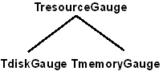
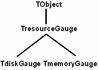

Наследование
============

::: {.date}
01.01.2007
:::

НАСЛЕДОВАНИЕ

ПОНЯТИЕ НАСЛЕДОВАНИЯ

Классы инкапсулируют (т.е. включают в себя) поля, методы и свойства; это
их первая черта. Следующая не менее важная черта классов --- способность
наследовать поля, методы и свойства других классов. Чтобы пояснить
сущность наследования, обратимся к примеру с измерителями ресурсов.

Класс TDiskGauge описывает измеритель дискового ресурса и непригоден для
измерения ресурса другого типа, например оперативной памяти. С
появлением измерителя оперативной памяти нужен новый класс объектов:

    type
     TMemoryGauge = class
        FPercentCritical: Integer;
        constructor Create;
        function GetPercentFree: Integer;
        procedure SetPercentCritical (Value: Integer) ;
        procedure CheckStatus;
        property PercentFree: Integer read GetPercentFree;
        property PercentCritical: Integer
            read FPercentCritical write SetPercentCritical;
    end;

 

Поля, методы и свойства класса TMemoryGauge аналогичны тем, что
определены в классе TDiskGauge. Отличие состоит в отсутствии поля
DriveLetter и другой реализации конструктора Create и метода
GetPercentFree. Если в будущем появится класс, описывающий измеритель
ресурса какого-то нового типа, то придется снова определять общие для
всех классов поля, методы и свойства. Чтобы избавиться от дублирования
атрибутов при определении новых классов, воспользуемся механизмом
наследования. Прежде всего выделим атрибуты, общие для всех измерителей
ресурсов, в отдельный класс TResourceGauge:

    type
     TResourceGauge = class
       FPercentCritical: Integer;
       constructor Create;
       function GetPercentFree: Integer;
       procedure SetPercentCritical (Value: Integer) ;
       procedure CheckStatus;
       property PercentFree : Integer read GetPercentFree;
       property PercentCritical: Integer
           read FPercentCritical write SetPercentCritical;
     end;
     
    constructor TResourceGauge.Create;
    begin
      FPercentCritical := 10;
    end;
     
    function TResourceGauge.GetPercentFree: Integer;
    begin
      Result := 0;
    end;
     
    procedure TResourceGauge.SetPercentCritical (Value: Integer);
    begin
      if (Value >= 0) and (Value < 100) then FPercentCritical := Value;
    end;
     
    procedure TResourceGauge.CheckStatus;
    begin
      if GetPercentFree <= FPercentCritical then Beep;
    end;

 

При реализации класса TResourceGauge ничего не известно о том, что в
действительности представляет собой ресурс, поэтому функция
GetPercentFree возвращает нуль. Очевидно, что создавать объекты класса
TResourceGauge не имеет смысла. Для чего тогда нужен класс
TResourceGauge? Ответ: чтобы на его основе породить два других класса
--- TDiskGauge и TMemoryGauge, описывающих конкретные виды измерителей
ресурсов, --- измеритель диска и измеритель памяти:

    type
     TDiskGauge = class(TResourceGauge)
       DriveLetter: Char;
       constructor Create (ADriveLetter: Char) ;
       function GetPercentFree: Integer;
     end;
     
     TMemoryGauge = class(TResourceGauge)
       function GetPercentFree: Integer;
     end;

 

Классы TDiskGauge и TMemoryGauge определены как наследники
TResourceGauge (об этом говорит имя в скобках после слова class). Они
автоматически включают в себя все описания, сделанные в классе
TResourceGauge и добавляют к ним некоторые новые. В результате
формируется следующее дерево классов (рис. 1):

:::{.center}

Рисунок 1
:::
 

Класс, который наследует атрибуты другого класса, называется порожденным
классом или потомком. Естественно, что класс, от которого происходит
наследование, выступает в роли базового, или предка. В примере класс
TDiskGauge является непосредственным потомком класса TResourceGauge.
Если от TDiskGauge породить новый класс, то он тоже будет потомком
TResourceGauge, но уже не таким близким, как TDiskGauge.

Очень важно, что в отношениях наследования любой класс может иметь
только одного непосредственного предка и сколь угодно много потомков.
Поэтому все связанные отношением наследования классы образуют иерархию.
Примером иерархии классов является библиотека Visual Component Library
(VCL); с ее помощью в Delphi обеспечивается разработка
Windows-приложений.

ПРЕДОК ПО УМОЛЧАНИЮ

В языке Object Pascal существует предопределенный класс TObject, который
служит неявным предком тех классов, для которых предок не указан. Это
означает, что объявление

    type
      TResourceGauge = class
       ...
      end;

эквивалентно следующему:

 

    type
      TResourceGauge = class(TObject)
       ...
      end;

 

 

Класс TObject выступает корнем любой иерархии классов. Он содержит ряд
методов, которые по наследству передаются всем остальным классам. Среди
них конструктор Create, деструктор Destroy, процедура Free и некоторые
другие методы.

Таким образом, полная иерархия классов для измерителей ресурсов выглядит
так (рис. 2):

:::{.center}

Рисунок 2
:::
 

ПЕРЕКРЫТИЕ АТРИБУТОВ В НАСЛЕДНИКАХ

В механизме наследования можно условно выделить три основных момента:

::: {style="text-align: left; text-indent: 0px; padding: 0px 0px 0px 0px; margin: 0px 0px 0px 24px;"}
  --- ---------------------
  §   наследование полей;
  --- ---------------------
:::

::: {style="text-align: left; text-indent: 0px; padding: 0px 0px 0px 0px; margin: 0px 0px 0px 24px;"}
  --- -----------------------
  §   наследование свойств;
  --- -----------------------
:::

::: {style="text-align: left; text-indent: 0px; padding: 0px 0px 0px 0px; margin: 0px 0px 0px 24px;"}
  --- -----------------------
  §   наследование методов.
  --- -----------------------
:::

Любой порожденный класс наследует от родительского все поля данных,
поэтому классы TDiskGauge и TMemoryGauge автоматически содержат поле
FPercentCritical, объявленное в классе TResourceGauge. Доступ к полям
предка осуществляется по имени, как если бы они были определены в
порожденном классе. В наследниках можно определять новые поля, но их
имена должны отличаться от имен полей предка.

Наследование свойств и методов имеет свои особенности.

Свойство базового класса можно перекрыть (от англ. override) в
производном классе, например чтобы добавить ему новый атрибут доступа
или связать с другим полем или методом.

Метод базового класса тоже можно перекрыть в производном классе,
например чтобы изменить логику его работы. Обратимся, например, к
классам TDiskGauge и TMemoryGauge. В них методы SetPercentCritical и
CheckStatus унаследованы от TResourceGauge, так как логика их работы не
зависит от типа ресурса. А вот метод GetPercentFree перекрыт, так как
способ вычисления процента свободного пространства специфичен для диска
и оперативной памяти:

    function TDiskGauge.GetPercentFree: Integer;
    var
      Drive: Byte;
    begin
      Drive := Ord(DriveLetter) - Ord('A') + 1;
      Result := DiskFree(Drive) * 100 div DiskSize(Drive) ;
    end;
     
    function TMemoryGauge.GetPercentFree: Integer; { uses Windows; }
    var
      MemoryStatus: TMemoryStatus;
    begin
      MemoryStatus.dwLength := SizeOf(MemoryStatus);
      GlobalMemoryStatus(MemoryStatus);
      Result := 100 - MemoryStatus.dwMemoryLoad;
    end;

 

В классе TDiskGauge перекрыт еще и конструктор Create. Это необходимо
для инициализации дополнительного поля DriveLetter:

    constructor TDiskGauge.Create (ADriveLetter: Char) ;
    begin
      inherited Create;
      DriveLetter := ADriveLetter;
    end;

Как видно из примера, в наследнике можно вызвать перекрытый метод
предка, указав перед именем метода зарезервированное слово inherited.
Кстати, данный пример демонстрирует важный принцип реализации
конструкторов: сначала вызывается конструктор предка, а затем
инициализируются дополнительные поля данных. В деструкторах применяется
обратная последовательность действий: сначала разрушаются данные,
недоступные предку, а затем вызывается унаследованный деструктор.

СОВМЕСТИМОСТЬ ОБЪЕКТОВ РАЗЛИЧНЫХ КЛАССОВ

Для классов, связанных отношением наследования, вводится новое правило
совместимости типов. Вместо объекта базового класса можно подставить
объект любого производного класса. Обратное неверно. Например,
переменной типа TResourceGauge можно присвоить значение переменной типа
TDiskGauge:

    var
      R: TResourceGauge;
    ...
      R := TDiskGauge.Create;
    ...

 

Объектная переменная R формально имеет тип TResourceGauge, а фактически
связана с экземпляром класса TDiskGauge.

Правило совместимости классов чаще всего применяется при передаче
объектов в параметрах процедур и функций. Например, если процедура
работает с объектом класса TResourceGauge, то вместо него можно передать
объект класса TDiskGauge или TMemoryGauge.

КОНТРОЛЬ И ПРЕОБРАЗОВАНИЕ ТИПОВ

Поскольку реальный экземпляр объекта может оказаться наследником класса,
указанного при описании объектной переменной или параметра, бывает
необходимо проверить, к какому классу принадлежит объект на самом деле.
Чтобы программист мог выполнять такого рода проверки, каждый объект
хранит информацию о своем классе. В Object Pascal существуют операторы
is и as, с помощью которых выполняется соответственно проверка на тип
(type checking) и преобразование к типу (type casting).

Например, чтобы выяснить, принадлежит ли некоторый объект Obj,
объявленный в программе как

    var
      Obj: TObject;

 

к классу TResourceGauge или его наследнику, следует записать

    if Obj is TResourceGauge then { да, принадлежит } ;

 

Для преобразования объекта к нужному типу используется оператор as,
например:

    with Obj as TResourceGauge do CheckStatus;

 

Стоит отметить, что для объектов применим и обычный способ приведения
типа:

    with TResourceGauge(Obj ) do CheckStatus;

 

Вариант с оператором as лучше, поскольку безопасен. Он генерирует ошибку
(точнее, исключительную ситуацию) при выполнении программы (run-time
error), если реальный экземпляр объекта Obj несовместим с классом
TResourceGauge. Забегая вперед, скажем, что ошибку приведения типа можно
обработать и таким образом избежать досрочного завершения приложения.

ВИРТУАЛЬНЫЕ МЕТОДЫ

ПОНЯТИЕ ВИРТУАЛЬНОГО МЕТОДА

Все методы, которые до сих пор рассматривались, имеют одну общую черту
--- все они статические. При обращении к статическому методу компилятор
точно знает класс, которому данный метод принадлежит. Поэтому, например,
обращение к статическому методу GetPereentFree в методе CheckStatus
компилируется в вызов TResourceGauge.GetPercentFree:

    procedure TResourceGauge.CheckStatus;
    begin
      if GetPereentFree <= FPercentCritical then Beep;
      { if TResourceGauge.GetPereentFree <= FPercentCritical then Beep; }
    end;

 

Метод CheckStatus работает неправильно в наследниках TResourceGauge, так
как внутри него вызов перекрытого метода GetPereentFree не происходит.
Конечно, в классах TDiskGauge и TMemoryGauge можно продублировать все
методы и свойства, которые прямо или косвенно вызывают GetPereentFree,
но при этом теряются преимущества наследования. ООП предлагает изящное
решение этой проблемы --- метод GetPereentFree всего-навсего объявляется
виртуальным:

    type
      TResourceGauge = class
       ...
      function GetPereentFree: Integer; virtual;
       ...
      end;

В производных классах виртуальный метод перекрывается с использованием
ключевого слова override. Перекрытый метод должен иметь точно такой же
формат (список параметров, а для функций еще и тип возвращаемого
значения), что и перекрываемый:

    type
      TDiskGauge = class(TResourceGauge)
         ...
        function GetPercentFree: Integer; override;
      end;
     
      TMemoryGauge = class(TResourceGauge)
        function GetPercentFree: Integer; override;
      end;

 

Суть виртуальных методов в том, что они вызываются по фактическому типу
экземпляра, а не по формальному типу, записанному в программе. Поэтому
после сделанных изменений метод CheckStatus будет работать так, как
ожидает программист:

    procedure TResourceGauge.CheckStatus;
    begin
      if GetPercentFree <= FPercentCritical then Beep;
      { if «фактический класс>.GetPercentFree <= FpercentCritical then Beep; }
    end;

 

Работа виртуальных методов основана на механизме позднего связывания
(late binding). В отличие от раннего связывания (early binding),
характерного для статических методов, позднее связывание основано на
вычислении адреса вызываемого метода при выполнении программы. Метод
вычисляется по хранящемуся в каждом объекте описателю типа.

Благодаря механизму наследования и виртуальным методам, в Delphi
реализуется такая концепция ООП как полиморфизм. Полиморфизм существенно
облегчает труд программиста, так как обеспечивает повторное
использование кода уже написанных методов.

АБСТРАКТНЫЕ ВИРТУАЛЬНЫЕ МЕТОДЫ

При построении иерархии часто возникает ситуация, когда работа
виртуального метода в базовом классе неизвестна и наполняется
содержанием только в наследниках. Так случилось, например, с методом
GetPercentFree, который в классе TResourceGauge состоит всего из одного
оператора: Result := 0. Конечно, тело метода можно сделать пустым или
почти пустым (так мы и поступили), но лучше воспользоваться директивой
abstract:

    type
      TResourceGauge = class
         ...
        function GetPercentFree : Integer; virtual; abstract;
         ...
      end;

 

Директива abstract записывается после слова virtual и исключает
необходимость написания кода виртуального метода для данного класса.
Такой метод называется абстрактным, т.е. подразумевает конкретное
логическое действие, а не способ его реализации. Абстрактные виртуальные
методы часто используются при создании классов-полуфабрикатов. Свою
реализацию такие методы получают в законченных наследниках.

ДИНАМИЧЕСКИЕ МЕТОДЫ

Разновидностью виртуальных методов являются так называемые динамические
методы. При их объявлении вместо слова virtual записывается ключевое
слово dynamic, например:

    type
      TResourceGauge = class
        ...
        function GetPercentFree: Integer; dynamic; abstract;
        ...
      end;

В наследниках динамические методы перекрываются так же, как и
виртуальные, т.е. с помощью зарезервированного слова override.

Семантически динамические и виртуальные методы идентичны. Различие
состоит только в механизме их вызова. Методы, объявленные с директивой
virtual, вызываются максимально быстро, но платой за это является
большой размер системных таблиц, с помощью которых происходит их
диспетчеризация. Размер этих таблиц начинает сказываться с увеличением
числа классов в иерархии. Методы, объявленные с директивой dynamic,
вызываются несколько дольше, но при этом таблицы диспетчирования имеют
более компактный вид, что способствует экономии памяти. Таким образом,
программисту предоставляются два способа оптимизации объектов: по
скорости работы (virtual) или по объему памяти (dynamic).

МЕТОДЫ ОБРАБОТКИ СООБЩЕНИЙ

Специализированной формой динамических методов являются методы обработки
сообщений. Они объявляются с помощью ключевого слова message, за которым
следует целочисленная константа --- номер сообщения, например:

    type
      TMyControl = class(TWinControl)
        procedure WMPaint (var Message: TWMPaint) ; message WM_PAINT;
      end;

Методы обработки сообщений всегда имеют формат процедуры и содержат
единственный var-параметр. При перекрытии метода его название и имя
параметра не имеют значения. Вызовом соответствующего обработчика
занимается метод Dispatch, наследуемый из класса TObject.

Методы обработки сообщений применяются внутри библиотеки VCL для
обработки сообщений Windows и редко нужны ее пользователям, т.е. нам с
вами.

КЛАССЫ В ПРОГРАММНЫХ МОДУЛЯХ

Классы очень удобно собирать в модули. При этом их описание помещается в
секцию interface, а код методов --- в секцию implementation. Создавая
модули классов, нужно придерживаться следующих правил:

::: {style="text-align: left; text-indent: 0px; padding: 0px 0px 0px 0px; margin: 0px 0px 0px 24px;"}
  --- -----------------------------------------------------------------------------------------------------------
  q   все классы, предназначенные для использования за пределами модуля, следует определять в секции interface;
  --- -----------------------------------------------------------------------------------------------------------
:::

::: {style="text-align: left; text-indent: 0px; padding: 0px 0px 0px 0px; margin: 0px 0px 0px 24px;"}
  --- ----------------------------------------------------------------------------------------------------------------
  q   описание классов, предназначенных для употребления внутри модуля, следует располагать в секции implementation;
  --- ----------------------------------------------------------------------------------------------------------------
:::

::: {style="text-align: left; text-indent: 0px; padding: 0px 0px 0px 0px; margin: 0px 0px 0px 24px;"}
  --- ------------------------------------------------------------------------------------------------------------
  q   если модуль В использует модуль А, то в модуле В можно определять классы, порожденные от классов модуля А.
  --- ------------------------------------------------------------------------------------------------------------
:::

Соберем рассмотренные ранее классы TResourceGauge, TDiskGauge и
TmemoryGauge в отдельный модуль Resgauge:

     
    unit Resgauge;
     
    interface
     
    type
     
     TResourceGauge = class
     private
       FPercentCritical: Integer;
       procedure SetPercentCritical(Value: Integer);
     protected
       function GetPercentFree: Integer; virtual; abstract;
     public
       constructor Create;
       procedure CheckStatus;
       property PercentFree: Integer read GetPercentFree;
       property PercentCritical: Integer read FPercentCritical write SetPercentCritical;
     end;
     
     
     TDiskGauge = class(TResourceGauge)
     private
       DriveLetter: Char;
     protected
       function GetPercentFree : Integer; override;
     public
       constructor Create (ADriveLetter: Char) ;
     end;
     
     TMemoryGauge = class (TResourceGauge)
     protected
       function GetPercentFree: Integer; override;
     end;
     
    implementation
     
    uses
      SysUtils, Windows;
     
    { TResourceGauge }
     
    constructor TResourceGauge.Create;
    begin
      FPercentCritical := 10;
    end;
     
    procedure TResourceGauge.SetPercentCritical(Value: Integer);
    begin
      if (Value >= 0) and (Value < 100) then FPercentCritical := Value;
    end;
     
    procedure TResourceGauge.CheckStatus;
    begin
      if PercentFree <= PercentCritical then Beep;
    end;
     
    { TDiskGauge }
     
    constructor TDiskGauge.Create (ADriveLetter: Char) ;
    begin
      inherited Create;
      DriveLetter := ADriveLetter;
    end;
     
    function TDiskGauge.GetPercentFree: Integer;
    var
      Drive: Byte;
    begin
      Drive := Ord (DriveLetter) - Ord('A') + 1;
      Result := DiskFree(Drive) * 100 div DiskSize(Drive) ;
    end;
     
    { TMemoryGauge }
     
    function TMemoryGauge.GetPercentFree: Integer;
    var
      MemoryStatus: TMemoryStatus ;
    begin
      MemoryStatus.dwLength := SizeOf(MemoryStatus);
      GlobalMemoryStatus(MemoryStatus);
      Result := 100 - MemoryStatus.dwMemoryLoad;
    end;
     
    end.

Как можно заметить, в описании классов присутствуют новые слова private,
protected и public. С их помощью регулируется видимость частей класса
для других модулей и основной программы. Назначение каждой директивы
поясняется ниже.

ВИДИМОСТЬ АТРИБУТОВ ОБЪЕКТА

Программист имеет возможность ограничить видимость атрибутов класса для
других программистов (и для себя в том числе). Для этого служат
директивы private, protected, public, published, automated (последние
две директивы не используется в модуле Resgauge).

Private. Все, что объявлено в секции private, недоступно за пределами
модуля. Секция private позволяет скрыть те поля и методы, которые
относятся к так называемым особенностям реализации. Например, в этой
секции объявлены поле FPercentCritical и метод SetPercentCritical.

Public. Поля, методы и свойства, объявленные в секции public, не имеют
никаких ограничений на использование, т.е. всегда видны за пределами
модуля. Все, что помещается в секцию public, служит для манипуляций с
объектами и составляет программный интерфейс класса. Например, в этой
секции объявлены конструктор Create, процедура CheckStatus, свойства
PercentFree и PercentCritical.

Protected. Поля, методы и свойства, объявленные в секции protected,
видны за пределами модуля только потомкам данного класса; остальным
частям программы они не видны. Так же как и private, директива protected
позволяет скрыть особенности реализации класса, но в отличие от нее
разрешает другим программистам порождать новые классы и обращаться к
полям, методам и свойствам, которые составляют так называемый интерфейс
разработчика. В эту секцию обычно помещаются виртуальные методы чтения и
записи свойств. Примером такого метода является GetPercentFree.

Published. Устанавливает правила видимости те же, что и директива
public. Особенность состоит в том, что для элементов, помещенных в
секцию published, компилятор генерирует информацию о типе, которая
позволяет превращать объекты в компоненты визуальной среды разработки.
Секцию published разрешено использовать только тогда, когда для самого
класса или его предка включена директива компилятора \$TYPEINFO.

Automated. Устанавливает правила видимости те же, что и директива
public. Директива automated используется в наследниках класса
TAutoObject при создании серверов OLE Automation. Для помещенных в эту
секцию методов и свойств компилятор генерирует специальную информацию о
типе, которая обеспечивает их видимость за пределами приложения.

Перечисленные секции могут чередоваться в объявлении класса в
произвольном порядке, однако в пределах секции сначала следует описание
полей, а потом методов и свойств. Если в определении класса нет ключевых
слов private, protected, public, published и automated, то для обычных
классов всем полям, методам и свойствам приписывается атрибут видимости
public, а для тех классов, что порождены от классов VCL --- атрибут
видимости published.

Заметим, что внутри модуля не действуют никакие ограничения видимости на
атрибуты реализованного в модуле класса. Это, кстати, отличается от
соглашений, принятых в других языках программирования, в частности в
C++.

УКАЗАТЕЛИ НА МЕТОДЫ ОБЪЕКТОВ

В Object Pascal существуют процедурные типы данных для методов объектов.
Внешне объявление процедурного типа для метода отличается от обычного
словосочетанием of object, записанным после прототипа процедуры или
функции:

    type
      TFewResourcesEvent = procedure (Sender: TObject) of object;

 

Переменная такого типа называется указателем на метод (method pointer).
Она занимает в памяти 8 байт и хранит одновременно ссылку на объект и
адрес его метода:

    var
      OnFewResources: TFewResourcesEvent = nil;

 

Методы объектов, объявленные по приведенному выше шаблону, становятся
совместимы по типу с переменной OnFewResources.

    type
      Tform1 = class(TForm)
        procedure FewResources (Sender: TObject) ;
      end;
    var
      Form1: Tform1;

 

Ecли переменную OnFewResources связать с методом FewResources объекта
Form1

    OnFewResources:= Form1.FewResources;

 

и переписать метод CheckStatus,

    procedure TResourceGauge.CheckStatus ;
    begin
      if PercentFree <= PercentCritical then
       if Assigned(OnFewResources) then OnFewResources(Self) ;
    end;

 

то выдача предупреждения о нехватке ресурсов будет переадресована
(говорят еще делегирована) методу FewResources объекта Form1. Обратите
внимание, что вызов метода через указатель происходит лишь в том случае,
если указатель не равен nil. Эта проверка выполняется с помощью
стандартной функции Assigned, которая возвращает True, если ее аргумент
является связанным указателем.

Делегирование позволяет сосредоточить в одном объекте обработку событий,
возникающих в других объектах. Это избавляет программиста от
необходимости порождать многочисленные классы-наследники и перекрывать в
них виртуальные методы. Делегирование широко применяется в Delphi.
Например, все компоненты делегируют обработку своих событий форме, на
которой они находятся.
