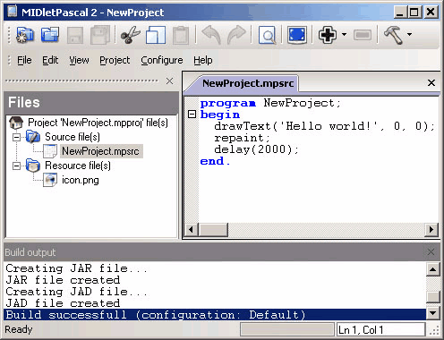
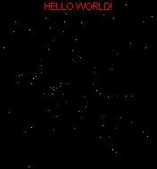
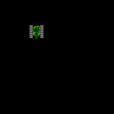
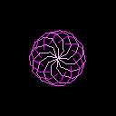

Пишем игры на MIDletPascal
==========================

::: {.date}
01.01.2007
:::

Введение

В последнее время, игры для мобильных устройств, приобретают всё большую
популярность. В частности, достаточно широко распространены Java игры
для сотовых телефонов. Каждый владелец современного телефона, имеет на
руках готовую игровую платформу, способную развлечь своего хозяина в
любой момент. Именно из-за этого факта, большая часть разработчиков
компьютерных игр переметнула на рынок мобильных устройств...

Итак, "нормальные" люди пишут Java игры естественно на языке Java
(J2ME). Но т.к. цели у нас пока не слишком грандиозные... идём выбирать
что-нибудь проще. Из наиболее простых языков (надстроек) знаю лишь два:
Mobile BASIC и MIDletPascal. Как раз о последнем и пойдёт речь в данной
статье, т.к. он имеет хоть и скудные, но более продвинутые возможности в
отличии от первого.

Материал данной статьи не является полным описанием возможностей
MIDletPascal, это более похоже на вводный курс, демонстрирующий
применение наиболее необходимых для написания игр возможностей языка.

Установка и настройка

{.center}

Прежде чем начать, нам необходимо иметь 2 вещи: компилятор и эмулятор.
Первый предназначен для компиляции Pascal кода в Java байткод. А при
помощи второго мы будем лицезреть наши достижения не "тревожа", по
пустякам, телефон...

Пишем на MIDletPascal следовательно компилятор берём с официального
сайта http://midletpascal.com. На момент написания данного материала,
последней версией считалась "MIDletPascal, Version 2.02" за 14 января
2006 г.

Эмулятором будет "Kwyshell MidpX Emulator".Для тех, кто не хочет качать
среду интегрирующуюся в explorer и портящую его внешнюю красоту своими
безобразными кнопками с такими же безобразными иконками советую скачать
урезанную его версию :)

Итак, первым делом нам необходимо установить сам MIDletPascal. После
успешного окончания установки, запускаем его и приступаем к настройке
работы с эмулятором. Для этого заходим в пункт меню "Configure --
Program options..." и во вкладке "Emulator" добавляем новый (или
изменяем свойства стандартного). В "Run command" необходимо прописать
путь к скачанному нами эмулятору и параметры его запуска. Эта строка
должна выглядеть приблизительно так "C:\\MP\\Midp2Exe.exe -jar %JAR%
-r". Сохраняем изменения и возвращаемся к главному окну программы.

Теперь всё готово для начала работы в новой для нас среде. Создаём новый
шаблон проекта "File -- New Project...". Выбрав имя будущего проекта и
его месторасположение на диске, жмём на "Create". В окне редактора
появится банальный код банальной до слёз программы выводящей "Hello
world!". Можно скомпилировать и запустить мидлет нажатием "F9", ничего
сверхъестественного мы не увидим, но будет приятно когда хоть что-то
аналогичное "созданное Вами" запустится на любимой моторолке, нокии или
что там у Вас...

Первая программа

{.center}

Я надеюсь, что Вы не впервые сели за Pascal и хоть какой-то опыт
написания программ на этом замечательном языке у Вас имеется, так что
давайте попробуем написать "продвинутый Hello World!" попутно разучив
методы работы с некоторыми функциями и принцип написания мидлетов
вцелом.

Темой будет звёздное небо (аналог стандартной заставки в Windows) и
парящий над ним (сами знаете какой) текст...

 

    program Hello;
    type
    // Описываем тип-элемент Звезда
    TStar = record
    X, Y, Z : Integer; // Положение в пространстве
    end;
    const
    MAX_STARS = 150; // Кол-во звёздочек
    HELLO = 'HELLO WORLD!'; // "Та самая надпись" :)
    SPEED = 200; // Скорость, в единицах/сек
    var
    i : Integer;
    // Наши звёздочки :) 
    Stars : array [1..MAX_STARS] of TStar;
    // Ширина и высота дисплея
    scr_W : Integer;
    scr_H : Integer;
    // Время
    time, dt : Integer;
    // Рисует текущую звёздочку (i), цвета (c)
    procedure SetPix(c: Integer);
    var
    sx, sy : Integer;
    begin
    // Данные действия, проецируют 3D точку на 2D полоскость дисплея
    sx := trunc(scr_W / 2 + Stars[i].X * 200 / (Stars[i].Z + 200));
    sy := trunc(scr_H / 2 - Stars[i].Y * 200 / (Stars[i].Z + 200));
    SetColor(c, c, c); // Устанавливаем цвет
    Plot(sx, sy); // Выводим пиксель этого цвета
    end;
    begin
    // Для начала, получим размеры экрана
    scr_W := GetWidth; 
    scr_H := GetHeight;
    // Затем, случайным образом раскидаем звёздочки
    randomize;
    for i := 1 to MAX_STARS do
    begin
    Stars[i].X := random(scr_W * 4) - scr_W * 2;
    Stars[i].Y := random(scr_H * 4) - scr_H * 2;
    Stars[i].Z := random(1900);
    end;
     
    // Очистка содержимого дисплея (чёрный цвет) 
    SetColor(0, 0, 0);
    FillRect(0, 0, scr_W, scr_H); 
     
    time := GetRelativeTimeMs;
    // Главный цикл отрисовки
    repeat
    dt := GetRelativeTimeMs - time; // Сколько мс прошло, с прошлой отрисовки
    time := GetRelativeTimeMs; // Засекаем время
    for i := 1 to MAX_STARS do
    begin
    // Затираем звёздочку с предыдущего кадра
    SetPix(0);
    // Изменяем её позицию в зависимости прошедшего с последней отрисовки времени
    Stars[i].Z := Stars[i].Z - SPEED * dt/1000;
    // Если звезда "улетела" за позицию камеры - генерируем её вдали
    if Stars[i].Z <= -200 then
    begin
    Stars[i].X := random(scr_W * 4) - scr_W * 2;
    Stars[i].Y := random(scr_H * 4) - scr_H * 2;
    Stars[i].Z := 1900; // Откидываем звезду далеко вперёд :)
    end;
    // Рисуем звёздочку в новом положении (цвет зависит от Z координаты)
    SetPix(trunc(255 - 255 * (Stars[i].Z + 200) / 2100));
    end;
    // Выводим текст по центру экрана
    SetColor(255, 0, 0);
    DrawText(HELLO, (scr_W - GetStringWidth(HELLO))/2, 0);
    // Всё что было нами нарисовано - выводим на дисплей
    repaint;
    until GetKeyClicked = KE_KEY0; // Закрыть приложение при нажатии "0"
    end.

Собственно, запустив эту программу на своём телефоне, Вашему счастью не
будет предела.

Вывод спрайтов

{.center}

Рисование точек, эллипсов, прямых это весело по началу. Но вскоре
захочется вставить какой-нибудь рисунок, картинку, спрайт и т.п.

Как раз для этих случаев MIDletPascal имеет в своём распоряжении набор
функций для работы с графикой загруженной из внешних файлов или
ресурсов.

Итак, для опытов с графикой, предлагаю попытаться вспомнить о старой, и
многими уже давно забытой игре на Dendy - \"Battle City\". Для начала
нам понадобится 4 изображения одного и того же танка повёрнутого на углы
pi/2 * n. Эти изображения должны быть в виде png файлов размером 16х16
пикселей, с именами вида tankN.png (где N -- порядковый номер
изображения, начиная с 0). Почему такие мелкие? Да потому, что далеко не
на всех телефонах стоят дисплеи с разрешением выше 128х128 (по крайней
мере, так было на момент написания статьи ;).

 

{.center}

Нарисовав это чудо техники, создадим новый проект, и первым же делом
добавим эти файлы в ресурс при помощи "Project -- Import resource
file...". Наш танк должен уметь ездить по нажатию на соответствующие
клавиши и ни в коем случае не выезжать за пределы поля! Приступим к
написанию кода:

    program Tank;
    const
    SPEED = 1; // Скорость движения танка
    var
    i : Integer;
    // Внешний вид танка при различных углах поворота
    tank : array [0..3] of image;
    dir : Integer; // направление
    X, Y : Integer; // позиция
    key : Integer;
    begin
    // Инициализация
    for i := 0 to 3 do // Подгружаем все картинки из ресурса
    tank[i] := LoadImage('/tank' + chr(48 + i) + '.png'); // 48 - код нуля
    dir := 0; // смотрим строго направо
    X := 32; // позиция танка по X
    Y := 32; // и по Y соответственно :)
     
    // Подготовка поля вывода
    SetColor(0, 0, 0);
    FillRect(0, 0, GetWidth, GetHeight);
     
    // Отрисовка и обработка ввода
    repeat
    // Стираем танк
    FillRect(X, Y, 16,16);
    // Получаем код зажатой клавиши
    key := GetKeyPressed;
    // Вот что бывает, когда нет возможности использовать case ;)
    if key = KE_KEY6 then
    begin
    dir := 0;
    X := X + SPEED;
    end else
    if key = KE_KEY8 then
    begin
    dir := 1;
    Y := Y + SPEED;
    end else
    if key = KE_KEY4 then
    begin
    dir := 2;
    X := X - SPEED;
    end else
    if key = KE_KEY2 then
    begin
    dir := 3;
    Y := Y - SPEED;
    end;
    // контролируем выход за границы экрана
    if X < 0 then X := 0;
    if Y < 0 then Y := 0;
    if X > GetWidth - 16 then X := GetWidth - 16;
    if Y > GetHeight - 16 then Y := GetHeight - 16;
    // Рисуем танк новой позиции
    DrawImage(tank[dir], X, Y);
    // Вывод этого безобразия на экран и задержка на 20 мс 
    repaint; 
    delay(20);
    until GetKeyClicked = KE_KEY0; // Закрыть приложение при нажатии "0"
    end.

Целью написания полноценной игры я не задавался, так что оставлю врагов,
стрельбу и препятствия на Вашей совести... ;)

Звук и Музыка

{.center}

Игры, как правило, состоят не только из поочерёдно сменяющихся картинок,
но и имеют хоть какое-то, но звуковое сопровождение. MIDletPascal
поддерживает проигрывание всего одного аудиопотока! Т.е. слышать звук
разрывающихся снарядов, под пятую сонату Бетховена не получится. Это
есть жирный минус и один из многих камней в огород MIDletPascal.
Впрочем, разработчики оставили возможность подключения своих модулей
написанных на Java... но мы же пишем на Pascal! ;)

Итак, мы имеем возможность проигрывания midi, wav, mp3 и au файлов. Но в
то же время, накладываются ограничения самого телефона, и об этом не
стоит забывать. Существует возможность loop'инга, т.е. проигрывания
одного и того же звука несколько раз подряд.

Прежде чем что-либо писать, необходимо найти какой-нибудь midi файл, и
обозвав его "music.mid" добавить в ресурс проекта. Теперь можно
приступать к написанию кода. Далее опишу код простой программки
выводящей пучок "болтающихся под музыку щупалец", заодно познакомив с
некоторыми математическими функциями:

    program vis;
    const
    S = 12; // Кол-во щупалец
    N = 8; // Кол-во звеньев в каждом из них
    var
    i, j : Integer;
    x, y : Real;
    tx, ty : Real;
    k, d : Real;
    // Углы поворота звеньев относительно друг-друга
    a : array [1..N] of Real;
    // Длина одного звена
    len : Real;
     
    begin
    // Инициализация звука
    if not OpenPlayer('/music.mid', 'audio/midi') then // загрузка музыки
    Halt; // ошибка при загрузке (не поддерживается midi формат или звук отключен)
    if not SetPlayerCount(-1) then // проигрывать бесконечное число раз 
    Halt;
    if not StartPlayer then // начать проигрывание
    Halt;
    // Нам необходимо создать что-то графическое...
    // Расчёт длины звена, в зависимости от размеров экрана
    if GetWidth > GetHeight then
    len := GetHeight/2/N
    else
    len := GetWidth/2/N;
    randomize;
    k := random(360) * pi / 180;
    d := pi * 2 / S; // просто оптимизиация
    // Главный цикл
    repeat
    // Расчёт коэфицента поворота
    if random(50) = 0 then
    k := random(360) * pi / 180;
    // Поворот всех щупалец
    a[1] := a[1] + sin(k)/10;
    // Интерполяция углов между щупальцами
    for i := 2 to N do
    a[i] := a[i] + (a[i - 1] - a[i]) * 0.1;
    // Рисуем результат (под музыку ;)
    SetColor(0, 0, 0);
    FillRect(0, 0, GetWidth, GetHeight); // Стираем всё
    for j := 0 to S - 1 do
    begin
    x := 0.5 * GetWidth;
    y := 0.5 * GetHeight;
    for i := 2 to N do
    begin
    SetColor(255, trunc(255 - 255 * i/N), 255);
    // Немного школьной тригонометрии :) 
    tx := x + cos(j * d + a[i]) * len;
    ty := y + sin(j * d + a[i]) * len;
    DrawLine(trunc(x), trunc(y), trunc(tx), trunc(ty));
    x := tx;
    y := ty;
    end;
    end;
    // Вывод на дисплей
    repaint;
    until GetKeyClicked = KE_KEY0; // Закрыть приложение при нажатии "0"
    StopPlayer;
    end.

Самыми медленными операциями в этой программе являются вызовы
тригонометрических функций (sin и cos). Существует возможность их
оптимизации при помощи использования заранее рассчитанных таблиц
значений. Помимо этого, скорость работы данного приложения на различных
телефонах может быть различной...

Заключение

Хочу сказать несколько слов по поводу MIDletPascal IDE... До Delphi IDE
ему, конечно же, дальше некуда, и постоянно выскакивающие ошибки при
компиляции, суть которых не понятна (часто обычный pascal код разобрать
не может :) Но вцелом, среда достаточно удобная. Сам язык является по
сути "обрезанным" паскалем. Имеются записи (record), массивы (array) и
другие полезные "штучки", но никакого ООП присущего той же Java не
имеется. Т.е. язык по сути является обычным процедурным паскалем без
некоторых операторов (case например)

Также имеются дополнительные возможности, такие как: работа с HTTP,
отправка SMS, стандартный пользовательский интерфейс, подключение Java
модулей и др. Но при серьёзном подходе к написанию мидлетов,
MIDletPascal будет ограничивать Вас везде, куда бы Вы ни сунулись... ;)

Ссылки по теме

\- http://mobilebasic.com
- http://midletpascal.com

\- <https://www.j2meforums.com/yabbse/index.php?board=4>

<https://www.mirgames.ru>

XProger
