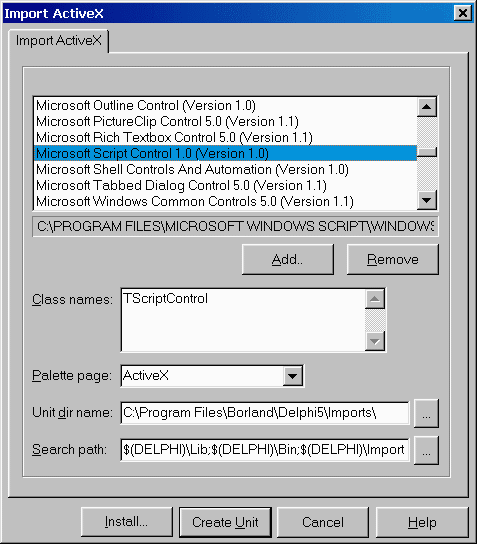

Использование Microsoft ScriptControl
=====================================

::: {.date}
01.01.2007
:::

Анатолий Тенцер

**Содержание**

- Введение
- Добавление TScriptControl в программу
    - Импорт ActiveX-сервера
    - Настройка свойств и вызов скриптов
- Интеграция TScriptControl с VCL
    - Модель расширения TScriptControl
    - Интерфейс IDispatch
    - function GetIdsOfNames
    - function Invoke
- Информация RTTI Delphi
    - Сводим воедино
    - Пишем GetIdsOfNames
    - Пишем Invoke
- Оператор For Each
    - Интерфейс IEnumVariant
    - Класс TVCLEnumerator
- Компонент TVCLScriptControl
- Заключение

## Введение

При разработке настраиваемых информационных систем часто возникает
необходимость добавить в свою программу встроенный язык
программирования. Такой язык позволял бы конечным пользователям
настраивать поведение программы без участия автора и перекомпиляции.
Однако самостоятельная реализация интерпретатора является непосильной
для многих разработчиков задачей, а от большинства остальных потребует
очень много времени и усилий.

В то же время в Windows, как правило, уже имеется достаточно
качественный интерпретатор, который может быть легко встроен в вашу
программу. Речь идет о Microsoft ScriptControl. Он устанавливается
вместе с Microsoft Internet Explorer, входит в Windows 2000 и Windows
98, а для младших версий доступен в виде свободно распространяемого
отдельного дистрибутива, объем которого составляет около 200 Кбайт. Его
можно получить по адресу http://msdn.microsoft.com/scripting или
установить с нашего компакт-диска. В дистрибутив входят
ActiveX-компонент и файл помощи с описанием его свойств и методов.

## Добавление TScriptControl в программу

### Импорт ActiveX-сервера

Чтобы добавить Microsoft ScriptControl на палитру компонентов Delphi,
необходимо импортировать компонент ActiveX под названием Microsoft
ScriptControl.

{.center}

После этого на закладке ActiveX появится невизуальный компонент
TScriptControl, который можно разместить на форме.

### Настройка свойств и вызов скриптов

Рассмотрим ключевые свойства и методы TScriptControl.

**property Language: String**

Задает язык, интерпретатор которого будет реализовывать компонент. В
стандартной поставке доступны VBScript и JScript, однако, если в вашей
системе установлены расширения Windows Scripting, возможно использование
других языков, таких как Perl или Rexx.

**property Timeout: Integer**

Задает интервал исполнения скрипта, по истечении которого генерируется
ошибка. Значение -1 позволяет отключить ошибки, связанные с истечением
отведенного времени (timeout), что позволит скрипту исполняться
неограниченное время.

**property UseSafeSubset: Boolean**

При установке этого свойства в TRUE компонент может выполнять
ограниченный набор действий, заданный текущими установками безопасности
в системе. Это свойство полезно, если вы запускаете скрипты, полученные,
например, через Интернет.

**procedure AddCode(const Code: WideString);**

Добавляет код, заданный параметром к списку процедур компонента. В
дальнейшем эти процедуры могут быть вызваны при помощи метода Run либо
из других процедур скрипта.

    ScriptControl1.AddCode(Memo1.Text);
    
**function Eval(const Expression: WideString): OleVariant**

Выполняет код, заданный в параметре Expression, и возвращает результат
исполнения. Позволяет выполнить код без добавления его к списку процедур
компонента.

**procedure AddObject(const Name: WideString; Object\_: IDispatch;
AddMembers: WordBool);**

Добавляет объект к пространству имен компонента. Объект должен быть
сервером автоматизации. Добавленный объект доступен как объект в коде
скрипта. Например, если в программе создан Automation сервер
External, реализующий метод DoSomething(Value: Integer), то добавив
объект

    ScriptControl1.AddObject('External', TExternal as IDispatch, FALSE);

мы можем в коде скрипта использовать его следующим образом:

    Dim I
    
    I = 8 + External.DoSomething(8)

**function Run(const ProcedureName: WideString; var Parameters:
PSafeArray): OleVariant;**

Выполняет именованную процедуру из числа ранее добавленных при помощи
метода AddCode. В массиве Parameters могут быть переданы параметры.

**procedure Reset;**

Сбрасывает компонент в начальное состояние, удаляя все добавленные ранее
объекты и код.

Таким образом, TScriptControl представляет собой достаточно гибкую
исполняющую систему с возможностями расширения путем добавления в её
пространство имен серверов автоматизации OLE.

## Интеграция TScriptControl с VCL

В существующем виде возможности TScriptControl сильно ограничены сложным
доступом к классам VCL. Исполнение интерпретируемого кода - это хорошо,
однако хотелось бы иметь возможность обращаться из него к компонентам в
программе, получать и устанавливать их свойства, обрабатывать
возникающие в них события, например следующим образом:

    Sub Main()
      Dim Control
      Control = Self.Controls("Panel2")
      Control.Add "Panel3", "TPanel"
      With Panel3
        .Align = "alTop"
        .BevelOuter = "bvNone"
        .Height = 40
        .Caption = ""
        .Add "Btn", "TButton", True
        With Btn
         .Top = 10
         .Left = .Top
         .Caption = "Click me"
        End With

      End With
    End Sub
    
    Sub Btn_OnClick()
      Dim StatusBar
      Dim Panel
      Dim I
      I = 0
      For Each Panel In StatusBar.Panels
        I = I + 1
        With Panel
          .Text = .Text & " " & CStr(I)
        End With
      Next
    End Sub

Следующая часть главы посвящена реализации такой функциональности,
однако прежде чем приступить к ее исполнению, необходимо более подробно
рассмотреть некоторые механизмы, лежащие в основе модели расширения
TScriptControl и VCL.

### Модель расширения TScriptControl

Как уже было сказано выше, Microsoft ScriptControl позволяет сделать
доступными из скрипта объекты, реализованные в программе при помощи
метода AddObject. При обращении к таким объектам он предполагает, что
они реализуют интерфейс IDispatch и являются, таким образом,
OLE-automation серверами. В Delphi в качестве таких объектов могут выступать
наследники TAutoObject, создать которые можно при помощи мастера,
вызываемого из меню File -\> New -\> ActiveX -\> Automation Object. При
вызове методов этих объектов ScriptControl последовательно вызывает
методы GetIdsOfNames и Invoke их интерфейса IDispatch, что обеспечивает
вызовы соответствующих методов объекта. Однако здесь имеются
определенные сложности:

- По окончании работы с объектом (например, при выходе его за пределы области видимости процедуры скрипта) TScriptControl автоматически вызывает его метод \_Release, что приводит к уничтожению класса Delphi. Таким образом, для каждого класса приходится создавать некий объект-представитель, который бы транслировал вызовы TScriptControl в методы и свойства класса Delphi, а став ненужным - уничтожался, не уничтожая самого класса.

- Функциональность наследников TAutoObject задается на этапе компиляции и не может быть расширена в процессе исполнения программы. Это требует создания отдельных представителей для каждого класса VCL, что очень сложно осуществить, к тому же при этом нельзя использовать классы, не имеющие соответствующего представителя.

Чтобы найти обходные пути для решения этой проблемы, необходимо более
детально вникнуть в реализацию базового интерфейса, лежащего в основе
автоматизации OLE.

### Интерфейс IDispatch

Интерфейс IDispatch обеспечивает возможность позднего связывания, то
есть вызовов методов объектов не по адресам, а по именам на этапе
выполнения программы. Интерфейс определен как:

    type
      IDispatch = interface(IUnknown)
        ['{00020400-0000-0000-C000-000000000046}']
        function GetTypeInfoCount(out Count: Integer): Integer; stdcall;
        function GetTypeInfo(Index, LocaleID: Integer;
          out TypeInfo): Integer; stdcall;
        function GetIDsOfNames(const IID: TGUID; Names: Pointer;
          NameCount, LocaleID: Integer; DispIDs: Pointer): Integer;
          stdcall;
        function Invoke(DispID: Integer; const IID: TGUID;
          LocaleID: Integer; Flags: Word; var Params; VarResult,
          ExcepInfo, ArgErr: Pointer): Integer; stdcall;
      end;

Ключевыми методами интерфейса являются GetIdsOfNames и Invoke.

#### function GetIdsOfNames

Этот метод осуществляет трансляцию имен методов и свойств объекта
автоматизации в целочисленные идентификаторы. Если OLE пытается
разрешить ссылку вида:

    SomeObject.DoSomeThing

то у SomeObject запрашивается интерфейс IDispatch, вызывается метод
GetIdsOfNames, которому передаются ссылка на массив имен, требующих
разрешения в параметре Names, количество имен в параметре NameCount и
региональный контекст в параметре LocaleId. Метод должен заполнить
массив, на который указывает параметр DispIds, значениями
идентификаторов имен. Объект имеет возможность предоставить разные имена
методов для каждого поддерживаемого языка. Если это не требуется -
параметр LocaleId можно игнорировать.

Стандартная реализация IDispatch ищет информацию об именах методов и их
идентификаторах в библиотеке типов объекта, однако программист вполне
может взять эту работу на себя и осуществлять самостоятельную
трансляцию.

#### function Invoke

После получения идентификатора запрошенного метода OLE вызывает функцию
Invoke, передавая в неё:

DispID - Идентификатор вызываемого метода или свойства, полученный от
GetIdsOfNames.

LocaleId - Региональный контекст (тот же, что и в GetIdsOfNames).

Flags - Битовая маска, состоящая из следующих флагов:

    +-----------------------------------+-----------------------------------+
    | Значение                          | Комментарий                       |
    +-----------------------------------+-----------------------------------+
    | DISPATCH\_METHOD                  | Вызывается метод. Если у объекта  |
    |                                   | есть свойство с таким же именем,  |
    |                                   | то будет установлен также флаг    |
    |                                   | DISPATCH\_PROPERTYGET             |
    +-----------------------------------+-----------------------------------+
    | DISPATCH\_PROPERTYGET             | Запрашивается значение свойства   |
    +-----------------------------------+-----------------------------------+
    | DISPATCH\_PROPERTYPUT             | Устанавливается значение свойства |
    +-----------------------------------+-----------------------------------+
    | DISPATCH\_PROPERTYPUTREF          | Параметр передается по ссылке.    |
    |                                   | Если флаг не установлен - по      |
    |                                   | значению.                         |
    +-----------------------------------+-----------------------------------+

Params - Структура DISPPARAMS, содержащая массив параметров, массив
идентификаторов для именованных параметров и количества элементов в этих
массивах. Параметры передаются в порядке, обратном порядку их следования
в функции, как это принято в Visual Basic.

VarResult - Адрес переменной типа OleVariant, в которую должны быть помещены
результат вызова метода, или значение свойства, или NIL, если возвращаемое
значение не требуется.

ExcepInfo - Адрес структуры EXCEPTINFO, которую метод должен заполнить информацией
об ошибке, если она возникнет.

ArgErr - Адрес массива, в который должны быть помещены индексы неверных
параметров, в случае если такая ситуация будет обнаружена.

При вызове Invoke не осуществляется никаких проверок, поэтому в ходе его
самостоятельной реализации необходимо соблюдать аккуратность при работе
с переданными адресами массивов и переменных.

Как видно из описания IDispatch, имеется возможность самостоятельно
реализовать этот интерфейс, динамически преобразуя обращения к объекту
автоматизации в обращения к соответствующим свойствам классов Delphi.

## Информация RTTI Delphi

Delphi имеет свой внутренний протокол, позволяющий осуществлять
обращение к опубликованным (объявленным в секции published) свойствам и
методам класса. Этой цели служат функции модуля TypInfo.pas. Ключевой
является функция

    function GetPropInfo(TypeInfo: PTypeInfo;
      const PropName: String): PPropInfo;

которая позволяет по имени свойства получить адрес структуры PPropInfo,
содержащей информацию о свойстве. В дальнейшем можно получить значение
этого свойства при помощи функций GetXXXProp или установить его
функциями SetXXXProp. При этом будут корректно вызваны функции получения
или установки свойства. Таким образом, по имени свойства можно
определить его наличие и установить или получить его значение. Такая
возможность позволяет создать реализацию IDispatch, динамически
транслирующую обращения к свойствам зарегистрированного в TScriptControl
объекта автоматизации в обращения к свойствам связанного с ним
экземпляра класса VCL.

## Сводим воедино

Итак, как показано выше, RTTI Delphi предоставляет достаточную
функциональность для того, чтобы обеспечить трансляцию вызовов
OLE-Automation в обращения к свойствам компонентов VCL. Для этого
необходимо:

- В методе GetIdsOfNames проверить существование свойства при помощи функции GetPropInfo и, если такое свойство найдено, вернуть какой-нибудь числовой идентификатор. В роли такого идентификатора удобно использовать результат, возвращаемый функцией GetPropInfo.

- В методе Invoke установить или получить значение свойства, используя функции GetXXXProp или SetXXXProp.

Для трансляции вызовов OLE в VCL создадим класс TVCLProxy:

    type
      // Этот интерфейс понадобится для получения ссылки на
      // класс VCL из методов, в которые передается его
      // интерфейс IDispatch
      IQueryPersistent = interface
     ['{26F5B6E1-9DA5-11D3-BCAD-00902759A497}']
        function GetPersistent: TPersistent;
      end;
     
      TVCLProxy = class(TInterfacedObject, IDispatch, IQueryPersistent)
      private
        FOwner: TPersistent;
        FScriptControl: TVCLScriptControl;
        procedure DoCreateControl(AName, AClassName: WideString;
          WithEvents: Boolean)
        function SetVCLProperty(PropInfo: PPropInfo;
          Argument: TVariantArg): HRESULT;
        function GetVCLProperty(PropInfo: PPropInfo; dps: TDispParams;
          PDispIds: PDispIdList; var Value: OleVariant): HRESULT;
        { IDispatch }
        function GetTypeInfoCount(out Count: Integer): HResult; stdcall;
        function GetTypeInfo(Index, LocaleID: Integer;
          out TypeInfo): HResult; stdcall;
        function GetIDsOfNames(const IID: TGUID; Names: Pointer;
          NameCount, LocaleID: Integer;
          DispIDs: Pointer): HResult; stdcall;
        function Invoke(DispID: Integer; const IID: TGUID;
          LocaleID: Integer; Flags: Word; var Params;
          VarResult, ExcepInfo, ArgErr: Pointer): HResult; stdcall;
        { IQueryPersistent }
        function GetPersistent: TPersistent;
      protected
        function DoInvoke (DispID: Integer; const IID: TGUID;
          LocaleID: Integer; Flags: Word; var dps : TDispParams;
          pDispIds : PDispIdList; VarResult, ExcepInfo,
          ArgErr: Pointer): HResult; virtual;
      public
        constructor Create(AOwner: TPersistent;
          ScriptControl: TVCLScriptControl);
        destructor Destroy; override;
      end;

Экземпляр этого класса создается при регистрации объекта в
TScriptControl и уничтожается автоматически, когда потребность в нем
исчезает.

Поле FOwner хранит ссылку на экземпляр класса VCL, интерфейс к которому
предоставляет объект, зарегистрированный в TScriptControl.
TVCLScriptControl - это наследник TScriptControl.

Главным его отличием является наличие списка зарегистрированных
экземпляров TVCLProxy и обработчиков событий, позволяющих компонентам
VCL вызывать методы скрипта.

Здесь рассмотрены лишь ключевые моменты реализации, полный код, вместе с
примером использования, приведен на компакт диске.

 

Пишем GetIdsOfNames

В методе GetIdsOfNames мы должны проверить наличие запрошенного свойства
и вернуть адрес его структуры TPropInfo, если такое свойство найдено.

Свойства компонентов VCL

    function TVCLProxy.GetIDsOfNames(const IID: TGUID; Names: Pointer;
      NameCount, LocaleID: Integer; DispIDs: Pointer): HResult;
    var
      S: String;
      Info: PPropInfo;
    begin
      Result := S_OK;
      // Получаем имя функции или свойства
      S := PNamesArray(Names)[0];
      // Проверяем, есть ли VCL свойство с таким-же именем
      Info := GetPropInfo(FOwner.ClassInfo, S);
      if Assigned(Info) then begin
        // Свойство есть, возвращаем в качестве DispId
        // адрес структуры PropInfo
        PDispIdsArray(DispIds)[0] := Integer(Info);
      end

Дополнительные функции

Дополним нашу реализацию возможностью вызова некоторых дополнительных
функций:

Controls
: Для наследников TWinControl возвращает ссылку на дочерний компонент с
именем или индексом, заданным в параметре.

Count:
: Для компонентов TWinControl - возвращает количество дочерних
компонентов.  
Для TCollection - возвращает количество элементов.  
Для TStrings - возвращает количество строк.

Add
: Для компонентов TWinControl - создает дочерний компонент.  
Для TCollection - добавляет элемент в коллекцию.  
Для TStrings - добавляет строку.

HasProperty
: Возвращает истину, если у объекта есть свойство с заданным именем.

Для этого дополним метод GetIdsOfNames следующим кодом:

      else
      // Нет такого свойства, проверяем, не имя ли это
      // одной из определенных нами функций
      if CompareText(S, 'CONTROLS') = 0 then begin
        if (FOwner is TWinControl) then
          PDispIdsArray(DispIds)[0] := DISPID_CONTROLS
        else
          Result := DISP_E_UNKNOWNNAME;
      end
      else
      if CompareText(S, 'COUNT') = 0 then begin
        if (FOwner is TCollection) or (FOwner is TStrings)
           or (FOwner is TWinControl) then
          PDispIdsArray(DispIds)[0] := DISPID_COUNT
        else
          Result := DISP_E_UNKNOWNNAME;
      end
      else
      if CompareText(S, 'ADD') = 0 then begin
        Result := S_OK;
        if (FOwner is TCollection) or (FOwner is TStrings) or
           (FOwner is TWinControl) then
          PDispIdsArray(DispIds)[0] := DISPID_ADD
        else
          Result := DISP_E_UNKNOWNNAME;
      end
      else
      if CompareText(S, 'HASPROPERTY') = 0 then
        PDispIdsArray(DispIds)[0] := DISPID_HASPROPERTY
      else
        Result := DISP_E_UNKNOWNNAME;
    end;

Константы DISPID\_CONTROLS, DISPID\_COUNT и т.д. определены как целые
числа из диапазона 1 ... 1 000 000. Это вполне безопасно, поскольку адрес
структуры TPropInfo никак не может оказаться менее 1 Мбайт.

### Пишем Invoke

Первая часть задачи выполнена: мы проинформировали OLE о наличии в нашем
сервере автоматизации поддерживаемых функций. Теперь необходимо
реализовать метод Invoke для выполнения этих функций. Из соображений
модульности Invoke выполняет подготовительную работу со списком
параметров и вызывает метод DoInvoke, в котором мы осуществляем
трансляцию DispID в обращения к методам класса VCL.

В методе используются три служебные функции:

CheckArgCount - проверяет количество переданных аргументов.

\_ValidType - проверяет соответствие аргумента с заданным индексом
заданному типу.

\_IntValue - получает целое число из аргумента с заданным индексом.

    function TVCLProxy.DoInvoke(DispID: Integer; const IID: TGUID;
      LocaleID: Integer; Flags: Word; var dps: TDispParams;
      pDispIds: PDispIdList; VarResult, ExcepInfo, ArgErr: Pointer
      ): HResult;
    var
      S: String;
      Put: Boolean;
      I: Integer;
      P: TPersistent;
      B: Boolean;
      OutValue: OleVariant;
    begin
      Result := S_OK;
      case DispId of

Для функции Controls мы должны проверить, что передан один параметр.
Если он строковый - поиск дочернего компонента будет происходить по
имени, в противном случае - по индексу. Если компонент найден -
вызывается функция FScriptControl.GetProxy, которая проверяет наличие
«представителя» у этого компонента, при необходимости создает его и
возвращает интерфейс IDispatch. Такой алгоритм необходим для корректной
работы оператора VBScript Is, который сравнивает две ссылки на объект и
выдает истину в случае, если речь идет об одном и том же объекте,
например:

    Dim A
    Dim B
    Set A = C
    Set B = C
    If A is B Then ...

Если создавать экземпляр класса TVCLProxy каждый раз, когда
запрашивается ссылка, эти экземпляры окажутся разными, и оператор Is не
будет работать.

       DISPID_CONTROLS:
          begin  // Вызвана функция Controls
            with FOwner as TWinControl do
            begin
              // Проверяем параметр
              CheckArgCount(dps.cArgs, [1], TRUE);
              P := NIL;
              if _ValidType(0, VT_BSTR, FALSE) then begin
                // Если параметр - строка - ищем дочерний компонент
                // с таким именем
                S := dps.rgvarg^[pDispIds^[0]].bstrVal;
                for I := 0 to Pred(ControlCount) do
                  if CompareText(S, Controls[I].Name) = 0 then begin
                    P := Controls[I];
                    Break;
                  end;
              end else begin
                // Иначе - параметр - число, берем компонент по индексу
                I := _IntValue(0);
                P := Controls[I];
              end;
              if not Assigned(P) then
                // Компонент не найден
                raise EInvalidParamType.Create('');
              // Возвращаем интерфейс IDispatch для найденного компонента
              OleVariant(VarResult^) := FScriptControl.GetProxy(P);
            end;
          end;

Функция Count должна вызываться без параметров и призвана возвращать
количество элементов в запрашиваемом объекте.

       DISPID_COUNT:
          begin // Вызвана функция Count
            // Проверяем, что не было параметров
            CheckArgCount(dps.cArgs, [0], TRUE);
            if FOwner is TWinControl then
              // Возвращаем количество дочерних компонентов
              OleVariant(VarResult^) := TWinControl(FOwner).ControlCount;
            else
            if FOwner is TCollection then
              // Возвращаем количество элементов коллекции
              OleVariant(VarResult^) := TCollection(FOwner).Count
            else
            if FOwner is TStrings then
              // Возвращаем количество строк
              OleVariant(VarResult^) := TStrings(FOwner).Count;
          end;

Метод Add добавляет элемент к объекту-владельцу «представителя».
Обратите внимание на реализацию необязательных параметров для
TWinControl и TStrings.

       DISPID_ADD:
          begin  // Вызвана функция Add
            if FOwner is TWinControl then begin
              // Проверяем количество аргументов
              CheckArgCount(dps.cArgs, [2,3], TRUE);
              // Проверяем типы обязательных аргументов
              _ValidType(0, VT_BSTR, TRUE);
              _ValidType(1, VT_BSTR, TRUE);
              // Третий аргумент - необязательный, если он не задан -
              // полагаем FALSE
              if (dps.cArgs = 3) and _ValidType(2, VT_BOOL, TRUE) then
                B := dps.rgvarg^[pDispIds^[0]].vbool
              else
                B := FALSE;
              // Вызываем метод для создания компонента
              DoCreateControl(dps.rgvarg^[pDispIds^[0]].bstrVal,
                dps.rgvarg^[pDispIds^[1]].bstrVal, B);
            end
            else
            if FOwner is TCollection then begin
              // Добавляем компонент
              P := TCollection(FOwner).Add;
              // И возвращаем его интерфейс IDispatch
              OleVariant(varResult^) := FScriptControl.GetProxy(P);
            end
            else
            if FOwner is TStrings then begin
              // Проверяем наличие аргументов
              CheckArgCount(dps.cArgs, [1,2], TRUE);
              // Проверяем, что аргумент – строка
              _ValidType(0, VT_BSTR, TRUE);
              if dps.cArgs = 2 then
                // Второй аргумент - позиция в списке
                I := _IntValue(1)
              else
                // Если его нету - вставляем в конец
                I := TStrings(FOwner).Count;
              // Добавляем строку
              TStrings(FOwner).Insert(I,
                dps.rgvarg^[pDispIds^[0]].bstrVal);
            end;
          end;

И наконец, функция HasProperty проверяет наличие у объекта VCL
опубликованного свойства с заданным именем.

       DISPID_HASPROPERTY:
         begin // Вызвана функция HasProperty
            // Проверяем наличие аргумента
            CheckArgCount(dps.cArgs, [1], TRUE);
            // Проверяем тип аргумента
            _ValidType(0, VT_BSTR, TRUE);
            S := dps.rgvarg^[pDispIds^[0]].bstrVal;
            // Возвращаем True, если свойство есть
            OleVariant(varResult^) :=
              Assigned(GetPropInfo(FOwner.ClassInfo, S));
          end;

Если ни один из DispID не обработан - значит DispID содержит адрес
структуры TPropInfo свойства VCL

      else
        // Это не наша функция, значит это свойство
        // Проверяем Flags, чтобы узнать устанавливается значение
        // или получается
        Put := (Flags and DISPATCH_PROPERTYPUT) <> 0;
        if Put then begin
          // Устанавливаем значение
          // Проверяем наличие аргумента
          CheckArgCount(dps.cArgs, [1], TRUE);
          // И устанавливаем свойство
          Result := SetVCLProperty(PPropInfo(DispId),
            dps.rgvarg^[pDispIds^[0]])
        end
        else
        begin
          // Получаем значение
          if DispId = 0 then begin
            // DispId = 0 - требуется свойство по умолчанию
            // Возвращаем свой IDispatch
            OleVariant(VarResult^) := Self as IDispatch;
            Exit;
          end;
          // Получаем значение свойства
          Result := GetVCLProperty(PPropInfo(DispId),
            dps, pDispIds, OutValue);
          if Result = S_OK then
            // Получили успешно - сохраняем результат
            OleVariant(VarResult^) := OutValue;
        end;
      end;
    end;

### Добавление собственных функций

Для добавления функций, которые требуются для решения ваших задач,
необходимо выполнить ряд простых шагов:

1.  В методе GetIdsOfNames проанализировать имя запрашиваемой функции и определить, может ли она быть вызвана для объекта, на который ссылается FOwner.

2.  Если функция может быть вызвана, вы должны вернуть уникальный DispID, в противном случае - присвоить Result := DISP\_E\_UNKNOWNNAME.

3.  В методе Invoke необходимо обнаружить свой DispID, проверить корректность переданных параметров, получить их значения и выполнить действие.

### Обработка событий в компонентах VCL

Важным дополнением к реализуемой функциональности является возможность
ассоциировать процедуру на VBScript с событием в компоненте VCL, таким
как OnEnter, OnClick или OnTimer. Для этого добавим в компонент
TVCLScriptControl методы, которые будут служить обработчиками созданных
в коде скрипта компонентов.

      TVCLScriptControl = class(TScriptControl)
      …
      published
        procedure OnChangeHandler(Sender: TObject);
        procedure OnClickHandler(Sender: TObject);
        procedure OnEnterHandler(Sender: TObject);
        procedure OnExitHandler(Sender: TObject);
        procedure OnTimerHandler(Sender: TObject);
      end;

В методе DoCreateControl, который вызывается из DoInvoke при обработке
метода «Add», реализуем подключение соответствующих обработчиков событий
создаваемого компонента к созданным методам.

    procedure TVCLProxy.DoCreateControl(AName, AClassName: WideString;
      WithEvents: Boolean);
     
      procedure SetHandler(Control: TPersistent; Owner: TObject;
        Name: String);
        // Функция устанавливает обработчик события Name на метод формы
        // с именем Name + 'Handler'
      var
        Method: TMethod;
        PropInfo: PPropInfo;
      begin
        // Получаем информацию RTTI
        PropInfo := GetPropInfo(Control.ClassInfo, Name);
        if Assigned(PropInfo) then begin
          // Получаем адрес обработчика
          Method.Code := FScriptControl.MethodAddress(Name + 'Handler');
          if Assigned(Method.Code) then begin
            // Обработчик есть
            Method.Data := FScriptControl;
            // Устанавливаем обработчик
            SetMethodProp(Control, PropInfo, Method);
          end;
        end;
      end;
    var
      ThisClass: TControlClass;
      C: TComponent;
      NewOwner: TCustomForm;
    begin
      // Назначаем свойство Owner на форму
      if not (FOwner is TCustomForm) then
        NewOwner := GetParentForm(FOwner as TControl)
      else
        NewOwner := FOwner as TCustomForm;
      // Получаем класс создаваемого компонента
      ThisClass := TControlClass(GetClass(AClassName));
      // Создаем компонент
      C := ThisClass.Create(NewOwner);
      // Назначаем имя
      C.Name := AName;
      if C is TControl then
        // Назначаем свойство Parent
        TControl(C).Parent := FOwner as TWinControl;
      if WithEvents then begin
        // Устанавливаем обработчики
        SetHandler(C, NewOwner, 'OnClick');
        SetHandler(C, NewOwner, 'OnChange');
        SetHandler(C, NewOwner, 'OnEnter');
        SetHandler(C, NewOwner, 'OnExit');
        SetHandler(C, NewOwner, 'OnTimer');
      end;
      // Создаем класс реализующий интерфейс IDispatch и добавляем его
      // в пространство имен TScriptControl
      FScriptControl.RegisterClass(AName, C);
    end;

Таким образом, если третьим параметром метода «Add» будет задано True,
то TVCLScriptControl установит обработчики событий OnClick, OnChange,
OnEnter, OnExit и OnTimer на свои методы, реализованные следующим
образом:

    procedure TVCLScriptControl.OnClickHandler(Sender: TObject);
    begin
      RunProc((Sender as TComponent).Name + '_' + 'OnClick');
    end;

Примером использования данной функциональности может служить следующий
код:

    Sub Main()
      Self.Add "Timer1", "TTimer", True
      With Timer1
        .Interval = 1000
        .Enabled = True
      End With
    End Sub
    Sub Timer1_OnTimer()
      Self.Caption = CStr(Time)
    End Sub

Если требуется назначить обработчики событий, имеющихся на форме
компонентов, это может быть сделано в коде

    Button1.OnClick := ScriptControl1.OnClickHandler; 

или путем реализации соответствующего метода в GetIdsOfNames и Invoke.

#### Получение свойств

Для получения свойств классов VCL служит метод GetVCLProperty. В нем
осуществляется трансляция типов данных Object Pascal в типы данных OLE.

    function TVCLProxy.GetVCLProperty(PropInfo: PPropInfo;
      dps: TDispParams; PDispIds: PDispIdList; var Value: OleVariant
      ): HResult;
    var
      I, J, K: Integer;
      S: String;
      P, P1: TPersistent;
      Data: PTypeData;
      DT: TDateTime;
      TypeInfo: PTypeInfo;
    begin
      Result := S_OK;
      case PropInfo^.PropType^.Kind of

Для данных строкового и целого типа Delphi осуществляет автоматическую
трансляцию

        tkString, tkLString, tkWChar, tkWString:
          // Символьная строка
          Value := GetStrProp(FOwner, PropInfo);
        tkChar, tkInteger:
          // Целое число
          Value := GetOrdProp(FOwner, PropInfo);

Для перечисляемых типов OLE не имеет прямых аналогов. Поэтому для всех
типов, кроме Boolean, будем передавать символьную строку с именем
соответствующей константы. Для Boolean имеется подходящий тип данных, и
этот случай необходимо обрабатывать отдельно.

        tkEnumeration:
          begin
            // Проверяем, не Boolean ли это
            if CompareText(PropInfo^.PropType^.Name, 'BOOLEAN') = 0 then
              // Передаем как Boolean
              Value := Boolean(GetOrdProp(FOwner, PropInfo));
            else begin
              // Остальные - передаем как строку
              I := GetOrdProp(FOwner, PropInfo);
              Value := GetEnumName(PropInfo^.PropType^, I);
            end;
          end;

Самым сложным случаем является свойство объектного типа. Нормальным
поведением будет возврат интерфейса IDispatch, позволяющего OLE
обращаться к методам класса, на который ссылается свойство. Однако для
некоторых классов, имеющих свойства «по умолчанию», таких как TStrings и
TСollection, свойство может быть запрошено с индексом. В этом случае
следует выдать соответствующий индексу элемент. В то же время, будучи
запрошенным без индекса, свойство должно выдать интерфейс IDispatch для
работы с экземпляром TCollection или TStrings.

        tkClass:
          begin
            // Получаем значение свойства
            P := TPersistent(GetOrdProp(FOwner, PropInfo));
            if Assigned(P) and (P is TCollection)
               and (dps.cArgs = 1) then begin
              // Запрошен элемент коллекции с индексом (есть параметр)
              if ValidType(dps.rgvarg^[pDispIds^[0]], VT_BSTR,
                  FALSE) then begin
                // Параметр строковый, ищем элемент по свойству
                // DisplayName
                S := dps.rgvarg^[pDispIds^[0]].bstrVal;
                P1 := NIL;
                for I := 0 to Pred(TCollection(P).Count) do
                  if CompareText(S,
                    TCollection(P).Items[I].DisplayName)  = 0 then begin
                    P1 := TCollection(P).Items[I];
                    Break;
                  end;
                if Assigned(P1) then
                  // Найден - возвращаем интерфейс IDispatch
                  Value := FScriptControl.GetProxy(P1)
                else
                  // Не найден
                  Result := DISP_E_MEMBERNOTFOUND;
              end else begin
                // Параметр целый, возвращаем элемент по индексу
                I := IntValue(dps.rgvarg^[pDispIds^[0]]);
                if (I >= 0) and (I < TCollection(P).Count) then begin
                  P := TCollection(P).Items[I];
                  Value := FScriptControl.GetProxy(P);
                end else
                  Result := DISP_E_MEMBERNOTFOUND;
              end;
            end

Для класса TStrings результатом будет не интерфейс, а строка, выбранная
по имени или по индексу.

            else
            if Assigned(P) and (P is TStrings) and (dps.cArgs = 1) then
            begin
              // Запрошен элемент из Strings с индексом (есть параметр)
              if ValidType(dps.rgvarg^[pDispIds^[0]], VT_BSTR,
                FALSE) then begin
                // Параметр строковый - возвращаем значение свойства
                // Values
                S := dps.rgvarg^[pDispIds^[0]].bstrVal;
                Value := TStrings(P).Values[S];
              end else begin
                // Параметр целый, возвращаем строку по индексу
                I := IntValue(dps.rgvarg^[pDispIds^[0]]);
                if (I >= 0) and (I < TStrings(P).Count) then
                  Value := TStrings(P)[I]
                else
                  Result := DISP_E_MEMBERNOTFOUND;
              end;
            end
            else
              // Общий случай, возвращаем интерфейс IDispatch свойства
              if Assigned(P) then
                Value := FScriptControl.GetProxy(P)
              else
                // Или Unassigned, если оно = NIL
                Value := Unassigned;
          end;

У чисел с плавающей точкой также есть особенный тип данных - TDateTime.
Его необходимо обрабатывать иначе, чем остальные числа с плавающей
точкой, поскольку у него в OLE есть отдельный тип данных - OleDate.

        tkFloat:
          begin
            if (PropInfo^.PropType^ = System.TypeInfo(TDateTime)) or
               (PropInfo^.PropType^ = System.TypeInfo(TDate)) then
            begin
              // Помещаем значение свойства в промежуточную
              // переменную типа TDateTime
              DT := GetFloatProp(FOwner, PropInfo);
              Value := DT;
            end else
              Value := GetFloatProp(FOwner, PropInfo);
          end;

В случае свойства типа «набор» (Set), не имеющего аналогов в OLE, будем
возвращать строку с установленными значениями набора, перечисленными
через запятую.

        tkSet:
          begin
            // Получаем значение свойства (битовая маска)
            I := GetOrdProp(FOwner, PropInfo);
            // Получаем информацию RTTI
            Data := GetTypeData(PropInfo^.PropType^);
            TypeInfo := Data^.CompType^;
            // Формируем строку с набором значений
            S := '';
            if I <> 0 then begin
              for K := 0 to 31 do begin
                J := 1 shl K;
                if (J and I) = J then
                  S := S + GetEnumName(TypeInfo, K) + ',';
              end;
              // Удаляем запятую в конце
              System.Delete(S, Length(S), 1);
            end;
            Value := S;
          end;

И наконец, с типом Variant не возникает никаких сложностей.

        tkVariant:
          Value := GetVariantProp(FOwner, PropInfo);
      else
        // Остальные типы не поддерживаются
        Result := DISP_E_MEMBERNOTFOUND;
      end;
    end;

### Установка свойств

Для установки свойств классов VCL служит метод SetVCLProperty. В нем
осуществляется обратная трансляция типов данных OLE в типы данных Object
Pascal.

    function TVCLProxy.SetVCLProperty(PropInfo: PPropInfo;
      Argument: TVariantArg): HResult;
    var
      I, J, K, CommaPos: Integer;
      GoodToken: Boolean;
      S, S1: String;
      DT: TDateTime;
      ST: TSystemTime;
      IP: IQueryPersistent;
      Data, TypeData: PTypeData;
      TypeInfo: PTypeInfo;
    begin
      Result := S_OK;
      case PropInfo^.PropType^.Kind of

Главным отличием этого метода от SetVCLProperty является необходимость
проверки типа данных передаваемого параметра.

        tkChar, tkString, tkLString, tkWChar, tkWString:
          begin
            // Проверяем тип параметра
            ValidType(Argument, VT_BSTR, TRUE);
            // И устанавливаем свойство
            SetStrProp(FOwner, PropInfo, Argument.bstrVal);
          end;

Для целочисленных свойств добавим еще один сервис (если свойство имеет
тип TCursor или Tcolor) - обеспечим трансляцию символьной строки с
соответствующим названием константы в целочисленный идентификатор.

        tkInteger:
          begin
            // Проверяем тип свойства на TCursor, TColor
            // если он совпадает и передано символьное значение
            // пытаемся получить его идентификатор
            if (CompareText(PropInfo^.PropType^.Name, 'TCURSOR') = 0) and
               (Argument.vt = VT_BSTR) then begin
              if not IdentToCursor(Argument.bstrVal, I) then begin
                Result := DISP_E_BADVARTYPE;
                Exit;
              end;
            end else
            if (CompareText(PropInfo^.PropType^.Name, 'TCOLOR') = 0) and
              (Argument.vt = VT_BSTR) then begin
              if not IdentToColor(Argument.bstrVal, I) then begin
                Result := DISP_E_BADVARTYPE;
                Exit;
              end;
            end else
              // Просто цифра
              I := IntValue(Argument);
            // Устанавливаем свойство
            SetOrdProp(FOwner, PropInfo, I);
          end;

Для перечислимых типов, за исключением Boolean, значение передается в
виде символьной строки, а Boolean, как и раньше, обрабатывается
отдельно.

        tkEnumeration:
          begin
            // Проверяем на тип Boolean - для него в VBScript есть
            // отдельный тип данных
            if CompareText(PropInfo^.PropType^.Name, 'BOOLEAN') = 0 then
            begin
              // Проверяем тип данных аргумента
              ValidType(Argument, VT_BOOL, TRUE);
              // Это свойство Boolean - получаем значение и значение
              SetOrdProp(FOwner, PropInfo, Integer(Argument.vBool));
            end else begin
              // Перечислимый тип передается в виде символьной строки
              // Проверяем тип данных аргумента
              ValidType(Argument, VT_BSTR, TRUE);
              // Получаем значение
              S := Trim(Argument.bstrVal);
              // Переводим в Integer
              I := GetEnumValue(PropInfo^.PropType^, S);
              // Если успешно - устанавливаем свойство
              if I >= 0 then
                SetOrdProp(FOwner, PropInfo, I)
              else
                raise EInvalidParamType.Create('');
            end;
          end;

При установке объектного свойства необходимо получить ссылку на класс
Delphi, представителем которого является переданный интерфейс IDispatch.
Для этой цели служит ранее определенный нами интерфейс IQueryPersistent.
Запросив его у объекта-представителя, мы можем получить ссылку на объект
VCL и корректно установить свойство.

        tkClass:
          begin
            // Проверяем тип данных - должен быть интерфейс IDispatch
            ValidType(Argument, VT_DISPATCH, TRUE);
            if Assigned(Argument.dispVal) then begin
              // Передано непустое значение
              // Получаем интерфейс IQueryPersistent
              IP := IDispatch(Argument.dispVal) as IQueryPersistent;
              // Получаем ссылку на класс, представителем которого
              // является интерфейс
              I := Integer(IP.GetPersistent);
            end else
              // Иначе - очищаем свойство
              I := 0;
            // Устанавливаем значение
            SetOrdProp(FOwner, PropInfo, I);
          end;

Для чисел с плавающей точкой основной проблемой является отработка
свойства типа TDateTime. Дополнительно обеспечим возможность установить
это свойство в виде символьной строки. При установке свойства типа
TDateTime необходимо обеспечить трансляцию его из формата TOleDate в
TDateTime.

       tkFloat:
          begin
            if (PropInfo^.PropType^ = System.TypeInfo(TDateTime)) or
               (PropInfo^.PropType^ = System.TypeInfo(TDate)) then
            begin
              // Проверяем тип данных аргумента
              if Argument.vt = VT_BSTR then begin
                DT := StrToDate(Argument.bstrVal);
              end else begin
                ValidType(Argument, VT_DATE, TRUE);
                if VariantTimeToSystemTime(Argument.date, ST) <> 0 then
                  DT := SystemTimeToDateTime(ST)
                else begin
                  Result := DISP_E_BADVARTYPE;
                  Exit;
                end;
              end;
              SetFloatProp(FOwner, PropInfo, DT);
            end else begin
              // Проверяем тип данных аргумента
              ValidType(Argument, VT_R8, TRUE);
              // Устанавливаем значение
              SetFloatProp(FOwner, PropInfo, Argument.dblVal);
            end;
          end;

Наиболее сложным случаем является установка данных типа «набор» (Set).
Необходимо выделить из переданной символьной строки разделенные запятыми
элементы, для каждого из них - проверить, является ли он допустимым для
устанавливаемого свойства, и установить соответствующий бит в числе,
которое будет установлено в качестве свойства.

       tkSet:
          begin
            // Проверяем тип данных, должна быть символьная строка
            ValidType(Argument, VT_BSTR, TRUE);
            // Получаем данные
            S := Trim(Argument.bstrVal);
            // Получаем информацию RTTI
            Data := GetTypeData(PropInfo^.PropType^);
            TypeInfo := Data^.CompType^;
            TypeData := GetTypeData(TypeInfo);
            I := 0;
            while Length(S) > 0 do begin
              // Проходим по строке, выбирая разделенные запятыми
              // значения идентификаторов
              CommaPos := Pos(',', S);
              if CommaPos = 0 then
                CommaPos := Length(S) + 1;
              S1 := Trim(System.Copy(S, 1, CommaPos - 1));
              System.Delete(S, 1, CommaPos);
              if Length(S1) > 0 then begin
                // Поверяем, какому из допустимых значений соответствует
                // полученный идентификатор
                K := 1;
                GoodToken := FALSE;
                for J := TypeData^.MinValue to TypeData^.MaxValue do
                begin
                  if CompareText(S1, GetEnumName(TypeInfo, J)) = 0 then
                  begin
                    // Идентификатор найден, добавляем его в маску
                    I := I or K;
                    GoodToken := TRUE;
                  end;
                  K := K shl 1;
                end;
                if not GoodToken then begin
                  // Идентификатор не найдет
                  Result := DISP_E_BADVARTYPE;
                  Exit;
                end;
              end;
            end;
            // Устанавливаем значение свойства
            SetOrdProp(FOwner, PropInfo, I);
          end;

Свойство типа Variant устанавливается несложно:

        tkVariant:
          begin
            // Проверяем тип данных аргумента
            ValidType(Argument, VT_VARIANT, TRUE);
            // Устанавливаем значение
            SetVariantProp(FOwner, PropInfo, Argument.pvarVal^);
          end;
       else
         // Остальные типы данных OLE не поддерживаются
         Result := DISP_E_MEMBERNOTFOUND;
      end;
    end;

Таким образом, мы реализовали полную функциональность по трансляции
вызовов OLE в обращения к свойствам VCL. Наш компонент может динамически
создавать другие компоненты на форме, обращаться к их свойствам и даже
обрабатывать возникающие в них события.

### Оператор For Each

Удобным средством, предоставляемым VBScript, является оператор For Each,
организующий цикл по всем элементам заданной коллекции. Добавим
поддержку этого оператора в наш компонент.

#### Интерфейс IEnumVariant

Реализация For Each предусматривает следующее:

- Исполняющее ядро ScriptControl вызывает метод Invoke объекта, по элементам которого должен производиться цикл с DispID = DISPID\_NEWENUM (-4).

- Объект должен вернуть интерфейс IEnumVariant.

- Далее ядро использует методы IEnumVariant для получения элементов коллекции.

Интерфейс IEnumVariant определен как:

    type
      IEnumVariant = interface(IUnknown)
        ['{00020404-0000-0000-C000-000000000046}']
        function Next(celt: LongWord; var rgvar: OleVariant;
          pceltFetched: PLongWord): HResult; stdcall;
        function Skip(celt: LongWord): HResult; stdcall;
        function Reset: HResult; stdcall;
        function Clone(out Enum: IEnumVariant): HResult; stdcall;
      end;

В модуле ActiveX.pas в оригинальной поставке Delphi5 ошибочно определен
метод Next

      function Next(celt: LongWord; var rgvar: OleVariant;
         out pceltFetched: LongWord): HResult; stdcall;

поэтому для корректной реализации интерфейс должен быть переопределен.

#### Класс TVCLEnumerator

Создадим класс, инкапсулирующий функциональность IEnumVariant.

    type
      TVCLEnumerator = class(TInterfacedObject, IEnumVariant)
      private
        FEnumPosition: Integer;
        FOwner: TPersistent;
        FScriptControl: TVCLScriptControl;
        { IEnumVariant }
        function Next(celt: LongWord; var rgvar: OleVariant;
          pceltFetched: PLongWord): HResult; stdcall;
        function Skip(celt: LongWord): HResult; stdcall;
        function Reset: HResult; stdcall;
        function Clone(out Enum: IEnumVariant): HResult; stdcall;
      public
        constructor Create(AOwner: TPersistent;
          AScriptControl: TVCLScriptControl);
      end;

Конструктор устанавливает свойства FOwner и FScriptControl.

    constructor TVCLEnumerator.Create(AOwner: TPersistent;
      AScriptControl: TVCLScriptControl);
    begin
      inherited Create;
      FOwner := AOwner;
      FScriptControl := AScriptControl;
      FEnumPosition := 0;
    end;

Метод Reset подготавливает реализацию интерфейса к началу перебора

    function TVCLEnumerator.Reset: HResult;
    begin
      FEnumPosition := 0;
      Result := S_OK;
    end;

Главная функциональность сосредоточена в методе Next, который получает
следующие переменные:

celt - количество запрашиваемых элементов;

rgvar - адрес первого элемента массива переменных типа OleVariant;

pceltFetched - адрес переменной, в которую должно быть записано
количество реально переданных элементов. Этот адрес может быть равен
NIL, в этом случае не потребуется ничего записывать.

Метод должен заполнить запрошенное количество элементов rgvar и вернуть
S\_OK, если это удалось, и S\_FALSE, если элементов не хватило.

    type
      TVariantList = array [0..0] of OleVariant;
     
    function TVCLEnumerator.Next(celt: LongWord; var rgvar: OleVariant;
      pceltFetched: PLongWord): HResult;
    var
      I: Cardinal;
    begin
      Result := S_OK;
      I := 0;

Для объекта TWinControl возвращаем интерфейсы IDispatch для компонентов из свойства Controls

      if FOwner is TWinControl then begin
        with TWinControl(FOwner) do begin
          while (FEnumPosition < ControlCount) and (I < celt) do begin
            TVariantList(rgvar)[I] :=
              FScriptControl.GetProxy(Controls[FEnumPosition]);
            Inc(I);
            Inc(FEnumPosition);
          end;
        end;
      end

Для TCollection организуется перебор элементов коллекции.

      else
      if FOwner is TCollection then begin
        with TCollection(FOwner) do begin
          while (FEnumPosition < Count) and (I < celt) do begin
            TVariantList(rgvar)[I] :=
              FScriptControl.GetProxy(Items[FEnumPosition]);
            Inc(I);
            Inc(FEnumPosition);
          end;
        end;
      end

Для TStrings перебираются строки и возвращаются их значения.

      else
      if FOwner is TStrings then begin
        with TStrings(FOwner) do begin
          while (FEnumPosition < Count) and (I < celt) do begin
            TVariantList(rgvar)[I] := TStrings(FOwner)[FEnumPosition];
            Inc(I);
            Inc(FEnumPosition);
          end;
        end;
      end else
        Result := S_FALSE;
      if I <> celt then
        Result := S_FALSE;
      if Assigned(pceltFetched) then
        pceltFetched^ := I;
    end;

Метод Skip пропускает запрошенное количество элементов и возвращает
S\_OK, если еще остались элементы для перебора.

    function TVCLEnumerator.Skip(celt: LongWord): HResult;
    var
      Total: Integer;
    begin
      Result := S_FALSE;
      if FOwner is TWinControl then
        Total := TWinControl(FOwner).ControlCount
      else
      if FOwner is TCollection then
        Total := TCollection(FOwner).Count
      else
      if FOwner is TStrings then
        Total := TStrings(FOwner).Count
      else
        Exit;
      if FEnumPosition + celt <= Total then begin
        Result := S_OK;
        Inc(FEnumPosition, celt)
      end;
    end;

Метод Clone клонирует объект, возвращая интерфейс его копии.

    function TVCLEnumerator.Clone(out Enum: IEnumVariant): HResult;
    var
      NewEnum: TVCLEnumerator;
    begin
      NewEnum := TVCLEnumerator.Create(FOwner, FScriptControl);
      NewEnum.FEnumPosition := FEnumPosition;
      Enum := NewEnum as IEnumVariant;
      Result := S_OK;
    end;

Для того чтобы класс TVCLProxy мог вернуть интерфейс IEnumVariant,
требуется дополнить метод Invoke следующим кодом:

      case DispId of
       DISPID_NEWENUM: begin
            // У объекта запрашивают интерфейс IEnumVariant для ForEach
            // создаем класс, реализующий этот интерфейс
            OleVariant(VarResult^) := TVCLEnumerator.Create(FOwner,
              FScriptControl) as IEnumVariant;
          end;

### Компонент TVCLScriptControl

Текст этого компонента приведен на CD-ROM. Данный компонент является
наследником TScriptControl и реализует функциональность по работе с
TVCLProxy.

## Заключение

Microsoft ScriptControl - качественное решение для задач, требующих
включения в программу интерпретирующего ядра. Интегрировав его с VCL, мы
получаем мощный и гибкий инструмент, позволяющий наращивать возможности
в любом направлении. Информация из этой главы вполне достаточна, чтобы
на основе приведенного на диске компонента TVCLScriptControl, создать
решение, удовлетворяющее любой конкретной задаче.

Тенцер А. Л.

ICQ UIN 15925834

tolik\@katren.nsk.ru
