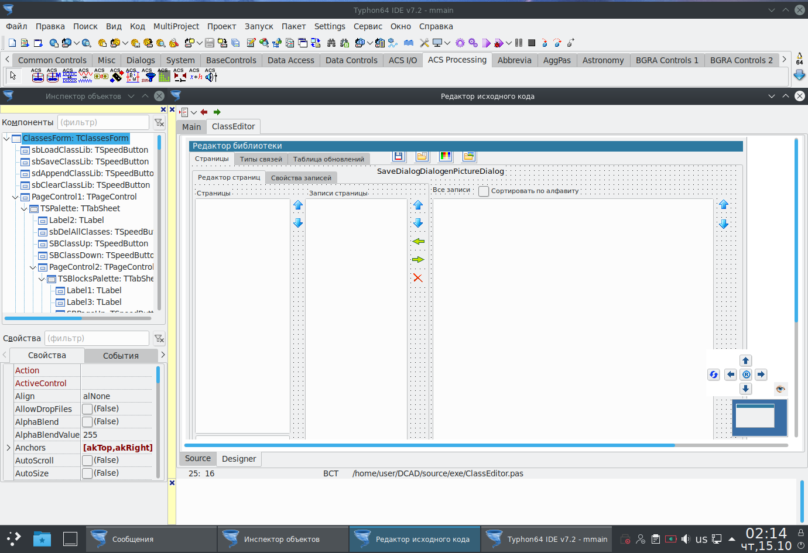

Портирование многопоточных GUI приложений с плагинами и формами внутри плагинов
====================================================

## Глава 1: Что мы имеем - архитектура и особенности программного комплекса.

Данный пример портирования рассматривается на примере программного комплекса SimInTech.
Главной составной частью программного комплекса является графическая оболочка.

Графическая оболочка предназначена для того, чтобы пользователи могли
визуально составлять блок-схемы технологических систем моделируемых
объектов. В её основе лежит система векторной графики собственной
разработки, которая включает в себя набор объектов - базовых
графических примитивов, как то: линии, полигоны, эллипсы, текстовые
вставки, блоки, группы примитивов, линии связи, системные контролы
(чекбокс, комбо-бокс, однострочный текстовый редактор). Поверх
объектов-примитивов лежат групповые объекты - контейнеры графических
примитивов (страницы).

Контейнер - это то, что обеспечивает отрисовку
схемы целиком и её редактирование - т.е. передачу примитивам событий
клавиатуры и мыши). Также каждый контейнер включает в себя и объект -
скриптовую машину для обеспечения динамизации изображения (изменения
цвета положения, текста в зависимости от расчётных параметров схемы).
Встроенная скриптовая машина позволяет делать как техническую анимацию,
так и проводить расчёты, по сути она представляет собой встроенный язык
программирования общего назначения.

Примерная схема архитектуры представлена на рисунке


Графическая оболочка предоставляет пользователю следующие сервисы:

- составление схемы из блоков, создание видеокадров из примитивов.

- работу с библиотеками блоков.

- вывод параметров расчёта на графики, в текстовые таблицы, в файл, в
OPC, в shared memory.

- управление расчётом.

- синхронизация различных моделей и совместный расчёт.

- загрузка плагинов для блоков/схем/слоёв.

- работа со звуком.

- редактирование текстов скриптов с подсветкой кода.

- внешнее управление программой через встроенный COM-сервер (это
использовалось для автоматизации расчётов в связке с другими
программами).

Оболочка является наиболее сложной частью системы  с точки зрения
пользовательского интерфейса и объёма кода. Оболочка была написана на
Delphi с применением достаточно разнообразных компонентов, из которых
кроме стандартных контролов (кнопок полей ввода, комбо и чекбоксов)
необходимо выделить следующие:

- для вывода рассчитанных значений на графики - Tee Chart Pro.

- для редактирования текстов с подсветкой - первоначально SynEdit,
впоследствии TBCEditor.

- для работы со звуком - DSPack.

- для вывода деревьев и построения редакторов списков
сигналов/объектов/свойств блоков/параметров расчёта/дерева
библиотеки//дерева структуры проекта - VirtualTreeView.

- для работы с базами данных для отдельных модулей системы - zeosdbo.

- для трехмерной технической анимации - GLScenes.

- для разного - JEDI VCL + JCL - отдельные контролы, некоторые
библиотеки, например расчёт хешей и контрольных сумм.

Кроме того, в программе как DLL подключается несколько библиотек на C и
FORTRAN, например модуль шифрования RSA и расчёта MD5 хеша.

Для рендеринга графики схем в данный момент в Windows-версии программы
используется Direct2D, который позволяет сделать достаточно плавную и
производительную техническую анимацию (в том числе и с большими по
размеру растровыми текстурами).

К графической оболочке могут подключаться модули - плагины, которые
обеспечивают расширение функций программы на разных уровнях. Например
для каждого блока на схеме мы можем указать какой плагин его обслуживает.

Система плагинов построена на основе наследования их от виртуальных
базовых классов. То есть существует общий модуль, где описываются базовые
классы. В оболочке от него ничего не наследуется, а в подгружаемых DLL
от базовых классов наследуются те или иные блоки расширения, в которых
мы делаем override базовым методам. 

Для создания плагинов в каждой из
библиотек реализована фабрика классов, которая по заданному имени внутри
модуля создаёт заданный объект расширения. Такой подход позволяет
сделать очень гибкую структуру плагинов и иметь там не только методы
(как в классических интерфейсах) но и объекты/ссылки на системные
структуры и так далее. Минусом является то, что ограничивается
возможность использования других компиляторов - т.е. при реализации
плагина должен использоваться тот же компилятор, что и длч оболочки (ну или
совместимый по генерируемому коду). Кроме того, внутри плагинов могут
находится и окошки - т.е. вспомогательный интерфейс.

Соответственно, для полноценной реализации расширений графической
оболочки в программе строго необходим общий менеджер памяти как для
плагинов, так и для библиотек, в качестве какового в данный момент
используется fastmm5, прописанный первым модулем как в коде оболочки, так
и в коде плагинов. Это позволило обеспечить прозрачную для всех модулей
работу со строками и выделение памяти для массивов и объектов,
что критически необходимо в первую очередь для работы со строками, напрмер когда
строка возвращается как результат функции из плагина.

Общий объем исходного кода только графической оболочки составляет
приблизительно 215073 строк кода (это чистый код самого проекта, без
компонентов и без файлов конфигурации форм dfm). С плагинами объем
исходного кода на Delphi в проекте составляет 2858375 строк кода, что
уже является весьма серьёзным числом.

## Глава 2: Выбор инструментария для портирования.

На что именно портировать ваш код - определяется объёмом, деньгами и навыками
команды разработки. Поэтому в данном случае ориентировались на то, 
чтобы всё сделать минимальными средствами, без переписывания windows-версии и 
с максимальным сохранением имеющегося функционала. При этом условием является
поддержка русскоязычных дистрибутивов Linux: Astra и Alt с максимально
возможной бинарной совместимостью.

Java мы отмели сразу, ибо проблемы со стыковкой к ней библиотек на
FORTRAN и откровенно отстойная скорость работы с более-менее сложными
скриптами и графикой показались недостаточным аргументом для
переписывания всего объёма кода на неё. Кроме того, она дико
многословная по сравнению с Delphi, да и нам нужен был именно нативный
код, в первую очередь из-за необходимости стыковки с некоторым
количеством стороннего расчётного софта (как немецкого, так и нашего).
Поэтому Java пошла в топку (на моей прошлой работе часть системы на ней
всё-таки переписали, из опыта эксплуатации получилось очень сильно хуже
исходной версии), наступать на старые грабли не очень хотелось.

Туда же
пошёл и C#, из-за плохой поддержки разработки на нём GUI именно в Linux
и ненативного кода с проблемами стыковки со сторонними расчётными
библиотеками.

Из вариантов сделать кроссплатформенный GUI остались 2:

1.  Qt и C++ - это замечательный путь, но переписывание всего кода
    системы не впечатлило, кроме того под основную систему это на самом
    деле скорее всего означало было ухудшение отзывчивости и качества
    пользовательского интерфейса - всё таки VCL использует родные
    системные контролы. Далее встал вопрос наличия необходимой для
    формирования достаточно сложного пользовательского интерфейса базы
    компонентов, которые были перечислены выше. Посмотрев некоторые
    программы, выполненные при помощи Qt (например qucs, как достаточно
    близкий по функциям) я осознал, что этот путь всё таки будет
   скорее всего погибелен.

2.  Free Pascal + Lazarus. Самый большой плюс этой среды разработки и
    компилятора был в практически полной (но не совсем) переносимости
    текста исходной программы, что позволяло дословно сохранить логику
    работы. Но были большие сомнения в том, что те компоненты и
    особенности, которые были в коде программы, корректно переварятся этим
    компилятором.

Итак, в силу ограничений в человеческих ресурсах было решено попробовать
максимально использовать имеющуюся кодовую базу, оставив её на Delphi и
дополнив код IFDEF-ами для сборки программы под другую ОС в среде
разработке Lazarus.

Немалую роль также сыграло то, что это позволяло не
прерывать работу над основной версией SimInTech для Windows и
параллельно вносить изменения сразу в 2 варианта сборки. Ибо срок работы
был небольшой, а перенести надо было много и ещё так чтобы оно
заработало.

Анализ встроенных в Lazarus показал, что штатных компонентов 
будет иаловато, и было решено поискать что-то, в чём этого добра насыпано
поболее, особенно в части отрисовки 2D-графики.

Сначала был попробован
рендер AggPas в штатном Lazarus-е, но он показался сильно медленным и не
устраивающим по некоторым особенностям совместимости кода с Direct2D
библиотекой. Поэтому было решено искать что-то поинтереснее. Поиск по
интернету вывел меня на нестандартную сборку Lazarus-а под названием
CodeTyphon Studio и первые эксперименты с этой средой привели к выводу,
что вот это в принципе то, что позволит собирать программу на Linux с
максимальным использованием существующего кода. Свою роль сыграло то,
что:

1. там много компонентов по умолчанию, функционально и по
использованию совместимых с теми, которые я использовал в Delphi-версии.
То есть требовалась фактически минимальная переработка кода. Из всего,
что мне было нужно, отсутствовали BCEditor (но был SynEdit, который у
меня использовался в редакторе скриптов в более старой версии), DSPack
(но были аналоги, и на самом деле наличие звука пока было не критично),
TeeChart Pro (но штатно был аналог TAChart, а вот построение графиков
как раз было очень критично).

2. в наличии оказался неплохой компонент для рендеринга графики -
ORCA 2D, структура которого была очень похожа на вызовы Direct2D и
который был принципиально пригоден к использованию для отрисовки сложных
изображений моделей и видеокадров.

## Глава 3: Портирование на FPC/Lazarus

Первое, с чего начался процесс портирования, - это проверка размера
катастрофы, т.к. среда разработки и компилятор, на который это всё
должно было портироваться, должен был позволять мне реализовать несколько
базовых вещей, без которых программу пришлось бы крайне нехорошим
образом менять:

1. необходимо было иметь общий менеджер памяти для головного модуля и
плагинов, выполненных в виде динамических shared object - библиотек.

2. должна была быть возможность загрузки сторонних динамических
библиотек на C и FORTRAN.

3. было необходимо, чтобы некоторые формы находились в динамически
загружаемых библиотеках, т.к. за счёт них выполнялось расширение
интерфейса.

4. должны быть аналоги большинства компонентов с идентичным или
похожим пользовательским и программным интерфейсом.

5. файлы форм dfm должны без лишних проблем конвертироваться (дальше,
как показала практика, целесообразно иметь 2 раздельных набора файлов
описания форм для Windows и Linux из-за некоторой разницы в дизайне
системных виджетов.

Самые большие сомнения на этот счёт были касательно пунктов 1 и 3,
потому что используемая в Lazarus библиотека LCL хоть и является
практически точным клоном VCL, но различается по ряду особенностей.

Первым делом была развернута виртуальная машина под VirtualBox с
доступом к нашему репозиторию, где мы ведём разработку. В качестве
операционной системы на тот момент была выбрана Open Suse, немножко
позднее была сделана виртуальная машина на Alt Linux 8.3 и потом Alt
Linux 9. Далее с сайта <https://pilotlogic.com/> был выкачан архив с
дистрибутивом среды разработки.

Развертывание среды разработки было
произведено по инструкции к ней - распаковать архив и выполнить
`su ./install.sh` , но в процессе развертывания на Alt Linux встала проблема,
что этой ОС в установочном скрипте в списке не было, поэтому пришлось добавить
самому и написать письмо разработчику, чтобы включил в код, сейчас эта
разновидность линукса поддерживается.

Если что не так - то в
дистрибутиве можно дополнить файлик
CodeTyphonIns/installbin/ScriptsLin/ln_All_Functions.sh вписав в него
особенности установки.

Для Alt Linux туда была добавлен текст, рядом с тем местом, где
определяется установка для Ubuntu:

```
#------------ 100 Alt (apt-get compitible)----------
 elif [ -f /etc/altlinux-release ] ; then
   vOSVerNum=100
   vOSDistribution="Alt Linux (apt-get compatible)"
   vMultiArchDirPlan=200
```

В AstraLinux среда разработки ставится без лишних телодвижений на данный
момент (с sudo). Бинарные файлы скомпилированные под AltLinux 9
запускаются и под Astra Linux Orel.

У Astra Linux v???? на данный момент есть одна проблема, не связанная
непосредственно с данной разработкой, - штатно на нём стоит в настройках
стабильный репозиторий, в котором git версии 2.11, а для последнего
SmartGIT-а нужно не ниже 2.16. Проблема решается путём переключения на
экспериментальный репозиторий и обновления пакета git из него.

Кроме
того, графическая оболочка Astra Linux не позволяет в ярлыках на рабочем
столе указать рабочую директорию программы, что в некоторых случаях
может быть неудобным.

В итоге среда разработки была успешно установлена на тестовую
виртуальную машину с Linux.

Дальше настала череда тестирования указанного выше базового функционала,
который был необходим для успешной компиляции всего комплекса.

Для
начала было сделано минимальное приложение, загружающее DLL, внутри
которой создавалась форма, и которое в свою очередь передавало в
вызывающую программу строчку.

Анализ кода, поставляемого с компилятором Free Pascal, показал, что в
составе RTL-библиотек имеется модуль cmem, который позволяет
использовать менеджер памяти из libc. Он так же, как и для Delphi, ставится
первым модулем в dpr-файле и подключает внешний менеджер памяти (в
Delphi для этого есть SimpleShareMem ну или fastmm4 / fastmm5 ).

На
этом пункте можно было с уверенностью поставить галочку. Но при
дальнейшем тестировании было выяснено что производительность этого
менеджера памяти достаточно отстойная, поэтому поиски были продолжены, и
в результате был найден неплохой менеджер памяти fpcx64mm из пакета
Synopse mORMot framework 2. Но он был не распределённый, поэтому для
того, чтобы его использовать он был подключен через небольшой
промежуточный модуль simmm.pas следующего содержания:

```
unit simmm;
  //  Прокладка для использования общего менеджера памяти
{$IFNDEF DCAD}
{$DEFINE IS_DLL_UNIT}
{$ENDIF}

{$IFDEF FPC}
 {$MODE Delphi}{$H+} 
{$ENDIF} 

interface

{$IFDEF UNIX}

  {$IFDEF IS_DLL_UNIT}
  uses cthreads, dl;
  {$ELSE}
  uses cthreads, fpcx64mm;
  {$ENDIF}

{$ELSE}
uses  FastMM5;
{$ENDIF}

implementation

{$IFDEF UNIX}
{$IFDEF IS_DLL_UNIT}
  var
     NewMM,
     OldMM:      TMemoryManager;
     MainHandle: Pointer;
     GetCommonMemoryManager: procedure(var aMemMgr: TMemoryManager);
{$ENDIF}
{$ENDIF}

initialization

  {$IFDEF UNIX}
  {$IFDEF IS_DLL_UNIT}

    MainHandle:=dlopen(nil, RTLD_LAZY);
    GetCommonMemoryManager:=dlsym(MainHandle,'GetMemoryManager');
    GetCommonMemoryManager(NewMM);
    GetMemoryManager(OldMM);
    SetMemoryManager(NewMM);

  {$ENDIF}
  {$ELSE}

  //Расшариваем менеджер памяти
  if IsLibrary then
     FastMM_AttemptToUseSharedMemoryManager
  else
     FastMM_ShareMemoryManager;
  {$ENDIF}

  {$IFDEF UNIX}
  {$IFDEF IS_DLL_UNIT}
finalization
    SetMemoryManager(OldMM);
  {$ENDIF}
  {$ENDIF}
end.
```

Как видно из данного кода, ключ DCAD определяется только в головном
модуле, при этом мы в нём определяем как экспортируемую функцию
GetMemoryManager. А в dll/so мы получаем адрес этой функции путём
вызова dlopen(nil, RTLD_LAZY) - если эта функция вызывается с нулевым
первым аргументом, она возвращает хендл на главный исполняемый файл, и
дальше мы получаем оттуда адрес функции для получения центрального
менеджера памяти и используем его в плагинах. Соответственно, во всех
плагинах первым модулем мы прописываем simmm для обеспечения общего
выделения памяти.

Вторая проблема - это вызов форм, находящихся внутри dll/so модулей.

В Delphi по факту эта проблема не возникала. Т.е. если мы делаем там
TForm.Create, то форма создается нормально. В Lazarus на линуксе
оказалось всё несколько интереснее, т.к. для того, чтобы форма
создалась, необходимо в so-библиотеке прописать в списке модулей:

```
  …..
  Classes,
  {$IFDEF FPC}
  Interfaces,
  {$ENDIF}
  Forms,  

```

и определить инициализацию Application в секции initialization и
завершение в finalization:

```
{$IFDEF FPC}
initialization
  Application.Initialize;
finalization
  Application.Terminate;
end.
{$ENDIF}
```

Выполнив такие операции, мы в дальнейшем можем спокойно создавать формы
внутри so.

Наше приложение является многопоточным, поэтому сразу возник
вопрос с тем как это будет поддерживаться в Lazarus. В результате чтения
документации и экспериментов было выяснено, что на UNIX-системах чтобы
внутри программы или so создавать поток, в списке модулей проекта должен
быть прописан модуль cthreads:

```
  {$IFDEF UNIX}
  cthreads,
  {$ENDIF}
```

Таким образом, все dpr-файлы были модифицированы типовым образом для
того, чтобы в них заработал нужный нам функционал, в качестве примера
привожу исходник dpr-файла для плагина расчёта систем управления:

```
{$IFDEF FPC}
  {$MODE Delphi}   //Это определение нужно, чтобы компилятор Free Pascal включил режим
{$ENDIF}           //совместимости с Delphi.
                               
library mbtylib;
uses
  simmm,
  {$IFDEF UNIX}
  cthreads, //сейчас этот модуль включен в simm.pas чтобы он был подключен для всех библотек сразу
  {$ENDIF}  
  Classes,
  {$IFDEF FPC}
  Interfaces,
  {$ENDIF}
  Forms,  
  MBTYTools in 'MBTYTools.pas',
  MBTYObjts in 'MBTYObjts.pas',
  uMBTYThread in 'uMBTYThread.pas',
  SpecBlocks in 'SpecBlocks.pas',
  InfoUnit in 'InfoUnit.pas' {MBTYInfoForm},
  MBTYtranslate in 'MBTYtranslate.pas',
  uDebugBlockForm in 'uDebugBlockForm.pas' {DebugBlockForm};

{$R *.res}

//Тут мы храним картинки, которые у нас пойдут во вспомогательные кнопку на тулбарах
{$R mbtybuttons.res}

  //Эта функция возвращает адрес структуры DllInfo
function  GetEntry:Pointer;
begin
  Result:=@DllInfo;
end;

exports
  GetEntry name 'GetEntry',         //Функция получения адреса структуры DllInfo
  CreateObject name 'CreateObject'; //Функция создания объекта

{$IFDEF FPC}
initialization
  Application.Initialize;
finalization
  Application.Terminate;
end.
{$ENDIF}
begin
end.
```


Таким образом, 2 базовые для текущей архитектуры программного комплекса
проблемы получили своё решение и на Linux.

Дальше оставалось
проанализировать, насколько корректно будут передаваться в DLL строки и
ссылки на объекты - с этим при подключении общего менеджера памяти всё
оказалось в порядке.

С загрузкой сишных и фотрановских .so также всё
оказалось хорошо, но необходимо помнить, что intel fortran и gfortran по
умолчанию по разному передают в функции аргументы, поэтому там где это
было нужно, пришлось видоизменить декларацию вызова некоторых
подпрограмм из сторонних DLL/SO. Как пример можно привести следующий
фрагмент кода, подключающего процедуру на FORTRANе:

Вариант для Windows - INTEL FORTRAN, конвенция stdcall:

```
  TSbros = procedure(
    Nuzl,Nu,Ngran,Nmat,Nko,idmdt0,iadiab0: integer;  // +++ 31.03.2014 (iadiab0)
    var El,Iel,Uzel,Iuzel,
      NYZL,G,Nnas,Nzad,Nelu,
      Gran,Granu,Ngu,Ngut,Propm,Nelm,
      Zadv,Pump,Nzadp;
    Dtau,DtauG,Htau,TauE: TPPRealType;
    ...
    );stdcall;

Вариант  для Linux gfortran с конвенцией cdecl:

   //Версия для стыковки с версией для под GFortran	
  TSbros = procedure(
    var Nuzl,Nu,Ngran,Nmat,Nko,idmdt0,iadiab0: integer;  // +++ 31.03.2014 (iadiab0)
    var El,Iel,Uzel,Iuzel,
      NYZL,G,Nnas,Nzad,Nelu,
      Gran,Granu,Ngu,Ngut,Propm,Nelm,
      Zadv,Pump,Nzadp;
    var Dtau,DtauG,Htau,TauE: TPPRealType;
    ...
    );cdecl;
```

Из приведённого кода видно, что в Intel FORTRAN целочисленные параметры
функции по умолчанию передаются в стек напрямую, а массивы и
вещественные числа передаются через указатели, а в gfortran все
параметры передаются через указатели. При этом по умолчанию конвенция
вызовов в Intel FORRAN для Windows -- stdcall, в gfortran, что для
Windows, что для Linux - cdecl.

Кроме этого также следует обратить внимание на именование экспортируемых
функций при загрузке их из DLL: если в Intel Fortran для Windows имя
экспортируемой функции остаётся неизменным и соответствует имени
функции, то в **gfortran** добавяется суффикс **"\_"**:

```
{$IFDEF Windows} 'wwww' {$ELSE} 'wwww_' {$ENDIF}
```

Некоторые части программы были написаны на языке Си и подключены как
динамически загружаемые библиотеки. Компиляция этих библиотек
производилась компилятором gcc.

Пример скрипта компиляции so-файла одной
из них приведён ниже:

```
gcc **-shared -fPIC** -o ../../bin/libcommonclibs.so -s nn.c prime.c
r_keygen.c rc4c.c rsa.c md5c.c **-fpack-struct=1** -Wconversion
```

При компиляции сишных модулей следует обратить внимание на выравнивание
структур, для того, чтобы таковое совпадало с кодом на Pascal.

Далее был предпринят анализ используемых компонентов и поиск их аналогов
в CodeTyphon Studio, чтобы понять, насколько будет модифицироваться код
программы.

Ниже приведена таблица, показывающая что где есть.

| Компонент             | Delphi                | CodeTyphon Studio     |
| ----------- | ----------- | ----------- |
| TButton               | \+                    | \+                    |
| Tedit                 | \+                    | \+                    |
| TjvComponentPanel     | \+                    | \+                    |
| TactionList           | \+                    | \+                    |
| TjvFormMagnet         | \+                    | \-                    |
| TcontrolBar           | \+                    | \+                    |
| TtoolBar              | \+                    | \+                    |
| TjvOfficeColorPanel   | \+                    | \+                    |
| TcheckBox             | \+                    | \+                    |
| TcomboBox             | \+                    | \+                    |
| TjvListBox            | \+                    | \- заменяем на  TListBox      |
| TeeChart Pro          | \+                    | \- штатно нет         |
| TjvSpinEdit           | \+                    | \- заменяем на  TSpinEdit      |
| TjvFontComboBox       | \+                    | \- заменяем на  TplFontComboBox      |
| TBCEditor             | \+                    | - заменяем на TSynEdit |
| TvirtualStringTree    | \+                    | \+                    |
| TPageControl          | \+                    | \+                    |
| TTabControl           | \+                    | \+                    |
| TPanel                | \+                    | \+                    |
| TBitBtn               | \+                    | \+                    |
| TJvButton             | \+                    | -   заменяем на TBitBtn      |
| TScrollBar            | \+                    | \+                    |
| TFrame                | \+                    | \+                    |
| TJvListView           | \+                    | -   заменяем на TListView      |
| TSpeedButton          | \+                    | \+                    |
| Компоненты системных диалогов  | \+                    | \+                    |
| GLScenes              | \+                    | \+                    |
| DSPack                | \+                    | -   UOS       |
| Indy                  | \+                    | \+                    |
| TPngImage             | \+                    | \+ заменяем на  TPortableNetworkGraphic      |


Вообще на текущий момент компоненты JVCL в этой сборке портированы
практически все, поэтому часть замен можно и не делать. Анализ показал,
что всё, что надо программе, чтобы обеспечить сборку на Linux, там
имеется, кроме TeeChart Pro, о котором будет описано чуть ниже, потому
что его удалось в итоге заставить там работать, и это сняло сразу большую
головную боль.

После успешно проведённой проверки среды CodeTyphon Studio на тестовом
приложении был начат непосредственно процесс портирования и формирования
единой кодовой базы для Windows и Linux версий программы.

Для этого
сначала на виртуалке был настроен git и установлена для удобства работы
программы SmartGit, была выполнена загрузка рабочей копии из репозитория
и создана отдельная ветка altlinux.

**Первое**, что необходимо сделать для портирования программы на
Lazarus/CodeTyphon, это пересохранить ВСЕ файлы исходного текста (pas,
dpr и разные include-ы) в формат `UTF8 BOM`! Это строго необходимо,
**если у вас в сообщениях есть хотя бы одна русская буква**!
Это делается в Delphi или в любом другом текстовом редакторе.


**Второе** - это формирование файлов проектов (ctpr) под данную среду
разработки. Первоначально это было сделано при помощи функции


В дальнейшем ctpr-файлы проектов для CodeTyphon Studio просто
копировались для разных модулей с изменением внутри этого xml-файла
имени проекта и названия самого файла и модулей в проекте. Также можно
просто сделать там пустой проект и дальше размножить из него ctpr файлы
на все компоненты программы.

Процесс портирования естественно был начат с самого проблемного с этой
точки зрения места - то есть с графической оболочки программы, где
сосредоточен практически весь пользовательский интерфейс.

После того,
как мы получили ctpr-файл, открываем его в Code Typhon, прописываем
все пути поиска исходников, если проект был разложен по директориям и
первым делом вносим модификации в dpr-файл проекта графической оболочки - добавляем с условной компиляцией модули:

```
  simmm,
  {$IFDEF UNIX}
  cthreads,
  {$ENDIF }
  {$IFDEF FPC}
  Interfaces,
  {$ENDIF}
```

Делаем экспорт функции получения менеджера памяти головного модуля:

```
{$IFDEF FPC}
exports
  GetMemoryManager;  // это надо чтобы общий менеджер памяти увидели SO-шки
{$ENDIF}
```

и убираем в условную компиляцию модуль подключения COM-сервера и функций
для работы с Excel и если есть что-то ещё системно-зависимое.

Дальше была нажата кнопка «Скомпилировать» в среде разработки, и пошло
исправление выдаваемых компилятором ошибок.

Первое что пришлось
проделать во всех модулях - это добавить в заголовок юнита вот такое
определение, чтобы включался режим совместимости:

```
{$IFDEF FPC}
 {$MODE Delphi}{$H+}
{$ELSE}
 {$DEFINE Windows}
{$ENDIF}
```

Также эти дефайны можно включить и в настройках проекта.

Потом были обвязаны условной компиляцией все системно-зависимые модули в
uses - в первую очередь Windows и Messages:

```
{$IFDEF FPC} FileUtil,{$ELSE} Windows,{$ENDIF}
```

и введены в базовые модули программы недостающие элементарные типы:

```
  {$IFDEF FPC}
  PRect = ^TRect;
  {$ENDIF}
  TWindowsPointArray = array of {$IFNDEF FPC}Windows.{$ENDIF}TPoint;
```

Дальше оказалось, что для обеспечения бинарной совместимости при
сохранении и чтении файлов необходимо учитывать то, что **размеры
перечислимых и множественных типов данных в Delphi и Free Pascal
разные**:  
**В Delphi - 1 байт**, а в **FreePascal - 4 байта**, что касалось
перечислений, например стилей линий или заливок:

```
 //Размеры некоторых типов данных
 SizeOfTColor      = 4;
 SizeOfTPenStyle   = 1; //SizeOf(TPenStyle); //В FPC размеры enum 4 байта!
 SizeOfTBrushStyle = 1; //SizeOf(TBrushStyle);
 SizeOfTDataMode   = 1; //SizeOf(TDataMode);
```

Поэтому везде в коде, там где размеры типов в компиляторах различались,
было закомментировано использование SizeOf и размер задан числом
фиксированно!

Также были определены недостающие функции, которые присутствовали в
модуле Windows:

```
{$IfDef FPC}
procedure ZeroMemory(const Data: pointer; Size: integer); inline;
begin
  FillChar(Data^,Size,0);
end;
{$EndIf}
```

Ну и соответственно, те места, которые вызывали функции из Windows, были
заменены эквивалентами из кросс-платформенных модулей:

```
{$IfDef fpc}CreateDir(newdir){$else}CreateDirectory(PChar(newdir),nil) and (GetLastError <> ERROR_ALREADY_EXISTS){$endif}
```

Также были переделаны функции сохранения и считывания строк из потока
для обеспечения возможности загрузки данных из Windows версии, т.к.
формат строк в Lazarus/CodeTyphon - UTF8 по умолчанию, а в современном
Delphi - UTF16:

```
procedure   LoadStr(var   S:string;Stream:TStream);
  var N: cardinal;
      UniString: UnicodeString;
  procedure DoLoadAsAnsi;
   var tmps: ansistring;
  begin
     //старая версия - ansi
     SetLength(tmps,N);
     if N>0 then Stream.Read(Pointer(tmps)^, N);
     S:=tmps;
  end;
begin
 with Stream do begin
   Read(N,SizeOfInt);
   if (N and $80000000) <> 0 then begin
     //юникод
     N:=N and (not $80000000);
     SetLength(S,N);
     SetLength(UniString,N);
     if N > 0 then begin
        Stream.Read(Pointer(UniString)^, N*2);
        S:=UTF8Encode(UniString);
     end;
   end
   else
     DoLoadAsAnsi;
 end
end;
```

При этом надо обратить внимание, что эта функция эволюционировала ещё с
не-юникодной версии Delphi, и соответственно, когда программа была
переделана на юникод, то для идентификации формата строки был
задействован старший бит в 4-х байтном числе перед данными строки. Если
он 1, то значит строка кодирована 2-байтными символами в UTF16, а если 0 - значит это старая ANSI строка.

В большинстве модулей, где была голая математика, не потребовалось вообще
никаких изменений в коде, кроме как указать в начале модуля режим
совместимости {$MODE Delphi}.

Потом компилятор напоролся на первый файл с формой, и тут уже пришлось
видоизменить его по следующей схеме:

В самый верх модуля, как и у всех, вставляем:

```
{$IFDEF FPC}
 {$MODE Delphi}{$H+}
{$ENDIF}
```

В uses обвязываем системно-зависимые модули условной компиляцией:

```
{$IFDEF FPC} LCLType, LCLIntf, LMessages, GraphType,{$ELSE}Windows, Messages,{$ENDIF}
```

Модули:

```
SysUtils, Classes, Graphics, Controls, Forms, Dialogs, и другие свои
```

оставляем как есть, но если там префикс VCL. - то его надо убрать!

В секции implementation там где линкуется dfm-файл, вместо `{$R *.dfm}`
вставляем условную компиляцию, чтобы для CodeTyphon у нас грузился файл
формы с расширением frm (в данном случае там сделан также выбор и по
языку интерфейса):

```
{$IFDEF ENG}
{$IFnDEF FPC}
{$R *.eng.dfm}
{$ELSE}
{$R *.eng.frm}
{$ENDIF}
{$ELSE}
{$IFnDEF FPC}
  {$R *.dfm}
{$ELSE}
  {$R *.frm}
{$ENDIF}
{$ENDIF}
```

Дальше необходимо перенести файл конфигурации формы из Delphi (dfm) в
другой формат CodeTyphon (frm). Для этого в Lazarus/Code Typhon
существует инструмент конвертации dfm-файлов, который прекрасно понимает
их в текстовом формате (хоть и пишет при этом ошибку).

Поэтому выбираем следующий пункт меню, не обращая никакого внимания на
слово "двоичный" - с текстовым форматом dfm-файлов эта утилита также
прекрасно работает:


и выбираем dfm файл конвертируемого модуля. После этого получаем
сообщением об «ошибке» и не обращаем на него никакого внимания.

Если в frm-файле нет никакой экзотики, которой нет в данной сборке, то
мы можем сразу нажать кнопку «Переключить форму/модуль (F12)», которая
сделает попытку загрузить frm-файл. Далее возможны 2 варианта:

1. Если все компоненты есть, тогда мы сообщения о том, что каких-то свойств нет,
просто игнорируем
2. Если же каких-то компонентов у нас нет, тогда мы
открываем в текстовом редакторе frm-файл и меняем там имена классов
компонентов на аналоги, имеющиеся под линуксовой средой разработки, и
пробуем сделать «Переключить форму/модуль (F12)» ещё раз пока всё не
станет хорошо, и не появится дизайн формы:



В некоторых случаях, чтобы упростить задачу и не искать аналог, описание
компонента просто вырезалось из frm-файла в текстовом редакторе и
компонент создавался уже динамически при FormCreate, где также была для
этого сделана условная компиляция.

Также надо обратить внимание, что
размеры кнопок/полей ввода/чекбоксов в штатной линуксовой GTK2 которая
используется там для Lazarus/Code Typhon как системная библиотека
виджетов, не совпадают с виндовыми, и зачастую надо немножко повозить
мышкой по формочке, чтобы привести её в более благородный вид.

Там, где имена классов компонентов не совпадают, в исходном тексте
класса формы делаем условную компиляцию, например так:

```
    cProgressBar: {$IFDEF FPC}TProgressBar{$ELSE}TJvGradientProgressBar{$ENDIF};
    cMsgView:  {$IFDEF FPC}TListBox{$ELSE}TJvListBox{$ENDIF};
```

Сконвертировав подобным образом модуль с формой, жмём дальше на
компиляцию и смотрим, что интересного нам напишет компилятор ещё.

Различия в наименованиях полей компонентов решаются тривиально - введением условной компиляции, но как показал процесс портирования,
таких мест не так много, и всё становится существенно интереснее в тех
местах, где начинается использование системного API, и в программе таких
мест было несколько:

1\. Загрузка модулей через LoadLibrary
: вызовы из WinAPI были заменены
прокладками из модуля DynLibs с теми же именами. Функции выглядят точно
так же, как в Windows, но единственное, что пришлось сделать - это сделать
при загрузке плагинов автозамену имени файла \*.dll на lib\*.so так как
имена расширений были прописаны в конфигурациях блоков и проектов
созданных в программе.

Касаемо загрузки SO в линуксе надо помнить, что если библиотеки
программы находятся не в /bin, и пути к ним не сконфигурированы в PATH,
то при загрузке библиотеки к имени файла следует обязательно добавить
путь к главному исполняемому файлу, если модули лежат рядом в ним:

```
fLibHandle:=LoadLibrary({$IFNDEF FPC}PChar{$ENDIF}(ExtractFilePath({$IFDEF FPC} ParamStr(0) {$ELSE} GetModuleName(HInstance) {$ENDIF})+rsalib_name));
```

Кроме этого, если хендл SO был декларирован как THandle, то необходимо
вставить условную компиляцию:

```
Var fLibHandle: {$IFDEF FPR}TLibHandle{$ELSE}THandle{$ENDIF};
```

так как оказалось, что в Linux типы этих хендлов не совпадают.

2\. Критические секции и объекты синхронизации (InitializeCriticalSection, CreateEvent и т.п.)
: тоже были заменены
прокладками из модуля syncobjs, который присутствует как в Free Pascal,
так и в Delphi (классы TCriticalSection и TEvent соотвественно):

| WinAPI функция              | Класс и метод       |
| ----------- | ----------- |
| RTL_CRITICAL_SECTION   |             TCriticalSection     |
|  InitializeCriticalSection  |         TCriticalSection.Create |
|  DeleteCriticalSection   |            TCriticalSection.Free  |
|  EnterCriticalSection    |            TCriticalSection.Enter  |
|  LeaveCriticalSection    |            TCriticalSection.Leave  |
|  hEvent                  |            TEvent       |
|  CreateEvent             |            TEvent.Create  | 
|  CloseHandle(hEvent)     |            TEvent.Free   |
|  SetEvent                |            TEvent.SetEvent  |
|  ResetEvent              |           TEvent.ResetEvent  |
|  WaitForSingleObjects    |            TEvent.WaitFor   |

Замену функций EnterCriticalSection... на класс TCriticalSection и т.п.
категорически **рекомендуется** произвести! И крайне нежелательно при
этом пользоваться одноимёнными функциями из LCL, во избежание проблем и
путаницы!

3\. Запуск процессов
: все функции были выделены в отдельный модуль с
условной компиляцией. Запуск процессов сделан через вызов system,
использовать exec тут нежелательно:

```
uses {$IFDEF Windows} Windows, {$ELSE} LCLType, unix, Baseunix,{$ENDIF} Classes, SysUtils;
...
  //Юниксовые варианты порождения процессов
function  WinExecAndWait32(const FileName:string; Visibility : integer = 0;
                          TimeOut: cardinal = {$IFDEF Windows}INFINITE{$ELSE}maxLongInt{$ENDIF}):longword; var ss: AnsiString;
begin
  ss := FileName;
  Result:=fpSystem( ss );
end;

function  MyWinExec(const S: string;aShowMode: cardinal):cardinal;
 var ss : ansistring;
begin
  {$IFDEF Windows}
     ss:=S;
     Result:=Windows.WinExec(PAnsiChar(ss),aShowMode);
  {$ELSE}
     // Делаем выполнение системной команды БЕЗ ожидания - для этого в конце добавляем &
     // Рекомендация: для порождения внешних вызовов пользовать fpSystem и не форкать процесс ибо
     // это ведёт к проблемам с отладчиком и последующим закрытием программы.
     ss := S + ' &';
     Result:=fpSystem( ss );
  {$ENDIF}
end;
```

4\. Движок двумерной графики Direct2D.
: В старых версиях программы под Windows в качестве рендера использовался
GDI и для работы с растрами - GDI+ , в более поздних (с появлением
Windows 7) всё было заменено на вызовы Direct2D API, который работал на
порядок быстрее и позволял сделать сильно более качественную графику.

 Но
старый код был оставлен для обеспечения совместимости. При портировании
на Linux возникло 2 варианта:

 - портировать с обычными вызовами через
TCanvas - они идентичны
- попробовать сделать более приличный
вариант с использованием более продвинутой библиотеки.

В качестве
библиотеки ренденринга 2d-графики для Linux была взята ORCA2d, а
конкрентно класс TD2Canvas, над которым была сочинена совместимая с
классом TDirect2Canvas надстройка.
Для отрисовки графики TD2Canvas
использует cairo для Linux.

Можно было сделать полностью свой класс для
рендера с более прямым вызовом линуксовых API-функций, но это делать
было неохота, и поэтому я воспользовался более готовым вариантом.


Корректировка вызывающего кода заключалась в основном в том, что вместо
интерфейсов теперь были просто классы, кое-где добавились вызовы Free для
объектов. Текст объекта-прокладки для рендера графики приведён в
Приложении 1.

Соответственно, поскольку изменился рендер, то вместо штатного TPaintBox,
для которой определялся контекст Direct2D, при конвертации формы в
редакторе изображений блоков и редакторе схем были скорректированы
компоненты:

В декларации класса формы:

```
ShemePanel: {$IFDEF FPC}TD2Scene{$ELSE}TPanel{$ENDIF};
PaintBox: {$IFDEF FPC}TD2Image{$ELSE}TPaintBox{$ENDIF};                          //Отрисовочная поверхность
```

При выделении канвы для отрисовки

```
    {$IFDEF FPC}
    PaintBox.Bitmap.SetSize(ShemePanel.Width,ShemePanel.Height);
    PaintBox.OnPaint:=DoPaintPB;
    Canvas:=TDirect2DCanvas.Create(PaintBox.Bitmap.Canvas);
    Canvas.FBaseImageObject:=PaintBox;
    {$ELSE}
    Canvas:=TMyD2Canvas.Create(ShemePanel.Handle);
    {$ENDIF}
```

Были также переопределены перехватчики событий мыши, поскольку ORCA2D
координаты возвращало в single.

Самым интересным оказалось то, что **рисовать под Linux в многопоточном
режиме, как позволял Direct2D, крайне нежелательно**, поэтому поточный
таймер был условной компиляцией заменён на обычный, **а вызов отрисовки
на канве TD2Image необходимо было делать строго по вызову OnPaint
данного компонента**, т.к. иначе могли возникать перемигивания, если
отрисовку вызывать вне этого вызова. Это обусловило необходимость
**сделать вызов отрисовки через вызов ShemePanel.Repaint** вместо
прямого вызова рисования как для Direct2D варианта.

## Глава 4: Загадки с обработкой исключений в Linux внутри динамически загружаемых библиотек.

Всё было хорошо, но однажды захотелось добавить в линуксовой
виртуалке ядер программы, чтобы она шевелилась пошустрее, и тут началось
нечто загадочное - стали заваливаться пакеты проектов (т.е. когда
внутри программы параллельно на разных потоках считают несколько задач с
обменом данными). Т.е. пускаешь задачу, а она заваливается в абсолютно
произвольный момент времени и причём не пишет информации отчего
завалилось от слова совсем.

Я начал думать. Сделал тест - взял 2 пустых проекта
автоматики и пустил их в оболочке паралелльно. Без синхронизации,
без всего вообще. Результат - если в виртуалке настроено 2 процессора, то
заваливается через секунд 5. Причём при заваливании выводит в
произвольные места.

Сделал тест - урезал проекты, оставил только плагин
проекта common в загрузке. Запустил - заваливается через 15 сек.

Начал
смотреть, что не так, и обнаружил, что **если в DLL присутствует код обработки
исключений try except finally, то когда в такую функцию входят
одновременно 2 потока, то происходит исключение!**

Начал смотреть
ассемблерный код обработки исключений в Linux (в винде он совсем другой)
и оказалось, что try except при входе в секцию вызывает функцию записи
указателя в связанный список, состоящий из стековых переменных, но при
этом базовая переменная декларирована как threadvar в списке глобальных
переменных системного модуля except.inc в RTL компилятора.

И после
этого до меня дошло - что **threadvar-ы совсем не работают, если в SO в
головном файле проекта не слинкован модуль cthreads**. То есть его надо
линковать не только там, где ты поток порождаешь в программе, а везде в
любых SO в которые этот поток может заглянуть, и где используется
обработка исключений. А если не прописать - то компилятор ничего не
скажет, но threadvar-ы будут работать как обычные var - то есть
существовать в одном экземпляре внутри процесса. Соотвественно при
многопоточном режиме будет оно глючить не пойми где и молча.

После того
как я во ВСЕХ модулях на паскале подключил первым модулем cthreads, всё
чудесным образом заработало без сбоев. Для
упрощения задачи я включил cthreads сразу в модуль simm который
предоставляет модулям общий менеджер памяти.

Вот этот код виноват был в модуле except.inc в RTL Free Pascal:

```
{$ifdef FPC_HAS_FEATURE_THREADING}
ThreadVar
{$else FPC_HAS_FEATURE_THREADING}
Var
{$endif FPC_HAS_FEATURE_THREADING}
  ExceptAddrStack   : PExceptAddr;
  ExceptObjectStack : PExceptObject;
  ExceptTryLevel    : ObjpasInt;
[16:52, 08.12.2020] Константин: Function fpc_PushExceptAddr (Ft: {$ifdef CPU16}SmallInt{$else}Longint{$endif};_buf,_newaddr : pointer): PJmp_buf ;
  [Public, Alias : 'FPC_PUSHEXCEPTADDR'];compilerproc;
var
  _ExceptAddrstack : ^PExceptAddr;
begin
{$ifdef excdebug}
  writeln ('In PushExceptAddr');
{$endif}
  _ExceptAddrstack:=@ExceptAddrstack;
  PExceptAddr(_newaddr)^.Next:=_ExceptAddrstack^;
  _ExceptAddrStack^:=PExceptAddr(_newaddr);
  PExceptAddr(_newaddr)^.Buf:=PJmp_Buf(_buf);
  PExceptAddr(_newaddr)^.FrameType:=ft;
  result:=PJmp_Buf(_buf);
end;
```

Естественно информации о том, что без cthreads под линуксом threadvar-ы
не работают, нету нихрена нигде вообще, ни в интернете, ни в
документации. Поэтому возможно кому-то пригодится этот документ.

## Глава 5. Странности при завершении работы программы и проблемы со строками.

После того, как была прояснена особенность с обработкой исключений в
многопоточном режиме в компиляторе FreePascal, программа в общем и целом
заработала стабильно - то есть тестовый пакет проектов, включающий в
себя выполнение нескольких параллельных задач, устойчиво считал и ни разу
не завалил программу. Но почему-то при завершении работы программы при
вызове FreeLibrary для всех плагинов происходила выдача исключения.

Этот
вопрос меня возбудил и не давал мне спать по ночам, намекая на какую-то
нехорошую штуку при выделении памяти. При этом сбой вёл на функцию
fpc_ansistr_decr_ref, что намекало на проблемы с работой со строками в
плагинах. Сразу надо оговориться - в Delphi под Windows такой проблемы
не было.

Для прояснения данного момента был проведён эксперимент - в
загрузке был оставлен один плагин, дававший гарантированный сбой. У
плагинов при загрузке программы вызывается функция Init, которая делает
некоторые инициализирующие действия после загрузки библиотеки. 

В
результате эксперимента оказалось, что сбой при выходе программы
происходит в случае, если из Init плагина вызывается функция главного
интерфейса TMain.AddMenuItem (TMain это структура, содержащая адреса
подпрограмм и внутренних данных, которые доступны плагинам, см. модуль
InterfaceUnit.pas).

Данная функция была задекларирована следующим образом:

```
AddMenuItem:function(Parent: Pointer;const Caption:string;OnClick: TNotifyEvent;Tag:NativeInt):Pointer;
```

и вызывалась в коде плагина как

```
DllInfo.Main.AddMenuItem(DllInfo.Main.Menu,txtTppTools,nil,0);
```

где txtTppTools - это строковая константа.

Внутри реализации интерфейсной функции AddMenuItem в головном модуле
программы Caption присваивался соответственно полю Caption нового
экземпляра TMenuItem. Для интереса присвоение строки было
закомментировано и случилось чудо - ошибка при выходе исчезла!

Дальнейшие раздумья позволили прояснить детали проблемы:

FreePascal при присвоении строк может делать это без копирования данных -
т.е. если строка-источник является константой, то он берёт и
присваивает указатель строки приёмника раным адресу строки источника без
копирования собственно данных строки на новое место. При этом для
строки-источника увеличивается на 1 счётчик ссылок, а когда
строка-приёмник деаллоцируется или меняется, то счётчик ссылок
строки-источника наоборот уменьшается на 1.

И всё бы это хорошо и правильно до тех пор
пока мы не выгружаем shared object из памяти. А после этого случается
страшное - менеджер памяти при завершении программы пытается
декрементировать счётчик ссылок на строчку в том месте, где её нету уже
и в помине (т.к. константа выделяется не в общей куче). Выходом из
данной ситуации является замена типа string для функций которые могут
быть вызваны с аргументом-строковой константой на PChar.

**В идеале для
всех интерфейсных функций лучше как раз PChar и использовать, т.е. он
гарантирует, что внутри реализации интерфейсной функции будут
скопированы данные строки, а не просто указатель.**

Соответственно, интерфейсные функции со строковыми аргументами были
переделаны на использование PChar в качестве входного параметра:

```
AddMenuItem:function(Parent: Pointer;Caption:PChar;OnClick: TNotifyEvent;Tag:NativeInt):Pointer;
InsertMenuItem:function(Parent: Pointer;Caption:PChar;OnClick: TNotifyEvent;Tag,AIndex:integer):Pointer;
InsertMenuItem:function(Parent: Pointer;Caption:PChar;OnClick: TNotifyEvent;Tag,AIndex:integer):Pointer;
SetAlias: function(aAlias,aAliasValue: PChar;fReplace: boolean):boolean;

```

Также была добавлена интерфейсная функция для безопасного присвоения
имени компонента внутри головного модуля на замену конструкции `TComponent(aComponentPtr).Name := aName`:

```
SetComponentName:  procedure(aComponentPtr: Pointer;aName: PChar);
```

После замены в плагинах типа строкового аргумента с `const ... : string`
на `PChar` проблемы, связанные с выгрузкой плагинов, были устранены.

## Глава 6. Особенности некоторых компонентов под Linux в библиотеке LCL

У стандартных компонентов LCL существует разница в реализации по
сравнению с компонентами VCL, связанная с применением некоторых
особенностей.

1.  При использовании компонента TTabControl в LCL следует помнить, что
    **использовать TTabControl.Tabs.Objects** под свои нужды в LCL
    категорически нельзя в отличие от VCL! Поля Objects в поле Tabs в
    классе TTabControl в LCL используются для хранения ссылок на
    внутренние данные этого компонента!  Поэтому для хранения ссылок на
    объекты, ассоциированные с табами, следует ввести дополнительный
    список. Фрагмент кода, как надо делать для FPC, и как было для Delphi
    приведён ниже:

    ```
    {$IFDEF FPC}
      TCComps.Tabs.Add( TranslationEngine.TranslateWordFunc(  MainLibrary.Tabs[i], TID_PANELBUTTONS) );
      TShowedTabList.Add(Tab);
    {$ELSE}
      TCComps.Tabs.AddObject( TranslationEngine.TranslateWordFunc(MainLibrary.Tabs[i],TID_PANELBUTTONS ),Tab);
    {$ENDIF}
    ```

2.  От TControlBar лучше отказаться и заменить его на TToolBar - это
    может быть сделано условной компиляцией и заменой имени класса в
    frm-файле. TControlBar работает в GTK2 плохо.

3.  При динамической смене стиля бордюра окна на безрамочный режим
    (используется при переключении с режима редактора в режим
    видеокадра) следует пересоздать окно:

    ```
    {$IFDEF FPC}
    ActiveEditor.DefRect:=ActiveEditor.BoundsRect;
    ActiveEditor.PaintTimer.Enabled:=False;
    {$ENDIF}

    ActiveEditor.BorderStyle:=bsNone;

    {$IFDEF FPC}
    RecreateWnd(ActiveEditor);   //Вот без этого в линуксе бордюры динамически не скрываются
    {$ENDIF}
    ```

4.  Динамическая смена бордюра окон на безрамочные может вызывать сбои
    LCL и графической системы (в случае когда было окно bsSizeable а
    делаем мы его bsNone), поэтому если штатно дизайн окна в frm-файле
    выполнен с рамкой, то лучше сделать глобальную переменную для режима
    запуска для всех окон программы в безрамочном стиле. Переопределить
    стиль окна можно путём override для функции CreateParams оконного
    класса:

    ```
    procedure TEditForm.CreateParams(var Params :TCreateParams);
    begin
      // Тут мы проверяем и если надо применяем флаг для того,
      // чтобы инициализировать окно редактора без бордюров!
      if global_projects_window_no_border then begin
         {$IFDEF FPC}
         FFormBorderStyle:=bsNone;
         {$ELSE}
         //Такой фокус позволяем присвоить FBorderStyle напрямую
         // без RecreateWindow на этапе создания окна
         TFormBorderStyle((@BorderStyle)^):=bsNone;
         {$ENDIF}
      end;
    ```

5.  При изменении размера буфера отрисовки ссылку на канву следует
    обновить:

    ```
    procedure TEditForm.SetBufferSize;
     {$IFNDEF FPC}
     var NewSize: D2D_SIZE_U;
     {$ENDIF}
    begin
      GInfo.Rect:=ShemePanel.ClientRect;
      {$IFDEF FPC}
      DoLockDraw;
      PaintBox.Bitmap.SetSize(W,H);
      GInfo.Canvas.Render:=PaintBox.Bitmap.Canvas;
      DoUnLockDraw;
      {$ELSE}
      if (GInfo.Canvas <> nil) and (not GInfo.DevHandle) then begin
         NewSize.width:=W;
         NewSize.height:=H;
         DoLockDraw;
         ID2D1HwndRenderTarget(GInfo.Canvas.RenderTarget).Resize(NewSize);
         DoUnLockDraw;
      end;
      {$ENDIF}
    end;
    ```

6.  Перерисовку канвы после изменения размеров компонента/окна лучше
    выполнять через отдельное оконное сообщение, т.к. при
    инициировании прямой перерисовки из обработчика события мыши могут
    быть проблемы.

    ```
      {$IFDEF FPC}
      // В Linux перерисовку через сообщение,
      // т.к. иначе не инициализируется контекст отрисовки
      PostMessage(Handle,WM_PaintSheme,0,0) ;
      {$ELSE}
      // Здесь делаем полную перерисовку,
      // т.к. иначе изображение может не обновиться !!!
      RepaintFormAll;
      {$ENDIF}
    ```

7.  Если внутри SO (DLL) есть форма, которая должна самоуничтожаться,
    то нужно учесть следующее.

    Особенностью реализации библиотеки LCL под Linux является то, что
    из центрального цикла обработки сообщений внутрь форм, находящихся
    в загруженных динамически загружаемых библиотеках, вызов для обработки 
    очереди сообщения для окон внутри плагина не приходят. Из за этого
    штатно не работает самоуничтожение форм по Action:=caFree;

    Для того, чтобы эта и многие другие функции корректно работали,
    необходимо предусмотреть в плагинах экспортируемые функции для 
    вызова обработки сообщений из центрального цикла.

    Внутри DLL/SO надо сделать так:
    	
    ```	
    // Цикл сообщений для обработки внешних сообщений,
    // т.к. иначе внутри плагинов не закрываются окна !
    procedure DoIdleProc;
    begin
      Application.HandleMessage;
    end;
    ```
    	
    В основной программе сделать обход по загруженным плагинам и вызов DoIdleProc:
    	
    ```	
    procedure TMainForm.HandlePluginsMessages;
     var i: integer;
         Entry: IDllInfo;
    begin
       // Обработка списка сообщений в плагинах
       for i:=0 to MainInterface.DllList.Count - 1 do begin

         Entry := IDllInfo( MainInterface.DllList.Objects[i] );

         if (Entry <> nil) and Assigned(Entry.IdleProc) then begin
           Entry.IdleProc;
         end;

       end;
    end;
    ```	
    И при создании главной формы сделать

    ```
    Application.OnIdle := HandlePluginsMessages;
    ```
	
## Глава 7. А что с графиками под Linux ?

Одной из основных проблем при портировании программы оказалось наличие
компонента для построения графиков (2-х и 3-х мерных). Это обусловлено
тем, что программа предназначена для расчёта динамики систем и
результаты её работы предоставляются
пользователю именно в виде графиков в основном.

Под Delphi в Windows мы использовали известный и
достаточно качественный компонент TeeChart Pro от Steema software, над
которым была сделана надстройка, которая этим компонентом управляла.
Фирма даже официально его купила за 100 баксов,  и мы при разработке под
Windows используем версию от 2017 года, которая нас абсолютно полностью
устраивает. Данная подсистема представляет одну из самых важных и
сложных алгоритмически частей программного комплекса.

При портировании на Linux оказалось, что в составе Lazarus штатно
компонента этого нет, что меня сильно огорчило. Первоначально была
сделана попытка использовать имеющийся в нём аналог - TAChart, который
имеет схожий функционал.

 Соответственно в коде управляющей надстройки
были сделаны IFDEF-ы, и построение графика было переделано на этот
компонент, но оказалось, что он по визуальному представлению и некоторым
очень необходимым функциям уступает TChart-у в Delphi (в частности не
позволяет расположить вертикальные шкалы в одну линейку на разных
уровнях). Да и вообще он глючноватым оказался.

При внимательном рассмотрении исходников компонента TeeChart Pro
обнаружились забавные артефакты:


А в коде обнаружилось следующее:


Ой что же это такое? "Это &laquo;вжжж&raquo; неспроста", - подумал я, почесав опилки в
голове! Оказывается, кто-то этот компонент уже начинал портировать под LCL и
даже что-то умудрился сделать!

Далее была проделана некоторая подготовительная работа для того, чтобы
попробовать всё на Code Typhon:

-   Все найденные в Source .pas, .lpr, .lfm файлы были
    переконвертированы в формат UTF8+BOM для корректного восприятия их
    компилятором в Linux.

-   У файлов .lfm расширение было изменено на .frm, которое принято для
    форм в среде CodeTyphon по дефолту.

-   Имя файла teechart.lpk было изменено на teechart.ctpkg

-   Во всех файлах, где были ссылки на lfm-файлы, тоже был автоматом
    заменён IFDEF:


В результате проведённых корректировок был получен пакет, который был
успешно откомпилирован в Windows-версии среды разработки Code Typhon. И
этот компонент даже вполне откомпилировался и заработал!

Этот результат воодушевил, поскольку это означало, что удастся без
переписывания кода сохранить имеющийся функционал отображения графика.

Решено было попробовать проделать то же самое в Linux,  и компонент был
переписан в usr/local/codetyphon/typhon/components в директорию
my_TeeChartPro.

Файл teechart.ctpkg был скопирован в teechartlinux.ctpkg.

Далее штатными
средствами среды разработки файл был открыт, и нажата кнопка «Собрать». Но
далее компилятор начал выдавать ошибки компиляции. Первое, что оказалось,
это то, что модуль OpenGLLinux был неполным и его пришлось дополнить
определениями типов:


и некоторых функций, которых в этом файле не было (но в библиотеке
OpenGL они точно есть). В принципе, этот заголовочный файл есть в других
компонентах и его можно было взять оттуда. Т.к. OpenGL рендер тут не
планировалось пока использовать, то цель была просто заставить компонент
компилироваться в максимальной степени.

Далее были устранены ошибки компиляции в TeCanvas.pas путём добавления
недостающих определений, которые были в модуле Windows:


Также было сделано небольшое исправление при загрузке ресурсов.


После исправления этих ошибок компонент собрался.

В коде моей программы
были выключены старые IFDEF-ы и для Linux также был подключен TeeChart
Pro для Linux который был мною модифицирован.

После того как программа была запущена, оказалось, что на графике ничего
не рисуется! Какой облом, однако...

Был сделан вывод, что хоть Бернеда и
начал под FPC компонент портировать, но таки не доделал это до конца.

Разбирательство с кодом привело к тому, что был поправлен один небольшой
фрагмент кода:


То есть флаг **IsWindowsNT был сделан True** по умолчанию. После
включения этого флага компонент начал рисовывать графики на Linux,
причём логика его работы оставалась такой же как и в Windows, за
исключением 2-х косяков:

1.  Перестал работать разворот шрифта для вертикальных надписей.

2.  Изменилось выравнивание подписей шкал, легенды и подписи графика
    относительно центра.

Эти проблемы были обусловлены тем, что в коде компонента не была
доделана обработка этих особенностей для Linux. Для того, чтобы это
всё заработало, пришлось внести очень небольшие исправления в исходный
код модуля TeCanvas.pas (желтым выделены доработки).


После внесения данных исправлений графики с применением TeeChart Pro
завелись под LCL в том объёме, который требовался для функционирования
нашего программного комплекса. Это позволило сильно сэкономить на
переделке подсистемы построения графиков и сохранить логику её работы.

## Выводы

1.  Перенести сложный код на Delphi под Linux можно и вполне успешно!
    При этом вид и функционал может быть сохранён практически полностью.
    Придётся пожертвовать вызовами Excel через COM-объекты и
    COM-сервером внутри программы, если таковой имеется.

2.  При переносе надо учитывать подводные камни как библиотек и
    компилятора, так и самой операционной системы, что требует
    определённой квалификации. Я надеюсь, что данный документ прояснит
    некоторые вопросы с этим.

3.  Переписывать проект на Java (или плюсы) **существенно дольше**. И
    сложнее отлаживать из-за изменения логики исходного текста
    программы. Если считать непрерывную работу над этим вопросом, то для
    нашего программного комплекса это заняло чистого времени примерно
    полгода. Тут надо учитывать, что время это было несколько размазано,
    т.к. портировалась не замороженная версия и не отдельным
    специалистом, а всё это шло параллельно текущей разработке основной
    Windows-версии.

4.  Компоненты в Code Typhon есть практически все те же, что и в Delphi. Но в
    принципе, ничто не мешает взять и другую сборку Lazarus и настроить
    её под себя.

5.  Писать код в Code Typhon/Lazarus вполне нормально, глюков не так
    много, и в основном они связаны с дизайнером форм. Если дизайн
    переносится с Delphi, то это не так уже критично. 90 % форм
    конвертируются полностью автоматом. У меня основное кодирование сейчас
    проводится конечно на Delphi в Windows, как привычной для меня
    среде, но дописывание кусков кода под линуксом проблем не составило.

6.  С русскими символами проблем не возникает, если все файлы исходного
    текста сохранены в формате UTF8+BOM.

7.  Сложное приложение на VCL быстрее перенести на LCL, нежели на FMX,
    так как между ними меньше различий.

8.  Delphi закапывать пока рановато, по крайней мере при разработке
    десктопного программного обеспечения, т.к. оно под Win32, в принципе,
    до сих пор является одним из самых удобных средств разработки с
    компиляцией **в нативный код**, а под Linux имеются очень хорошо
    совместимые с ним аналоги. При этом ПО, которое компилировалось на
    Free Pascal, очень хорошо запускается на разных версиях Linux, чего
    нельзя сказать о некоторых модулях на FORTRAN - модуль
    скомпилированный с одной версией RTL может не работать на другой.

В заключение покажу вид программы на ОС Alt Linux:


