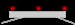
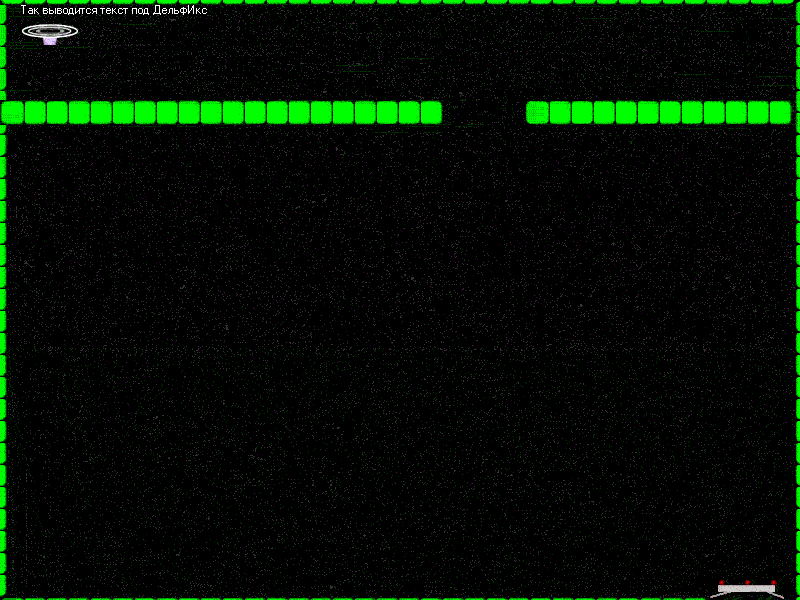

Обработка событий клавиш в DelphiX
==================================

::: {.date}
01.01.2007
:::

Этот урок не совсем посвящен ДельфИксу. Сейчас вы научитесь обрабатывать
такие события, как, например, нажатия клавиш. Но делать мы это будем не
при помощи DXInput, так как я все ещё не знаю как с ним работать, делать
мы это будем при помощи трех обычных событий: onKeyDown, onKeyUp и
onKeyPreesed. Эти свойства есть и у формы и у DXDraw. Я буду работать с
формой, кому больше нравится - могут работать с DXDraw, это ничего не
меняет. Итак, в прошлый раз у нас была тарелка, летящая по уже заданной
траектории. Теперь, я думаю было бы неплохо сделать спрайт стенки
квадратным и небольшим, размножить их и добавить гравитацию, чтобы можно
было летать по лабиринту и избегать столкновения со стенкой. Теперь
стенка будет такой:

{.center}

Можно будет размножить её, зная, что её размеры 23х23 и выстроить
лабиринт. Кроме того не помешает создать спрайт \"посадочной площадки\",
чтобы в лабиринте была цель. У меня она будет такой:

{.center}

Теперь о том, как мы будем изменять координаты спрайта при создании.
Конструктор Twall.Create теперь будет выглядеть так:(wx и wy -
переменные типа Integer)

    constructor Twall.Create(AParent: TSprite);
    begin
      inherited Create(AParent);
      Image := Form1.ImageList.Items.Find('wall');
      X := wx;
      Y := wy;
      Z := 0;
      Width := Image.Width;
      Height := Image.Height;
      PixelCheck := True;
    end;

Как вы уже наверно догадались, мы будем менять wx и wy для изменения
координат стенки. Для того, чтобы построить вертикальную или
горизнтальную линии мы будем использовать цикл for чтобы не мучиться.
Привожу листинг стенки(сами разберетесь, листинг совсем несложный).

    wy:=100;wx:=0;tx:=0;ty:=0;
    for i:=1 to 20 do
    begin
      Twall.create(SpriteEngine.Engine);
      wx:=wx+22;
    end;
    wy:=100;wx:=525;
    for i:=1 to 12 do
    begin
      Twall.create(SpriteEngine.Engine);
      wx:=wx+22;
    end;
    wy:=-20;wx:=0;
    for i:=1 to 36 do
    begin
      Twall.create(SpriteEngine.Engine);
      wx:=wx+22;
    end;
    wy:=597;wx:=0;
    for i:=1 to 32 do
    begin
      Twall.create(SpriteEngine.Engine);
      wx:=wx+22;
    end;
    wy:=0;wx:=-18;
    for i:=1 to 36 do
    begin
      Twall.create(SpriteEngine.Engine);
      wy:=wy+22;
    end;
    wy:=0;wx:=795;
    for i:=1 to 36 do
    begin
      Twall.create(SpriteEngine.Engine);
      wy:=wy+22;
    end;

После всего этого должна получиться примерно такая картинка

{.center}

Теперь главное: заставить тарелку двигаться в зависимости от того, какие
клаишы нажаты. \"Раскладка\" будет простой: W A S D, по их расположению,
то есть W-вверх S-вниз А-влево D-вправо. Теперь о том, как мы это будем
делать: мы будем менять две переменные, tx и ty(по аналогии с wx и wy).
Менять мы их будем так: нажали W - ty увеличилась на 1, отпустили -
уменьшилась. Создадим обработчики двух процедур: onKeyUp и onKeyDown. В
onKeyDown\'е пишем:

    case chr(ord(Key)) of
      'W','Ц': ty := -1;
      'S','Ы': ty := 1;
      'D','А': tx := 1;
      'A','Ф': tx := -1;
    end;

Разбираем: case ... of ... end; - обычный оператор перебора вариантов,
в вариантах стоят две буквы для того, чтобы программа не зависела от
того, какой язык включен - русский или английский. В onKeyUp\'е
пишем(разбора не будет):

    case chr(ord(Key)) of
      'W','Ц': ty := 0;
      'S','Ы': ty := 0;
      'D','А': tx := 0;
      'A','Ф': tx := 0;
    end;

Теперь добавляем гравитацию (в Ttarelka.Move вместо Y:=Y+ty пишем
Y:=Y+ty+1) и этот урок закончен!

<https://delphiworld.narod.ru/>

DelphiWorld 6.0
