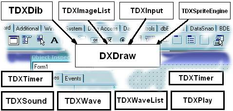

# Изучаем DelphiX

29 июня 2006 (Обновление: 28 фев 2009)

* [Часть 0: «Теория».](#part0 "Изучаем DelphiX: Часть 0: «Теория».")
    - [1. Обзор DelphiX.](#obzor_delphix "Изучаем DelphiX: 1. Обзор DelphiX.")
    - [2. Принцип написания кода и основные процедуры для классов.](#principal "Изучаем DelphiX: 2. Принцип написания кода и основные процедуры для классов.")
* [Часть 1: Первая игра.](part1/ "Изучаем DelphiX: Часть 1: Первая игра.")
* [Часть 2: Усложняем нашу игру.](part2/ "Изучаем DelphiX: Часть 2: Усложняем нашу игру.")
    - [Создание анимации.](part2/#animation "Изучаем DelphiX: Создание анимации.")
    - [Cоздание примитивного AI.](part2/#ai "Изучаем DelphiX: Cоздание примитивного AI.")
    - [Создадим простенькие взрывы.](part2/#explosive "Изучаем DelphiX: Создадим простенькие взрывы.")
* [Часть 3: Крутим спрайты.](part3/ "Изучаем DelphiX: Часть 3: Крутим спрайты.")
* [Часть 4: Разбираем классы.](part4/ "Изучаем DelphiX: Часть 4: Разбираем классы.")
* [Часть 5: AI.](part5/ "Изучаем DelphiX: Часть 5: AI.")
* [Часть 6: Мультиплеер.](part6/ "Изучаем DelphiX: Часть 6: Мультиплеер.")
* [Часть 7: Звуки и музыка.](part7/ "Изучаем DelphiX: Часть 7: Звуки и музыка.")
* [Часть 8: The End?](part8/ "Изучаем DelphiX: Часть 8: The End?")

_«Теория, теория ну а практика,  
а практика потом» —  
Так подумал автор, начиная  
писать эту статью._

## Часть 0: «Теория».

Здравствуйте дорогие мои! Сегодня мы будем учиться работать в DelphiX.

В этой части вы узнаете:

1. Обзор DelphiX (Что? К чему?).
2. Принцип написания кода и основные процедуры для классов.

Ну что же, приступим:

### 1. Обзор DelphiX.

DelphiX - это набор компонентов, способный облегчить использование
DirectX в Delphi приложениях и использовать всю мощь DirectX.

#### Основные компоненты DelphiX:

TDXDraw — (Это такой мониторчик).
Дает доступ к поверхностям DirectDraw
(проще говоря, эта вещь которая отображает всё).
Проще говоря, сам DirectDraw.

TDXDib - Позволяет хранить DIB (Device Independent Bitmap).

TDXImageList — Позволяет хранить серии DIB, Jpg, bmp-файлов, что очень
удобно для программ, содержащих спрайты. Позволяет загружать DIB\`ы с
диска во время выполнения программы.

TDXSound — Проигрыватель звуков в формате Wav.

TDXWave — «Контейнер» для wav-файла.

TDXWaveList — Позволяет хранить серии для wav-файлов.

TDXInput — Позволяет использовать DirectInput, т.е. получить доступ к
устройствам ввода информации (мышь, клавиатура, джойстик).

TDXPlay — Компонент позволяющий обмениваться информацией на
компьютерах.

TDXSpriteEngine — Спрайтовый движок.

TDXTimer — Более точный, чем TTimer.

TDXPaintBox — Альтернатива TImage, только DIB-версия.

В DelphiX есть самостоятельные компоненты, а есть вспомогательные,
вот, например, DXSpriteEngine не может без DXDraw
(где он будет отображать всё действия происходящие на сцене).

Вот таблица зависимых и вспомогательных:

{.center}

### 2. Принцип написания кода и основные процедуры для классов.

Весь принцип очень прост и удобен, сейчас объясню:
весь код строится по классам, в каждом классе свои процедуры,
каждый новый тип юнита это новый класс и в каждом классе свои процедуры.
Рассмотрим на живом примере: возьмём камень и бумагу.
Бумага мнётся, камень нет.
Так и здесь, в одном классе это свойство есть, в другом нет,
рассмотрим кусок кода, отвечающий за класс:

    TPlayerFa = class(TImageSprite)
       protected
        procedure DoCollision(Sprite: TSprite; var Done: Boolean); override;
        procedure DoMove(MoveCount: Integer); override;
       public
        constructor Create(AParent: TSprite); override;
        destructor Destroy; override;
       end;

Здесь нам виден класс TplayerFa, его процедуры:

`procedure DoCollision(Sprite: TSprite; var Done: Boolean); override;` -
Это процедура столкновения, что будет происходить при столкновении

`procedure DoMove(MoveCount: Integer); override;` -
Это процедура движения, в ней указывается, как класс будет двигаться.

(в следующих частях я опишу и расскажу про все функции и их использование на практике)

`constructor Create(AParent: TSprite); override;` -
Это конструктор Create очень полезная вещь он отвечает за происходящим во время создания объекта.

`destructor Destroy; override;` -
Альтернатива, только при уничтожении объекта.

После написания класса каждая процедура расписывается, и всё, можно писать сам код.
(Но это мы будем делать позже.)
