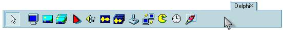
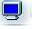
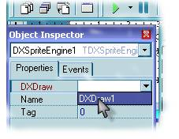
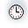
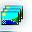
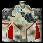
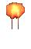
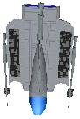
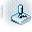
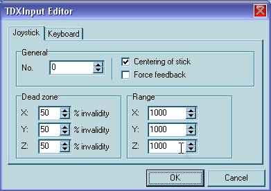

# Изучаем DelphiX
Влад Энгельгардт  
29 июня 2006 (Обновление: 28 фев 2009)

# Часть 1: Первая игра.

::: {.float-right}
*«Как много игр-то хороших,  
Да только сегодня не до них»  
Автор.*
:::

Теперь мы создадим первую, и надеюсь не последнюю игрушку,
смысл у нас будет такой:
Мы - маленький космический корабль,
нам надо уничтожить большой статичный космический корабль  
(прим. автора: "Этот пример научит мыслить по DelphiX-ски").

Итак, запускаем Delphi (Для тех, кто в танке, у кого 6-ая,
ищите на этом же сайте статью "DelphiX для Delphi6").
Вы, надеюсь, предварительно установили DelphiX,
тогда ищем в панели с компонентами раздел DelphiX:

Кидаем на форму следующие компоненты:

 **DXDraw** —
и проставляем в нем следующие опции в Object Inspector:

Align = alClient - это нужно для того чтобы DXDraw «обтянул» всю форму.

Display = 800x600x16 - почему, спросите вы, не 800x600x24? Да потому что не все видеокарты поддерживают 24 битный режим.

Options-doFullScreen = True, если хочешь чтобы твоя игра была на весь экран,
и ещё надо в свойствах формы поставить: BorderStyle = bsnone.

 **TDXSpriteEngine** — Сам движок для работы со спрайтами. В нём нужно только выбрать в поле DXDraw сам DXDraw1.

 **TDXTimer** — Он вообще-то и нужен,
чтобы обновлять кадры, но он нам пригодится и для другого.
Свойства следующие:

Active Only = False - По-русски: "Быть активным всегда".
Смысл: Работает даже если вы, работаете с другим приложением.  

Interval = 0 - Частота повторения цикла, должна быть равна 0.

 **TDXImageList** — В этом листе будут у нас хранится все спрайты.
Свойства:

DXDraw = DXDraw1

После кликаем на Items: (TPictureCollection),
появляется окно Editing DxImagelist1.Items.
В нём кликаем по Add New и в Object Inspector в поле "Name" пишем название спрайта,
назовем его "pla" - это будет сам игрок, загружаем его с помощью Picture...
Игрок у меня будет вот такой:

Только фон чёрный - для прозрачности.
Устанавливаю в Object Inspector у данной картинки свойства
Transparent = true и TransparentColor = clBlack.

Создаём ещё один спрайт под именем Pula проделываем тоже самое с ним,
только TransparentColor = clWhite.

Выглядит пуля вот так:

И последнее что нам осталось, добавить этого босса, называем его "BOSS", вот он:

TransparentColor = clWhite. На этом с DXImageList мы пока закончили. 

 **TDXInput** — Ну, а этот компонент будет отвечать за нажатые клавиши на клавиатуре.
В нем никакие изменения делать не будем, только рассмотрим его (на будущее).
Кликнем 2 раза по компоненту, и появится TDXInput Editor,
выглядит он вот так:

Первая закладка устанавливает свойства джойстика, вторая клавиатуры.
Вот закладка со свойствами клавиатуры нам и нужна.
Вот так она выглядит:

Слева - условное название клавиш, а справа - их значение.
Каждому условному названию может быть присвоено 3 клавиши.
Всего условных названий 36 штук.

Ну что, теперь приступаем к написанию кода.
Вначале нужно изменить класс формы на TDXForm вот пример:

До:

    //...
    type
      TForm1 = class(TForm)
        DXDraw1: TDXDraw;
        DXImageList1: TDXImageList;
        DXInput1: TDXInput;
    //...

После:

    //...
    type
      TForm1 = class(TDXForm)
        DXDraw1: TDXDraw;
        DXImageList1: TDXImageList;
        DXInput1: TDXInput
    //...

Дальше расписываем классы после implementation.

Вот так:

    {$R *.DFM}
     
    type
      TPlayerSprite = class(TImageSprite)       //Класс игрока
      protected
        procedure DoMove(MoveCount: Integer); override; // Движение
      end;
     
      TBoSS = class(TImageSprite) // Класс босса
       Protected
        // Столкновение
        procedure DoCollision(Sprite: TSprite; var Done: Boolean); override;
        procedure DoMove(MoveCount: Integer); override;
      public
        constructor Create(AParent: TSprite); override; //при создании
        destructor Destroy; override; // при смерти
      end;
     
    TPlayerFa = class(TImageSprite)  
       protected
        procedure DoCollision(Sprite: TSprite; var Done: Boolean); override;
        procedure DoMove(MoveCount: Integer); override; 
       public
        constructor Create(AParent: TSprite); override;
        destructor Destroy; override;
      end;

Далее расписываем каждую процедуру для каждого класса. Вот образец:

    Procedure TPlayerFa.DoMove(MoveCount: Integer);
    Begin
      inherited DoMove(MoveCount);
    end;
     
    constructor TPlayerFa.Create(AParent: TSprite);
    begin
    end;
     
    destructor TPlayerFa.Destroy;
    begin
      inherited Destroy; // Обязательно 
    
    end;
     
    procedure TPlayerFa.DoCollision(Sprite: TSprite; var Done: Boolean);
    begin
    end;

Это нужно проделать с каждым классом, который содержит свои процедуры,
указанные в классе.

Далее выбираем компонент DXTimer который уже на форме
и в Object Inspector в закладке Events, находим пункт OnTimer.
Два раза кликаем по пункту, создаётся процедура DXTimer1Timer,
в ней пишем следующие строчки:

    if not DXDraw1.CanDraw then exit; // Если нет DirectX выходим
      DXInput1.Update;
      DXSpriteEngine1.Move(LagCount);
      DXSpriteEngine1.Dead;
      DXDraw1.Surface.Fill(0);
      DXSpriteEngine1.Draw;
      DXDraw1.Flip;

Далее:

Кликая на форму в свободное место и Object Inspector в закладке Events,
находим OnCreate. Создаём процедуру и пишем в ней:

    with TBOSS.Create(Dxspriteengine1.Engine) do
    begin
     PixelCheck := True;            // для столкновения просчитывает каждую точку
      Image := form1.dxImageList1.Items.Find('BOSS'); //ищем спрайт в ImageList`е
      x:=350; // x координаты 
      y:=10;  // y координаты
      Width := Image.Width;          //ширина равна ширине спрайта 
      Height := Image.Height;        //высота равна высоте спрайта
    end;
     
    with TPlayerSprite.Create(Dxspriteengine1.Engine) do
    begin
     PixelCheck := True;
      Image := form1.dxImageList1.Items.Find('Pla');
      x:=350;
      y:=500;
      Width := Image.Width;
      Height := Image.Height;
    end;

Сейчас объясню, зачем это всё.
При создании формы мы создаём все статичные объекты сразу.

Ну, что? Теперь можно перейти к процедурам и их заполнению :)
Начнём с процедур босса. Они самые простые.

Перед `implementation` в `var` добавить переменную:

i:boolean; //переменная движения в сторону BOSSA

и в свойствах формы OnCreate добавить:

I:=true;

Только после этого пишем следующее:

    Procedure TBoSS.DoMove(MoveCount: Integer);
       begin
       inherited DoMove(MoveCount);
       if x>= 700 then I:= true;    // когда X>= то  туда >>>
       if x<= 0 then I:= false;     // когда X<= то  туда <<<
       if  i= true then X := X+10;
       if i= false then X := X-10;
    Collision;
    end;
     
    constructor TBOSS.Create(AParent: TSprite); //Здесь всё понятно
    begin
      inherited Create(AParent);
      Image := form1.DXImageList1.Items.Find('BOSS');
      Width := Image.Width;
      Height := Image.Height;
    end;
     
    destructor TBOSS.Destroy;  //тут тоже
    begin
      inherited Destroy;
    end;
     
    procedure TBoss.DoCollision(Sprite: TSprite; var Done: Boolean);
    begin
      // если спрайт сталкивается с Tplayerfa, то умирает
      if Sprite is Tplayerfa then dead;
      Collision; // Включаем столкновение
    end;

Ну, вроде, с одним объектом разобрались, переходим к игроку,
тут одна процедура

    Procedure TPlayerSprite.DoMove(MoveCount: Integer);
    begin
      inherited DoMove(MoveCount);
        // при нажатии двигаем объект влево
        if isLeft in Form1.DXInput1.States then x:=x-5;
        // при нажатии двигаем объект вправо
        if isRight in Form1.DXInput1.States then x:=x+5;
        // при нажатие вверх создаётся наша пулька
        if isup in Form1.DXInput1.States then
        begin
          with TPlayerFa.Create(Engine) do
          begin
            PixelCheck := True;
            Image := form1.dxImageList1.Items.Find('Pula');
            //Чтобы пуля создавалась около нашего объекта
            X := Self.X+Self.Width  -40;
            //Чтобы пуля создавалась около нашего объекта
            Y := Self.Y+Self.Height -80;
            Width := Image.Width;
            Height := Image.Height;
          end;
        end;
        if  y >= form1.DXDraw1.SurfaceHeight-image.Height then  //не пускаем
          y := form1.DXDraw1.SurfaceHeight-image.Height;        //объект
        if  x >= form1.DXDraw1.SurfaceWidth -image.Width  then  //за границы
          x := form1.DXDraw1.SurfaceWidth -image.Width;         //формы
        if  y <= 0 then
          y := 1;
        if  x <= 0 then
          x:=1;
    end;

И, наконец, последнее, это сама пуля и её процедуры:

    Procedure TPlayerFa.DoMove(MoveCount: Integer); 
    begin
       inherited DoMove(MoveCount);
       y:=y-3;  //проще некуда, неправда ли?
    end;
     
    procedure TPlayerFa.DoCollision(Sprite: TSprite; var Done: Boolean);
    begin
      if Sprite is TBoss then dead;
        Collision;
    end;

И на последок, для удобства в Object Inspector в закладке Events находим
OnKeyDown, кликаем и пишем:

if Key=VK\_ESCAPE then application.Terminate;

При вставке этого кода по нажатию клавиши ESC выходим из приложения.

Вот и всё! Это одно из самых примитивных игр на DelphiX, но ты её сам сделал.

Вот вам Д/З для улучшения знаний:

1. Сделайте так, чтобы при уходе патрона из зоны видимости он уничтожался.
2. Сделайте, чтобы патроны стреляли очередями, а не кучами как у меня.

Исходный код примера к этому уроку: [part1.rar](part1.rar) (20,5 кБ) (Проект сделан в Delphi 6)

