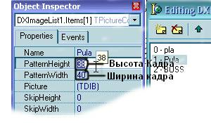
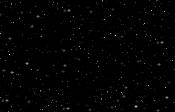

# Изучаем DelphiX

Влад Энгельгардт

29 июня 2006 (Обновление: 28 фев 2009)

## Часть 2: Усложняем нашу игру.

*«Хех! загружу»*

Прежде чем начать, объясню решение Д/З:

1. Сделайте так, чтобы при уходе патрона из зоны видимости он
уничтожался:

Это очень легко сделать достаточно в процедуру DoMove патрона вставить:

    if y<= 0 then Dead;
    if y>= 600 then Dead;

Нужно это для того, чтобы повысилось качество игры.

2. Сделайте, чтобы патроны стреляли очередями, а не кучами как у меня:

Вот эта задача была посложнее первой. Во-первых, как я сделал в первой
части этого туториала, делать нельзя из-за причины небольшой
"кривости" DelphiX, он может держать только определённое количество
спрайтов, а если их больше он или выходит или подвисает.
Так что, делаем вот так:

В класс с плеером добавляем две переменные, он теперь выглядит так
(я добавил комментарии к тем строчкам которые изменились):

    TPlayerSprite = class(TImageSprite)
       Private 
        lngpolet:integer;    //расстояние которое пролетела пуля 
        oldlngpolet:integer; //расстояние которое пролетела предыдущая пуля
      protected
        procedure DoMove(MoveCount: Integer); override;
      end;

Процедура DoMove класса PlayerSprite изменяется следующим образом:

    Procedure TPlayerSprite.DoMove(MoveCount: Integer);
    Begin
      inherited DoMove(MoveCount);
      if isLeft in Form1.DXInput1.States then x:=x-5;
      if isRight in Form1.DXInput1.States then X:=x+5;
      if isup in Form1.DXInput1.States then
      begin
        if lngpolet-oldlngpolet>=250 then // Если расстояние между пулями меньше 250,
                                          // то пуля не создаётся
        begin
          Inc(lngpolet);
          with TPlayerFa.Create(Engine) do
          begin
            PixelCheck := True;
            Image := form1.dxImageList1.Items.Find('Pula');
            X := Self.X+Self.Width  -40;
            Y := Self.Y+Self.Height -80;
            Width := Image.Width;
            Height := Image.Height;
          end;
          oldlngpolet := lngpolet; //после создания пули - последняя становится первой
        end;
      end;
      if  y >= form1.DXDraw1.SurfaceHeight-image.Height then
        y := form1.DXDraw1.SurfaceHeight-image.Height;
      if  x >= form1.DXDraw1.SurfaceWidth -image.Width  then
        x := form1.DXDraw1.SurfaceWidth -image.Width;
      if  y <= 0 then
        y := 1;
      if  x <= 0 then
        x:=1;
      lngpolet := lngpolet + MoveCount;  // расстояние увеличиваем, когда пуля движется
    end;

Вот и всё, что требовалось сделать.

В этой части вы узнаете:

1. Создание анимации.
2. Создание примитивного AI.
3. Создадим простенькие взрывы.

Создание анимации.

Анимация в DelphiX строится следующим образом:

Это пример покадровой анимации.
У каждого кадра должен быть одинаковый размер.

В данной ситуации:  
Ширина: 40  
Высота: 38

Давайте теперь, применим ее к нашей игре.

Идём в DXImageList, находим наш спрайт Pula и загружаем картинку с
анимацией. Далее устанавливаем свойства спрайта следующим образом:

и в процедуре DoMove класса PlayerSprite изменяем код следующим образом:

    Procedure TPlayerSprite.DoMove(MoveCount: Integer);
    begin
      inherited DoMove(MoveCount);
      if isLeft in Form1.DXInput1.States then  x:=x-5;
      if isRight in Form1.DXInput1.States then X:=x+5;
      if isup in Form1.DXInput1.States then
      begin
        if lngpolet-oldlngpolet>=250 then
        begin
          Inc(lngpolet);
          with TPlayerFa.Create(Engine) do
          begin
            PixelCheck := True;
            Image := form1.dxImageList1.Items.Find('Pula');
            X := Self.X+Self.Width  -40;
            Y := Self.Y+Self.Height -80;
            Width := Image.Width;
            Height := Image.Height;
            AnimCount := Image.PatternCount; //число кадров
            AnimLooped := True;              //повторять ли анимацию
            AnimSpeed := 10 / 1000;          //скорость анимации
          end;
          oldlngpolet := lngpolet;
        end;
      end;
      if  y >= form1.DXDraw1.SurfaceHeight-image.Height then
        y := form1.DXDraw1.SurfaceHeight-image.Height;
      if  x >= form1.DXDraw1.SurfaceWidth -image.Width  then
        x := form1.DXDraw1.SurfaceWidth -image.Width;
      if  y <= 0 then
        y := 1;
      if  x <= 0 then
        x:=1;
      lngpolet := lngpolet + MoveCount;
    end;

Можно проделать тоже самое с другими классами для придания
реалистичности игры.

### Cоздание примитивного AI.

Для начала маленько улучшим наш класс плеера, добавим в него
столкновение, и он теперь выглядит следующим образом:

    TPlayerSprite = class(TImageSprite)
       private
        lngpolet:integer;
        oldlngpolet:integer; 
      protected
        procedure DoMove(MoveCount: Integer); override;
        //добавляем
        procedure DoCollision(Sprite: TSprite; var Done: Boolean); override;
      end;

Далее создаём процедуру DoCollision и вставляем в неё следующее:

    procedure TPlayerSprite.DoCollision(Sprite: TSprite; var Done: Boolean);
    begin
      if Sprite is TPlayerFa then Dead;
      Collision;
    end;

Дальше пред implementation добавляем 1 переменную:

      plx:double;            //X плеера

Далее обновим класс TPlayerFa и он станет таким:

    TPlayerFa = class(TImageSprite)
      private
        stril:Integer; // Как вы заметили, добавилась переменная
      protected
        procedure DoCollision(Sprite: TSprite; var Done: Boolean); override;
        procedure DoMove(MoveCount: Integer); override;
       public
        constructor Create(AParent: TSprite); override;
        destructor Destroy; override;
      end;

А в TPlayerFa добавляем строчку:

    Procedure TPlayerFa.DoMove(MoveCount: Integer);
    begin
       y:=y-stril; // когда стреляет игрок, с этой скоростью будет двигаться пуля
       y:=y+stri; // когда стреляет AI, с этой скоростью будет двигаться пуля
       if y<= 0 then Dead;
       if y>= 600 then Dead;
    end;

А процедура TBoSS.DoMove становится такой:

    Procedure TBoSS.DoMove(MoveCount: Integer);
      begin
       inherited DoMove(MoveCount);
       if x>= 600 then I:= false;
       if x<= 0 then I:= true;
       if i= true then X := X+5;
       if i= false then X := X-5;
       if plx=x then //если равна х плеера стреляем
       begin
         with TPlayerFa.Create(Engine) do
          begin
          PixelCheck := True;
          Image := form1.dxImageList1.Items.Find('Pula');
          X := Self.X+Self.Width-70;
          Y := Self.Y+Self.Height+10;
          Width := Image.Width;
          Height := Image.Height;
          stril:=5;        //скорость патрона
          end;
       end;
        Collision;
    end;

И естественно полнеет и TPlayerSprite:

    Procedure TPlayerSprite.DoMove(MoveCount: Integer);
    begin
      inherited DoMove(MoveCount);
      plx:=x;            //чтобы наш комп видел нашего плеера
      if isLeft in Form1.DXInput1.States then
      begin
        x:=x-5;
        plx:=x;
      end;
      if isRight in Form1.DXInput1.States then
      begin
        X:=x+5;
        plx:=x;
      end;
      if isup in Form1.DXInput1.States then
      begin
        if lngpolet-oldlngpolet>=250 then
        begin
          Inc(lngpolet);
          with TPlayerFa.Create(Engine) do
          begin
            PixelCheck := True;
            Image := form1.dxImageList1.Items.Find('Pula');
            X := Self.X+Self.Width  -40;                    
            Y := Self.Y+Self.Height -80 ;                   
            Width := Image.Width;
            Height := Image.Height;
            stril:=-4;
          end;
          oldlngpolet := lngpolet;
        end;
      end;
      if  y >= form1.DXDraw1.SurfaceHeight-image.Height then  
        y := form1.DXDraw1.SurfaceHeight-image.Height;               
      if  x >= form1.DXDraw1.SurfaceWidth -image.Width  then  
        x := form1.DXDraw1.SurfaceWidth -image.Width;                 
      if  y <= 0 then
        y := 1;
      if  x <= 0 then
        x:=1;
      lngpolet := lngpolet + MoveCount;
      Collision;
    end;

И поменялся конструктор PlayerFa:

    constructor TPlayerFa.Create(AParent: TSprite);
    begin
      inherited Create(AParent);
      Image := form1.DXImageList1.Items.Find('Pula');
      Width := Image.Width;
      Height := Image.Height;
      AnimCount := Image.PatternCount;    //число кадров
      AnimLooped := True;                 //повторять ли анимацию
      AnimSpeed:= 10 / 1000;
      Collision;
    end;

Создадим простенькие взрывы.

Для начала загрузим спрайт взрыва в DXImageList вот он:

Назовём его "ex" и установим размер кадра на 32Х48 (PatternHeight -
PatternWidth)

Дальше, в класс TPlayerSprite в private добавляем procedure Hit; и
создаём обработчик:

    procedure TplayerSprite.Hit;
    begin
      Collisioned := False;
        Image := Form1.dxImageList1.Items.Find('Ex');
        Width := Image.Width;
        Height := Image.Height;
        AnimCount := Image.PatternCount;
        AnimLooped := False;
        AnimSpeed := 15/1000;
        AnimPos := 0;
    end;

и в процедуре TPlayerSprite.DoCollision вставляем следущий код:

    procedure TPlayerSprite.DoCollision(Sprite: TSprite; var Done: Boolean);
    begin
      if sprite is Tplayerfa then
      begin
        TPlayerSprite(Sprite).Hit;
        dead;
      end;
      Done := False;
    end;

Этот код надо разместить и в Tboss. DoCollision.

И под конец маленький бонус:

Можно создать бэкграунд, без создания нового класса достаточно в
FormCreate написать:

      with TBackgroundSprite.Create(DXSpriteEngine1.Engine) do
      begin
        SetMapSize(1,1);
        Image := dxImageList1.Items.Find('bgr');
        Z:= -2;
        Tile := True;
      end;

Где bgr спрайт-бэкграунд.

Вот мой БГ:

Нравится?
Здесь можно скачать исподники всей этой части.  
[part2.rar](part2.rar) (77,5 kB)
