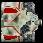
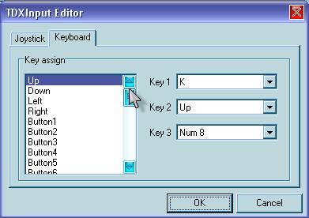

# Изучаем DelphiX

Влад Энгельгардт

29 июня 2006 (Обновление: 28 фев 2009)

## Часть 3: Крутим спрайты.

*«Крутимся не накрутимся:)»*

В DelphiX существует маленькая проблема, это разворот спрайтов.
Она решается относительно просто, сейчас я объясню, как и что.

Для начала создадим новый проект в Delphi, подстроим его под шаблон
(об этом написано в одной из частей цикла).
Далее скачиваем мною модернизированный [DXSprite.pas](Dxsprite.rar),
в папке, где у вас установлен DelphiX есть папочка Source,
копируем его туда.
В DXSprite.pas я добавил всего одну процедуру Angle -
это и есть процедура разворота, как она работает можете посмотреть,
сами поковырявшись в исходниках.
Ну что, приступим?
Для начала создадим простенький пример
(в архиве с исходниками в папке 3.1).

Создаём новый класс:

    TPlayerone = class(TImageSprite)
      protected
        procedure DoMove(MoveCount: Integer); override;
    end;

Соответственно и процедуру DoMove к этому классу:

    Procedure TPlayerone.DoMove(MoveCount: Integer);
    begin
      inherited DoMove(MoveCount);
      x:=x+cos256(Angle)*speed; //обработчик движения по X
      y:=y+sin256(Angle)*speed; //обработчик движения по Y
      if  y >= form1.DXDraw1.SurfaceHeight-image.Height then
        y := form1.DXDraw1.SurfaceHeight-image.Height;
      if  x >= form1.DXDraw1.SurfaceWidth -image.Width  then
        x := form1.DXDraw1.SurfaceWidth -image.Width;
      if  y <= 0 then
        y := 1;
      if  x <= 0 then
        x:=1;
      begin
        speed:=0;     //когда ничего не делаем, скорость равна 0
        if isLeft in Form1.DXInput1.States then angle:=angle-5;
        if isRight in Form1.DXInput1.States then angle:=angle+5;
        if isup in Form1.DXInput1.States then speed:=4;
        if isDown in Form1.DXInput1.States then speed:=-4;
      end;
    end;

И перед implementation в Var добавляем:

    var
      Form1: TForm1;
      speed: integer;  // Это у нас переменная скорости объекта

Не забудь в DXtimer добавить:

    procedure TForm1.DXTimer1Timer(Sender: TObject; LagCount: Integer);
    begin
      if not DXDraw1.CanDraw then exit;
      DXInput1.Update;
      DXSpriteEngine1.Move(LagCount);
      DXSpriteEngine1.Dead;
      DXDraw1.Surface.Fill(0);
      DXSpriteEngine1.Draw;
      DXDraw1.Flip;
    end;

И в процедуре FormCreate создаём наш спрайт:

    procedure TForm1.FormCreate(Sender: TObject);
    begin
      with TPlayerone.Create(Dxspriteengine1.Engine) do
      begin
        PixelCheck := True;
        Image := form1.dxImageList1.Items.Find('krut');
        x:=350;
        y:=250;
        Width := Image.Width;
        Height := Image.Height;
      end;
    end;

Далее в DXImageList добавляем спрайт "krut" он у меня выглядит вот так:

И всё, простейший пример с Angle готов.

Теперь давайте усложним наш пример и сделаем так
чтобы игрок стрелял в ту сторону куда он смотрит,
для этого создаём новый класс для патрона.
Выглядит он так:

    TPlayerFa = class(TImageSprite)
      protected
        procedure DoMove(MoveCount: Integer); override;
      private
        anglefa:integer; // Угол под которым летит пуля
      public
        constructor Create(AParent: TSprite); override;
        destructor Destroy; override;
    end;

Перед implementation добавляется ещё одна переменная ang:

    var
      Form1: TForm1;
      speed,ang: integer;

Она нужна для выноса значения Angle плеера. А зачем нужен вынос,
спросишь ты, да всё очень просто, он нужен для патрона, чтобы указывать
ему, под каким углом лететь т.е. под каким углом находиться плеер под
таким углом и летит патрон.

Маленько модернизируем класс плеера:

    TPlayerone = class(TImageSprite)
      private
        lngpolet:integer;  // мы же не хотим, чтобы наши пули летали кучами
        oldlngpolet:integer; // а мы сделаем чтобы летали стаями :)
      protected
        procedure DoMove(MoveCount: Integer); override;
    end; 

Сразу, чтобы не забыть конструктор и деструктор для патрона:

    constructor TPlayerFa.Create(AParent: TSprite);
    begin
      inherited Create(AParent);
      Image := form1.DXImageList1.Items.Find('pul');
      Width := Image.Width;
      Height := Image.Height;
    end;
     
    destructor TPlayerFa.Destroy;
    begin
      inherited Destroy;
    end;

Ну а теперь движение патрона:

    procedure TPlayerFa.DoMove(MoveCount: Integer);
    begin
      inherited DoMove(MoveCount);
      angle := anglefa;
      x:=x+cos256(angle)*7; // цифра 7 здесь скорость патрона и изменять её надо
      y:=y+sin256(angle)*7; // пропорционально
      if X>= 800 then Dead;
      if y>= 600 then Dead;
      if X<= 0 then Dead;
      if y<= 0 then Dead;
      Collision;
    end;

Надеюсь, ты помнишь, на прошлых уроках я рассказывал тебе об DXInput,
так вот теперь нам понадобятся дополнительные кнопочки. Их значения ты
можешь поменять, два раза кликнув на самом компоненте. Так вот, гляди
процедуру DoMove у игрока:

    Procedure TPlayerone.DoMove(MoveCount: Integer);
    begin
      inherited DoMove(MoveCount);
      ang:=angle; // наша переменная для патрона
      x:=x+cos256(Angle)*speed;
      y:=y+sin256(Angle)*speed;
      if  y >= form1.DXDraw1.SurfaceHeight-image.Height then
        y := form1.DXDraw1.SurfaceHeight-image.Height;
      if  x >= form1.DXDraw1.SurfaceWidth -image.Width  then
        x := form1.DXDraw1.SurfaceWidth -image.Width;
      if  y <= 0 then
        y := 1;
      if  x <= 0 then
        x:=1;
      begin
        speed:=0;
        if isLeft in Form1.DXInput1.States then angle:=angle-5;
        if isRight in Form1.DXInput1.States then angle:=angle+5;
        if isup in Form1.DXInput1.States then speed:=4;
        if isDown in Form1.DXInput1.States then speed:=-4;
        if isbutton1 in Form1.DXInput1.States then
        begin
          if lngpolet-oldlngpolet>=250 then
          begin
            Inc(lngpolet);
            with TPlayerFa.Create(Engine) do
            begin
              Image := form1.DXImageList1.Items.Find('pul');
              X:=self.X+cos256(ang)*50;  // здесь 50 расстояние патрона от плеера
              Y:=self.y+sin256(ang)*50;   //они должны быть пропорциональны
              anglefa:=ang; // передаём угол
              oldlngpolet := lngpolet;
            end;
          end;
        end;
        lngpolet := lngpolet + MoveCount;
      end;
    end;   

И последнее что осталось это создать спрайт "pul" в DXimageList.
Он выглядит у меня вот так:

Что, устал?
Ну, расслабься, если хочешь.
Дальше мы сделаем следующее:

1. Добавим второго плеера
2. И научимся делать стрэйфы

Для начала установим новую раскладку в Dxinput.
Для этого два раза кликнем по кампоненту Dxinput
и преходим в закладку Keybord:

Сразу маленький совет: чтобы на одной кнопке у тебя не было 300 действий
для каждой метки, назначай только одну кнопку.

Я выбрал такой вариант для первого игрока:

Up- Num 8
Down - Num 5
Left - Num 4
Right - Num 6
Button1 - Num 0
Button2 - Num 7
Button3 - Num 9

Для второго игрока:

Button4 - T
Button5 - G
Button6 - F
Button7 - H
Button8 - E
Button9 - R
Button10 - Y

Посмотрите на клаву и поймёте раскладку.
Ну что, приступаем,
для начала перед Implementation добавим ещё две переменные,
только уже для второго игрока:

    var
      Form1: TForm1;
      speed,speed2,ang,ang2: integer;
    implementation

Теперь соответственно добавляем 2 игрока и модернизируем первого: 

    TPlayerone = class(TImageSprite)
      private
        lngpolet:integer;
        oldlngpolet:integer;
      protected
        procedure DoMove(MoveCount: Integer); override;
        //Добавили столкновение
        procedure DoCollision(Sprite: TSprite; var Done: Boolean); override;
    end;
     
    TPlayertwo = class(TImageSprite)
      private
        lngpolet:integer;
        oldlngpolet:integer;
      protected
        procedure DoMove(MoveCount: Integer); override;
        procedure DoCollision(Sprite: TSprite; var Done: Boolean); override;
    end;

и теперь обрабатываем DoCollision у обоих плееров:

    procedure TPlayerone.DoCollision(Sprite: TSprite; var Done: Boolean);
    begin
      if Sprite is Tplayerfa then dead;
    end;
     
    procedure TPlayertwo.DoCollision(Sprite: TSprite; var Done: Boolean);
    begin
      if Sprite is Tplayerfa then dead;
    end;

Процедура DoMove у первого игрока в корне изменяется:

    Procedure tPlayerone.DoMove(MoveCount: Integer);
    begin
      inherited DoMove(MoveCount);
      ang:=angle;
      x:=x+cos256(Angle)*speed;
      y:=y+sin256(Angle)*speed;
      if  y >= form1.DXDraw1.SurfaceHeight-image.Height then
        y := form1.DXDraw1.SurfaceHeight-image.Height;
      if  x >= form1.DXDraw1.SurfaceWidth -image.Width  then
        x := form1.DXDraw1.SurfaceWidth -image.Width;
      if  y <= 0 then
        y := 1;
      if  x <= 0 then
        x:=1;
      begin
        speed:=0;
        if isLeft in Form1.DXInput1.States then angle:=angle-5;
        if isRight in Form1.DXInput1.States then angle:=angle+5;
        if isup in Form1.DXInput1.States then speed:=4;
        if isDown in Form1.DXInput1.States then speed:=-4;
        if isbutton2 in Form1.DXInput1.States then
        begin
          x:= x+cos256 (angle+64)*3; // это у нас стрейф
          y:= y+sin256 (angle+64)*3; // 3 - на сколько быстро стрейфиться
        end;
        if isbutton3 in Form1.DXInput1.States then
        begin
          x:= x+cos256 (angle-64)*3; //тоже стрейф, только в
          y:= y+sin256 (angle-64)*3; //другую сторону
        end;
        if isbutton1 in Form1.DXInput1.States then
        begin
          if lngpolet-oldlngpolet>=250 then
          begin
            Inc(lngpolet);
            with TPlayerFa.Create(Engine) do
            begin
              Image := form1.DXImageList1.Items.Find('pul');
              X:=self.X+cos256(ang)*50;
              Y:=self.y+sin256(ang)*50;
              anglefa:=ang;
              oldlngpolet := lngpolet;
            end;
          end;
        end;
        lngpolet := lngpolet + MoveCount;
      end;
      Collision;
    end;

Аналогично и у второго плеера:

    Procedure TPlayertwo.DoMove(MoveCount: Integer);
    begin
      inherited DoMove(MoveCount);
      ang2:=angle;
      x:=x+cos256(Angle)*speed2;
      y:=y+sin256(Angle)*speed2;
      if  y >= form1.DXDraw1.SurfaceHeight-image.Height then
        y := form1.DXDraw1.SurfaceHeight-image.Height;
      if  x >= form1.DXDraw1.SurfaceWidth -image.Width  then
        x := form1.DXDraw1.SurfaceWidth -image.Width;
      if  y <= 0 then
        y := 1;
      if  x <= 0 then
        x:=1;
      begin
        speed2:=0;
        if isbutton6 in Form1.DXInput1.States then angle:=angle-5;
        if isbutton7 in Form1.DXInput1.States then angle:=angle+5;
        if isbutton4 in Form1.DXInput1.States then speed2:=4;
        if isbutton5 in Form1.DXInput1.States then speed2:=-4;
        if isbutton9 in Form1.DXInput1.States then
        begin
          x:= x+cos256 (angle-64)*3;
          y:= y+sin256 (angle-64)*3;
        end;
        if isbutton10 in Form1.DXInput1.States then
        begin
          x:= x+cos256 (angle+64)*3;
          y:= y+sin256 (angle+64)*3;
        end;
        if isbutton8 in Form1.DXInput1.States then
        begin
          if lngpolet-oldlngpolet>=250 then
          begin
            Inc(lngpolet);
            with TPlayerFa.Create(Engine) do
            begin
              Image := form1.DXImageList1.Items.Find('pul');
              X:=self.X+cos256(ang2)*50;
              Y:=self.y+sin256(ang2)*50;
              anglefa:=ang2;
              oldlngpolet := lngpolet;
            end;
          end;
        end;
        lngpolet := lngpolet + MoveCount;
      end;
      Collision;
    end;

И последнее в FormCreate добавляем, чтобы второй игрок креатился:

    procedure TForm1.FormCreate(Sender: TObject);
    begin
      with TPlayerone.Create(Dxspriteengine1.Engine) do
      begin
        PixelCheck := True;
        Image := form1.dxImageList1.Items.Find('krut');
        x:=350;
        y:=250;
        Width := Image.Width;
        Height := Image.Height;
      end;
     
      with TPlayertwo.Create(Dxspriteengine1.Engine) do
      begin
        PixelCheck := True;
        Image := form1.dxImageList1.Items.Find('krut');
        x:=50;
        y:=250;
        Width := Image.Width;
        Height := Image.Height;
      end;

И пару советов, для дебага можно выводить любую переменную на экран.
Для этого в DXTimer добавим следующие строчки:

    procedure TForm1.DXTimer1Timer(Sender: TObject; LagCount: Integer);
    begin
      if not DXDraw1.CanDraw then exit;
      DXInput1.Update;
      DXSpriteEngine1.Move(LagCount);
      DXSpriteEngine1.Dead;
      DXDraw1.Surface.Fill(0);
      DXSpriteEngine1.Draw;
      with DXDraw1.Surface.Canvas do
      begin
        Brush.Style := bsClear; //стиль
        Font.Color := clWhite; //цвет текста
        Font.Size := 12; // размер
        Textout(0, 0, 'FPS: '+inttostr(DXTimer1.FrameRate)); //вывод текста
        Textout(0, 24, 'спрайты: '+inttostr(DXSpriteEngine1.Engine.AllCount));
        Release;
      end;
      DXDraw1.Flip;
    end;

Здесь я вывожу Fps (кадры в секунду), и количество спрайтов на экране.

Д/З:

1. Сделай анимированные патроны.
2. Реализуй, чтобы вторым игроком управлял не человек, а созданный тобой интеллект.
3. Сделай так, чтобы вёлся счёт фрагов.
4. После смерти любого игрока, чтобы через 5 сек. происходил респаун.

Вот архив всего, что мы сегодня натворили: [part3.rar](part3.rar) (18kB).

Если у вас возникли какие-то вопросы или проблемы, пишите мне.

Влад Энгельгардт
