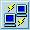
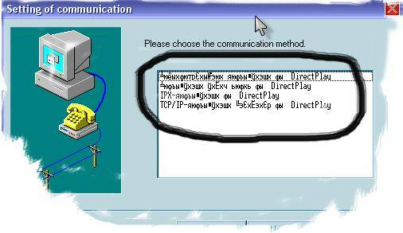
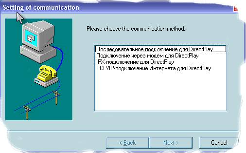
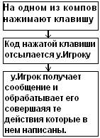

# Изучаем DelphiX

Влад Энгельгардт

29 июня 2006 (Обновление: 28 фев 2009)

## Часть 6: Мультиплеер.

*«SINGLE-хорошо, а  
MULTIPLAYER — лучше»*

Здравствуйте дорогие мои читатели.
Сегодня мы будем говорить о мультиплеере.
Точнее об его создании в DelphiX.
В DelphiX это реализуется с помощью компонента:

 **DXPlay**.
Многие, кто пытался что-то сделать на DXPlay, сталкивался с такой проблемой:
что если вызывать диалог с DXPlay то получаем непонятный текст: 



Устранить ее очень легко.
Дело в том, что из-за "НЕРУССКОГО" происхождения
программист Hiroyuki Hori в DXPlayFm.dfm
в некоторых местах поставил шрифт: "Terminal",
а нам нужен "MS Sans Serif".
Поэтому-то и всё так исковеркано.
Я исправил эту проблему вот так:



И выкладываю исправленный мною модуль DXPlayFm.dfm,
и более того, он русифицирован.
Так что пользуйтесь на здоровье :) [DXPlayFm.rar](DXPlayFm.rar).

Сегодня мы напишем простенькую, мультиплеерную гаму.
В этом я помогу вам.

В качестве шаблона я буду использовать [part2.rar](part2.rar).
Мы его модернизируем, и предадим ему мультиплеерность.
Сразу говорю, что part2.rar состоял из 2 интерактивных объектов,
соответственно и в наш мультиплеер можно играть только вдвоем.

Теперь я расскажу, как нужно модернизировать пример из второй части под
шестой :).

На мой взгляд, эта часть является единственно растолковывающая создание
мультиплеера под DelphiX.
Сколько я прочитал статей по программированию мультиплеера на DelphiX,
ничего путного не увидел.

Здесь я использую простой алгоритм.
Принцип его следующий:
передаются не координаты объекта, а клавиши,
которые были нажаты на удалённой машине.

- Кидаем на форму компонент DXPlay и устанавливаем вот такие свойства:

        MaxPlayers = 2, 
        GUID = {218A0D84-949C-42BC-A97B-40C3E3A642F1}.

    GUID можно создать любой, достаточно нажать на кнопку New.

- Добавляем в uses модуль: DirectX.

- После uses создаём список констант:

        const
          DXACTION_MESSAGE = 1; // Это нажата клавиша действия
          DXKEY_LEFT = 1;       // двигаемся влево
          DXKEY_RIGHT = 2;      // двигаемся вправо
          DXKEY_SHOOT = 3;      // Стреляем

- Создаём новый тип для наших ACTION сообщений:

        type
          TDXActionMessage = record
            dwType: DWORD;
            ActionCode: Integer;
          end; 

    Далее идут классы спрайтов:  
    Единственное, что поменялось это класс TBOSS,
    я его переименовал в TPLU.

    Когда мы поменяли названия, то и картинку нужно изменить на более
    подходящую.

- Заходим в DXImageList и переименовываем спрайт Boss на Plu.

    А вот картинка:

    

- В Var перед implementation обозначаем два наших класса:

        var
          Form1: TForm1;
          plu:Tplu;
          PlayerSprite:TPlayerSprite;
         
        implementation

- Теперь подходим к процедуре TPlayerSprite.DoMove.  
Она должна выглядеть вот так:

```delphi
Procedure TPlayerSprite.DoMove(MoveCount: Integer);
var
  Msg: ^TDXActionMessage; //Само сообщение
  msgSize: Integer; //размер сообщения
begin
  inherited DoMove(MoveCount);
  if form1.DXPlay1.Players.Count =2 then // пока в игру не зайдёт второй игрок
                                         // ни кто, не двинется
  begin
    if isLeft in Form1.DXInput1.States then
    begin
      x:=x-5;
      msgSize := SizeOf( TDXActionMessage );
      GetMem(Msg, MsgSize);
      msg.dwType := DXACTION_MESSAGE; //тип сообщения
      msg.ActionCode := DXKEY_LEFT; //действие
      form1.DXPlay1.SendMessage(DPID_ALLPLAYERS,msg,msgsize); //отсылаем всем
    end;
    if isRight in Form1.DXInput1.States then
    begin
      X:=x+5;
      msgSize := SizeOf( TDXActionMessage );
      GetMem(Msg, MsgSize);
      msg.dwType := DXACTION_MESSAGE;
      msg.ActionCode := DXKEY_RIGHT;
      form1.DXPlay1.SendMessage(DPID_ALLPLAYERS,msg,msgsize);
    end;
    if isup in Form1.DXInput1.States then
    begin
      if lngpolet-oldlngpolet>=900 then
      begin
        Inc(lngpolet);
        with TPlayerFa.Create(Engine) do
        begin
          msgSize := SizeOf( TDXActionMessage );
          GetMem(Msg, MsgSize);
          msg.dwType := DXACTION_MESSAGE;
          msg.ActionCode := DXKEY_SHOOT;
          form1.DXPlay1.SendMessage(DPID_ALLPLAYERS,msg,msgsize);
          PixelCheck := True;
          Image := form1.dxImageList1.Items.Find('Pula');
          X := Self.X+Self.Width  -40;
          Y := Self.Y+Self.Height -80 ;
          Width := Image.Width;
          Height := Image.Height;
          stril:=-4;
        end;
        oldlngpolet := lngpolet;
      end;
    end;
    if  y >= form1.DXDraw1.SurfaceHeight-image.Height then
      y := form1.DXDraw1.SurfaceHeight-image.Height;
    if  x >= form1.DXDraw1.SurfaceWidth -image.Width  then
      x := form1.DXDraw1.SurfaceWidth -image.Width;
    if  y <= 0 then
      y := 1;
    if  x <= 0 then
      x:=1;
    lngpolet := lngpolet + MoveCount;
    Collision;
  end;
end;  
```

- Теперь, как вы понимаете, так как TBoss уже не существует,
то и некоторые процедуры должны быть пусты:

```delphi
Procedure TPLU.DoMove(MoveCount: Integer);
begin
  inherited DoMove(MoveCount);
  Collision;
end; 

constructor TPLU.Create(AParent: TSprite);
begin
  inherited Create(AParent);
end;
```

- Далее очищаем событие для формы OnCreate и пишем в нём:

```delphi
procedure TForm1.FormCreate(Sender: TObject);
begin
  try
    DXPlay1.Open;
  Except
    On E: Exception do
    begin
      Application.ShowMainForm := False;
      Application.HandleException(E);
      Application.Terminate;
    end;
  end;
 
  With TBackgroundSprite.Create(DXSpriteEngine1.Engine) do
  begin
    SetMapSize(1,1);
    Image := dxImageList1.Items.Find('bg');
    Z:= -2;
    Tile := True;
  end;
end;
```

- Далее кликаем по компоненту DXPlay создаём событие: OnMessage.
  И пишем следующее:

```delphi
procedure TForm1.DXPlay1Message(Sender: TObject; From: TDXPlayPlayer;
  Data: Pointer; DataSize: Integer);
begin
  if TDXActionMessage( Data^ ).actioncode AND DXKEY_LEFT = DXKEY_LEFT then
    plu.X:=plu.X -5; // получаем сообщение влево, двигаем удалённого
                     //playerа в лево
  if TDXActionMessage( Data^ ).actioncode AND DXKEY_RIGHT = DXKEY_RIGHT then
    plu.X:=plu.X +5; // получаем сообщение вправо, двигаем удалённого
                     //playerа в право
  if TDXActionMessage( Data^ ).actioncode AND DXKEY_SHOOT = DXKEY_SHOOT then
  begin    // получаем сообщение - удалённый игрок выстрелил,
          // создаём патрон на месте PLU
    with TPlayerFa.Create(dxspriteengine1.Engine) do
    begin
      PixelCheck := True;
      Image := form1.dxImageList1.Items.Find('Pula');
      X := plu.X+plu.Width-70;
      Y := plu.Y+plu.Height+10;
      Width := Image.Width;
      Height := Image.Height;
      stril:=4;
      Collision;
    end;
  end;
end;
```

- Далее кликаем по DXDraw создаём событие Initialize и в нем пишем:

```dephi
plu:= Tplu.Create(DXSpriteEngine1.Engine);
plu.PixelCheck  := True;
plu.Image := form1.dxImageList1.Items.Find('plu');
plu.x:=350;
plu.y:=10;
plu.Width := plu.Image.Width;
plu.Height := plu.Image.Height;

PlayerSprite:= TPlayerSprite.Create(DXSpriteEngine1.Engine);
PlayerSprite.PixelCheck := True;
PlayerSprite.Image := form1.dxImageList1.Items.Find('Pla');
PlayerSprite.x:=350;
PlayerSprite.y:=500;
PlayerSprite.Width := PlayerSprite.Image.Width;
PlayerSprite.Height := PlayerSprite.Image.Height;
```

- Вот, и всё запускаем, и радуемся.

А теперь я расскажу, как это всё работает.

Прежде чем начать писать мультиплеер, нужно осознавать,
что тебе придётся думать за каждую из удалённых машин.
Как она получит пакет, кому что нужно будет отправить и так далее.
Так вот, в событии Message в DXPlay1 обрабатываются всё принятые сообщения,
а отсылать их можно любым плеером из любого места в коде.
Так вот когда один из игроков запускает игру,
а другой присоединяется к нему, происходит такая картина:



В нашем примере все действия, которые происходят на другой машине,
отражается на спрайте Plu.

Скачать всё, что мы творили, можно вот здесь: [part6.rar](part6.rar).

**P.S.**
Назвал я класс PLU потому, что так проще расшифровывается,
как плеер удаленный.

**P.S.S.**
Я устал уже отвечать на такие письма типа:
_"У меня не распаковывается архив?"._
Так вот, говорю: всё архивы запакованы WinRAR 3.0.
