Туториал по DelphiX
===================

::: {.date}
01.01.2007
:::

Вступление

DelphiX - библиотека для Delphi основанная на Microsoft'овском DirectX.
В настоящий момент, DelphiX поддерживает функции DirectX 1-7. Благодаря
концепции DirectX, игры сделанные на более ранних версиях DirectX будут
работать и на более поздних.

1\. 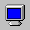{width="30" height="30"}DXDraw

Поверхность компоненты DXDRAW служит фундаментом для отображения
графики.

1.1 Наиболее частая конфигурация

Align\...\...\...\...\...\....allClient        

AutoSize\...\...\...\...\....True

Display

  FixedBitCount\...\.....True

  Fixedratio\...\...\.....True        

  Fixedsize\...\...\...\...False

Options

  DoFullScreen\...\...\...True

  doFlip\...\...\...\...\...True

  Rest\...\...\...\...\.....False

Если одновременно значения DoFullScreen и DoFlip сделать равными True,
то кнопки управления окном не появятся (GDI=off). Если Вы хотите
использовать кнопки, меню и т.д. можно сделать их в виде спрайтов. Если
DoFlip=False, то включен оконный режим. Использование DoFullscreen и
DoFlip делает игру очень быстрой по сравнению с игрой в оконном
режиме.DXDrawSurface имеет тип TDirectDrawSurface. Эта поверхность также
называется \' вторичной поверхностью \' или закадровой поверхностью,
потому что она невидимая. Поверхность становится видимой после запроса
метода DXDraw.Flip , в тот момент вторичная поверхность становится
первичной. DXDraw.Primary - первичная (видимая) поверхность.

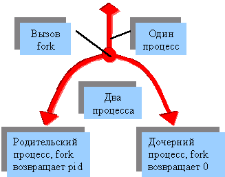{width="241" height="199"}

1.2 Режимы экрана

Текущая конфигурация видеорежима Windows не влияет на игровую
конфигурацию. Все настройки осуществляются через DXDraw. Форма, на
которой размещается DXDraw , должна иметь тип TDXForm.\

 

1.2.1 Оконный режим

Для включения/выключения оконного/полноэкранного режимов служит опция
\[doFullScreen\], посмотрите:

    procedure TForm1.WindowMode;
    begin
       DXDraw1.Finalize;
       RestoreWindow;
       DXDraw1.Options := DXDraw1.Options - [doFullScreen];
       DXDraw1.Display.Width := 640;
       DXDraw1.Display.Height := 480;
       DXDraw1.Display.BitCount := 8;
       DXDraw1.Initialize;
    end;
     
    DXDraw.Align := alClient;
    Form.ClientWidth := … // Установка ширины Формы/DXDraw
    Form.ClientHeight := … // Установка высоты Формы

1.2.2 Полноэкранный режим

    procedure TForm1.FullScreenMode;
    begin
       DXDraw1.Finalize;
       StoreWindow;
       DXDraw1.Options := DXDraw1.Options + [doFullScreen];
       DXDraw1.Display.Width := 640;
       DXDraw1.Display.Height := 480;
       DXDraw1.Display.BitCount := 8;
       DXDraw1.Initialize;
    End;
    // Set mode in non-Windows GUI Disable windows-controls-< purely graphics screen (very fast)
    DXDraw.Options := DXDraw.Options + [doFlip];
    // Enable Windows controls
    DXDraw.Options := DXDraw.Options - [doFlip];
     
    Screen.Cursor := CrNone; // Спрятать курсор
    Form1.BorderStyle := bsSingle; // Спрятать бордюр формы

2\. 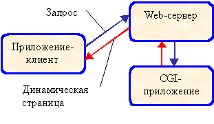{width="28" height="28"}DXImageList

Компонента для загрузки графических файлов.\

 

2.1 Загрузка изображений во время выполнения

Нижеприведенная процедура загружает растровое изображение в DXImageList
(BMP, DIB и т.д.). Картинка становится элементом DXImageList.

    procedure LoadImage (Filename, NameImage : String; PatWidth, PatHeight : Integer; Transp : Boolean; TranspColor : TColor);
    begin
       DXImageList.Items.Add;
       with DXImageList.Items[DXImageList.Items.Count-1] do
       begin
          Picture.LoadFromFile (FileName);
          Name := NameImage;
          PatternWidth := PatWidth;
          PatternHeight := PatHeight;
          SkipHeight := 0;
          SkipWidth := 0;
          SystemMemory := False;
          Transparent := Transp;
          TransparentColor := TranspColor;
          Restore;
       end;
    end;

С помощью этого метода можно запросто загрузить около 200 BMP или DIB
картинок одновременно. Большее количество требует большего объема
памяти.

2.2 Палитра

Палитра это таблица цветов. Это - фактически массив чисел, где каждое
число относится к некоторому цвету. Каждый цвет - фактически также
только число. Это число зависит от количества красного, зеленого и
синего в цвете (RGB-значение). В DelphiX, цветовая палитра доступна
через DXDraw.ColorTable. Чтобы быть уверенным, что DXDraw будет
использовать ту же самую палитру что и изображение в DXImageList сделаем
следующее:

    ImageList.Items.MakeColorTable;
    DXDraw.ColorTable := ImageList.Items.ColorTable;
    DXDraw.DefColorTable := ImageList.Items.ColorTable;
    DXDraw.UpdatePalette;

Ниже дан кусок кода для создания цвета (TRGBQuad). Стандартная палитра
содержит 256 этих RGBQuad\'ов.

    Var Pal : TRGBQuad;
    Pal.rgbRed := 16;
    Pal.rgbGreen := 0;
    Pal.rgbBlue := 0;
    Pal.rgbReserved := 0;
    DXDraw1.ColorTable[i] := Pal;

Конечно можно сделать функцию для этой цели, подобную данной ниже:

    function ComposeColor(Dest,Src:TRGBQuad;Percent:Integer):TRGBQuad;
    begin
       with Result do
       begin
          rgbRed :=Src.rgbRed+((Dest.rgbRed-Src.rgbRed)*Percent div256);
          rgbGreen :=Src.rgbGreen+((Dest.rgbGreen-Src.rgbGreen)*Percent div256);
          rgbBlue :=Src.rgbBlue+((Dest.rgbBlue-Src.rgbBlue)*Percent div256);
          rgbReserved :=0;
       end;
    end;

Ниже видно как заполнить палитру цветами:

    Var Col : Integer;
    for i:=0 to 255 do
       DXDraw1.ColorTable[i] := ComposeColor (RGBQuad(GetRValue(Col), GetGValue(Col), GetBValue(Col) ), DXDraw1.DefColorTable[i], p);
    DXDraw1.UpdatePalette;

Анимация палитры (изменение цвета) используется для придания мерцания,
вспышек (и прочих эфектов).

2.3 Фон

Если нам надо заполнить весь фон одной картинкой, то нужно сделать
картинку размером с экран (например 640x480). Высота и ширина фоновой
картинки определяются свойствами PatternWidth и PatternHeight
(TpictureCollectionItem) а изображение содержится в DXImageList.Items
\[...\] .Picture. Когда фон представлен 1 картинкой, PatternHeight и
PatternWidth устанавливаются в 0 (но не, например, в 640x480!).

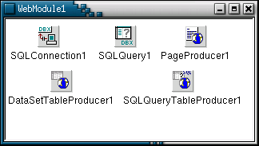{width="283" height="200"}\

Одно изображение как постоянный фон

3\. 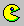{width="24" height="26"}DXSpriteEngine

SpriteEngine компонента, контролирующая все спрайты SpriteEngine - не
\'чистый\' DelphiX компонент, потому он не представляет собой часть
DirectX, как другие DelphiX компоненты. Многие игроделатели,
использующие DelphiX, создают собственный Движок (например игра 'Joffa':
www.joffa.com/).\
Ниже - системы координат, с объяснением, как они связаны в
SpriteEngine.\

 

3.1 Система координат

 \

 

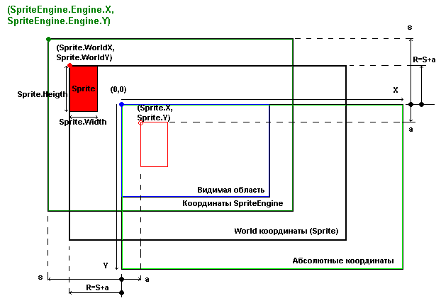{width="622" height="428"}

    Sprite.WorldX = Sprite.X + Sprite.Engine.X (sprite.x. связан с SpriteEngine)
    Sprite.WorldY = Sprite.Y + Sprite.Engine.Y (sprite.y. связан с SpriteEngine)

Верхний левый угол представляет координату (0,0). Sprite.Engine.X и
Sprite.Engine.Y по умолчанию 0. В этом случае оба X и Y значения Спрайта
равны значениям WorldY и WorldX. Когда меняются значения X и Y
SpriteEngine\'а, все X и Y значения, содержащиеся в SpriteEngine, тоже
меняются.

    Sprite.Moved        = Допускать перемещение; да или нет
    Sprite.Collisioned = Обнаруживать столкновение; да или нет

Метод DXSpriteEngine.Move удостоверяет (?), что все спрайты в
SpriteEngine вызывают свой метод DoMove. Обычно это происходит после
каждого интервала таймера компонента Timer). В этом методе, проверка на
столкновение сделана, через вызов метода спрайта Collisions. Метод
DoCollision вызывается только когда столкновение обнаружено. Есть много
решений для создания движения фона при перемещении спрайта. Одно из
решений состоит в том, чтобы изменить X и Y значения DXSpriteEngine в
DoMove методе перемещающегося спрайта.Вот так:

    DXSpriteEngine.X := ...
    DXSpriteEngine.Y := ...

Часто используемое решение:

    X := ... // Новое значение X спрайта
    Y := ... // Новое значение Y спрайта
    DXSpriteEngine.X := -X + (DXSpriteEngine.Width div 2) - (Width div 2);
    DXSpriteEngine.Y := -Y + (DXSpriteEngine.Height div 2) - (Height div 2);

Другим решением для создания движения фона, может быть движение
BackgroundSprites.

3.2 Игровой сценарий

Ниже стандартный сценарий для игры (вкл. SpriteEngine). (дам позже, как
есть, на хренегознаеткаком языке)

3.3 Фоновые изображения

3.3.1 Статический фон

    TBackground = class (TBackgroundsprite)
    public
       procedure DoMove (MoveCount : Integer); override;
    end;
     
    SBackground := TBackground.Create (DXSpriteEngine1.Engine);
    with SBackground do
    begin
       image := DXImageList1.Items.Find('image1');
       image.Transparent := false;
       SetMapSize(1,1);
       Z := -10;
       Tile := false;
    end;
    var SBackground : TBackground;

3.3.2 Движущийся фон

                                                                       
               

    TBackground = class (TBackgroundsprite)
    public
       procedure DoMove (MoveCount : Integer); override;
    end;
    procedure TBackground.DoMove (MoveCount : Integer);
    begin
       inherited DoMove (MoveCount);
       X := X-1;
    end;

3.3.3 Тайловый фон (фон собран из тайлов)

    Tile := True; { Фон полностью заполнен тайлами 
                  (При прокрутке, тайлы будут повторяться). 
                  Значение SetMapSize будет игнорироваться; 
                  количество тайлов зависит от размера области 
                  экрана (завершенный фон). SetmapSize должен быть вызван! 
                  иначе работать не будет .. 
                  попробуйте например: SetMapSize (1,1) }
     
    Tile := False; { Количество тайлов по высоте и ширине is determined by 
                  ‘SetmapSize (w,h) SetMapsize (20, 10) <-> mapwidth :=20; mapheight :=10; } 

 \

Если фоновая картинка не закрывает весь экран, она будет размножена.
Каждый кусочек называется «Тайл». В случае, если изображение должно
представлять собой набор из Тайлов, параметры PatternWidth и
PatternHeight должны быть меньшие чем область экрана. Эти значения не
должны быть слишком большие (например 70x50). Если значение тайлов очень
велико, то ничего видно не будет!

{width="64" height="66"}тайл1
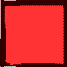{width="67" height="67"}тайл2

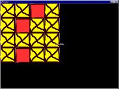{width="200" height="150"}\

Тайловый фон 4x4 (случайное заполнение)

    MapWidth := 4; MapHeight := 4;
    SBackground.Chips[0,0] to [3,3]
    Randomize;
    SBackground := TBackground.Create (DXSpriteEngine1.Engine);
    with SBackground do
    begin
       image := DXImageList1.Items.Find('backgr');
       image.Transparent := false;
       SetMapSize(4,4);
       Z := -10;
       for i := 0 to MapHeight-1 do
          for j := 0 to MapWidth-1 do
             Chips[j,i] := random(2);
       Tile := false;
    end;
    Chips[j,i] := -1; // тайл [j,i] будет без картинки

Есть предел для числа Тайлов, при использовании тайлового фона. Это
число зависит от памяти компьютера, но возможно и большое количеств. Он
делал испытание с Тайлом 100x100, повторного на карте 1000x1000. Хорошая
вещь состоит в том, что каждый из этих Тайлов может использоваться при
построении различных изображений. Это возможно, потому что каждый Тайл
хранится как номер (integer). Отрицательный номер Тайла означает, что
этот Тайл без картинки.

3.3.4 Столкновение с фоном

    Randomize;
    SBackground := TBackground.Create (DXSpriteEngine1.Engine);
    with SBackground do
    begin
       image := DXImageList1.Items.Find('backgr');
       image.Transparent := false;
       SetMapSize(5,5);
       Collisioned := True; //Не забудьте, иначе столкновения учитываться не будут!
       Z := -10;
       for i := 0 to MapHeight-1 do
           for j := 0 to MapWidth-1 do
           begin
              Chips[j,i] := random(2); // Выбирается случайный Тайл
              CollisionMap [j,i] := false; // Все Collisions отключены
           end;
       Tile := false;
    end;
    SBackground.CollisionMap [3,3] := true; // Тайл [3,3] "чувствует" столкновения

!Collisioned у TBackgroundSprite - по умолчанию False, а у TimageSprite
- True.

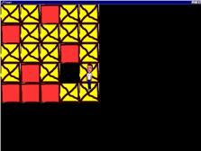{width="223" height="168"}\

Спрайт столкнулся с Тайлом фона Chip \[3,3\].

3.4 Изометрический тайловый движок

 \

 

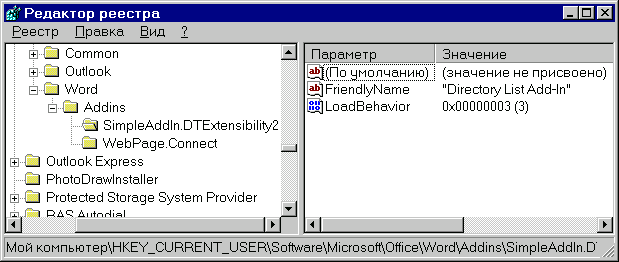{width="181" height="123"}\

NatureBackgroundSprite Z:=-10 (3 Тайла в рисунке)

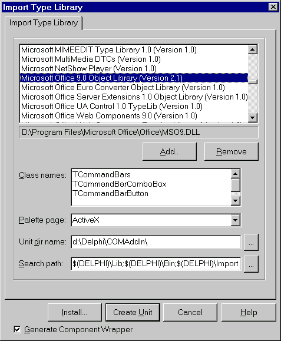{width="100" height="100"}\

GrassBackgroundSprite Z:=-11; (1 тайл в рисунке)

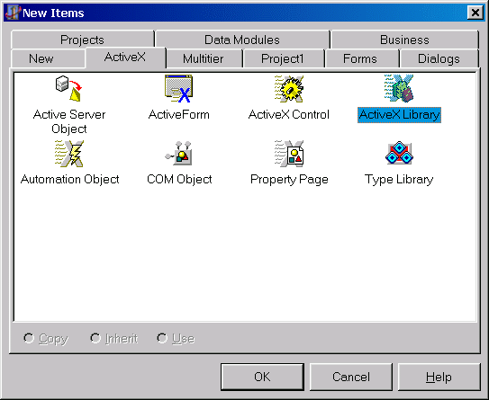{width="368" height="254"}

Такая же концепция как и в предыдущем красно-желтом Тайловым фоном. Но
теперь используются два уровня для тайлов вместо одного, и
NatureBackgroundSprite имеет изометрическую проекцию. Таким образом
можно делать многослойные BackgroundSprites, формируя сложные фоны. В
интернете есть множество статей о создании законченных Изометрических
движков.

3.5 Анимация спрайтов

Кадр - картинка из серии картинок, используемых для анимации. Ниже
картинка из 7 кадров.

{width="187" height="78"}

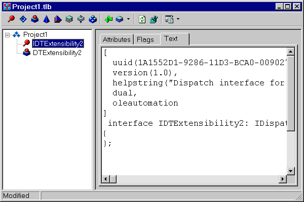{width="471" height="216"}

FPS Количество кадров в секунду.

                                                                       

AnimPos                 текущий кадр анимации

AnimStart         стартовый кадр

AnimCount         количество кадров анимации (берется из PatternCount)

AnimLooped  для повтора анимации (по кругу)

AnimSpeed = (DXTimer.Interval / 1000) \* FPS (напр.: Interval=1 и FPS=2
а 2/1000)

Для анимации достаточно указать AnimStart. AnimPos автоматически
изменяется во время анимации.

3.6 Столкновение спрайтов & PixelCheck

{width="264" height="204"}

PixelСheck ON: следит касаются ли пикселы(точки) спрайтов друг друга.\
PixelСheck OFF: следит касаются ли рамки спрайтов друг друга (рамка
определяется высотой и шириной спрайта. Это не всегда то же самое что
высота и ширина изображения спрайта!)\
1. PixelСheck не работает вообще когда сталкивающиеся спрайты
анимируются.\
2. PixelСheck работает плохо, когда один из двух сталкивающихся спрайтов
анимируется.\
3. Pixelcheck работает хорошо, только когда ни один из обоих спрайтов не
анимируется.\
4. Столкновения без PixelCheck всегда работают хорошо (даже когда оба
спрайта анимируются). В этом случае, важны только рамки спрайтов (высота
и ширина).\
В процедуре DoMove спрата, метод Collision следит, за столкновениями с
другим спрайтом. Если столкновение произошло, то вызывается метод
DoCollision.\
Заголовок процедуры Collision всегда выглядит так:\
procedure TDummySprite.DoCollision (Sprite: TSprite; var Done:
Boolean);\

Где Sprite - спрайт, который столкнулся с текущим спрайтом. Вы можете
явно указать, что столкновение произошло. Это может быть сделано,
установкой параметра Done, равным True. По умолчанию этот параметр равен
False. В методе DoMove надо всегда вызывать оригинальный метод DoMove :
Inherited DoMove (MoveCount); (Не нужно делать подобным способом при
использовании DoCollision)

4\. 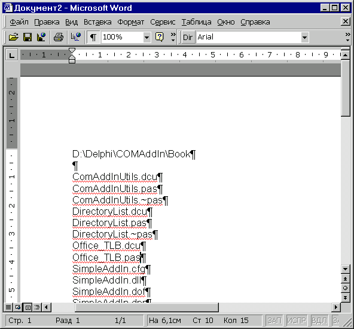{width="25" height="24"}DXTimer

Фактически, таймер управляет всей игрой; все действия игры происходят в
одной большой петле. Тело этой петли может быть включено в \'OnTimer\'
событие Таймера. DXTimer опрашивается каждую миллисекунду. Хотя это не
означает что каждую миллисекунду что-что случается. Определяется это в
параметре \'Interval\' - число миллисекунд между каждым действием.
Предположим, что это значение - 100, тогда каждую 0.1 секунды событие
\'OnTimer\' будет выполнено (главная петля игры).

    procedure TForm1.DXTimer1Timer(Sender: TObject; LagCount: Integer);
    begin
       if not DXDraw1.CanDraw then Exit;
       DXDraw1.Surface.Fill (0);
       DXSpriteEngine1.Move (1);
       DXSpriteEngine1.Draw;
       DXDraw1.Flip;
    end;

Interval Время в миллисекундах между выполнением двух последовательных
OnTimer событий.\
Framerate (=FPS) Число OnTimer событий исполняющихся каждую секунду
(частота). Interval = 1000 / FrameRate\

Внимание: Когда используется очень маленький интервал (меньше чем 10
миллисекунд.) отношение между Interval и FrameRate - не будет
правильным, так как у компьютера есть максимальный FrameRate (например
82 FPS), тоже самое и с максимальным интервалом. Какой интервал может
быть, полностью зависит от компьютера. Обычно, интервал между 0 и 1
выбирается так, чтобы получился максимальный FrameRate. FrameRate должен
считываться непосредственно, потому что он не может быть рассчитан через
Interval. Минимальный FrameRate для нормальной мультипликации - около
25, но чем больше, тем лучше. 60 - хороший FrameRate (DXTimer.Interval =
1000 / 60). Поскольку FrameRate -- значение только для чтения, то
интервал должен задаваться явно, чтобы приобрести некоторую частоту.

    DXTimer1.Interval := 1000 div 60; // 60 раз в секунду вызываем метод OnTimer
    LagCount is the (?). frequence +1 // частота = кол-во исполнений 'OnTimer'

Также нельзя самостоятельно устанавливать параметр \'LagCount\'. Это
делается автоматически. Значение LagCount зависит от выбранного
FrameRate (интервала). LagCount - истинный интервал времени, который
используется (он может отличиться от выбранного интервала таймера). При
выборе 0 или 1, LagCount определит минимальный интервал времени, так,
чтобы получился максимальный FrameRate.

    DXSpriteEngine.Move(LagCount);
    X := X+ 0.7*MoveCount; { Вы можете делать значение MoveCount таким-же, как и LagCount.
    Вы можете посылать это значение через параметры метода но не надо
    (Вы можете дать ваше собственное значение MoveCount) }

5\. DXInput

Компонента для отслеживания ввода с клавиатуры, джойстика или мыши.

     
    //Получить текущее состояние
    DXInput.Update;
    //Текущее состояние джойстика
    DXInput.Joystick.X;
    DXInput.Joystick.Y;
    //Определение движения джойстика:
    if ((DXInput.Joystick.X><0) or (DXInput.Joystick.Y><0)) then
       ...
    //Интервал осей
    DXInput.Joystick.RangeX := ... // RangeX =10 то интервал: от-10 до +10
    DXInput.Joystick.RangeY := ...
    DXInput.Joystick.RangeZ := ...
    //Определение состояния клавиатуры
    if isLeft in DXInput.States then // Нажата кнопка влево.
       .....
    if isRight in DXInput.States then
       ....
    if isUp in DXInput.States then
       ....
    if isDown in DXInput.States then
       ....
    //Возможно, что DXInput.States содержит и IsUp и IsRight (вверх, вправо).
    DXInput1.States := DXInput.States - [isButton1]; //Отключение 1 кнопки
    DXInput1.States := DXInput.States + [isButton2]; //Включение 2 кнопки
    //Кнопки
    procedure TForm1. FormKeyUp(Sender: TObject; var Key: Word; Shift: TShiftState);
    begin
       if Key = VK_ESCAPE then
          Close;
       if key = ord('B') then
          ...
    end;
     
    VK_ESCAPE
    Ord (Ascii)
    VK_F1 t/m VK_F10
    VK_SPACE
    VK_UP
    VK_DOWN
    VK_LEFT
    VK_RIGHT

6\. Советы и секреты

6.1 Получение версии DirectX

    function GetDXVersion : String;
    begin
       with tregistry.Create do
          try
             rootkey:=HKEY_LOCAL_MACHINE;
             if OpenKey( '\SOFTWARE\Microsoft\DirectX', False) then
                result:= copy(Readstring('Version'),4,3)
             else result:='DirectX не установлен';
          finally
             free;
          end;
    end;

Или можно запустить C:\\Windows\\System\\DXDiag.EXE :)

6.2 Game Scenario

6.3 STD Sprite

6.4 Оптимальное качество звука

    procedure Tform1.DXSound1Initialize(Sender: TObject);
    var fmt:TWaveFormatEx;
    begin
       try       // Set up the DXSound object to use high quality samples
          with Fmt do
          begin
             wFormatTag := WAVE_FORMAT_PCM;
             nSamplesPerSec := 44100;
             nChannels := 2;
             wBitsPerSample := 16;
             nBlockAlign := wBitsPerSample div 8 * nChannels;
             nAvgBytesPerSec := nSamplesPerSec * nBlockAlign;
          end;
          // must be in exclusive to set the format
          DXSound1.Options := DXSound1.Options + [soExclusive];
          DXSound1.Primary.SetFormat(Fmt);
       except       // Error
       end;
    end;

6.5 Text in DXDraw

    with DXDraw1.Surface.Canvas do
    begin
       Brush.Style := bsClear;
       Font.Size := 12;
       Font.Color := clRed;
       TextOut(0,0, ’Some Text’);
       Release;
    end;

6.6 Меню

For making menu-items you can make a different picture (sprite) for each
menu-item. To show if the menu-item is on or off, you's just show a
different picture (when you move your mouse over the Option).

    procedure TForm1.DXDrawMouseMove(Sender: TObject; Shift: TShiftState; X,Y: Integer);

                                                                       
