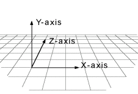
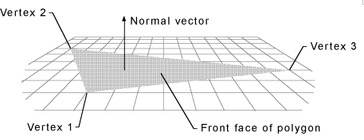

DirectX и Delphi
================

::: {.date}
01.01.2007
:::

Перед тем как приступить я хотел бы сделать пару оговорок. Во-первых для
использования DirectX в Delphi необходим файл с заголовками, где
объявлены имена функций DirectX API либо какой-нибудь компонент,
позволяющий обращаться к интерфейсу DirectX через свои методы. В момент
написания сего опуса я использую компонент DelphiX (автор - Hiroyuki
Hori), распространяемый бесплатно -
http://www.yks.ne.jp/\~hori/DelphiX-e.html. (если у вас есть что-нибудь
получше и Вы поделитесь со мной - я буду очень признателен.)

И еще один адрес, по которому можно скачать компонент DelphiX :
http://www.torry.ru/vcl/packs/hhdelphix.zip

По возможности я буду писать и названия методов DelphiX и названия
соответствующих интерфейсов Directx API - чтоб вам легче было
ориентироваться в DirectX SDK. Во-вторых при всем своем
гипертрофированном самомнении я не могу назвать себя экспертом в области
DirectX - так что не судите чересчур строго. Я надеюсь сие творение
хоть как то сможет помочь делающим первые шаги в DirectX - если Вы
круче меня - буду признателен за помощь и указание на ошибки (коих увы
наверняка сделал немало (честное слово не нарочно :-) ) Оговорка без
номера - я пишу эти строки в те времена когда последней версией DirectX
является DirectX 6.

Ну что ж приступим пожалуй.

Как известно DirectX предназначен в основном для программирования игр
под Windows 9x. Тем не менее можно придумать еще не мало ему применений
(рано или поздно грядет таки эра повсеместного трехмерного
пользовательского интерфейса). DirectX состоит из следующих компонентов:

- DirectDraw® - предназначен для программирования всевозможных анимаций за счет быстрого доступа к изображению на экране и к видеопамяти, а также за счет использования возможностей аппаратуры (видеоадаптера) по манипуляции с буферами.

- DirectSound® - как видно из названия позволяет выводить звук, используя все что можно выжать из Вашей звуковой карты (ну почти все)

- DirectMusic™ - музыка. В отличие от DirectSound работает не с оцифрованным звуком (WAV) а с музыкальными командами, посылаемыми звуковой карте.

- DirectPlay® - упрощает жизнь программиста, решившегося добавить в своей программе возможность совместной работы (игры) по сети и по модему. (это наверняка хорошо знакомо любому геймеру)

- Direct3D® (мой любимый J) - содержит высокоуровневый интерфейс Retained Mode позволяющий легко выводить 3-хмерные графические обьекты, и низкоуровневый интерфейс Immediate Mode предоставляющий полный конроль над рендерингом. (если кто-нибудь знает как будет рендеринг по-русски - мой адрес в конце статьи)

- DirectInput® - поддержка устройств ввода. Пока джойстик, мышь, клавиатура и т.д. - впрочем можете быть уверены - если появится еще что - за Microsoft не заржавеет.

- DirectSetup - предназначен для установки DirectX.

- AutoPlay - самый обычный AutoPlay - позволяет запускать какую-нибудь программу (инсталяшку или саму игру) при установке CD-диска в дисковод. Вообще-то описание AutoPlay относится к Win 32 SDK и просто повторяется в DirectX SDK (думаю Microsoft включила его в DirectX SDK просто чтоб оно было под рукой у разработчика)

Кое что о Direct3DRM®. (Reatined Mode)

Система координат

В Direct3D она соответствует так называемому правилу "левой руки".
Суть правила в том, что если Вы растопырите пальцы левой руки так, что
указательный палец будет направлен к экрану, большой к потолку, а
средний параллельно столу туда, где обычно лежит мышиный коврик, то
большому пальцу будет соответствовать координата Y, среднему - X,
указательному Z. Говоря короче координата Z направлена как бы вглубь
экрана (я во всяком случае нахожусь по эту его сторону :-)), координата
Y - вверх, координата X - вправо (все рисунки из SDK). Возможно Вам
это покажется непривычным. А что Вы тогда скажите на это - в DirectX
цвета задаются тремя составляющими R,G,B, каждая из которых - число с
плавающей точкой в диапазоне [0-1]. Например белый цвет - (1,1,1),
серенький (0.5,0.5,0.5), красный (1,0,0) ну и т.д.

{.center}

Все трехмерные объекты задаются в виде набора (mesh) многоугольников
(граней - faces). Каждый многоугольник должен быть выпуклым. Вообще-то
лучше всего использовать треугольники - более сложные многоугольники
все равно будут разбиты на треугольники (на это уйдет столь драгоценно
процессорное время). Грани (faces) состоят из вершин (vertex).

{.center}

Грань становится видимой если она повернута так, что образующие ее
вершины идут по часовой стрелке с точки зрения наблюдателя. Отсюда вывод -
если Ваша грань почему-то не видна - переставьте вершины так, чтоб
они были по часовой стрелке. Кроме того имеются другие объекты -
источники света (прямой свет - directional light и рассеянный свет -
ambient light), т.н. камера, текстуры, которые могут быть "натянуты"
на грани и прочая, прочая... Наборы объектов составляют т.н. frames
(затрудняюсь дать этому русское название). В Вашей программе всегда
будет хоть один главный frame, называемый сцена (scene), не имющий
фрейма-родителя, остальные фреймы принадлежат ему или друг другу. Я не
буду долго разговаривать о том, как инициализировать все это хозяйство,
для Дельфи-программиста достаточно разместить на форме компонент TDXDraw
из библиотеки DelphiX.

Перейдем однако к делу. Запустите-ка Дельфи и откройте мою (честно
говоря не совсем мою - большую часть кода написал Hiroyuki Hori -
однако не будем заострять на этом внимание :-)) учебную программку -
Sample3D.

Найдите метод

TMainForm.DXDrawInitializeSurface.

Этот метод запускается при инициализации компонента TDXDraw. Обратите
внимание, что DXDraw инкапсулирует D3D, D3D2, D3Ddevice, D3DDevice2,
D3DRM, D3DRM2, D3DRMDevice, D3DRMDevice2, DDraw - ни что иное как
соответствующие интерфейсы DirectX. (только в названиях интерфейсов
Microsoft вместо первой буквы D слово IDirect). Инициализация компонента
очень подходящее место, чтоб выбрать кое какие режимы (что и делается в
программке). Обратите внимание на
DXDraw.D3DRMDevice2.SetRenderMode(D3DRMRENDERMODE\_BLENDEDTRANSPARENCY
or D3DRMRENDERMODE\_SORTEDTRANSPARENCY); - Эти два флага установлены вот
для чего - если у нас два треугольника находятся один под другим и оба
видны (т.е. вершины у них по часовой) нужно их сперва отсортировать по
координате Z чтоб понять кто кого загораживает. Включает такую
сортировку флаг, названный скромненько эдак, по Microsots-ки:
D3DRMRENDERMODE\_SORTEDTRANSPARENCY. Однако как говаривал К. Прутков -
смотри в корень. Корнем же у нас является метод

TMainForm.DXDrawInitialize(Sender: TObject);

Здесь сначала создаются два фрейма - Mesh и Light, для нашего видимого
объектика и для лампочки, его освещающей.

MeshFrame.SetRotation(DXDraw.Scene, 0.0, 10.0, 0.0, 0.05);

(первые три цифры - координаты вектора вращения, последний параметр -
угол полворота) . Тонкое (не очень правда :-)) отличие между методами
SetRotation и AddRotation в том, что AddRotation поворачивает объект
только один раз, а SetRotation - заставляет его поворачиваться на
указанный угол при каждом следующей итерации (with every render tick)
Потом создается т.н. MeshBuilder - специальный объект, инкапсулирующий
методы для добавления к нему граней. Этот обьект может быть загружен из
файла (и естественно сохранен в файл). По традиции файлы имеют
расширение X. (насколько мне извесно эта традиция возникла еще до
появления сериала X-Files :-)) В самом же деле - в конце 20 века
задавать координаты каждого треугольника вручную... Можно заставит
сделать это кого то еще - а потом просто загрузить готовый файл :-). Ну
а если серьезно в DirectX SDK входит специальная утилита - conv3ds.
{conv3ds converts 3ds models produced by Autodesk 3D Studio and other
modelling packages into X Files. }

Однако создадим объект вручную - ну их эти Х-файлы. Наш объект будет
состоять из 4-х граней (ни одного трехмерного тела с меньшим количеством
граней я не смог придумать). Естественно каждая грань - треугольник,
имеющий свой цвет.

MeshBuilder.Scale(3, 3, 3); - Увеличиваем в три раза по всем
координатам.

Наконец MeshFrame.AddVisual(MeshBuilder); - наш MeshBuilder готов,
присоединяем его как визуальный объект к видимому объекту Mesh.

DXDraw.Scene.SetSceneBackgroundRGB(0,0.7,0.7); -

Как понятно из названия метода цвет фона. (Видите - я не врал RGB-цвет
действительно задается числами с плавающей точкой :-)) Интересные дела
творятся в методе TMainForm.DXTimerTimer. (небольшая тонкость - это не
обычный таймер, а DXTimer из библиотеки DelphiX)

DXDraw.Viewport.ForceUpdate(0, 0, DXDraw.SurfaceWidth,

DXDraw.SurfaceHeight);

указываем область, которую нужно обновить (не мудрствуя лукаво - весь
DXDraw.Surface)

DXDraw.Scene.Move(1.0);

- применяем все трехмерные преобразования, добавленные методами вроде
AddRotation и SetRotation к нашей сцене. (вот где собака то порылась...
:-) вычисления новых координат точек начнутся не сразу после метода
AddRotation а только здесь)

DXDraw.Render - Рендерим (ну как же это по русски то? :-))

DXDraw.Flip - выводим результат рендеринга на экран (аминь :-));

(в этом методе помещены также несколько строк, выводящих на экран число
кадров в секунду и информацию о поддержке Direct3D аппаратурой или
программно - пригодится при отладке) Метод FormKeyDown.

Здесь проверяется код нажатой клавиши - если Alt+Enter - переходим из
оконного в полноэкранный режим (клево, правда? :-)) и наоборот.
Напоследок пара слов о DXDrawClick.

Просто выводим FileOpenDialog - Вы можете поэкспериментировать с
x-файлами. Пока все. Вот уж не думал, что это будет так трудно. Надеюсь
хоть кто-то дочитал до этого места.

Пишите: aziz\@telebot.net, error\@softhome.net

Автор: Азиз (JINX)

Взято с <https://delphiworld.narod.ru>
