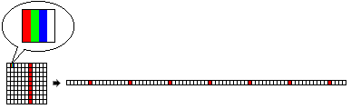

DirectX для начинающих. Часть четвёртая. Полупрозрачные спрайты в DirectDraw
============================================================================

Привет всем, кто интересуется программированием под DirectX,
и остальным жителям славного Королевства! 

В этот раз речь пойдёт о реализации прозрачности в DirectDraw,
причём это будет не проблема вывода нерегулярных спрайтов
(об этом уже шла речь в предыдущих уроках),
а проблема вывода спрайтов с переменной прозрачностью.

Как уже было сказано, DirectDraw создавался прежде всего
для осуществления максимально быстрого копирования отдельных участков изображения,
желательно (но не обязательно) с применением аппаратного ускорения.
Именно такие минимальные для двумерной графики требования и используются
в простых примерах по DirectDraw.
Однако современных разработчиков уже не удовлетворишь этим набором "инструментов",
т. к. компьютерная графика уже давно вышла за рамки передвижения простых спрайтов по экрану. 

Игроки требуют "хлеба и зрелищ" - то есть применения красочных спецэффектов,
даже если это игры класса тетрис или арканоид.
Да и разработчики графической части приложений стремятся внять этим требованиям -
ведь это преимущество перед конкурентами.
Чтобы не заставлять программистов писать собственные функции
(как это было когда-то во времена всемогущей DOS),
DirectDraw обладает рядом дополнительных возможностей при выводе изображения -
среди них масштабирование, поворот на фиксированный и произвольный угол,
зеркальное отображение и многое другое.
В этой статье эти возможности обсуждаться не будут
(возможно, когда-нибудь руки дотянутся и до них),
скажу лишь одно - многие привлекательные эффеты реализуются только в том случае,
если в наличии имеется аппаратная поддержка,
т. е. GPU видеокарты полностью поддерживает графические компоненты DirectX 7.0.
Если же имеется только частичная поддержка, вывод на экран этих эффектов не произойдёт.
Простейший пример - использование диапазона прозрачных цветов.
Эта возможность реализуема только при наличии священной аппаратной поддержки,
при её отсутствии DirectDraw сжалится и программно эмулирует цветовой ключ из одного цвета.

Естественно, всё это не понравится пользователям, если вместо картинки они увидят чёрти-что.
Целесообразно написать несколько собственных функций,
и при отсутствии функциональности в GPU обращаться к CPU.
К тому же, если DirectDraw и может отображать какие-то эффекты,
в примерах SDK я не видел ни одного.
По-видимому, Microsoft хотела, чтобы все программы из SDK запускались 100% на любом компьютере,
а так как DirectDraw не эмулирует большинство функций, в примерах они не реализованы.

Думаю, многим бы хотелось устроить регулируемую прозрачность спрайтов,
т. е. такой вид прозрачности, при котором за выводимым изображением виднелся бы задний фон.
Игры в этом случае можно оформить гораздо привлекательнее.
Что и говорить, занятно. Дело за малым - сделать. 

Забегая вперёд, скажу, что представленный мною материал можно применять
для создания самых различных эффектов, а не только для реализации прозрачности.
Материал довольно сложный, написан мною... нет, не с нуля,
но очень много продумано и реализовано собственными силами. 

Сначала немного теории.
Если кто не знаком с теорией цвета, скажу,
что согласно ей любой цвет может быть получен смешением трёх базовых цветов -
красного, зелёного и синего.
Каждая точка на экране вашего компьютера тоже формируется этими тремя цветами.
Обычно для получения качественного изображения нужно использовать множество цветов.
Недаром художники пользуются такой замысловатой дощечкой - палитрой.
На ней они смешивают краски с базовыми цветами
(их правда, не три, а больше, но это не важно) и получают нужный цвет. 

Приведу простой пример. Цвет нашего фона - чёрный, спрайт, наоборот - белый.
Если мы хотим, чтобы спрайт был прозрачным на 50%,
необходимо смешать в одинаковых пропорциях цвета тех пикселей,
что находятся в одной и той же точке экрана.
Что получится? Правильно, чистый серый цвет.
То же самое можно проделать и на деревянной палитре кистью,
с той лишь разницей, что видеоадаптер компьютера сделает это
точнее и быстрее любого Ван Гога.

Я решил упростить вводную часть и не обрушивать на вас сразу много кода под DirectDraw,
а рализовал простое смешение цветов c использованием класса Timage (каталог Demo1).
В программе в цикле происходит определение цветов всех пикселей изображений
в компонентах Image1 и Image2.
Затем вызывается функция MixerColors(),
которая смешивает два цвета в определённых пропорциях и, наконец,
полученный цвет устанавливается для пикселей компоненты Image3.
Управлять пропорцией смешивания цветов позволяет небольшой регулятор внизу окна:

:::{.center}
  
Рис. 1. Пример смешивания цветов.
:::

Пример работает довольно медленно даже на очень мощных компьютерах,
объясняется это тем, что доступ к массиву пикселей осуществляется через массив Canvas.Pixels[],
а этот метод очень "тормозной".
Впрочем, скорость тут не важна, это лишь пример,
но при просмотре двигайте ползунок регулятора как можно плавнее.

Разберём функцию MixerColor().
Сразу скажу - на все эти операции с прозрачностью меня натолкнул пример
от Nikolas Chook: http://delphibase.endimus.com/?action=viewtopic&topic=mediaimg.
На этом же сайте есть множество других работоспособных алгоритмов,
но большей частью они не документированы, так что придётся ползти на животе.
Впрочем, алгоритм, представленный там, показался мне очень "неправильным",
так что я написал собственный. По-моему, он максимально простой:

```
function MixerColors( transparent_value: byte; color1, color2: TColor ): TColor;
var
  r1, g1, b1: byte;
  r2, g2, b2: byte;
  r3, g3, b3: byte;

  v: single;
begin
  v := transparent_value / 100;

  r1 := lo( color1 );
  g1 := lo( color1 shr 8 );
  b1 := lo( color1 shr 16 );

  r2 := lo( color2 );
  g2 := lo( color2 shr 8 );
  b2 := lo( color2 shr 16 );

  // микшируем цвета
  r3 := round( r1 * v + r2 * (1 - v) );
  g3 := round( g1 * v + g2 * (1 - v) );
  b3 := round( b1 * v + b2 * (1 - v) );

  result := RGB( r3, g3, b3 );
end;
```

Как видно, здесь при помощи сдвиговой операции shr вырезаются соответствующие составляющие двух цветов.
Обратите внимание на последние три строки.
Здесь мы задаём пропорцию смешивания цветов.
Параметр transparent_value в программе принимает значение от 0 до 100.
Если он равен, например, 30, то это означает,
что мы хотим сделать одно из изображений прозрачным на 30%.
Переменная `v` в этом случае равняется 0.3.
Тогда цветовые составляющие первого цвета умножаются на 0.3, а второго цвета - на 0.7.
Результат округляется и приравнивается соответствующей составляющей результатирующего цвета.
Затем с помощью функции `RGB()` из отдельных компонент собирается результатирующий цвет.

Мы разобрали основной алгоритм смешивания цветов.
Рассмотрим теперь, каким образом можно реализовать его в DirectDraw.

В принципе, есть два пути.

**Первый** - использовать метод `IDirectDrawSurface7.GetDC()`.
Получив контекст, можно манипулировать его пикселами при помощи стандартных функций GDI
GetPixel() и SetPixel().
Но, как вы, наверное, догадываетесь, ни к чему хорошему такой способ не приведёт -
вывод на экран будет осуществляться ОЧЕНЬ медленно.
Фактически, никаких преимуществ от использования DirectDraw вы уже не получите.
Кстати, посмотрите, как реализован доступ к массиву Canvas.Pixels[] -
через те же функции GDI GetPixel() и SetPixel().

**Второй путь** - это использование методов `IDirectDrawSurface7.Lock()`
и `IDirectDrawSurface7.Unlock()`.
Если заглянуть в файл справки по DirectX SDK 7, то можно прочесть,
что методы предназначены для непосредственного доступа к памяти,
занимаемой внеэкранной поверхностью.
Вот как описан метод `IDirectDrawSurface7.Lock()` в файле directdraw.pas:

```
function Lock (lpDestRect: PRect; out lpDDSurfaceDesc: TDDSurfaceDesc2;
               dwFlags: DWORD; hEvent: THandle) : HResult; stdcall;
```
	
Первый параметр - это область поверхности, которая блокируется.
В принципе, для простоты можно передавать `nil`.
Второй параметр - это адрес структуры типа TDDSURFACEDESC2.
Как обычно, необходимо её очистить и заполнить поле dwSize размером самой структуры в байтах.
Последний параметр не используется и должен быть 0,
а предпоследний параметр - это флаги блокировки.
Вот самые "ходовые" из них:

DDLOCK_DONOTWAIT
:   применяется, если мы вручную следим, занят ли акселератор в момент вызова метода пересылкой битов. Необходимо использовать функцию FAILED() при вызове метода IDirectDrawSurface7.Lock(). Если при блокировке поверхности произошла ошибка (обычно DDERR_SURFACEBUSY - поверхность занята), то необходимо прекратить дальнейшие действия при работе с поверхностью.

DDLOCK_WAIT
:   прямая противоположность предыдущему флагу. Если поверхность занята, DirectDraw самостоятельно будет пытаться блокировать её до тех пор, пока это не удастся.

DDLOCK_NOSYSLOCK
:   данный флаг указывает на то, что приложение пытается получить прямой доступ к поверхности без остановки стандартных механизмов Win32. По умолчанию при блокировке все действия ОС приостанавливаются до вызова метода IDirectDrawSurface7.Unlock(). Однако, предположим, между вызовами Lock() и Unlock() мы хотим вызвать какую-нибудь функцию из вспомогательной DLL. Так как механизмы Windows заблокированы, такое обращение приведёт к ошибке. Данный флаг используется как раз в таких случаях, однако при его использовании скорость доступа к памяти снижается.

DDLOCK_READONLY и DDLOCK_WRITEONLY
:   указываются, если из памяти будет производиться только чтение или наоборот, будет идти только запись. Обычно в использовании этих флагах нет необходимости, но их можно применять для контроля содержимого поверхности, например, чтобы по ошибке не записать что-нибудь в память, для записи не предназначенной. Также они могут использоваться в видеорежимах "Mode X".

Остальные флаги применяются очень редко, их описание можно прочитать в справочной службе SDK.

Заблокировав поверхность, можно узнать о её формате.
Для этого, собственно, и передавалась структура TDDSURFACEDESC2.
Поля dwWidth, dwHeight содержат размер поверхности в пикселях, ddpfPixelFormat -
формат самого пикселя (о нём уже говорилось в предыдущих статьях).
Наиболее востребованные поля - это lpSurface,
оно предоставляет нам указатель на первый бит поверхности
(визуально это верхний левый угол поверхности), и поле lPitch - это шаг поверхности.
В предыдущих примерах шаг поверхности уже использовался, но не был рассмотрен мною детально.
Теперь настала пора это сделать.

Точное определение шага таково:
шаг - это расстояние в байтах между адресом,
который представляет собой начало растра и адресом,
который представляет собой начало следующей строки растра.
Естественно, шаг поверхности DirectDraw меняется в зависимости от текущего графического режима. 

Например, в режиме 32 бит на один пиксель приходится по 4 байта,
и тогда, если ширина поверхности 100 пикселей,
теоретически шаг должен составлять 100 \* 4 = 400 байт.
В режиме 16 бит шаг такой поверхности должен составлять 200 байт.

Следует учитывать, что часто реальный размер шага может не совпадать с расчётным.
Для ускорения копирования данных видеоадаптер может создать поверхность с шагом,
большим, чем это необходимо (например, некоторые видеоадаптеры создают поверхности,
ширина которых кратна четырём).
Такая дополнительная память носит название кэша.
Так что нельзя считать, что шаг - это просто ширина растра,
умноженная на количество БАЙТ на пиксель.
К счастью, нам нет дела, сколько конкретный видеоадаптер выделяет памяти под кэш -
необходимо знать только шаг поверхности и количество бит на пиксель в текущем видеорежиме.

Почему так важен шаг? Дело в том, что, хе-хе, в памяти компьютера нет всяких там прямоугольников,
которые представляют поверхности DirectDraw.
Весь растр поверхности, для простоты, можно представить в виде одной длинной макаронины.
Длина такой макаронины равна шагу поверхности, умноженному на высоту поверхности,
или, точнее говоря, на количество строк в растре.
Если шаг поверхности - ровно 400 байт, а в растре - 100 строк,
то такая поверхность займёт в памяти 40 000 байт, или ~ 39,1 Кб.

Вот как это можно представить графически:

:::{.center}
  
Рис. 2. Представление поверхности DirectDraw в памяти.
:::

А теперь представьте, что мы хотим нарисовать на поверхности вертикальную линию.
Из рисунка видно, что пиксели в таком случае будут разбросаны в памяти
на большом расстоянии друг от друга.
Чтобы правильно нарисовать точку на поверхности, необходимо пользоваться следующей формулой:

```
x * bpp + y * lPitch
```

где x, y - координаты пикселя на поверхности;  
lPitch - шаг поверхности;  
bpp - количество бит на пиксель.


Левое от плюса выражение предназначено для установки на нужный пиксель в ряду,
правое - на нужный ряд поверхности.
Надеюсь, теперь вы имеете более или менее чёткое представление о формате поверхностей DirectDraw.

Рассмотрим пример Demo2.

> **Оговорка:**  
> для работы примера необходимо подготовить вручную файл wallpaper.bmp размером 640x480,
> желательно с красочной картинкой.
> Для остальных примеров его потребуется скопировать в соответствующие каталоги
> вместе с файлом sprite.bmp.
> Я не сделал этого по причине экономии места в архиве.

В примере используется мышь для перемещения спрайта.
Клавишами \<- и -\> можно менять прозрачность спрайта от 0 до 100.
За вывод прозрачного спрайта отвечает функция BltTrans().
Она вызывает другие три функции - это DDGetPixel(), DDMixerPixels() и DDSetPixel().
Эти функции расположены в модуле ddutils.pas.
Функции получают и передают целые значения цветов,
их составляющие по-прежнему вырезаются с помощью сдвиговых операций внутри самих функций.

Пример рассчитан на работу в 24- или 32-битном режимах.
Для простоты код написан для последнего.
Если вам понадобится работать в 24-битном режиме,
задайте его в строке инициализации DirectDraw, и измените выражение

```
dwPos := x * 4 + ddsd2.lPitch * y;
```

на

```
dwPos := x * 3 + ddsd2.lPitch * y;
```

так как надо сдвигать указатель только на три байта для каждого пикселя.
Для работы в режиме 16 бит надо переписать выражения с указателями,
но я боялся усложнить и без того немаленькие примеры,
поэтому оставил эту работу тому, кто этим заинтересуется.

А теперь о неприятном.
Запустите пример и посмотрите, какая частота кадров получается,
если спрайт имеет произвольную прозрачность...
У-у-у, негусто!
Хочется даже сказать, что частота очень низкая, даже удручающе низкая.
Это скорее какое-то слайд-шоу.
Если кто-то только читает эту статью и ещё не скачал примеры,
наберусь храбрости и скажу, что на акселераторе GeForce 2 MX 400
частота кадров со 120 падает до... 7-8 в секунду.
К тому же и на более быстродействующих акселераторах ситуация вряд ли изменится к лучшему.
В чём причина таких "тор-р-р-мозов"?

Поначалу автор статьи даже грешил на Delphi.
Дело в том, что здесь применяется работа с указателями не на уровне функций API,
а на уровне операторов языка.
Этот момент мог обещать серьёзные проблемы, так как бытует мнение,
что частые операции с указателями в Delphi производятся медленнее, чем в компиляторах С/С++.
Здесь именно такая ситуация.
Подсчитаем. Растр имеет размерность 200x200 пикселей.
В сумме это 40 000 пикселей.
На каждый пиксель - по три байта (подразумевается режим 32 бит,
но так как работа идёт только с тремя составляющими, будем считать по три).

Используется три операции - чтение пикселя с дополнительного буфера,
чтение пикселя со спрайта и запись смикшированного пикселя в дополнительный буфер.
Операции с микшированием в счёт не идут.
Итого `9 * 40 000 = 360 000` операций с указателями на один спрайт.
Это довольно много даже для современных компьютеров,
поэтому подозревать Delphi причины были.
Для проверки я написал аналогичное приложение на языке С++,
используя компилятор Microsoft Visual C+ 6.0. И что же?
Приложение дало такой же fps, разницу составляли случайные отклонения. 

Я решил попробовать различные флаги при блокировке поверхностей,
использовал блокировку отдельной области, но всё напрасно.
Смена кадров по-прежнему происходила очень медленно.

Похоже, виноват сам механизм доступа к пикселям поверхностей DirectDraw.
Автор хочет поделиться секретом - никакие книжки по DirectX
не помогут вам досконально разобраться в нём, так как зачатую авторы пишут о том,
чего сами не пробовали сделать, а просто передрали это из файла справки или других источников.
Так вот, если кто-то будет говорить вам, что пользуясь методами IDirectDrawSurface7.Lock()
и IDirectDrawSurface7.Unlock() вы получаете прямой доступ к видеопамяти, не верьте этому!

Вообще, обычным способом из программы н-е-в-о-з-м-о-ж-н-о получить прямой доступ к видеопамяти,
все операции с данными можно осуществить только в системной памяти ПК.
Непосредственный доступ к видеопамяти "на борту" акселератора осуществляет только сервер DirectDraw,
в данном случае библиотека ddraw.dll через драйверы DirectX и драйверы видеоакселератора.

После ряда тестов стал ясен внутренний механизм блокировки поверхностей.
Вот его очертания:
получив указания заблокировать поверхность, DirectDraw проверяет, где она расположена.
Располагаться поверхность может в видеопамяти (что желательно), или в системной памяти.
Во втором случае мы действительно сразу же можем писать в эту память из программы.
Но если место локации - видеопамять, то в этом случае начинаются проблемы.
По-видимому, DirectDraw копирует часть или всю память поверхности в системную память,
а по команде разблокировать поверхность - назад, в видеопамять
(хотя эти утверждения могут быть далеки от истины).
Во всяком случае, в примере Demo2 осуществляется блокировка сразу двух поверхностей,
расположенных по умолчанию в видеопамяти - дополнительному буферу и самому спрайту.

Как бы то ни было, причина именно в этом - слишком медленном доступе к поверхности,
если она расположена в видеопамяти. 
Подтвердилось выражение "Всегда считайте данные в видеокарте, как доступные только для записи"
<http://www.gamedev.ru/coding/20518.shtml>.

Что из этого следует?
А то, что ВСЕ поверхности DirectDraw надо создавать в системной памяти.
Так как производятся операции с дополнительным буфером,
первичную поверхность и буфер тоже надо разместить там.
К сожалению, всё это тоже приведёт к замедлению смены кадров, но уже менее значительному.
Некоторые видеоадаптеры способны на более эффективный обмен данными
с поверхности в системной памяти за счет использования прямого доступа (DMA).

Всё вышесказанное можно проверить, посмотрев на работу примера Demo3.
Наблюдается среднее значение fps в штатном режиме (когда спрайт непрозрачен)
и снижение её до приемлемого значения при операциях с поверхностями.
Функция CreateSurface() теперь создаёт все поверхности в системной памяти.

Думаю, даже если вы неудовлетворены результатами,
данный пример - отличная возможность познакомиться на практике с "оптимизацией в компьютерной графике".
Что же здесь можно оптимизировать? 

Давайте подсчитаем.
Если в спрайте `40 000` пикселей, и на каждый пиксель - по шесть сдвиговых операций `shr`,
то получается `240 000` операций.
Это немало, поэтому целесообразно переписать функции DDGetPixel(), DDSetPixel() и DDMixerPixels()
с использованием непосредственно трёх составляющих пикселя,
а не разбирать-собирать каждый раз исходные цвета.
Это и сделано в примере Demo3.
Многие программисты объявляют для этого собственные структуры вроде

```
type
  PRGB = ^TRGB;
  TRGB = record
    r: byte;
    g: byte;
    b: byte;
  end;
```

Однако я прибегнул к стандартной структуре `RGBTRIPLE` из модуля windows.pas.

Хорошо, но всё ли это? Нет!
Если кто не знает, могу сообщить,
что на вызов внешних функций или метода класса-интерфейса
тратится определённое процессорное время.
Для приложений, сгенерированных разными компиляторами, это время различно,
но в любом случае оно всегда может стать существенным.

Смотрите - в нашем случае из цикла делается вызов четырёх функций для каждого пикселя,
т. е. в общей сумме внешние функции вызываются `160 000` раз за кадр.
К тому же кто сказал, что спрайт размером 200x200 - предел мечтаний
или спрайт должен быть один?
Поэтому целесообразно все операции из внешних функций перенести внутрь,
в тело цикла - что и сделано в примере Demo31.

Функция BltTrans() немного выросла в объёме,
но зато снижение fps при переходе из "штатного" режима в режим с прозрачностью снизилось
(сравните с примером Demo3).

В принципе, можно сделать последний шаг - переписать выражения

```
// извлекаем цвет с поверхности заднего буфера
prd := pbyte(longword(ddsd2d.lpSurface) + (dwPosD));
pgd := pbyte(longword(ddsd2d.lpSurface) + (dwPosD + 1));
pbd := pbyte(longword(ddsd2d.lpSurface) + (dwPosD + 2));

// извлекаем цвет с поверхности спрайта
prs := pbyte(longword(ddsd2s.lpSurface) + (dwPosS));
pgs := pbyte(longword(ddsd2s.lpSurface) + (dwPosS + 1));
pbs := pbyte(longword(ddsd2s.lpSurface) + (dwPosS + 2));

// микшируем цвета (результат сразу же отображается в памяти)
prd^ := round( prd^ * v + prs^ * (1 - v) );
pgd^ := round( pgd^ * v + pgs^ * (1 - v) );
pbd^ := round( pbd^ * v + pbs^ * (1 - v) );
```

на языке Ассемблер - однако это, по расчётам,
в данном случае даст совсем небольшой прирост в производительности.
Я вовсе не умаляю значение Ассемблера, часто он просто необходим как воздух,
но в этом случае может отдохнуть.

Данный пример - наглядный урок того,
как поступают программисты в области современной компьютерной графики.
Обычно всё сначала пишется в виде отдельных функций,
но в итоге "последней-последней" оптимизации большинство критичного кода
за несколько шагов собирается воедино.
Как видите, даже в нашем простом случае это дало свои плоды,
в гораздо более крупных циклах это может дать ещё более значительный прирост в скорости,
вернее, "снимет тормоза".

Можно было бы закончить сей, надеюсь, интересный рассказ, если бы скорость была бы более высокой.
Но половина (или меньше) от возможного - это плохо.
За что же мы платим деньги, покупая навороченный акселератор?
Из-за этих соображений я устроил себе долгий думушник, вот его результаты - проект Demo4.

Если доступ к поверхности, расположенной в видеопамяти, очень медленный, необходимо избегать его.
Для этого нужно создать все поверхности, с которыми мы будем иметь дело, в системной памяти.
Но вот загвоздка - это крайне нежелательно для дополнительного буфера. 

Я сделал так.
В системной памяти создаётся спрайт и специально для него так называемый спрайт-буфер таких же размеров.
Для чего он нужен?
Просто на него копируются данные из дополнительного буфера, а именно - та его область,
куда предполагается вывести прозрачный спрайт.
К счастью, современные видеоакселераторы, как оказалось, выполняют эту операцию достаточно быстро,
невзирая на то, что приходится читать данные из видеопамяти.
Теперь можно спокойно блокировать обе поверхности - спрайт и спрайт-буфер
и заниматься микшированием пикселей.
Результат операций (довольно быстрых) отображается в спрайт-буфере,
после чего мы его разблокируем и копируем на дополнительный буфер.

Вот и всё!
Запустите пример и понаблюдайте за производительностью.
Кстати, привожу таблицу fps для всех четырёх примеров:

<table>
<tr align="center">
<th rowspan="2">Пример</th>
<th colspan="4">Fps, 640x480</th>
</tr>
<tr align="center">
  <td colspan="2" bgcolor="#FAEBD7">GeForce 2 MX 400</td>
  <td colspan="2" bgcolor="#FAEBD7">S3 Trio 3D/2X</td>
</tr>
<tr align="center">
  <td bgcolor="#EAEAEA">Demo2</td>
  <td>126</td>
  <td>6-7</td>
  <td>85</td>
  <td>5-4</td>
</tr>
<tr align="center">
  <td bgcolor="#EAEAEA">Demo3</td>
  <td>95</td>
  <td>60</td>
  <td>23</td>
  <td>15</td>
</tr>
<tr align="center">
  <td bgcolor="#EAEAEA">Demo31</td>
  <td>95</td>
  <td>72</td>
  <td>23</td>
  <td>18-19</td>
</tr>
<tr align="center">
  <td bgcolor="#EAEAEA">Demo4</td>
  <td>126</td>
  <td>125</td>
  <td>83</td>
  <td>18-19</td>
</tr>
</table>

Видеоакселератор GeForce 2 работал в режиме 32 бит, S3 Trio 3D/2X - в режиме 24 бит.
Первые значения - это fps в стандартном режиме, соседние - fps при прорисовке с прозрачностью.

Как видно, последнее усовершенствование никак не отразилось на "ветеране",
похоже, это его максимум, существенно поднялась лишь частота смены кадров в штатном режиме.
А вот GeForce порадовал сполна.
Поэтому последний алгоритм вполне можно рекомендовать для реализации полупрозрачных спрайтов.

В заключение хочется сказать, что непосредственные операции с пикселями -
это очень мощный инструмент для реализации качественной графики.
Ведь здесь можно пойти ещё дальше.
Усовершенствуйте сами функцию BltTrans() - можно сделать так,
что пиксели заданного цвета не выводились (аналог цветовых ключей),
пиксели другого цвета можно выводить непрозрачными...
Да мало ли что!
Таким образом можно реализовать, например, поворот спрайта на угол,
разные волновые эффекты (как в DelphiX), эффект линзы...

Во всяком случае, если понадобятся прозрачные спрайты,
DelphiX уже не является абсолютно необходимым.

Скачать примеры к статье [ditectx4.zip](directx4.zip) (35.6 K)

--  
Виктор Кода

Специально для [Королевства Delphi](http://www.delphikingdom.com)


Далее: [DirectX для начинающих. Часть пятая. Direct3D](./part5/)
