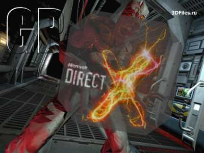

DirectX для начинающих. Часть пятая. Direct3D
=============================================

В этот раз мой новый урок будет посвящён азам
использования интерфейса **Direct3D** - наиболее сложного и объёмного из состава
DirectX8 SDK.

Я не собираюсь рассказывать, как построить объёмный кубик или классический
чайник в пространстве, нет. Вместо этого я решал затронуть довольно интересную
тему - как организовать вывод 2D-графики посредством Direct3D. Я решил заняться
этим вопросом, т. к. всё чаще API трёхмерного моделирования используются для
создания плоских изображений. Соответсвенно и я собираюсь перевести свои
программы на новы рельсы. 

Вообще, интерфейсы IDirectDraw7 и
IDirectDrawSurface7 - последние в составе SDK, которые предназначены для вывода
двумерной графики путём битовых переносов. Эти интерфейсы были введены в DirectX
версии 7 и по сути, уже ничего принципиально нового не содержали. Единственное
отличие состояло в более тесной интеграции DirectDraw с Direct3D, но и это уже в
прошлом.

С началом разработки DirectX 8 отдел Microsoft принял решение навсегда
остановить развитие этой компоненты, а Direct3D сделать полностью
самодостаточным и единственным средством вывода графики в DirectX. Теперь он так
и называется - DirectXGraphics. Впрочем, в составе SDK до сих пор присутствует
файл ddraw.h, чтобы пользователи имели возможность и дальше работать с
DirectDraw, и примеры по его использованию. Это как намёк на то, что не следут
на 100% отказываться от старых приёмов работы с графикой.

По-видимому, решение об остановке исходило из невозможности добавить в
DirectDraw ещё сколь-нибудь существенных деталей. Аппаратно эффекты DirectDraw
не поддерживаются и планов таких у производителей видеокарт не намечалось. В
тоже время многие программисты уже начали применять Direct3D для вывода
2D-графики, игнорируя DirectDraw. Взвесив все "за" и "против", было решено
доработать Direct3D как средство построения плоских изображений, а DirectDraw
объявить бесперспективным. Вот так старейший компонент, когда-то служивший в
DirectX единственным средством представления графики, теперь является
анахронизмом...

Соответственно, и нам нет смысла долго "сидеть" на нём, а
надо потихоньку перебираться в Direct3D, догонять технологии, так сказать. Но
прежде всего необходимо оговорить ограничения, связанные с использованием этого
интерфейса:

1. Для вывода графики необходимо, чтобы компьютер был оснащён простейшим, но
всё же 3D-ускорителем. И хотя вывод будет осуществляться и на обычной
видеокарте, картинка будет искажена, а скорость вывода будет неприемлемо мала.
Впрочем, в теперешнюю эпоху навороченных акселераторов простейшие их модели
стоят копейки.

2. Текстуры, содержащие изображение, по размерам должны быть кратны степени
двойки. Т. е. 64x64 или 256x512 - подходит, а 63х255 - нет. Это вроде как на
руку аппаратной части. 

А теперь приступим непосредственно к воплощению
замысла на практике. Для этого сперва необходимо подключить два заголовочных
файла, в которых энтузиасты JEDI разместили всё, что необходимо для полноценной
работы с Direct3D версии 8:

```
uses
directxgraphics,
d3dx8;
```

Эти два файла представляют собой объединение многих других файлов
из SDK для C/C++ (их названия приведены в самом начале). Первый файл содержит
описание основных интерфейсов Direct3D, а второй - дополнительных интерфейсов
Direct3DX. Это вспомогательная библиотека, содержащая интерфейсы высокого уровня
и множество функций разного назначения, дополнение к основному комплексу.
Обратите своё внимание на такую строчку из файла d3dx8.pas:

```
const
d3dx8dll = 'D3DX8ab.dll';
```

Это означает, что
все функции экспортируются из указанной динамической библиотеки. Хотя она и
поставляется в архиве с остальными файлами \*.pas, но не входит в стандартный
run-time от Microsoft. Т. е. ваши приложения, основанные на Direct3D, не смогут
выполняться на компьютерах других пользователей, если только вы не будете каждый
раз прикреплять к своим файлам нестандартную библиотеку.
Откуда её выкопали JEDI - Бог его знает, однако нестандартный run-time - это плохо.
Решением может служить изменение значения константы:

```
const
d3dx8dll = 'd3dx8d.dll';
```

После такой замены всё работает вроде как нормально, во всяком случае, я не
встретил ещё ни одной ошибки. Файл d3dx8d.dll я нашёл у себя в директории
Windows/System, он входит в стандартный пакет DirectX 8. В любом случае, могу
посоветовать такой приём: компилируйте все свои Direct3D-приложения с
использованием d3dx8ab.dll, а когда возникнет необходимость передать программу
другим пользователям, замените имя библиотеки и перекомпилируйте программу. Если
всё работает нормально, можете смело распространять своё творение. 

Также
нужно заметить, что размер "пустого" выполняемого файла получается около 40 кб,
а не 17-20. Причина этого кроется в том, что модуль d3dx8.pas подключает модуль
sysutils.pas. Самое "смешное" в том, что с увеличенным размером приходится
мириться из-за вызова единственной функции CompareMem() (из функции
D3DXMatrixEqual()). Если вы такие же щепетильные в этом вопросе, как и я, то
могу посоветовать такое решение: скопируйте функцию CompareMem() из sysutils.pas
в d3dx8.pas, и удалите ссылку на модуль из списка uses. Размер минимальной
программы уменьшится до стандартных для Delphi 17 кб. 

Разобравшись с
заголовочными файлами, объявим далее необходимые переменные:

```
var
g_pD3D: IDirect3D8 = nil; // общий интерфейс Direct3D
g_device: IDirect3DDevice8 = nil; // наша видеокарта
g_pTexture: IDirect3DTexture8 = nil; // текстура
g_pSprite: ID3DXSprite = nil; // спрайт
```

Теперь необходимо провести инициализацию Direct3D:

```
// проверяем правильность динамической компоновки
if @_Direct3DCreate8 = nil then
  exit;
// получаем интерфейс IDirect3D8
g_pD3D := Direct3DCreate8(D3D_SDK_VERSION);
if g_pD3D = nil then
  exit;
```

Здесь я проверяю адрес функции на корректность, ведь мы производим
динамическую компоновку библиотеки, есть вероятность, что её не окажется на
месте. Если всё в порядке, мы получаем интерфейс IDirect3D8. Это - первый
интерфейс, с которым имеет дело программист. Его основная задача - общая работа
с видеокартой и монитором - "создание" и получение характеристик видеокарты,
перечисление доступных видеорежимов, дескрипторов мониторов и т.д. 

При
инициализации графического устройства нам обязательно понадобится текущий
видеоформат. Его можно задать самостоятельно, но так как он может не
поддерживаться установленной видеокартой, а проверять это в маленьком примере
накладно, лучше воспользоваться форматом текущего видеорежима:

```
// получаем формат текущего видеорежима
if FAILED(g_pD3D.GetAdapterDisplayMode(D3DADAPTER_DEFAULT, d3ddm)) then
  exit;
```

После этого необходимо заполнить поля структуры TD3DPRESENT\_PARAMETERS:

```
// подготавливаем структуру TD3DPRESENT_PARAMETERS
ZeroMemory(@d3dpp, sizeof(d3dpp));
d3dpp.Windowed := BOOL(FALSE); // полноэкранный режим
d3dpp.BackBufferWidth := SCREEN_WIDTH; // высота и
d3dpp.BackBufferHeight := SCREEN_HEIGHT; // ширина заднего буфера
d3dpp.BackBufferFormat := d3ddm.Format;
// формат буфера - как и у текущего экрана
d3dpp.SwapEffect := D3DSWAPEFFECT_DISCARD;
// тип сброса содержимого буфера в окно
```

Замечу, что поле Windowed поределяет, будем ли мы работать в оконном или
полноэкранном режиме. Замените FALSE на TRUE, и получите вывод в окно.

Теперь необходимо инициализировать графическое устройство:

```
// создаём устройство Direct3D
if FAILED(g_pD3D.CreateDevice(D3DADAPTER_DEFAULT, D3DDEVTYPE_HAL, hWnd,
          D3DCREATE_SOFTWARE_VERTEXPROCESSING, d3dpp,
          g_device)) then
begin
  exit;
end;
```

Создаваемое устройство может быть различных типов. Поясню только самое общее.

D3DDEVTYPE\_HAL
:   - это аппаратное устройство, где все операции выполняются графическим
процессором видеокарты. Как раз это нам и нужно.

D3DDEVTYPE\_REF
:   - программное устройство, все операции выполняет центральный процессор.
Крайне медленно, зато можно использовать любые возможности Direct3D, вроде
пиксельных и вертексных шейдероов. В основном этот параметр нужен для
производителей видеокарт, чтобы они подгоняли результат аппаратного рендеринга
к эталонному программному.

D3DCREATE\_SOFTWARE\_PROCESSING
:   - обработка вершин производится ЦП. Не очень быстро, так что в серьёзных
программах лучше использовать другие флаги (их можно легко узнать из
заголовочного файла), но для простоты я выбрал этот. Кстати, некоторые
видеокарты могут работать только с указанием этого флага. 

Полученный интерфейс IDirect3Ddevice8 представляет собой как бы абстракцию
над видеокартой. Вызывая те или иные методы, мы отдаём команды графическому
процессору. Именно этот интерфейс является основным в работе по построению
изображений. 

Для простоты здесь же созданим и объект, который будет служить
спрайтом:

```
result := SUCCEEDED(D3DXCreateSprite(g_device, g_pSprite));
```

Интерфейс ID3DXSprite как раз и служит для вывода простых спрайтов в
Direct3D. Использовать его очень легко, т. к. этот интерфейс - просто надстройка
над более низкоуровневымы операциями Direct3D. Я пробовал рисовать и вторым
способом, но он более объёмен и сложен, так что для примера я выбрал первый. Как
и всякое простое решение, он не позволит сделать всего, что может API. Если вам
со временем станет чего-то не хватать, можно прибегнуть к явному
программированию. 

После инициализации Direct3D следующим шагом является
загрузка текстуры:

```
hr := D3DXCreatewTextureFromFileEx(g_device, pchar(strFileName), 0, 0,
                                   D3DX_DEFAULT, 0, D3DFMT_UNKNOWN,
                                   D3DFMT_UNKNOWN, D3DPOOL_DEFAULT,
                                   D3DXFILTER_NONE, D3DXFILTER_NONE,
                                   D3DCOLOR_XRGB(0, 255, 0), nil, nil,
                                   g_pTexture);
```

Функция D3DXCreateTextureFromFileEx() является частью комплекса Direct3DX,
и позволяет нам загружать текстуры из файлов разного формата. Результатом
является корректный указатель на интерфейс IDirect3Dtexture8. Существует более
простая реализация функции (без приставки Ex), но она не позволят задать
цветовой ключ для текстуры, поэтому пришлось прибегнуть к этой. Не обращайте
внимание на обилие параметров - половина из них взята "по умолчанию". Всегда
можно написать собственную промежуточную функцию, и избавить код от захламления
при загрузке множества текстур.

С цветовым ключом мы уже давно знакомы, но здесь есть два нюанса.

Первый -
это то, что цветовой ключ один для всей текстуры. Это может вызвать некоторые
неудобства при размещении разных изображений в одной текстуре (что часто и
делается), но они вполне решаемы с помощью какого-нибудь фотошопа.

Второй - если
необходимо задать чёрный цветовой ключ, не пишите вместо D3DCOLOR_XRGB( 0, 255,
0 ) просто 0 - это ошибка, т. к. данное значение сигнализирует о том, что
цветовой ключ не требуется. Надо писать именно D3DCOLOR_XRGB( 0, 0, 0 ),или
$FF000000, что то же самое.

Если теперь открыть bmp-файл, то сразу видно,
что я разместил там два изображения. Как я уже говорил, размеры текстур должны
равняться степени двойки. Поэтому мы не можем разместить изображение фона в
растре размерностью 512\*384, приходится его расширять до 512\*512 пикселей. Чтобы
зря не тратить память видеокарты, по возможности необходимо размещать в
свободных участках какие-либо дополнительные изображения. В моём случае влез
рисунок 128\*128, хотя его первоначальные размеры были в два раза больше
(пожертвовал для уменьшения архива). Если же нужно вместить что-то
нестандартное, то придётся делать ещё одну текстуру, или расширять существующую,
скажем, до 512\*1024. Тут нужно пробовать разные варианты и комбинации, пока не
будет найден какой-то компромисс. Кстати, если уж говорить о размерах текстур,
так вот: Direct3D МОЖЕТ загрузить растр любого размера, но при рендеринге тем
способом, который я собираюсь использовать, возникнут искажения. Этот вопрос
мною ещё слабо изучен, поэтому лучше пока это "на потом", а пока выучить степени
двойки наизусть.

Теперь можно приступать непосредственно к рендерингу изображения. Для
простоты я "завесил" экран одной частью текстуры (кстати, это небезызвестный
кадр из альфа-версии DOOM 3 :). Сверху же будет выводиться спрайт, другая часть
текстуры. 

Итак, для начала необходимо очистить кадровый буфер и
"скомандовать" GPU начать просчитывать новый кадр:

```
// очищаем кадровый буфер
g_device.Clear(0, nil, D3DCLEAR_TARGET, D3DCOLOR_XRGB(0, 0, 0), 1.0, 0);
// начинаем рисовать изображение
g_device.BeginScene();

// Далее выводим фон:

SetRect(rcTex, 0, 0, 512, 384); // область текстуры
transv.x := 0; // координаты левой
transv.y := 0; // верхней точки
g_pSprite.Draw(g_pTexture, @rcTex, nil, nil, 0, @transv, $FFFFFFFF);
```

С методом ID3DXSprite.Draw() надо разобраться.

```
function Draw(const pSrcTexture: IDirect3DTexture8; pSrcRect: PRect;
              pScaling, pRotationCenter: PD3DXVector2;
              const Rotation: Single;
              pTranslation: PD3DXVector2;
              const Color: TD3DColor): HResult; stdcall;
```

Параметром
`pSrcTexture` передаём наш интерфейс pTexture. PSrcRect - это область текстуры,
которая будет "натягиваться" на полигон, имитирующий наш спрайт. PScaling - это
параметр типа D3DXVECTOR2, задаёт масштабирование спрайта по осям X и Y.
Значение 1.0 задаётся для вывода реальных размеров, при 0.5 произойдет
уменьшение в два раза, при 2.0 - увеличение в два раза. PRotationCenter - это
центр оси поворота. Rotation - это угол поворота в радианах. Т. к. обычно
используюся градусы, необходимо преобразовывать градусную меру в радианную. Я
отыскал вот такую формулу перехода:

    a = 3.14 * n / 180 (радиан)

`pTranslation` -
перенос системы координат, в просторечье позиция левого верхнего угла спрайта.
Color - используется при альфа-прозрачности и при задании цветовых компонент.
Параметр - типа D3DCOLOR, определённого как DWORD. Первые три бита описывают
компоненты RGB, последний - альфа-прозрачность. Для простого отображения
текстуры используется значение $FFFFFFFF. Чтобы понять, как нужно манипулировать
этим значением, попробуйте для фона задать такое: $FF00FF00.

При прорисовке фона мы указываем только область текстуры, позицию левого
верхнего угла и цвет. Остальным параметрам передаём `nil`. 

Теперь необходимо
вывести спрайт и закончить рендеринг. Вот тут-то я и показал преимущества
Direct3D над DirectDraw. То, чего нельзя было сделать ранее, можно легко
использовать сейчас:

```
SetRect(rcTex, 0, 384, 128, 512); // область текстуры
transv.x := x - 64 * fScale; // координаты левой
transv.y := y - 64 * fScale; // верхней точки
scalev.x := fScale; // масштабирование по оси X и
scalev.y := fScale; // Y
rotv.x := 64 * fScale; // положение оси
rotv.y := 64 * fScale; // поворота (здесь центр спрайта)
g_pSprite.Draw(g_pTexture, @rcTex, // текстура и её область
               @scalev, // масштаб
               @rotv, // позиция оси поворота
               D3DX_PI * fAngle / 180.0, // угол поворота(перевод градуса в радианы)
               @transv, // позиция в окнонных координатах
               ((255 - alpha) shl 24) + $FFFFFF); // альфа-прозрачность
// закончили рисовать изображение
g_device.EndScene();
// выводим содержимое кадрового буфера на экран
g_device.Present(nil, nil, 0, nil);
```

Спрайт можно поворачивать клавишами "вправо" и "влево", прозрачность меняется
при нажатии на "вверх" и "вниз", масштабирование происходит при нажатии на "+"
или "-" на основной клавиатуре.

{.center}

Итак, какие впечатления?

1. При ПРОСТОМ отображении Direct3D рисует картинку, неотличимую от той,
которую мы бы получили при использовании DirectDraw. Отсутствует какая-либо
размытость, или неточность. Это главный плюс.

2. Применение эффектов вроде прозрачности или масштабирования никак не
сказывается на скорости вывода. Оно и понятно - мы же имеем дело с рендерингом
изображения, а не с BitBlt-операциями.

3. При повороте спрайта или его масштабировании применяется билинейная
фильтрация - это сглаживание пикселей изображения, используется для устранения
большой ступенчатости и "переливов" пикселей. К сожалению, здесь я обнаружил
проблему. При повороте спрайта или при изменении масштаба начинают сказываться
ошибки в отображении. Они проявляются в том, что при сглаживании начинают
"захватываться" соседние пиксели текстуры, уже не принадлежащие нашему
изображению. Например, видены "уголки" или тонкая серая полоска справа - там,
где находится граница с пустым белым изображением. Можно только посетовать,
что разработчики алгоритмов фильтрации упростили их до такой степени. Верным
решением было бы задействование только тех пикселей, которые указаны в области
pSrcRect, и не иметь НИКАКИХ дел с теми, что лежат вне её. Единственным
надёжным решением может служить такое: перед размещением разных изображений в
одном залейте его каким-нибудь однотонным цветом, который будет служить
цветовым ключом. После этого размещайте изображения, но так, чтобы между ними
всегда был зазор в 1 пиксель. Это гарантирует отсутствие помех. Понимаю,
накладно, но иного пути не вижу. Всё-таки, наверное, простой алгоритм
фильтрации выполняется на аппаратном уровне гораздо быстрее любого другого
"заумного". Ради скорости и качества, думаю, в графическом редакторе можно и
попотеть. 

Напоследок: раскоментируйте строку

```
//g_device.SetRenderState( D3DRS_FILLMODE, D3DFILL_WIREFRAME );
```

и
добавьте вызовы `g_pSprite._Begin()` после `g_device.Begin()` и `g_pSprite._End()`
перед `g_device.End()`.
Сможете увидеть, из чего состоят "спрайты" :) 

Ну
вот и всё, что нужно при простом использовании Direct3D.

Хочется ещё заметить,
что такие спрайты используются не только в 2D-графике, но так же с успехом и при
построении трёхмерных сцен. Например, при выводе HUD. Или вот, в Quake 3 - газы
при стрельбе из Machine Gun'а ни что иное, как спрайт, помещённый перед стволом
и отрисованный с некоторой прозрачностью. В общем, примеров использования
достаточно. Конечно, после практики с интерфейсом ID3DXSprite не лишне
попробовать и более низкоуровневые методы вывода изображения.

- заголовочные файлы для работы с Direct3D:  
  http://www.delphi-jedi.org/DelphiGraphics/directx/headers/DirectXGraphics.zip
- все заголовочные файлы для работы с DirectX 8:  
  https://www.delphi-jedi.org/DelphiGraphics/directx/headers/DirectXGraphics.zip

Скачать примеры к статье [d3dxsprite.zip](d3dxsprite.zip) (95 K)

Смотрите по теме:

- [DirectX для начинающих ](http://www.delphikingdom.com/helloworld/directx.htm)
- [DirectX для начинающих. DirectInput API ](http://www.delphikingdom.com/helloworld/directx_01.htm)
- [DirectX для начинающих. Sprite ](http://www.delphikingdom.com/helloworld/directx_02.htm)
- [DirectX для начинающих. Sound ](http://www.delphikingdom.com/helloworld/directx_03.htm)
- [DirectX для начинающих. Часть третья. Считывание и запись ](http://www.delphikingdom.com/helloworld/directx_04.htm)
- [Полупрозрачные спрайты в DirectDraw ](http://www.delphikingdom.com/helloworld/directx4.htm)
- [Пишем DirectX-движок ](http://www.delphikingdom.com/helloworld/dx_engine.htm)
- [DirectX и Delphi ](http://www.delphikingdom.com/article/drx.htm)

