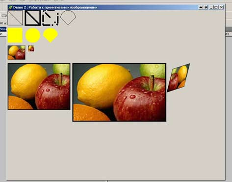

GDI+ − графическое ядро нового поколения. Часть 2. Работа с примитивами и изображениями
=================================================

[см. Часть 1.](./)

Доброе время суток, уважаемые коллеги. В данной статье мы разберем вывод
графических примитивов и вывод изображений. GDI+ предоставляет
программисту огромный выбор методов для вывода графики, в данной статье
мы рассмотрим вывод примитивов с заливкой и без, вывод примитивов с
своим стилем линии, использование групп (путей) для группировки
примитивов и вывода их на экран, также мы рассмотрим операции по
загрузке и выводу изображений, создание на основе изображения -
мини-просмотра (Thumbnail), вывода изображения в область (растягивание),
вывод изображения в параллелограмм. В данной статье я не буду специально
рассматривать трансформацию изображений и примитивов, а так же заливку
примитивов различными градиентами и изображениями, так как в первой
части данного цикла статей я дал простые примеры по данным вопросам, а
применить их к изображению иль к примитивам не составляет особого
труда.

Итак, что в данной части мы получим вот такой пример:

{.center}

Итак, сверху - вниз :

1. Вывод примитивов без заливки (для этого в GDI+ предусмотрены функции,
   начинающиеся с `Draw`...)

2. Вывод примитивов с заливкой (для этого в GDI+ предусмотрены функции,
   начинающиеся с `Fill`...)

3. Создание мини-просмотра

4. Вывод оригинального изображения, вывод растянутого и вывод изображения в параллелограмм.

Рассмотрим это в коде :

    procedure TForm1.PaintBox1Paint(Sender: TObject);
    Const
      dash : array[0..3] of single = (1, 1, 5, 4);
     
      Grani : array[0..2] of TPoint =
        ((x: 620; y: 180),  // Верхняя грань
         (x: 560; y: 200),  // Правая грань
         (x: 600; y: 260)); // Нижяя грань
     
    var
      R             : TRect;
      Pen           : TGPPen;                 // Кисть
      SolidBrush    : TGPSolidBrush;          // Заливка непрерывным цветом
      path          : TGPGraphicsPath;        // Пути
      Image, pThumbnail: TGPImage;            // Рисунок
    begin
      graphicsGDIPlus := TGPGraphics.Create(PaintBox1.Canvas.Handle);
      // Рисование примитивов без заливки
      pen:= TGPPen.Create(MakeColor(255, 0, 0, 0), 1);
      R.X := 0;  R.Y := 0;
      R.Width := 50;  R.Height := 50;
      graphicsGDIPlus.DrawRectangle(Pen,R);
      graphicsGDIPlus.DrawLine(Pen,R.X,R.Y,R.X+R.Width,R.Y+R.Height);
      pen.Free;
     
      // Рисование примитивов без заливки c толщиной линии 5
      pen:= TGPPen.Create(MakeColor(255, 0, 0, 0), 5);
      R.X := 60;  R.Y := 0;
      R.Width := 50;  R.Height := 50;
      graphicsGDIPlus.DrawRectangle(Pen,R);
      graphicsGDIPlus.DrawLine(Pen,R.X,R.Y,R.X+R.Width,R.Y+R.Height);
      pen.Free;
     
      // Рисование примитивов без заливки c толщиной линии 5 и собственным стилем Dash
      pen:= TGPPen.Create(MakeColor(255, 0, 0, 0), 5);
      Pen.SetDashPattern(@dash, 4);
      R.X := 120;  R.Y := 0;
      R.Width := 50;  R.Height := 50;
      graphicsGDIPlus.DrawRectangle(Pen,R);
      graphicsGDIPlus.DrawLine(Pen,R.X,R.Y,R.X+R.Width,R.Y+R.Height);
      pen.Free;
     
      // Использование графических путей
      path := TGPGraphicsPath.Create;
      pen:= TGPPen.Create(MakeColor(255, 0, 0, 0), 1);
      path.Reset;
     
      R.X :=  180 ;  R.Y := 0;
      R.Width := 50;  R.Height := 50;
      path.StartFigure();
      path.AddArc(R, 0.0, -180.0);
      path.AddLine(R.X, R.Y+25, R.X+25, R.Y+R.Height);
      path.AddLine(R.X+25, R.Y+R.Height,R.X+R.Width, R.Y+25);
      path.CloseFigure();
      graphicsGDIPlus.DrawPath(pen, path);
      Pen.Free;
     
      // Рисование примитивов с заливкой непрерывным цветом
      // Создаем объект для непрерывной заливки
      SolidBrush := TGPSolidBrush.Create(MakeColor(255, 255, 255, 0));
      R.X :=  0 ;  R.Y := 60;
      R.Width := 50;  R.Height := 50;
      graphicsGDIPlus.FillRectangle(SolidBrush,R);
      SolidBrush.Free;
     
      SolidBrush := TGPSolidBrush.Create(MakeColor(255, 255, 255, 0));
      R.X :=  60 ;  R.Y := 60;
      R.Width := 50;  R.Height := 50;
      graphicsGDIPlus.FillEllipse(SolidBrush,R);
      SolidBrush.Free;
     
      // Использование графических путей
      path := TGPGraphicsPath.Create;
      SolidBrush := TGPSolidBrush.Create(MakeColor(255, 255, 255, 0));
      path.Reset;
      R.X :=  120 ;  R.Y := 60;
      R.Width := 50;  R.Height := 50;
      path.StartFigure();
      path.AddArc(R, 0.0, -180.0);
      path.AddLine(R.X, R.Y+25, R.X+25, R.Y+R.Height);
      path.AddLine(R.X+25, R.Y+R.Height,R.X+R.Width, R.Y+25);
      path.CloseFigure();
      graphicsGDIPlus.FillPath(SolidBrush, path);
      SolidBrush.Free;
     
      // РАБОТА С ИЗОБРАЖЕНИЕМ // Создаем Thumbnail (Мини просмотр)
      Image:= TGPImage.Create('FRUIT.JPG');
     
      pThumbnail := Image.GetThumbnailImage(60, 48, nil, nil);
      graphicsGDIPlus.DrawImage(pThumbnail, 0, 120, pThumbnail.GetWidth, pThumbnail.GetHeight);
      pThumbnail.Free;
      pThumbnail := Image.GetThumbnailImage(20, 20, nil, nil);
      graphicsGDIPlus.DrawImage(pThumbnail, 70, 120, pThumbnail.GetWidth, pThumbnail.GetHeight);
      pThumbnail.Free;
     
      // Вывести изображение как есть
      graphicsGDIPlus.DrawImage(image, 0, 180);
      // Вывести изображение в область
      R := MakeRect(220, 180, 320, 200);
      graphicsGDIPlus.DrawImage(Image,R);
      // Вывести изображение в парралелограмм
      graphicsGDIPlus.DrawImage(Image, PPoint(@Grani), 3);
      Image.Free;
     
      graphicsGDIPlus.Free;
    end;

Вот в принципе и все, еще раз повторюсь, ничего сложного в GDI+ нет, а
огромное количество примеров по использованию от http://www.progdigy.com
дадут вам совершенно новый механизм по выводу графики в Delphi.

Скачать GDIplus Delphi API: [gdiplus.zip](gdiplus.zip) (1100K)

Данной статьей я хотел показать основы работы, привлечь внимание
начинающих программистов к данной библиотеке.

С уважением к коллегам, Дмитрий Кузан.
