Основы программирования OpenGL в Borland Delphi (Статья)
========================================================

::: {.date}
01.01.2007
:::

Автор: i-s-v

Публикуется с сокращениями (Vit)

На кого рассчитана статья

Я рассчитываю на то, что вы знакомы с азами создания приложений в
С++Builder или Delphi и совсем не знаете OpenGL.

Введение

OpenGL (Open Graphics Library) - популярная библиотека для работы с 3D
графикой. Стандарт OpenGL появился в 1992 году благодаря компании
Silicon Graphics и сейчас переживает годы своего самого бурного
развития.

Чуть-чуть побольше узнать об OpenGL и о том, как с ним работать в VC,
можно, почитав wat'а: http://www.gamedev.ru/coding/11203.shtml

Я хочу показать, как работать с этой библиотекой в таких популярных и,
на мой взгляд, очень удобных средах разработки, как Delphi и С++Builder.

Эта - первая - статья посвящена в основном инициализации OpenGL.

Инициализация

Первым делом нужно подключить заголовочные файлы:

    uses OpenGL;

Если вы используете Delphi, то всё необходимое для работы с OpenGL
находится в модуле OpenGL.dcu. А если вы используете С++Builder, то
подключать придётся несколько файлов:

::: {style="text-align: left; text-indent: 0px; padding: 0px 0px 0px 0px; margin: 7px 0px 7px 24px;"}
  --- --------------------------------------------------------------------------------------------------
  ·   gl.h и glu.h содержат прототипы основных функций OpenGL определённых в opengl32.dll и glu32.dll.
  --- --------------------------------------------------------------------------------------------------
:::

::: {style="text-align: left; text-indent: 0px; padding: 0px 0px 0px 0px; margin: 7px 0px 7px 24px;"}
  --- ---------------------------------------------------------------------------------------------------------------------------------------------------------------------------------------------------------------------------------------------------------------------------------------------------------------------------------------------------------------------------------------------------------------------------------------
  ·   glaux.h содержит вспомогательные (auxiliary) функции (glaux.dll). В этой статье я не буду использовать glaux.h, т.к. его функции не доступны в Delphi, да и не люблю я эту библиотеку. Кроме того основные задачи glaux (как, в прочем, и аналогичной, но более качественной, библиотеки GLUT) - это создание окон, таймеров, обработка клавиатуры и мыши, всё это есть в ИСР (Интегральная Среда Разработки) Delphi или С++Builder.
  --- ---------------------------------------------------------------------------------------------------------------------------------------------------------------------------------------------------------------------------------------------------------------------------------------------------------------------------------------------------------------------------------------------------------------------------------------
:::

После подключения заголовочных файлов нужно установить формат пикселей.
Я для этой цели использую следующую функцию:

          function bSetupPixelFormat(DC:HDC):boolean;
          var
              pfd:PIXELFORMATDESCRIPTOR;
              ppfd:PPIXELFORMATDESCRIPTOR;
              pixelformat:integer;
          begin
              ppfd := @pfd;
              ppfd.nSize := sizeof(PIXELFORMATDESCRIPTOR);
              ppfd.nVersion := 1;
              ppfd.dwFlags :=  PFD_DRAW_TO_WINDOW xor
                               PFD_SUPPORT_OPENGL xor
                               PFD_DOUBLEBUFFER;
              ppfd.dwLayerMask := PFD_MAIN_PLANE;
              ppfd.iPixelType := PFD_TYPE_RGBA;
              ppfd.cColorBits := 16;           
              ppfd.cDepthBits := 16;
              ppfd.cAccumBits := 0;
              ppfd.cStencilBits := 0;
              pixelformat := ChoosePixelFormat(dc, ppfd);
              if pixelformat=0 then
              begin
                  MessageBox(0, 'ChoosePixelFormat failed', 'Error', MB_OK);
                  bSetupPixelFormat:=FALSE;
                  exit;
              end;
              if SetPixelFormat(dc, pixelformat, ppfd)=false then
              begin
                  MessageBox(0, 'SetPixelFormat failed', 'Error', MB_OK);
                  bSetupPixelFormat:=FALSE;
                  exit;
              end;
              bSetupPixelFormat:=TRUE;
          end;

Вряд ли вам придётся менять что-нибудь в этой функции, но кое-что о
структуре PIXELFORMATDESCRIPTOR сказать надо.

cColorBits - глубина цвета

cDepthBits - размер буфера глубины (Z-Buffer)

cStencilBits - размер буфера трафарета (мы его пока не используем)

iPixelType - формат указания цвета. Может принимать значения
PFD\_TYPE\_RGBA (цвет указывается четырьмя параметрами RGBA - красный,
зленный, синий и альфа) и PFD\_TYPE\_COLORINDEX (цвет указывается
индексом в палитре). Как вы видите, я использую RGBA, и вам придётся
поступить также, т.к. если вы захотите использовать COLORINDEX, то вам
придётся изменить мою функцию: добавить пару флагов и дать начальные
значения ещё нескольким переменным.

Более подробную информацию смотрите в справочнике или в MSDN.

Функция ChoosePixelFormat подбирает формат пикселей, максимально
удовлетворяющий нашим требованиям, и возвращает его дескриптор, а
SetPixelFormat устанавливает его в контексте устройства (dc).

После того как в контексте устройства установлен формат пикселей, нужно
создать контекст воспроизведения (Rendering Context) для этого в OpenGL
определены следующие функции:

      function wglCreateContext(dc: HDC): HGLRC;
      function wglMakeCurrent(dc: HDC; glrc: HGLRC):Boolean;

Наверное, объяснять их значение не стоит

Теперь перейдём к форме. В объявлении класса формы в области private
добавьте следующее:

      ghRC:HGLRC;
      ghDC:HDC;
      procedure Draw;

ghRC - указатель на контекст воспроизведения (Rendering Context)

ghDC - дескриптор устройства (для нас - просто указатель на окно)

Процедура Draw будет отвечать за рисование.

Далее заполняем FormCreate:

          procedure TForm1.FormCreate(Sender: TObject);
          var
             p: TGLArrayf4;
             d: TGLArrayf3;
          begin
             ghDC := GetDC(Handle);
             if bSetupPixelFormat(ghDC)=false then
               Close();
             ghRC := wglCreateContext(ghDC);
             wglMakeCurrent(ghDC, ghRC);
             glClearColor(0.0, 0.0, 0.0, 0.0);
             FormResize(Sender);
             glEnable(GL_COLOR_MATERIAL);
             glEnable(GL_DEPTH_TEST);
             glEnable(GL_LIGHTING);
             glEnable(GL_LIGHT0);
               p[0]:=3;
               p[1]:=3;
               p[2]:=3;
               p[3]:=1;
               d[0]:=-1;
               d[1]:=-1;
               d[2]:=-3;
             glLightfv(GL_LIGHT0,GL_POSITION,@p);
             glLightfv(GL_LIGHT0,GL_SPOT_DIRECTION,@d);
          end;

Вы видите, что тут вызывается FromResize, который мы ещё не описали.
Надо это исправить. Поместите туда следующий код:

      glViewport( 0, 0, Width, Height );
      glMatrixMode( GL_PROJECTION );
      glLoadIdentity();
      glOrtho(-5,5, -5,5, 2,12);
      gluLookAt(0,0,5, 0,0,0, 0,1,0);
      glMatrixMode( GL_MODELVIEW );

Теперь, наверное, надо кое-что объяснить.

glClearColor устанавливает цвет (в нашем случае чёрный), которым будет
заполняться экран при очищении. У этой процедуры - 4 параметра, что
соответствует RGBA. Вместо нее можно написать glClearIndex(0.0). Эта
процедура устанавливает индекс цвета в палитре.

glViewport устанавливает область вывода - область, в которую OpenGL
будет выводить изображение. В нашем случае - вся форма.

glMatrixMode устанавливает режим матрицы видового преобразования. Не
забивайте ей себе голову, просто запомните, что, если вы меняете тип
проецирования, положение или направление камеры, то параметр должен быть
GL\_PROJECTION. После того, как вы завершили свои изменения, вызовите
эту процедуру с параметром GL\_MODELVIEW.

glLoadIdentity заменяет текущую матрицу видового преобразования на
единичную (матрицу идентичности), т.е. просто сбрасывает ваши изменения.

glOrtho устанавливает режим ортогонального (прямоугольного)
проецирования. Это значит, что изображение будет рисоваться как в
изометрии. 6 параметров типа GLdouble (или просто double): left, right,
bottom, top, near, far определяют координаты соответственно левой,
правой, нижней, верхней, ближней и дальней плоскостей отсечения, т.е.
всё, что окажется за этими пределами, рисоваться не будет. На самом деле
эта процедура просто устанавливает масштабы координатных осей. Для того
чтобы установить перспективное проецирование, используются процедуры
glFrustum и gluPerspective, но о них - потом.

gluLookAt устанавливает параметры камеры: первая тройка - её
координаты, вторая - вектор направления, третья - направление оси Y.

В OpenGL всё включается и выключается (разрешается и запрещается)
процедурами glEnable и glDisable. Таким образом, мы разрешили тест
глубины (GL\_DEPTH\_TEST), чтобы изображение было объёмным, разрешили
давать нашим объектам какой-то цвет (GL\_COLOR\_MATERIAL), разрешили
освещение (GL\_LIGHTING) и включили «лампочку №0» (GL\_LIGHT0).

glLightfv устанавливает свойства «лампочек»: позицию и направление
света.

После того, как вы завершили работу с OpenGL, нужно освободить занятые
ресурсы: освободить контекст, вызвав wglMakeCurrent с параметром ноль
для идентификатора контекста OpenGL и разрушить этот контекст функцией
wglDeleteContext. Кроме того нужно удалить дескриптор ghDC. Так как
обычно работу с OpenGL завершается при завершении работы приложения, то
соответствующий код нужно поместить в FormClose:

          procedure TForm1.FormClose(Sender: TObject; var Action: 
            TCloseAction);
          begin
            if ghRC<>0 then
            begin
              wglMakeCurrent(ghDC,0);
              wglDeleteContext(ghRC);
            end;
            if ghDC<>0 then
              ReleaseDC(Handle, ghDC);
          end;

А теперь, давайте уже что-нибудь нарисуем!

Пример

Давайте нарисуем сферу, а потом заставим её крутиться. Итак, всё, что
нам понадобится - это форма и таймер.

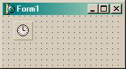{.center}

Установите интервал таймера на 10 миллисекунд (нам этого будет вполне
достаточно). Теперь скопируйте все представленные выше фрагменты кода в
соответствующие места. В процедуре Timer1Timer напишите одну сточку:
Draw(); (в Delphi без скобок).

Теперь нам осталось только что-нибудь нарисовать, т.е. отредактировать
функцию Draw.

          procedure TForm1.Draw;
          var
            quadObj :GLUquadricObj;
          begin
            glClear(GL_DEPTH_BUFFER_BIT xor GL_COLOR_BUFFER_BIT);
            quadObj:=gluNewQuadric;
            gluQuadricDrawStyle(quadObj, GLU_FILL);
            glColor3f(1,0,0);
            gluSphere(quadObj, 2,10,10);
              glRotatef(3, 0,1,0);
            gluDeleteQuadric(quadObj);
            SwapBuffers(ghDC);
          end;

Всё, можно нажимать F9!!!

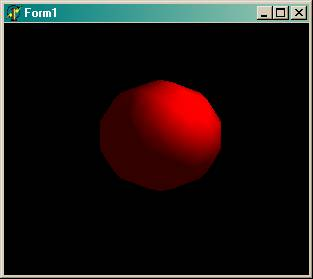{.center}

А теперь кое-что поясню (в процедуре Draw не встретилось ни одной
знакомой строчки).

glClear сбрасывает значения всего перечисленного в качестве параметров
(в нашем случае очищает буфер цвета и буфер глубины). Этой процедуре
передавать много всяких буферов для очистки, но лично я использую только
3: GL\_DEPTH\_BUFFER\_BIT, GL\_COLOR\_BUFFER\_BIT, иногда
GL\_STENCIL\_BUFFER\_BIT (буфер трафарета).

glColor устанавливает цвет фигуры. Существует следующий синтаксис как
для glColor, так и для других функций OpenGL:

gl\<name\>[n][type]

Поясняю, каждая функция OpenGL начинается с префикса «gl». Далее следует
название функции. После названия - количество параметров (если функция
определена для разного кол-ва параметров). И, наконец, переменными
какого типа являются параметры:

::: {style="text-align: left; text-indent: 0px; padding: 0px 0px 0px 0px; margin: 7px 0px 7px 24px;"}
  --- ------------------
  ·   b - GLbyte байт
  --- ------------------
:::

::: {style="text-align: left; text-indent: 0px; padding: 0px 0px 0px 0px; margin: 7px 0px 7px 24px;"}
  --- -----------------------------
  ·   s - GLshort короткое целое
  --- -----------------------------
:::

::: {style="text-align: left; text-indent: 0px; padding: 0px 0px 0px 0px; margin: 7px 0px 7px 24px;"}
  --- ------------------
  ·   i - GLint целое
  --- ------------------
:::

::: {style="text-align: left; text-indent: 0px; padding: 0px 0px 0px 0px; margin: 7px 0px 7px 24px;"}
  --- ----------------------
  ·   f - GLfloat дробное
  --- ----------------------
:::

::: {style="text-align: left; text-indent: 0px; padding: 0px 0px 0px 0px; margin: 7px 0px 7px 24px;"}
  --- -------------------------------------------
  ·   d - GLdouble дробное с двойной точностью
  --- -------------------------------------------
:::

::: {style="text-align: left; text-indent: 0px; padding: 0px 0px 0px 0px; margin: 7px 0px 7px 24px;"}
  --- --------------------------------
  ·   ub - GLubyte беззнаковый байт
  --- --------------------------------
:::

::: {style="text-align: left; text-indent: 0px; padding: 0px 0px 0px 0px; margin: 7px 0px 7px 24px;"}
  --- -------------------------------------------
  ·   us - GLushort беззнаковое короткое целое
  --- -------------------------------------------
:::

::: {style="text-align: left; text-indent: 0px; padding: 0px 0px 0px 0px; margin: 7px 0px 7px 24px;"}
  --- --------------------------------
  ·   ui - GLuint беззнаковое целое
  --- --------------------------------
:::

::: {style="text-align: left; text-indent: 0px; padding: 0px 0px 0px 0px; margin: 7px 0px 7px 24px;"}
  --- ------------------------------------------------------
  ·   v - вектор - массив из n элементов указанного типа
  --- ------------------------------------------------------
:::

Итак, glColor3f означает, что цвет задаётся тремя компонентами типа
GLfloat.

Для рисования сферы мы используем механизм из glu32.dll. Создаём объект
типа GLUquadricObj и инициализируем его функцией gluNewQuadric. Далее
устанавливаем стиль фигуры функцией gluQuadricDrawStyle (quadObj,
GLU\_FILL). Стиль может быть GLU\_FILL, GLU\_LINE или GLU\_POINT. Что
каждый из них значит, проверьте сами.

gluSphere - делает из quadObj сферу. Три последних параметра - это
радиус и количество разбиений поперёк и вдоль оси Z соответственно. Я
взял маленькое число разбиений, чтобы было видно, что сфера крутится.

И не забудем освободить память, занимаемую под quadObj -
gluDeleteQuadric(quadObj).

glRotatef - заставляет нашу сферу крутиться. О том, как это делается -
в следующей статье.

И, наконец, SwapBuffers (ghDC) выводит всё на экран.

Часть 1. Координаты и всё, что с ними связано

Системы координат

Рассматривая какой-либо трёхмерный объект, мы всегда определяем его
положение и размеры относительно некоторой привычной, и удобной в
настоящий момент системы координат, связанной с реальным миром. Такая
исходная система координат в компьютерной графике является
правосторонней и называется мировой системой координат. Для того, чтобы
можно было изобразить объект на экране, его необходимо предварительно
перевести (или преобразовать) в другую систему координат, которая
связана с точкой наблюдения и носит название видовой системы координат.
Эта система координат является левосторонней. И, наконец, любое
трёхмерное изображение мы всегда рисуем на двумерном экране, который
имеет свою экранную систему координат. (Этот абзац я списал у
Ю.Тихомирова).

Правосторонняя система координат (мировая) | Левосторонняя система координат (видовая)
------------------------------------------ | ----------------------------------------------------------
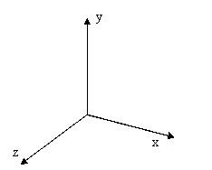                  | 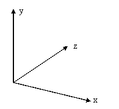

По умолчанию, плоскость xOy параллельна экрану, а ось Z направлена в
мировых координатах к нам, в видовых - от нас.

Переход к новым координатам

В OpenGL все объекты рисуются в начале координат, т.е. в точке (0,0,0).
Для того, чтобы изобразить объект в точке (x1,y1,z1), надо переместить
начало координат в эту точку, т.е. перейти к новым координатам. Для
этого в OpenGL определены две процедуры:

glTranslate[f d](Dx, Dy, Dz) - сдвигает начало координат на (Dx, Dy,
Dz)

glRotate[f d](j, x,y,z) - поворачивает систему координат на угол j (в
градусах) против часовой стрелки вокруг вектора (x,y,z)

Примечание: [f d] - означает, что в конце может быть либо буква "f",
либо "d".

Теперь стоит сказать ещё о двух процедурах:

glPushMatrix

glPopMatrix

Первая предназначена, для сохранения, а вторая - для восстановления
текущих координат. Очень удобно с помощью glPushMatrix сохранить текущие
координаты, потом сдвигаться и вертеться как угодно, а после, вызовом
glPopMatrix, вернуться к исходным координатам. Параметров у этих
процедур нет.

Часть 2. Простейшие фигуры

Простейшие объёмные фигуры

В примере из прошлой статьи мы создали сферу. Для этого мы использовали
механизм из glu32.dll. Алгоритм был такой:

1\. Создаём объект типа GLUquadricObj

2\. Инициализируем его функцией gluNewQuadric

3\. Устанавливаем стиль фигуры функцией gluQuadricDrawStyle(quadObj,
GLU\_FILL). Стиль может быть GLU\_FILL, GLU\_LINE, GLU\_SILHOUETTE или
GLU\_POINT. Что каждый из них значит, проверьте сами.

4\. Делаем из quadObj (объекта типа GLUquadricObj) сферу, цилиндр, конус,
диск или часть диска. Для этого определены следующие функции:

· gluSphere (quadObj, radius, slices, loops). Три последних параметра -
это радиус и количество разбиений поперёк и вдоль оси Z соответственно.

· gluCylinder (quadObj, baseRadius, topRadius, height, slices, loops).
После quadObj идут следующие параметры: радиус нижнего основания, радиус
верхнего основания, высота и количество разбиений поперёк и вдоль оси Z
соответственно. Очевидно, что эта функция задаёт как цилиндр, так и
конус.

· gluDisk (quadObj, innerRadius, outerRadius, slices, loops). Здесь
после quadObj указываются внутренний и внешний радиусы диска.

· gluPartialDisk (quadObj, innerRadius, outerRadius, slices, loops,
startAngle, sweepAngle). Здесь добавляются два параметра: угол (в
градусах), с которого начнётся рисование диска, и угол, которым
рисование закончится.

5\. Освобождаем память, занимаемую под quadObj функцией
gluDeleteQuadric(quadObj).

Теперь вы можете рисовать простые трёхмерные фигуры!

Примитивы

Любую трёхмерную фигуру, какая бы сложная она не была, можно разбить на
двухмерные (плоские) составляющие. Эти составляющие я и буду называть
примитивами, хотя некоторые авторы считают, что примитивами следует
обозвать вышеперечисленные трёхмерные фигуры.

Примитивы определяются одной или несколькими точками, которые в OpenGL
задаются внутри командных скобок glBegin/glEnd:

    procedure glBegin(mode);
    procedure glEnd;

Параметр mode показывает, какие примитивы будут рисоваться. Доступны
следующие значения:

    +-----------------------------------+-----------------------------------+
    | GL\_POINTS                        | Каждая вершина - отдельная точка |
    +-----------------------------------+-----------------------------------+
    | GL\_LINES                         | Каждая пара вершин - отдельная   |
    |                                   | линия. Если число вершин нечётно, |
    |                                   | то последняя игнорируется         |
    +-----------------------------------+-----------------------------------+
    | GL\_LINE\_STRIP                   | Последовательность связанных      |
    |                                   | отрезков. Первые две вершины -   |
    |                                   | первый отрезок. Третья вершина    |
    |                                   | определяет второй отрезок с       |
    |                                   | началом в конце первого и концом  |
    |                                   | в этой вершине и т.д              |
    +-----------------------------------+-----------------------------------+
    | GL\_LINE\_LOOP                    | Аналогичен GL\_LINE\_STRIP,       |
    |                                   | только последняя вершина          |
    |                                   | соединяется отрезком с первой.    |
    +-----------------------------------+-----------------------------------+
    | GL\_TRIANGLES                     | Каждая тройка вершин - отдельный |
    |                                   | треугольник                       |
    +-----------------------------------+-----------------------------------+
    | GL\_TRIANGLE\_STRIP               | Группа связанных треугольников.   |
    |                                   | Первые три вершины - первый      |
    |                                   | треугольник. Вторая, третья и     |
    |                                   | четвёртая вершины - второй        |
    |                                   | треугольник и т.д.                |
    +-----------------------------------+-----------------------------------+
    | GL\_TRIANGLE\_FAN                 | Также группа связанных            |
    |                                   | треугольников. Первые три вершины |
    |                                   | - первый треугольник. Первая,    |
    |                                   | вторая и четвёртая вершины -      |
    |                                   | второй треугольник и т.д.         |
    +-----------------------------------+-----------------------------------+
    | GL\_QUADS                         | Каждые четыре вершины -          |
    |                                   | отдельный четырёхугольник.        |
    +-----------------------------------+-----------------------------------+
    | GL\_QUAD\_STRIP                   | Группа связанных                  |
    |                                   | четырёхугольников. Первые четыре  |
    |                                   | вершины - первый                 |
    |                                   | четырёхугольник. Третья,          |
    |                                   | четвёртая, пятая и шестая вершины |
    |                                   | - второй четырёхугольник и т.д.  |
    +-----------------------------------+-----------------------------------+
    | GL\_POLYGON                       | Рисует отдельный выпуклый         |
    |                                   | многоугольник (один).             |
    +-----------------------------------+-----------------------------------+

Особое внимание нужно уделить GL\_QUAD\_STRIP. Здесь не совсем понятный,
но очень удобный порядок указания вершин:

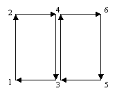{.center}

У каждого примитива есть минимальное число вершин. Если указанное число
вершин меньше минимального для данного примитива, то примитив не
рисуется.

Осталось только сказать, как задать вершину. Для этого определена
следующая процедура:

    glVertex[2 3 4][s i f d][v](coord)

Вершина определяется четырьмя параметрами: координаты x, y, z и параметр
w - коэффициент, на который делится каждая из координат, т.е. w
определяет масштаб. По умолчанию z=0, w=1, т.е когда вы вызываете,
например, glVertex2f(1,1) на самом деле вызывается glVertex4f(1,1,0,1).

С каждой вершиной связаны некоторые данные:

· Текущий цвет - цвет вершины (окончательный цвет высчитывается с
учётом света). Цвет задаётся процедурой glColor*

· Текущие координаты текстуры - координаты текстуры, соответствующие
этой вершине. Задаются процедурой glTexCoord*

· Текущая нормаль - вектор нормали, соответствующий данной вершине.
Задаётся процедурой glNormal*

· Текущая позиция растра - используется для определения положения
растра при работе с пикселями и битовыми массивами. задаётся процедурой
glRasterPos*

Примечание: вместо звёздочки '*' ставятся соответствующие суффиксы;
такое сокращение принято во многих документациях по OpenGL.

Точки

Нарисовать точку очень просто. Следующий код изображает 10 точек разного
размера.

          procedure TForm1.Draw;
          var
            i:byte;
          begin
            glClear(GL_DEPTH_BUFFER_BIT or GL_COLOR_BUFFER_BIT);
            glColor3f(1,1,1);
            for i:=0 to 9 do
            begin
              glPointSize((i+1)*4);
              glBegin(GL_POINTS);
                glVertex2f(i,i);
              glEnd;
            end;
            SwapBuffers(ghDC);
          end;

Примечание: в FormResize я вызвал glOrtho следующим образом -
glOrtho(-1,12, -1,12, 2,12). Это для того, чтобы все точки
поместились в окне.

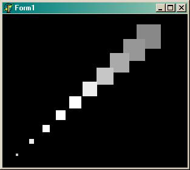{.center}

Для изменения размера точки используется процедура glPointSize(size).
Параметр size задаёт диаметр точки.

В этом примере все точки квадратные. В OpenGL разрешено сглаживание
(smoothening) как точек, так и более сложных объектов. Как и всё в
OpenGL, этот режим включается и выключается процедурами
glEnable/glDisable. Для точек это делается так:

glEnable(GL\_POINT\_SMOOTH);

Вставив эту строчку где-нибудь перед рисованием точек, получим:

{.center}

Откровенно говоря, у меня OpenGL делает это довольно плохоL, возможно
ваша реализация справляется с этим лучше.

Линии

С линиями - не на много сложнее. Вместо размера у линии указывается
ширина:

glLineWidth(width)

сглаживание разрешается следующим образом:

glEnable(GL\_LINE\_SMOOTH)

Но на этом возможности линий не заканчиваются. Я уже рассказал, как
можно нарисовать две или даже три линии, указав всего три вершины
(вызываем glBegin с параметром GL\_LINE\_STRIP или GL\_LINE\_LOOP), но и
это ещё не всё! В OpenGL можно указать штриховку линии! Делается это
процедурой glLineStipple(factor, pattern). Здесь pattern - 16-разрядная
битовая маска. Например, чтобы нарисовать пунктирную линию, маску надо
задать равной 255, что в шестнадцатеричной системе счисления
соответствует 00FF, а в двоичной - 0000000011111111. А целое factor
показывает, сколько раз будет повторяться каждый бит маски.

Осталось только разрешить штриховать линии: glEnable(GL\_LINE\_STIPPLE).

Пример.

          glEnable(GL_LINE_SMOOTH);
          glLineStipple(1,255);
          glEnable(GL_LINE_STIPPLE);
          glBegin(GL_LINES);
            glVertex2f(0,2);
            glVertex2f(10,6);
          glEnd;

Вот, что получится:

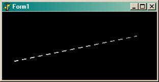{.center}

Полигоны

Теперь перейдём к плоским фигурам: треугольникам, четырёхугольникам и
произвольным выпуклым многоугольникам. С ними можно делать всё то же,
что и с линиями (только сглаживание включается и выключается процедурами
glEnable/glDisable с параметром GL\_POLYGON\_SMOOTH), плюс ещё одна
процедура: glPolygonMode(face, mode). Второй параметр - mode -
указывает, как будет рисоваться полингон (по русски - многоугольник). Он
может принимать значения GL\_POINT(рисуются только точки),
GL\_LINE(только линии) или GL\_FILL(заполненный полигон). А первый
параметр - face - показывает, какой стороне полигона применяется режим
mode: GL\_FRONT(к лицевой), GL\_BACK(к тыльной) или
GL\_FRONT\_AND\_BACK(к обеим).

Давайте нарисуем треугольник. Вот как будет выглядеть функция Draw:

          procedure TForm1.Draw;
          begin
            glClear(GL_DEPTH_BUFFER_BIT or GL_COLOR_BUFFER_BIT);
            glPolygonMode(GL_FRONT_AND_BACK,GL_FILL);
            glBegin(GL_TRIANGLES);
              glColor3f(1,0,0);
              glVertex2f(0,2);
              glColor3f(0,1,0);
              glVertex2f(8,9);
              glColor3f(0,0,1);
              glVertex2f(10,4);
            glEnd;
            SwapBuffers(ghDC);
          end;

Я уже говорил, что каждая вершина может иметь свой цвет, этим я здесь и
воспользовался. И вот что получилось:

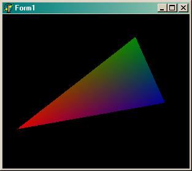{.center}

Каждой вершине указывать цвет совсем не обязательно. Если вы хотите
нарисовать треугольник одного цвета, то этот цвет указывается один раз -
перед рисованием самого примитива.

Забегая вперёд, скажу, что плавного перетекания цветов как на рисунке
может и не быть, если перед рисованием вызвать процедуру
glShadeModel(GL\_FLAT), по умолчанию её параметр - GL\_SMOOTH. Эта
процедура указывает, сглаживать или нет углы между смежными полигонами.
Вот картинки для иллюстрации её действия:

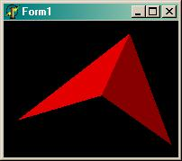{.center}

{.center}

Раз уж я сказал о штриховке линий, то нужно сказать и о трафарете -
штриховке для полигонов. Он включается командой
glEnable(GL\_POLYGON\_STIPPLE). Также как и с линиями, трафарет задаётся
массивом, который определяет битовую маску. Размер трафарета - 32x32
бита, т.е. размер массива будет 128 байт.

Мне было лень прописывать каждый из 128 байт маски по отдельности, и я
сформировал её в цикле, и вот результат:

          procedure TForm1.Draw;
          var
            stip:array [1..16,1..8] of GLubyte;
            i,k:byte;
          begin
            glClear(GL_DEPTH_BUFFER_BIT or GL_COLOR_BUFFER_BIT);
            // формируем маску
            for k:=1 to 16 do
              for i:=1 to 8 do
                stip[k][i]:=k-i;
            glEnable(GL_POLYGON_STIPPLE);
            glPolygonStipple(@stip);
            glPolygonMode(GL_FRONT_AND_BACK,GL_FILL);
            glColor3f(1,0,0);
            glBegin(GL_TRIANGLES);
              glVertex2f(0,2);
              glVertex2f(8,9);
              glVertex2f(10,4);
            glEnd;
            SwapBuffers(ghDC);
          end;

Вот результат:

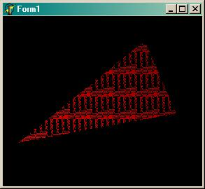{.center}

Вообще маска формируется один раз, поэтому, если вы перенесёте код её
формирования в другое место (например в FormCreate), то программа будет
работать быстрее.

Ещё хотелось бы сказать о массивах OpenGL. Этот метод позволяет хранить
все вершины объекта в массиве, причем в этом массиве можно хранить не
только координаты вершин, но и их атрибуты (иногда это бывает полезно).
Но товарищи из Borland'а решили, что нам это не нужно и не объявили
соответствующие процедуры и константы. Без этого легко можно обойтись,
но всё-таки обидноL.

Параллелепипед

Не знаю, заметили вы или нет, но GLU не позволяет создавать
параллелепипеды. Давайте это исправим: напишем процедуру, рисующую
параллелепипед.

          procedure piped(a,b,c:GLfloat);
          begin
            glShadeModel(GL_FLAT);
            glPolygonMode(GL_FRONT_AND_BACK,GL_FILL);
            glBegin(GL_QUAD_STRIP);
              glVertex3f(-a/2,-b/2,-c/2);
              glVertex3f(-a/2,-b/2, c/2);
              glVertex3f(-a/2, b/2,-c/2);
              glVertex3f(-a/2, b/2, c/2);
              glVertex3f( a/2, b/2,-c/2);
              glVertex3f( a/2, b/2, c/2);
              glVertex3f( a/2,-b/2,-c/2);
              glVertex3f( a/2,-b/2, c/2);
              glVertex3f(-a/2,-b/2,-c/2);
              glVertex3f(-a/2,-b/2, c/2);
            glEnd;
            glBegin(GL_QUADS);
              glVertex3f(-a/2,-b/2, c/2);
              glVertex3f(-a/2, b/2, c/2);
              glVertex3f( a/2, b/2, c/2);
              glVertex3f( a/2,-b/2, c/2);
              glVertex3f(-a/2,-b/2,-c/2);
              glVertex3f(-a/2, b/2,-c/2);
              glVertex3f( a/2, b/2,-c/2);
              glVertex3f( a/2,-b/2,-c/2);
            glEnd;
          end;

Можно проверять!

glOrtho вызовем также, как и в примере со сферой: glOrtho(-5,5, -5,5,
1,12).

А в Draw напишем следующее:

          glColor3f(0.6,0.7,0.9);
          glPushMatrix;
            glRotatef(10, 0,0,1);
            glRotatef(25, 0,1,0);
            glRotatef(20, 1,0,0);
            piped(5,1.2,3.5);
          glPopMatrix;

И получим картинку:

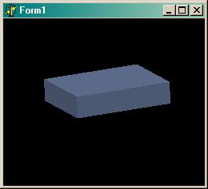{.center}

На этом я, пожалуй, закончу.

Луковкин Сергей, <gluk-02@yandex.ru>

<https://delphiworld.narod.ru/>

DelphiWorld 6.0
