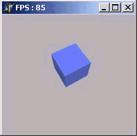

OpenGL в Delphi. Часть 1. Первые полигоны
=========================================

::: {.date}
01.01.2007
:::

Первая программа с использованием OpenGL

OpenGL ...

Вам потребуется Borland DELPHI v.3-5 и OPENGl32.DLL

Начнём, пожалуй! Для начала скачайте пример ... и  посмотрите на его работу...

Если Вы видели ВРАЩАЮЩИЙСЯ КУБ,то я Вас поздравляю!
Вы только-что запустили Вашу первую программу на OpenGL!!.

А теперь самое интересное начнём разбор полётов...

Нет, если Вы скачали пример, то бросать это не стоит  ЗДЕСЬ ВСЁ ПРОСТО.

Откройте новый проект: File -\> New -\> Application; У Вас успехи
(шутка).

Теперь в директиву \"uses\" добавьте \"OpenGL\" вот так:

       uses
          Windows, Messages, SysUtils, Classes, Graphics, Controls, Forms,
          Dialogs,ExtCtrls,OpenGL, //Подключаем OpenGL32.dll,
          dglut;//модуль для рисования правильных объектов одной строкой кода

Прекрасно!

Создайте обработку таких процедур в Object Inspector - \> Events

(я,надеюсь, что вы знакомы с Delphi):

        procedure FormCreate(Sender: TObject);
        procedure FormDestroy(Sender: TObject);
        procedure FormResize(Sender: TObject);

А теперь в разделе private сделайте следующее

        procedure Initsvet;
        procedure SetPixFormat;// формат пукселя
        procedure Draww;
        procedure WMPaint( var Msg: TWMPaint );// похожа на OnPaint
        message WM_PAINT; // сообщение от OnPaint

В разделе private

обьявим\...:

         DC:HDC; //   переменные для получения контекста воспроизведения
         hrc:HGLRC; //
         Angle:GLfloat; // угол, на который будет поворачиваться куб
         procedure initsvet;
         procedure SetPixFormat;

В разделе protected

обьявим\...:

     procedure WMPaint(var Msg: TWMPaint); message WM_PAINT;

просто вот так всё и пишите, компилятор не обидится!!

В качестве константы объявим:

    const
      MaterialColor: Array [0..3] of GLfloat = (0.3, 0.4, 1.0, 1.0);

Оформим процедурки:

    procedure TForm1.FormCreate(Sender: TObject);
    begin
      Angle := 0;
      DC := GetDC(Handle); // получить окно
      SetPixFormat; // установим формат пикселя
      hrc := wglCreateContext(DC);
      wglMakeCurrent(DC, hrc); // сделаем "текущим контекст воспроизведения
      Initsvet; // включим свет
      glMaterialfv(GL_FRONT, GL_AMBIENT_AND_DIFFUSE , @MaterialColor);
      glMatrixMode(GL_MODELVIEW);
      Timer1.Enabled := True; // включим таймер
      GLShadeModel(GL_SMOOTH);
    end;
     
    procedure TForm1.initsvet;//  СВЕТ  //
     const
        fogColor    : array[0..3] of GLfloat = (0.7, 0.7, 0.7, 2.0);
    var
     fogMode : GLint;
    begin
      glEnable(GL_DEPTH_TEST); // разрешить тест глубины
      glEnable(GL_LIGHTING);   // разрешить освещённость
      glEnable(GL_LIGHT0);     // включить нулевую лампу
    end;
     
    procedure TForm1.SetPixFormat;
    var
      nPixelFormat: Integer;
      pfd: TPixelFormatDescriptor;
    begin
      FillChar(pfd, SizeOf(pfd), 0);
     
      with pfd do
        begin
         nSize     := sizeof(pfd);
         nVersion  := 1;
         dwFlags   := PFD_DRAW_TO_WINDOW or
                      PFD_SUPPORT_OPENGL or
                      PFD_DOUBLEBUFFER;
         iPixelType:= PFD_TYPE_RGBA;
         cColorBits:= 24;
         cDepthBits:= 32;
         iLayerType:= PFD_MAIN_PLANE;
        end;
      nPixelFormat := ChoosePixelFormat(DC, @pfd);
      SetPixelFormat(DC, nPixelFormat, @pfd);
    end;
    procedure TForm1.WMPaint(var Msg: TWMPaint);
    var
      ps : TPaintStruct;
    begin
    BeginPaint(Handle, ps);
     
     glClear(GL_COLOR_BUFFER_BIT or GL_DEPTH_BUFFER_BIT); //очистить цветовой буфер, и буфер глубины
     glClearColor(0.7,0.7,0.7,0.0); // очищать экран серым цветом
     glLoadIdentity; // загрузить матрицу
      glTranslatef(0.0, 0.0, -9.0);
       glRotatef(Angle / (random (1) + 1), 1.0, 0.0, 0.0);
       glRotatef(Angle , 0.0, 0.0, 1.0); //
         glpushmatrix; // сохраним текущу систему координат
           glutsolidcube(2); // нарисуем куб с ребром 2
         glpopmatrix; // восстановим систему координат
     SwapBuffers(DC); // перевернём передний и задний буферы
     
     
    EndPaint(Handle, ps);
    end;
     
    procedure TForm1.Timer1Timer(Sender: TObject);
    begin
      Angle := Angle + 1.0; // увеличиваем угол
       If (Angle >= 360.0) then Angle := 0.0;  // если совершён полный оборот, то вернуть в 0
      InvalidateRect(Handle, nil, False); // перерисовать окно
    end;
    procedure TForm1.FormResize(Sender: TObject);
    begin
      glMatrixMode(GL_PROJECTION); // модель матрицы проекционная
      glLoadIdentity; // загрузить матрицу
      gluPerspective(60.0, Width / Height, 1.0, 10.0);
      glViewport(0, 0, Width, Height); // область вывода весь экран
      glMatrixMode(GL_MODELVIEW); // модель матрицы перспективная
      InvalidateRect(Handle, nil, False); // перерисовать всё окно
    end;
    procedure TForm1.FormDestroy(Sender: TObject);
    begin
      Timer1.Enabled := False;
      wglMakeCurrent(0, 0);  // сделать контекст "текущим"
      wglDeleteContext(hrc); // удалить контекст воспроизведения
      ReleaseDC(Handle, DC); // удалить окно
    end;

А теперь запускаем!!!!

{.center}

Вот и всё!

<https://www.ogldelphi.km.ru/about.html>
