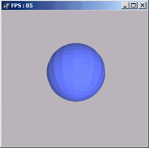
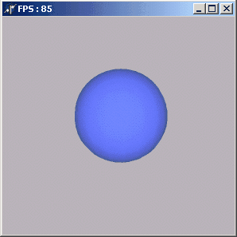

OpenGL в Delphi. Часть 4. Сглаживание
=====================================

Сглаживание позволяет получить более красивую картинку.

По умолчанию сглаживание включено.

За включение/выключение этого самого сглаживания отвечает процедура
`glShadeModel`.

Параметры у неё следующие:

-   GL\_SMOOTH - установлено по-умолчанию
-   GL\_FLAT - отключение режима сглаживания

Кстати интерполяция цветов происходит ТОЛЬКО при включённом сглаживании!

Как в этой демке

Существенные различия в работе процедуры с разными параметрами видны
невооружонным глазом:

:::{.center}
  
:::

Вот и всё!

