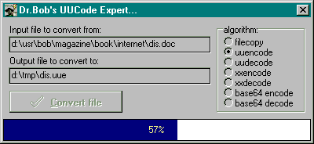
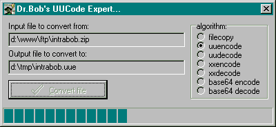

Форматы кодирования файлов Интернет
===================================

Форматы файлов Интернет можно разделить на несколько групп. Во первых
форматы передачи файлов по FTP, для чего очень давно была разработана
схема `uuencode/decode`, замененная затем на `xxencode/decode`.
В дальнейшем
произошел отказ в пользу `Base64` и `MIME`, которая сейчас используется
большинством почтовых программ.

Второй тип  Интернет форматов это HTML,
который со всеми его версиями (часто специфичными для конкретного
браузера) и улучшениями сам в себе.

Третий тип Интернет форматов это
больше интерфейс или протокол связи: CGI, который может быть или
стандартный CGI (консольный, или Windows CGI или WinCGI.).

**Передача файлов через Интернет**

Дельфи имеет сильный набор средств для написания новых компонентов и для
иллюстрации мы напишем кодирование с помощью uuencode/uudecode,
xxencode/xxdecode и Base64. Мы напишем достаточно мощный компонент,
который реализует данные алгоритмы. Новый компонент реализует uuencode и
uudecode алгоритмы, которые могут быть использованы для передачи файлов
через Интернет (ранее использовались для передачи файлов между Unix
системами).

Для более утонченного способа передачи файлов смотри главу об WinInet и
FTP компонентах. Эти алгоритмы кодирования файлов д в основном
используются для передачи файлов в почте и группах новостей

**UUEncode и UUDecode**

Необходимость кодирование файлов при передаче является то, что ф файле
могут находиться любые двоичные данные, для это файл преобразовывается в
"читаемую" или "печатаемую" форму в набор из 64 символов:

    [`!"#$%&'()*+,-./0123456789:;<=?@ABC...XYZ[\]^_],

чтобы
кодированный фал прошел через различные сети и почтовые шлюзы.
Эти 64 печатных символа представлены в следующей таблице.

Набор символов UUEncode

    |------|------|------|------|------|------|------|------|
    | 0  ` | 1  ! | 2  " | 3  # | 4  $ | 5  % | 6  & | 7  ' |
    |------|------|------|------|------|------|------|------|
    | 8  ( | 9  ) | 10 * | 11 + | 12 , | 13 - | 14 . | 15 / |
    |------|------|------|------|------|------|------|------|
    | 16 0 | 17 1 | 18 2 | 19 3 | 20 4 | 21 5 | 22 6 | 23 7 |
    |------|------|------|------|------|------|------|------|
    | 24 8 | 25 9 | 26 : | 27 ; | 28 < | 29 = | 30 > | 31 ? |
    |------|------|------|------|------|------|------|------|
    | 32 @ | 33 A | 34 B | 35 C | 36 D | 37 E | 38 F | 39 G |
    |------|------|------|------|------|------|------|------|
    | 40 H | 41 I | 42 J | 43 K | 44 L | 45 M | 46 N | 47 O |
    |------|------|------|------|------|------|------|------|
    | 48 P | 49 Q | 50 R | 51 S | 52 T | 53 U | 54 V | 55 W |
    |------|------|------|------|------|------|------|------|
    | 56 X | 57 Y | 58 Z | 59 [ | 60 \ | 61 ] | 62 ^ | 63 _ |
    |------|------|------|------|------|------|------|------|

Алгоритм выдает файл состоящий из строки заголовка, за ней несколько
кодированных строк и в конце завершающая строка.

Любые строки до строки заголовка или после завершающей строки
игнорируются (так как они не содержат специальных ключевых слов
"begin" или "end", которые однозначно определяют заголовок и
завершающую строку).

Строка заголовка начинается с ключевого слова "begin", за который
следует режим файла (четыре восьмеричных цифры) и имя файла, разделенные
пробелом.

Завершающая строка начинается с ключевого слова "end"

Кодированные строки располагаются между заголовком и завершающей
строкой, и могут содержать максимум 61 символ, первый символ указывает
размер строки и максимум 60 символов сама строка.

Первый символ строки содержит длину строки из набора символов UUEncode,
для получения подлинной длины строки из кода символов вычитается 32
($20).

Строки данных могут содержать максимум 60 символов, это означает, что
первый символ строки (длина) может быть \'M\' (60 символ набора символов
UUEncode).

Действительные данные группируются по четыре байта.

Три символа из входного фала (3 * 8 = 24 бита) кодируются в четыре
символа, так что каждый из них содержит только 6 бит, то есть значения
от 0 до 63.

Результат затем используется как индекс в таблицу набора символов
UUEncode.

Так как каждый кодированный символ представляет из себя простой символ
таблицы ASCII начинающийся с позиции 33 и до позиции 64 + 32 = 96, то мы
можем просто прибавить ASCII значение символа пробела, что бы получить
требуемый UUкодированный символ.

Алгоритм преобразовывает три двоичных символа (Triplet) в четыре
(Kwartet) UUкодированных символа и может быть реализован в Паскале
следующим образом.

    procedure Triplet2Kwartet(const Triplet: TTriplet;
                                var Kwartet: TKwartet);
     var
       i: Integer;
     begin
       Kwartet[0] := (Triplet[0]  SHR 2);
       Kwartet[1] := ((Triplet[0] SHL 4) AND $30) +
                     ((Triplet[1] SHR 4) AND $0F);
       Kwartet[2] := ((Triplet[1] SHL 2) AND $3C) +
                     ((Triplet[2] SHR 6) AND $03);
       Kwartet[3] := (Triplet[2] AND $3F);
       for i:=0 to 3 do
         if Kwartet[i] = 0 then
           Kwartet[i] := $40 + Ord(SP)
         else Inc(Kwartet[i], Ord(SP))
     end {Triplet2Kwartet};

Данная процедура состоит из двух частей: в первой части 24 бита (3 * 8)
из триплета преобразовываются в 24 бита (4 * 6) квартета. Во второй
части алгоритма, мы добавляем ASCII код символа пробела к каждому
квартету. ASCII код символа пробела закодирован как Ord(SP), где SP
определен как символ пробела или #32. Заметим, что для случая когда
квартет равен 0, то мы не добавляем значение  #32, поскольку многие
почтовые программы имеют проблемы с этим символом, просто в этом случае
добавляем код со значением 64 ($40)., в результате получаем вместо
пробела код обратного апострофа, который нейтрален к алгоритму
декодирования, одинаково работающий как для пробела так и для апострофа.

Говоря о декодировании, реализация его в Паскале преобразования
квартетов обратно в триплеты следующая:

    procedure Kwartet2Triplet(const Kwartet: TKwartet;
                               var Triplet: TTriplet);
     var
       i: Integer;
     begin
       Triplet[0] :=  ((Kwartet[0] - Ord(SP)) SHL 2) +
                     (((Kwartet[1] - Ord(SP)) AND $30) SHR 4);
       Triplet[1] := (((Kwartet[1] - Ord(SP)) AND $0F) SHL 4) +
                     (((Kwartet[2] - Ord(SP)) AND $3C) SHR 2);
       Triplet[2] := (((Kwartet[2] - Ord(SP)) AND $03) SHL 6) +
                      ((Kwartet[3] - Ord(SP)) AND $3F)
     end {Kwartet2Triplet};

Если размер триплета в файле менее 3 байт (4 байта в квартете), то
производится добавление структуры нулями при кодировании и
декодировании.

**XXEncode и XXDecode**

UUкодирование было наиболее популярным форматом 64 битного кодирования.
Ограничение состояло в том, что набор символов не мог транслироваться
между наборами ASCII и EBCDIC (IBM мейнфреймы). XXencode очень похож на
UUEncode, просто используется другой набор символов, что более удобно
между различными типами систем, например как указано выше между EBCDIC и
ASCII.

Набор символов XXEncode

    |------|------|------|------|------|------|------|------|
    | 0  + | 1  - | 2  0 | 3  1 | 4  2 | 5  3 | 6  4 | 7  5 |
    |------|------|------|------|------|------|------|------|
    | 8  6 | 9  7 | 10 8 | 11 9 | 12 A | 13 B | 14 C | 15 D |
    |------|------|------|------|------|------|------|------|
    | 16 E | 17 F | 18 G | 19 H | 20 I | 21 J | 22 K | 23 L |
    |------|------|------|------|------|------|------|------|
    | 24 M | 25 N | 26 O | 27 P | 28 Q | 29 R | 30 S | 31 T |
    |------|------|------|------|------|------|------|------|
    | 32 U | 33 V | 34 W | 35 X | 36 Y | 37 Z | 38 a | 39 b |
    |------|------|------|------|------|------|------|------|
    | 40 c | 41 d | 42 e | 43 f | 44 g | 45 h | 46 i | 47 j |
    |------|------|------|------|------|------|------|------|
    | 48 k | 49 l | 50 m | 51 n | 52 o | 53 p | 54 q | 55 r |
    |------|------|------|------|------|------|------|------|
    | 56 s | 57 t | 58 u | 59 v | 60 w | 61 x | 62 y | 63 z |
    |------|------|------|------|------|------|------|------|

Заметим что если для UUEncode используется подмножество набора символов
ASCII (32..96), то для XXEncode это не так.

Для преобразования процедур Triplet2Kwartet и Kwartet2Triplet для
поддержки мы вводим дополнительный массив из 64 символов.

Нам также необходимо модифицировать процедуры Triplet2Kwartet и
Kwartet2Triplet следующим образом.

    const
       XX: Array[0..63] of Char =
          '+-0123456789ABCDEFGHIJKLMNOPQRSTUVWXYZabcdefghijklmnopqrstuvwxyz';
     
     procedure Triplet2Kwartet(const Triplet: TTriplet;
                               var Kwartet: TKwartet);
     var
       i: Integer;
     begin
       Kwartet[0] := (Triplet[0] SHR 2);
       Kwartet[1] := ((Triplet[0] SHL 4) AND $30) +
                     ((Triplet[1] SHR 4) AND $0F);
       Kwartet[2] := ((Triplet[1] SHL 2) AND $3C) +
                     ((Triplet[2] SHR 6) AND $03);
       Kwartet[3] := (Triplet[2] AND $3F);
       for i:=0 to 3 do
         if Kwartet[i] = 0 then
           Kwartet[i] := $40 + Ord(SP)
         else Inc(Kwartet[i],Ord(SP));
       if XXCode then
         for i:=0 to 3 do
           Kwartet[i] := Ord(XX[(Kwartet[i] - Ord(SP)) mod $40])
     end {Triplet2Kwartet};

Последние несколько строк новые для процедуры Triplet2Kwartet и мы
используем набор символов XXencode для возврата правильно закодированных
символов. Помните, что UUEncode возвращает индекс  кодированного
символа, после чего мы к нему добавляем код #32, так что если XXencode
используется после преобразования в UUEncode, то мы должны вычесть 32 и
использовать результат как индекс в таблицу символов XXencode.

То же самое относится и к процедуре Kwartet2Triplet, где мы должны
преобразовать XXencode  символы перед использованием алгоритма UUdecode
(заметим, что мы теперь не передаем Kwartet как const).

     procedure Kwartet2Triplet(Kwartet: TKwartet;
                               var Triplet: TTriplet);
     var
       i: Integer;
     begin
       if XXCode then
       begin
         for i:=0 to 3 do
         begin
           case Chr(Kwartet[i]) of
                 '+': Kwartet[i] := 0 + Ord(SP);
                 '-': Kwartet[i] := 1 + Ord(SP);
            '0'..'9': Kwartet[i] := 2 + Kwartet[i]
                                      - Ord('0') + Ord(SP);
            'A'..'Z': Kwartet[i] := 12 + Kwartet[i]
                                       - Ord('A') + Ord(SP);
            'a'..'z': Kwartet[i] := 38 + Kwartet[i]
                                       - Ord('a') + Ord(SP)
           end
         end
       end;
       Triplet[0] :=  ((Kwartet[0] - Ord(SP)) SHL 2) +
                     (((Kwartet[1] - Ord(SP)) AND $30) SHR 4);
       Triplet[1] := (((Kwartet[1] - Ord(SP)) AND $0F) SHL 4) +
                     (((Kwartet[2] - Ord(SP)) AND $3C) SHR 2);
       Triplet[2] := (((Kwartet[2] - Ord(SP)) AND $03) SHL 6) +
                      ((Kwartet[3] - Ord(SP)) AND $3F)
     end {Kwartet2Triplet};

Заметим, что в новой версии этих процедур используется глобальная
переменная XXCode логического типа для определения типа кодирования.

**Base64**

Алгоритм кодирования Base64 отличается от алгоритмов UUencode и XXencode
тем, что в нем не используется первый символ как индикатор длины. Общее
то что используется алгоритм преобразования триплетов в квартеты с
помощью 64 байтной таблицы преобразования.

**Набор символов Base64**

    +------+------+------+------+------+------+------+------+
    | 0  A | 1  B | 2  C | 3  D | 4  E | 5  F | 6  G | 7  H |
    +------+------+------+------+------+------+------+------+
    | 8  I | 9  J | 10 K | 11 L | 12 M | 13 N | 14 O | 15 P |
    +------+------+------+------+------+------+------+------+
    | 16 Q | 17 R | 18 S | 19 T | 20 U | 21 V | 22 W | 23 X |
    +------+------+------+------+------+------+------+------+
    | 24 Y | 25 Z | 26 a | 27 b | 28 c | 29 d | 30 e | 31 f |
    +------+------+------+------+------+------+------+------+
    | 32 g | 33 h | 34 I | 35 j | 36 k | 37 l | 38 m | 39 n |
    +------+------+------+------+------+------+------+------+
    | 40 o | 41 p | 42 q | 43 r | 44 s | 45 t | 46 u | 47 v |
    +------+------+------+------+------+------+------+------+
    | 48 w | 49 x | 50 y | 51 z | 52 0 | 53 1 | 54 2 | 55 3 |
    +------+------+------+------+------+------+------+------+
    | 56 4 | 57 5 | 58 6 | 59 7 | 60 8 | 61 9 | 62 + | 63 / |
    +------+------+------+------+------+------+------+------+

Подобно набору символов XXencode, набор символов Base64 не является
подмножеством набора символов ASCII.

Это означает, что мы должны добавить массив преобразования в набор
символов Base64 и также преобразовать процедуры Triplet2Kwartet и
Kwartet2Triplet для поддержки данного алгоритма:

     const
       B64: Array[0..63] of Char =
          'ABCDEFGHIJKLMNOPQRSTUVWXYZabcdefghijklmnopqrstuvwxyz0123456789+/';
     
     procedure Triplet2Kwartet(Const Triplet: TTriplet;
                               var Kwartet: TKwartet);
     var
       i: Integer;
     begin
       Kwartet[0] := (Triplet[0] SHR 2);
       Kwartet[1] := ((Triplet[0] SHL 4) AND $30) +
                     ((Triplet[1] SHR 4) AND $0F);
       Kwartet[2] := ((Triplet[1] SHL 2) AND $3C) +
                     ((Triplet[2] SHR 6) AND $03);
       Kwartet[3] := (Triplet[2] AND $3F);
       for i:=0 to 3 do
         if Kwartet[i] = 0 then
           Kwartet[i] := $40 + Ord(SP)
         else Inc(Kwartet[i],Ord(SP));
       if Base64 then
         for i:=0 to 3 do
           Kwartet[i] := Ord(B64[(Kwartet[i] - Ord(SP)) mod $40])
       else
         if XXCode then
           for i:=0 to 3 do
             Kwartet[i] := Ord(XX[(Kwartet[i] - Ord(SP)) mod $40])
     end {Triplet2Kwartet};
     
     procedure Kwartet2Triplet(Kwartet: TKwartet;
                               var Triplet: TTriplet);
     var
       i: Integer;
     begin
       if Base64 then
       begin
         for i:=0 to 3 do
         begin
           case Chr(Kwartet[i]) of
            'A'..'Z': Kwartet[i] := 0 + Kwartet[i]
                                      - Ord('A') + Ord(SP);
            'a'..'z': Kwartet[i] := 26+ Kwartet[i]
                                      - Ord('a') + Ord(SP);
            '0'..'9': Kwartet[i] := 52+ Kwartet[i]
                                      - Ord('0') + Ord(SP);
                 '+': Kwartet[i] := 62+ Ord(SP);
                 '/': Kwartet[i] := 63+ Ord(SP);
           end
         end
       end
       else
       if XXCode then
       begin
         for i:=0 to 3 do
         begin
           case Chr(Kwartet[i]) of
                 '+': Kwartet[i] := 0 + Ord(SP);
                 '-': Kwartet[i] := 1 + Ord(SP);
            '0'..'9': Kwartet[i] := 2 + Kwartet[i]
                                      - Ord('0') + Ord(SP);
            'A'..'Z': Kwartet[i] := 12 + Kwartet[i]
                                       - Ord('A') + Ord(SP);
            'a'..'z': Kwartet[i] := 38 + Kwartet[i]
                                       - Ord('a') + Ord(SP)
           end
         end
       end;
       Triplet[0] :=  ((Kwartet[0] - Ord(SP)) SHL 2) +
                     (((Kwartet[1] - Ord(SP)) AND $30) SHR 4);
       Triplet[1] := (((Kwartet[1] - Ord(SP)) AND $0F) SHL 4) +
                     (((Kwartet[2] - Ord(SP)) AND $3C) SHR 2);
       Triplet[2] := (((Kwartet[2] - Ord(SP)) AND $03) SHL 6) +
                      ((Kwartet[3] - Ord(SP)) AND $3F)
     end {Kwartet2Triplet};

Заметим, что в новой версии появилась новая глобальная переменная,
которая используется для определения формата кодирования.

**MIME**

MIME означает Multipurpose Internet Mail Extensions (Расширение форматов
Интернет почты), в котором международным стандартом является кодирование
Base64. Данное расширение было разработано для многоязычной поддержки и
преобразования символов между системами (такими как IBM мейнфреймы,
системы на базе UNIX, Macintosh и IBM PC).

MIME алгоритм кодирования базируется на RFC1341 как MIME Base64. Подобно
UUencode, назначение MIME кодировать двоичные файлы так, что бы они
смогли пройти через различные почтовые системы, и MIME использует для
этого алгоритм кодирования Base64, плюс набор специальных ключевых слов
и опций, которые используются для более детализированной информации о
содержимом MIME.

### TBUUCode компонент

Определение интерфейса компонента TUUCode, базируется на ранее
приведенных и объясненных процедур Triplet2Kwartet и Kwartet2Triplet,
заметим, что ниже приведенный код использует условное компилирование в
зависимости от версий Delphi и C++Builder.

     unit UUCode;
     interface
     uses
     {$IFDEF WIN32}
       Windows,
     {$ELSE}
       WinTypes, WinProcs,
     {$ENDIF}
       SysUtils, Messages, Classes, Graphics, Controls, Forms;
     
     {$IFNDEF WIN32}
     type
       ShortString = String;
     {$ENDIF}
     
     type
       EUUCode = class(Exception);
     
       TAlgorithm = (filecopy, uuencode, uudecode,
                               xxencode, xxdecode,
                               Base64encode, Base64decode);
       TUnixCRLF = (CRLF, LF);
     
       TProgressEvent = procedure(Percent:Word) of Object;
     
       TBUUCode = class(TComponent)
       public
       { Public class declarations (override) }
         constructor Create(AOwner: TComponent); override;
     
       private
       { Private field declarations }
         FAbout: ShortString;
         FActive: Boolean;
         FAlgorithm: TAlgorithm;
         FFileMode: Word;
         FHeaders: Boolean;
         FInputFileName: TFileName;
         FOutputFileName: TFileName;
         FOnProgress: TProgressEvent;
         FUnixCRLF: TUnixCRLF;
       { Dummy method to get read-only About property }
         procedure Dummy(Ignore: ShortString);
     
       protected
       { Protected Activate method }
         procedure Activate(GoActive: Boolean);
     
       public
       { Public UUCode interface declaration }
         procedure UUCode;
     
       published
       { Published design declarations }
         property About: ShortString read FAbout write Dummy;
         property Active: Boolean read FActive write Activate;
         property Algorithm: TAlgorithm read Falgorithm
                                        write FAlgorithm;
         property FileMode: Word read FFileMode write FFileMode;
         property Headers: Boolean read FHeaders write FHeaders;
         property InputFile: TFileName read FInputFileName
                                       write FInputFileName;
         property OutputFile: TFileName read FOutputFileName
                                        write FOutputFileName;
         property UnixCRLF: TUnixCRLF read FUnixCRLF write FUnixCRLF;
     
       published
       { Published Event property }
         property OnProgress: TProgressEvent read FOnProgress
                                             write FOnProgress;
       end {TUUCode};

**Свойства**

TUUCode компонент имеет восемь опубликованных свойств (мы здесь опустим
описание обработчиков событий):

Свойство `About` содержит информацию о правах и версии.

Свойство `Active` может использоваться для вызова преобразования UUCode во
время разработки (design time), подобно свойству Active у TTables и
Tquery компонент.

Свойство `Algorithm` содержит информацию об алгоритме кодирования для
метода UUCode. Реализованы следующие алгоритмы:

- filecopy - простое копирование файла InputFile в файл OutputFile
- uuencode - копирование файла с помощью алгоритма uuencode из файла InputFile и генерация файла OutputFile
- uudecode - копирование файла с помощью алгоритма uudecode из файла InputFile (и генерация файла OutputFile, если не используется Headers)
- xxencode - копирование файла с помощью алгоритма xxencode из файла InputFile и генерация файла OutputFile
- xxdecode - копирование файла с помощью алгоритма xxdecode из файла InputFile (и генерация файла OutputFile, если не используется Headers)
- Base64encode - копирование файла с помощью алгоритма Base64 encode InputFile и генерация файла OutputFile
- Base64decode - копирование файла с помощью алгоритма Base64 decode InputFile (и генерация файла OutputFile, если не используется Headers)

Свойство `FileMode` содержит шестнадцатеричное значение режима файла
(обычно 0644 или  0755). Заметим, что режим задается с помощью
десятичных цифр.

Свойство `Headers` может быть использовано для указания должны или нет
использоваться заголовки begin-end в алгоритме кодирования или ожидаются
в алгоритме декодирования. Значение по умолчанию True.

Свойство `InputFile` содержит имя входного файла для
кодирования/декодирования.

Свойство `OutputFile` содержит имя выходного файла, в который будет
записан результат кодирования. Заметим, что свойство OutputFile
игнорируется при декодировании, если входной файл имеет заголовки,
которые определяют имя файла для декодирования.

Свойство `UnixCRLF` используется для указания разделителей строк
специфичных для Unix систем, только Line Feed (перевод строки) или
DOS/Windows, где используется пара Carriage Return/Line Feed (возврат
каретки/ перевод строки). По умолчанию CRLF, но как минимум вы имеете
возможность кодировать и декодировать файлы для Unix систем.

**Методы**

Компонент TUUCode имеет три метода; один public конструктор, один
protected метод и один public метод:

Конструктор `Create` используется для создания компонента и инициализации
свойств ао умолчанию (default) для Active, FileMode, Headers и About.

Метод `Activate` используется для вызова метода UUCode во время
разработки, когда вы изменяете состояние свойства в True. При
необходимости вы можете вызвать этот метод напрямую, так как это проще
вызова метода UUCode.

Метод `UUCode` это метод, в котором в действительности производится
кодирование/декодирование входного файла (InputFile), базируясь на
состоянии других свойств компонента TUUCode.

**События**

Компонент TUUCode имеет только одно такое свойство:

Событие `OnProgress` может использоваться как callback функция,
позволяющая компоненту TUUCode выдавать текущий процент обработки
входного файла. Использовать эту информацию вы можете с компонентами
16-битным TGauge или 32-битным TprogressBar, для примера показывая
прогресс выполнения кодирования/декодирования от 0 до 100%.

Кодирование/декодирование больших документов может занимать значительное
время даже при использовании быстрой машины и быстрых дисков. Поэтому
приятно иметь такую возможность показывать процесс выполнения. Для
реализации вам нужно создать обработчик события.

Обработчик состоит из двух частей, сигнализатора и обработчика события.
Сигнализатор должен быть уверен, что компонент в состоянии  принять
сообщение определенного типа и сгенерировать событие. Обработчик события
с другой стороны начинает работать только при поступлении события.

Сигнализатор типично виртуальный или динамический метод самого класса
(подобно методу Click) или сообщению Windows, такому как оповещение
(notification) или callback сообщения. Обработчик события типично
присваивается свойству, такому как OnClick, OnChange или  OnProgress.
Если обработчик события опубликован, то конечный пользователь компонента
может написать любой код для обработки события.

**Обработчики событий**

Обработчики события методы объекта. Это означает, что они должны быть
методами класса, а не обычной процедурой или функцией (первый параметр
должен быть Self). Для наиболее употребимых обработчиков предназначен
следующий тип:

    TNotifyEvent = procedure(Sender: TObject) of object;

Тип `TNotifyEvent` для обработчиков, в которые передается только один
параметр sender. Эти события просто оповещают компонент о возникновении
специфического события у объекта sender. Например, OnClick, типа
TNotifyEvent, указывает органу, что произошло событие click у
конкретного органа. Если бы параметр Sender отсутствовал, то мы бы знали
только, то, что произошло определенное событие, но не знали бы у какого
органа. Обычно нам требуется знать, у какого конкретно органа произошло
данное событие, что бы мы могли работать с этим органом или его
данными..

Как было указано ранее, Обработчики событий присваиваются свойствам типа
событие (event), и они появляются как отдельная закладка в инспекторе
объектов (Object Inspector), для различения их от обычных свойств.
Основой для помещения этого свойства на закладку события является то,
что они должны быть типа "procedure/function of Object". Фраза "of
Object" обязательна, иначе мы получим сообщение об ошибке "cannot
publish property".

Компоненту TUUCode требуется событие типа TProgressEvent. Данному
событию реально не требуется параметр sender (это всегда можно добавить
позже), но ему необходим процент выполнения операции, для цели опишем
следующий прототип:

    TProgressEvent = procedure(Percent: Word) of object;

**Сигнализаторы событий**

Сигнализаторы событий требуются для указания обработчику события, что
возникло указанное событие, что бы обработчик события смог бы выполнить
свои действия. Сигнализаторы обычно виртуальные или динамические методы
класса (подобно методу Click) или сообщения Windows, такие как callback
ил notification сообщения.

В случае с компонентом TUUCode, сигнализатор интегрирован
непосредственно в метод UUCode. После кодирования каждой строки,
вызывается обработчик события назначенный OnProgress, реализация этого
следующая:

    if Assigned(FOnProgress) then
      FOnProgress(trunc((100.0 * Size) / OutputBufSize))

Где Size это текущий размер или позиция в выходном буфере, и
OutputBufSize это размер выходного файла. Size увеличивается от нуля до
OutputBufSize, что означает, что обработчик события FOnProgress
вызывается с аргументом от 0 до 100.

**Регистрация компонента**

При регистрации компонента TUUCode, полезно добавить редактор свойства
FileName (InputFile), что обеспечит дополнительный комфорт для конечного
пользователя. Редактор этого свойства реализован в модуле UUReg, который
регистрирует компонент TUUCode в палитре компонентов Дельфи.

    unit UUReg;
     interface
     {$IFDEF WIN32}
       {$R UUCODE.D32}
     {$ELSE}
       {$R UUCODE.D16}
     {$ENDIF}
     uses
       DsgnIntf;
     type
       TFileNameProperty = class(TStringProperty)
       public
         function GetAttributes: TPropertyAttributes; override;
         procedure Edit; override;
       end;
     
     procedure Register;
     
     implementation
     uses
       UUCode, Classes, Dialogs, Forms, SysUtils;
     
       function TFileNameProperty.GetAttributes: TPropertyAttributes;
       begin
         Result := [paDialog]
       end {GetAttributes};
     
       procedure TFileNameProperty.Edit;
       begin
         with TOpenDialog.Create(Application) do
         try
           Title := GetName; { name of property as OpenDialog caption }
           Filename := GetValue;
           Filter := 'All Files (*.*)|*.*';
           HelpContext := 0;
           Options := Options +
                     [ofShowHelp, ofPathMustExist, ofFileMustExist];
           if Execute then SetValue(Filename);
         finally
           Free
         end
       end {Edit};
     
       procedure Register;
       begin
         { component }
         RegisterComponents('DrBob42', [TUUCode]);
         { property editor }
         RegisterPropertyEditor(TypeInfo(TFilename), nil,
                               'InputFile', TFilenameProperty);
       end {Register};
     end.

Если вы желаете использовать компонент TUUCode  в составе, какого либо
пакета, то вы должны поместить компонент UUCode в пакет времени
выполнения (runtime package), и модуль UUReg в пакет разработки
(design-time), который требует пакет времени выполнения. В
действительности, для использования пакетов вы можете использовать
UUCode Wizard из следующей главы в пакет времени разработки и сделать
его доступным в IDE Delphi для всех пользователей!

### 1.1.12. UUCode Example Wizard

Для показа прогресса 16-битный пример использует TGauge компонент, в то
же время 32-битная версия использует Windows 95 Progress Control.

:::{.center}
  
рис. 1.1. 16-битная версия примера UUCode

  
рис. 1.2. 32-битная версия примера UUCode
:::

Во время исполнения программы могут возникнуть два исключения. Если
входной файл пуст и во время кодирования, если выходной файл пуст. Для
16 битной версии может возникнуть третье исключение, если входной или
выходной файл больше 65000 байт (16-битная версия данного компонента
может обрабатывать входные и выходные файлы до 64 килобайт). На практике
это означает, не может быть более 48 килобайт. 32-битная версия не имеет
такого ограничения).

### 1.1.13. Заключение

В этой главе мы рассмотрели uuencode/uudecode, xxencode/xxdecode, и
Base64 алгоритмы кодирования/декодирования. Мы также разработали простой
VCL компонент, который поддерживает эти алгоритмы в дополнение к
простому копированию. Свойства, методы и события делают данный компонент
пригодным для построения Интернет приложений нуждающихся в подобном
преобразовании.

Компонент TBUUCode сейчас часть пакета "DrBob42 component package for
Delphi and C++Builder".
 

Интернет решения от доктора Боба (http://www.drbob42.com)

(c) 2000, Анатолий Подгорецкий, перевод на русский язык
(http://nps.vnet.ee/ftp)

 
