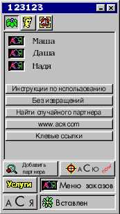
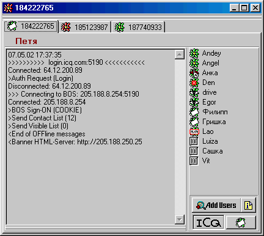

ICQ2000 - сделай сам (статья)
==============================

<table>
<tr>
<td style="border:0; width:50%;">

</td>
<td style="border:0;">
_Одна женщина другой:  
- У моего сына столько девушек!!!
  Только и слышу, то он с Клавой трахается, то с Аськой!
  И когда только успевает, ведь всё время за компьютером!_
</td>
</tr>
</table>

Прежде чем приступить к изложению своего небольшого проектика ... скажу
сразу.... написан он на Делфи. Кто огорчится, кто обрадуется. Для кого
языковой барьер не помеха, а для кого непреодолимое препятствие. Лично я
постигал все перелести протоколов ICQ на кодах написанных на С++.
Главное - видеть "главное". А мне нравится Делфи. На нем отправить
пакет данных в интернет наверное проще, чем записать его в обычный файл.

**Самые общие сведения о протоколах ICQ**

Существует около десятка версий ICQ-клиентов. И у каждого - своя версия
протокола. Но не смотря на это, их всего два. Есть ICQ, работа, которых
с сервером основана на протоколе UDP, и есть ICQ общающиеся с сервером
по протоколу TCP. Немного подробнее:

**ICQ на протоколе UDP**

С нее, собственно, и начиналась история ICQ.

Это были версии протоколов 1,2,3,4 и 5. Это были аськи ICQ97, ICQ98,
ICQ99. Т.к. использован протокол UDP, то постоянного соединения
клиент-сервер не существует. Пакет передал. Получил подтверждение, и
баста. Не получил подтверждение - передай повторно.

Но об этих протоколах уже можно (и нужно) забыть. Они поддерживаются
сервером весьма неохотно, потому, что в какой-то момент компания
Mirabilis растворилась в компании America OnLine (AOL). После этого ICQ
начала работать на протоколе AOL Instant Messenger (AIM). Это и есть
вторая группа протоколов ICQ.

**ICQ на протоколе TCP**

Это версии протоколов 7,8. А может уже и 9,10,11 и т.д.

По сути дела в ICQ20xx используется протокол от AOL Inastant Messenger.
И по этому признаку эти два продукта - родные братья. Хоть я и
спользовал информацию по прортоколу v8 (ICQ2000b) но рассматривать буду
протокол v7 (ICQ2000a). Потому, что эта версия у меня была установлена и
именно ее пакеты я использовал для анализа и отладки своего детища. Это
различие не имело ровным счетом никакого значения.

Но, как говорится: "ближе к телу".

Вы вправе задать вопрос: "Как же это все будет выглядеть?"

Это выглядит примерно так:

:::{.center}
  
Сами понимаете, что номера ICQ и имена клиентов - полностью вымышленные.  
Любые совпадения с реальными людьми - чистая случайность.  
Конечно же, изображения принадлежат своим уважаемым владельцам,  
поэтому дальше их и не будет.
:::

Как видно на скриншоте, это не просто аська, а - мультиаська! Т.е. можно
находиться в онлайне сразу под несколькими UIN-ами одновременно. Иногда
это бывает полезно и даже необходимо. В интернете есть конечно примочки
для одновременного запуска нескольких копий ICQ, но ничто так не
умиляет, как сделанное своими руками. И все же для понимания работы
протокола - это излишество, поэтому я оставил только самое необходимое.

Думаю, что не стоит в самом начале нагружать разными сводными таблицами
с описанием пакетов протокола. Я буду делать это по мере необходимости.
Тем более, что из всего их множества, поначалу не все они будут и нужны.

Для работы вам потребуются только стандартные компоненты Делфи-5. Нет
нужды устанавливать какие-то вспомогательные библиотеки или пакеты.

С помощью моего ICQ-клиента можно:

- логиниться к серверу;
- отображать состояние клиентов;
- передавать и принимать сообщения;
- регистрировать (register) новый UIN на сервере;
- удалять (unregister) UIN с сервера;
- просматривать и обновлять информацию о клиентах из контактного списка;
- производить поиск клиентов по имени, по e-mail, по UIN-у;
- включать найденных клиентов в контактный список;
- вести журнал сообщений и пакетов.

Но изначально приложение будет иметь самую минимальную функциональность.
UIN и пароль у вас уже должны быть. Будем логиниться на сервере, менять
свой статус, принимать сообщения. Весь TCP-трафик идет только через
сервер. Так проще и этот способ в комбинации с некоторыми другими
параметрами позволит скрыть ваш IP-адрес от любопытных глаз. Наверное,
поэтому я не рассматриваю прямые соединения между клиентами. Разумеется,
что будем рассматривать протокол v7. На нем работает ICQ2000a.

Итак, приступим...

<!--TOC-->
