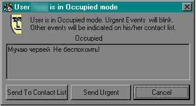

Урок №1
==============================

статья: [ICQ2000 - сделай сам](./)

<table>
<tr>
<td style="border:0; width:50%;">

</td>
<td style="border:0;">
_Приходит програмист с работы, а на него жена
набрасывается с кулаками:  
- Негодяй! Я столько лет тебя кормила, поила,
  ублажала, а ты, паразит, мне изменяешь!  
- Дорогая, о чём ты???  
- Не прикидывайся! Звонил Витька,
  спрашивал адрес твоей Аськи!_
</td>
</tr>
</table>


Все пакеты данных (и от клиента к серверу, и от сервера к клиенту)
упаковываются в т.н. FLAP-протокол. Он находится в самом низу иерархии.
Ниже показана структура FLAP-пакета:

FLAP              ||
------------------|---------
Command Start     |byte: $2A
Channel ID        |byte
Sequence Number   |word
Data Field Length |word
Data              |variable

Каждый FLAP-пакет имеет заголовок c фиксированной длиной и, следующий за
ним блок данных (переменной длины). Длина заголовка равна 6-и байтам.

FLAP-заголовок содержит такие поля:

1. Однобайтовый идентификатор начала пакета (Command Start). Его значение
всегда равно $2A. С ним можно сверяться при приеме пакетов.

2. Идентификатор канала (Channel ID). Он может принимать четыре значения:

    - канал установления соединения;
    - канал обмена данными (основная фаза работы: какие-либо полезные
      данные передаются только в этой фазе);
    - канал ошибок. (на практике мне не попадался :);
    - канал разъединения. (это проще, чем написано).

        На 99.9% времени протокол работает в канале 2.

3. Последовательный номер пакета (Sequence Number). В начале обмена данными
это поле устанавливается случайным образом, а затем увеличивается на
единицу при передаче каждого последующего пакета. Обычно такие поля
используются для обеспечения целостности данных (например, когда
используется UDP-протокол). Но в нашем случае используется
TCP-соединение и этого вполне достаточно для обеспечения целостности
передаваемых пакетов. Просто нужно следовать правилу формирования этого
поля при передаче пакетов и можно забыть о нем. (На приеме я его никак
не контролировал).

4. Длина блока данных (Data Field Length). Указывает на длину блока данных,
который следует сразу же за заголовком. Это очень важное поле. Зная его,
мы знаем сколько данных нужно прочитать из входного потока. Ошибись мы
хоть на один байт и синхронизация потока будет нарушена.

Вслед за заголовком следует блок данных FLAP-пакета.
Его длина указана в FLAP-заголовке. В нем
находится вся полезная информация для обмена ICQ-клиента и сервера.

При приеме (обработке) FLAP-пакетов очень важно не потерять
синхронизацию пакетов ( что просто недопустимо ). Нужно всегда читать
6-и байтовый залоговок, а далее считывать только, то количество данных,
которое указано в заголовке. При соблюдении этого правила можно быть
уверенным, что прочитанный блок данных будет содержать достоверную
информацию. Потеря данных неприемлема в AIM стандарте. Все это на самом
деле не трудно обеспечить.

Труднее разобраться в структуре самого блока данных. А напичкан он
весьма разнообразными структурными единицами. Видать оччень много народу
постаралось для этого. Впечатление такое, что взяли и скрестили старые
версии v2 - v5 ICQ-протокола с самим AIM-протоколом. Это вам еще
предстоит увидеть. Вот например, для представления обычных текстовых
строк, использовано 3 или 4 различных варианта. Представляете себе
строку в формате C++ или в формате Pascal, с нулем в конце или без него,
с однобайтовой длиной или двубайтовой, а порядок следования байтов в
слове? Черт ногу сломает. А может это специально сделано? Мне кажется,
что впопыхах!!!

Попробуем разобраться.


Делфи-проект nICQ в начале будет состоять из 3-х модулей: Types, Packet,
Main.

В модуле [Types](types_pas/) находятся константы и объявлены
некоторые записи.

В модуле [Packet](packet_pas/) - процедуры и функции для
записи/чтения FLAP-пакетов.(Большинство процедур из этого модуля просто
адаптированы из других проектов ICQ).

Название модуля [Main](main_pas/) говорит само за себя.

До того, как начать тестирование, вам следует ввести свой UIN, password,
NickName. Внесите эти данные в файл nICQ.ini:

```ini
[User]
Uin=199222333
Nick=My Nick
Password=mypass
```
... и можно запускать.

Список контактов нам пока не нужен. Он появится
позже. А сейчас будет вполне достаточно, если список контактов будет
состоять только из вашего собственного UINа. Жмем на единственную
кнопку, а в отладочном окне будет отображаться протокол работы. При
выборе одного из пунктов Popup-меню, вызывается процедура icq\_Login.
Что в ней? Смотрим:

    procedure TForm1.icq_Login(Status : longint);
    begin
      // определяем свой IP-адрес
      Local_IP := Get_my_IP;
      // преобразуем его в DIM_IP
      StrToIP(Local_IP,DIM_IP);
      // Запоминаем, какой будет наш статус
      ICQStatus := Status;
      // если ClientSocket открыт, то закроем его
      if CLI.Active then
        CLI.Close;
      // установим флажок isAuth,
      // это значит, что сначала мы коннектимся к серверу
      // авторизации. UIN и пароль передаются именно ему.
      isAuth := true;
      // устанавливаем флажок isHDR,
      // он говорит нам о том, что, самые первые данные,
      // из ClientSocket следует интерпретировать как
      // FLAP-заголовок
      isHDR := true;
      // заполняем поля Host и Port в ClintSocket,
      // адрес сервера авторизации: 'login.icq.com'
      // и его порт: 5190
      CLI.Address :='';
      CLI.Host := 'login.icq.com';
      CLI.Port := 5190;
      // не забываем и про TMemo
      M(Memo,'>>>>>>>>>>  login.icq.com:5190 <<<<<<<<<<<');
      // ... и собственно CONNECT
      CLI.Open;
    end;

(А вот и подходящий момент, чтобы вспомнить о вашем подключении к
интернету. Проблемы с получением CONNECTa могут возникнуть, если вы
выходите в интернет из LAN через PROXY-сервер. Все зависит от того, как
он настроен. Если он предоставляет выход в интернет только для основных
сервисов (http,ftp,smtp,pop), то тут уж извините. А если на нем
присутствует нормальный маскарадинг, то все будет OK).

Итак, что же дальше..? Желанный CONNECT должен наступить немного раньше
конца света :) Мы подсоединились к серверу авторизации и он первым
выдаст нам пакет данных. Что делать? Как принять? Куда его засунуть?


Итак, рассмотрим механизм приема FLAP-пакетов. Прием пакетов - это
обработчик события onReadData нашего ClientSocket. Задача этого
обработчика сводится только к приему FLAP-пакетов и формировании из них
связного списка типа FIFO (первым пришел, первым и ушел). Главное
корректно отработать границы пакетов.

Каждый пакет принимается в два захода:

1. сначала принимаем только заголовок FLAP-пакета (всего 6 байт);

2. затем, узнав из заголовка длину блока данных, принимаем последний (ни
байтом больше, ни байтом меньше).

Приняв полный пакет, формируем из него элемент списка FIFO и
присоединяем его к списку. Смотрим, как это сделано у меня. Для прима
заголовка и блока данных FLAP-пакета объявлены два массива: FLAP и
FLAP\_DATA соответственно.

    procedure TForm1.CLI_ReadData(Sender:TObject; Socket:TCustomWinSocket);
    var num,Bytes,fact : integer;
      pFIFO,CurrFIFO : PFLAP_Item;
      buf : array[0..100] of byte;
    begin
      // узнаем, сколько всего данных уже есть в буфере ClientSocketa
      num := Socket.ReceiveLength;
      // в icq_Login мы установили isHdr, т.к. сначала ожидаем заголовок
      if isHDR then begin
        // если есть как минимум 6 байт, то читаем 6 байт заголовка в FLAP
        if num>=6 then begin
          Socket.ReceiveBuf(FLAP,6);
          // из заголовка узнаем длину блока данных FLAP-пакета
          NeedBytes := swap(FLAP.Len);
          // сбрасываем в начало индекс массива FLAP_DATA
          index := 0;
          // сбрасываем, чтобы следующее чтение было в FLAP_DATA
          // и выходим из обработчика
          isHDR := false;
        end else begin
          // вообще-то ситуация, когда в Sockete меньше 6-и байт
          // пока никак не контролируется (возникает очень редко :)
          // отмечаю этот факт только в окне отладки 
          M(Memo,'!!!!!!!!!!!!!!!!!!!!!!!!!!!!!!!');
          Socket.ReceiveBuf(buf,num);
          M(Memo,Dim2Hex(@(buf),num));
          M(Memo,'!!!!!!!!!!!!!!!!!!!!!!!!!!!!!!!');
        end;
     
        // if not isHDR then чтение в FLAP_DATA
      end else begin  
        // сколько байт читать уже известно: NeedBytes
        Bytes := NeedBytes;
        // читаем их в FLAP_DATA[Index]
        fact := Socket.ReceiveBuf(FLAP_DATA[index],Bytes);
        // если в Sockete было данных меньше чем нужно, 
        // педвинем Index и NeedBytes для следующего входа в обработчик
        inc(index,fact);
        dec(NeedBytes,fact);
        if NeedBytes = 0 then begin
          // если весь блок данных FLAP-пакета уже в FLAP_DATA,
          // тогда выделаем память для элемента списка FIFO (PFLAP_Item) 
          New(pFIFO);
          // копируем заголовок
          pFIFO^.FLAP := FLAP;
          pFIFO^.Next := nil;
          // выделяем память для блока данных и копируем его
          GetMem(pFIFO^.DATA,index);
          move(FLAP_DATA,PFIFO^.Data^,swap(FLAP.Len));
     
          // добавляем указатель на PFLAP_Item в список
          CurrFIFO:=HeadFIFO;
          if HeadFIFO<>nil then begin
            while CurrFIFO<>nil do
              if CurrFIFO^.Next=nil then begin
                CurrFIFO^.Next:=pFIFO;
                break;
              end else CurrFIFO:=CurrFIFO^.Next;
          end else HeadFIFO:=pFIFO; 
            // устанавливаем isHDR (в true) уже для прима заголовка
            // последующих FLAP-пакетов 
            isHDR := true; 
          end;
        end;
     end;

Дальнейшая обработка списка FIFO - это задача уже другой процедуры.


Итак, в обработчике события ClientSocket.onRead\_Data из FLAP-пакетов
формируется список FIFO. Обработку этого списка производит таймерная
процедура MainT. Ее задача заключается в следующем:

- взять из очереди FLAP-пакет (если очередь не пуста);

- сформировать из него временный объект (запись) типа PPack. (Для его
обработки в модуле Packet находятся соответствующие функции и
процедуры);

- направить его на вход одного из двух обработчиков;

- после обработки удалить временный объект.

```delphi
procedure TForm1.MainTTimer(Sender: TObject);
var FindFIFO : PFLAP_Item;
   tmp : PPack;
begin
  // закроем вход в таймер (реентерабельность нам не нужна) 
  MainT.Enabled := false;
  // проверим не пуста ли очередь
  while HeadFIFO<>nil do begin
    // если есть ожидающие пакеты, то берем первый из них
    FindFIFO := HeadFIFO;
    // и корректируем очередь
    if HeadFIFO^.Next=nil then HeadFIFO := nil
    else HeadFIFO := HeadFIFO^.Next;
    // создаем временный Pak
    tmp := PacketNew;
    // переносим в него данные из пакета очереди
    // сначала FLAP-заголовок
    PacketAppend(tmp,@FindFIFO^.FLAP,sizeof(FLAP_HDR));
    // затем блок данных
    PacketAppend(tmp,FindFIFO^.DATA,swap(FindFIFO^.FLAP.Len));
    // освобождаем пакет, который из очереди
    FreeMem(FindFIFO^.DATA,swap(FindFIFO^.FLAP.Len));
    Dispose(FindFIFO);
    // пропишем его дамп в файл "<твой UIN>.log"
    debugFILE(tmp,'< ');
    // если в данный момент мы соединены с сервером авторизации
    if isAuth then 
      // то напавим пакет в обработчик AuthorizePart 
      AuthorizePart(tmp)
    else 
      // либо в основной обработчик
      WorkPart(tmp);
    // удалим временный Pak
    PacketDelete(tmp);
  end;
  // откроем вход в таймер
  MainT.Enabled := true;
end;
```

Вполне логично, что дальше надо рассмотреть работу процедуры
AuthorizePart, т.к. самый первый FLAP-пакет попадет именно в нее.


Перед рассмотрением работы обработчика AuthorizePart надо немного
поговорить и о протоколе.

Перед тем, как подключиться к ICQ-серверу и начать работать мы должны
пройти авторизацию на Authorization Server. Его адрес -
login.icq.com:5190.

Необходимо:

- соединиться с Authorization Server;
- передать ему пакет с UINом и паролем;
- получить от него IP-адрес и порт основного сервера и Cookie (256 байт
случайных данных). Cookie - это будет наш пропуск при последующем (после
авторизации) коннекте к основному рабочему серверу;
- разъединиться с Authorization Server.

Именно к Authorization Server инициируется соединение в процедуре
icq\_Login.

Сервер отвечает нам маленьким пакетом:

FLAP              ||
------------------|----------
Command Start     |2A
Channel ID        |01
Sequence Number   |XX XX
Data Field Length |00 04
Data              |00 00 00 01

В нем только лишь `00 00 00 01`.
Для нас - это сигнал начать передачу
пакета с авторизационными данными (с UINом и паролем).

Сейчас уже пора разобраться и с форматом блока данных FLAP-пакета.

Можно сказать, что показанный выше пакет совсем не имеет никакой
структуры: просто DWORD и все. В большинстве случаев в FLAP-пакете
размещены данные, которые упакованы еще в один протокол: т.н. SNAC.
В этом случае пакет данных выглядит так:

FLAP              ||
------------------|----------------------
Command Start     |2A
Channel ID        |02
Sequence Number   |word
Data Field Length |word
**SNAC**          ||
Family ID         |word
SubType ID        |word
Flags[0]          |byte
Flags[1]          |byte
Request ID        |dword
SNAC Data         |variable

**SNAC** - это обычное содержимое блока данных FLAP-пакета в основной
рабочей фазе соединения.
Т.е. SNACи посылаются только через `Сhannel ID = 2`.

В любом FLAP-пакете может находиться только один пакет SNAC.

Прием (анализ) и передача SNACов - это то основное, что предстоит
делать, чтобы реализовать все функции ICQ-клиента. Будь то передача
списка контактов, или изменение нашего статуса, или получение и передача
сообщений, или запрос информации о любом клиенте, для любого запроса и
ответа на него есть свой SNAC (FamilyID, SubTypeID). Из сказанного
видно, что вся смысловая информация помещена в SNACи. И UINы, и
никнэймы, и и-мэйлы с хоумпэйджами. Конечно же они не просто так
накиданы в SNACи. Они там размещены в юнитах, которые называются TLV.

**TLV** дословно означает - "Type, Length, Value" ("Тип, Длина,
Значение"). Его структура такая:

TLV            ||
---------------|----
(T)ype code    |word
(L)ength code  |word
(V)alue field  |variable length

В TLV упаковывается все, что используется в ICQ-протоколе: текстовые
строки, байты, слова, двойные слова, другие массивы и т.д. и т.п.. На
тип содеожимого TLV указывает Type code. Чаще всего TLV располагаются
внутри SNACов, но это не является обязательным условием. Они могут также
напрямую использоваться в блоке данных FLAP-пакета. Именно напрямую
(т.е. без использования SNACов) TLV задействованы на этапе авторизации.

Этот механизм мы и рассмотрим именно сейчас, т.к. мы соединены уже с
Authorization Server и получили от него добро в виде DWORD=00000001 на
передачу нашего UINа и пароля.

    procedure TForm1.AuthorizePart(p:PPack);
    var ss : string;
      T : integer;
      tmp : PPack;
    begin
    // позиционируемся на начало блока данных, пропустив заголовок
    PacketGoto(p,sizeof(FLAP_HDR));
    // если FLAP-данные содержат лишь 00000001,
    // то это самое начало сессии 
    if (swap(p^.Len)=4)and
       (swap(p^.SNAC.FamilyID)=0)and
       (swap(p^.SNAC.SubTypeID)=1) then begin
      M(Memo,'< Authorize Server CONNECT');
      // каждый раз, когда начинается новая TCP-сессия,
      // присваиваем SEQ случайное начальное значение
      SEQ := random($7FFF);       // в ответ надо передать пакет с UINом и паролем
      // создаем объект-пакет типа PPack: в нем формируется
      // FLAP-заголовок с Chanel_ID=1 
      tmp := CreatePacket(1,SEQ);
      // сначала надо вставить такой же DWORD=00000001
      // (еще надо помнить о порядке следования байтов в DWORD !!!)
      PacketAppend32(tmp,DSwap(1));
      // далее в поле данных добавляются несколько TLV
      // это наш UIN -  TLV(1)
      TLVAppendStr(tmp,$1,s(UIN));
      // и закодированный пароль - TLV(2) 
      TLVAppendStr(tmp,$2,Calc_Pass(PASSWORD));
      // описывать содержимое других TLV особого смысла нет
      TLVAppendStr(tmp,$3,'ICQ Inc. - Product of ICQ (TM).2000a.4.31.1.3143.85');
      TLVAppendWord(tmp,$16,$010A);
      TLVAppendWord(tmp,$17,$0004); // 4 - для ICQ2000a
      TLVAppendWord(tmp,$18,$001F);
      TLVAppendWord(tmp,$19,$0001);
      TLVAppendWord(tmp,$1A,$0C47);
      TLVAppendDWord(tmp,$14,$00000055);
      TLVAppendStr(tmp,$0F,'en');
      TLVAppendStr(tmp,$0E,'us');
      // посылаем пакет через  ClientSocket
      // (здесь tmp-пакет будет также и удален)
      PacketSend(tmp);
      M(Memo,'> Auth Request (Login)');

    end else  
      // на это сервер ответит так:
      // его ответ содержит TLV(1) - т.е. наш UIN
      if (TLVReadStr(p,ss)=1)and(ss=s(UIN))then begin
        // если это так, то считаем следующий TLV
        T := TLVReadStr(p,ss);
        case T of
          // если это TLV(5) - значит это адрес и порт основного сервера
          5: begin // BOS-IP:PORT
            M(Memo,'< Auth Responce (COOKIE)');
            // запоминаем и адрес и порт
            WorkAddress := copy(ss,1,pos(':',ss)-1);
            WorkPort := strtoint(copy(ss,pos(':',ss)+1,length(ss)-pos(':',ss)));
            // за ними должен быть и TLV(6) - т.н. COOKIE (256 байт)
            // принимаем его прямо в переменную sCOOKIE
            // (он пригодится при коннекте к основному серверу)
            if (TLVReadStr(p,sCOOKIE)=6) then begin;
              // COOKIE получен и значит пора разъединяться
              // формируем пустой пакет с Channel_ID=4
              tmp:=CreatePacket(4,SEQ); // ChID=4
              // который и передаем
              PacketSend(tmp);
              // закрываем свой ClientSocket
              OfflineDiscconnect1Click(self);
              // говорим себе, что авторизация пройдена
              isAuth := false;
              // настраиваем ClientSocket на адрес:порт
              // основного (BOS) сервера
              CLI.Address := WorkAddress;
              CLI.Host := '';
              CLI.Port := WorkPort;
              M(Memo,'');
              M(Memo,'>>> Connecting to BOS: '+ss);
              // и коннектимся к нему
              CLI.Open;
              { ******************************************* }
              { в этом месте заканчивается этап авторизации }
              { ******************************************* }
            end;
          end;
          // а, например, в случае неверного UINа или пароля
          // мы получим TLV(4) и TLV(8)
          4,8: begin
            M(Memo,'< Auth ERROR');
            M(Memo,'TLV($'+inttohex(T,2)+') ERROR');
            M(Memo,'STRING: '+ss);
            if pos('http://',ss)>0 then begin
              // и даже можем загрузить в браузер присланный нам URL
              // с описанием ошибки
              // Web.Navigate(ss); 
              // {это навигатор с панели компонентов Делфи}
            end;
            TLVReadStr(p,ss); M(Memo,ss);
            // конечно же закрываем ClientSocket
            OfflineDiscconnect1Click(self);
            M(Memo,'');
          end;
        end; //case T
      end;
    end;

После успешного прохождения авторизации, мы подключаемся к основному
рабочему серверу ICQ. Т.к. флажек isAuth уже сброшен, то диспетчер
MainTTimer все пакеты будет направлять на обработчик WorkPart. Его
построение во многом схоже с только, что рассмотренным обработчиком
AuthorizePart.

Обработчик WorkPart выполняет всю диспетчерскую работу на протяжении
всего времени, когда мы подключены к основному ICQ-серверу. Устроен он
очень просто.

    procedure TForm1.WorkPart(p:PPack);
    var ss,ss2,sErr : string;
        tmp : PPack;
    begin
      { иногда бывает: сервер прервал соединение.
        такая ситуация возникала только в одном случае:
        сервером зафиксирован логин с нашим UINом с другого компьютера. }
      if p^.FLAP.ChID = 4 then begin 
        PacketGoto(p,sizeof(FLAP_HDR));
        // Код ошибки
        TLVReadStr(p,ss); M(Memo,ss);
        // Описание ошибки
        TLVReadStr(p,ss2); M(Memo,ss2);
        // Разьединяемся
        OfflineDiscconnect1Click(self);
        sErr:='Str1: '+Dim2Hex(@(ss[1]),length(ss));
        sErr:=sErr+#13#10+'Str2: '+ss2+#13#10+#13#10;
        ShowMessage('Another Computer Use YOUR UIN!'#13#10+#13#10+
                    sErr+'...i gonna to disconnect');
        // Выходим из обработчика
        exit;
      end;
      {}
     
      {  Основная секция  }
     
      // позиционируемся на данные
      PacketGoto(p,sizeof(FLAP_HDR)+sizeof(SNAC_HDR));
     
      // BOS Connection ACK (DWORD 00000001)
      // т.е. основной сервер готов с нами общаться
      if (swap(p^.Len)=4)and
         (swap(p^.SNAC.FamilyID)=0)and
         (swap(p^.SNAC.SubTypeID)=1) then begin
       
        M(Memo,'< BOS connection ACK');
  
        // ... и мы ему передадим COOKIE
        // Sign-ON  (COOKIE)
        SEQ := random($7FFF);
        tmp := CreatePacket(1,SEQ);
        PacketAppend32(tmp,DSwap($00000001));
        TLVAppendStr(tmp,$6,sCOOKIE);
        PacketSend(tmp);
        M(Memo,'> Sign-ON (COOKIE)');
      
      end else  // 
      
        if (swap(p^.SNAC.FamilyID)=1)and
           (swap(p^.SNAC.SubTypeID)=3) then begin
          M(Memo,'> "I`m ICQ client, not AIM"');
        
        end else // ACK to "I`m ICQ Client"
        if (swap(p^.SNAC.FamilyID)=$1)and // ACK
           (swap(p^.SNAC.SubTypeID)=$18) then begin
          M(Memo,'< Rate Information Request');
        
        end else // Rate Information Response
        if (swap(p^.SNAC.FamilyID)=$1)and
           (swap(p^.SNAC.SubTypeID)=$7) then begin
          M(Memo,'< Rate Information Response');
  
          // ACK to Rate Information Response
          tmp := CreatePacket(2,SEQ);
          SNACAppend(tmp,$1,$8);
          PacketAppend32(tmp,DSwap($00010002));
          PacketAppend32(tmp,DSwap($00030004));
          PacketAppend16(tmp,Swap($0005));
          PacketSend(tmp);
          M(Memo,'> ACK to Rate Response');
    
          // Request Personal Info
          tmp := CreatePacket(2,SEQ);
          SNACAppend(tmp,$1,$0E);
          PacketSend(tmp);
          M(Memo,'> Request Personal Info');
    
          // Request Rights for Location service
          tmp := CreatePacket(2,SEQ);
          SNACAppend(tmp,$2,$02);
          PacketSend(tmp);
          M(Memo,'> Request Rights for Location service');
    
          // Request Rights for Buddy List
          tmp := CreatePacket(2,SEQ);
          SNACAppend(tmp,$3,$02);
          PacketSend(tmp);
          M(Memo,'> Request Rights for Buddy List');
    
          // Request Rights for ICMB
          tmp := CreatePacket(2,SEQ);
          SNACAppend(tmp,$4,$04);
          PacketSend(tmp);
          M(Memo,'> Request Rights for ICMB');
  
          // Request BOS Rights
          tmp := CreatePacket(2,SEQ);
          SNACAppend(tmp,$9,$02);
          PacketSend(tmp);
          M(Memo,'> Request BOS Rights');
    
        end else  // Personal Information
        if (swap(p^.SNAC.FamilyID)=$1)and
           (swap(p^.SNAC.SubTypeID)=$F) then begin
          M(Memo,'< Personal Information');
  
        end else  // Rights for location service
        if (swap(p^.SNAC.FamilyID)=$2)and
           (swap(p^.SNAC.SubTypeID)=$3) then begin
          M(Memo,'< Rights for location service');
  
        end else  // Rights for byddy list
        if (swap(p^.SNAC.FamilyID)=$3)and
           (swap(p^.SNAC.SubTypeID)=$3) then begin
          M(Memo,'< Rights for byddy list');
    
        end else  // Rights for ICMB
        if (swap(p^.SNAC.FamilyID)=$4)and
           (swap(p^.SNAC.SubTypeID)=$5) then begin
          M(Memo,'< Rights for ICMB');
    
        end else // BOS Rights
        if (swap(p^.SNAC.FamilyID)=$9)and
           (swap(p^.SNAC.SubTypeID)=$3) then begin
          M(Memo,'< BOS Rights');
    
          // Set ICMB parameters
          tmp := CreatePacket(2,SEQ);
          SNACAppend(tmp,$4,$2);
          PacketAppend16(tmp, swap($0000));
          PacketAppend32(tmp,dswap($00000003));
          PacketAppend16(tmp, swap($1F40));
          PacketAppend16(tmp, swap($03E7));
          PacketAppend16(tmp, swap($03E7));
          PacketAppend16(tmp, swap($0000));
          PacketAppend16(tmp, swap($0000));
          PacketSend(tmp);
          M(Memo,'> Set ICMB parameters');
    
          // Set User Info (capability)
          tmp := CreatePacket(2,SEQ);
          SNACAppend(tmp,$2,$4);      // tlv(5)=capability
          TLVAppendStr(tmp,5,#$09#$46#$13#$49#$4C#$7F#$11#$D1+
                             #$82#$22#$44#$45#$53#$54#$00#$00+
                             #$09#$46#$13#$44#$4C#$7F#$11#$D1+
                             #$82#$22#$44#$45#$53#$54#$00#$00);
          PacketSend(tmp);
          M(Memo,'> Set User Info (capability)');
    
          // Send Contact List
          tmp := CreatePacket(2,SEQ);
          SNACAppend(tmp,$3,$4);
          // пока включаем только свой UIN
          PacketAppendB_String(tmp,s(UIN));
       // PacketAppendB_String(tmp,s(UIN_1));   
       // PacketAppendB_String(tmp,s(UIN_2));   
       // ...
       // PacketAppendB_String(tmp,s(UIN_n));   
       // Можно включить любой UIN, ... даже если он и не хочет :)   
          PacketSend(tmp);
          M(Memo,'> Send Contact List (1)');
    
          // если  мы начинаем с режима Invisible, то передаем
          // Visible List, во всех других режимах - Invisible List
          case ICQStatus of
            STATE_INVISIBLE: begin
              // Send Visible List
              tmp := CreatePacket(2,SEQ);
              SNACAppend(tmp,$9,$5);
              // пока список пуст (кого включать решать вам)
              PacketSend(tmp);
              M(Memo,'> Send Visible List (0)');
            end;
            else begin
              // Send Invisible List
              tmp := CreatePacket(2,SEQ);
              SNACAppend(tmp,$9,$7);
              // пока список пуст (кого включать решать вам)
              PacketSend(tmp);
              M(Memo,'> Send Invisible List (0)');
            end;
          end; // case
    
          ConnectMode(true);
          SetStatus(ICQStatus);
          M(Memo,'> Set Status Code');
    
          // Client Ready
          tmp := CreatePacket(2,SEQ);
          SNACAppend(tmp,$1,$2);
          PacketAppend32(tmp,dswap($00010003));
          PacketAppend32(tmp,dswap($0110028A));
          PacketAppend32(tmp,dswap($00020001));
          PacketAppend32(tmp,dswap($0101028A));
          PacketAppend32(tmp,dswap($00030001));
          PacketAppend32(tmp,dswap($0110028A));
          PacketAppend32(tmp,dswap($00150001));
          PacketAppend32(tmp,dswap($0110028A));
          PacketAppend32(tmp,dswap($00040001));
          PacketAppend32(tmp,dswap($0110028A));
          PacketAppend32(tmp,dswap($00060001));
          PacketAppend32(tmp,dswap($0110028A));
          PacketAppend32(tmp,dswap($00090001));
          PacketAppend32(tmp,dswap($0110028A));
          PacketAppend32(tmp,dswap($000A0003));
          PacketAppend32(tmp,dswap($0110028A));
          PacketSend(tmp);
          M(Memo,'> Client Ready');
     
          {
          Здесь заканчивается утомительная процедура вхождения в связь
          (согласования различных параметров с сервером.
          Возможно, что в AOL Imstant Messenger такая процедура, что-то и значит,
          но в ICQ-протоколе похоже, что ничего).
           
          В этот момент считается, что мы уже в Online
          и другие клиенты наш статус увидят.
          }
     
          // А мы можем уже запрашивать у сервера полезную информацию,
          // например, надо запросить off-лайновые сообщения
          // Get offline messages
          tmp := CreatePacket(2,SEQ);
          SNACAppend(tmp,$15,$2);
          PacketAppend32(tmp,dswap($0001000A));
          PacketAppend16(tmp, swap($0800));
          PacketAppend32(tmp, UIN);
          PacketAppend16(tmp, swap($3C00));
          PacketAppend16(tmp, swap($0200));
          PacketSend(tmp);
          M(Memo,'> Get offline messages');
        end else  
     
          {
          здесь начинается секция обработки почти всех пакетов-ответов,
          которые поступят во время, пока мы подключены к ICQ-серверу.
          }
       
          // UIN ON-line
          if (swap(p^.SNAC.FamilyID)=$3)and
             (swap(p^.SNAC.SubTypeID)=$0B) then begin
            M(Memo,'');
            ShowUserONStatus(p);
            M(Memo,'');
     
          end else  // UIN OFF-line
          if (swap(p^.SNAC.FamilyID)=$3)and
             (swap(p^.SNAC.SubTypeID)=$0C) then begin
            M(Memo,'');
            M(Memo,'< UIN OFF-line: '+PacketReadB_String(p));
            M(Memo,'');
     
          end else  // Reject notification
                    // отказ сервера выдать статус этого UINа
                    // (встречается очень редко)
          if (swap(p^.SNAC.FamilyID)=$3)and
             (swap(p^.SNAC.SubTypeID)=$0A) then begin
            M(Memo,'');
            M(Memo,'< Reject from UIN: '+PacketReadB_String(p));
            M(Memo,'');
     
          end else  // SNAC 15,3  
                    // имеет много назначений:
                    // - ответы с offlines messages
                    // - ответы с UserInfo Results
                    // - ответы с SearchUser Results
                    // - и многое другое
          if (swap(p^.SNAC.FamilyID)=$15)and
             (swap(p^.SNAC.SubTypeID)=$3) then begin
            M(Memo,'');
            SNAC_15_3(p);
            M(Memo,'');
     
          end else  // SNAC 4,7  Входящие сообщения (всех типов)
          if (swap(p^.SNAC.FamilyID)=$4)and
             (swap(p^.SNAC.SubTypeID)=$7) then begin
            M(Memo,'');
            SNAC_4_7(p);
            M(Memo,'');
     
          end else begin  // и если, что-то еще не обрабатывается
            M(Memo,'');
            M(Memo,'???? Unrecognized SNAC: ????????');
            M(Memo,'???? SNAC [$'+inttohex(swap(p^.SNAC.FamilyID),2)+':$'+
                                  inttohex(swap(p^.SNAC.SubTypeID),2)+']');
            M(Memo,'');
          end;
    end;


Вы конечно же заметили, что я не очень подробно описывал структуру
принимаемых и передаваемых SNAC-пакетов. Это огромнейшая тема.
Лично я, при подготовке своих материалов черпал такую информацию на сайте:
[Unofficial ICQv7/8 protocol documentation website](http://www.icqv7.cjb.net/),

в основном это информация из:
[ICQv7 (personal) protocol notes, by Massimo Melina](http://www.rejetto.com/icq/data/ICQv7proto.zip),

а также, (но в меньшей степени) из:
[Unofficial AIM/Oscar protocol specification, by Adam Fritzler and Scott Werndorfer](http://www.rejetto.com/icq/data/aim-proto.zip).

Чтобы картина работы приложения nICQ была более ясной,
давайте рассмотрим ее на конкретном примере... 

Для разбора конкретного примера возьмем ситуацию, когда мы запрашиваем у
ICQ-сервера оффлайновые сообщения (т.е. те, которые накопились на
сервере, пока нас не было в онлайне).

Запрос оффлайновых сообщений делаем с помощью SNAC(15,2), а ответ на
него получим соответственно в SNAC(15,3). Оба этих SNACa имеют очень
простой формат. Они содержат в себе только по одному TLV, а именно
TLV(1). На первый взгляд все очень просто. Но... TLV(1), в свою
очередь, имеет очень ветвистую структуру. (Такие особенности имеют и
некоторые другие SNACи, например, SNAC(4,6) для передачи и SNAC(4,7) для
приема сообщений).

В заметках к протоколу ICQv7 от Massimo Melina есть описание SNAC(15,2).
Этот SNAC используется во множестве различных запросов. Я лишь выделю те
строки, которые будут включены в наш запрос, а именно:

1. заголовок самого SNAC(15,2);
2. TLV(1), который включает в себя:

    * длину, следующих далее данных,
    * наш UIN,
    * тип запроса ($3С00),
    * cookie (по которому мы узнаем ответный SNAC(15,3) ).

В описании это находится вот здесь:

    SNAC 15,02
      TLV(1)
        WORD   (LE) bytes remaining, useless
        UIN    my uin
        WORD   type
        WORD   cookie
        type = 3C00       // ask for offlines messages
          nothing
        type = 3E00       // ack to offline messages,
          nothing
        type=D007
          WORD  subtype
          subtype=9808 xml-stype in an LNTS
            LNTS  '' name of required data ''
          subtype=1F05       // simple query info
            UIN   user to request info
          subtype=B204       // query info about user
            UIN   user to request info
          subtype=D004       // query my info
            UIN   my uin
          ..............
          ..............
          ..............

В исходном коде это выглядит так:

    // Get offline messages
    // создаем FLAP-заголовок с Channel_ID=2 и SEQ++
    tmp := CreatePacket(2,SEQ);
    // добавляем SNAC-заголовок SNAC(15,2)
    SNACAppend(tmp,$15,$2);
    // добавляем TLV(1) ($0001-Type, $000A-Length)
    PacketAppend32(tmp,dswap($0001000A));
    // добавляем саму Value Для TLV(1)
    PacketAppend16(tmp, swap($0800));// бесполезная длина
    PacketAppend32(tmp, UIN);        // наш UIN
    PacketAppend16(tmp, swap($3C00));// тип запроса
    PacketAppend16(tmp, swap($0200));// cookie
    PacketSend(tmp);
    M(Memo,'> Get offline messages');

Этот кусок кода сгенерирует следующий дамп:

    2A 02 36 86 00 18 00 15
    00 02 00 00 00 87 00 02
    00 01 00 0A 08 00 XX XX
    XX XX 3C 00 02 00

Распишем его в табличном виде для лучшего восприятия:

FLAP              ||
------------------|---------------
Command Start     | 2A
Channel ID        | 02
Sequence Number   | 36 86
Data Field Length | 00 18
**SNAC (15, 02)** ||
Family ID         | 00 15
SubType ID        | 00 02
Flags[0]          | 00
Flags[1]          | 00
Request ID        | 00 87 00 02
**TLV (1)**       ||
Type              | 00 01
Length            | 00 0A
Value             | 08 00
наш UIN           | XX XX XX XX
запрос на оффлайновые сообщения | 3C 00 
cookie            | 02 00

Передадим пакет и от сервера получим FLAP-пакет с таким дампом:

    2A 02 74 6D 00 4D 00 15
    00 03 00 01 00 87 00 02
    00 01 00 3F 3D 00 XX XX
    XX XX 41 00 02 00 F8 5F
    F1 08 D2 07 02 0C 10 12
    01 00 25 00 EF F0 E8 E2
    E5 F2 0D 0A FD F2 EE 20
    F2 E5 F1 F2 EE E2 EE E5
    20 F1 EE EE E1 F9 E5 ED
    E8 E5 20 21 21 21 0D 0A
    00 00 00

И снова распишем его в таблицу:

FLAP                        ||
----------------------------|------
Command Start               |2A
Channel ID                  |02
Sequence Number             |74 6D
Data Field Length           |4D 00
**SNAC (15, 03)**           ||
Family ID                   |00 15
SubType ID                  |00 03
Flags[0]                    |00
Flags[1]                    |01
Request ID                  |00 87 00 02 (такой же как и в запросе)
**TLV (1)**                 ||
Type                        |00 01
Length                      |00 3F
Value                       |3D 00
наш UIN                     |XX XX XX XX
тип: оффлайновое сообщение  |41 00 
cookie                      |02 00  (как и в запросе)
**тело сообщения**          ||
его UIN                     |XX XX XX XX
год (2002)                  |D2 07
месяц (февраль)             |02
день (12)                   |0C
час (16)                    |10
минуты (18)                 |12
под-тип сообщения           |01 (обычное)
флаги сообщения (?)         |00 
длина сообщения (37)        |25 00 
текст сообщения:            |EF F0 E8 E2 E5 F2 0D 0A FD F2 EE 20 F2 E5 F1 F2 EE E2 EE E5 20 F1 EE EE E1 F9 E5 ED E8 E5 20 21 21 21 0D 0A 00 <br>"привет<br>это тестовое сообщение !!!"
если сообщение единственное, то присутствуют 2 нулевых байта: | 00 00 

В протокольных заметках я выделю ту часть описания SNAC(15,3), которая
соответствует таблице:

    SNAC 15,03
    TLV(1)
    WORD (LE) bytes remaining, useless
    UIN my uin
    WORD message-type
    WORD cookie
       message-type = 4100 // offline message
         UIN his uin
         WORD year (LE)
         BYTE month (1=jan)
         BYTE day
         BYTE hour (GMT time)
         BYTE minutes
         BYTE msg-subtype
         BYTE msg-flags
         LNTS msg
         WORD 0000, present only in single messages
       message-type = 4200 // end of offline messages
         BYTE unknown, usually 0
       message-type = D007
         2 BYTE unknown, usually 98 08
         WORD length of the following NTS
         NTS ""field-type""
         field-type = DataFilesIP
           6 BYTE unk, usually 2A 02 44 25 00 31
       message-type = DA07
         3 BYTE subtype
           subtype=A4010A // wp-full-request result
             wp-result-info
           ..............
           ..............
           ..............
           subtype=B4000A // ack to remove user
             empty
           subtype=AA000A // ack to change password
             empty

И "нарешти" - код для приема SNAC(15,3). Множественные комментарии,
кажется тут уже излишни.

    procedure TForm1.SNAC_15_3(p:PPack);
    var MessageType,Cookie : word;
        myUIN,hisUIN : longint;
        year,month,day,hour,minute,typemes,subtypemes,lenmes : word;
        tmp : PPack;
    begin
         // просто пролетаем над началом TLV(1)
         PacketRead32(p);
         PacketRead16(p);
     
         // а дальше имена переменных объясняют больше, чем комментарии
         myUIN := PacketRead32(p);
         MessageType := swap(PacketRead16(p));
         Cookie := swap(PacketRead16(p));
         M(Memo,'< Cookie: $'+inttohex(Cookie,4));
         case MessageType of
         $4100: begin // OFFLINE MESSAGE
                 hisUIN := PacketRead32(p); 
                 M(Memo,'< Message-Type: $'+inttohex(MessageType,4));
                 M(Memo,'< OFFLINE MESSAGE from UIN: '+s(hisUIN));
                 year := PacketRead16(p);
                 month := PacketRead8(p);
                 day := PacketRead8(p);
                 hour := PacketRead8(p);
                 minute := PacketRead8(p);
                 typemes := PacketRead8(p);
                 subtypemes := PacketRead8(p);
                 lenmes := PacketRead16(p);
                 DoMsg(false,typemes,lenmes,PCharArray(@(p^.data[p^.cursor])),
                      hisUIN,UTC2LT(year,month,day,hour,minute));
                end;
          end;
    end;

