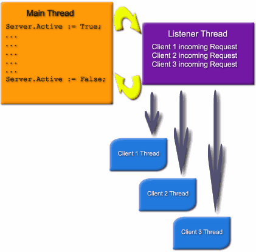

Введение в Indy
===============

::: {.date}
01.01.2007
:::

Введение в Indy

Автор: Chad Z. Hower

Домашняя страница: http://www.atozedsoftware.com

Перевод: Анатолий Подгорецкий

Вступительное слово

Я написал эту статью, когда текущей версией была Indy 8.0. Многое их
этой статьи применимо и очень полезно в следующих версиях Indy. Если вам
понравилась данная статья, и вы желаете прочитать более подробные
статьи, то обратите внимание на книгу Indy in Depth.

Indy работает в блокирующем режиме

Indy использует работу с сокетами в блокирующем режиме. Блокирующий
режим подобен чтению-записи файла. При чтении данных или записи функция
не возвращает управления до окончания операции. Отличие от работы с
файлами состоит в том, вызов может быть более долгим, поскольку
запрошенных данных еще нет, это зависит скорости, с какой работает ваша
сеть или модем.

Для примера, просто производится вызов метода, и ожидание пока не будет
возвращено управление в точку вызова. Если вызов был успешный, то
управление будет возвращено из метода, при ошибке будет возбуждено
исключение.

Блокирующий режим это не смертельно

Из-за блокирующего режима мы неоднократно были биты нашими противниками,
но блокирующий режим не является дьяволом.

Проблема появилась после портирования Winsock в Windows. В Юниксе
типично проблема решалась за счет раздвоения (похоже на много
поточность, но за счет отдельных процессов вместо потоков). Юникс
клиенты и демоны (daemons) должны были раздваиваться процессы, которые
должны выполняться и использовать блокирующий режим. Windows 3.x не мог
распараллеливаться и не поддерживал много поточность. Использование
блокирующего интерфейса замораживало пользовательский интерфейс и делало
программы не реагирующими. Поэтому к WinSock были добавлены не
блокирующие режимами, позволяя Windows 3.x с его ограничениями
использовать Winsock без блокирования основного и единственного потока
программы. Это потребовало другого программирования, Microsoft и другие
страстно поносили блокирующие режимы, что бы скрыть недостатки Windows
3.x.

Затем пришла Win32, которая смогла поддержать много поточность. Но к
этому моменту мозги уже были запудрены (то есть разработчики считали
блокирующие сокеты порождением дьявола), и уже было тяжело изменить
содеянное. По этому поношение блокирующих режимов продолжается.

В реальности в Юникс есть только блокирующие сокеты. Блокирующие сокеты
также имеют и свои преимущества, и они намного лучше, для много
поточности, безопасности и других аспектов. Некоторые расширения была
добавлены и в Юникс для не блокирующих сокетов. Тем не менее, они
работают совсем по другому, чем в Windows. Они также нестандартны и не
очень распространены. Блокирующие сокеты в Юниксе используются почти во
всех случаях, и будут и далее использоваться.

Достоинства блокирующего режима

- Проще программировать - Блокирующие режимы проще программировать. Весь пользовательский код может находиться в одном месте и выполняться в естественном, последовательном порядке.

- Проще перенос в Юникс - Поскольку Юникс использует блокирующие сокеты, переносимый код написать в данном случае проще. Indy использует этот факт для написания единого кода.

- Удобнее работать с потоками - Поскольку у блокирующих сокетов последовательность приобретена по наследственности, поэтому их очень просто использовать в потоках.

Недостатки блокирующего режима

- Пользовательский интерфейс замораживается в клиентах - Вызов блокирующего сокета не возвращает управления, пока не выполнит свою задачу. Когда такой вызов делается в главном потоке приложения, приложение не может обрабатывать пользовательские сообщения. Из-за этого пользовательский интерфейс замораживается, не обновляются окна, и другие сообщения не могут быть обработаны пока управление не будет возвращено из блокирующего сокета.

Компонент TIdAntiFreeze

В Indy имеется специальный компонент, который решает проблему
замораживания пользовательского интерфейса. Просто добавьте один
компонент TIdAntiFreeze куда ни будь в своем приложении, и вы сможете
выполнять блокирующие вызовы без замораживания пользовательского
интерфейса.

TIdAntiFreeze работает по внутреннему таймеру вне стека вызовов и
вызывает Application.ProcessMessages по окончанию таймаута. Внешние
вызовы к Indy продолжают оставаться блокирующими и поэтому работают
точно также как и без использования компонента TIdAntiFreeze.
Использование TIdAntiFreeze позволяет получить все преимущества
блокирующих сокетов, без из недостатков.

Кодовые потоки (Threading)

С блокирующими сокетами почти всегда используются кодовые потоки. Не
блокирующие сокеты также могут использовать потоки, но это требует
некоторой дополнительной обработки и их преимущества в этом случае
теряются, по сравнению с блокирующими сокетами.

Достоинства потоков

- Настройка приоритетов - Приоритеты отдельных потоков могут быть настроены. Это позволяет выполнять выделять отдельным задачам больше или меньше процессорного времени.

- Инкапсуляция - Каждое соединение может содержать некоторое подобие интерфейса с другим соединением.

- Безопасность - Каждый поток может иметь различные атрибуты безопасности.

- Несколько процессоров - дает преимущество на системах с несколькими процессорами.

- Не нужна сериализация - предоставляет полную конкурентность. Без много поточности все запросы должны быть обработаны в одном потоке. Поэтому каждая задача должна быть разбита на небольшие куски, чтобы она могла работать быстро. Пока выполняется один блок, все остальные вынуждены ожидать его окончания. По окончанию одного блока выполняется следующий и так далее. С многопоточностью каждая задача может быть запрограммирована как одно целое и операционная система распределяет время между всеми задачами.

Опрос потоков

Создание и уничтожение потоков очень интенсивно использует ресурсы. Это
особо тяжелая задача для серверов, которые имеют коротко живущие
соединения. Каждый сервер создает поток, использует его короткое время и
затем уничтожает. Это приводит к очень частому созданию и удалению
потоков. Примером этого является Веб сервер. Посылается одиночный
запрос, и возвращается простой ответ. При использовании браузера, при
просмотре какого либо Веб сайта, могут происходить сотни соединений и
отсоединений

Опрос потоков может исправить эту ситуацию. Вместо создания и
уничтожения потоков по требованию, потоки выбираются из списка
неиспользуемых, но уже созданных потоков, из пула. Когда поток уже не
нужен, он возвращается в пул, вместо его уничтожения. Потоки в пуле
помечаются как неиспользуемые и поэтому они не жрут процессорное время.
Для еще большего улучшения потоки могут динамически подстраиваться под
текущие нужды системы.

Indy поддерживает опрос потоков. Пул потоков в Indy доступен через
компонент TIdThreadMgrPool.

Множество потоков

Для сильно нагруженного сервера может потребоваться сотни или даже
тысячи потоков. Есть общее убеждение, что сотни и тысячи потоков могут
убить вашу систему. Это неверное убеждение.

В большинстве серверов потоки находятся в ожидании данных. Во время
ожидания при блокирующем вызове поток неактивен. В сервере с 500 потоков
только 50 могут быть активны в одно и тоже время.

Количество потоков, которые запущены на вашей системе, может удивить
вас. При минимальном количестве запущенных серверов и указанными
запущенными приложениями моя система имеет 333 созданных потоков, даже
при 333 потоках процессор нагружен только на 1%. Сильно нагруженный
сервер IIS (Microsoft Internet Information Server) может создать сотни и
тысячи потоков.

Потоки и глобальные секции

При нескольких потоках Вы должны обеспечить целостность данных при
доступе к ним. Это может оказаться сложным для программистов, не
работавших с потоками. Но, как правило, большинству серверов не
требуется использование глобальных данных. Большинство серверов
выполняет изолированные функции. Каждый поток выполняет свою
изолированную задачу. Глобальные секции чтения/записи это особенность
многих многопоточных приложений, но не типичны для серверов.

Методология Indy

Indy отличается от других Winsock компонент, к которым Вы привыкли. Если
вы работали с другими компонентами, то лучшим решением будет забыть как
они работают. Многие другие компоненты используют не блокирующие
(асинхронные) вызовы и работают асинхронно. Им требуется реагировать на
события, создавать машину состояния и часто выполнять циклы ожидания.

Например, с другими компонентами, когда вы вызывает соединение вы должны
или ждать возникновение события соединения или в цикле ожидать когда
свойство покажет что соединение произошло. С Indy вы можете вызвать
метод Connect, и ожидать возврата из него. Возврат будет произведен в
случае успешного соединения или возбуждения исключения в случае
проблемы. Поэтому работа с Indy очень похоже на работу с файлами. Indy
позволяет разместить весь ваш код в одном месте, вместо размазывания по
разным событиям. В дополнение, Indy очень прост и наиболее удобен при
работе с потоками.

Насколько Indy отличается

Краткий обзор

- Используются блокирующие вызовы

- Не ориентирован на события - события есть, но они используются для информационных нужд, и реально не требуются.

- Разработан для потоков - Indy разработан для потоков, тем не менее, может использоваться и без потоков.

- Последовательное программирование

Подробное рассмотрение

Indy не только использует блокирующие вызовы (синхронные) но еще и
работает так. Типичная сессия в Indy выглядит так:

with IndyClient do begin

Connect; Try

// Do your stuff here

finally Disconnect; end;

end;

С другими компонентами это выглядит так:

procedure TFormMain.TestOnClick(Sender: TComponent);

begin

with SocketComponent do begin

   Connect; try

     while not Connected do begin

     if IsError then begin

       Abort;

     end;

     Application.ProcessMessages;

     OutData := \'Data To send\';

     while length(OutData) \> 0 do begin

       Application.ProcessMessages;

     end;

   finally Disconnect; end;

end;

end;

procedure TFormMain.OnConnectError;

begin

IsError := True;

end;

procedure TFormMain.OnRead;

var

i: Integer;

begin

i := SocketComponent.Send(OutData);

OutData := Copy(OutData, i + 1, MaxInt);

end;

Многие компоненты не очень хорошо выполняют работу по изоляции
программиста от стека. Многие компоненты вместо изоляции пользователя от
сложностей стека просто оставляют его наедине с ним или предоставляют
обертку над стеком.

Особый путь Indy

Indy разработан с нуля быть многопоточным. Построение серверов и
клиентов в Indy подобно построению серверов и клиентов в Юниксе. Юникс
приложения обычно вызывают стек напрямую с минимумом или совсем без слоя
абстрагирования.

Обычно Юникс сервера имеют один или несколько слушающих процессов,
которые следят за входящими запросами клиентов. Для каждого клиента,
которого требуется обслужить, создается новый процесс. Это делает
простым программирование, каждый процесс только для одного клиента.
Каждый процесс запускается в своем собственном контексте безопасности,
который задается слушающим процессом или процессом, базирующимся на
существующих правах, идентификации или других вещах.

Indy серверы работают почти аналогичным образом. Windows в отличие от
Юникс не может хорошо размножать процессы, но зато хорошо работает с
потоками. Indy сервера создают отдельный поток для каждого соединения
клиента.

Indy сервера назначают слушающий поток, который отделен от главного
кодового потока программы. Слушающий поток слушает входящие запросы от
клиентов. Для каждого клиента, которому отвечает, создается новый поток
для обслуживания клиента. Соответствующие события затем обслуживаются в
контексте данного потока.

Обзор клиентов Indy

Indy разработан чтобы предоставить очень высокий уровень абстракции.
Запутанность и детализация TCP/IP стека скрывается от программиста.

Обычно типичная сессия клиента в Indy выглядит следующим образом:

with IndyClient do begin

Host := \'zip.pbe.com\'; // Host to call

Port := 6000; // Port to call the server on

Connect; Try

   // Do your stuff here

finally Disconnect; end;

end;

Обзор серверов Indy

Indy серверные компоненты создают слушающий поток, который изолирован от
главного кодового потока программы. Слушающий поток прослушивает
входящие запросы от клиентов. Для каждого клиента, которому отвечает,
создается новый поток для обслуживания клиента. Соответствующие события
затем обслуживаются в контексте данного потока.

{.center}

Практические примеры

Следующие примеры должны помочь вам начать работать с компонентами для
простого использования, но для того, что бы продемонстрировать примеры
сделаны как простые приложения. Некоторые проекты сделаны для
демонстрации различных ситуаций. Данные примеры также доступны для
загрузки как zip файлы.

Примечание от переводчика: ссылка на сайте не рабочая.

Пример 1 - Проверка почтового индекса

Первый проект сделан максимально простым. Поиск по почтовому индексу,
клиент запрашивает сервер какому городу и штату принадлежит указанный
индекс.

Для тех кто живет за пределами США и не знают что такое zip код, это
почтовый код, который указывает место доставки. Почтовые коды состоят из
5 цифр.

Протокол

Первый шаг в построении сервера и клиента - это разработка протокола.
Для стандартных протоколов это определяется соответствующим RFC. Для
почтового индекса протокол определяется ниже.

Большинство протоколов обмена работают в текстовом режиме. Обмен
означает, что передается команда, а в ответ состояние и возможно данные.
Протоколы не ограничиваются обменом, но все равно используется простой
текст. Протокол определения почтового индекс также текстовый. Простой
текст делает протоколы простыми для отладки и позволяет общаться
различным языкам программирования и операционным системам.

После соединения, сервер посылает приветственное сообщение, затем
принимает команду. Эта команда может быть "ZipCode x" (Где x это
почтовый индекс) или "Quit". В ответ на команду ZipCode посылается
ответ в виде одной строки с ответом или пустая строка если код не
найден. Команда Quit заставляет сервер разорвать соединение. Сервер
может принять несколько команд, прежде, чем будет послана команда Quit.

Исходный код сервера

    unit ServerMain;
     
    interface
     
    uses
      Windows, Messages, SysUtils, Classes, Graphics, Controls, Forms, Dialogs,
      IdBaseComponent, IdComponent, IdTCPServer;
     
    type
      TformMain = class(TForm)
        IdTCPServer1: TIdTCPServer;
        procedure FormCreate(Sender: TObject);
        procedure FormDestroy(Sender: TObject);
        procedure IdTCPServer1Connect(AThread: TIdPeerThread);
        procedure IdTCPServer1Execute(AThread: TIdPeerThread);
      private
        ZipCodeList: TStrings;
      public
      end;
     
    var
      formMain: TformMain;
     
    implementation
    {R *.DFM}
     
    procedure TformMain.IdTCPServer1Connect(AThread: TIdPeerThread);
    begin
      AThread.Connection.WriteLn('Indy Zip Code Server Ready.');
    end;
     
    procedure TformMain.IdTCPServer1Execute(AThread: TIdPeerThread);
    var
      sCommand: string;
    begin
      with AThread.Connection do begin
        sCommand := ReadLn;
        if SameText(sCommand, 'QUIT') then begin
          Disconnect;
        end else if SameText(Copy(sCommand, 1, 8), 'ZipCode ') then begin
          WriteLn(ZipCodeList.Values[Copy(sCommand, 9, MaxInt)]);
        end;
      end;
    end;
     
    procedure TformMain.FormCreate(Sender: TObject);
    begin
      ZipCodeList := TStringList.Create;
      ZipCodeList.LoadFromFile(ExtractFilePath(Application.EXEName) + 'ZipCodes.dat');
    end;
     
    procedure TformMain.FormDestroy(Sender: TObject);
    begin
      ZipCodeList.Free;
    end;
     
    end.

Единственные части в проекте, специфические для Indy, это компонент
IdTCPServer1, методы IdTCPServer1Connect и IdTCPServer1Execute.

На форме размещен компонент IdTCPServer1 типа TIdTCPServer. Изменены
следующие свойства:

- Active = True - После старта приложения сервер прослушивает.

- DefaultPort = 6000 - Значение порта для данного проекта. Сервер слушает запросы клиента на этом порту.

Метод IdTCPServer1Execute связан с событием OnExecute сервера. Событие
OnExecute возбуждается после того, как соединение клиента акцепцировано.
Событие OnExecute отличается от других известных вам событий. OnExecute
выполняется в контексте потока. Событие потока вызывается и ему
передается аргумент AThread, переданный в метод. Это важно, поскольку
множество событий OnExecute может выполняться в одно и тоже время. Это
сделано для того, чтобы сервер мог работать без создания нового
компонента. Есть также методы, которые могут быть перекрыты при
построении наследников.

Событие OnConnect вызывается после того, как соединение было
акцепцировано и поток для него был создан. В данном сервере это
используется для посылки приветственного сообщения клиенту. При желании
это также может быть выполнено и в событии OnExecute.

Событие OnExecute может быть возбуждено несколько раз, пока соединение
не будет разъединено или потеряно. Этим устраняется необходимость
проверять соединение, на предмет разъединения или потери в цикле внутри
события.

IdTCPServer1Execute использует две базовые функции, ReadLn и WriteLn.
ReadLn читает строку из соединения, а WriteLn посылает строку в
соединение.

sCommand := ReadLn;

Выше приведенный код принимает строку от клиента и помещает ее в
локальную строковую переменную sCommand.

    if SameText(sCommand, 'QUIT') then begin
      Disconnect;
    end else if SameText(Copy(sCommand, 1, 8), 'ZipCode ') then begin
      WriteLn(ZipCodeList.Values[Copy(sCommand, 9, MaxInt)]);
    end;

Далее sCommand проверяется на допустимые команды.

Если команда "Quit" то производится Разъединение. Никакое чтение или
запись не разрешены после разъединения. После окончания события,
слушающий поток более его не вызывает, а очищает поток и прекращает
соединение.

Если же команда "ZipCode", то параметр после команды извлекается и
просматривается таблица на предмет наличия города и штата. Город и штат
затем передаются клиенту или же передается пустая строка если нет
соответствия.

Далее происходит выход из метода. Сервер повторит вызов события снова,
как только поступит новая команда, позволяя клиенту посылать множество
команд.

Исходный код клиента

    unit ClientMain;
     
    interface
     
    uses
      Windows, Messages, SysUtils, Classes, Graphics, Controls, Forms, Dialogs,
      StdCtrls, ExtCtrls, IdAntiFreezeBase,
      IdAntiFreeze, IdBaseComponent, IdComponent, IdTCPConnection, IdTCPClient;
     
    type
      TformMain = class(TForm)
        Client: TIdTCPClient;
        IdAntiFreeze1: TIdAntiFreeze;
        Panel1: TPanel;
        Panel2: TPanel;
        memoInput: TMemo;
        lboxResults: TListBox;
        Panel3: TPanel;
        Button1: TButton;
        Button2: TButton;
        Label1: TLabel;
        procedure Button2Click(Sender: TObject);
        procedure Button1Click(Sender: TObject);
      private
      public
      end;
     
    var
      formMain: TformMain;
     
    implementation
    {R *.DFM}
     
    procedure TformMain.Button2Click(Sender: TObject);
    begin
      memoInput.Clear;
      lboxResults.Clear;
    end;
     
    procedure TformMain.Button1Click(Sender: TObject);
    var
      i: integer;
      s: string;
    begin
      butnLookup.Enabled := true; try
        lboxResults.Clear;
        with Client do begin
          Connect; try
            lboxResults.Items.Add(ReadLn);
            for i := 0 to memoInput.Lines.Count - 1 do begin
              WriteLn('ZipCode ' + memoInput.Lines[i]);
              lboxResults.Items.Add(memoInput.Lines[i]);
     
              s := ReadLn;
              if s = '' then begin
                s := '-- No entry found for this zip code.';
              end;
              lboxResults.Items.Add(s);
     
              lboxResults.Items.Add('');
            end;
            WriteLn('Quit');
          finally Disconnect; end;
        end;
      finally butnLookup.Enabled := true; end;
    end;
     
    end.

Единственные части специфические для клиентского компонента - это метод
Button1Click.

Компонент Client типа TIdTCPClient и размещен на форме. Изменены
следующие свойства:

- Host = 127.0.0.1 - Сервер находится на той же самой машине, что и клиент.

- Port = 6000 - Порт сервера

Метод Button1Click связан с событием OnClick компоненты Button1. При
нажатии кнопки вызывается этот метод. Indy часть этого метода может быть
уменьшена до следующего:

1.   Соединение с сервером (Connect;)

1.   Чтения приветствия с сервера.

1.   Для каждой строки введенной пользователем в TMemo:

1.   Посылка запроса на сервер (WriteLn(\'ZipCode \' + memoInput.Lines[i];)

1.   Чтение ответа с сервера (s := ReadLn;)

1.   Посылка команды Quit (WriteLn(\'Quit\');)

1.   Разъединение (Disconnect;)

Тестирование

Данный пример был протестирован и работает при установленном TCP/IP. Вы
может изменить его для работы через сеть с одного компьютера с другим.
Запустив сервер на другом компьютере и изменив имя или IP сервера на
клиенте.

Для тестирования проектов откомпилируйте и запустите сервер. Затем
откомпилируйте и запустите клиента. Введите почтовый индекс в мемо поле
и нажмите клавишу lookup.

Отладка

Текстовые протоколы очень просто отлаживать, поскольку они могут быть
проверены с помощью Телнет. Для этого достаточно знать порт сервера. Zip
Code Lookup Server слушает на порту 6000.

Запустите снова Zip Code Lookup Server. Затем откройте консоль
(например, окно Dos). Теперь введите:

telnet 127.0.0.1 6000 \<enter\>

Теперь вы соединились с сервером. Некоторые серверы при этом посылают
приветственное сообщение. Некоторые этого не делают. Вы не увидите
вводимых вами строк. Большинство серверов не делают эха, с целью
экономии трафика. Тем не менее, вы можете изменить настройки телнет,
установкой параметра "Echo On". В разных телнет клиентах это делается
по разному, а ряд вообще не имеют такой возможности. Теперь введите:

zipcode 37642 \<enter\>

Вы увидите ответ сервера:

CHURCH HILL, TN

Для отсоединения от сервера введите:

quit \<enter\>

Пример 2 - доступ к базе данных

Данный пример эмулирует сервер, который должен выполнять блокирующие
задачи, другие чем вызовы сокетов. Многие сервера вынуждены работать в
таких условиях. Сервера которые нуждаются в обращение к базе, вызовах
внешних процедур или расчетов часто не могут прервать эти вызовы,
поскольку это внешних вызовы или из-за сложности этого. Обращение к базе
не может быть разбито на маленькие куски и разработчик должен ожидать
окончания операции с базой. Это является особенность не только обращений
к базе данных, но и другими операциями, таким как сжатие, расчеты и
другая обработка того же рода.

Для целей демонстрации, представим, что сервер делает обращение к базе,
которое требует 5 секунд для выполнения. Для упрощения выполним это
просто с помощью паузы, используем для этого функцию Sleep(5000), вместо
реально обращения.

Данный пример также требует меньше детальности, чем предыдущий пример,
поскольку многие концепции пока еще не понятны.

Исходный код

    unit main;
     
    interface
     
    uses
      Windows, Messages, SysUtils, Classes, Graphics, Controls, Forms, Dialogs,
      IdBaseComponent, IdComponent, IdTCPServer;
     
    type
      TformMain = class(TForm)
        IdTCPServer1: TIdTCPServer;
        procedure IdTCPServer1Execute(AThread: TIdPeerThread);
      private
      public
      end;
     
    var
      formMain: TformMain;
     
    implementation
    {R *.DFM}
     
    procedure TformMain.IdTCPServer1Execute(AThread: TIdPeerThread);
    var
      i: integer;
    begin
      with AThread.Connection do begin
        WriteLn('Hello. DB Server ready.');
        i := StrToIntDef(ReadLn, 0);
        // Sleep is substituted for a long DB or other call
        Sleep(5000);
        WriteLn(IntToStr(i * 7));
        Disconnect; 
      end;
    end;
     
    end.

Поскольку событие Execute возникает в контексте потока, код обработки
может быть любой длины. Каждый клиент имеет свой собственный поток и не
блокирует других клиентов.

Тестирование

Для тестирования DB сервера, откомпилируйте и запустите его. Соединитесь
с ним с помощью Телнет на порт 6001. Сервер ответит приветственным
сообщением. Введите номер. Сервер "обработает" ваш запрос и ответит
через 5 секунд.
