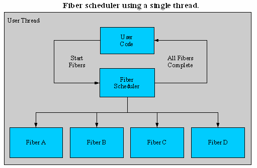
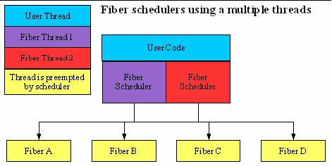
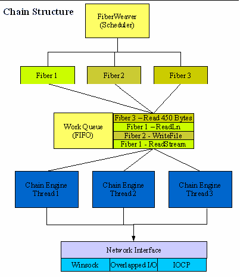

Indy in depth. Глубины Indy
============

::: {.date}
12.12.2006
:::

©Анатолий Подгорецкий, 2006, перевод на русский язык

Copyright Atozed Software

**Indy  
Taming Internet development one protocol at a time.**

Indy is Copyright (c) 1993 - 2002, Chad Z. Hower (Kudzu)  
and the Indy Pit Crew - <https://www.nevrona.com/Indy/>

 

## 19. Indy 10 обзор

Indy 10 пока находится в стадии разработки. В ближайшие несколько недель
он должен устояться. Поэтому любая приведенная здесь информация является
предметом для изменения до выпуска Indy 10. Информация приведеная здесь,
основывается на текущем коде, целях и направлении разработки.

Indy 10 содержит много новых возможностей, особенно относящихся к ядру.
Ядро Indy 10 сделано еще более абстрактным. Ядро Indy 10 содержит много
новых возможностей и улучшений в производительности.

19.1. Изменения в Indy 10

19.1.1. Разделение пакетов

Indy 10 разделена на два пакета: ядро и протоколы.

Пакет ядра содержит все части ядра, компоненты базовых клиентов и
серверов. Ядро не реализует протоколы верхнего уровня.

Пакет протоколов использует ядро и реализует протоколы верхнего уровня,
такие как POP3, SMTP и HTTP.

Это позволило команде Indy Pit Crew лучше сфокусироваться на
специфических частях. Это также может быть полезно для пользователей,
которые реализуют пользовательские протоколы и не нуждаюься в пакете
протоколов.

19.1.2. Ядро SSL

Возможности SSL в Indy 10 теперь полностью подключаемые. Перед Indy 10,
поддержка SSL была подключаемой на уровне TCP, в то время, как
протоколы, такие как HTTP, которые используют SSL для HTTPS были
вынуждены использовать Indy реализацию по умолчанию из OpenSSL.

Indy 10 продолжает поддерживать OpenSSL, тем не менее, возможности SSL в
Indy теперь полностью подключаемые к ядру и уровню протоколов, что
позволяет другие реализации.

В работе находятся SSL и другие методы шифрования от SecureBlackbox и
StreamSec.

19.1.3. Протоколы SSL

Indy 10 теперь поддерживает неявный TLS и явный TLS в следующих клиентах
и серверах:

::: {style="text-align: justify; text-indent: 0px; padding: 0px 0px 0px 0px; margin: 0px 0px 8px 24px;"}
  --- ------
  ·   POP3
  --- ------
:::

::: {style="text-align: justify; text-indent: 0px; padding: 0px 0px 0px 0px; margin: 0px 0px 8px 24px;"}
  --- ------
  ·   SMTP
  --- ------
:::

::: {style="text-align: justify; text-indent: 0px; padding: 0px 0px 0px 0px; margin: 0px 0px 8px 24px;"}
  --- -----
  ·   FTP
  --- -----
:::

::: {style="text-align: justify; text-indent: 0px; padding: 0px 0px 0px 0px; margin: 0px 0px 8px 24px;"}
  --- ------
  ·   NNTP
  --- ------
:::

Поддержка SASL кода была переработана, так что может быть использована с
POP3 и IMAP4. Indy 10 теперь поддерживает анонимный SASL, плоский SASL,
OTP (one-time-only password system) SASL, внешний SASL и Auth Login.

19.1.4. Клиент FTP

Клиент FTP был расширен следующим образом:

::: {style="text-align: justify; text-indent: 0px; padding: 0px 0px 0px 0px; margin: 0px 0px 8px 24px;"}
  --- --------------------------------------------------------------------------------------------------------------------------------------------------
  ·   Теперь поддержаны команды MLST и MLSD. Поддерживается стандартный формат FTP для списока директорий, который может быть легко разобран на части.
  --- --------------------------------------------------------------------------------------------------------------------------------------------------
:::

::: {style="text-align: justify; text-indent: 0px; padding: 0px 0px 0px 0px; margin: 0px 0px 8px 24px;"}
  --- ----------------------------------------------------------------------------------------------------------------------------------------------------------------------------------------------------------------------
  ·   Добавлена специальная комбинированная команда для многоблочной передачи. Примечание: это требует, чтобы сервер поддерживал команду COMB, такой как GlobalScape Secure FTP Server или серверный компонент из Indy 10.
  --- ----------------------------------------------------------------------------------------------------------------------------------------------------------------------------------------------------------------------
:::

::: {style="text-align: justify; text-indent: 0px; padding: 0px 0px 0px 0px; margin: 0px 0px 8px 24px;"}
  --- ---------------------------------------------------------------------------------
  ·   Добавлена команда XCRC для получения CRC файла. Замечание о поддержке см. выше.
  --- ---------------------------------------------------------------------------------
:::

::: {style="text-align: justify; text-indent: 0px; padding: 0px 0px 0px 0px; margin: 0px 0px 8px 24px;"}
  --- --------------------------------------------------------------------------------
  ·   Клиент теперь поддерживает команду MDTM для получение даты последней модифиции
  --- --------------------------------------------------------------------------------
:::

::: {style="text-align: justify; text-indent: 0px; padding: 0px 0px 0px 0px; margin: 0px 0px 8px 24px;"}
  --- --------------------------------------------------------------------------------------------
  ·   Калькулятор OTP (One-Time-Only password) теперь встроен и OTP детектируется автоматически.
  --- --------------------------------------------------------------------------------------------
:::

::: {style="text-align: justify; text-indent: 0px; padding: 0px 0px 0px 0px; margin: 0px 0px 8px 24px;"}
  --- --------------------------------------------------------------------------------------------------------------------------------------------------------------------------------------------------------------------------------------------------------------------------------------
  ·   Теперь поддержана команда FTPX или передача с сайта на сайте (когда файл передается между двумя серверами). Примечание: команда FTPX применима, только если сервер поддерживает ее (многие администраторы и разработчики теперь запрещают эту возможность по причинам безопасности).
  --- --------------------------------------------------------------------------------------------------------------------------------------------------------------------------------------------------------------------------------------------------------------------------------------
:::

::: {style="text-align: justify; text-indent: 0px; padding: 0px 0px 0px 0px; margin: 0px 0px 8px 24px;"}
  --- -------------------------------------------------
  ·   Добавлены специфические для FTP расширения IP6.
  --- -------------------------------------------------
:::

19.1.5. Сервер FTP

FTP теперь поддерживает:

::: {style="text-align: justify; text-indent: 0px; padding: 0px 0px 0px 0px; margin: 0px 0px 8px 24px;"}
  --- ---------------------------------------------------------------------------------------
  ·   Команды MFMT и MFF. (http://www.trevezel.com/downloads/draft-somers-ftp-mfxx-00.html)
  --- ---------------------------------------------------------------------------------------
:::

::: {style="text-align: justify; text-indent: 0px; padding: 0px 0px 0px 0px; margin: 0px 0px 8px 24px;"}
  --- -------------------------------------------------------------------------------------
  ·   Команды XCRC и COMB для поддержки режима многоблочной передачи файлов Cute FTP Pro.
  --- -------------------------------------------------------------------------------------
:::

::: {style="text-align: justify; text-indent: 0px; padding: 0px 0px 0px 0px; margin: 0px 0px 8px 24px;"}
  --- ----------------------------------------------------------------------------------------------
  ·   Поддержаны команды для MD5 и MMD5 (http://ietfreport.isoc.org/ids/draft-twine-ftpmd5-00.txt)
  --- ----------------------------------------------------------------------------------------------
:::

::: {style="text-align: justify; text-indent: 0px; padding: 0px 0px 0px 0px; margin: 0px 0px 8px 24px;"}
  --- ------------------------------------------------------------------------------------------------------------------------------------------
  ·   Поддержаны некоторые ключи Unix, которые относятся к перечислению директорий,  это включает ключ (-R) для получения рекурсивного списка.
  --- ------------------------------------------------------------------------------------------------------------------------------------------
:::

::: {style="text-align: justify; text-indent: 0px; padding: 0px 0px 0px 0px; margin: 0px 0px 8px 24px;"}
  --- ----------------------------------------------------------------------------------------------
  ·   Поддержан формат Easily Parsed List файлов на сервере. (http://cr.yp.to/ftp/list/eplf.html).
  --- ----------------------------------------------------------------------------------------------
:::

::: {style="text-align: justify; text-indent: 0px; padding: 0px 0px 0px 0px; margin: 0px 0px 8px 24px;"}
  --- ------------------------------------------------------------------------
  ·   Добавлен OTP калькулятор, который может использоваться на FTP сервере.
  --- ------------------------------------------------------------------------
:::

::: {style="text-align: justify; text-indent: 0px; padding: 0px 0px 0px 0px; margin: 0px 0px 8px 24px;"}
  --- -------------------------------------------------------------------------------------------------------
  ·   Компонент виртуальной системы может теперь быть использован для более легкого построения FTP сервера.
  --- -------------------------------------------------------------------------------------------------------
:::

::: {style="text-align: justify; text-indent: 0px; padding: 0px 0px 0px 0px; margin: 0px 0px 8px 24px;"}
  --- -------------------------------------------------
  ·   Добавлены специфические для FTP расширения IP6.
  --- -------------------------------------------------
:::

Добавлена возможность запрещения команды FTPX. Это сделано для
предотвращения нарушений защиты с использованием команд Port и PASV,
причины описаны здесь:

::: {style="text-align: justify; text-indent: 0px; padding: 0px 0px 0px 0px; margin: 0px 0px 4px 24px;"}
  --- ---------------------------------------------------------
  ·   https://www.cert.org/tech\_tips/ftp\_port\_attacks.html
  --- ---------------------------------------------------------
:::

::: {style="text-align: justify; text-indent: 0px; padding: 0px 0px 0px 0px; margin: 0px 0px 4px 24px;"}
  --- --------------------------------------
  ·   https://www.kb.cert.org/vuls/id/2558
  --- --------------------------------------
:::

::: {style="text-align: justify; text-indent: 0px; padding: 0px 0px 0px 0px; margin: 0px 0px 4px 24px;"}
  --- -------------------------------------------------
  ·   https://www.cert.org/advisories/CA-1997-27.html
  --- -------------------------------------------------
:::

::: {style="text-align: justify; text-indent: 0px; padding: 0px 0px 0px 0px; margin: 0px 0px 4px 24px;"}
  --- -----------------------------------------------------------
  ·   https://www.geocities.com/SiliconValley/1947/Ftpbounc.htm
  --- -----------------------------------------------------------
:::

::: {style="text-align: justify; text-indent: 0px; padding: 0px 0px 0px 0px; margin: 0px 0px 8px 24px;"}
  --- ------------------------------------
  ·   https://cr.yp.to/ftp/security.html
  --- ------------------------------------
:::

19.1.6. Разбор списка файлов FTP

Indy 10 содержит плагин для разбора списка файлов, который
интерпретаторы почти для любых FTP серверов и даже возможно уже не
функционирующих.

Если вдруг встретится не поддерживаемая система, то можно подключить
пользовательский обработчик.

Поддержанные FTP сервера:

::: {style="text-align: justify; text-indent: 0px; padding: 0px 0px 0px 0px; margin: 0px 0px 8px 24px;"}
  --- -------------------------------
  ·   Bull GCOS 7 или Bull DPS 7000
  --- -------------------------------
:::

::: {style="text-align: justify; text-indent: 0px; padding: 0px 0px 0px 0px; margin: 0px 0px 8px 24px;"}
  --- -------------------------------------
  ·   Bull GCOS 8 или Bull DPS 9000/TA200
  --- -------------------------------------
:::

::: {style="text-align: justify; text-indent: 0px; padding: 0px 0px 0px 0px; margin: 0px 0px 8px 24px;"}
  --- -----------
  ·   Cisco IOS
  --- -----------
:::

::: {style="text-align: justify; text-indent: 0px; padding: 0px 0px 0px 0px; margin: 0px 0px 8px 24px;"}
  --- ---------------------
  ·   Distinct FTP Server
  --- ---------------------
:::

::: {style="text-align: justify; text-indent: 0px; padding: 0px 0px 0px 0px; margin: 0px 0px 8px 24px;"}
  --- ----------------------------------
  ·   EPLF (Easily Parsed List Format)
  --- ----------------------------------
:::

::: {style="text-align: justify; text-indent: 0px; padding: 0px 0px 0px 0px; margin: 0px 0px 8px 24px;"}
  --- ------------------------------------------------
  ·   HellSoft FTP Server for Novell Netware 3 and 4
  --- ------------------------------------------------
:::

::: {style="text-align: justify; text-indent: 0px; padding: 0px 0px 0px 0px; margin: 0px 0px 8px 24px;"}
  --- --------------------------------------------
  ·   HP 3000 or MPE/iX, включая HP 3000 с Posix
  --- --------------------------------------------
:::

::: {style="text-align: justify; text-indent: 0px; padding: 0px 0px 0px 0px; margin: 0px 0px 8px 24px;"}
  --- --------------------
  ·   IBM AS/400, OS/400
  --- --------------------
:::

::: {style="text-align: justify; text-indent: 0px; padding: 0px 0px 0px 0px; margin: 0px 0px 8px 24px;"}
  --- -----------------------
  ·   IBM MVS, OS/390, z/OS
  --- -----------------------
:::

::: {style="text-align: justify; text-indent: 0px; padding: 0px 0px 0px 0px; margin: 0px 0px 8px 24px;"}
  --- ----------
  ·   IBM OS/2
  --- ----------
:::

::: {style="text-align: justify; text-indent: 0px; padding: 0px 0px 0px 0px; margin: 0px 0px 8px 24px;"}
  --- --------------
  ·   IBM VM, z/VM
  --- --------------
:::

::: {style="text-align: justify; text-indent: 0px; padding: 0px 0px 0px 0px; margin: 0px 0px 8px 24px;"}
  --- ---------
  ·   IBM VSE
  --- ---------
:::

::: {style="text-align: justify; text-indent: 0px; padding: 0px 0px 0px 0px; margin: 0px 0px 8px 24px;"}
  --- -------------
  ·   KA9Q or NOS
  --- -------------
:::

::: {style="text-align: justify; text-indent: 0px; padding: 0px 0px 0px 0px; margin: 0px 0px 8px 24px;"}
  --- ----------------
  ·   Microware OS-9
  --- ----------------
:::

::: {style="text-align: justify; text-indent: 0px; padding: 0px 0px 0px 0px; margin: 0px 0px 8px 24px;"}
  --- -----------------------------------------------------
  ·   Music (Multi-User System for Interactive Computing)
  --- -----------------------------------------------------
:::

::: {style="text-align: justify; text-indent: 0px; padding: 0px 0px 0px 0px; margin: 0px 0px 8px 24px;"}
  --- ------------------------------------
  ·   NCSA FTP Server for MS-DOS (CUTCP)
  --- ------------------------------------
:::

::: {style="text-align: justify; text-indent: 0px; padding: 0px 0px 0px 0px; margin: 0px 0px 8px 24px;"}
  --- ----------------
  ·   Novell Netware
  --- ----------------
:::

::: {style="text-align: justify; text-indent: 0px; padding: 0px 0px 0px 0px; margin: 0px 0px 8px 24px;"}
  --- ----------------------------------------
  ·   Novell Netware Print Services for UNIX
  --- ----------------------------------------
:::

::: {style="text-align: justify; text-indent: 0px; padding: 0px 0px 0px 0px; margin: 0px 0px 8px 24px;"}
  --- --------
  ·   TOPS20
  --- --------
:::

::: {style="text-align: justify; text-indent: 0px; padding: 0px 0px 0px 0px; margin: 0px 0px 8px 24px;"}
  --- ---------
  ·   UniTree
  --- ---------
:::

::: {style="text-align: justify; text-indent: 0px; padding: 0px 0px 0px 0px; margin: 0px 0px 8px 24px;"}
  --- -----------------------------------------------
  ·   VMS or VMS (including Multinet, MadGoat, UCX)
  --- -----------------------------------------------
:::

::: {style="text-align: justify; text-indent: 0px; padding: 0px 0px 0px 0px; margin: 0px 0px 8px 24px;"}
  --- --------------------
  ·   Wind River VxWorks
  --- --------------------
:::

::: {style="text-align: justify; text-indent: 0px; padding: 0px 0px 0px 0px; margin: 0px 0px 8px 24px;"}
  --- --------------------
  ·   WinQVT/Net 3.98.15
  --- --------------------
:::

::: {style="text-align: justify; text-indent: 0px; padding: 0px 0px 0px 0px; margin: 0px 0px 8px 24px;"}
  --- -----------------
  ·   Xecom MicroRTOS
  --- -----------------
:::

Примечание от переводчика: они льстят себе, на самом деле список
форматов примерно раз в восемь шире.

19.1.7. Прочие

Имеются и другие изменения и улучшения в Indy 10, но не ограничены:

::: {style="text-align: justify; text-indent: 0px; padding: 0px 0px 0px 0px; margin: 0px 0px 8px 24px;"}
  --- -----------------------------------------------------------------------------------------------------------------------------
  ·   Были добавлены серверные перехватчики, позволяющие вам делать логи на сервере и они работают подобно перехватчикам клиента.
  --- -----------------------------------------------------------------------------------------------------------------------------
:::

::: {style="text-align: justify; text-indent: 0px; padding: 0px 0px 0px 0px; margin: 0px 0px 8px 24px;"}
  --- -----------------------------------------------
  ·   Добавлены сервера и клиенты Systat UDP и TCP.
  --- -----------------------------------------------
:::

::: {style="text-align: justify; text-indent: 0px; padding: 0px 0px 0px 0px; margin: 0px 0px 8px 24px;"}
  --- ---------------------------------
  ·   Добавлен компонент DNS сервера.
  --- ---------------------------------
:::

::: {style="text-align: justify; text-indent: 0px; padding: 0px 0px 0px 0px; margin: 0px 0px 8px 24px;"}
  --- ---------------------------------------------------
  ·   Добавлена поддержка HTTP соединения через прокси.
  --- ---------------------------------------------------
:::

::: {style="text-align: justify; text-indent: 0px; padding: 0px 0px 0px 0px; margin: 0px 0px 8px 24px;"}
  --- --------------------------------------------------------------------------
  ·   Добавлен класс TIdIPAddrMon для мониторинга всех IP адресов и адаптеров.
  --- --------------------------------------------------------------------------
:::

::: {style="text-align: justify; text-indent: 0px; padding: 0px 0px 0px 0px; margin: 0px 0px 8px 24px;"}
  --- --------------------------
  ·   Добавлена поддержка IP6.
  --- --------------------------
:::

::: {style="text-align: justify; text-indent: 0px; padding: 0px 0px 0px 0px; margin: 0px 0px 8px 24px;"}
  --- ---------------------------------------------------------------------------------------------------------------------------------------------------------------------------------------
  ·   Реализована система One-Time-Only password system, как в виде OTP калькулятора для клиентов, так и компонента для кправления пользователями. Имеется поддержка хэшей MD4, MD5 и SHA1.
  --- ---------------------------------------------------------------------------------------------------------------------------------------------------------------------------------------
:::

19.2. Перестройка ядра

Ядро Indy 10 претерпело серьезные структурные изменения. Это конечно
приведет к неработоспособно некоторого пользовательского кода, но
изменения были сделаны так, чтобы быть как можно более совместимыми c
протоколами и уровенем приложений. Иногда кажется, что команда Indy Pit
Crew не заботится о конечных пользователях при внесении изменений . Тем
не менее, это не так. Каждое изменение интерфейса оценивалось и
взвешивалтсь доводы за и против. Изменения, которые сделаны, были
разработаны так, чтобы позволить простое преобразование существующего
исходного кода с минимальными усилиями. Команда Indy Pit Crew использует
Indy в частных и коммерческих разработках, так что каждое изменение
прочувствовала на себе.

Команда Indy Team верит, что прогресс не возможен без жертвоприношений.
Благодаря небольшим изменениям в интерфейсах, было достигнуто
значительное улучшение Indy. Без этих изменений, мусор бы только
накапливался и будущие улучшения были бы проблематичны. Переход от
Winshoes к Indy 8 и затем, Indy 8 к Indy 9 увеличил уровень абстракции.
Это относится и к Indy 10.

Одним из первичных принципов Indy является убеждение, что проще
программировать с помощью блокирующих режимов. Это позволяет легче
разрабатывать и пользовательский код не страдает от сериалиазации. Цель
разработки Indy это простота использования и быстрота, достаточная для
95% конечных пользователей.

Тем не менее, в больших приложениях это приводит к сильному переключению
контекста и накоплению накладных расходов. Данные ограничения появляются
только в больших проектах при работе свыше 2 000 конкурентных потоков, в
хорошо спроектированных приложениях. В большинстве приложений
ограничения в пользовательском коде возникнут раньше, чем в Indy.

Обычно для обслуживания оставшихся 5% пользователей просто написанный
код должен быть заменен на сложный и тяжелый для сопровождения код,
такой как ввод-вывод внахлест (overlapped IO), порты завершения
ввода-вывода (I/O completion ports) или сильно раздробленный код, для
работы с неблокирующими сокетами в потоках. Indy 10 сохраняет простоту
использования модели блокирующих сокетов, достигая производительности
внутри. Indy 10 делает это используя расширенные сетевые интерфейсы и
эффективно транслируя это в дружественную пользователю модель
блокирующих сокетов. Этим Indy 10 обеспечивает обслуживание порядка
99.9% потребностей программистов, кроме некоторых самых  необычных
ситуаций.

Indy 10 достигает этого разными путями, но волокна (fibers) являются
ключевым камнем данного достижения. Волокна очень похожи на потоки, но
более гибки и имеет меньшую нагрузку, чем потоки, если использовать их
должным образом.

19.2.1. Переработка обработчиков ввода/вывода (IOHandler)

Для получения улучшения производительности в Indy 10 были переработаны
обработчики ввода/вывода и им была придана более весомая роль. Ранее
роль обработчиков ввода/вывода состояла только в очень базовой обработке
ввода/вывод и относилась к следующим функциям:

::: {style="text-align: justify; text-indent: 0px; padding: 0px 0px 0px 0px; margin: 0px 0px 8px 24px;"}
  --- ----------------
  ·   Open (Connect)
  --- ----------------
:::

::: {style="text-align: justify; text-indent: 0px; padding: 0px 0px 0px 0px; margin: 0px 0px 8px 24px;"}
  --- --------------------
  ·   Close (Disconnect)
  --- --------------------
:::

::: {style="text-align: justify; text-indent: 0px; padding: 0px 0px 0px 0px; margin: 0px 0px 8px 24px;"}
  --- ---------------------
  ·   Чтение сырых данных
  --- ---------------------
:::

::: {style="text-align: justify; text-indent: 0px; padding: 0px 0px 0px 0px; margin: 0px 0px 8px 24px;"}
  --- ---------------------
  ·   Запись сырых данных
  --- ---------------------
:::

::: {style="text-align: justify; text-indent: 0px; padding: 0px 0px 0px 0px; margin: 0px 0px 8px 24px;"}
  --- -------------------------------
  ·   Проверка состояния соединения
  --- -------------------------------
:::

Данная роль позволяла альтернативным обработчикам ввода/вывода создавать
свой собственный ввод/вывод из других источников, а не только из
сокетов. Даже сокет по умолчанию был реализован с помощью обработчика
ввода/вывода по умолчанию.

Поскольку функциональность была минимальной, реализация обработчика
ввода/вывода была очень простой. Это также часто приводило к тому что
обработчики ввода/вывода вынуждены были работать не самыми эффективными
методами. Например, обработчик ввода/вывода мог принимать данные из
локального файла, но это не имело знания, поскольку был только один
метод записи для всех данных. Даже если обработчик ввода/вывода имел
возможность по быстрому чтению из файла, он не мог использовать это.

Обработчики ввода/вывода в Indy 10 реализуют не только низкоуровневые
методы, но и также высокоуровневые методы. Такие высокоуровневые методы
были ранее реализованы в классе TIdTCPConnection.

Как и ранее обработчики ввода/вывода могут быть созданы только
посредством реализации низкоуровневых методов. Базовый обработчик
ввода/вывода содержит реализации по умолчанию для методов высокого
уровня, которые используют низкоуровневые методы. Тем не менее, каждый
обработчик ввода/вывода может перекрыть дополнительно высокоуровневые
методы для предоставления оптимизированной реализации специфичной для
данного обработчика ввода/вывода.

19.2.2. Сетевые интерфейсы

Indy 9 имела только один сетевой интерфейс. В Windows этот интерфейс был
Winsock и на Linux стек. Indy 10 еще продолжает поддерживать этот
интерфейс, но имеет также и более эффективные интерфейсы в Windows. В
данное время никаких других интерфейсов в Linux не реализовано, но
возможно они появятся в будущем. Это не так важно в Linux, поскольку у
него своя сетевая семантика.

Некоторые из дополнительных интерфейсов не доступны во всех версиях
Windows и должны использоваться только в серверных реализациях или в
системах с высоким количеством клиентских соединений. Клиенты не
нуждаются в этих продвинутых возможностях.

Дополнительные интерфейсы следующие:

::: {style="text-align: justify; text-indent: 0px; padding: 0px 0px 0px 0px; margin: 0px 0px 8px 24px;"}
  --- ----------------------------------------
  ·   Перекрытый ввод/вывод (Overlapped I/O)
  --- ----------------------------------------
:::

::: {style="text-align: justify; text-indent: 0px; padding: 0px 0px 0px 0px; margin: 0px 0px 8px 24px;"}
  --- ------------------------------------------------------
  ·   Порты завершения ввода/вывода (I/O Completion Ports)
  --- ------------------------------------------------------
:::

Обычно использование перекрытого ввода/вывода и особенно портов
завершения, очень сложно  и требует написания заумного кода. Indy 10,
как всегда позаботится обо всех деталях и предоставит разработчику
дружественный интерфейс.

19.2.3. Волокна (Fibers)

В дополнение к расширению поддержке потоков, Indy 10 содержит и
поддержку волокна. Что такое волокно? Если коротко, то это "поток",
который контролируется кодом, а не операционной системой. В
действительности, поток может быть трактоваться, как продвинутое
волокно. Волокна подобны Unix пользовательским потокам. (От корректора:
Вот и до слово блудились... Поток или волокно? Что там на у них? Сейчас
уже вроде есть потоки и процессы...)

Поток - это базовая единица, которой операционная система выделяет
время. Поток содержит свой собственный стек, определенные регистры
процессора и контекст потока. Потоки автоматически выполняются по
очередно автоматически обслуживаются операционной системой.

В целом волокна не имеют преимуществ перед хорошо спроектированным
многопоточным приложением. Но волокна совмещенные с интеллектуальным
планировщиком, осведомленном об особенностях их реализации, могут
значительно увеличить производительность.

Множество волокон могут быть запущены в рамках одного потока. Одиночное
волокно может быть запущено во многих потоках, но только в одном из них
в каждый момент времени. Вы может запускать множество волокон внутри.
Код выполняющий это достаточно сложный, но Indy все сделает за вас. Все
компоненты Indy - клиенты и серверы поддерживают волокна, наиболее
прозрачным для вас путем.

При использовании волокон, Indy так преобразовывает сложность
низкоуровневых интерфейсов в дружественные пользователю интерфейсы.

Пока волокна могут быть применены только в Windows.

19.2.4. Планировщики (Schedulers)

Indy планирует волокна для выполнения в одином или более потоков.
Волокна помещают данные в рабочую очередь и ожидают. Когда волокно
заканчивает обрабатывать свои данные, планировщик помещает волокно в
список доступных.

Планировщики операционной системы планирует потоки хитроумным образом,
но они обладают ограниченной информацией о потоках, так как каждый поток
одинаков среди всех задач системы. Планировщик операционной системы
может планировать только на основе состояния ожидания и приоритета
потока.

Планировщик волокон Indy (fiber scheduler) использует информацию
специфичную для задачи, для определения нужд планировщика, приоритетов и
состояний ожидания. Благодаря этому Indy в состоянии сильно уменьшить
количество контекстных переключений для выполнения одной и той же
работы. Это способствует увеличению производительности.

Контекст переключения - это когда один поток останавливается, а другой
запускается. Для выполнения этого Операционная Система должна прерывать
выполнение потока и сохранять контекст потока, путем сохранения
некоторых регистров процессора в памяти. Затем должна восстановить
другой поток, загрузив ранее сохраненные регистры и передать ему
управление.

Планировщики потоков должны балансировать необходимость переключения и
необходимость выделить каждому потоку достаточно процессорного времени.
Частое переключение увеличивает накладные расходы на выполнение, что
иногда даже превышает достигнутое увеличение производительности. Редкое
переключение ведет в длятельному ожиданию потоками, замедленной реакции,
потому что, потоки не получают достаточно процессорного времени.

Для управления этим, Операционная Система определяет квант или
максимальное время, которое требуется процессору на переключение. В
большинстве случаев поток отдает управление раньше, чем наступит это
время, потому что входит в состояние ожидания. Состояния ожидания
случается явно или в основном неявно путем вызова операционной системы
или вызова операции ввода/вывода, которая не может быть незамедлительно
закончена. Когда случается такой вызов, Операционная Система
воспринимает это состояние и переключается на другой поток. Если поток
ожидает завершения ввода/вывода или некоторых других блокирующих
операций, то он переводится в состояние ожидания и не подлежит
планированию, пока запрошенная операция не будет закончена, или пока не
наступит таймаут.

Планировщик Indy работает подобным образом, но определяет состояния
ожидания на более высоком уровне, на основе более обширной информации.
Состояние волокна может быть определено наперед, без реального
переключения контекста в него и перехода в состояние ожидания. Indy
также разделяет работу между волокнами и драйверами цепочек (chain
engines), которые обеспечивают низкоуровневую работу.

Разделение работы позволяет использовать более эффективные сетевые
интерфейсы, такие как порты завершения. Порты завершения ввода/вывода
более эффективны, поскольку они работают на уровне близком к аппаратному
интерфейсу. Вызовы Winsock и другие вызовы, которые далеки от
аппаратного интерфейса должны общаться с ядром для выполнения
действительных вызовов к аппаратному интерфейсу. Вызовы, которые
общаются с ядром, должны делать переключения контекста туда и обратно.
Так-что каждый вызов Winsock часто приводит к излишнему переключению
контекста, только для выполнения своих функций.

Планировщики могут использовать единственный поток, множество потоков,
потоки по требованию и даже пул потоков.

{.center}

{.center}

19.2.5. Рабочие очереди

Рабочие очереди организованы по принципу первый на входе - первый на
выходе (FIFO),  и хранят операции (work items), запрошенные волокнами.
(Work Items скорее всего абстракция для операции ввода-вывода, так как
именно они блокируются) Большинство данной функциональности полностью
прозрачно для среднего разработчика, так как скрыто внутри Indy.

19.2.6. Цепочки (судя по всему внутренняя абстракция)

Системные рабочие очереди, планировщики и драйверы цепочек в Indy
относятся к цепочкам. Несмотря на то, что цепочки используются в Indy,
они не ограничены внутренним использованием в Indy и могут также
использоваться в пользовательском приложении.

При использовании цепочки, IOHandler основаный на ней, помещает 
операцию в очередь. (От корректора: Какого хрена здесь IOHandler? Мы
вроде о волокнах говорим.)

Затем, волокно приостанавливаются пока операция не обработана. Волокно
может ничего не делать, пока не будет завершена операция. Каждый метод
обработчика ввода/вывода выполняет одну или несколько операций. Для
получения наилучшей производительности, каждый метод должен быть
специализирован, настолько, насколько это возможно.

Планировщик обслуживает волокна и ожидает окончания их работы.

Драйвер цепочек запрашивает рабочую очередь и взаимодействует с
планировщиком.

{.center}

19.2.7. Драйверы цепочек (chain engines)

Драйверы цепочек - это самый низкий уровень системы цепочек. Драйвер
цепочек выполняет весь действительный ввод и вывод. Драйвер цепочек
может содержать один или несколько потоков.

Работа драйвера цепочек состоит в извлечении операции из рабочей очереди
и ee завершения. До завершения каждой операции, драйвер цепочки
оповещает планировщик и планировщик определяет, какое волокно будет
обрабатываться следующим. Драйвер цепочки затем перемещается к следующей
операции в рабочей очереди.

Если больше нет значений в рабочей очереди, то драйвер цепочки переходит
в пассивное состояние.

Множество драйверов цепочек может быть реализовано для порта завершения
ввода/вывода, Winsock, перекрытого ввода/вывода и других.

19.2.8. Контексты (Contexts)

В серверах Indy 9, данные специфичные для соединения были частью класса
потока. Они были доступны, или через свойство thread.data, или
наследованием от класса потока с добавлением новых полей или свойств для
хранения. Это работало, потому что каждое соединение имело только один
поток, который был специально назначен для данного соединения.

В Indy 10 сервера реализованы иначе, чем в Indy 9. потоки не
ассоциируются с единственным соединением. В действительности даже не
обязательно используются потоки, это могут быть волокна. Поэтому,
предыдущие методы хранения данных в потоках более не приемлемы.

Indy 10 использует новую концепцию, названную контекстами. Контексты
хранят специфические данные соединения и они обслуживаются и
отслеживаются Indy.

 
