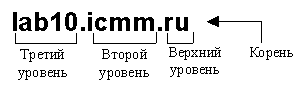
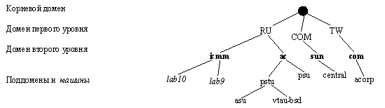
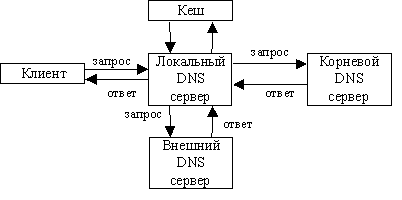
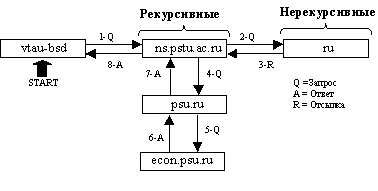
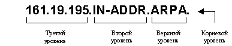
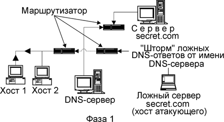
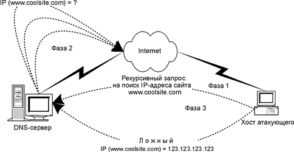
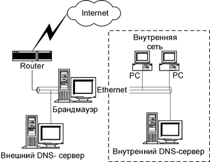

Доменная система имен
=====================

**Введение**

Доменная система имен (Domain Name System, DNS) — это распределенная база данных, которая содержит информацию о компьютерах (хостах), включенных в сеть Internet. Чаще всего информация включает имя машины, IP-адрес и данные для маршрутизации почты.

Как известно, для обращения к хостам в сети Internet используются 32-разрядные IP-адреса, однозначно идентифицирующие любой сетевой компьютер в этой сети. Однако для пользователей применение IP-адресов при обращении к хостам не удобно. Поэтому была создана система преобразования имен, позволяющая компьютеру в случае отсутствия у него информации о соответствии имен и IP-адресов получить необходимые сведения от DNS-сервера, ip-адрескоторого хранится в настройках подключения к Internet.

Т.о. основная задача DNS — преобразование имен компьютеров в IP-адреса и наоборот.

Для реализации системы DNS был создан специальный сетевой протокол DNS. В сети имеются специальные выделенные информационно-поисковые серверы - DNS-серверы.

**Историческая справка**

Ранее, таблицы соответствия имен и адресов хранились в одном текстовом файле, который велся в централизованно и рассылался на все машины сети ARPANET. Никакой иерархии в именах машин не было, и процедура присваивания имени компьютеру предполагала проверку уникальности желательного имени в масштабах страны. Объем изменений был огромен и поглощал большую часть пропускной способности ARPANET. Поэтому в содержимом этого файла часто не отображалось реальное состояние сети. Вскоре стало ясно, что статическая таблица машин, которой хватало для небольшой сети, явно неадекватна потребностям большой и растущей сети ARPANET. Система доменных имен решает проблемы, с которыми не справилась такая таблица, используя две концепции: иерархию имен машин и распределение ответственности.

Систему доменных имен формально описал Пол Мокапетрис (Paul Mocka-petris) в RFC882 и 883 (1983 г.). В 1987 г. ее откорректировали (RFC1034 и 1035), а в 1990 г. расширили (RFC1101 и 1183). Пол, кроме того, написал первую нe-UNIX-версию.

Работа по переносу DNS в UNIX была начата в 1984 г. четырьмя старшекурсниками университета в Беркли: Дугласом Терри (Douglas Terry), Марком Пойнтером (Mark Painter), Дэвидом Ригглом (David Riggle) и Сонг Ньян Чжоу (Songnian Zhou). Эстафету подхватил Ральф Кэмпбелл (Ralph Camp-bell) из Computer Systems Research Group, который начал "склеивать" доменную систему имен в BSD-UNIX. В 1985 г. Кевин Данлэп (Kevin Dunlap), инженер DEC, временно работавший в Беркли, принял этот проект в свои руки и создал систему BIND (Berkeley Internet Name Domain — систему доменных Internet-имен реализации Беркли). Майк Кареле (Mike Karels) и Пол Викси (Paul Vixie) сопровождали эту систему в течение ряда лет. Пол продолжает вести ее и сейчас, пользуясь помощью участников телеконференции isc.org и членов списка рассылки bind-workers.

**1\. Пространство имен DNS**

Пример имени хоста в доменной нотации имеет вид, представленный на рис.1.

:::{.center}
  
Рис. 1. Компоненты имени домена
:::

Пространство имен DNS имеет вид дерева *доменов* с полномочиями, возрастающими по мере приближения к корню дерева.

По историческим причинам существует два вида имен доменов верхнего уровня. В США домены верхнего уровня отражают организационно-политическую структуру и, как правило, имеют трехбуквенные имена. Для доменов вне США используются двухбуквенные коды стран ISO. Оба эти принципа сосуществуют в одном глобальном пространстве имен. Имена доменов верхнего уровня в США на текущий момент времени перечислены в табл. 1.

Таблица 1.

Домен|Для кого предназначен
-----|------------------------
СОМ  |Коммерческие организации
NET  |Поставщики сетевых услуг
EDU  |Учебные заведения
ORG  |Некоммерческие организации
GOV  |Правительственные учреждения
INT  |Международные организации
MIL  |Военные учреждения
ARPA |Пережиток прошлого

В большинстве других стран организационная структура строится на базе доменов второго уровня.

Некоторые коды стран приведены в табл. 2.

Таблица 2.

Код|Страна
---|-----------
AU |Австралия
FR |Франция
MX |Мексика
СА |Канада
JP |Япония
HU |Венгрия
DK |Дания
SE |Швеция
UA |Украина
DE |Германия
НК |Гонконг
RU |Россия
FI |Финляндия
СН |Швейцария

В именах доменов не учитывается регистр. В контексте DNS Perm идентично perm и PERM. Реализации DNS должны игнорировать регистр при сравнениях, но обязаны распространять его, если он указан.

Internet-машина обычно входит в один домен, а может входить в несколько или ни в один. Полностью определенное имя формируется путем прибавления к имени машины имени домена. Например, lab10.icmm.ru — полностью определенное имя машины lab10, находящейся в ИМСС. Другие организации могут использовать имя lab10, не испрашивая на то разрешения, потому что полностью определенные имена их машин все равно будут другими.

Структура дерева имен показана на рис. 2.

:::{.center}
  
Рис. 2. Фрагмент пространства имен DNS
:::

Доменами второго уровня централизованно управляет Информационный центр сети (Network Information Center, NIC).

**Выбор имени домена**

На некоторые имена наложено табу; это, в частности, относится к уже взятым именам, ключевому слову AT, комбинациям имен доменов верхнего уровня (например, edu.com) и повторениям имен (например, х.х.соm) (Например, xinet.xinet.com — допустимое имя, но имя домена — просто xinet.com, а в нем есть машина xinet.).

RFC1032 рекомендует, чтобы имена доменов второго уровня имели в длину не более 12 символов, несмотря на то, что DNS допускает использовать в каждой составляющей до 64 символов.

**Создание собственных поддоменов**

Процедура создания поддомена аналогична процедуре создания домена второго уровня — за исключением того, что центральный орган теперь локален (точнее, находится в пределах Вашей организации). Этот процесс предусматривает следующие этапы:

* выбор имени, уникального для данного поддомена;
* назначение двух или более машин серверами нового домена;
* согласование всего сделанного с администратором родительского домена.

Каждый новый домен определяет ветвь иерархии имен. Например, таксономия имени lab10.icmm.ru показана на рис. 1.

**Регистрация имени домена второго уровня**

В Европе заявления о предоставлении доменных имен принимает организация Reseaux IP Europeens (RIPE, [http://mcsun.eu.net](http://mcsun.eu.net/)).
Бланки заявлений в Европе, Японии и остальной Азии можно получить все с того же узла [http://rs.intemic.net](http://rs.intemic.net/).

Обработка заявления занимает около двух недель.

Регистрация доменов второго уровня домена .ru производится по адресу [http://www.ripn.net](http://www.ripn.net/).

**2\. Компоненты системы имен BIND**

В систему BIND входят три компонента:

* демон named, который отвечает на запросы;
* библиотечные подпрограммы, которые отвечают на запросы машин, используя DNS;
* командные интерфейсы пользователь-DNS: nslookup, dig, host.

Согласно терминологии, принятой в DNS, демон типа named (или машина, на которой он работает) называется сервером имен, а программа-клиент, которая обращается к нему — определителем. Ниже мы рассмотрим функции всех этих компонентов вкратце.

**named, сервер имен системы BIND**

Демон named отвечает на запросы об именах машин и их IP-адресах. Если named не знает ответа на какой-либо запрос, он опрашивает другие серверы и помещает их ответы в кэш (рис 3). Этот демон, кроме того, отвечает за выполнение зонных пересылок, обеспечивающих копирование данных между серверами одного домена.

:::{.center}
  
Рис. 3. Взаимодействие серверов DNS
:::

Серверы имен работают по каждому домену в одном из трех режимов: основном, вспомогательном и кэширующем. Режимы отличаются друг от друга двумя характеристиками: откуда поступают данные и авторитетен ли сервер для данного домена. (Зона — это домен за вычетом своих поддоменов. Серверы имен работают именно с зонами, но часто говорится "домен", хотя подразумевается "зона".)

В каждом домене и поддомене есть один основной сервер имен. Основной сервер имен хранит на диске оригинал базы данных домена.

Вспомогательный сервер копирует данные своего домена с основного сервера посредством операции зонной пересылки. В домене может быть несколько вспомогательных серверов имен; обязательный минимум — один, но желательно иметь еще один - два в другой ip-сети (на случай сбоя в работе основного).

Кэширующий сервер имен загружает адреса нескольких важных машин (серверов корневого домена) из файла запуска и получает все остальные данные, кэшируя ответы на разрешаемые им запросы. Большинство основных и вспомогательных серверов также имеют свои собственные кэши.

**3. Как работает DNS**

Для преобразования имен машин в IP-адреса программы прикладного уровня, такие как Netscape Navigator и т.п., вызывают подпрограмму **gethostbyname**. Если конфигурация машины предполагает использование DNS, **gethostbyname**запрашивает адрес у сервера имен, ip-адрес которого указан в настройках подключения к Internet.

Серверы имен бывают рекурсивными и нерекурсивными. Нерекурсивный сервер действует следующим образом: если у него есть адрес, кэшированный из предыдущего запроса, или если он авторитетен для домена, к которому относится имя, то он даст соответствующий ответ. В противном случае вместо правильного ответа он выдает отсылку к авторитетным серверам другого домена, которые должны знать ответ.

Рекурсивный сервер возвращает только реальные ответы и сообщения об ошибках. Он сам отслеживает отсылки, освобождая от этой обязанности клиента. Базовая процедура разрешения запроса, по сути дела, та же; единственное отличие состоит в том, что этот сервер имен заботится об обработке отсылок, не передавая их обратно клиенту.

Есть один побочный эффект принуждения сервера имен к отслеживанию отсылок: в его кэш поступает информация о промежуточных доменах. Серверу домена высокого уровня (такого, как com или ru) не рекомендуется хранить информацию, запрашиваемую машиной, которая находится на несколько уровней ниже. Его кэш быстро распухнет, и из-за дополнительных затрат времени на обработку рекурсивных запросов пропускная способность сервера упадет.

По этим причинам серверы имен нижних уровней обычно являются рекурсивными, а серверы высших уровней (верхнего и частично второго) — нерекурсивными.

Отсылки генерируются на иерархической основе. Если сервер, например, не сможет дать адрес машины vtau-bsd.pstu.ac.ru, он последовательно обратится к серверам домена pstu.ac.ru, ac.ru, ru и корневого домена. Отсылка должна включать адреса серверов домена, на который она указывает, поэтому выбор — не произвольный; сервер должен ссылаться на тот домен, серверы которого ему уже известны. Как правило, выдается наиболее полный из известных доменов. В нашем примере был бы выдан домен pstu.ac.ru (если это возможно).

Предположим, мы хотим посетить сайт кафедры экономической кибернетики ПГУ (адрес машины keks.econ.psu.ru) с машины vtau-bsd.pstu.ac.ru. Машина vtau-bsd просит выяснить ответ на этот вопрос свой локальный сервер имен, ns.pstu.ac.ru. Последующие события показаны на рис. 4.

:::{.center}
  
Рис. 4. Процесс обработки запроса в DNS
:::

Мы предполагаем, что перед запросом никакие из требуемых данных не кэшировались, за исключением серверов домена ru.

Локальный сервер имен ответа на запрос не знает. Более того, он не знает ничего ни о cs.psu.ru, ни о psu.ru. Он знает некоторые серверы домена ru и, будучи рекурсивным, спрашивает ru о машине keks.econ.psu.ru.

Доменом ru управляют нерекурсивные серверы имен, поэтому вместо сообщения запрошенного адреса локальному серверу говорят: "Пойди-ка спроси у домена psu.ru; вот адреса серверов". Локальный сервер посылает запрос о машине keks серверу домена psu.ru.

Сервер ПГУ не знает ответа, но, будучи рекурсивным, направляет этот запрос серверу домена econ.psu.ru. Этот сервер авторитетен по запрашиваемой информации и возвращает адрес машины keks. Сервер домена psu.ru кэширует этот адрес и возвращает его серверу ns.pstu.ac.ru.

В итоге, мы увидим следующие изменения:

* ns.pstu.ac.ru кэшировал адрес машины keks;
* ns.pstu.ac.ru кэшировал данные о серверах домена psu.ru;
* сервер домена psu.ru кэшировал адрес машины keks.

Запросы демона **named** используют протокол UDP и порт 53. Если объем ответов превышает 512 байтов, то для их доставки используется протокол TCP. В зонных пересылках между серверами также применяется протокол TCP.

**4. База данных DNS**

База данных доменной системы имен DNS для каждого домена представляет собой набор текстовых файлов, которые системный администратор ведет на основном сервере имен этого домена. Элементы базы данных называются *записями о ресурсах;* иногда их сокращенно обозначают PR. Типы и форматы записей о ресурсах регламентируются документами RFC882, 1035 и 1183.

Базовый формат записи о ресурсах:

[*имя*] [*время*] [*класс*] *тип данные*

Поля разделяются знаками табуляции или пробелами и могут содержать специальные символы, перечисленные в табл. 3.

Таблица 3.

Символ | Значение
:-----:|----------
;  | Вводит комментарий
#  | Также вводит комментарии (только в версии BIND 4.9)
@  | Имя текущего домена
( )| Позволяют данным занимать несколько строк
\* | Метасимвол (только в поле **имя**)

Поле **имя**, которое должно начинаться в первом столбце, обозначает объект (машину или домен), к которому относится данная запись. Если имеется несколько последовательно расположенных записей об одном объекте, то после первой записи поле *имя* можно опустить.

В поле **время** задается время (в секундах), в течение которого элемент данных может оставаться в кэше и считаться при этом достоверным. Это поле часто опускают, но оно обязательно присутствует в файле запуска кэша, который содержит имена и адреса корневых серверов.

В поле **класс** задается тип сети. Распознаются три значения: IN (Internet), СН (ChaosNet), HS (Hesiod). ChaosNet — устаревшая сеть, в которой раньше работали Lisp-машины фирмы Symbolics. Hesiod — это служба базы данных, являющаяся надстройкой системы BIND; пока она используется не слишком широко, но постепенно завоевывает популярность как замена NIS. Значением класса по умолчанию является IN.

Существуют записи трех различных типов:

* зонные записи: определяют домены и их серверы имен;
* базовые записи: преобразовывают имена в адреса и наоборот, обеспечивают маршрутизацию почты;
* факультативные записи: содержат дополнительную информацию о машинах.

Содержимое поля *данные* зависит от типа записи. Типы записей перечислены в табл. 4.

Таблица 4.

Тип | Имя | Функция
----|-----|	--------------------
**Зонные** ||
SOA |Начало полномочий | Определяет DNS-зону полномочий
NS  |Сервер имен | Определяет серверы для зоны
**Базовые** ||
А |Адрес | Преобразование имени в адрес
PTR |Указатель | Преобразование адреса в имя
MX |Почтовая станция | Управляет маршрутизацией электронной почты
**Факультативные**||
CNAME |Каноническое имя | Мнемонические имена машины
HINFO |Информация о машине | Описание аппаратных средств и операционной системы
RP |Ответственный | Технический специалист, отвечающий за машину
WKS |Известные услуги | Услуги, которые предоставляет машина
TXT |Текст | Комментарии или нестандартная информация

- Записи HINFO не используется по соображениям безопасности.
- Записи WKS не используется по соображениям производительности.
- Существуют и другие типы записей, которые широко не используются.

**Запись SOA**

Запись SOA отмечает начало *зоны —* группы записей о ресурсах, расположенных в одной области пространства имен DNS. Домен DNS обычно соответствует минимум двум зонам; одна служит для преобразования имен машин в IP-адреса, а остальные — для обратного преобразования.

Для каждой зоны делается всего одна запись SOA; зона продолжается до тех пор, пока не появляется следующая запись SOA. Запись SOA содержит имя зоны, адреса, необходимые для установления технических контактов, различные значения тайм-аутов. Эта запись должна быть первой записью зоны.

Например:

    ;; AUTHORITY RECORDS:
    ccl.ru.3600 IN SOA ns.ccl.ru. hostmaster.perm.ru. (
    2000102401; serial
    10800 ; refresh (3 hours)
    3600 ; retry (1 hour)
    2592000 ; expire (30 days)
    3600 ) ; minimum (1 hour)

Поле *имя* может содержать символ @, обозначающий имя текущей зоны. В этом примере можно было вместо ccl.ru использовать @.

Поле *время* отсутствует. Класс - IN (Internet), тип — SOA, а остальные элементы составляют поле *данные.*

Сервер ns.ccl.ru — основной сервер имен этой зоны.

Запись hostmaster.perm.ru. указывает адрес электронной почты для технических контактов в формате *пользователь*.*машина*, (а не *пользователь@машина*)*.* Если Вам необходимо отправить почту администратору домена, просто замените первую точку знаком @ и уберите последнюю точку.

Первый числовой параметр — порядковый номер блока информации о конфигурации зоны. Это может быть любое целое число, которое должно увеличиваться при каждом изменении файла данных зоны.

Последовательные номера не обязательно должны быть непрерывными, но должны монотонно возрастать. Если Вы случайно задали на основном сервере очень большое число и оно передается вспомогательным серверам, то исправить порядковый номер на основном сервере не удастся. Вспомогательные серверы будут запрашивать новые данные только в том случае, если порядковый номер записи SOA основного сервера больше порядковых номеров записей, хранимых вспомогательными серверами (Формальное ограничение на величину порядкового номера только одно: число справа от десятичной точки должно быть меньше 9999.).

Следующие четыре элемента — значения тайм-аутов (в секундах), которые управляют временем, в течение которого данные можно будет кэшировать в различных точках всемирной базы данных DNS.

Первый элемент — тайм-аут регенерации, refresh. Он показывает, как часто вспомогательные серверы должны сверяться с основным сервером и смотреть, не изменился ли порядковый номер конфигурации зоны. Если зона изменилась, вспомогательные серверы должны создать новый экземпляр данных зоны. Общепринятые значения для данного тайм-аута — от одного до шести часов(3600 — 21600 секунд).

Если вспомогательный сервер пытается проверить порядковый номер основного, а тот не отвечает, вспомогательный сервер сделает повторную попытку по истечении периода времени, заданного тайм-аутом retry. Опыт показывает, что нормальное значение для данного параметра — от 20 до 60 минут (1200 — 3600 секунд).

Если основной сервер длительное время отключен, то вспомогательные серверы будут многократно пытаться регенерировать свои данные, однако эти попытки всегда будут кончаться неудачей. В конце концов все вспомогательные серверы решат, что основной сервер не включится никогда и что его данные наверняка устарели. Параметр expire определяет, как долго вспомогательные серверы будут продолжать обслуживать данные этого домена в отсутствие основного сервера. Система должна выжить, даже если основной сервер не работает неделю, поэтому параметру expire следует присваивать большое значение. Мы рекомендуем брать от недели до месяца.

Параметр minimum задает время жизни записей о ресурсах, которое будет приниматься по умолчанию. Он кэшируется вместе с записями и используется для отмены их действия на неавторитетных серверах. Каждая запись может в поле *время*содержать явно заданное значение; если такое значение не установлено, то используется значение из записи SOA. Опыт показывает, что следует брать значения от нескольких часов до нескольких дней. Увеличение значения этого параметра приблизительно до недели существенно снижает интенсивность сетевого графика и нагрузку на доменную систему имен.

**Записи NS**

Записи NS описывают серверы, которые авторитетны для данной зоны. Обычно эти записи следуют за записью SOA. Запись NS имеет следующий формат:

    зона [время] [класс] NS имя_машины

Например:

    ccl.ru 3600 IN NS ns.ccl.ru
    ccl.ru 3600 IN NS ns.ussr.eu.net
    ccl.ru 3600 IN NS ns.spb.su

Поскольку имя зоны здесь совпадает с указанным в поле имя записи SOA, которая идет перед записями NS, поле *зона* можно оставить пустым. Поэтому строки

    IN NS ns.ccl.ru
    IN NS ns.ussr.eu.net
    IN NS ns.spb.su

будут эквивалентны приведенным выше. Следует указывать все авторитетные серверы. Кэширующие серверы не могут быть авторитетными, поэтому их давать не нужно. Здесь нет ключевого слова, которое указывало бы на то, какой сервер имен является основным, — это определяется в файле начальной загрузки, которым пользуется демон **named**.

Честно говоря, если записи NS относятся к серверам имен для *текущей* зоны, доменная система имен их практически не использует. Они просто поясняют пользователям, как организована зона и какие машины играют ключевую роль в обеспечении сервиса имен.

**Записи А**

Записи А — сердце базы данных DNS. Они обеспечивают перевод имен машин в IP-адреса, ранее заданные в файле **/etc/hosts**. Для каждого из сетевых интерфейсов машины должна быть сделана одна запись А. Эта запись имеет следующий формат:

    имя_машины [время] [класс] А ip-адрес

Например:

    lab10.icmm.ru85640IN A 62.76.204.162

**Записи PTR**

Записи PTR выполняют обратное преобразование IP-адресов в имена машин. Как и в случае с записями А, для каждого сетевого интерфейса машины должна быть сделана одна запись PTR. Перед тем как описывать эти записи, давайте отвлечемся и поговорим о специальном домене верхнего уровня, который называется IN-ADDR.ARPA.

Полностью определенные имена машин можно рассматривать как структуру, в которой "старший бит" стоит справа.
Например, в имени

    vtau.pstu.ac.ru

vtau находится в pstu, pstu находится в ac, a ac — в ru.
С другой стороны, в IP-адресах "старший бит" стоит слева:

    195.19.161.194

Машина 194 находится в сети 195.19.161.

Домен IN-ADDR.ARPA был создан для того, чтобы и для преобразования IP-адресов в имена машин, и для преобразования имен в IP-адреса использовался один и тот же набор программных модулей. Поддомены этого домена именуются как IP-адреса с байтами, расставленными в обратном порядке. Например, зона для cети 195.19.161 составлена следующим образом (см. рис. 5):

:::{.center}
  
Рис. 5. Таксономия зон в IN-ADDR.ARPA
:::

Обратите внимание на то, что на рис. 5 компонент 161.19.195 (представляющий сеть класса C) отмечен как одна зона. Зоны с именем 195.IN-ADDR.ARPA нет. Это противоречит здравому смыслу и ранее сказанному нами в этой главе, но это очень особый случай.

По сути дела, никто не делает запросов о 195.IN-ADDR.ARPA. (Попробуйте сделать это с помощью **dig** или **nslookup**, и у Вас ничего не получится.) Проблема состоит в том, чтобы запросы об адресах *под* 195.IN-ADDR.ARPA выдавали результаты, имеющие смысл.

Оказывается, если сделать на всех серверах зоны IN-ADDR.ARPA записи NS о 161.19.195.IN-ADDR.ARPA, то надобность в промежуточной зоне (195.IN-ADDR.ARPA) исчезнет. Ссылки на ее поддомены будут обрабатываться таким образом, чтобы возвращался самый подробный адрес сервера, о котором у данного сервера есть запись NS.

Теоретически это звучит несколько странно, но на практике предлагаемой схемой пользоваться очень легко. Представьте, что точка между компонентами 19 и 195 адреса (или компонентами любой сети, для которой Вы создаете зону) — это обычный символ, например, дефис.

Считайте этот адрес единым целым и строите родительский домен и поддомен как обычно.

Общий формат записи PTR таков:

    адрес [время] [класс] PTR имя_машины

Запись PTR в домене IN-ADDR.ARPA, соответствующая приведенной выше записи А для машины vtau, будет иметь такой вид:

    194.161.19.195 IN PTR vtau.pstu.ac.ru.

Имя 194.161.19.195 не заканчивается точкой и поэтому является относительным. Вопрос: относительным относительно чего? Ни в коем случае не относительно "pstu.ac.ru.". Для того чтобы эта запись была точной, домен по умолчанию должен называться "IN-ADDR.ARPA.".

Этого можно добиться либо поместив записи PTR в отдельный файл, в котором домен по умолчанию — IN-ADDR.ARPA. (заданный в файле начальной загрузки демона **named**), либо изменив этот домен с помощью директивы $ORIGIN.

Если домен по умолчанию определен как 161.19.195.IN-ADDR.ARPA., то запись можно представить так:

    194 IN PTR vtau.pstu.ac.ru.

Поскольку pstu.ac.ru и 161.19.195.IN-ADDR.ARPA — разные области пространства имен DNS, они составляют две отдельные зоны. У каждой из этих зон должна быть своя запись SOA и свои записи о ресурсах. Помимо определения зоны IN-ADDR.ARPA для каждой реальной сети Вам нужно определить зону, которая заботилась бы о закольцовывающей сети, 127.0.0.

Файлы, содержащие записи PTR, в больших организациях часто строятся по подсетям. При этом домен по умолчанию включает лишь часть сетевого адреса, которая является обшей для всех подсетей (Такое возможно лишь в том случае, если подсети разбиты по границе байта). В приведенном выше примере домен по умолчанию включает полный адрес подсети. Отметим, что имя машины vtau должно быть полностью определенным, чтобы к нему не добавился домен 161.19.195.IN-ADDR.ARPA.

Обратные соответствия, содержащиеся в записях PTR в домене IN-ADDR.ARPA, используются всеми программами, которые аутентифицируют входящий сетевой трафик. Например, удаленная регистрация без пароля допускается, если исходная машина указана по имени в пользовательском файле **~/.rhosts**. Когда машина-адресат получает запрос на установление соединения, она знает машину-отправителя только по IP-адресу. Пользуясь услугами DNS, она преобразовывает IP-адрес в имя, которое сравнивается с соответствующим файлом. Программы **natstat**, **sendmail**, X Window, **syslog**, **finger**, **ftp**, **rlogind** — все они получают имена машин из IP-адресов с помощью обратного преобразования.

Важно, чтобы записи А соответствовали записям PTR. Несовпадение и отсутствие последних приводит к тайм-аутам, в результате чего Ваша система замедляет ход и начинает еле ползти.

**Записи MX**

Записи MX используются системой электронной почты для более эффективной маршрутизации почты. С помощью записей MX производится посылка почтовых сообщения не напрямую адресату, а на почтовый сервер на узле получателя.

Запись MX имеет следующий формат:

    mail.ccl.ru IN MX 10 gw1.ccl.ru
                IN MX 40 gw4.ccl.ru

Записи MX полезны во многих ситуациях, например:

* если у Вас есть почтовый сервер;
* если машина-адресат выключена;
* если адресат не подключен к Internet.

У самого домена должна быть запись MX для почтового сервера, чтобы можно было посылать почту по схеме *пользователь@домен*. Это все равно требует наличия уникальных пользовательских имен на машинах данного домена. Например, чтобы иметь возможность посылать почту пользователю <root@mail.ccl.ru>, нам нужна либо машина mail, либо запись MX в домене ccl.ru:

    mail    IN MX 10 gw1.ccl.ru
            IN MX 40 gw4.ccl.ru

**Записи CNAME**

Записи CNAME позволяют присваивать машине мнемонические имена. Мнемонические имена широко применяются для связывания с машиной какой-либо функции, либо просто для сокращения имени. Реальное имя иногда называют каноническим (отсюда сокращенное название записи CNAME). Вот несколько примеров:

    ftp IN CNAME anchor 
    kb  IN CNAME kibblesnbits

Запись CNAME имеет следующий формат:

    мнемоимя [время] [класс] CNAME имя_машины

Если у машины есть запись CNAME, которая содержит ее мнемонические имена, другие записи для данной машины должны ссылаться на ее реальное имя, а не на мнемоническое. Когда программы DNS встречают запись CNAME, они останавливают свои запросы по мнемоническомуимени и переключаются на реальное имя (Мнемоимена полезны, например, в случае, когда имя машины изменилось и вы хотите разрешить пользователям, *знающим* старое имя, получить доступ к машине).

**Записи HINFO**

В записи HINFO указываются изготовитель и модель компьютера, а также операционная система, которую он использует. Многие организации эти записи не ведут — либо по соображениям безопасности, либо потому, что их системные администраторы просто-напросто лентяйничают. Если человек, имеющий доступ к Internet, сможет выяснить тип компьютера и версию операционной системы, Ваша система станет более уязвимой для взлома. Запись HINFO имеет следующий формат:

    имя [время] [класс] HINFO тип_машины ос

Например, запись

    anchor IN HINFO "sparc10" "sunos 4.1.3"

показывает, что anchor — это машина Sun Sparcstation 10, работающая в SunOS 4.1.3. Если данные состоят из одного слова, то кавычки не нужны; кавычки "защищают" встроенные пробелы. Можно использовать любые строковые данные. Рекомендуемые значения перечислены в RFC1340.

**Записи WKS**

В записи WKS перечисляются известные сервисные программы, поддерживаемые данной машиной. Многие организации эти записи не используют, опять-таки по соображениям безопасности. Мы не знаем ни одной программы, которая зависела бы от записей WKS; ими пользовались только машины Symbolics. Запись WKS имеет следующий формат:

    имя [время] [класс] WKS [адрес] протокол программы

Например:

    anchor IN WKS TCP telnet smtp ftp

Поле адрес (IP-адрес) обычно опускают. Вообще говоря, мы рекомендуем опускать всю запись.

**Дополнительные записи для обработки почты**

Существует несколько записей, которые предназначены специально для содействия в маршрутизации почты, особенно при направлении почты группе получателей. Запись MB (Mail Box) задает машину, на которой находится почтовый ящик адресата, запись MG (Mail Group Member) определяет почтовую группу, а запись MR (Mail Rename Record) содержит новоеимя почтового ящика. Одно время были записи MD и MF, но затем их заменили записями MX. Записи MINFO (Mailbox Information) обеспечивают управление списками рассылки.

Единственная широко используемая запись о ресурсах из вышеперечисленных — MX. Функциональные возможности, воплощенные в записях MG, MR и MINFO, можно реализовать с помощью файла **aliases**.

**Запись ТХТ**

Запись ТХТ используется для добавления произвольного текста к DNS-записям машины. Например, следующие записи определяют нашу организацию:

    IN ТХТ "University of CO, Boulder Campus, CS Dept"
    IN ТХТ WP-PH://directory.сolorado.edu/105
    IN ТХТ WP-SMTP-EXPN-Finger://ns.cs.сolorado.edu

Запись ТХТ имеет такой формат:

    имя [время] [класс] ТХТ информация

В документе RFC1183 определено несколько экспериментальных типов записей, которые предназначены для работы в новых средах глобальных сетей, для встраивания в другие типы баз данных, а также для указания лица, ответственного за машину или группу машин. Эти записи еще не вошли в широкое употребление.

К новым типам записей относятся:

AFSDB
:  Это NS-запись для файловой системы Andrew (AFS), разработанной в университете Карнеги-Меллон (CMU) и продаваемой фирмой TransArc, и для уполномоченного сервера базы данных распределенной вычислительной среды (Distributed Computing Environment, DCE). Формат этой записи похож на формат записи MX, при этом поле приоритета используется для задания AFS или DCE.

ISDN
:  Поле ISDN содержит ISDN-адрес, который, по сути дела, является замаскированным номером телефона.

Х.25
:  Эта запись содержит адрес, заданный в соответствии со стандартом Х.25.

RT
:  Запись RT (Route Through — "Сквозная маршрутизация") предназначена для выдачи подсказок о том, как достичь конкретной машины или домена по сети ISDN или Х.25. Эти записи похожи на записи MX и указывают на промежуточные машины, которые направляют пакеты на машину-адресат по нe-Internet-овским каналам.

RP
:  Запись RP содержит адрес электронной почты (в котором знак @ заменен точкой) лица, ответственного за машину или домен, и псевдоимя записи ТХТ, которым можно пользоваться для получения дополнительной информации (например, номера телефона или полного имени).

Администратор DNS, указанный в записи SOA, отвечает за весь домен; записи RP позволяют конкретизировать задачу и обеспечивают включение другой полезной информации, а не только адреса электронной почты.

**5\. Проблемы функционирования DNS-службы**

Вспомним DNS-алгоритм удаленного поиска IP-адреса по имени в Сети:

* хост посылает на IP-адрес DNS-сервера своего домена (он задается при настpойке пpотокола IP в сетевой ОС) DNS-запрос, в котором указывает имя сервера, IP-адрес которого необходимо найти;
* DNS-сервер, получив запрос, просматривает свою базу имен на наличие в ней содержащегося в запросе имени. В случае, если имя найдено, а следовательно, найден и соответствующий ему IP-адрес, на запросивший хост DNS-сервер отправляет DNS-ответ, в котором записан искомый IP-адрес. Если указанное в запросе имя DNS-сервер не обнаружил в своей базе имен, то DNS-запрос отсылается DNS-сервером на один из корневых DNS-серверов, адреса которых содержатся в файле настроек DNS-сервера root.cache, и описанная в этом пункте процедура повторяется, пока имя не будет найдено.

Анализируя с точки зрения безопасности уязвимость этой схемы удаленного поиска с помощью протокола DNS, можно сделать вывод о возможности некорректного функционирования DNS-сервиса,
а именно можно выделить две основные причины неправильного функционирования:

1. удаленные атаки на DNS-сервер, а именно:

    * удаленная атака – “Ложный объект РВС” (распределенной вычислительной системы), т.е. внедрение пpомежуточного хоста, чеpез котоpый будет идти поток инфоpмации между атакуемым объектом и сеpвеpом или подмена (исправление) информации о зоне;
    * межсегментная удаленная атака - атака на DNS путем фальсификации ответа DNS – сервера;

2. ошибочные действия администратора DNS-сервера, т.е. неправильное указание соответствия между IP-адресом хоста и его именем.

**Удаленные атаки на DNS-сервера.**

Практические изыскания и критический анализ безопасности службы DNS позволяют предположить, что существуют,
как минимум, два возможных варианта удаленной атаки с использованием ложного объекта на эту службу:

- **“Шторм” ложных ответов DNS**

:::{.center}
  
  
  
Рис. 6. “Шторм” ложных ответов
:::

Первый вариант проведения удаленной атаки, направленной на службу DNS, основан на разновидности типовой удаленной атаки "Ложный объект РВС" [2]. В этом случае атакующий осуществляет постоянную передачу на атакуемый хост заранее подготовленного ложного DNS-ответа от имени настоящего DNS-сервера без приема DNS-запроса. (Рис 6). Другими словами, атакующий создает в сети Internet направленный "шторм" ложных DNS-ответов. Это возможно, так как обычно для передачи DNS-запроса используется протокол UDP, в котором отсутствуют средства идентификации пакетов. Критерии, предъявляемые сетевой ОС хоста к полученному от DNS-сервера ответу, - это, во-первых, совпадение IP-адреса отправителя ответа с IP-адресом DNS-сервера; во-вторых, необходимо, чтобы в DNS-ответе было указано то же имя, что и в DNS-запросе;в-третьих, DNS-ответ должен быть направлен на тот же UDP-порт, с которого был послан DNS-запрос, и, в-четвертых, в DNS-ответе поле идентификатор запроса в заголовке DNS (ID) должно содержать то же значение, что и в переданном DNS-запросе.

- **Перехват запроса DNS**

Из рассмотренной ранее схемы удаленного DNS-поиска следует, что в том случае, если указанное в запросе имя DNS-сервер не обнаружил в своей базе имен, то запрос отсылается сервером на один из корневых DNS-серверов, адреса которых содержатся в файле настроек сервера root.cache. Т. е. в том случае, если DNS-сервер не имеет сведений о запрашиваемом хосте, он пересылает запрос далее - это значит, что теперь сам DNS-сервер является инициатором удаленного DNS-поиска. Поэтому ничто не мешает атакующему, действуя описанными выше методами, перенести свой удар непосредственно на DNS-сервер [2]. Иначе говоря, в качестве цели атаки теперь будет выступать не хост, а DNS-сервер и ложные DNS-ответы будут направляться атакующим от имени корневого DNS-сервера на атакуемый DNS-сервер. При этом важно учитывать следующую особенность работы DNS-сервера. Для ускорения работы каждый DNS-сервер кэширует в области памяти свою таблицу соответствия имен и IP-адресов хостов. В том числе в кэш заносится динамически изменяемая информация об именах и IP-адресах хостов, найденных в процессе функционирования DNS-сервера. Т. е. если DNS-сервер, получив запрос, не находит у себя в кэш-таблице соответствующей записи, он пересылает ответ на следующий сервер и, получив ответ, заносит найденные сведения в кэш-таблицу. Таким образом, при получении следующего запроса DNS-серверу уже не требуется вести удаленный поиск, так как необходимая информация уже находится у него в памяти.

Из анализа описанной схемы удаленного DNS-поиска становится очевидно, что в том случае если в ответ на запрос от DNS-сервера атакующий направит ложный DNS-ответ (или в случае "шторма" ложных ответов будет вести их постоянную передачу), то в кэш-таблице сервера появится соответствующая запись с ложными сведениями, и в дальнейшем все хосты, обратившиеся к данному DNS-серверу, будут дезинформированы, и при обращении к хосту, маршрут к которому атакующий решил изменить, связь с ним будет осуществляться через хост атакующего по схеме "Ложный объект РВС". И с течением времени эта ложная информация, попавшая в кэш DNS-сервера, будет распространяться на соседние DNS-серверы высших уровней.

- **Межсегментная удаленная атака на DNS-сервер**

Значительно более общим случаем является межсегментная атака, не требующая для своей реализации столь жестких условий, когда атакующий и целевой DNS-сервер разделяют общую физическую среду передачи [3].

:::{.center}
  
Рис. 7. Межсегментная удаленная атака
:::

Межсегментная атака на DNS-сервер выглядит следующим образом. Предположим для определенности, что целью атаки является "подмена" IP-адреса web-сервера *www.coolsite.com* на IP-адрес сервера *www.badsite.com* для пользователей некоторой подсети, которую обслуживает DNS-сервер *ns.victim.com*. В первой фазе атаки *ns.victim.com* провоцируется на поиск информации о IP-адресе *www.coolsite.com* путем посылки ему соответствующего рекурсивного запроса. Во второй фазе атакующий посылает серверу *ns.victim.com* ложный ответ от имени *ns.coolsite.com*, который является ответственным за домен *coolsite.com*. В ложном ответе вместо реального IP-адреса *www.coolsite.com* указывается IP-адрес*www.badsite.com*. Сервер *ns.victim.com* кэширует полученную информацию, в результате чего в течении определенного промежутка времени (величина этого промежутка указывается в поле TTL ложного ответа и может произвольно выбираться атакующим) ничего не подозревающие пользователи вместо сервера *www.coolsite.com* попадают на *www.badsite.com *(рис. 7).

Для того, чтобы ложный ответ был воспринят сервером *ns.victim.com* как истинный, достаточно выполнения четырех условий:

* IP адрес отправителя ответа должен соответствовать IP-адресу запрашиваемого сервера (в данном случае *ns.coolsite.com*);
* UDP-порт, на который направляется ответ, должен совпадать с портом, с которого был послан запрос;
* идентификатор ответа должен совпадать с идентификатором запроса;
* ответ должен содержать запрашиваемую информацию (в данном случае IP-адрес web-сервера *www.coolsite.com*).

Очевидно, что выполнение первого и четвертого условий не представляет для атакующего особых трудностей. Со вторым и третьим условиями ситуация намного сложнее, поскольку в случае межсегментной атаки у атакующего нет возможности перехватить исходный запрос и "подсмотреть" необходимые параметры.

**Ошибочные действия администратора DNS-сервера**

Ошибочные действия администратора DNS-сервера, т.е. неправильное указанию соответствия IP-адреса хоста и его имени, могут привести к распространению ошибки на другие DNS-сервера. Следовательно при обращении к DNS-серверу, он будет выдавать неправильный IP-адрес искомого хоста.

Как видно из раздела – в сети существует достаточно проблем связанных с корректностью функционирования DNS-службы, и это довольно серьезные проблемы, которые могут сильно осложнить работу пользователей и сетевых администраторов. В следующем разделе будут рассмотрены некоторые современные решения и советы для избежания этих проблем.

**Некоторые решения проблем функционирования DNS-службы**

Оптимальным с точки зрения безопасности решением будет вообще отказаться от использования службы DNS в защищаемом сегменте. Конечно, совсем отказаться от использования имен при обращении к хостам для пользователей будет очень не удобно. Поэтому можно предложить следующее компромиссное решение: использовать имена, но отказаться от механизма удаленного DNS-поиска, использовавшегося до появления службы DNS с выделенными DNS-серверами. Тогда на каждой машине в сети существовал *hosts* файл, в котором находилась информация о соответствующих именах и IP-адресах всех хостов в сети. Очевидно, что на сегодняшний день администратору можно внести в подобный файл информацию о лишь наиболее часто посещаемых пользователями данного сегмента серверах сети.

:::{.center}
  
Рис 8. Внутренний сервер DNS обслуживает корпоративную сеть и не виден извне. Внешний сервер DNS предоставляет только часть информации о сети.
:::

Для затруднения осуществления удаленной атаки можно предложить администраторам использовать для службы DNS вместо протокола UDP, который устанавливается по умолчанию, протокол TCP (хотя из документации далеко не очевидно, как его сменить). Это существенно затруднитдля атакующего передачу на хост ложного DNS-ответа без приема DNS-запроса.

Так же можно предложить использовать комплект приложений BIND (Berkley Internet Name Daemon) – берклевский демон имен Internet. Начиная с версии 4.9.3 в спецификацию BIND было внесено несколько директив и типов записей DNS, которые призваны несколько улучшить защиту серверов имен. Директива xfrnets файла начальной загрузки (/etc/named.boot) позволяет указать список IP-адресов сетей и серверов имен, на которые данный сервер имеет право пересылать информацию по зоне (операция зонной пересылки). Второе важное новшество - введение особого типа записи ресурсов TXT под названием SECURE\_ZONE. Такая запись управляет перечнем машин и сетей (по IP-адресам), которым разрешено запрашивать данныйсервер имен. Но несмотря на эти нововведения для отражения атак с подменой DNS требуется принять еще ряд мер. Среди них наиболее распространенной является установка двух серверов DNS: внешнего и внутреннего (см. Рис. 8).

Внутренний сервер DNS предназначен исключительно для обслуживания внутренних клиентов сети. На нем хранится вся информация о хостах корпоративной сети. Благодаря использованию записей типа SECURE\_ZONE этот сервер могут запрашивать только внутренние хосты. Более того, на брандмауэре устанавливается фильтр, который не пропускает IP-пакеты, направляемые в корпоративную сеть и предназначенные для порта 53 протоколов UDP и TCP внутреннего сервера DNS. Т. е. снаружи такой сервер DNS делается невидимым. Однако он сам может обращаться за информацией к серверам DNS сети Internet

Последняя версия BIND 8.2.2. включает в себя поддержку (RFC 2065) криптографической цифровой подписи, т.е. это уже не стандартный DNS –протокол, а расширенный, в котором в тело DNS-запроса будет включаться цифровая подпись. Это решение практически полностью обезопасит работу с DNS-службой. К сожалению, желаемый результат может дать только широкомасштабное внедрение новых протоколов, которое сопряжено со значительными организационными трудностями и не может быть проведено за короткое время.

**Список литературы**

* Эви Немет, Гарт Снайдер, Скотт Сибасс, Трент Р. Хейн. **UNIX руководство системного администратора. **Учебное пособие. Редакторы Л.И. Мезенко, B.C. Гусев Технический редактор О.Н. Заплаткина BHV, Киев 1997
* “Атака и защита DNS”, К. Пьянзин, журнал "LAN/Журнал сетевых решений", 07/1997, URL: <http://www.osp.ru/lan/1997/07/79.htm>
* Робачевский А.М. “Операционная система UNIX”, СПб. BHV - Санкт-Петербург, 1998 г.

### Приложение 1. Утилита nslookup

Утилита nslookup предназначена для просмотра записей (записи SOA, MX, NS, A, PTR) сервера имен (DNS).

Для запуска утилиты, в ответ на приглашение Unix введите:

    nslookup

появится приглашение в виде “&gt;”.

Далее необходимо указать тип запроса, например для просмотра MX записей сервера введите:

    > set q=MX

Далее необходимо ввести имя сервера DNS, записи которого вас интересуют, например:

    > ccl.ru

Ответом на этот запрос будут следующие строки:

    > set q=MX
    > ccl.ru
    Server: localhost
    Address: 127.0.0.1
    Non-authoritative answer:
    ccl.ru preference = 10, mail exchanger = gw1.ccl.ru
    ccl.ru preference = 40, mail exchanger = gw4.ccl.ru
    Authoritative answers can be found from:
    ccl.ru nameserver = ns.ccl.ru
    ccl.ru nameserver = ns.ussr.eu.net
    ccl.ru nameserver = ns.spb.su
    gw1.ccl.ru internet address = 195.222.130.78
    gw4.ccl.ru internet address = 195.19.160.1
    ns.ccl.ru internet address = 195.222.130.67
    ns.ussr.eu.net internet address = 193.124.22.65
    ns.spb.su internet address = 193.124.83.69

Аналогично производится просмотр SOA, NS и A записей, например, для просмотра SOA записей, введите:

    > set q=SOA
    > ccl.ru

Ответ :

    Server: localhost
    Address: 127.0.0.1
    Non-authoritative answer:
    ccl.ru
    origin = ns.ccl.ru
    mail addr = hostmaster.perm.ru
    serial = 2000112501
    refresh = 10800 (3 hours)
    retry = 3600 (1 hour)
    expire = 2592000 (30 days)
    minimum ttl = 3600 (1 hour)
    Authoritative answers can be found from:
    ccl.ru nameserver = ns.ccl.ru
    ccl.ru nameserver = ns.ussr.eu.net
    ccl.ru nameserver = ns.spb.su
    ns.ccl.ru internet address = 195.222.130.67
    ns.ussr.eu.net internet address = 193.124.22.65
    ns.spb.su internet address = 193.124.83.69

Для просмотра всех записей сервера необходимо при составлении запроса написать так:

    > set q=ANY
    > ccl.ru

Ответом на такой запрос будут все записи сервера, например:

    Server: localhost
    Address: 127.0.0.1
    Non-authoritative answer:
    ccl.ru nameserver = ns.ccl.ru
    ccl.ru nameserver = ns.ussr.eu.net
    ccl.ru nameserver = ns.spb.su
    ccl.ru preference = 10, mail exchanger = gw1.ccl.ru
    ccl.ru
    origin = ns.ccl.ru
    mail addr = hostmaster.perm.ru
    serial = 2000112501
    refresh = 10800 (3 hours)
    retry = 3600 (1 hour)
    expire = 2592000 (30 days)
    minimum ttl = 3600 (1 hour)
    ccl.ru preference = 40, mail exchanger = gw4.ccl.ru
    Authoritative answers can be found from:
    ccl.ru nameserver = ns.ccl.ru
    ccl.ru nameserver = ns.ussr.eu.net
    ccl.ru nameserver = ns.spb.su
    ns.ccl.ru internet address = 195.222.130.67
    ns.ussr.eu.net internet address = 193.124.22.65
    ns.spb.su internet address = 193.124.83.69
    gw4.ccl.ru internet address = 195.19.160.1

Для получения PTR записей (запись служит для получения по IP-адресу имени машины) необходимо сначала указать тип запроса (set q = PTR), а затем IP-адрес станции, например:

    > set q=PTR
    > 195.222.130.67

Ответом на такой запрос будет следующее:

    Server: localhost
    Address: 127.0.0.1
    67.130.222.195.in-addr.arpa name = cclearn.perm.su
    67.130.222.195.in-addr.arpa name = ns.ccl.ru
    67.130.222.195.in-addr.arpa name = ns.perm.ru
    130.222.195.in-addr.arpa nameserver = ns.ccl.ru
    130.222.195.in-addr.arpa nameserver = ns.runnet.ru
    ns.ccl.ru internet address = 195.222.130.67
    ns.ussr.eu.net internet address = 193.124.22.65
    ns.runnet.ru internet address = 194.85.32.18

### Приложение 2. Список дополнительной литературы

1. URL: <http://www.citforum.ru/internet/dns/> (Подборка статей, посвященных DNS).
2. P. Mockapetris, “Domain Names - Concepts And Facilities”, RFC (Request For Comments) №1034, 1987.
3. P. Mockapetris, “Domain Names – Implementation And Specification”, RFC (Request For Comments) №1035, 1987.
4. P. Vixie, “A Mechanism for Prompt Notification of Zone Changes (DNS NOTIFY)”, RFC (Request For Comments) №1996, 1996.
5. URL: [http://www.te.ru/cdmform/tcp\_ip/](http://www.te.ru/cdmform/tcp_ip/) (Руководство сетевого администратора, ЦБ РФ, официальное издание на CD-ROM).
6. “DNS – под прицелом”, И. Медведовский, журнал "LAN/Журнал сетевых решений", 05/1997,URL: <http://www.osp.ru/lan/1997/05/99.htm>
7. "Настройка серверов имен DNS", К. Пьянзин, журнал "LAN/Журнал сетевых решений", 03/1997,URL: <http://www.osp.ru/lan/1997/03/86.htm>

Если вам по какой-либо причине необходимо отправлять запросы к интересующему вас серверу не через локальный сервер имен, а через удаленный, то его можно задать при помощи директивы “server”:

    > server <имя_сервера>

Для завершения работы с утилитой необходимо ввести в ответ на приглашение команду “exit”.
