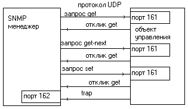
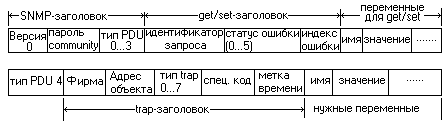
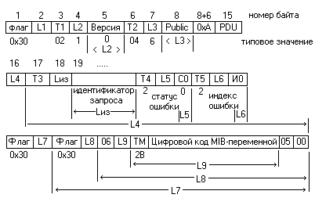
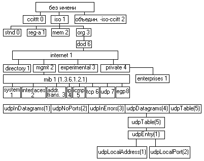

Управляющий протокол SNMP
=========================

::: {.date}
01.01.2007
:::

**Internet** - гигантская сеть.
Напрашивается вопрос, как она сохраняет свою
целостность и функциональность без единого управления?
Если учесть разнородность ЭВМ, маршрутизаторов и программного обеспечения,
используемых в сети, само существование **Internet**
представится просто чудом.
Так все же как решаются проблемы управления в **Internet**?
Отчасти на этот вопрос уже дан ответ - сеть сохраняет работоспособность
благодаря жесткой протокольной регламентации.

"Запас прочности" заложен в самих протоколах.
Функции диагностики возложены, на протокол **ICMP**.
Учитывая важность функции управления,
для этих целей создано два протокола **SNMP**
(**S**imple **N**etwork **M**anagement **P**rotocol - 1988г.)
и **CMOT** (**C**ommon **M**anagement Information Services and Protocol **o**ver **T**CP/IP).
Чаще всего управляющая прикладная программа воздействует на сеть
по цепочке SNMP-UDP-IP-физическая_сеть.
Наиболее важным объектом управления обычно является внешний порт сети
или маршрутизатор.
Каждому управляемому объекту присваивается уникальный идентификатор.

Протокол **SNMP** работает на базе протокола **UDP**
и предназначен для использования сетевыми управляющими станциями.
Он позволяет управляющим станциям собирать информацию
о положении в сети **Internet**.
Протокол определяет формат данных,
их обработка и интерпретация остаются на усмотрение управляющих станций
или менеджера сети.
**SNMP**-сообщения не имеют фиксированного формата и фиксированных полей.
При работе протокол **SNMP** использует управляющую базу данных
(**MIB** — **Management** **Information Base**,**RFC-1213,-1212**).

Алгоритмы управления в **Internet** обычно описывают в нотации **ASN.1**
(**Abstract Syntax Notation**).
Все объекты в **Internet** разделены на 10 групп и описаны в **MIB**:
система, интерфейсы, обмены, трансляция адресов,
**IP**, **ICMP**, **TCP**, **UDP**, **EGP**, **SNMP**.
В группу "система" входит название и версия оборудования,
операционной системы, сетевого программного обеспечения и пр.
В группу "интерфейсы" входит число поддерживаемых интерфейсов,
тип интерфейса, работающего под управлением **IP**
(**Ethernet**, **LAPB** и т.д.),
размер дейтограмм, скорость обмена, адрес интерфейса.
**IP**-группа включает время жизни дейтограмм, информацию о фрагментации,
маски субсетей и т.д.
В **TCP**-группу входит алгоритм повторной пересылки,
максимальное число повторных пересылок и пр.
Команды **SNMP** приведены в **табл. 1.15.**.
В таблице **PDU** (**P**rotocol **D**ata **U**nit) -
это тип протокольного сообщения.
Взаимодействие источника **SNMP**-запросов с объектом управления
показано на **рис. 1.37.**

Таблица 1.15.

| **Команда SNMP** | **Тип PDU** | **Назначение** |
| --- | --- | --- |
| get_request | 0   | Получить значение указанной переменной или информацию о состоянии сетевого элемента |
| get\_next\_request | 1   | Получить значение переменной, не зная точного ее имени (следующий логический идентификатор на дереве MIB) |
| set_request | 2   | Присвоить переменной соответствующее значения. Используется для описания действие, которое должно быть выполнено |
| get response | 3   | Отклик на get\_request, get\_next\_request и set\_request, Содержит также информацию о состоянии (коды ошибок и другие данные) |
| trap | 4   | Отклик сетевого объекта на событие или на изменение состояния |

:::{.center}
  
Рис. 1.37. Схема запросов/откликов SNMP
:::

Формат **SNMP**-сообщений, вкладываемых в **UDP**-дейтограммы,
приведен на **рис. 1.38.**

:::{.center}
  
Рис. 1.38. Формат SNMP-сообщений, вкладываемых в UDP-дейтограммы
:::

Поле _Версия_ содержит значение, равное номеру версии **SNMP** минус один.

Поле _Пароль_ (**community** - определяет группу доступа)
содержит последовательность символов,
которая является пропуском при взаимодействии менеджера
и объекта управления.
Обычно это поле содержит 6-байтовую строку **public**.

Для запросов **get**, **get-next** и **set** значение поля
_Идентификатора запроса_ устанавливается менеджером
и возвращается объектом управления в отклике get,
что позволяет связывать в пары запросы и отклики.

Поле _Фирма_ (**enterprise**) = **sysObjectlD** объекта.

Поле _Статус ошибки_ характеризуется целым числом,
присланным объектом управления (**табл.1.16**).

В последнее время широкое распространение получила идеология
распределенного протокольного интерфейса **DPI**
(**Distributed Protocol Interface**).
Для транспортировки **SNMP**-запросов используется не только **UDP**-,
но и **TCP**-протокол.
Это дает возможность применять**SNMP**-протокол не только в локальных сетях.
Форматы **SNMP**-**DPI**-запросов (версия 2.0) описаны в документе **RFC-1592**.
Пример заголовка **SNMP**-запроса
(изображенные поля образуют единый массив):

{.center}

Поле _Флаг_ = 0х30 является признаком **ASN.1**-заголовка.
Коды **_Ln_** представляют собой длины полей, начинающиеся с байта,
который следует за кодом длины, вплоть до конца сообщения-запроса
(**_n_** — номер поля длины), если не оговорено другое.
Так, **_L1_** - длина пакета-запроса от **Т1** до конца пакета,
a **L3** — длина поля пароля.
Субполя **_Tn_** — поля типа следующего за ними субполя запроса.
Так, **Т1**=2 означает, что поле характеризуется целым числом,
а **Т2**=4 указывает на то, что далее следует пароль
(поле **community**, в приведенном примере **Public**).
Цифры под рамками означают типовые значения субполей.
Код **ОхА** является признаком **GET**-запроса,
за ним следует поле кода **PDU** (=0...4, см. **табл. 1.15**).
Блок субполей _Идентификатора запроса_ служит для тех же целей,
что и другие идентификаторы, — для определения пары запрос-отклик.
Собственно идентификатор запроса может занимать один или два байта,
что определяется значением Lиз.
CO — статус ошибки (СО=0 - ошибки нет);
**ТМ** — тип **MIB**-переменной (в приведенном примере **Ох2В**);
**ИО** — индекс ошибки.
_Цифровой код **MIB**-переменной_ отображается последовательностью цифровых субполей,
характеризующих переменную.
Например, переменная 1.3.6.1.2.1.5
(в символьном выражении iso.org.dod.internet.mgmt.mib.icmp)
соответствует последовательности кодов
**Ох2В 0х06 0х01 0х02 0х01 0х05 0х00**.

Таблица 1.16.

| Статус ошибки | Имя ошибки | Описание |
| --- | --- | --- |
| 0<br>1<br>2 | noError<br>tooBig<br>noSuchName | Все в порядке<br>Объект не может уложить отклик в одно сообщение<br>В операции указана неизвестная переменная |
| 3<br>4<br>5 | badValue<br>readOnly<br>genErr | в команде set использована недопустимая величина или неправильный синтаксис<br>менеджер попытался изменить константу<br>Прочие ошибки |

Если произошла ошибка,
поле _Индекс ошибки_ характеризует к какой из переменных это относится;
индекс ошибки является указателем переменной и устанавливается объектом управления
не равным нулю для ошибок **badValue**.
Для команды **trap **(тип **PDU-4** в **табл. 1.15**)
формат сообщения меняется (**рис. 1.38**).
Значения поля Тип **trap** приведены в **табл. 1.17**.

Таблица 1.17.

| Тип trap | Имя trap | Описание |
| --- | --- | --- |
| 0   | coldStart | Установление начального состояния объекта |
| 1   | wannStart | Восстановление начального состояния объекта |
| 2   | linkDown | Интерфейс выключился. Первая переменная в сообщении идентифицирует интерфейс |
| 3   | linkUp | Интерфейс включился. Первая переменная в сообщении идентифицирует интерфейс |
| 4   | authenticationFailure | От менеджера получено SNMP-сообщение с Неверным паролем (community) |
| 5   | egpNeighborLoss | EGP-партнер отключился. Первая переменная в сообщении определяет IP-адрес партнера |
| 6   | entrpriseSpeclfic | Информация о trap содержится в поле Специальный код |

Для поля Тип trap 0…4 поле _Специальный код_ должно быть равно нулю.
Поле _Временная метка_ содержит число сотых долей секунды (число тиков)
с момента инициации объекта управления.
Так, прерывание **coldStart** выдается объектом через 200 мс
после инициализации.

Протокол **SNMP** служит примером системы управления,
в которой для достижения нужного результата не выдается команда,
а осуществляется обмен информацией, решение принимается "на месте"
в соответствии с полученными данными.

**Управляющая база данных MIB**

Вся управляющая информация для контроля ЭВМ
и маршрутизаторов **Internet** концентрируются в базе данных **MIB**
(**Management Information Base, RFC-1213**).
Именно эти данные используются протоколом **SNMP**.
**MIB** определяет, например, что программное обеспечение **IP**
должно хранить число всех октетов,
которые приняты любым из сетевых интерфейсов,
управляющие программы могут только читать эту информацию.

Согласно нормативам **MIB** управляющая информация делится на 8 категорий
(табл. 1.18; см. также рис. 1.39).

Таблица 1.18.

| MIB-категория | Описание |
| --- | --- |
| System<br>Interfaces<br>Addr. trans.<br>Ip<br>Icmp<br>Tcp<br>Udp<br>egp | Операционная система ЭВМ или маршрутизация<br>Сетевой интерфейс<br>Преобразование адреса (напр., с помощью **ARP**)<br>Программная поддержка протоколов **Internet**<br>Программное обеспечение протокола **ICMP**<br>Программное обеспечение протокола **TCP**<br>Программное обеспечение протокола **UDP**<br>Программное обеспечение протокола **EGP** |

В табл. 1.19 - 1.24 представлены наиболее важные объекты базы данных
**MIB**, перечисленные в табл. 1.18.

Помимо простых переменных объектами **MIB** могут быть таблицы.
Для каждой таблицы имеется один или несколько индексов.

Таблица 1.19.

| Системная переменная | Описание |
| --- | --- |
| SysDescr<br>SysObjectID<br>SysUpTime<br>SysContact<br>SysName<br>SysLocation<br>sysService | Текстовое описание объекта<br>Идентификатор производителя в рамках дерева (1.3.6.1.4.1)<br>Время с момента последней загрузки системы (**TimeTicks**)<br>Имя системного менеджера и способы связи с ним<br>Полное имя домена<br>Физическое местоположение системы<br>Величина, характеризует услуги, предоставляемые узлом (сумма номеров уровней модели **OSI**) |

Таблица 1.20.

| Переменная описания интерфейсов (ifTable) | Тип данных | Описание |
| --- | --- | --- |
| IfIndex | INTEGER | Список интерфейсов от 1 до **ifNumber** |
| IfDescr | DisplayString | Текстовое описание интерфейса |
| IfType | INTEGER | Тип интерфейса, например, 6 - **Ethernet**; 9 - 802.5 маркерное кольцо; 23 - **PPP**; 28 - **SLIP** |
| IfNumber | INTEGER | Число сетевых интерфейсов |
| IfMtu | INTEGER | **MTU** для конкретного интерфейса |
| IfSpeed | Gauge | Скорость (бит/с) |
| IfPhysAddress | PhysAddress | Физический адрес или строка нулевой длины для интерфейсов без физического адреса (например, последовательный) |
| IfAdminStatus | [1…3] | Требуемое состояние интерфейса: 1 - включен; 2 - выключен; 3 - тестируется |
| IfOperStatus | [1…3] | Текущее состояние интерфейса: 1, 2, 3 |
| IfLastChange | TimeTicks | **SysUpTime**, когда интерфейс оказался в данном состоянии |
| ifInOctets | Counter | Полное число полученных байтов |
| ifInUcastPkts | Counter | Число пакетов, доставленных на верхний системный уровень (**unicast**) |
| ifInDiscads | Counter | Число полученных, но отвергнутых пакетов |
| ifInErrors | Counter | Число пакетов, полученных с ошибкой |
| ifOutOctets | Counter | Число отправленных байтов |
| ifOutUcastPkts | Counter | Число **unicast**-пакетов, полученных с верхнего системного уровня |
| ifOutNUcastPkts | Counter | Число мультикастинг\- и широковещательных пакетов, полученных с верхнего системного уровня |
| ifOutDiscads | Counter | Количество отвергнутых пакетов из числа отправленных |
| ifOutErrors | Counter | Число отправленных пакетов, содержащих ошибки |
| ifOutQLen | Gauge | Число пакетов в очереди на отправку |

Таблица 1.21.

| Переменная<br>ip-группы | Тип данных | Описание |
| --- | --- | --- |
| ipDefaultTTL | INTEGER | Значение, которое используется **IP** в поле **TTL** |
| ipForwarding | [1…2] | 1 означает, что система переадресует дейтограммы (2 - нет) |
| ipInReceives | Counter | Число полученных дейтограмм |
| ipForwDatagrams | Counter | Число переадресованных дейтограмм |
| ipOutNoRoutes | Counter | Число неудач при маршрутизации |
| ipFragOKs | Counter | Число фрагментированных **IP**-дейтограмм |
| ipRoutingTable | | Таблица **IP** маршрутов |
| ipInHdrErrors | Counter | Число **IP**-дейтограмм, отвергнутых из-за ошибки в заголовке |
| ipInAddrErrors | Counter | Число **IP**-дейтограмм, отвергнутых из-за неверного адреса места назначения |
| ipInUnknownProtos | Counter | Число локально адресованных дейтограмм с неверным кодом протокола |
| ipInDiscards | Counter | Число дейтограмм, отвергнутых из-за нехватки места в буфере |
| ipInDelivers | Counter | Число доставленных дейтограмм |
| ipOutRequests | Counter | Полное число **IP**-дейтограмм, поступивших для пересылки без учета переадресованных |
| ipOutDiscards | Counter | Число отправляемых дейтограмм, потерянных из-за нехватки места в буфере |
| ipOutNoRoutes | Counter | Число потерянных **IP**-дейтограмм из-за отсутствия маршрута их доставки |
| ipReasmTimeout | Counter | Максимальное время (в секундах), которое **IP**-фрагмент может ждать сборки |
| ipReasmOKs | Counter | Число **IP**-дейтограмм, успешно прошедших сборку |
| ipReasmFails | Counter | Число случаев, когда алгоритм сборки не сработал |
| ipFragOKs | Counter | Число дейтограмм, успешно фрагментированных |
| ipFragFails | Counter | Число дейтограмм, которые нуждались в фрагментации, но не могли быть фрагментированы из-за того, что **don't fragment_флаг**=1 |
| ipFragCreates | Counter | Число фрагментов, созданных в процессе фрагментации |
| ipRoutingDiscards | Counter | Число маршрутных записей, помеченных для ликвидации, хотя они и корректны |


Таблица **IP**-адресов (ipAddrTable), индекс =&lt;ipAdEntAddr&gt;

IpAdEntAddr _**IpAddress**_ - IP-адрес для данного ряда

IpAdEntIfIndex _**INTEGER**_ - Число интерфейсов

IpAdEntNetMask _**IpAddress**_ - Маска субсети для данного **IP**-адреса

IpAdEntBcastAddr _**[0…1]**_ - Значение младшего бита широковещательного адреса (обычно 1)

IpAdEntReasmMaxSize _**[0…65535]**_ - Размер наибольшей **IP**-дейтограммы, полученной интерфейсом, которая может быть собрана


 Таблица 1.22.

| Переменная<br>tcp-группы | Тип данных | Описание |
| --- | --- | --- |
| tcpRtoMin | INTEGER | Минимальное допустимое время повторной передачи **TCP**-пакетов |
| tcpRtoMax | INTEGER | Максимальное значение тайм-аута (в миллисекундах) |
| tcpMaxConn | INTEGER | Максимальное допустимое число **TCP**-соединений |
| tcpInSegs | Counter | Полное число полученных **TCP**-сегментов |
| tcpRtoAlgorithm | INTEGER | Алгоритм, используемый для вычисления тайм-аута: 1 - ни один из следующих; 2 - постоянное**RTO**; 3 - стандарт **MIL-STD-1778**; 4 - алгоритм Ван Джакобсона |
| tcpActiveOpens | Counter | Число переходов из состояния CLOSED в SYN_SENT |
| tcpPassiveOpens | Counter | Число переходов из состояния LISTEN в SYN_RCVD |
| tcpAttemptFails | Counter | Число переходов из состояния SYN\_SENT или SYN\_RCVD в CLOSED |
| tcpEstabResets | Counter | Число переходов из состояния ESTABLISHED или CLOSE_WAIT в CLOSED |
| tcpCurrEstab | Gauge | Число соединений, находящихся в состоянии ESTABLISHED или CLOSE_WAIT |
| tcpInSegs | Counter | Полное число полученных сегментов |
| tcpOutSegs | Counter | Полное число посланных сегментов, исключая повторно пересылаемые |
| tcpRetransSegs | Counter | Полное число повторно пересланных сегментов |
| tcpInErrs | Counter | Полное число сегментов, полученных с ошибкой |
| tcpOutRsts | Counter | Полное число посланных сегментов с флагом **RST**=1 |
| tcpConnTable | | TCP-таблица связей |
| tcpConnState | [1…12] | Состояние соединения: <br>1 - CLOSED;<br>2 -LISTEN;<br>3 - SYN\_SENT;<br>4 - SYN\_RCVD;<br>5 - ESTABLISHED;<br>6 - FIN\_WAIT\_1;<br>7 - FIN\_WAIT\_2;<br>8 - CLOSE\_WAIT;<br>9 - LAST\_ACK;<br>10 - CLOSING;<br>11 - TIME_WAIT;<br>12 - delete TCB<br>Только последняя переменная может устанавливаться менеджером, прерывая связь. |
| tcpConnLocalAddress | IpAddress | Местный IP-адрес.<br>0.0.0.0 означает, что приемник готов установить связь через любой из интерфейсов |
| tcpConnLocalPort | [0…65535] | Местный номер порта |
| tcpConnLocalAddress | ipAddress | Удаленный IP-адрес |
| tcpConnRemPort | [0…65535] | Удаленный номер порта |

Таблица 1.23.

| Переменная<br>icmp-группы | Тип данных | Описание |
| --- | --- | --- |
| icmpInEchos | Counter | Число полученных **ICMP**-запросов отклика |
| icmpInMsgs | Counter | Полное число полученных **ICMP**-сообщений |
| icmpInErrors | Counter | Число **ICMP**-сообщений, полученных с ошибками |
| icmpInDestUnreach | Counter | Число **ICMP**-сообщений о недостижимости адресата |
| icmpInTimeExcds | Counter | Число **ICMP**-сообщений об истечении времени |
| icmpInParmProbs | Counter | Число полученных **ICMP**-сообщений о проблемах с параметрами |
| icmpInSrcQuench | Counter | Число **ICMP**-сообщений с требованием сократить или прервать посылку пакетов из-за перегрузки |
| icmpInRedirects | Counter | Число **ICMP**-сообщений о переадресации |
| icmpInEchoReps | Counter | Число полученных **ICMP**-эхо-откликов |
| icmpInTimestamps | Counter | Число **ICMP**-запросов временных меток |
| icmpInAddrMasks | Counter | Число **ICMP**-запросов адресных масок |
| icmpOutMsgs | Counter | Число отправленных **ICMP**-сообщений |
| icmpOutErrors | Counter | Число неотправленных **ICMP**-сообщений из-за проблем (например, нехватка буферов) |
| icmpOutTimesExcds | Counter | Число посланных **ICMP**-сообщений об истечении времени |
| icmpOutParmProbs | Counter | Число посланных **ICMP**-сообщений о проблемах с параметрами |
| icmpOutQuench | Counter | Число посланных **ICMP**-сообщений об уменьшении потока пакетов |
| icmpOutRedirects | Counter | Число посланных **ICMP**-сообщений о переадресации |
| icmpOutEchos | Counter | Число посланных **ICMP**-эхо-запросов |
| icmpOutEchoReps | Counter | Число посланных **ICMP**-эхо-откликов |
| icmpOutTimestamps | Counter | Число посланных **ICMP**-эхо-запросов временных меток |
| icmpOutAddrMasks | Counter | Число посланных **ICMP**-эхо-запросов адресных масок |

Таблица 1.24.

| Переменные at-группы (atTable) | Тип данных | Описание |
| --- | --- | --- |
| atIfIndex | INTEGER | Число интерфейсов |
| atPhysAddress | PhysAddress | Физический адрес. Если эта переменная равна строке нулевой длины, физический адрес отсутствует |
| atNetAddress | NetworkAddress | **IP**-адрес |

Каждый протокол (например, **IP**) имеет свою таблицу преобразования
адресов.
Для **IP** это ipNetToMediaTable.
Способ пропечатать таблицу преобразования с помощью программы **snmpi** описан ниже.

В новейшей модификации управляющей базы данных (**MIB II**)
содержатся объекты, принадлежащие к **SNMP**-группе.
Эта группа предоставляет информацию о **SNMP**-объектах,
информационных потоках, статистике ошибок (**табл. 1.25**).

Таблица 1.25.

| Название объекта | Описание |
| --- | --- |
| snmpInPkts | Число пакетов, полученных от слоя, расположенного ниже**SNMP** |
| snmpOutPkts | Число пакетов доставленных от **SNMP** к нижележащему слою |
| snmpInBadVersions | Индицирует число **PDU**, полученных с ошибкой в поле_Версия_ (см. рис. 1.38) |
| snmpInBadCommunityNames | Индицирует число сообщений **PDU**, полученных с нечитаемым или нелегальным именем **community** |
| snmpInASNParsErrs | Указывает число **PDU**, которые не могут быть преобразованы в объекты **ASN.1**, и наоборот |
| snmpInBadTypes | Указывает число полученных **PDU** с недешифруемым типом |
| snmpInTooBigs | Указывает число полученных **PDU** со слишком большим значением поля _Статус ошибки_ (см. рис. 1.38) |
| snmpInNoSuchNames | Указывает число **PDU**, полученных с индикацией ошибки в поле NoSuchName (см. табл. 1.16) |
| snmpInBadValues | Указывает число **PDU**, полученных с индикацией ошибки в поле BadValue (см. табл. 1.16) |
| snmpInReadOnlys | Указывает число **PDU**, полученных с индикацией ошибки в поле ReadOnly (см. табл. 1.16) |
| snmpInGenErrs | Указывает число **PDU**, полученных в GenErr-поле (см. табл. 1.16) |
| snmpInTotalReqVar | Указывает число объектов **MIB**, которые были восстановлены |
| snmpInTotalSetVars | Указывает число объектов **MIB**, которые были изменены |
| snmpInGetRequests<br>snmpInGetNexts<br>snmpInSetRequests<br>snmpInGetResposes<br>snmpInTraps | Указывает число соответствующих **PDU**, которые были получены |
| snmpOutTooBig | Указывает число посланных **PDU** с полем TooBig |
| snmpOutNoSuchNames | Указывает число посланных **PDU** с полем NoSuchName |
| snmpOutBadValues | Указывает число посланных **PDU** с полем BadValue |
| snmpOutReadOnlys | Указывает число посланных **PDU** с полем ReadOnly |
| snmpOutGenErrs | Указывает число посланных **PDU** с полем GenErr |
| snmpEnableAuthTraps | Говорит о том, разрешены или нет ловушки (traps) |
| SnmpOutGetRequests<br>snmpOutGetNexts<br>snmpOutSetRequests<br>snmpOutGetResposes<br>snmpOutTraps | Указывает число соответствующих посланных **PDU** |

Стандарт на структуру управляющей информации (**SMI**) требует,
чтобы все **MIB**-переменные были описаны и имели имена
в соответствии с **ASN.1** (**Abstract Syntax Notation 1**,
формализованный синтаксис).

**ASN.1** является формальным языком,
который обладает двумя основными чертами:  
- нотация в документах легко читаема и понимаема;
- в компактном кодовом представлении информация может использоваться
коммуникационными протоколами.

В **SMI** присутствует неполный набор типов объектов,
предусмотренный в **ASN.1**,
разрешены только следующие типы примитивов:
**INTEGER, OCTET STRING, OBJECT IDENTIFIER** и **NULL**.

Практически в протоколе **SNMP** фигурируют следующие виды данных:

**INTEGER**
: Некоторые переменные объявляются целыми (**INTEGER**)
с указанием начального значения или с заданным допустимым диапазоном значений
(в качестве примера можно привести номера **UDP**- или **TCP**-портов).

**OCTET STRING** (последовательность байтов)
: В соответствии с требованиями **BER** (**Basic Encoding Rules, ASN.1**)
последовательность октетов должна начинаться с числа байтов
в этой последовательности (от 0 до N).

**OBJECT IDENTIFIER** (идентификатор объекта)
: Имя объекта, представляющее собой последовательность целых чисел, разделенных точками. Например, 1.3.6.1.2.1.5.

**NULL**
: Указывает, что соответствующая переменная не имеет значения.

**DisplayString**
: Строка из 0 или более байтов (но не больше 255), которые являются **ASCII**-символами. Представляет собой частный случай **OCTET STRING**.

**PhysAddress**
: Последовательность октетов, характеризующая физический адрес объекта (6 байт для **Ethernet**). Частный случай **OBJECT IDENTIFIER**.

**Сетевой адрес**
: Допускается выбор семейства сетевых протоколов. В рамках **ASN.1** этот тип описан как **CHOICE**, он позволяет выбрать протокол из семейства протоколов. В настоящее время идентифицировано только семейство протоколов **Internet**.

**IP-адрес**
: Этот адрес используется для определения 32-разрядного Интернет - адреса. В нотации **ASN.1 - **это **OCTET STRING**.

**Time Ticks** (такты часов)
: Положительное целое число, которое используется для записи, например, времени последнего изменения параметров управляемого объекта, или времени последней актуализации базы данных (время измеряется в сотых долях секунды).

**Gauge** (масштаб)
: Положительное целое число в диапазоне 0..232-1, которое может увеличиваться или уменьшаться. Если это число достигнет 232-1, то будет оставаться неизменным до тех пор, пока не будет обнулено командой сброс. Примером может служить переменная**tcpCurrEsta**, которая характеризует число **TCP**-соединений, находящихся в состоянии **ESTABLISHED** или **CLOSE_WAIT**.

**Counter** (счетчик)
: Положительное число в диапазоне 0..232-1, которое может только увеличиваться, допуская переполнение.

**SEQUENCE**
: Этот объект аналогичен структуре в языке Си.
Например, **MIB** определяет **SEQUENCE** с именем **UdpEntry**,
содержащую информацию об активных **UDP**-узлах.
В этой структуре содержится две записи:

1. **UdpLocalAddress** типа **IpAddress**; местные **IP**-адреса;
2. **UdpLocalPort** типа **INTEGER**; номера местных портов.

**SEQUENCE OF**
: Описание вектора, все элементы которого имеют один и тот же тип. Элементы могут представлять собой простые объекты, например, типа целое. В этом случае мы имеем одномерный список. Но элементами вектора могут быть объекты типа **SEQUENCE,**тогда этот вектор описывает двумерный массив.

В **MIB Internet** каждый объект должен иметь имя (**OBJECT IDENTIFIER**), синтакс и метод кодировки.

Стандарт **ASN.1 **определяет форму представления информации и имен.

Имена **MIB**-переменных соответствуют в свою очередь стандартам **ISO** и **CCITT**.

Структура имен носит иерархический характер, отображенный на **рис. 1.39**.

В **табл. 1.26** охарактеризованы четыре простые переменные, идентификаторы которых помещены в нижней части **рис. 1.39**. Все эти переменные допускают только чтение.

В **табл. 1.27** приведено описание таблицы **udpTable** (index=,), состоящей из двух простых переменных, предназначенных только для чтения.

Согласно иерархии **рис. 1.39** переменные, соответствующие **icmp**,
должны иметь префикс (идентификатор) 1.3.6.1.2.1.5
или в символьном выражении **iso.org.dod.internet.mgmt.mib.icmp**.
Если вы хотите узнать значение какой-то переменной,
следует послать запрос, содержащий соответствующие префикс и суффикс
(последний определяет имя конкретной переменной).
Для простой переменной суффикс имеет вид .0.



Рис. 1.39. Структура идентификаторов переменных в MIB


Таблица 1.26.

| Имя Переменной | Тип данных | Описание |
| --- | --- | --- |
| UdpInDatagrams | Counter | Число UDP-дейтограмм, присланных процессам пользователя |
| UdpNoPorts | Counter | Число полученных UDP-дейтограмм, для которых отсутствует прикладной процесс в порте назначения |
| UdpInErrors | Counter | Число не доставленных UDP-дейтограмм (например, ошибка контрольной суммы) |
| UdpDatagrams | Counter | Число посланных UDP-дейтограмм |

**Таблица** 1.27.

| Имя переменной | Тип данных | Описание |
| --- | --- | --- |
| UdpLocalAddress | IpAddress | Местный IP-адрес для данного приемника |
| UdpLocalPort | (0...65535) | Местный номер порта приемника |

Лучшим способом закрепить впамяти все вышесказанное является использование программы snmpi
(**SNMP initiator** или **SNMPWALK**, **NETGUARD**, **SNMPMAN** для PC).

Если в вашем распоряжении имеется ЭВМ, работающая под управлением **UNIX**,
например **SUN,** вы можете попутно узнать много полезного о вашей локальной сети.
Синтаксис обращения к snmpi:

snmpi [-a agent] [-с community] [-f file] [-p portno] [-d] [-v] [-w]

Программа snmpi крайне проста.
Для того чтобы проверить, работает ли онa, выдайте команду

```
% snmpi dump
```

Следует отметить, что в ответ на эту операций будет произведена весьма объемная выдача.

Опция -a предлагает возможность ввести адрес **SNMP**-обьекта: имя ЭВМ, **IP**-адрес или транспортный адрес. По умолчаниюэто местная ЭВМ. Аналогичноопция -р позволяет задать номер **UDP**-порта.По умолчанию это порт 61.

Опция -с позволяет задать групповой пароль (**community**) для **SNMP**-запроса.По умолчанию это public, т.е. свободный доступ.

Опция -f позволяет выбрать файл, содержащий откомпилированные описания **MIB**-модулей. По умолчанию это **objects.defs**.

Опция -w включает режим наблюдения, осуществляя выдачу на терминал всехслужебных сообщений. Уход из программы - по команде **quit **(q).

Если вы работаете на IBM PC, и ваша машина подключена к локальной сети, получите допуск к одной из **UNIX**-машин в сети (если вы его не имели) и приступайте. Можно начать с обращения типа

```
snmpi -a 193.124.224.33
```

(адрес или символьное имя надо взять из вашей локальной сети)

Машина откликнется, отобразив на экране **snmpi>.**
Это означает, что программа имеется, и вы можете вводить любые команды.

Начать можно со знакомства с системными переменными системы
(как и ранее курсивом выделены команды, введенные с клавиатуры).

```
snmpi> _get sysDescr.0_
snmpi> sysDescr.0="GS Software (GS3-K), Version 9.1(4) [fc1], SOFTWARE Copyright ї 1986-1993 by Cisco Systems, Inc. Compiled Thu 25-Mar-93 09:49 by daveu"
snmpi> _get sysObjectID.0_
snmpi> sys0bjectlD.0=1.3.6.1.4.1.9.1.1
snmpi> _get sysUpTime.0_
snmpi> sysUpTime.0=14 days, 7 hours, 0 minutes, 15.27 seconds (123481527 timeticks)
snmpi> _get sysServices.0_
snmpi> sysServices.0=0x6&lt;datalink/subnetwork, internet&gt;
```

Код 0x06 (sysServices.0) представляет собой сумму кодов уровней модели **SO**,
поддерживаемых системой.

Для справок:
: 0х01 - физический уровень;
: 0х02 - связной уровень;
: 0х04 - Интернет;
: 0х08 - связь точка-точка;
: 0х40 - прикладной уровень.

Если вы хотите получить информацию о состоянии интерфейсов на одной из ЭВМ, подключенных к вашей локальной сети (команды вызова snmpi далее не повторяются; в ниже приведенных примерах в круглых скобках помещены комментарии автора), выдайте команды:

```
snmpi> _nextifTable_
```

(команда **next** в данном случае соответствует запросу **get-next**, здесь понятие "следующий" подразумевает порядок переменных в **MlВ**)

```
snmpi> iflndex.1=1
snmpi> _get ifDescr.1_
snmpi> ifDescr.1="Ethernet0"
snmpi> _get ifType.1_
snmpi> ifType.1=ethernet-csmacd (6)
snmpi > _get ifMtu.1_
snmpi> IfMtu.1=1500
snmpi> _get ifSpeed.1_
snmpi> ifSpeed.1=10000000 (10М бит/с, Ethernet)
snmpi> _get ifPhysAddress.1_
snmpi> ifPhysAddress.1=0х00:00:0c:02:За:49
(физический адрес интерфейса)
snmpi> _next ifDescr.1 ifType.1 ifMtu.1 ifSpeed.1 ifPhysAddress.1_
snmpi> ifDescr.2="Serial0"
ifType.2=propPointToPointSerial(22)
ifMtu.2=1500
ifSpeed.2=2048000
(2 M бит/с, радиорелейный последовательный канал,
 спутниковый канал был бы охарактеризован точно также)
```

В приведенном примере размеры пересылаемых блоков для **Ethernet** и радиорелейного последовательного канала идентичны и равны 1500 байт. Помните, что **SLIP**-канал записан как **PointToPointSerial,** а не как **SLIP**. Скорость обмена по **SLIP**-каналу не сообщается.

Теперь просмотрим некоторые **UDP**-переменные. Например:

```
snmpi> _next udp_
snmpi> udpInDatagrams.0=98931
snmpi> _next udpInDatagrams.0_
(обратите внимание на суффикс простой переменной)
snmpi> udpNoPorts. 0=60009
snmpi> _next udpLocalAddress.0_
snmpi> udpLocalAddress.193.124.137.14.7=193.124.137.14
(Идентификатор этого объекта 1.3.6.1.2.1.7.5.1.1.193.124.137.14.7)
snmpi> _next udpLocalPort_
snmpi> udpLocalPort.193.124.137.14.7=7
```

Если у вас возникла необходимость просмотреть таблицу, например, **udpTable**, это также можно сделать, используя snmpi:

```
snmpi> _next udpTable_
snmpi> udpLocalAddress.193.124.137.14.7=193.124.137.14
snmpi> _next udpLocalAddress.193.124.137.14.7_
snmpi> udpLocalAddress.193.124.224.33.67=193.124.224.33
snmpi> _next udpLocalAddress.193.124.224.33.67_
snmpi> udpLocalAddress.193.124.224.33.161=193.124.224.33
snmpi> _next udpLocalPort.193.124.224.33.67_
snmpi> udpLocalPort.193.124.224.33.161=161
```

Ниже показана методика выяснения алгоритма и параметров задания значения тайм-аута:

```
snmpi> _get tcpRtoAlgorithm.0 tcpRtoMin.0 tcpRtoMax.0 tcpMaxConn.0_
snmpi> tcpRtoAlgorithm.0=vanj(4)
 (**vanj** - алгоритм Ван Джакобсона для расчета времени тайм-аута)
tcpRtoMin.0=300
 (минимальное значение тайм-аута = 300 мс)
tcpRtoMax.0=60000
 (максимальное - 60 с)
tcpMaxConn.0=-1
 (никаких ограничений на число соединений)
```

Чтобы получить информацию о состоянии таблицы адресных преобразований,
выдайте команду

```
_snmpi -а 193.124.224.33 dump at_
```
(процедуры с использование субкоманды **dump** требуют некоторого времени для своего исполнения).

В результате получим:

```
AtIfIndex.1.1.193.124.224.33=1
AtIfIndex.1.1.193.124.224.35=1
AtIfIndex.3.1.192.148.166.203=3
AtIfIndex.3.1.192.148.166.205=3
AtIfIndex.5.1.145.249.30.33=5
AtIfIndex.5.1.192.148.166.98=5
AtPhysAddress.1.1.193.124.224.33=0x00:00:0c:02:3a:49
AtPhysAddress.1.1.193.124.224.35=0x00:00:20:12:1b:b1
AtPhysAddress.1.1.193.124.224.40=0x00:00:cd:f9:0d:e7
AtPhysAddress.1.1.193.124.224.50=0x00:00:0c:02:fb:c5
AtNetAddress.1.1.193.124.224.33=193.124.224.33
AtNetAddress.1.1.193.124.224.35=193.124.224.35
AtNetAddress.1.1.193.124.224.40=193.124.224.40
AtNetAddress.1.1.193.124.224.50=193.124.224.50
AtNetAddress.1.1.193.124.224.60=193.124.224.60
```
(текст выдачи сокращен)

Обычно элементы таблицы расположены в порядке колонка-ряд.
Если вы дошли до края колонки или всей таблицы,
ЭВМ выдаст (в зависимости от реализации программы)
имя и значение следующего элемента или сообщение об ошибке.

Чтобы получить полный текст адресной таблицы в рамках **snmpi**
достаточно выдать команду

```
snmpi> _dump ipAddrTable_
snmpi> ipAdEntAddr.192.148.166.222=192.148.166.222

IpAdEntAddr.192.168.1.1=192.168.1.1
IpAdEntAddr.192.168.1.2=192.168.1.2
IpAdEntAddr.193.124.224.33=193.124.224.33
IpAdEntAddr.193.124.224.190=193.124.224.190
IpAdEntIfIndex.192.148.166.222=3
IpAdEntIfIndex.192.148.1.1=4
IpAdEntIfIndex.192.148.1.2=6
IpAdEntIfIndex.192.148.224.33=1
IpAdEntIfIndex.192.148.224.190=5
(маски субсетей)
IpAdEntNetMask.192.148.166.222=255.255.255.224
IpAdEntNetMask.192.148.1.1=255.255.255.0
IpAdEntNetMask.192.148.1.2=255.255.255.0
IpAdEntNetMask.192.148.224.33=255.255.255.224
IpAdEntNetMask.192.148.224.190=255.255.255.224
IpAdEntBcastAddr.192.148.166.222=1
 (все эти субсети используют для широковещательной адресации
  одни и те же биты).
IpAdEntBcastAddr.192.148.1.1=1
IpAdEntBcastAddr.192.148.1.2=1
IpAdEntBcastAddr.192.148.224.33=1
IpAdEntBcastAddr.192.148.224.190=1
IpAdEntReasmMaxSize.192.148.166.222=18024
 (с точки зрения фрагментации и последующей сборки дейтограмм
  данные субсети эквивалентны).
IpAdEntReasmMaxSize.192.148.1.1=18024
IpAdEntReasmMaxSize.192.148.1.2=18024
IpAdEntReasmMaxSize.192.148.224.33=18024
IpAdEntReasmMaxSize.192.148.224.190=18024
```

Эта распечатка совместно с приведенной для **IfTable**
позволяет получить достаточно полную картину
о данной конкретной локальной сети.
Чтобы познакомиться с **ARP** таблицей,
можно воспользоваться командой

```
Sun> _arp -a_
Itepgw.itep.ru (193.124.224.33) at 0:0:c:2:3a:49
Nb.itep.ru (193.124.224.60) at 0:80:ad:2:24:b7
```

И дополнить полученные данные с помощью snmpi:

```
snmpi> _dump ipNetToMediaTable_
Snmpi> ipNetToMediaIfIndex.1.193.124.224.33=1
ipNetToMediaIfIndex.1.193.124.224.35=1
ipNetToMediaIfIndex.3.192.148.166.193=3
ipNetToMediaIfIndex.3.192.148.166.196=3
ipNetToMediaIfIndex.3.193.124.226.110=3
ipNetToMediaIfIndex.5.195.249.30.33=5
ipNetToMediaIfIndex.5.192.148.166.100=5
ipNetToMediaPhysAddress.1.193.124.224.33=0x00:00:0c:02:3a:49
ipNetToMediaPhysAddress.3.192.148.166.196=0xaa:00:04:00:0c:04
ipNetToMediaPhysAddress.3.192.148.166.198=0xaa:00:04:00:0e:04
ipNetToMediaPhysAddress.3.192.148.166.203=0x00:00:01:00:54:62
..............................
ipNetToMediaPhysAddress.5.195.249.30.33=0x00:00:0c:02:69:7d
IpNetToMediaPhysAddress.5.192.148.166.100=0x00: 20:af: 15:c1: 61
IpNetToMediaPhysAddress.5.192.148.166.101=0x00:00:09:42:0d:e8
IpNetToMediaNetAddress.1.193.124.224.33=193.124.224.33
IpNetToMediaNetAddress.1.193.124.224.35=193.124.224.35
IpNetToMediaNetAddress.3.192.148.166.193=192.148.166.193
IpNetToMediaNetAddress.3.193.124.226.110=193.124.226.110
IpNetToMediaNetAddress.5.195.249.30.33=195.249.30.33
IpNetToMediaType.1.193.124.224.33=other(1)
IpNetToMediaType.1.193.124.224.35=dynamic(3)
IpNetToMediaType.1.193.124.224.37=dynamic(3)
IpNetToMediaType.3.192.148.166.195=dynamic(3)
IpNetToMediaType.3.192.148.166.222= other(1)
IpNetToMediaType.5.193.124.224.190= other(1)
IpNetToMediaType.5.193.124.225.33= other(1)
IpNetToMediaType.5.193.124.225.35=dynamic(3)
```

Синтаксис каждого объекта описывается в рамках **ASN.1** и показывает побитовое представление объекта. Кодирование объекта характеризует то, как тип объекта отображается через его синтаксис и передается по телекоммуникационным каналам. Кодирование производится в соответствии с базовыми правилами кодирование **ASN.1**. Все описания объектов базируются на типовых шаблонах и кодах **ASN.1** (см. **RFC-1213**).

Формат шаблона:

**OBJECT **(объект):
: Имя типа объекта с соответствующим ему идентификатором объекта (**OBJECT IDENTIFIER**)

**Syntax** (синтаксис):
: **ASN.1**
: описание синтаксиса типа объекта

**Definition** (Определение)
: Текстовое описание типа объекта

**Access** (доступ)
: Опции доступа

**Status** (состояние)
: Статус типа объекта.

Маршруты также являются объектами **MIB**.
Согласно требованиям к **MIB**,
каждому маршруту в этой базе соответствует запись,
схема которой приведена на рис. 1.40.

Поле **Место назначения** представляет собой **IP**-адрес конечной точки
маршрута.

Поле **Индекс интерфейса** определяет локальный интерфейс
(физический порт), через который можно осуществить следующий шаг
по маршруту.

Следующие пять полей (Метрика 1...5) характеризует оценку маршрута.
В простейшем случае, например для протокола **RIP**,
достаточно было бы одного поля.
Но для протокола **OSPF** необходимо пять полей (разные **TOS**).

Поле **Следующий шаг** представляет собой IP-адрес следующего маршрутизатора.

Поле **Тип маршрута** имеет значение 4 для опосредованного достижения цели маршрута;
2 для нереализуемого маршрута и 1 для случаев,
отличных от вышеперечисленных.

```
Место назначения (ipRouteDept)  
Индекс интерфейса (ipRouteIfIndex)  
Метрика 1 (ipRouteMetric1)  
....................  
Метрика 5 (ipRouteMetric5)  
Следующий шаг (ipRouteNextHop)  
Тип маршрута (ipRouteType)  
Протокол маршрутизации (ipRouteProto)  
Возраст маршрута (ipRouteAge)  
Маска маршрута (ipRouteMask)  
Маршрутная информация (ipRouteInfo)
```

Рис. 1.40. Маршрутная таблица

Поле **Протокол маршрутизации** содержит код протокола.
Для **RIP** этот код равен 8, для **OSPF** -13, для **BGP** -14,
для **ICMP** -4, для прочих протоколов -1.

Поле **Возраст маршрута** описывает время (в секундах),
прошедшее с момента последней коррекции маршрута.

Следующее поле **Маска маршрута** используется для выполнения
логической побитовой операции **И** над адресом в IP-дейтограмме
перед сравнением результата с кодом, хранящимся в первом поле записи
("место назначения").

Последнее поле **Маршрутная информация** содержит код,
зависящий от протокола маршрутизации и обеспечивающий ссылки
на соответствующую информацию в базе **MIB**.

