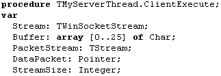
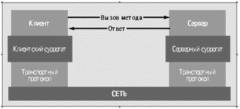
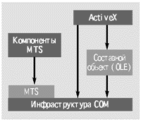
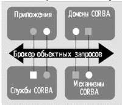
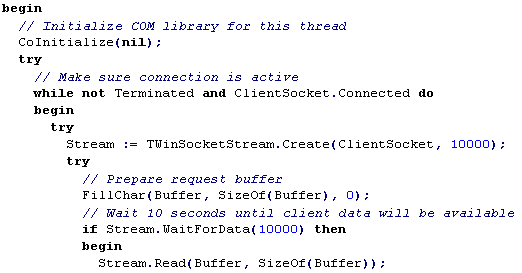

Программирование серверов на основе сокетов в Delphi
====================================================

::: {.date}
01.01.2007
:::

Данная статья посвящена созданию приложений архитектуры клиент/сервер в
Borland Delphi на основе сокетов ("sockets" - гнезда). В отличие от
предыдущей статьи на тему сокетов, здесь мы разберем создание серверных
приложений.

Следует сразу заметить, что для сосуществования отдельных приложений
клиента и сервера не обязательно иметь несколько компьютеров. Достаточно
иметь лишь один, на котором Вы одновременно запустите и сервер, и
клиент. При этом нужно в качестве имени компьютера, к которому надо
подключиться, использовать хост-имя localhost или IP-адрес - 127.0.0.1.

Итак, начнем с теории. Если Вы убежденный практик (и в глаза не можете
видеть всяких алгоритмов), то Вам следует пропустить этот раздел.

Алгоритм работы сокетного сервера

Что же позволяет делать сокетный сервер?.. По какому принципу он
работает?.. Сервер, основанный на сокетном протоколе, позволяет
обслуживать сразу множество клиентов. Причем, ограничение на их
количество Вы можете указать сами (или вообще убрать это ограничение,
как это сделано по умолчанию). Для каждого подключенного клиента сервер
открывает отдельный сокет, по которому Вы можете обмениваться данными с
клиентом. Также отличным решением является создание для каждого
подключения отдельного процесса (Thread).

Ниже следует примерная схема работы сокетного сервера в
Дельфи-приложениях:

Разберем схему подробнее:

::: {style="text-align: left; text-indent: 0px; padding: 0px 0px 0px 0px; margin: 0px 0px 0px 24px;"}
  --- ----------------------------------------------------------------------------------------------------------------------------------------------------------------------------------------------------------------------------------------------------------------------
  ·   Определение св-в Port и ServerType - чтобы к серверу могли нормально подключаться клиенты, нужно, чтобы порт, используемый сервером точно совпадал с портом, используемым клиентом (и наоборот). Свойство ServerType определяет тип подключения (подробнее см.ниже);
  --- ----------------------------------------------------------------------------------------------------------------------------------------------------------------------------------------------------------------------------------------------------------------------
:::

::: {style="text-align: left; text-indent: 0px; padding: 0px 0px 0px 0px; margin: 0px 0px 0px 24px;"}
  --- -----------------------------------------------------------------------------------------------------------------------------------------
  ·   Открытие сокета - открытие сокета и указанного порта. Здесь выполняется автоматическое начало ожидания подсоединения клиентов (Listen);
  --- -----------------------------------------------------------------------------------------------------------------------------------------
:::

::: {style="text-align: left; text-indent: 0px; padding: 0px 0px 0px 0px; margin: 0px 0px 0px 24px;"}
  --- -----------------------------------------------------------------------------------------------------------------------------------------------------------------------------------------------------
  ·   Подключение клиента и обмен данными с ним - здесь подключается клиент и идет обмен данными с ним. Подробней об этом этапе можно узнать ниже в этой статье и в статье про сокеты (клиентская часть);
  --- -----------------------------------------------------------------------------------------------------------------------------------------------------------------------------------------------------
:::

::: {style="text-align: left; text-indent: 0px; padding: 0px 0px 0px 0px; margin: 0px 0px 0px 24px;"}
  --- -------------------------------------------------------------------------------------------------
  ·   Отключение клиента - Здесь клиент отключается и закрывается его сокетное соединение с сервером;
  --- -------------------------------------------------------------------------------------------------
:::

::: {style="text-align: left; text-indent: 0px; padding: 0px 0px 0px 0px; margin: 0px 0px 0px 24px;"}
  --- ----------------------------------------------------------------------------------------------------------------------------------------------------------------------
  ·   Закрытие сервера и сокета - По команде администратора сервер завершает свою работу, закрывая все открытые сокетные каналы и прекращая ожидание подключений клиентов.
  --- ----------------------------------------------------------------------------------------------------------------------------------------------------------------------
:::

Следует заметить, что пункты 3-4 повторяются многократно, т.е. эти
пункты выполняются для каждого нового подключения клиента.

Примечание: Документации по сокетам в Дельфи на данный момент очень
мало, так что, если Вы хотите максимально глубоко изучить эту тему, то
советую просмотреть литературу и электронную документацию по
Unix/Linux-системам - там очень хорошо описана теория работы с сокетами.
Кроме того, для этих ОС есть множество примеров сокетных приложений
(правда, в основном на C/C++ и Perl).

Краткое описание компонента TServerSocket

Здесь мы познакомимся с основными свойствами, методами и событиями
компонента

Свойства

Socket - класс TServerWinSocket, через который Вы имеете доступ к
открытым сокетным каналам. Далее мы рассмотрим это свойство более
подробно, т.к. оно, собственно и есть одно из главных. Тип:
TServerWinSocket;

ServerType - тип сервера. Может принимать одно из двух значений:
stNonBlocking - синхронная работа с клиентскими сокетами. При таком типе
сервера Вы можете работать с клиентами через события OnClientRead и
OnClientWrite. stThreadBlocking - асинхронный тип. Для каждого
клиентского сокетного канала создается отдельный процесс (Thread). Тип:
TServerType;

ThreadCacheSize - количество клиентских процессов (Thread), которые
будут кэшироваться сервером. Здесь необходимо подбирать среднее значение
в зависимости от загруженности Вашего сервера. Кэширование происходит
для того, чтобы не создавать каждый раз отдельный процесс и не убивать
закрытый сокет, а оставить их для дальнейшего использования. Тип:
Integer;

Active - показатель того, активен в данных момент сервер, или нет. Т.е.,
фактически, значение True указывает на то, что сервер работает и готов к
приему клиентов, а False - сервер выключен. Чтобы запустить сервер,
нужно просто присвоить этому свойству значение True. Тип: Boolean;

Port - номер порта для установления соединений с клиентами. Порт у
сервера и у клиентов должны быть одинаковыми. Рекомендуются значения от
1025 до 65535, т.к. от 1 до 1024 - могут быть заняты системой. Тип:
Integer;

Service - строка, определяющая службу (ftp, http, pop, и т.д.), порт
которой будет использован. Это своеобразный справочник соответствия
номеров портов различным стандартным протоколам. Тип: string;

Методы

Open - Запускает сервер. По сути, эта команда идентична присвоению
значения True свойству Active;

Close - Останавливает сервер. По сути, эта команда идентична присвоению
значения False свойству Active.

События

OnClientConnect - возникает, когда клиент установил сокетное соединение
и ждет ответа сервера (OnAccept);

OnClientDisconnect - возникает, когда клиент отсоединился от сокетного
канала;

OnClientError - возникает, когда текущая операция завершилась неудачно,
т.е. произошла ошибка;

OnClientRead - возникает, когда клиент передал берверу какие-либо
данные. Доступ к этим данным можно получить через пеаедаваемый параметр
Socket: TCustomWinSocket;

OnClientWrite - возникает, когда сервер может отправлять данные клиенту
по сокету;

OnGetSocket - в обработчике этого события Вы можете отредактировать
параметр ClientSocket;

OnGetThread - в обработчике этого события Вы можете определить
уникальный процесс (Thread) для каждого отдельного клиентского канала,
присвоив параметру SocketThread нужную подзадачу TServerClientThread;

OnThreadStart, OnThreadEnd - возникает, когда подзадача (процесс,
Thread) запускается или останавливается, соответственно;

OnAccept - возникает, когда сервер принимает клиента или отказывает ему
в соединении;

OnListen - возникает, когда сервер переходит в режим ожидания
подсоединения клиентов.

TServerSocket.Socket (TServerWinSocket)

Итак, как же сервер может отсылать данные клиенту? А принимать данные? В
основном, если Вы работаете через события OnClientRead и OnClientWrite,
то общаться с клиентом можно через параметр ClientSocket
(TCustomWinSocket). Про работу с этим классом можно прочитать в статье
про клиентские сокеты, т.к. отправка/посылка данных через этот класс
аналогична - методы (Send/Receive)(Text,Buffer,Stream). Также и при
работе с TServerSocket.Socket. Однако, т.к. здесь мы рассматриваем
сервер, то следует выделить некоторые полезные свойства и методы:

::: {style="text-align: left; text-indent: 0px; padding: 0px 0px 0px 0px; margin: 0px 0px 0px 24px;"}
  --- -----------------------------------------------------------------
  ·   ActiveConnections (Integer) - количество подключенных клиентов;
  --- -----------------------------------------------------------------
:::

::: {style="text-align: left; text-indent: 0px; padding: 0px 0px 0px 0px; margin: 0px 0px 0px 24px;"}
  --- ------------------------------------------------------------
  ·   ActiveThreads (Integеr) - количество работающих процессов;
  --- ------------------------------------------------------------
:::

::: {style="text-align: left; text-indent: 0px; padding: 0px 0px 0px 0px; margin: 0px 0px 0px 24px;"}
  --- -------------------------------------------------------------------------------------------------------------------------------------------
  ·   Connections (array) - массив, состоящий из отдельных классов TClientWinSocket для каждого подключенного клиента. Например, такая команда:
  --- -------------------------------------------------------------------------------------------------------------------------------------------
:::

::: {style="text-align: left; text-indent: 0px; padding: 0px 0px 0px 0px; margin: 0px 0px 0px 24px;"}
  --- -------------------------------------------------------------
  ·   ServerSocket1.Socket.Connections\[0\].SendText(\'Hello!\');
  --- -------------------------------------------------------------
:::

::: {style="text-align: left; text-indent: 0px; padding: 0px 0px 0px 0px; margin: 0px 0px 0px 24px;"}
  --- ---------------------------------------------------------------------------------------------------------------------------------------------------------
  ·   отсылает первому подключенному клиенту сообщение \'Hello!\'. Команды для работы с элементами этого массива - также (Send/Receive)(Text,Buffer, Stream);
  --- ---------------------------------------------------------------------------------------------------------------------------------------------------------
:::

::: {style="text-align: left; text-indent: 0px; padding: 0px 0px 0px 0px; margin: 0px 0px 0px 24px;"}
  --- -------------------------------------------------------------------------------------------------------------------
  ·   IdleThreads (Integer) - количество свободных процессов. Такие процессы кэшируются сервером (см. ThreadCacheSize);
  --- -------------------------------------------------------------------------------------------------------------------
:::

::: {style="text-align: left; text-indent: 0px; padding: 0px 0px 0px 0px; margin: 0px 0px 0px 24px;"}
  --- -------------------------------------------------------------------------------------------
  ·   LocalAddress, LocalHost, LocalPort - соответственно - локальный IP-адрес, хост-имя, порт;
  --- -------------------------------------------------------------------------------------------
:::

::: {style="text-align: left; text-indent: 0px; padding: 0px 0px 0px 0px; margin: 0px 0px 0px 24px;"}
  --- ----------------------------------------------------------------------------------------------
  ·   RemoteAddress, RemoteHost, RemotePort - соответственно - удаленный IP-адрес, хост-имя, порт;
  --- ----------------------------------------------------------------------------------------------
:::

::: {style="text-align: left; text-indent: 0px; padding: 0px 0px 0px 0px; margin: 0px 0px 0px 24px;"}
  --- ---------------------------------------------------------------------------
  ·   Методы Lock и UnLock - соответственно, блокировка и разблокировка сокета.
  --- ---------------------------------------------------------------------------
:::

Практика и примеры

А теперь рассмотрим вышеприведенное на конкретном примере. Скачать уже
готовые исходники можно, щелкнув здесь.

Итак, рассмотрим очень неплохой пример работы с TServerSocket (этот
пример - наиболее наглядное пособие для изучения этого компонента). В
приведенных ниже исходниках демонстрируется протоколирование всех важных
событий сервера, плюс возможность принимать и отсылать текстовые
сообщения:

Пример 1. Протоколирование и изучение работы сервера, посылка/прием
сообщений через сокеты.      

    {... Здесь идет заголовок файла и определение формы TForm1 и ее экземпляра Form1}
     
        {Полный исходник смотри здесь}
     
        procedure TForm1.Button1Click(Sender: TObject);
        begin
          {Определяем порт и запускаем сервер}
          ServerSocket1.Port := 1025;
          {Метод Insert вставляет строку в массив в указанную позицию}
          Memo2.Lines.Insert(0,'Server starting');
          ServerSocket1.Open;
        end;
     
        procedure TForm1.Button2Click(Sender: TObject);
        begin
          {Останавливаем сервер}
          ServerSocket1.Active := False;
          Memo2.Lines.Insert(0,'Server stopped');
        end;
     
        procedure TForm1.ServerSocket1Listen(Sender: TObject;
          Socket: TCustomWinSocket);
        begin
          {Здесь сервер "прослушивает" сокет на наличие клиентов}
          Memo2.Lines.Insert(0,'Listening on port '+IntToStr(ServerSocket1.Port));
        end;
     
        procedure TForm1.ServerSocket1Accept(Sender: TObject;
          Socket: TCustomWinSocket);
        begin
          {Здесь сервер принимает клиента}
          Memo2.Lines.Insert(0,'Client connection accepted');
        end;
     
        procedure TForm1.ServerSocket1ClientConnect(Sender: TObject;
          Socket: TCustomWinSocket);
        begin
          {Здесь клиент подсоединяется}
          Memo2.Lines.Insert(0,'Client connected');
        end;
     
        procedure TForm1.ServerSocket1ClientDisconnect(Sender: TObject;
          Socket: TCustomWinSocket);
        begin
          {Здесь клиент отсоединяется}
          Memo2.Lines.Insert(0,'Client disconnected');
        end;
     
        procedure TForm1.ServerSocket1ClientError(Sender: TObject;
          Socket: TCustomWinSocket; ErrorEvent: TErrorEvent;
          var ErrorCode: Integer);
        begin
          {Произошла ошибка - выводим ее код}
          Memo2.Lines.Insert(0,'Client error. Code = '+IntToStr(ErrorCode));
        end;
     
        procedure TForm1.ServerSocket1ClientRead(Sender: TObject;
          Socket: TCustomWinSocket);
        begin
          {От клиента получено сообщение - выводим его в Memo1}
          Memo2.Lines.Insert(0,'Message received from client');
          Memo1.Lines.Insert(0,'> '+Socket.ReceiveText);
        end;
     
        procedure TForm1.ServerSocket1ClientWrite(Sender: TObject;
          Socket: TCustomWinSocket);
        begin
          {Теперь можно слать данные в сокет}
          Memo2.Lines.Insert(0,'Now can write to socket');
        end;
     
        procedure TForm1.ServerSocket1GetSocket(Sender: TObject; Socket: Integer;
          var ClientSocket: TServerClientWinSocket);
        begin
          Memo2.Lines.Insert(0,'Get socket');
        end;
     
        procedure TForm1.ServerSocket1GetThread(Sender: TObject;
          ClientSocket: TServerClientWinSocket;
          var SocketThread: TServerClientThread);
        begin
          Memo2.Lines.Insert(0,'Get Thread');
        end;
     
        procedure TForm1.ServerSocket1ThreadEnd(Sender: TObject;
          Thread: TServerClientThread);
        begin
          Memo2.Lines.Insert(0,'Thread end');
        end;
     
        procedure TForm1.ServerSocket1ThreadStart(Sender: TObject;
          Thread: TServerClientThread);
        begin
          Memo2.Lines.Insert(0,'Thread start');
        end;
     
        procedure TForm1.Button3Click(Sender: TObject);
         var i: Integer;
        begin
          {Посылаем ВСЕМ клиентам сообщение из Edit1}
          for i := 0 to ServerSocket1.Socket.ActiveConnections-1 do begin
           ServerSocket1.Socket.Connections[i].SendText(Edit1.Text);
          end;
          Memo1.Lines.Insert(0,'< '+Edit1.Text);
        end;

Далее мы будем рассматривать уже не примеры, а приемы работы с
TServerSocket.

Приемы работы с TServerSocket (и просто с сокетами)

Хранение уникальных данных для каждого клиента.

Наверняка, если Ваш сервер будет обслуживать множество клиентов, то Вам
потребуется хранить какую-либо информацию для каждого клиента (имя, и
др.), причем с привязкой этой информации к сокету данного клиента. В
некоторых случаях делать все это вручную (привязка к handle сокета,
массивы клиентов, и т.д.) не очень удобно. Поэтому для каждого сокета
существует специальное свойство - Data. На самом деле, Data - это
всего-навсего указатель. Поэтому, записывая данные клиента в это
свойство будьте внимательны и следуйте правилам работы с указателями
(выделение памяти, определение типа, и т.д.)!

Посылка файлов через сокет.

Здесь мы рассмотрим посылку файлов через сокет (по просьбе JINX-а) :-).
Итак, как же послать файл по сокету? Очень просто! Достаточно лишь
открыть этот файл как файловый поток (TFileStream) и отправить его через
сокет (SendStream)! Рассмотрим это на примере:

    {Посылка файла через сокет}
      procedure SendFileBySocket(filename: string);
       var srcfile: TFileStream;
      begin
        {Открываем файл filename}
        srcfile := TFileStream.Create(filename,fmOpenRead);
        {Посылаем его первому подключенному клиенту}
        ServerSocket1.Socket.Connections[0].SendStream(srcfile);
        {Закрываем файл}
        srcfile.Free;
      end;

Нужно заметить, что метод SendStream используется не только сервером, но
и клиентом (ClientSocket1.Socket.SendStream(srcfile))

Почему несколько блоков при передаче могут обьединяться в один

Это тоже по просьбе JINX-а :-). За это ему огромное спасибо! Итак,
во-первых, надо заметить, что посылаемые через сокет данные могут не
только объединяться в один блок, но и разъединяться по нескольким
блокам. Дело в том, что сокет - обычный поток, но в отличие, скажем, от
файлового (TFileStream), он передает данные медленнее (сами понимаете -
сеть, ограниченный трафик, и т.д.). Именно поэтому две команды:

ServerSocket1.Socket.Connections\[0\].SendText(\'Hello, \');

ServerSocket1.Socket.Connections\[0\].SendText(\'world!\');

совершенно идентичны одной команде:

ServerSocket1.Socket.Connections\[0\].SendText(\'Hello, world!\');

И именно поэтому, если Вы отправите через сокет файл, скажем, в 100 Кб,
то тому, кому Вы посылали этот блок, придет несколько блоков с
размерами, которые зависят от трафика и загруженности линии. Причем,
размеры не обязательно будут одинаковыми. Отсюда следует, что для того,
чтобы принять файл или любые другие данные большого размера, Вам следует
принимать блоки данных, а затем объединять их в одно целое (и сохранять,
например, в файл). Отличным решением данной задачи является тот же
файловый поток - TFileStream (либо поток в памяти - TMemoryStream).
Принимать частички данных из сокета можно через событие OnRead
(OnClientRead), используя универсальный метод ReceiveBuf. Определить
размер полученного блока можно методом ReceiveLength. Также можно
воспользоваться сокетным потоком (см. статью про TClientSocket). А вот и
небольшой примерчик (приблизительный):

    {Прием файла через сокет}
      procedure TForm1.ClientSocket1Read(Sender: TObject;
        Socket: TCustomWinSocket);
       var l: Integer;
           buf: PChar;
           src: TFileStream;
      begin
        {Записываем в l размер полученного блока}
        l := Socket.ReceiveLength;
        {Заказываем память для буфера}
        GetMem(buf,l+1);
        {Записываем в буфер полученный блок}
        Socket.ReceiveBuf(buf,l);
        {Открываем временный файл для записи}
        src := TFileStream.Create('myfile.tmp',fmOpenReadWrite);
        {Ставим позицию в конец файла}
        src.Seek(0,soFromEnd);
        {Записываем буфер в файл}
        src.WriteBuffer(buf,l);
        {Закрываем файл}
        src.Free;
        {Освобождаем память}
        FreeMem(buf);
      end;

Как следить за сокетом

Это вопрос сложный и требует долгого рассмотрения. Пока лишь замечу, что
созданный Вашей программой сокет Вы можете промониторить всегда :-).
Сокеты (как и большинство объектов в Windows) имеют свой дескриптор
(handle), записанный в свойстве Handle. Так вот, узнав этот дескриптор
Вы свободно сможете управлять любым сокетом (даже созданным чужой
программой)! Однако, скорее всего, чтобы следить за чужим сокетом, Вам
придется использовать исключительно функции WinAPI Sockets.

Эпилог

В этой статье отображены основные приемы работы с компонентом
TServerSocket в Дельфи и несколько общих приемов для обмена данными по
сокетам. Если у Вас есть вопросы - скидывайте их мне на E-mail:
snick\@mailru.com, а еще лучше - пишите в конференции этого сайта
(Delphi. Общие вопросы), чтобы и другие пользователи смогли увидеть Ваш
вопрос и попытаться на него ответить!

Карих Николай (Nitro). Московская область, г.Жуковский

Взято из <https://forum.sources.ru>
