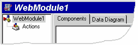
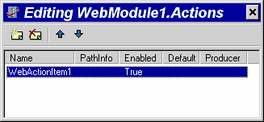

Hello ISAPI
===========

::: {.date}
01.01.2007
:::

Hello ISAPI

© Delphi Web Development

На этой страничке вы узнаете как создать и запустить простейшее ISAPI
приложение сервера.

1\. Запустите Delphi, нажмите на меню File \| New

2\. В диалоговом окне New Items выберите Web Server Application и нажмите
OK

3\. Появится диалоговое окно New Web Server Application. Пункт
ISAPI/NSAPI Dynamic Link Library выбран по умолчанию, поэтому просто
нажмите OK.

4\. Вы попали в интерактивную среду разработки ISAPI расширения сервера.

{.center}

В вашем проекте содержится специальный модуль WebModule, он позволяет
помещать в него различные компоненты и обеспечивает работу с ними.

5\. Дважды щелкните мышкой на WebModule, появится окно Action Editor,
предназначенное для создания и редактирования обработчиков событий
ActionItem.

{.center}

6\. В диалоговом окне Action Editor нажмите кнопку Add New, при этом в
окне Object Inspector отобразятся свойства и события созданного
ActionItem.

7\. Установите свойство Default созданного ActionItem равным true.

8\. Создайте обработчик события OnAction для созданного ActionItem и
напишите в него код:

    Response.Content := '<html><body>Hello ISAPI!</body></html>';

У вас должен получиться код приведенный в примере 1.

Пример 1

    procedure TWebModule1.WebModule1WebActionItem1Action(Sender: TObject;
              Request: TWebRequest; Response: TWebResponse;
    
    var Handled: Boolean);
    
    begin
      Response.Content := '<html><body>Hello ISAPI!</body></html>';
    end;

9\. Нажмите на меню File \| Save All, выберите имена main.pas и
helloisapi.dpr для файлов проекта и сохраните их на диск.

10\. Нажмите на меню Project \| Build helloisapi. Будет скомпилирован
файл helloisapi.dll.

11\. Поместите полученный файл в каталог для ISAPI DLL вашего веб
сервера. Для IIS 4.0 это каталог /cgi-bin/. Проверьте установлено ли
право execute на этот каталог в веб сервере и установите доступ на
чтение и запуск для соответствующих пользователей в NTFS.

12. Запустите на выполнение ваше приложение, набрав в браузере полный
URL. Например, если ваш сервер имеет URL http://localhost, вы положили
DLL в каталог /cgi-bin/, то полный URL будет
[https://localhost/cgi-bin/helloisapi.dll.](https://localhost/cgi-bin/helloisapi.dll)
