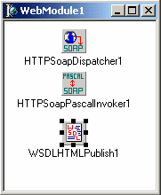
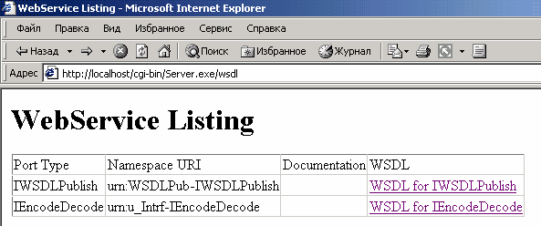
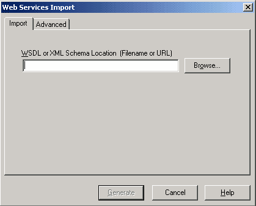
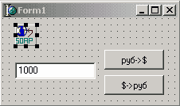

Использование Web Services
==========================

::: {.date}
01.01.2007
:::

Что такое Web Service

Последний вид приложений для Web, о котором я хочу рассказать в данном
цикле статей-- это Web Services. Web Service -- это приложение-сервер,
предоставляющее клиенту свои функции через протоколы Internet. В отличие
CGI и других подобных internet приложений, Web Services ориентируются не
на предоставление информации человеку в удобной для восприятия форме, а
на обмен информацией между приложениями.
Общение клиента и сервера осуществляется путем обмена сообщениями. Web
Service может представить клиенту описание своих возможностей в терминах
принимаемых и генерируемых им сообщений. При этом детали реализации
сервера скрыты от клиента. Таким образом, с точки зрения клиента Web
service представляется «черным ящиком», с определенной функциональностью
и заданными способами публикации описания этой функциональности. С
другой стороны серверу безразлично как именно клиент формирует сообщения
и использует полученные результаты. Налицо компонентно-ориентированный
подход.

Применение в качестве транспортного протокола доставки сообщений
протокола HTTP позволяет взаимодействовать клиента и сервера вне
зависимости от аппаратной платформы и ОС.

Протокол SOAP

Помимо транспортного протокола для вызова методов сервера необходим
единый протокол, описывающий формат сообщений вызова методов сервера. В
качестве такого протокола используется SOAP -- Simple Object Access
Protocol. Спецификация SOAP 1.1 можно найти в Web по адресу
www.w3.org/TR/SOAP. SOAP позволяет использовать вызов удаленных процедур
(RPC) через HTTP.

Запросы кодируются в формате XML. Это имеет свои достоинства и
недостатки. Достоинства:

::: {style="text-align: left; text-indent: 0px; padding: 0px 0px 0px 0px; margin: 7px 0px 7px 24px;"}
  --- -----------------------------------------------------------------
  ·   Легкость восприятия текста запроса человеком («читабельность»);
  --- -----------------------------------------------------------------
:::

::: {style="text-align: left; text-indent: 0px; padding: 0px 0px 0px 0px; margin: 7px 0px 7px 24px;"}
  --- ------------------------------------------------------------------------------------------------
  ·   Наличие парсеров XML, позволяющих достаточно просто осуществлять анализ поступающих сообщений.
  --- ------------------------------------------------------------------------------------------------
:::

Из недостатков можно отметить больший объем сообщений по сравнению с
бинарными форматами представления данных. Ниже представлен пример SOAP
запроса:

POST /examples HTTP/1.1
User-Agent: Radio UserLand/7.0 (WinNT)
Host: localhost:81
Content-Type: text/xml; charset=utf-8
Content-length: 474
SOAPAction: "/examples"

\<?xml version="1.0"?\>
\<SOAP-ENV:Envelope
SOAP-ENV:encodingStyle="http://schemas.xmlsoap.org/soap/encoding/"
xmlns:SOAP-ENC="http://schemas.xmlsoap.org/soap/encoding/"
xmlns:SOAP-ENV="http://schemas.xmlsoap.org/soap/envelope/"
xmlns:xsd="http://www.w3.org/1999/XMLSchema"
xmlns:xsi="http://www.w3.org/1999/XMLSchema-instance"\>
\<SOAP-ENV:Body\>
\<m:getStateName xmlns:m="http://www.soapware.org/"\>
\<statenum xsi:type="xsd:int"\>41\</statenum\>
\</m:getStateName\>
\</SOAP-ENV:Body\>

\</SOAP-ENV:Envelope\>

Рассмотрим заголовок запроса. Формат URI в первой строке запроса не
специфицирован. Например это может быть просто / или, как в нашем
примере /examples.
User Agent и Host должны быть указаны. Content-Type, т.е тип содержимого
запроса, естественно, text/xml. Content-Length - lлина запроса.
SoapAction -- значение данного поля используется для передачи сообщения
нужному обработчику сообщений сервера. Как правило, значение SoapAction
совпадает с URI в первой строке запроса.
Тело запроса представляет собой документ в формате XML. Корневой тег
SOAP-ENV:Envelop содержит внутри себя тег SOAP-ENV:Body, содержащий
описание вызываемой процедуры. В нашем примере сообщение описывает
запрос на вызов процедуры getStateName с параметром statenum равным 41.

Ответ сервера при успешном вызове выглядит так:

HTTP/1.1 200 OK
Connection: close
Content-Length: 499
Content-Type: text/xml; charset=utf-8
Date: Wed, 28 Mar 2001 05:05:04 GMT
Server: UserLand Frontier/7.0-WinNT

\<?xml version="1.0"?\>
\<SOAP-ENV:Envelope
SOAP-ENV:encodingStyle="http://schemas.xmlsoap.org/soap/encoding/"
xmlns:SOAP-ENC="http://schemas.xmlsoap.org/soap/encoding/"
xmlns:SOAP-ENV=http://schemas.xmlsoap.org/soap/envelope/
xmlns:xsd=http://www.w3.org/1999/XMLSchema
xmlns:xsi="http://www.w3.org/1999/XMLSchema-instance"\>
\<SOAP-ENV:Body\>
\<m:getStateNameResponse xmlns:m="http://www.soapware.org/"\>
\<Result xsi:type="xsd:string"\>South Dakota\</Result\>
\</m:getStateNameResponse\>
\</SOAP-ENV:Body\>

\</SOAP-ENV:Envelope\>

Отметим лишь наиболее важные моменты:

::: {style="text-align: left; text-indent: 0px; padding: 0px 0px 0px 0px; margin: 7px 0px 7px 24px;"}
  --- ----------------------------------------------------------------------------------------------------------------------------------------------------------------
  ·   Пространство имен в описании ответа (тег \< m:getStateNameResponse \>) должен совпадать с пространством имен в запросе. В нашем примере пространство имен -- m
  --- ----------------------------------------------------------------------------------------------------------------------------------------------------------------
:::

::: {style="text-align: left; text-indent: 0px; padding: 0px 0px 0px 0px; margin: 7px 0px 7px 24px;"}
  --- -----------------------------------------------------------------------------------------------------------------------------------------
  ·   Имя тега описания ответа формируемся добавлением слова Response к имени вызываемой процедуры. В нашем случае это m:getStateNameResponse
  --- -----------------------------------------------------------------------------------------------------------------------------------------
:::

Разработка сервера Web Services в Delphi6

Delphi 6 позволяет создавать как сервера, так и клиентов Web Services.
Мы начнем рассмотрение с создания сервера.

Создание сервера Web Services в Delphi6 состоит из следующих этапов:

::: {style="text-align: left; text-indent: 0px; padding: 0px 0px 0px 0px; margin: 7px 0px 7px 24px;"}
  ---- ------------------------------------------------------------------------------------------
  1.   Описание интерфейса сервера, то есть методов, которые будут доступны для вызова клиенту;
  ---- ------------------------------------------------------------------------------------------
:::

::: {style="text-align: left; text-indent: 0px; padding: 0px 0px 0px 0px; margin: 7px 0px 7px 24px;"}
  ---- -----------------------------
  1.   Реализация методов сервера;
  ---- -----------------------------
:::

::: {style="text-align: left; text-indent: 0px; padding: 0px 0px 0px 0px; margin: 7px 0px 7px 24px;"}
  ---- ---------------------------------------------------------------------------
  1.   Создание проекта Delphi и включение в него результатов первых двух шагов.
  ---- ---------------------------------------------------------------------------
:::

Последовательно опишем каждый из этапов.

Описание интерфейса сервера

В Delphi при создании сервера Web Services методы доступные для вызова
клиенту описываются в виде invokable интерфейсов. Invokable интерфейс --
это интерфейс для методов которого доступна RTTI (информация о типах на
этапе выполнения). Для того чтобы из обычного интерфейса сделать
invokable достаточно указать директиву компиляции {$M+}. После этого
все потомки и сам интерфейс будут содержать RTTI. В иерархии VCL уже
есть такой интерфейс IInvokable. Таким образом, при написании сервера
проще всего унаследовать свой интерфейс от Iinvokable. Кроме того
необходимо зарегистрировать свой интерфейс в invocation registry.
Регистрация позволяет серверу определить класс, реализующий методы
интерфейса, а клиенту получить описание методов, поддерживаемых
сервером. Регистрация осуществляется вызовом метода
InvRegistry.RegisterInterface в секции initialization модуля.
Так как интерфейс используется не только сервером, но и клиентом, то
желательно определить его в отдельном модуле Delphi.

Для примера мы разработаем сервер, который будет осуществлять пересчет
денег из долларов в рубли и обратно. В IDE Delphi выберем пункт меню
File/New/Unit. В полученном пустом модуле определим интерфейс сервера:

    unit u_Intrf;
    interface
    type
      IEncodeDecode = interface(IInvokable)
     
        ['{32B3312E-684C-444D-88DB-13DE6F535F6D}']
        // Конвертация долларов в рубли
        function US2RUS(Value: Currency): Currency; stdcall;
        // Конвертация рублей в доллары
        function RUS2US(Value: Currency): Currency;
    stdcall;
    end;
     
    implementation
    uses  InvokeRegistry;
     
    initialization
      InvRegistry.RegisterInterface(TypeInfo(IEncodeDecode));
    end.

Обратите внимание, что строка
[\'{32B3312E-684C-444D-88DB-13DE6F535F6D}\'] -- это GUID интерфейса,
для корректной работы примера Вам необходимо сгенерировать его, а не
вводить вручную или копировать из приведенного текста. Генерация GUID в
IDE Delphi вызывается нажатием Ctrl+Shift+G.

В случае использования в функциях интерфейсе скалярных типов данных
генерация SOAP сообщений происходит автоматически без дополнительных
усилий со стороны программиста. Если же Вы хотите использовать сложные
типы данных, такие как статические массивы, наборы и классы, то
необходимо создать и зарегистрировать класс-наследник от TRemotableXS и
переопределить методы XSToNative и NativeToXS. Данные методы
конвертируют строковое и бинарное представление Ваших данных друг в
друга.

Реализация методов сервера

Наиболее простым способом реализации интерфейса на сервере является
создание и регистрация в invocation реестре класса-наследника от
TInvokableClass. Класс TInvokableClass имеет две замечательные
особенности:

::: {style="text-align: left; text-indent: 0px; padding: 0px 0px 0px 0px; margin: 7px 0px 7px 24px;"}
  --- --------------------------------------------------------------------------------------------------------------------------------------
  ·   Invocation реестр знает о том, как создать экземпляр этого класса и его наследников при запросе клиентом вызовов методов интерфейса.
  --- --------------------------------------------------------------------------------------------------------------------------------------
:::

::: {style="text-align: left; text-indent: 0px; padding: 0px 0px 0px 0px; margin: 7px 0px 7px 24px;"}
  --- --------------------------------------------------------------------------------------------------------------------------------------------------------------------------
  ·   Так как класс TinvokableClass наследник TInterfacedObject, то он умеет освободить память в случае, когда число ссылок на него равно 0, что облегчает программисту жизнь.
  --- --------------------------------------------------------------------------------------------------------------------------------------------------------------------------
:::

Текст модуля реализации представлен ниже, комментарии излишни:

    unit u_Impl;
     
    interface
    uses InvokeRegistry, u_Intrf;
    type
      TEncodeDecode = class(TInvokableClass, IEncodeDecode)
      protected
        function US2RUS(Value: Currency): Currency; stdcall;
        function RUS2US(Value: Currency): Currency; stdcall;
      end;
     
    implementation
     
    { TEncodeDecode }
     
    function TEncodeDecode.RUS2US(Value: Currency): Currency;
    begin
      Result := Value / 30;
    end;
     
    function TEncodeDecode.US2RUS(Value: Currency): Currency;
    begin
      Result := Value * 30;
    end;
     
    initialization
      InvRegistry.RegisterInvokableClass(TEncodeDecode);
    end.

В случае, если Вы не хотите наследовать класс от TInvokableClass,
необходимо создать и зарегистрировать метод-фабрику класса, который
сможет создавать экземпляры Вашего класса. Метод должен быть типа
TCreateInstanceProc = procedure(out obj: TObject); При этом экземпляр
должен уметь ликвидировать себя, если количество ссылок использующих его
клиентов станет нулевым. При регистрации такого класса методу
InvRegistry.RegisterInvokableClass вторым параметром необходимо передать
имя метода-фабрики класса.

Создание проекта приложения Web Services в Delphi

Остался последний шаг -- создание проекта приложения. В IDE выберем
пункт меню File/New/Other и с закладки WebServices значок SOAP Server
Application. Будет выведен диалог выбора формата приложения Web
Services. Мы выберем CGI формат. При этом будет создан проект с Web
модулем, содержащим три компонента: HTTPSoapDispatcher,
HTTPSoapPascalInvoker, WSDLHTMLPublish.

THTTPSoapDispatcher получает и обрабатывает SOAP сообщения,
перенаправляя их invoke интерфейсам, зарегистрированным в приложении.
Таким образом, THTTPSoapDispatcher является диспетчером, ответственным
за прием, распределение и отправку SOAP сообщений.

Интрепретация запросов и вызов методов интерфейсов осуществляется другим
компонентом, указанным в свойстве Dispatcher (HTTPSoapPascalInvoker1).
THTTPSoapDispatcher автоматически регистрирует себя в Web модуле, как
автодиспетчера. При этом все запросы передаются THTTPSoapDispatcher, что
избавляет Вас от необходимости создавать обработчики запросов Web
модуля.

{.center}

WSDLHTMLPublish1 -- данный компонент генерирует и выдает по запросу
клиента описание интерфейса сервера.
Далее в проект необходимо подключить файлы с описанием и реализацией
интерфейса. Для этого в IDE выберем пункт меню Project/Add to project и
появившемся диалоге выберем модули с описанием и реализацией методов
интерфейса. Можно откомпилировать проект и поместить полученный
исполняемый файл в директорию для CGI скриптов Web сервера.

Сервер готов к работе.

Разработка клиента Web Services в Delphi6

Условно разработку клиента можно разбить на две части:

::: {style="text-align: left; text-indent: 0px; padding: 0px 0px 0px 0px; margin: 7px 0px 7px 24px;"}
  ---- ---------------------------------------
  1.   Получение описания интерфейса сервера
  ---- ---------------------------------------
:::

::: {style="text-align: left; text-indent: 0px; padding: 0px 0px 0px 0px; margin: 7px 0px 7px 24px;"}
  ---- ---------------------------------------
  1.   Написания кода вызова методов сервера
  ---- ---------------------------------------
:::

В случае разработки сервера на Delphi существует модуль с описанием
интерфейса сервера на языке Object Pascal, т.е первый этап может быть
пропущен. В случае если сервер был разработан с использованием других
языков или модуль с описанием интерфейса не доступен, необходимо
получить описание интерфейса в формате WSDL или XML.
Первый вариант -- это попросить файл с описанием у разработчиков, второй
сгенерировать описание самому.

Для этого достаточно запустить Web браузер в строке адреса набрать:
http://\<имя сервера\>/\<папка с CGI\>/\<имя приложения сервера\>/wsdl.
В нашем примере я, разместил сервер на локальной машине, web сервер
Apache, строка адреса в этом случае
http://localhost/cgi-bin/Server.exe/wsdl . При этом на экран будет
выведена таблица с описанием интерфейсов сервера.

{.center}

Необходимо выбрать в таблице интересующий нас интерфейс IEncodeDecode
при этом будет сгенерировано описание интерфейса в формате xml.
\<?xml version="1.0" ?\>
\<definitions xmlns="http://schemas.xmlsoap.org/wsdl/"
xmlns:xs="http://www.w3.org/2001/XMLSchema"name="IEncodeDecodeservice"targetNamespace="http://www.borland.com/soapServices/"
xmlns:tns="http://www.borland.com/soapServices/"
xmlns:soap="http://schemas.xmlsoap.org/wsdl/soap/"
xmlns:soapenc="http://schemas.xmlsoap.org/soap/encoding/"\>
\<messagename="US2RUSRequest"\>
\<part name="Value"type="xs:double" /\>
\</message\>
\<messagename="US2RUSResponse"\>
\<part name="return"type="xs:double" /\>
\</message\>
\<messagename="RUS2USRequest"\>
\<part name="Value"type="xs:double" /\>
\</message\>
\<messagename="RUS2USResponse"\>
\<part name="return"type="xs:double" /\>
\</message\>
\<portTypename="IEncodeDecode"\>
\<operationname="US2RUS"\>
\<input message="tns:US2RUSRequest" /\>
\<output message="tns:US2RUSResponse" /\>
\</operation\>
\<operationname="RUS2US"\>
\<input message="tns:RUS2USRequest" /\>
\<output message="tns:RUS2USResponse" /\>
\</operation\>
\</portType\>
\<bindingname="IEncodeDecodebinding"type="tns:IEncodeDecode"\>
\<soap:binding
style="rpc"transport="http://schemas.xmlsoap.org/soap/http" /\>
\<operationname="US2RUS"\>
\<soap:operation soapAction="urn:u\_Intrf-IEncodeDecode#US2RUS" /\>
\<input\>
\<soap:body
use="encoded"encodingStyle="http://schemas.xmlsoap.org/soap/encoding/"namespace="urn:u\_Intrf-IEncodeDecode"
/\>
\</input\>
\<output\>
\<soap:body
use="encoded"encodingStyle="http://schemas.xmlsoap.org/soap/encoding/"namespace="urn:u\_Intrf-IEncodeDecode"
/\>
\</output\>
\</operation\>
\<operationname="RUS2US"\>
\<soap:operation soapAction="urn:u\_Intrf-IEncodeDecode#RUS2US" /\>
\<input\>
\<soap:body
use="encoded"encodingStyle="http://schemas.xmlsoap.org/soap/encoding/"namespace="urn:u\_Intrf-IEncodeDecode"
/\>
\</input\>
\<output\>
\<soap:body
use="encoded"encodingStyle="http://schemas.xmlsoap.org/soap/encoding/"namespace="urn:u\_Intrf-IEncodeDecode"
/\>
\</output\>
\</operation\>
\</binding\>
\<servicename="IEncodeDecodeservice"\>
\<portname="IEncodeDecodePort"binding="tns:IEncodeDecodebinding"\>
\<soap:address
location="http://localhost/cgi-bin/Server.exe/soap/IEncodeDecode" /\>
\</port\>
\</service\>
\</definitions\>

Сохраните его в файл Client.xml. Итак, тем или иным способом файл с
описанием в формате xml оказался у нас в руках, теперь необходимо
экспортировать его в Delphi. При экспорте будет сгенерирован модуль
Delphi с описанием интерфейса на языке Object Pascal. Выберем пункт меню
File/New/Other, перейдем на закладку WebServices и выберем иконку Web
Services Importer. При этом на экране появится диалог импорта описания.

{.center}

Используя кнопку Browse диалога, укажем полученный ранее файл
Client.xml, и нажмем кнопку Generate. Опа и модуль Delphi с описанием
интерфейса готов. Переходим ко второму этапу -- непосредственному
созданию клиента. Создадим заготовку нового приложения --
File/New/Application. На главной форме разместим строку ввода, две
кнопки и компонент HTTPRIO с закладки WebServices.

{.center}

Компонент HTTPRIO предназначен для вызова серверов через SOAP. Укажем в
свойстве URL значение
http://localhost/cgi-bin/Server.exe/soap/IEncodeDecode, т.е путь к
серверу.

Далее включим в проект модуль Delphi с описанием интерфейса сервера и
укажем его в секции uses главной формы проекта. Теперь можно переходить
к написанию кода вызова методов сервера. Обработчик события нажатия на
кнопку с заголовком руб-\>$ будет выглядеть так:

    procedure TForm1.Button1Click(Sender: TObject);
    var
      X:IEncodeDecode;
      R:Currency;
    begin
      X:=HTTPRIO1 as IEncodeDecode;
      R:=X.RUS2US(StrToCurr(Edit1.Text));
      ShowMessage(CurrToStr(R)+'$');
    end;

По аналогии код нажатия на кнопку с заголовком $-\>руб:

    procedure TForm1.Button2Click(Sender: TObject);
    var
      X:IEncodeDecode;
      R:Currency;
    begin
      X:=HTTPRIO1 as IEncodeDecode;
      R:=X.US2RUS(StrToCurr(Edit1.Text));
      ShowMessage(CurrToStr(R)+'руб.');
    end;

Осталось запустить проект на выполнение и убедиться в его
работоспособности. В данной статье мы рассмотрели лишь самый простой
пример. Надеюсь, она станет для Вас хорошим стартом в освоении новых Web
технологий.

Автор: Mike Goblin

<https://www.delphimaster.ru>
