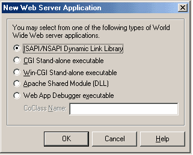
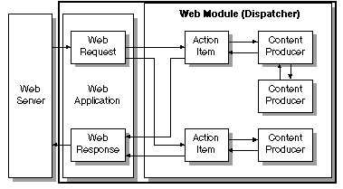
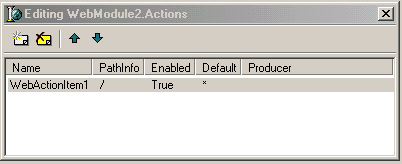
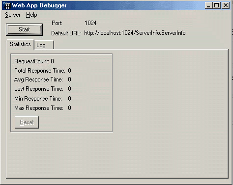
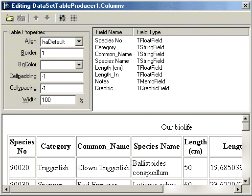
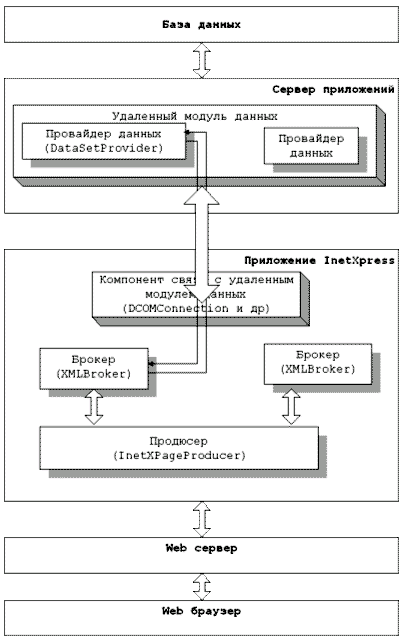
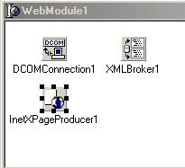
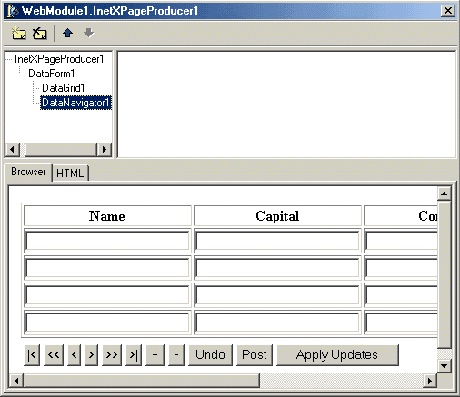
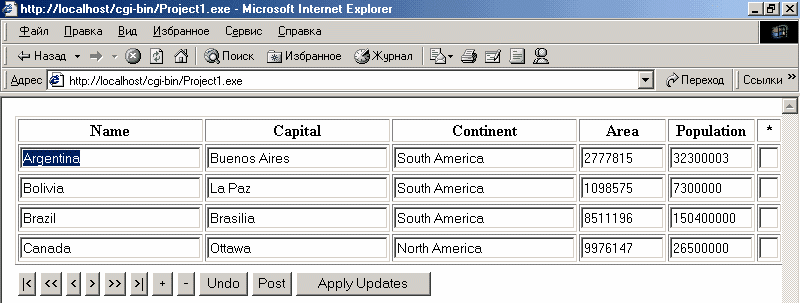

Эволюция средств разработки веб-приложений в Delphi
===================================================

**Введение**

Бурный рост интернета в последние годы привел к возможности и
необходимости создания информационных систем, не требующих настройки и
обслуживания на стороне клиента и при этом обеспечивающих одновременную
работу большого количества пользователей. Сложность бурно развивающихся
систем электронной торговли и обслуживания через интернет постоянно
возрастает. Сегодня только отображение информации в виде гипертекста уже
не может удовлетворить возрастающие требования пользователей
информационных систем. Очевидно, что сложившаяся ситуация привела к
необходимости создания инструментов разработки информационных систем
нового поколения. Большинство новаций недавно вышедшей шестой версия
Delphi, по заявлениям самой Borland, касаются создания Web приложений.

На сегодня существуют, как минимум, три технологии разработки Web
приложений в Delphi. Разнообразие средств создания Web приложений
явилось следствием эволюции как самих подходов к разработке
информационных систем для Web, так и совершенствованием технологии
реализации этих подходов в Delphi.

Под Web приложениями мы будем понимать приложения, использующие WEB
браузер для вывода информации пользователю, либо задействующие протоколы
интернета (в основном http) для получения этой информации с сервера.

В данной статье мы попытаемся рассмотреть спектр технологий,
предлагаемый Borland, расположив их в хронологическом порядке появления
их в Delphi.

- Web broker
- Web Snap
- Web Services

Технология Web broker была первой попыткой Borland представить
инструментарий для разработки приложений, работающих через Internet. Она
позволяет создавать приложения, расширяющие функциональность web
серверов, однако не дает больших преимуществ по сравнению с другими
языками программирования, такими как Perl или PHP. Осознавая это,
Borland в новой версии Delphi представила на суд разработчиков две новые
технологии Web Snap и Web Services. Технология Web Snap - это попытка
предложить разработчикам удобный набор компонентов для решения типовых
задач, возникающих при создании Web приложений, работающих под
управлением Web сервера. Она призвана заменить технологию Web broker.
Web services - это набор компонентов для создания приложений,
использующих возможности интернета для обмена информацией между
приложениями. При обмене используется протокол SOAP, который не привязан
к какой-либо платформе или языку. Данный подход реализует объектную
идеологию в разработке информационных систем, и является перспективным
направлением, по которому, скорее всего, пойдет дальнейшее
совершенствование технологий в данной области.

В первой части статьи мы рассмотрим технологии, которые были доступны
еще в Delphi 5. Во второй части будут рассмотрены новые технологии,
появившиеся в Delphi 6. Помимо Delphi для демонстрации работы примеров
автор использовал Internet Explorer и Web сервер Apache на платформе
Windows.

**Форматы приложений для WEB**

|Формат приложения|Описание|
|--------|--------|
|Microsoft Server DLL (ISAPI), Netscape Server DLL (NSAPI)|Web приложение представляет собой dll, которая загружается Web сервером в память. Запросы клиентов обрабатываются в отдельных потоках. ISAPI работает на Web сервере IIS (от Microsoft), NSAPI - на сервере Netscape |
|Apache Server DLL|Динамический модуль Web сервера Apache. На платформе Windows - dll. Приложение взаимодействует с ядром Apache через специальный API. Запросы клиентов обрабатываются в отдельных потоках. Приложения данного типа с помощью перекомпиляции в Kylix могут быть перенесены на платформу Linux.|
|Stand alone CGI|Консольные приложение, получающее запросы клиента через стандартный поток ввода и выдающий результат в стандартный поток вывода. Запросы клиента выполняются отдельным экземпляром приложения. Поддерживается практически всеми Web серверами. Приложения данного типа с помощью перекомпиляции в Kylix могут быть перенесены на платформу Linux.|
|Windows CGI application|Приложение Windows, получающее запросы через ini файл, создаваемый Web сервером и записывающее результаты работы в файл, который Web сервер передает обратно клиенту.|
|Web debugger application|Web debugger - это специальная программа в составе Delphi 6, которая эмулирует работу Web сервера. Позволяет проводить мониторинг работы приложения. Используется для отладки приложений. После отладки приложение должно быть конвертировано в один из вышеописанных форматов.|

**Web Broker**

Данная технология появилась еще в 4-ой версии Delphi. Назначение
технологии - разработка приложений, расширяющих возможности существующих
Web серверов. Разработка приложений в данной технологии сводится к
определению возможных запросов пользователя и написании обработчиков
этих запросов. К достоинствам технологии можно отнести переносимость на
Kylix и простоту. Недостатки - фактически невизуальный процесс
разработки приложения. Компоненты, относящиеся к данной технологии,
расположены на закладке Internet IDE Delphi.

**Первые шаги**

Итак, попробуем разработать наше первое Web приложение. В IDE Delphi
выберем пункт меню File/New/Other. В появившемся диалоге на закладке New
выберем пункт Web Server Application. Нам будет предложено выбрать
формат создаваемого приложения.

{.center}

Выберем пункт Web App Debuger executable и в поле ввода CoClassName
введем HelloWebApp. Delphi сгенерирует нам заготовку проекта. В состав
проекта будет входить: " Unit1.pas - в нем описывается форма From1.
Форма не несет никакой функциональной нагрузки в приложении. Ее наличие
вызвано особенностями реализации Web App Debuger. " Unit2.pas - модуль,
содержащий описание Web Module - центрального элемента нашего
приложения. Тут самое время рассказать о структуре приложения Web
Broker.

{.center}

Web приложение, получив запрос от сервера создает объект типа
TwebRequest, содержащий параметры клиентского запроса и объект типа
TWebResponse, который будет содержать запрошенную информацию. Затем эти
объекты передаются диспетчеру (Web модулю или компоненту TWebDispatcher,
если отсутствует Web модуль). Диспетчер анализирует параметры
поступившего запроса и вызывает обработчик, определенный программистом
для данного запроса (Action Item). Обработчик отвечает за заполнение
ответа данными. В обработчике для получения запрошенных клиентом данных
могут использоваться компоненты, генерирующие динамическую информацию на
основе заданного шаблона и поступивших в запросе данных (Content
producer). По окончании работы обработчика диспетчер передает данные
(Web Response) веб серверу, а тот в свою очередь клиенту.

Теперь, вооруженные теорией, вернемся к практике. Очевидно, что нам
необходимо определить в Web модуле хотя бы один обработчик события. Для
этого правой кнопкой мыши щелкнем на нашем модуле и в контекстном меню
выберем пункт Action Editor. Перед нами появится окно редактора
обработчиков. Кнопкой "Add New" добавим новый обработчик
WebActionItem1.

{.center}

В Инспекторе объектов установим следующие свойства обработчика:
Default - использовать обработчик по умолчанию - true. В этом случае обработчик
вызывается если нет явного обработчика запроса с данными параметрами.
Можно назначить один обработчик по умолчанию для Web модуля. PachInfo -
путь обработчика, часть URL адреса после имени программы, за разбор
которого осуществляет данный обработчик. Так,например, для обработки
URL http://localhost/cgi-bin/Project1.exe/mypath, свойство PathInfo
обработчика должно быть /mypath. Для нашего случая установим данное
свойство в значение "/". Далее необходимо написать код обработчика, для
этого в обработчике события OnAction WebActionItem1 введем следующий
код: `Response.Content:='Hello,world!';`

Запустим на выполнение
созданное приложение (F9). На экране появится форма Form1.

В IDE Delphi
выберем пункт меню Tools/Web App Debuger, при этом на экране появится
главная форма отладчика.

{.center}

После нажатия кнопки "Start" надпись http://localhost:1024/...
подсветится синим. Левой кнопкой мыши выберем эту надпись при этом будет
запущен Web броузер и в его окне выведен список приложений, доступных
для отладки. В списке выберем пункт Project1.HelloWebApp (наше
приложение) и нажмем кнопку Go. В окне броузера мы увидим результат
работы нашего приложения - "Hello, world!".

Присмотревшись к коду обработчика события OnAction WebActionItem1, мы
видим, что содержание ответа формируется "вручную". При этом очень
часто приходится анализировать поля переменных классов TWebResponse и
TWebRequest. Ниже приведено описание и назначение наиболее часто
используемых полей данных классов.

Поле		|Тип	|Описание
----------------|-------|---------------------
**TWebRequest**	|	|
Host		|String	|Имя сервера, на котором выполняется скрипт
ScriptName	|String	|URL путь к скрипту
Request.Method	|String	|Метод вызова скрипта
RemoteAddr	|String	|Имя компьютера, вызвавшего скрипт
UserAgent	|String	|Пользовательский браузер
ContentFields, QueryFields	|TStrings	|Параметры и их значения, переданные запросу
**TWebResponse**	|	|
Server		|String	|Вид веб сервера
ContentType	|Sting	|Тип содержимого страницы
Content		|String	|Ответ, сформированный скриптом
ContentStream	|TStream|Ответ, сформированный скриптом. Используется в случае передачи двоичных данных

В качестве иллюстрации использования описанных полей приведу следующий
код обработчика OnAction WebActionItem1:

    Response.Content:='<HTML><BODY> Host:'+Request.Host+' '+
                      'Скрипт: '+Request.ScriptName + ' '+
                      'Метод: '+Request.Method+' '+
                      'Remote address: '+Request.RemoteAddr+' '+
                      'Броузер: '+Request.UserAgent+' ';
    if Request.ContentFields.Count > 0 then
    begin
      Response.Content:=Response.Content+'Параметры: Кол-во:'+
            IntToStr(Request.ContentFields.Count)+' ';
      for Cnt:=0 to Request.ContentFields.Count-1 do
      begin
        Response.Content:=Response.Content+Request.ContentFields[Cnt]+' ';
      end;
    end else
    begin
      Response.Content:=Response.Content+'Параметры: Кол-во:'+
            IntToStr(Request.QueryFields.Count)+' ';
      for Cnt:=0 to Request.QueryFields.Count-1 do
      begin
        Response.Content:=Response.Content+Request.QueryFields[Cnt]+' ';
      end;
    end;
    Response.Server:='Our soft';
    Response.Content:=Response.Content+'Веб сервер: '+Response.Server+' ';
    Response.Content:=Response.Content+'Тип содержимого: '+Response.ContentType+' ';
    Response.Content:=Response.Content+'<BODY/></HTML>';

Пользуясь данной методикой, можно создавать динамические html страницы,
а воспользовавшись компонентами доступа к данным, и отображать данные из
БД, однако, как говорится, есть способ лучше.

**Использование шаблонов**

Идея использования шаблонов для генерации html страниц позволяет
значительно упростить процесс генерации страницы. При этом программисту
необходимо лишь подставить вместо определенных тегов значения, а
размещение тегов и их группировку можно отдать на откуп дизайнерам. В
Delphi данная технология реализуется с помощью компонентов-продюсеров.
Добавим новый обработчик в наш веб модуль - WebActionItem2. Его путь
(PathInfo) установим в значение producer. Далее в веб модуль поместим
компонент PageProducer1. В свойстве HTMLDoc введем заготовку нашей
страницы:

    <HTML>
    <BODY>
    <#Phrase>
      Сейчас <#Date>
    </BODY>
    </HTML>

Как легко догадаться это обычный html документ с двумя тегами
\<#Phrase\> и \<#Date\> Свойство Producer WebActionItem2 установим
равным PageProducer1. Два раза кликнем на PageProducer1 и введем код
обработчика события OnHTMLTag.

    procedure TWebModule2.PageProducer1HTMLTag(Sender: TObject; Tag: TTag;
      const TagString: String; TagParams: TStrings; var ReplaceText: String);
    begin
      if TagString = 'Phrase' then
      begin
       ReplaceText:='Hello, world';
      end else
     
      if TagString = 'Date' then
      begin
       ReplaceText:=DateToStr(Now)+' '+TimeToStr(Now);
      end;
    end;

Думаю, что пространные комментарии излишни. Просто в конец адреса
скрипта в окне броузера добавьте /producer. Помимо компонента
PageProducer для публикации информации из базы данных можно использовать
компоненты DataSetTableProducer - публикация данных из БД в табличной
форме из потомков TDataSet QueryDataSetProducer, SQL
QueryDataSetProducer - публикация данных из параметрических запросов,
значения параметров берутся из HTTP запроса. Для демонстрации работы с
БД добавим в WebModule компоненты DataSetTableProducer1 и Table1. Ниже
приведены свойства данных компонентов, которые необходимо настроить

Свойство    |Значение    |Описание
------------|------------|---------------
Table1      |            | 
DatabaseName|DBDEMOS     |Псевдоним базы данных
TableName   |Biolife.db  |Имя таблицы БД из которой мы опубликуем данные
Active      |True        |Активность таблицы - доступность ее данных
DataSetTableProducer1 |  |
DataSet     |Table1      |Набор данных для отображения продюсером
Caption     |Our biolife |Заголовок страницы

Далее двойным кликом мыши на продюсере можно вызвать редактор параметров
таблицы и настроить необходимые атрибуты отображения полей таблицы

{.center}

Осталось только добавить новый элемент-обработчик - WebActionItem3 и
установить ему PathInfo равным db, а Producer - DataSetTableProducer1.

Далее после написания основного кода приложения и его отладки можно
будет преобразовать наше Web приложение из формата Web debugger
application в формат пригодный для поставки пользователю. Для этого
необходимо будет создать новый проект Web приложения и выбрать
необходимый формат (я выбрал CGI, т.к при этом не возникает проблем
совместимости с веб серверами) и подключить отлаженный WebModule.

**InternetXpress**

Технология WebBroker позволяет легко отображать данные, в том числе из
БД в формате HTML. Однако при реализации процедур редактирования, ввода
и удаления записей приходится выполнять довольно большой объем ручного
кодирования. С другой стороны развитие концепции многоуровневых баз
данный приводит к мысли об использовании в качестве тонкого клиента
браузера. Все это стало толчком к расширению технологии построения web
приложений для интерактивной работы с БД через сервер приложений (сервер
бизнес логики). Данная технология получила название Internet Express и
была впервые реализована в Delphi5. Общая схема построения системы
приведена ниже. Достоинства технологии:

- Возможность построения web приложений для ввода, просмотра, редактирования, удаления информации в БД.
- Т.к логика работы с БД вынесена в сервер приложений,
  возможна реализация сложных бизнес правил работы с БД.
- Наряду с работой через браузер возможна реализация приложения - тонкого клиента
  в виде традиционного приложения для работы с БД через сервер приложений
  (с целью работы в локальной сети)

{.center}

Недостатки:

- Система становится распределенной,
  требуются дополнительные усилия по установке и администрированию сервера приложений.
- На сегодня доступна реализация серверов приложений только для платформы Windows.

Для построения WEB приложения нам понадобится создать программу сервер
бизнес логики. Я не буду здесь углубляться в тему построения серверов
приложений, просто приведу последовательность действий для создания
простейшего сервера приложений.

Начнем новый проект - меню File/New/New Application.

В проекте создадим удаленный модуль данных -
File/New/Other, закладка Multitier - элемент Remote DataModule.

В диалоге в поле ввода CoClassName пишем имя класса нашего модуля данных
MyRDM.

В удаленный модуль данных с закладки BDE (хотя никто не мешает
использовать другие способы доступа к БД) положим компоненты TSession и
TTable, с закладки Data Access компонент DataSetProvider. Установим
свойства этих компонентов следующим образом

Компонент        |Свойство
-----------------|----------------
**Session1**     |
AutoSessionName  |True
**Table1**       |
DataBaseName     |DBDEMOS
TableName        |country.db
**DataSetProvider1** |
DataSet          |Table1

Сохраним проект и запустим сервер на выполнение (F9). Сервер приложений
готов к использованию.

Теперь можно браться непосредственно за разработку Web приложения. Из
схемы построения приложения InetXPress видно, что связь с сервером
приложений организуется через компонент соединения (в нашем случае
DCOMConnection), получение и отправка пакетов с данными серверу
приложений осуществляется компонентом XMLBroker, а отображение
пользователю через браузер осуществляется компонентом InetXPageProducer.
XML брокер автоматически регистрирует себя в Web модуле, как компонент
реализующий диспетчеризацию запросов. Это снимает необходимость в
определении обработчиков всех возможных запросов в Web модуле для работы
с БД.

Как мы поступали ранее, в IDE Delphi выберем пункт меню File/New/Other.
В появившемся диалоге на закладке New выберем пункт Web Server
Application. Нам будет предложено выбрать формат создаваемого
приложения. По соображениям, высказанным ранее, выберем CGI формат. В
результате будет сгенерирована заготовка проекта с Web модулем
WebModule1.

Для связи с сервером приложений с закладки DataSnap поместим
в WebModule1 компонент DCOMConnection. Выберем из выпадающего списка
значение Project1.MyRDM (\<имя exe файла сервера приложений\>.\<имя
удаленного модуля в сервере приложений\>) для свойства ServerName
компонента DCOMConnection1.

Теперь можно активизировать связь с сервером
приложений, установив свойство Connected в true. При этом на экране
появится главная форма сервера приложений. Далее с закладки
InternetExpress поместим компоненты XMLBroker и InetXPageProducer. Ниже
приведено краткое описание часто используемых свойств и событий
компонента класса TXMLBroker.

{.center}

|Свойство или событие|Тип|Описание|
|--------|--------|--------|
|TXMLBroker| | |
|RemoteServer|TCustomRemoteServer|Компонент, представляющий соединение с сервером приложений|
|ProviderName|String|Провайдер данных, с которым работает данный брокер|
|Connected|Boolean|Активность брокера|
|MaxErrors|Integer|Максимально допустимое количество ошибок, возникающих при попытке изменения записей. При превышении данного порога возникает исключение|
|MaxRecords|Integer|Максимальное количество записей, включаемых в один пакет данных|
|ReconcileProducer|TCustomContentProducer|Продюсер страницы сообщения об ошибках|
|Params|TXMLParams|Параметры, которые передаются серверу приложений|
|BeforeDispatch|THTTPMethodEvent|HTML запроса XML брокером|
|AfterDispatch|THTTPMethodEvent|Событие окончания генерации ответа на запрос|
|OnGetErrorResponse|TGetErrorResponseEvent|Событие возникновения ошибки, применения изменения данных на сервере приложений apply updates error |

В компоненте XMLBroker1 установим следующие свойства:

RemoteServer - DCOMConnection1  
ProviderName - DataSetProvider1  
Connected - true

Теперь двойным щелчком мыши на компоненте InetXPageProducer1 вызовем его
редактор HTML страницы. В редакторе нажмем кнопку New Item и добавим
элемент DataForm. Выбрав добавленный элемент DataForm1, еще раз нажмем
кнопку New Item и добавим элемент DataGrid.

В инспекторе объектов,
выбрав элемент DataGrid1, установим свойство XMLBroker в значение
XMLBroker1. Таким образом, мы будем иметь возможность работать с данными
из БД, представленными в сетке данных.

Осталось только выбрать элемент
DataForm1 и нажав кнопку New Item добавить DataNavigator. Свойство
элемента DataNavigator1 XMLComponent установим в DataGrid1.

В результате
мы спроектировали HTML страничку для работы С БД, результат на рисунке

{.center}

В своей работе приложения InetXpress используют библиотеки JavaScript.
Данные библиотеки расположены в папке \<путь установки
Delphi\>\\Sources\\WebMidas. Желательно скопировать эти библиотеки в
какое-либо более доступное место на диске (я скопировал в c:\\jslib\\).
Для нормальной работы приложения необходимо указать путь к этим
библиотекам в свойстве IncludePathURL компонента InetXPageProducer1.
Далее создадим новый элемент в списке обработчиков событий Web модуля
(два раза кликнем мышью на свободном от компонентов месте Web модуля и в
диалоге нажмем кнопку Add New). В качестве продюсера установим
InetXPageProducer1, сделаем элемент обработчиком по умолчанию (свойство
Default установим в true).

Осталось откомпилировать наше приложение и полученный exe файл перенести
на Web сервер. Окно браузера с результатом наших усилий можно увидеть
ниже.

{.center}

