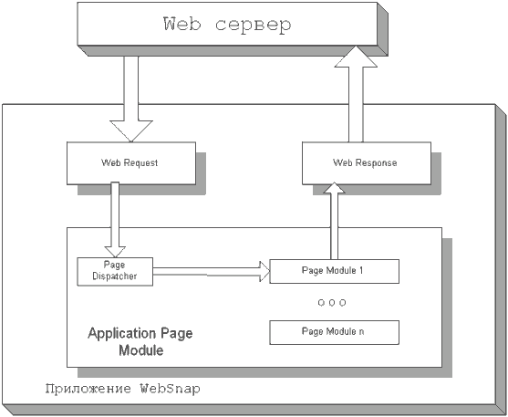
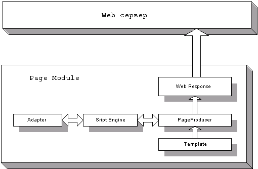
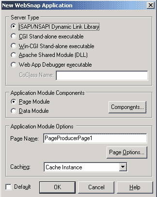
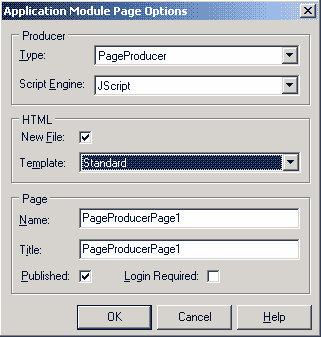
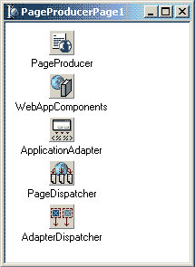
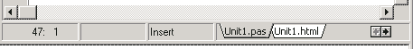
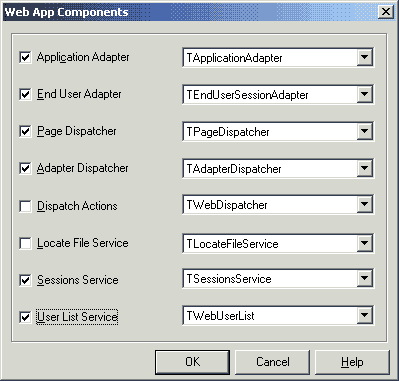
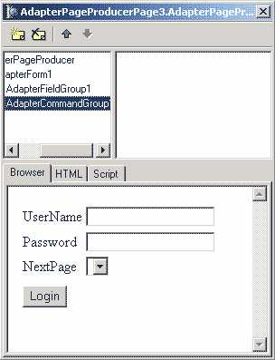
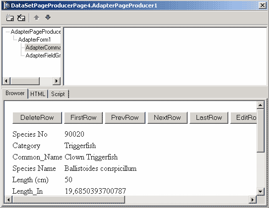

WebSnap
=======

::: {.date}
01.01.2007
:::

Итак, ура, мы добрались до новинок в Delphi 6. А именно, до набора
компонентов, называемого WebSnap, находящихся на одноименной закладке в
IDE Delphi.
Технология WebSnap является дальнейшим развитием технологии WebBroker,
еще более упрощающей разработку приложений для Web. Поддержка нескольких
Web модулей делает возможной разделить труд по разработке приложения
между несколькими разработчиками, возможность доступа к объектам модуля
из скрипта, выполняемого на стороне сервера дает возможность «оживить»
HTML страницы. Готовое приложение состоит из exe файла (или DLL в
зависимости от формата приложения ) и набора файлов с HTML шаблонами
страниц. Это позволяет вносить изменения в дизайн страниц без
перекомпиляции проекта, а также разделить труд программиста и
дизайнера.
Для программиста приложение WebSnap представляет собой набор модулей,
генерирующих информацию для отображения пользователю с помощью ряда
компонентов.Модули делятся на два типа:
1.Web Data Module -- модуль для хранения компонентов общих для других
модулей. В нем можно размещать невизуальные компоненты. Хорошая аналогия
-- модуль данных (Data Module) при разработке приложений баз данных.
Данный модуль представляет собой просто хранилище компонентов.
Содержимое его не отображается на этапе выполнения.
2.Web Page Module -- модуль страницы. Данный модуль представляет собой
контейнер для размещения компонентов и генерации одной HTML(или XML)
страницы приложения. В реализации модуля помимо файлов с расширением pas
и xfm, традиционных для любого модуля в Delphi, присутствует файл с
расширением html, в котором хранится шаблон HTML страницы для данного
модуля.

Общая архитектура приложения представлена ниже:

{.center}

Назначение Web Request и Web Response тоже, что и в технологии Web
Broker. Далее Page Dispatcher (диспетчер страниц) анализирует запрос и
на основании пути запроса решает, какому модулю (Page module)он должен
быть передан для дальнейшей обработки. Модуль генерирует запрошенную
информацию, которая и отображается затем пользователю. Все гениальное
просто.

Более подробная схема работы модуля страницы (Page Module) приведена
ниже. HTML страница генерируется компонентом-продюсером на основании
шаблона страницы. Шаблон страницы может содержать вставки со скриптами.
Программист имеет возможность из скрипта обращаться к WebSnap
компонентам приложения. Скрипт транслируется скриптовой машиной (Script
Engine) в вызовы методов и свойств компонентов-адаптеров. Адаптеры
являются мостом между приложением и скриптом в HTML странице.

{.center}

Что касается компонентов, то все компоненты с закладки WebSnap, как и
следует ожидать, можно разделить на:

::: {style="text-align: left; text-indent: 0px; padding: 0px 0px 0px 0px; margin: 7px 0px 7px 24px;"}
  --- --------------------------------------------------------------------------------------------------------------------------------------------------------------------------------------------------------------------------------------------------------------------------------------------------------------------------------------------------------------------------------------------------------------
  ·   Диспетчеры -- компоненты, отвечающие за разбор запросов пользователя на получение информации и передачу этих запросов другим компонентам для генерации содержимого ответа и передачу запрошенной информации обратно клиенту. Представлены двумя компонентами. Первый PageDispatcher -- его задача анализ HTTP запросов (см. схему выше). Второй AdapterDispatcher -- его задача передача запросов адаптерам.
  --- --------------------------------------------------------------------------------------------------------------------------------------------------------------------------------------------------------------------------------------------------------------------------------------------------------------------------------------------------------------------------------------------------------------
:::

::: {style="text-align: left; text-indent: 0px; padding: 0px 0px 0px 0px; margin: 7px 0px 7px 24px;"}
  --- ----------------------------------------------------------------------------------------------------------------------------------------------------------------------------------
  ·   Адаптеры -- компоненты, позволяющие вам обращаться к свойствам объектов приложения из скриптового языка на стороне сервера, теги которого размещаются в тексте шаблона страницы.
  --- ----------------------------------------------------------------------------------------------------------------------------------------------------------------------------------
:::

::: {style="text-align: left; text-indent: 0px; padding: 0px 0px 0px 0px; margin: 7px 0px 7px 24px;"}
  --- ----------------------------------------------------------------------------------------------------------
  ·   Продюсеры -- компоненты, которые умеют генерировать динамическую информацию на основе заданного шаблона.
  --- ----------------------------------------------------------------------------------------------------------
:::

::: {style="text-align: left; text-indent: 0px; padding: 0px 0px 0px 0px; margin: 7px 0px 7px 24px;"}
  --- ------------------------------------
  ·   Другие вспомогательные компоненты.
  --- ------------------------------------
:::

Первый проект

А пока мы попробуем соорудить наш первый проект с использованием
технологии WebSnap. Для этого выберем пункт меню File/New/Other в
появившемся диалоге мы перейдем на закладку WebSnap. При этом мы увидим
три пункта: WebSnap Application, WebSnap Data Module, WebSnap Page
Module. Зачем нужен первый пункт, я думаю, вы догадались -- он вызывает
мастера создания WebSnap приложения. Второй пункт, WebSnap Data Module,
позволяет добавить в проект модуль данных. Третий пункт WebSnap Page
Module -- для генерации заготовки модуля страницы.

Итак, выберем пункт WebSnap Application. При этом появится диалог
мастера создания приложения WebSnap.

{.center}

Первая группа параметров Sever type позволяет выбрать формат приложения.
Эти форматы были описаны в первой части статьи. Мы выберем формат CGI
stand-alone executable.
Вторая группа -- Application Module Components предназначена для выбора
компонентов, которые будут размещены в основном модуле приложения и вид
данного модуля. Можно выбрать один из двух видов модулей: Page Module
или Data Module. Назначение их было описано выше, отметим только, что
слово Application в названии указывает на то, что модуль будет главным в
приложении. Далее, нажав кнопку Components, мы увидим диалог выбора
компонентов, которые будут размещены в модуле приложения. Пока мы не
разобрались с назначением компонентов, мы оставим там все без
изменений.

Третья группа параметров позволяет настроить параметры основного модуля
приложения. Первый параметр Page Name позволяет указать имя страницы
модуля (доступен лишь для типа модуля Page Module). Второй параметр
Caching позволяет задать режим кэширования нашего приложения. По
умолчанию параметр имеет значение Cache Instance, т.е разрешить
кэширование. Второе возможное значение Destroy Instance отключает
кэширование. Мы так же оставим данный параметр без изменения. Кнопка
Page Options вызывает диалог настроек параметров модуля приложения,
изображенный ниже.

{.center}

Рассмотрим этот диалог. Группа параметров Producer позволяет выбрать тип
продюсера страницы (строка ввода Type) и скриптовый язык (JScript или
VBasic). Вторая группа HTML позволяет указать шаблон для генерации HTML
страницы. Третья группа параметров позволяет настроить параметры
страницы имя, заголовок, видимость (параметр published) и необходимость
аутентификации пользователя для просмотра данной страницы (параметр
Login Required). Имя дублирует параметр Page Name предыдущего диалога.
Опять же пока мы в данном диалоге оставим все без изменений.

Нажав кнопку ОК в обоих диалогах, мы получим заготовку приложения.
Заготовка включает всего один модуль -- Unit1. В нем содержится описание
главного модуля приложения с именем PageProducerPage1.

{.center}

Теперь осталось сохранить и скомпилировать проект (Ctrl-F9) и полученный
исполняемый файл и шаблон страницы Unit1.html разместить на Web сервере
в директории для скриптов. Запустим Web броузер и в строке адреса
наберем http://localhost/cgi-bin/Project1.exe (в случае использования
Apache, для других Web серверов адрес может быть другим). В окне
броузера мы увидим надпись PageProducerPage1 Поздравляю, Вы создали
первое приложение WebSnap. После того как чепчики будут подброшены
вверх, мы продолжим.

Взглянем на наш модуль, и попробуем разобраться, для чего служит каждый
из размещенных в нем компонентов.

    +-----------------------------------+-----------------------------------+
    | Компонент                         | Назначение                        |
    +-----------------------------------+-----------------------------------+
    | TWebAppComponents                 | Содержит ссылки на другие         |
    |                                   | компоненты, обеспечивающие        |
    |                                   | функциональность приложения       |
    +-----------------------------------+-----------------------------------+
    | ApplicationAdapter                | Позволяет задать параметры        |
    |                                   | приложения и позволяет обращаться |
    |                                   | к этим параметрам через           |
    |                                   | глобальный объект Application в   |
    |                                   | из скрипта на HTML странице       |
    +-----------------------------------+-----------------------------------+
    | PageDispatcher                    | Диспетчер пользовательских        |
    |                                   | запросов. Анализирует запросы     |
    |                                   | пользователя и переадресует эти   |
    |                                   | запросы, модулям, ответственным   |
    |                                   | за их обработку.                  |
    +-----------------------------------+-----------------------------------+
    | AdapterDispatcher                 | AdapterDispatcher автоматически   |
    |                                   | обрабатывает ввод данных из HTML  |
    |                                   | форм, используя поля с            |
    |                                   | информацией адаптера,             |
    |                                   | расположенного в модуле.          |
    +-----------------------------------+-----------------------------------+
    | PageProducer                      | Генерирует HTML страницу по       |
    |                                   | заданному шаблону                 |
    +-----------------------------------+-----------------------------------+

Для доработки нашей страницы, мы установим свойство Title компонента
ApplicationAdapter равным «Заголовок нашего приложения». А теперь
сюрприз, сгенерированная HTML страница может быть просмотрена без
переноса приложения на Web сервер. Для этого всего лишь необходимо
выбрать закладку «Preview» в нижней части окна редактирования.

{.center}

Для этого понадобится нажать кнопку с изображением стрелки указывающей
вправо. Визуализация страниц может значительно ускорить разработку Web
приложений. Другая закладка Unit1.html -- содержит текст шаблона
страницы -- вы можете сделать страничку более симпатичной, правда, в
среде разработки Вам она может отображаться не совсем так, как должна
(например, я подправил цвет фона страницы, однако в IDE фон продолжал
оставаться белым).
Двигаемся далее, как уже вскользь упоминалось, приложение WebSnap может
содержать (и в реальных проектах содержит ) несколько модулей страниц.
Добавим новый модуль страницы в наше приложение. Идем в пункт меню
File/New/Other и на закладке диалога, перейдя на закладку Web Snap,
выбираем элемент WebSnap Page Module. Нашему вниманию будет представлен
диалог выбора параметров модуля. Назначение параметров мы уже
рассмотрели. Нажав кнопку ОК, мы получим модуль страницы с именем
PageProducerPage2. Теперь, если мы скомпилируем наше приложение, и
разместим его на Web севере (для этого необходимо скопировать файлы
Unit1.html, Unit2.html, Project1.exe в папку для скриптов на сервере) в
окне браузера мы увидим, что вверху страницы ниже заголовка появилась
панель навигации по страницам нашего приложения. Сразу возникает вопрос,
а как она появилась, ведь мы ничего не делали для ее генерации? Ответ
кроется в файле Unit1.html. Трудно не заметить, что помимо тегов HTML
страница содержит теги \<% %\>, внутри которых расположены операторы
скриптового языка. Данные операторы выполняются на стороне сервера,
результат их работы вставляется в страницу, отсылаемую клиенту. Из
скриптов можно обращаться к большинству компонентов, расположенных в
модулях. Это вносит замечательную гибкость и открывает большие
возможности для создания сложных динамических страниц.
Текст скрипта необходимо заключать в тег \<% %\>. В качестве скриптовых
языков могут применяться JScript и VBScript. Мы будем использовать
JScript. Теперь становится ясно, что функция:
\<% e = new Enumerator(Pages)
s = \'\'
c = 0
for (; !e.atEnd(); e.moveNext())
{
if (e.item().Published)
{
if (c\>0) s += \' \| \'
if (Page.Name != e.item().Name)
s += \'\<a href="\' + e.item().HREF + \'"\>\' + e.item().Title +
\'\</a\>\'
else
s += e.item().Title
c++
}
}
if (c\>1) Response.Write(s)
%\>
в файле Unit1.html генерирует панель навигации. Текст функции достаточно
понятен, некоторые комментарии необходимы лишь для последнего оператора
Response.Write -- данный оператор выводит строку с результатом работы
скрипта в HTML файл страницы. Есть еще один способ это использование
тега \<%= %\>. Пример можно увидеть в том же Unit1.html:
\<%= Application.Title %\>

В результате работы этого скрипта на страницу выводится ее заголовок.

Использование TAdapter

Адаптеры предназначены для хранения различных параметров и процедур и
предоставляют возможность обращаться к ним из скрипта. На странице
WebSnap содержит несколько видов адаптеров. Наиболее
неспециализированным из них является адаптер класса TAdapter.
Параметры адаптера хранятся в так называемых полях (AdapterFields). На
самом деле, поля TAdapter представляют программисту возможность задать
обработчики для получения значения поля и других его параметров.
TAdapter имеет свойство Data для хранения и управления своими полями.
Процедуры (Actions) позволяют вызывать из скрипта выполнение каких-либо
действий для управления ими TAdapter содержит свойство Actions.
Рассмотрим пример создания страницы для ввода имени пользователя.
Поместим компонент TAdapter в наш модуль PageModule2. Определим поле,
которое будет возвращать имя пользователя. Для этого из инспектора
объектов вызовем редактор свойства Data нашего адаптера Adapter1. В
редакторе нажмем кнопку New Item, нам будет предложен диалог выбора типа
поля. Мы выберем тип AdapterField, т.к он наиболее подходит для хранения
небольших строк. В диалоге при этом появится элемент AdapterField1,
соответствующий нашему полю. Выберем его. Теперь в инспекторе объектов
перейдем на закладку Events и определим текст обработчик события
OnGetValue. Данное событие возникает каждый раз, когда требуется узнать
значение поля. Затребованное значение поля необходимо возвращать через
параметр Value, передаваемый в обработчике. Код обработчика:
Value:=FValue;
FValue здесь переменная, в которой мы будем запоминать значение поля
AdapterField1, необходимо определить эту переменную в секции public
декларации TPageProducerPage2 как
FValue:String;
Для инициализации значения FValue в обработчике события OnCreate нашего
модуля введем код:
FValue:='Неизвестный человек';
Теперь мы можем получать доступ к данному полю из скрипта. Для начала мы
попробуем выводить значение поля пользователю. Для этого в код шаблона
HTML страницы Unit2.html надо добавить после закрывающегося тега
\</table\> следующий код:

\<BR\>\<BR\>
Добрый день, уважаемый \<%=Adapter1.AdapterField1.DisplayText%\>.

Скомпилировав проект и поместив его на Web сервер, мы на странице
PageProducerPage2 увидим внизу страницы надпись «Добрый день, уважаемый
Неизвестный человек».

Далее создадим процедуру (action) для изменения значения имени
пользователя. В инспекторе объектов вызовем редактор свойства Actions, и
нажав кнопку New Item из появившегося диалога выберем тип процедуры
AdapterAction. Будет создана новая процедура - AdapterAction1. В
инспекторе объектов установим следующие свойства для процедуры:

    +-----------------------+-----------------------+-----------------------+
    | Свойство              | Значение              | Описание              |
    +-----------------------+-----------------------+-----------------------+
    | DisplayLabel          | OK                    | Текст для отображения |
    |                       |                       | в HTML шаблоне        |
    +-----------------------+-----------------------+-----------------------+
    | ActionName            | GetNameAction1        | Имя процедуры для     |
    |                       |                       | использования в       |
    |                       |                       | скриптах              |
    +-----------------------+-----------------------+-----------------------+

Осталось написать код обработчика события OnExecute нашей процедуры:
FValue:=AdapterField1.ActionValue.Values\[0\];

Данная строка сохраняет значение поля AdapterField1 в переменную FValue.
Чтобы дать пользователю возможность вводить свое имя в текст Unit2.html
(после строки "Добрый день ......") добавим определение формы ввода:

\<FORM NAME="INPUT\_NAME\_FORM" METHOD=POST\>
\<INPUT TYPE=HIDDEN NAME="\_\_action" VALUE =
"\<%=Adapter1.GetNameAction1.AsFieldValue%\>"\>
Ваше имя:
\<INPUT TYPE=INPUT VALUE="\<%=Adapter1.AdapterField1.EditText%\>"
NAME= "\<%=Adapter1.AdapterField1.InputName%\>"\>

\<INPUT TYPE=SUBMIT
VALUE="\<%=Adapter1.GetNameAction1.DisplayLabel%\>"
onclick="\'INPUT\_NAME\_FORM.\_\_action.value=\<%=Adapter1.GetNameAction1.AsFieldValue%\>\'"\>
\</FORM\>

Скомпилируем проект, перенесем его на Web сервер -- поприветствуем себя
J.
PagedAdapter отличается тем, что позволяет разделить большой объем
информации на страницы. Размер информации, размещаемой на одной
странице, задается в свойстве PageSize.

Парольный доступ к странице
Очень часто требуется обеспечить ограничение доступа к определенным
страницам приложения. Одним из методов решения данной задачи является
парольная защита. Технология WebSnap позволяет реализовать доступ к
страницам по паролю.

Для поддержки парольного доступа в главном модуле должны присутствовать
следующие компоненты:

::: {style="text-align: left; text-indent: 0px; padding: 0px 0px 0px 0px; margin: 7px 0px 7px 24px;"}
  --- ------------------------------------------------------------------------------------------
  ·   Компонент TWebUserList, который содержит список пользователей, их паролей и прав доступа
  --- ------------------------------------------------------------------------------------------
:::

::: {style="text-align: left; text-indent: 0px; padding: 0px 0px 0px 0px; margin: 7px 0px 7px 24px;"}
  --- -------------------------------------------------------------------------------------------------------------------
  ·   Компонент TSessionsService, который содержит информацию о пользователях, использующих приложение в данный момент.
  --- -------------------------------------------------------------------------------------------------------------------
:::

::: {style="text-align: left; text-indent: 0px; padding: 0px 0px 0px 0px; margin: 7px 0px 7px 24px;"}
  --- -----------------------------------------------------------------------------------------
  ·   Компонент TEndUserSessionAdapter, который обрабатывает события подключения пользователя
  --- -----------------------------------------------------------------------------------------
:::

::: {style="text-align: left; text-indent: 0px; padding: 0px 0px 0px 0px; margin: 7px 0px 7px 24px;"}
  --- ---------------------------------------------------------------------------------------------------
  ·   Добавить эти компоненты можно либо на этапе создания модуля страницы в диалоге Web App Components
  --- ---------------------------------------------------------------------------------------------------
:::

{.center}

либо поместить их самостоятельно в уже созданный модуль. Мы
воспользуемся вторым способом и обеспечим парольную защиту страницы
PageProducerPage2. Разместим в модуле PageProducerPage1 вышеуказанные
компоненты. Для свойства UserItems WebUserList1 из инспектора объектов
вызовем редактор и введем двух пользователей, которым будет позволен
доступ к странице: Mike с паролем 123 и admin с паролем admin.
Следующий шаг -- указать необходимость парольной защиты страницы, если
это не было сделано на этапе создания модуля. Для этого в конце файла
Unit2.pas, содержащим описание PageProducerPage2, найдем в конце
секцию:

initialization
if WebRequestHandler \<\> nil then
WebRequestHandler.AddWebModuleFactory(TWebPageModuleFactory.Create(TPageProducerPage2,
TWebPageInfo.Create(\[wpPublished {, wpLoginRequired}\], \'.html\'),
crOnDemand, caCache));
и раскомментируем фрагмент ",wpLoginRequierd". Кроме того, здесь можно
исправить еще одну вещь, правда не относящуюся к парольной защите, а
именно сделать отображение русских названий страниц в панели навигации.
Для этого необходимо в конструкторе TWebPageInfo добавить параметр с
русским названием страницы. Таким образом секция initialization будет
выглядеть теперь так:

initialization
if WebRequestHandler \<\> nil then
WebRequestHandler.AddWebModuleFactory(TWebPageModuleFactory.Create(TPageProducerPage2,
TWebPageInfo.Create(\[wpPublished, wpLoginRequired\],
\'.html\',\'PageProducerPage2\',\'Страница с паролем\'), crOnDemand,
caCache));

Теперь нужно сделать страничку для ввода имени и пароля пользователя.
Наиболее простым представляется воспользоваться для этого компонентом
AdapterPageProducer. Итак, как обычно, идем в меню File/New/Other.
Выбираем закладку WebSnap и элемент WebSnap Page Module. В диалоге
параметров страницы изменяем тип продюсера с PageProducer на
AdapterPageProducer, а также снимаем флажок Published, т.к по умолчанию
страница для ввода пароля не должна отображаться в панели навигации. В
результате мы получим модуль страницы с единственным компонентом
AdapterPageProducer.
Компонент AdapterPageProducer представляет собой специализированный
продюсер, позволяющий генерировать HTML страницы для отображения полей
адаптеров. Принцип создания страницы в AdapterPageProducer1 очень прост.
Весь документ представляет набор web компонентов, которые программист
добавляет в редакторе, а с помощью инспектора объектов при необходимости
настраивает их свойства и события. Web компоненты могут быть вложены
один в другой. Все это позволяет комфортно и быстро проектировать HTML
документы.

В качестве адаптера для обеспечения доступа к имени пользователя и его
паролю мы используем компонент класса LoginFormAdapter1, который
необходимо добавить в модуль. Далее двойным кликом мыши на компоненте
AdapterPageProducer вызовем визуальный редактор HTML страницы. В нем
нажмем кнопку New Item и добавим Web компонент типа AdapterForm, т.е
HTML форму. Далее, еще раз нажав кнопку New Item ( при выбранном Web
компоненте AdapterForm1 ) и добавим Web компонент типа
AdapterFieldGroup, т.е набор полей для редактирования полей адаптера.
Для AdapterFieldGroup1 установим свойство Adapter равным
LoginFormAdapter1, таким образом указав поля какого адаптера мы будем
отображать. Далее выберем web компонент AdapterForm1, еще раз нажмем
кнопку New Item и добавим web компонент типа AdapterCommandGroup, т.е
набор кнопок для вызова процедур адаптера. Для web компонента
AdapterCommandGroup зададим свойство DisplayComponent равным
AdapterFieldGroup1. Результат наших трудов представлен на рисунке ниже:

{.center}

Остался последний шаг, перейти в модуль PageProducderPage1(т.е главную
страницу) указать в свойстве LoginPage компонента EndUserSessionAdapter1
значение AdapterPageProducerPage3.
Все можно компилировать наш шедевр и переносить на web сервер. Смотрим,
что получается -- вверху страницы появилась ссылка с текстом Login.
Выбираем, вводим имя и пароль, в качестве следующей страницы указываем
"Страница с паролем", жмем кнопку Login. Что не работает, не попадаем мы
на указанную страницу? Аналогично. Ну, хорошо, тогда в среде Delphi
создадим новый проект WebSnap приложения, но в качестве формата выберем
не CGI, а WebDebug. В созданный проект подключим те же модули,
предварительно удалив сгенерированный мастером главный модуль. Запустим,
надо же работает. Парадокс? Ошибка разработчиков? Влияние злых
инопланетных пришельцев? Именно такие мысли посещали и меня, пока я
внимательно не прочел документацию. Все оказалось просто. Для хранения
информации о том авторизован пользователь или нет используется
SessionService. Он сохраняет эту информацию в памяти приложения, посему
приложение должно быть запущено между запросами пользователя. В случае
CGI этого не происходит, т.к протокол построен таким образом, что после
обработки одного запроса приложение выгружается. Это и есть причина
неработоспособности нашего примера в формате CGI.

Еще одним важным моментом является то, что пользователей в WebUserList
мы добавляли на этапе разработки. Однако при этом отсутствует
возможность управлять списком пользователей вне IDE. Решением данной
проблемы является хранения списка пользователей во внешнем файле.
Компонент WebUserList имеет метод SaveToFile для сохранения списка
пользователей в файл и метод LoadFromFile для загрузки данных о
пользователях из файла. При этом формат файла -- текстовый, а пароли
хранятся в открытом виде. Поэтому администратору сайта необходимо
предпринимать дополнительные меры по ограничению доступа к файлу с
данными пользователей.

Работа с базами данных

Современные базы данных представляют возможность хранить и обрабатывать
большие объемы информации. Возможность работы с базами данных на
сегодняшний день является просто необходимым атрибутом любого средства
разработки приложений для Web. Технология WebSnap в этом смысле не стала
исключением, т.к она предоставляет достаточно продуманные и удобные
средства публикации содержимого БД, а в соединении с описанной в первой
части статьи технологией Internet Express позволяет строить приложения
для работы с БД, удовлетворяющие запросам самых привередливых
пользователей.
Итак, попробуем спроектировать страничку для отображения содержимого
таблицы базы данных. В качестве таковой будет использована таблица
biolife.db (BDE alias) из примеров, поставляемых с Delphi.

Опубликовать данные можно несколькими способами. На мой взгляд для
вывода информации наиболее удобно использовать компонент-пробюсер
AdapterPageProducer в сочетании с адаптером DataSetAdapter. Добавим в
проект новый модуль страницы (при добавлении не забудьте указать тип
пробюсера AdapterPageProducer). В полученный модуль добавим
DataSetAdapter. Также добавим компоненты доступа к данным TTable и
TSession. Установим свойства компонентов следующим образом:

Свойство

Значение

Назначение свойства

Session1

AutoSessionName

True

Автоматическое присвоение имени новой сессии *

TTable

SessionName

Session1\_1

Имя сессии *

DatabaseName

DBDEMOS

Псевдоним базы данных *

TableName

biolife.db

Таблица базы данных

Active

True

Активность (доступность данных) таблицы

DataSetAdapter1

DataSet

Table1

Компонент, предоставляющий данные из БД для адаптера

* - необходимость установки обусловлена особенностями BDE

После вышеперечисленных действий, двойным кликом мыши на компоненте
AdapterPageProducer1, вызовем редактор для построения HTML страницы.
Нажмем в редакторе кнопку New Item и добавим web компонент AdapterForm,
далее на AdapterForm1 той же кнопкой добавим AdapterFieldGroup для
отображения информации из полей таблицы. В инспекторе объектов свойство
Adapter установим равным DataSetAdapter1. Следующим web компонентом,
который мы добавим на AdapterForm1будет AdapterCommandGroup, в котором
будут отображаться кнопки навигации по таблице. Свойство
DisplayComponent установим равным AdapterFieldGroup1. Все в первом
приближении страничка готова. Результат представлен ниже.

{.center}

На этом мы закончим в данной статье рассмотрение возможностей технологии
WebSnap. В приведенных примерах содержится лишь демонстрация основных
возможностей новой технологии. Я не претендую на полноту освещения
вопроса, к сожалению в одной статье не возможно рассказать обо всех
нюансах. Для получения дополнительной информации обратитесь к
документации и примерам, поставляемым с Delphi.

WEBSnap vs WEBBroker

Ниже в таблице приведены основные отличия технологий друг от друга:

    +-----------------------------------+-----------------------------------+
    | Web Broker                        | WebSnap                           |
    +-----------------------------------+-----------------------------------+
    | Обратно совметима                 | Можно использовать любой из       |
    |                                   | продюсеров WebBroker              |
    +-----------------------------------+-----------------------------------+
    | Реализована для CLX,              | На сегодня реализация доступна    |
    | поддерживается в Kylix            | только для Windows. Хотя Borland  |
    |                                   | уже заявила о том, что технология |
    |                                   | будет перенесена в Kylix          |
    +-----------------------------------+-----------------------------------+
    | В приложении может быть лишь один | Поддержка нескольких модулей      |
    | Web модуль                        | делает возможным распределение    |
    |                                   | работы между несколькими          |
    |                                   | разработчиками                    |
    +-----------------------------------+-----------------------------------+
    | В приложении может быть лишь один | Несколько специализированных      |
    | продюсер.                         | диспетчеров могут обрабатывать    |
    |                                   | каждый свой вид запроса           |
    +-----------------------------------+-----------------------------------+
    | Нет поддержки скриптов            | Поддержка скриптов на стороне     |
    |                                   | сервера (JScript или VBScript)    |
    +-----------------------------------+-----------------------------------+
    | Нет встроенной поддержки          | Возможно обращаться из скриптов к |
    | именования страниц                | объектам, содержащим свойства     |
    |                                   | страниц                           |
    +-----------------------------------+-----------------------------------+
    | Нет встроенной поддержки сессий   | Поддержка сессий иммется, что     |
    |                                   | позволяет легко реализовать       |
    |                                   | идентификацию пользователя при    |
    |                                   | доступе к страницам               |
    +-----------------------------------+-----------------------------------+
    | Только несколько компонентов      | WebSnap дизайнер позволяет        |
    | позволяют визуализировать процесс | строить Web страницы с            |
    | разработки. Процесс разработки в  | возможностью немедленного         |
    | основном невизуален               | предпросмотра результата в IDE    |
    +-----------------------------------+-----------------------------------+

Автор: Mike Goblin

<https://www.delphimaster.ru>
