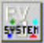
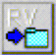
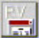
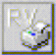
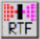
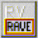
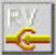
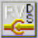
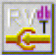
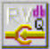

Введение в Rave
===============

::: {.date}
01.01.2007
:::

Панель компонент Rave

Имеются два типа объектов в Rave, компоненты вывода (Output Components)
и классы отчета (Report Classes). Компоненты вывода отвечают за вывод
отчета на различные устройства вывода, а классы отчета, которые не
являются компонентными классами, отвечают за все остальные задачи.

        TrvSystem      
 Включает в себя стандартный принтер и предварительный просмотр и
является одним из самых простых в использовании компонент.

        TRvNDRWriter    
   Создает NDR поток или файл (в должном формате) при выполнении отчета.

        TrvRenderPreview  
       Показывает диалог предварительного просмотра для NDR потока или
файла.

        TrvRenderPrinter  
       Посылает NDR поток или файл на принтер.

        TRvRenderPDF    
   Преобразовывает NDR поток или файл в PDF формат.

        TRvRenderHTML    
   Преобразовывает NDR поток или файл в HTML формат.

        TRvRenderRTF    
   Преобразовывает NDR поток или файл в RTF формат.

        TRvRenderText    
   Преобразовывает NDR поток или файл в Text формат.

Классы Rave

        TrvProject      
 Производит соединение к проекту отчета, который был создан с помощью
визуального редактора Rave. Используйте данный компонент для получения
списка всех доступных отчетов или для выполнения конкретного отчета.
   

 TrvCustomConnection  
      Подсоединяет пользовательские данные
(сгенерированные через события) к DirectDataViews, созданные с помощью
визуального редактора Rave.

       TrvDataSetConnection  
      Подсоединяет TDataSet данные (например,
TClientDataSet, или компоненты третьих сторон, наследники  от TDataSet)
к DirectDataViews, созданные с помощью визуального редактора Rave.
 

       TrvTableConnection  
      Подсоединяет TTable компоненты к
DirectDataViews, созданные с помощью визуального редактора Rave.

       TrvQueryConnection  
      Подсоединяет TQuery компоненты к
DirectDataViews, созданные с помощью визуального редактора Rave.
