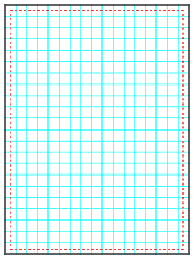
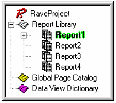
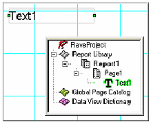
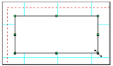

Дизайнер страниц
================

**Обзор**

Знание компонент и инструмента не достаточно для эффективной работы с
Rave. Вы также должны знать об наиболее фундаментальном компоненте Rave,
о компоненте Page (страница). В данной главе в деталях объяснен
компонент Page и его связи с деревом проекта и панелью свойств.
Поскольку дерево проектов и панель свойств имеют свои собственные главы,
в которых они рассмотрены индивидуально, данная глава рассматривает их
связи с Page. Также в данной главе приведены основы перемещений объектов
на странице.

**Базовый компонент Page и его панели**

Базовым компонентом в визуальном дизайнере Rave является компонент Page.
Компонент Page не является нормальным компонентом, и его нет в панели
компонент, но он имеет свои собственные свойства, что позволяет думать о
нем, как о базовом компоненте, являющим контейнером для построения
отчета. Все компоненты Rave должны быть размещены на Page. Page
предоставляет сетку на пали страницы. Внешний вид страницы управляется
предпочтениями, которые описаны в главе «Предпочтения». Изменение
внешнего вида рассматривается в главе «Панели утилит».

Подобно всем компонентам, компонент Page также имеет свойства, такие как
Height, Width, Description и Name. Для просмотра или изменения свойств
Page, перейдите в панель дерева проекта и раскройте узел Report, нажав
на символ "+", затем щелкните на имени отчета (По умолчанию
"Report1"). Щелчок на имени отчета покажет вам "Page1", которое
является именем по умолчанию для Page. Щелкните один раз на нем и
заметьте, что элемент "Page1" подсветился. Это означает, что страница
выбрана, и теперь можно посмотреть ее свойства в панели свойств.

Свойства страницы позволяют отчету быть более информативным. Например,
вместо Page1, Page2, Page3, это могут быть имена Invoice, PO,
PackingSlip. Чтобы сделать это, используйте свойство Name в панели
свойств. Имя может быть любым, которое пожелает пользователь, но оно не
может иметь пробелов или специальных символов. Помните, что Name только
для дизайнера Rave и видимо только в дереве проектов и в закладках на
панели Page.

Образ дерева проектов и панели свойств, изменяется после переименования
Page. Теперь дерево проекта выглядит более информативно. Это полезно при
настройке многих свойств ассоциированных со страницей, что делает более
информативным и удобным при дельнейшем использовании и изменении.

**Выбор компонент**

Для выбора компонент просто щелкните на них. Переместите указатель мыши,
на область компонента, и однократно щелкните на нем левой кнопкой мыши.
Выбранный компонент будет обведен специальной рамочкой с маркерами.

Маркеры могут быть четырех различных цветов: зеленый, серый, красный и
желтый. Зеленый маркер указывает, что текущий компонент выбран только
один компонент. Серый маркер, что имеется более одного выбранного
компонента, красный маркер индицирует, что текущий компонент
зафиксирован. Желтый маркер индицирует, что объекты зеркально отражены и
не могут быть изменены.

Выбор более одного компонента за раз делается аналогичным образом, за
исключением, что требуется удерживать клавишу Shift при выборе объектов.

Другим методом выбора более одного компонента за раз, это нарисовать
виртуальную рамку вокруг них. Для этого поместите курсор мыши в нужную
позицию и перемещайте курсор мыши, не отпуская левой кнопки.

Для снятия выбора, просто щелкните на закладке дизайнера страницы или
выберите другой компонент.

Когда выбрано несколько компонент, только общие свойства  показываются в
панели свойств. При смене свойства, изменение применяется ко всем
выбранным компонентам.

Имеется специальное свойство для всех компонент, называемое Locked
(заблокировано). Если свойство Locked установлено в True, то компонент
может быть выбран, но его свойства нельзя изменить (конечно, за
исключением свойства Locked). Если выбранные компоненты зафиксированы,
то маркеры и имена свойств, для данных компонент будут красного цвета
(как отмечено ранее). Если компонент имеет подчиненные компоненты
(детей), то родитель управляет доступом. Свойство Locked имеет
выпадающее меню, или True/False, указывая состояние блокировки, или оно
указывает имя компонента, который управляет его состоянием. Дальнейшее
обсуждение считает, что компоненты не заблокированы.

**Перемещение и изменение размеров компонент**

Для перемещения компонента, просто выберите его и, не отпуская левой
клавиши мыши, переместите его нужную позицию. При выборе более одного
компонента, все они перемещаются одновременно. Заметим, что это не
касается заблокированных компонент.

Основное назначение маркеров это изменение размеров компонент. Изменение
работает только для одного компонента за раз, то есть группа выбранных
компонент не может быть изменена одновременно. Компоненты могут быть
изменены по вертикали, горизонтали или по диагонали. При изменении по
диагонали, компонент меняет оба своих размера. Просто нажмите на нужный
маркер и, не отпуская клавиши мыши, перетащите маркер в нужную позицию.
Заблокированные компоненты не могут быть изменены.

**Копирование и вставка**

Копирование и вставка выполняются аналогично, как в стандартных Windows
приложениях. После выбора компонента (или группы компонент), выберите
Cut или Copy из меню Edit, или используйте комбинацию клавиш Ctrl-X или
Ctrl-C, или правый щелчок мыши на компоненте и выбор Cut или Copy из
контекстного меню.

Для вставки компонент выберите одним из предыдущих методов (меню Edit,
Ctrl-V или контекстного меню).

Снова, важный пункт заблокированные компоненты не могут быть вырезаны,
поскольку это убирает объект из позиции.

**Упражнение 1: выбор, изменение размеров и перемещение компонент**

Для выбора объекта:

1.   щелкните на компоненте. Рамка  и маркеры вокруг него;
2.   или выберите компонент из дерева проекта.

Для изменения размера:

1.   выберите компонент;
2.   переместите курсор, пока его вид не изменится на двунаправленные стрелки;
3.   удерживая маркер, установите необходимый размер.

{.center}

Для перемещения компонента:

1.   выберите компонент;
2.   перемещайте курсор поверх компонента (не на маркер, как это было при изменении размера компонента). Щелкните мышкой на компоненте и удерживая ее;
3.   перемещайте компонент мышкой;
4.   переместите в нужную позицию.
5.   освободите курсор.

**Упражнение 2: вырезание и вставка**

С помощью меню Edit:

1.   выберите компонент;
2.   выберите пункт Cut из меню Edit. Этим Вы поместите компонент в буфер обмена, и компонент при этом исчезнет со страницы;
3.   выберите пункт Paste из меню Edit.

С использование горячих клавиш:

1.   выберите компонент;
2.   нажмите Ctrl+X. Этим Вы поместите компонент в буфер обмена, и компонент при этом исчезнет со страницы;
3.   нажмите Ctrl+V.

С помощью контекстного меню:

1.   выберите компонент;
2.   нажмите правую кнопку мыши на компоненте, в контекстном меню выберите пункт Cut. Этим Вы поместите компонент в буфер обмена, и компонент при этом исчезнет со страницы;
3.   вставьте выше указанным методом.
