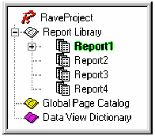
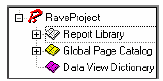
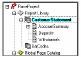
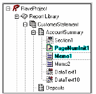
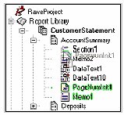
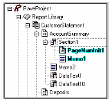

Дерево проекта
==============

::: {.date}
01.01.2007
:::

Панель дерева проектов предоставляет простой путь для навигации по
структуре проекта. Данный вид дает обзор структуры страниц и структуры в
свободном стиле. Поэтому, это делает дерево проекта очень информативной
частью дизайнера Rave. Независимо делаете ли Вы простые и сложные
отчеты, помните про эту панель, и увидите насколько информативным это
может быть.

{.center}

проект может содержать множество определений в каждой категории: Report
Library (библиотека отчетов), Global Page Catalog (каталог глобальных
страниц) и Data View Dictionary (словарь данных). Каждый узел (и любые
под узлы) могут быть свернуты или развернуты, нажатием на символ
плюс/минус. Любые из этих узлов могут быть добавлены из меню Project.
Там Вы увидите пункты для каждого из узлов New Report (новый отчет), New
Global Page (новая глобальная страница) и New Data View (новый просмотр
данных). До добавления новой страницы New Page в отчет, узел Report
Library, предварительно выберите нужный отчет и используйте пункт New
Page из меню Project.

Развертывание дерева и контекстное меню

Более простым путем выполнения действий над элементами дерева проекта,
это использование контекстного меню. Доступно много разных контекстных
меню. Выбор контекстного меню на главном узле, типа Report Library
вызывает контекстное меню с двумя пунктами Expand All и Collapse All.
Данные два пункта предназначены для свертывания или развертывания всех
узлов дерева, что предоставляет быстрый путь для доступа ко всем
элементам.

Выбор пол-узла, типа Page, вызывает пункты удаления страницы. Может быть
меньше или больше доступных функций.

Выбор компонента может показать контекстное меню с множеством пунктов.
Те же пункты появляются и при вызове контекстного меню на компоненте в
дизайнере страниц. Также, эти пункты отображаются в панели утилит. Может
быть меньше или больше доступных функций. Для ускорения создания отчета
или навигации по нему быстрой простой требуется разбираться в данных
функциях этих контекстных меню.

Связи родитель-ребенок

До этого Вы узнали, как перемещаться по дереву, теперь же мы проведем
маленький ликбез, что такое дерево.

Дерево проекта показывается, как дерево растущее вниз. База или корень
(root) дерева находится на верху  списка. Каждое последовательное
вхождение является ребенком корня или веткой дерева. Это делает корень
родителем всех его детей. Каждая ветвь также сама по себе является
корнем для своих детей.

Техника, использованная в предыдущей главе, показывается, как двигаться
по дереву, развертывая узлы, ассоциированные с каждым родителем. Когда
ветвь имеет детей, узел появляется слева от имени ветви.

Библиотека отчетов является корнем дерева  и имеет одного ребенка,
называемого Report1, показанного с подсветкой текста.

Report1 имеет следующих детей: Page1, Page2, Page3, Page4, Page5 и
Page6.

Page1 имеет следующих детей: Text1, Text2 и Memo1.

Здесь есть две группы братьев и сестер. Как и реальной семье с
родителями и детьми, дети могут иметь братьев и сестер. Первая группа
братьев и сестер: Page1, Page2, Page3, Page4, Page5 и Page6.

Первая группа братьев и сестер: Text1, Text2 и Memo1. Могут быть и
другие семейные взаимосвязи, но главная, как уже отмечено, это связь
родитель-ребенок.

Библиотека отчетов

Узел Report Library (библиотека отчетов) отображает структуру дизайна,
включающую все использованные компоненты в каждом из отчетов. Обычно,
компонент выбирается на панели страницы, просто отмечая его мышью. Тем
не менее, библиотека отчетов также. Первая группа братьев и сестер
использована для выбора компонентов, щелчком по имени. Когда мы щелкаем
по имени компонентов, то оно подсвечивается. Для выбора нескольких
компонентов, придерживайте клавишу Shift, при выборе.

Проект может быть простым, состоящим из одного или двух определений, но
может быть и сложным с множеством определений. Каждый отчет, который
создается, должен иметь свою собственную структуру. Для выбора и
переключения на различные отчеты, просто делайте двойной щелчок на имени
отчета в структуре библиотеки отчетов.

СОВЕТ: Чтобы сделать навигацию и отчет, простым для понимания,
используйте описательное свойство Name. Смотрите упражнение 4
«именование компонент» в конце данной главы для эффективного
использования, данного свойства.

Каталог глобальных страниц

Узел каталог глобальных страниц, где содержатся определения, которые
используются как шаблон, которые могут отражаться. Это включает такие
вещи как заголовки писем, формы, водяные знаки и другие определения
страниц, которые могут использоваться в различных отчетах. Это упрощает
общую разработку. Примером может быть отображение секции компонент на
глобальной странице, где одинаковое содержимое может быть отпечатано
(например, счет), но также может иметь различные заголовки в подвале
страниц, например "Original", "File Copy" и "Shipping".

Загрузка и выгрузка глобальных страниц

Глобальные страницы очень полезны и применимы для дизайна, особенно
когда они могут быть быстро доступны. Эти страницы могут содержать все
типы объектов и компонент, которые могут повторяться и отражаться через
множество страниц в различных отчетах. Многие отчеты в библиотеки
отчетов могут использовать любую из глобальных страниц каталога.

При создании отчетов, полезным свойством дизайнера Rave является
закладки дизайнера страниц. Они расположены вверху окна дизайнера
страниц. Здесь все закладки, используемых страниц.

Глобальные страницы можно добавить на закладку для более быстрого
доступа, что означает, что разработчику не нужно прокручивать все дерево
для поиска нужной, часто используемой  страницы. Вместо этого
разработчик может просто загрузить страницу в закладки дизайнера и затем
просто выбирать нужную страницу. Глобальные страницы могут быть
загружены или выгружены закладок дизайнера, просто по правому щелчку
мыши на глобальной странице и использованием контекстного меню для
выбора. Быстрый путь выгрузить глобальную страницу это выбрать ее в
области закладок, зто щелкнуть по странице и нажать клавишу Ctrl+F4.

Словарь данных

Словарь данных в дизайнере Rave это узел где указаны все подключения
данных для отчетов. Для добавления просмотра данных в данный список,
выберите New Data View из меню Project. Это вызовет диалог Data
Connections. Данное окно покажет все подключения данных Rave, которые
сейчас активны. Затем выберите любое из них для создания нового
просмотра подсоединенного к данному подключению.

Ctrl+Drag&Drop

Ctrl+Drag&Drop используется для создания или зеркального отражения
элемента из структуры дерева проекта или другого узла в данной структуре
отчета или текущей страницы дизайнера. При перетаскивании из панели
дерева проекта на страницу дизайнера, место бросания определяется
местом, в котором отпущена мышь. Но, при перетаскивании их одного узла
страницы в другой (в панели дерева проекта), по умолчанию, место
остается тем же, что и в источнике.

Примечание:

При перетаскивании не видимого компонента, он должен быть отражаемого
типа. Копирование для не отражаемых типов не работает. Компоненты
Regions и Bands, для которых не разрешено зеркальное отражение. Для
зеркального отражения региона, сделайте регион частью секции и затем
отразите эту секцию. Секция также может включать и другие компоненты.

ПРЕДУПРЕЖДЕНИЕ:

Перетаскивание (Drag&Drop) работает из страницы отчета в страницу
отчета, глобальной страницы в глобальную страницу, глобальную страницу в
страницу отчета, но это не работает перетаскивания из страницы отчета в
глобальную страницу, поскольку компоненты на отчете не видимы другим
отчетам и поэтому не могут отражаться в глобальной странице.

Alt+Drag

Alt+Drag используется для смены родителя компонента в новый контейнер 
подобный секции. Все перемещения для данного компонента должны быть
сделаны в той же самой странице. Когда создается новая секция,
пользователь может выбрать все элементы из другой секции для помещения в
новую секцию. В этом случае родитель должен быть сменен из старой секции
на новую секцию, и затем новая секция может быть зеркально отражена.

Примечание:

Компонент назначения должен быть контейнерного типа. Page, Region и
Section все являются хранителями или контейнерами. Так, если есть или
более секций на странице, элементы могут быть перетащены в другую
секцию. Также все компоненты могут быть перетащены со страницы на одну
из секций.

Упражнение 3: навигация по дереву проектов

Поскольку многие проекты отчета очень сложные, иерархическое дерево
проекта помогает двигаться по отчетам.

Навигации по иерархии (развертывание, свертывание и выбор):

::: {style="text-align: left; text-indent: 0px; padding: 0px 0px 0px 0px; margin: 0px 0px 0px 19px;"}
  ---- ------------------------------------------------------------------------------------------------------------------------------------------------------------
  1.   разверните элемент путем нажатия на символ плюс. Затем оно сменится на минус и развернет элемент с под элементами, такими как Report1, Page1 и остальными.
  ---- ------------------------------------------------------------------------------------------------------------------------------------------------------------
:::

::: {style="text-align: left; text-indent: 0px; padding: 0px 0px 0px 0px; margin: 0px 0px 0px 19px;"}
  ---- ---------------------------------------------------------------------------------------------------------------------------------
  2.   свертывание элемента осуществляется нажатием на символ минус, он сменит свое рисунок на символ плюс и свернет все под элементы.
  ---- ---------------------------------------------------------------------------------------------------------------------------------
:::

::: {style="text-align: left; text-indent: 0px; padding: 0px 0px 0px 0px; margin: 0px 0px 0px 19px;"}
  ---- -------------------------------------------------------------------------------------------------------------------
  3.   выбор элемента из дерева проекта выполняется нажатием мышкой на нужный элемент. Выбранный элемент подсвечивается.
  ---- -------------------------------------------------------------------------------------------------------------------
:::

 

 

Упражнение 4: именование компонент

::: {style="text-align: left; text-indent: 0px; padding: 0px 0px 0px 0px; margin: 0px 0px 0px 24px;"}
  ---- ----------------------------------------------------------------------------------------
  1.   Поскольку проекты обычно очень сложные, строго рекомендуется давать им значимые имена.
  ---- ----------------------------------------------------------------------------------------
:::

::: {style="text-align: left; text-indent: 0px; padding: 0px 0px 0px 0px; margin: 0px 0px 0px 24px;"}
  ---- -------------------------------------------------------------------------------------------------------------------------------------------------------------------------------------------------------------
  2.   По умолчанию, свойство Name получает имя подобное "Report1", "Report2" и так далее. Но гораздо легче управлять проектом, если отчеты имеют более полезные имена. Это можно сделать через свойство Name.
  ---- -------------------------------------------------------------------------------------------------------------------------------------------------------------------------------------------------------------
:::

::: {style="text-align: left; text-indent: 0px; padding: 0px 0px 0px 0px; margin: 0px 0px 0px 24px;"}
  ---- ----------------------------------------------------------------------------------------------------------------------------------------
  3.   при разработке соглашений об именах будьте созидательны, но помните, что пробелы или специальные символы не разрешены в свойстве Name.
  ---- ----------------------------------------------------------------------------------------------------------------------------------------
:::

::: {style="text-align: left; text-indent: 0px; padding: 0px 0px 0px 0px; margin: 0px 0px 0px 24px;"}
  ---- -------------------------------------------------------------------------------------------------------------------------------------------------------------------------------------------------------------------------------------------------------------------------------------------------------------------------------------------------------------------------------------------------------------------------------------------
  4.   в примере панели дерева проектов, по умолчанию имена отчетов были изменены. Вместо "Report1" до "Report7", имена отчетов были названы: "CustomerList", "CustomerLabels", "CustomerDue", "Invoice", "PO", "ProductsOnHand" и "ProductsOnOrder". Это важно для понимания, что панель дерева проектов в этом делает проект проще. Но, без информативной системы имен, панель дерева проектов не показывает свой потенциал.
  ---- -------------------------------------------------------------------------------------------------------------------------------------------------------------------------------------------------------------------------------------------------------------------------------------------------------------------------------------------------------------------------------------------------------------------------------------------
:::

Переименование отчета (или других компонент):

::: {style="text-align: left; text-indent: 0px; padding: 0px 0px 0px 0px; margin: 0px 0px 0px 19px;"}
  ---- -----------------------------
  1.   выберите отчет (компонент);
  ---- -----------------------------
:::

::: {style="text-align: left; text-indent: 0px; padding: 0px 0px 0px 0px; margin: 0px 0px 0px 19px;"}
  ---- -------------------------------------------------------------------------------
  2.   убедитесь что отчет, который переименовывается выбран. Должен быть подсвечен;
  ---- -------------------------------------------------------------------------------
:::

::: {style="text-align: left; text-indent: 0px; padding: 0px 0px 0px 0px; margin: 0px 0px 0px 19px;"}
  ---- -----------------------------------------------------
  3.   перейдите в панель свойств и найдите свойство Name;
  ---- -----------------------------------------------------
:::

::: {style="text-align: left; text-indent: 0px; padding: 0px 0px 0px 0px; margin: 0px 0px 0px 19px;"}
  ---- ----------------------------------
  4.   в поле Name, введите нудное имя;
  ---- ----------------------------------
:::

::: {style="text-align: left; text-indent: 0px; padding: 0px 0px 0px 0px; margin: 0px 0px 0px 19px;"}
  ---- ------------------------------------------
  5.   нажмите Enter, после ввода нового имени;
  ---- ------------------------------------------
:::

::: {style="text-align: left; text-indent: 0px; padding: 0px 0px 0px 0px; margin: 0px 0px 0px 19px;"}
  ---- ----------------------------------------------------------------------------------
  6.   посмотрите в дереве проекта и убедитесь, что имя отчета (компонента) изменилось.
  ---- ----------------------------------------------------------------------------------
:::

::: {style="text-align: left; text-indent: 0px; padding: 0px 0px 0px 0px; margin: 0px 0px 0px 19px;"}
  ---- --
  7.   
  ---- --
:::

Упражнение 5: загрузка и выгрузка глобальных страниц

Загрузка и выгрузка глобальных страниц в область закладок дизайнера
страниц делает доступ к этим страницам более быстрым и удобным. Это
особенно истинно, когда Вы работаете с отображенными секциями и
объектами из разных отчетов.

Загрузка глобальной страницы:

::: {style="text-align: left; text-indent: 0px; padding: 0px 0px 0px 0px; margin: 0px 0px 0px 19px;"}
  ---- ------------------------
  1.   запустите новый отчет;
  ---- ------------------------
:::

::: {style="text-align: left; text-indent: 0px; padding: 0px 0px 0px 0px; margin: 0px 0px 0px 19px;"}
  ---- -----------------------------------------------------------------------------------------------------------
  2.   вставьте четыре пустых отчета, выбрав New Report из меню Project или щелчком New Report в панели Project;
  ---- -----------------------------------------------------------------------------------------------------------
:::

::: {style="text-align: left; text-indent: 0px; padding: 0px 0px 0px 0px; margin: 0px 0px 0px 19px;"}
  ---- ---------------------------------------------------------------------------------------------------------------------------------------------------------------------------------------------------------------------------------------------
  3.   затем, выберите "Page1" в первом отчете. Сделайте это с помощью дерева проекта. Отметьте "Page1" в дереве или щелкните на закладке "Page 1" в закладке дизайнера страниц. Как только страница будет выбрана, ее имя будет подсвечено;
  ---- ---------------------------------------------------------------------------------------------------------------------------------------------------------------------------------------------------------------------------------------------
:::

::: {style="text-align: left; text-indent: 0px; padding: 0px 0px 0px 0px; margin: 0px 0px 0px 19px;"}
  ---- ----------------------------------------------------------------------------------------------------------------------------------------------------------
  4.   добавьте три глобальные страницы в отчет. Сделайте это выбором New Global Page из меню Project или щелчком New Global Page в закладке дизайнера страниц;
  ---- ----------------------------------------------------------------------------------------------------------------------------------------------------------
:::

::: {style="text-align: left; text-indent: 0px; padding: 0px 0px 0px 0px; margin: 0px 0px 0px 19px;"}
  ---- --------------------------------------------------------------------------------------------------------------------------------------------------------------------------------------------------------------
  5.   заметьте, поскольку первая страница в первом отчете была выбрана при добавлении глобальной страницы в закладке дизайнера страниц. То страницы были добавлены в дерево проектов в каталог глобальных страниц;
  ---- --------------------------------------------------------------------------------------------------------------------------------------------------------------------------------------------------------------
:::

::: {style="text-align: left; text-indent: 0px; padding: 0px 0px 0px 0px; margin: 0px 0px 0px 19px;"}
  ---- ------------------------------------------------------------------------------------------------------------------------------------------------------------------------------------------------------------------------------------------------------------------------------------------------------------------------------------------------------
  6.   щелкните на другой странице отчета. Заметьте, что поскольку была выбрана  другая страница в области 7 закладок дизайнера страниц. Для добавления глобальных страниц в область закладок дизайнера страниц сделайте вызов контекстного меню глобальной страницы дерева проекта и выберите Load Page. Попробуйте загрузить все три глобальные страницы;
  ---- ------------------------------------------------------------------------------------------------------------------------------------------------------------------------------------------------------------------------------------------------------------------------------------------------------------------------------------------------------
:::

::: {style="text-align: left; text-indent: 0px; padding: 0px 0px 0px 0px; margin: 0px 0px 0px 19px;"}
  ---- -----------------------------------------------------------------------------------------------------
  7.   как только глобальные страницы загрузятся, то они будут видны в области закладок дизайнера страниц;
  ---- -----------------------------------------------------------------------------------------------------
:::

::: {style="text-align: left; text-indent: 0px; padding: 0px 0px 0px 0px; margin: 0px 0px 0px 19px;"}
  ---- ----------------------------------------------------------------------------
  8.   попробуйте загрузить глобальные страницы к двум другим оставшимся отчетам.
  ---- ----------------------------------------------------------------------------
:::

Выгрузка глобальной страницы:

::: {style="text-align: left; text-indent: 0px; padding: 0px 0px 0px 0px; margin: 0px 0px 0px 19px;"}
  ---- -------------------------------------------
  1.   закончите шаги из предыдущего упражнения;
  ---- -------------------------------------------
:::

::: {style="text-align: left; text-indent: 0px; padding: 0px 0px 0px 0px; margin: 0px 0px 0px 19px;"}
  ---- ---------------------------------------------------------------------------
  2.   выберите страницу из Report 3, которая содержит все загруженные страницы;
  ---- ---------------------------------------------------------------------------
:::

::: {style="text-align: left; text-indent: 0px; padding: 0px 0px 0px 0px; margin: 0px 0px 0px 19px;"}
  ---- -------------------------------------------------------------------------------------------------------------------------------
  3.   есть два пути выгрузки страницы. Один путь это использовать контекстное меню, а другой путь это использовать горячие клавиши;
  ---- -------------------------------------------------------------------------------------------------------------------------------
:::

::: {style="text-align: left; text-indent: 0px; padding: 0px 0px 0px 0px; margin: 0px 0px 0px 19px;"}
  ---- ---------------------------------------------------------------------------------------------------
  4.   первый путь использовать контекстное меню, что требует, во-первых, выбрать страницу для выгрузки;
  ---- ---------------------------------------------------------------------------------------------------
:::

::: {style="text-align: left; text-indent: 0px; padding: 0px 0px 0px 0px; margin: 0px 0px 0px 19px;"}
  ---- -----------------------------------------------------------------------------------------------------------------------------------------
  5.   затем, вызвать контекстное меню на глобальной странице и выбрать пункт Unload Page из меню. Повторите его три раза для отчета Report 3;
  ---- -----------------------------------------------------------------------------------------------------------------------------------------
:::

::: {style="text-align: left; text-indent: 0px; padding: 0px 0px 0px 0px; margin: 0px 0px 0px 19px;"}
  ---- -----------------------------------------------
  6.   теперь мы попробуем использовать второй путь;
  ---- -----------------------------------------------
:::

::: {style="text-align: left; text-indent: 0px; padding: 0px 0px 0px 0px; margin: 0px 0px 0px 19px;"}
  ---- ----------------------------------------------------------------------------------------------------------------------------------
  7.   выберите следующую страницу в Report 4. Убедитесь, что она содержит все глобальные страниц в области закладок дизайнера страниц;
  ---- ----------------------------------------------------------------------------------------------------------------------------------
:::

::: {style="text-align: left; text-indent: 0px; padding: 0px 0px 0px 0px; margin: 0px 0px 0px 19px;"}
  ---- ------------------------------------------------------------------------------------------------------------------------------------------------------------------------------------------------
  8.   так как страница в Report 4 выбрана, Вы можете видеть три глобальные страницы в области закладок дизайнера страниц, выберите одну из глобальных страниц из области закладок дизайнера страниц;
  ---- ------------------------------------------------------------------------------------------------------------------------------------------------------------------------------------------------
:::

::: {style="text-align: left; text-indent: 0px; padding: 0px 0px 0px 0px; margin: 0px 0px 0px 19px;"}
  ---- -----------------------------------------------
  9.   теперь нажмите Ctrl+F4 для выгрузки страницы;
  ---- -----------------------------------------------
:::

::: {style="text-align: left; text-indent: 0px; padding: 0px 0px 0px 0px; margin: 0px 0px 0px 19px;"}
  ----- -------------------------------------------------------------
  10.   повторите это для оставшихся глобальных страниц в каталоге.
  ----- -------------------------------------------------------------
:::

::: {style="text-align: left; text-indent: 0px; padding: 0px 0px 0px 0px; margin: 0px 0px 0px 19px;"}
  ----- --
  11.   
  ----- --
:::

Упражнение 6: перетаскивание компонент (Ctrl+Drag)

Одной из обычных задач по перетаскиванию бывает копирование компонента
Data Field на страницу в визуальном дизайнере. Приемник должен быть
существующим компонентом DataBand или чистой областью страницы.
Компонент Data Field будет преобразован в DataText или DataMemo на
области назначения, в зависимости от типа поля источника. Выполним это с
помощью следующих шагов.

Перетаскивание:

::: {style="text-align: left; text-indent: 0px; padding: 0px 0px 0px 0px; margin: 0px 0px 0px 19px;"}
  ---- ---------------------------------------------------------------------
  1.   перейдем на узел Data View Dictionary, развернем его, если свернут;
  ---- ---------------------------------------------------------------------
:::

::: {style="text-align: left; text-indent: 0px; padding: 0px 0px 0px 0px; margin: 0px 0px 0px 19px;"}
  ---- -----------------------------------------------------------
  2.   выберем один из Data Views и развернем его, если свернут;
  ---- -----------------------------------------------------------
:::

::: {style="text-align: left; text-indent: 0px; padding: 0px 0px 0px 0px; margin: 0px 0px 0px 19px;"}
  ---- -----------------------------------------
  3.   выберем компонент поля для копирования;
  ---- -----------------------------------------
:::

::: {style="text-align: left; text-indent: 0px; padding: 0px 0px 0px 0px; margin: 0px 0px 0px 19px;"}
  ---- -----------------------------------------------------------------
  4.   нажмем и удерживаем клавишу, теперь тащим это поле на страницу;
  ---- -----------------------------------------------------------------
:::

::: {style="text-align: left; text-indent: 0px; padding: 0px 0px 0px 0px; margin: 0px 0px 0px 19px;"}
  ---- ----------------------------------------
  5.   отпускаем клавишу мыши и клавишу Ctrl;
  ---- ----------------------------------------
:::

::: {style="text-align: left; text-indent: 0px; padding: 0px 0px 0px 0px; margin: 0px 0px 0px 19px;"}
  ---- ----------------------------------------------------------------------
  6.   выбираем только что скопированное поле и устанавливаем его свойства.
  ---- ----------------------------------------------------------------------
:::

Данное упражнение может быть слишком простое, но дадим здесь
пользователю шаги необходимые для выполнения перетягивания компонента.
Поскольку полный отчет еще не закончен, так что не беспокоимся о его
работоспособности.

Упражнение 7: смена родителя компонента (Alt+Drag)

Смена родителя компонента может быть очень полезной, для создания его
компонент. Например, скажем, есть страница, содержащая компоненты,
которые было бы лучше сгруппировать с секцию. Текущее состояние в том,
страница является родителем компонент, которые надо сгруппировать. Для
группы элементов, родитель должен быть сменен на компонент секции. После
того как это будет сделано, элементы окажутся в секции, которую можно
будет потом перемещать межу подобными другими. Есть и обратный смысл,
может потребоваться убрать компонент обратно из секции и просто
переместить на страницу, просто используйте Alt+Drag для выполнения
данной задачи.

Смена родителя компонента:

1\.        перейдите Report Library, развернем его, если свернут;

{.center}

2\.        развернем узел Report, который содержит страницу с
определением;

{.center}

3\.        развернем узел Report, который содержит приемник и источник,
что бы они были видны. В Customer Statement, есть секция на странице. Мы
сменим родителя у PageNumInit и Memo1 со страницы на секцию;

{.center}

4\.        выделим компоненты, у которых мы желаем сменить родителя. Для
выделения удерживаем клавишу Shift при выборе компонент. Когда закончим
выбор отпустим клавишу Shift. Выбранные компоненты должны быть
подсвечены;

5\.        нажимаем и удерживаем клавишу Alt, теперь перетаскиваем на
новый родительский компонент. В данном примере, клавиша Alt удерживается
при выборе и перетягивании на новый компонент. При перетягивании
компонент на нового родителя, видим, что курсор изменяется при попадании
не приемник. Когда курсор показывает, что он находится над приемником,
освобождаем клавишу мыши и затем клавишу Alt;

{.center}

6\.        заметим, что компоненты теперь имеют нового родителя, и у
родителя появился маркер минус, указывая, сто у родителя есть несколько
компонент;

{.center}

7\.        после окончания перемещения новых компонент, они могут быть
настроены, как требуется.
