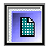
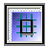
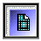
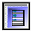
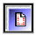

Панель дизайнера
================

Панель дизайнера используется для управления предпочтениями страницы.
Все элементы панели дизайнера

имеют два состояния, свойство компонента, ассоциированное  с данной
клавишей, меняет свое состояние. Для смены на обратное состояние нажмите
на кнопку еще раз. Отжатая кнопка показывает состояние выключено, а
нажатая состояние включено.

        Activate Grid   -    Делает сетку страницы видимой/невидимой

        Snap To Grid    -   Привязка объектов к узлам сетки

        Grid On Top     -  Определяет, что сетка находится над компонентами или под ними

        Always Show Band Headers -  Управляет показом заголовков групп (band)

        Show Rulers      - Показывает, убирает измерительные линейки

        Show Waste Area  -   Управляет показом пространства между границами страницы и концом настройки границ

        Edit Preferences  -       Вызывает диалог предпочтений
