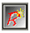
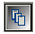
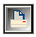

Панель проекта
==============

панель проекта предоставляет базовую функциональность для проекта. Это
дает быстрый доступ для выполнения общих задач при управлении проекта.
Все функции панели доступны и через меню Rave.

Первые три иконки управления проектами:

        New Project      - Создает новый проект

        Open Project    -   Открывает предыдущий сохраненный проект

        Save Project    -   Сохраняет текущий проект

Следующие три иконки управляют специфическими аспектами текущего
проекта:

        New Report      -
 Создает новый отчет, который будет в том же самом файле проекта (.rav
file). Может иметь более одного отчета на проект в файле проекта

        New Global Page  -
     Создает новую глобальную страницу

        New Data View    -
 Позволяет создать новый просмотр данных DataViews, который
ассоциирован с текущим проектом. Смотрите главу «Подключение данных» для
получения более подробной информации о DataViews.

Две последние иконки управляют текущим выбранным отчетом:

        New Page      -
 Создает новую страницу в текущем отчете

        Execute Report  -
  Выполняет или печатает текущий отчет
