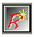
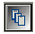
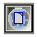
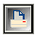

Панель проекта
==============

::: {.date}
01.01.2007
:::

Панель проекта

панель проекта предоставляет базовую функциональность для проекта. Это
дает быстрый доступ для выполнения общих задач при управлении проекта.
Все функции панели доступны и через меню Rave.

Первые три иконки управления проектами:

{width="34" height="37"}        New Project      
 Создает новый проект        

{width="36" height="35"}        Open Project    
   Открывает предыдущий сохраненный проект        

{width="36" height="36"}        Save Project    
   Сохраняет текущий проект        

Следующие три иконки управляют специфическими аспектами текущего
проекта:

{width="35" height="34"}        New Report      
 Создает новый отчет, который будет в том же самом файле проекта (.rav
file). Может иметь более одного отчета на проект в файле проекта        

{width="37" height="37"}        New Global Page  
     Создает новую глобальную страницу        

{width="35" height="36"}        New Data View    
   Позволяет создать новый просмотр данных DataViews, который
ассоциирован с текущим проектом. Смотрите главу «Подключение данных» для
получения более подробной информации о DataViews.        

Две последние иконки управляют текущим выбранным отчетом:

{width="36" height="35"}        New Page      
 Создает новую страницу в текущем отчете        

{width="36" height="37"}        Execute Report  
     Выполняет или печатает текущий отчет        
