Упражнения
==========

**Упражнение 13: выравнивание компонент**

В данном упражнении мы продемонстрируем, как выравнивать компоненты.
Например, есть шесть пронумерованных строк текста.

1. в начале, бросьте несколько компонент Text на страницу. В данном примере это пронумерованные строки 1-6;

    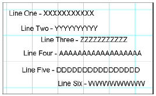{.center}

2.   строки два, четыре и пять должны быть выровнены. Строки три и шесть также должны быть выровнены;

    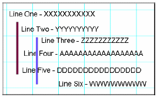{.center}

3.   выберите строку два. Это задаст первичный компонент, относительно которого будут выравниваться остальные;

    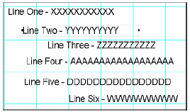{.center}

4.   удерживая клавишу shift, выберите строки четыре и пять, которые будут выровнены относительно строки два; заметим, что появилась граница с маркерами серого цвета;

    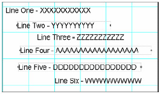{.center}

5.   поскольку все компоненты уже выбраны, нажмите на иконку Align Left Edges на панели выравнивания. Заметим, что все три компонента выровнялись по левому краю;

    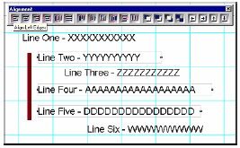{.center}

6.   чтобы посмотреть, как работает выравнивание, нажмите иконку Align Right Edges на панели выравнивания;

    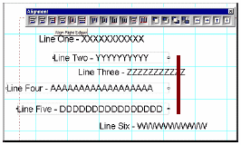{.center}

7.   пройдитесь по оставшимся функциям панели выравнивания и посмотрите, как они работают;

8.   попробуем теперь выравнить второй набор строк. Сначала выберите первичный компонент, как базу для выравнивания, в данном случае, это строка три;

    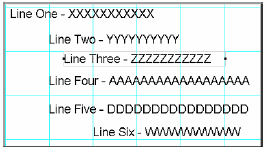{.center}

9.   затем выберите другие компоненты, которые Вы хотите выравнить, удерживая клавишу shift, выберите строку шесть;

    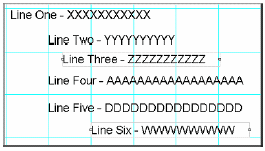{.center}

10.   затем нажмите на иконку the Align Left Edges для выравнивания компонент.

    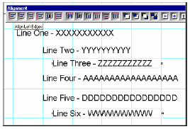{.center}

**Упражнение 14: порядок компонент**

Для изменения порядка компонент по Z-оси, должны использоваться иконки
на панели выравнивания.

1. чтобы начать упражнение, нам нужны компоненты на странице. Это могут быть любые компоненты. В данном примере используются прямоугольник, овал и круг;

    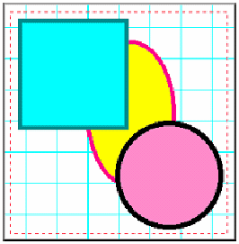{.center}

2.   сначала выберите компонент, который будет перемещать. В примере будем перемещать прямоугольник за овал. Посмотрим в дереве проекта размещение компонента Rectangle;

    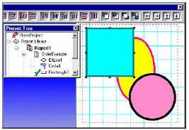{.center}

3.   как только прямоугольник будет выбран, нажмите иконку Move Behind на панели выравнивания. Заметим, что после нажатия прямоугольник еще никуда не поместился, но в дереве проекта уже сменил свою позицию на шаг выше;

    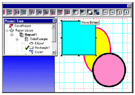{.center}

4.   теперь нажмите на иконку Move Behind button еще раз. Прямоугольник переместился и в дереве проекта на странице за овал;

    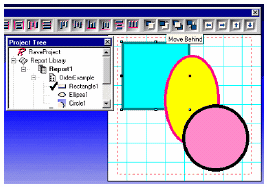{.center}

5.   для второго компонента, выберите круг и нажмите на иконку Move Behind. Круг переместился по дереву ин странице за овал;

    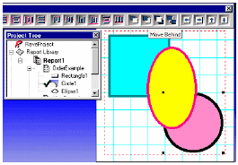{.center}

6.   щелкните по иконке Move Behind еще раз и заметьте, что круг перемещается по дереву, но остается сзади овала;

    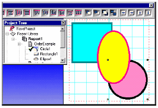{.center}

**Упражнение 15: привязка к сетке**

Привязка к сетке перемещение относится к перемещению и изменению размера
компонент к узлам сетки на странице.

1.   сначала, вызовите диалог Preferences, пункт Preferences меню Edit;

2.   выберите закладку Default и посмотрите в область Grid Spacing;

3.   В Grid Spacing смените, значение на .02. затем посмотрите на область, называемую Draw Grid Every;

4.   в Draw Grid Every, введите 1 line (напечатайте или используйте выпадающий список). Draw Grid Every 1 line, будет показывать каждую строку сетки. Если это сменить на Draw Grid Every 3 lines, то будет показана только каждая третья строка сетки;

5.   затем перейдите в меню Project и выберите New. Это создаст новый проект, также и новую страницу отчета, которая будет базироваться на предпочтениях, которые мы сменили в предыдущих шагах. Помните, что линии сетки используются только для разработки отчета и не показываются при его исполнении;

6.   прейдите в панель дизайнера и нажмите на иконку Snap To Grid;

7.   теперь бросьте прямоугольник на страницу;

8.   затем перемещайте прямоугольник и обратите внимание, что прямоугольник перемещается только по сетке. Попробуйте сделать тоже самое кнопками перемещения.

9.   опять перейдите в панель дизайнера и нажмите на иконку Snap To Grid, для отключения привязки;

10.   пробуйте перемещать прямоугольник и обратите внимание, что теперь прямоугольник перемещается и между узлами сетки.

**Упражнение 16: изменение размера линии и цвета прямоугольника**

1.   создайте новый отчет;

2.   бросьте прямоугольник на страницу;

3.   посмотрите на панель палитры цветов. Обратите внимание, что на конкретных цветах есть символы 1 и 2, которые указывают первичный и вторичный цвета;

4.   чтобы сделать изменение цвета более заметным в примере, мы изменим ширину линии прямоугольника. Перейдем на панель редактора. Выберем прямоугольник. Затем изменим в выпадающем списке толщину линии. В примере сменено с hairline на 2.25 пункта;

5.   Щелкните левой кнопкой мыши на любом цвете в панели цветов. В данном примере был выбран цвет Olive. Заметьте, что цвет границы сменился на оливковый цвет. Также обратите внимание, что изменился первичный цвет. Первичный цвет определяет цвет границы;

6.   Щелкните правой кнопкой мыши на любом цвете. В примере был выбран цвет Blue. Заметим, что прямоугольник закрасился синим цветом. Также заметим, что изменился вторичный цвет. Вторичный цвет определяет цвет заливки.

**Упражнение 17: смена шрифтов**

1.    создайте новую страницу отчета; 

2.   бросьте на нее четыре компоненты Text;

3.   выберите компонент и посмотрите на панель шрифтов;

    {.center}

4.  в выпадающем меню отображаются имена шрифтов, выберите
подходящий шрифт;

5.  перейдите на следующий компонент, и повторите шаги 3 и 4.
повторите это же для оставшихся компонент;

6.  Также попробуйте изменять размеры шрифтов. И конечно атрибуты
Bold, Italic и Underline;

7.  Три оставшихся кнопки управляют выравниванием влево, вправо и
по центру. Попробуйте поработать и с ними.

