Упражнения
==========

::: {.date}
01.01.2007
:::

Упражнение 13: выравнивание компонент

В данном упражнении мы продемонстрируем, как выравнивать компоненты.
Например, есть шесть пронумерованных строк текста.

::: {style="text-align: left; text-indent: 0px; padding: 0px 0px 0px 0px; margin: 0px 0px 0px 19px;"}
  ---- ----------------------------------------------------------------------------------------------------------
  1.   в начале, бросьте несколько компонент Text на страницу. В данном примере это пронумерованные строки 1-6;
  ---- ----------------------------------------------------------------------------------------------------------
:::

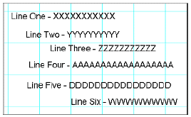{.center}

::: {style="text-align: left; text-indent: 0px; padding: 0px 0px 0px 0px; margin: 0px 0px 0px 19px;"}
  ---- --------------------------------------------------------------------------------------------------
  2.   строки два, четыре и пять должны быть выровнены. Строки три и шесть также должны быть выровнены;
  ---- --------------------------------------------------------------------------------------------------
:::

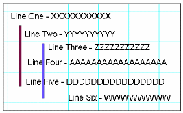{.center}

::: {style="text-align: left; text-indent: 0px; padding: 0px 0px 0px 0px; margin: 0px 0px 0px 19px;"}
  ---- -----------------------------------------------------------------------------------------------------------
  3.   выберите строку два. Это задаст первичный компонент, относительно которого будут выравниваться остальные;
  ---- -----------------------------------------------------------------------------------------------------------
:::

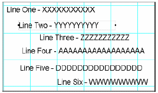{.center}

::: {style="text-align: left; text-indent: 0px; padding: 0px 0px 0px 0px; margin: 0px 0px 0px 19px;"}
  ---- -------------------------------------------------------------------------------------------------------------------------------------------------------------------
  4.   удерживая клавишу shift, выберите строки четыре и пять, которые будут выровнены относительно строки два; заметим, что появилась граница с маркерами серого цвета;
  ---- -------------------------------------------------------------------------------------------------------------------------------------------------------------------
:::

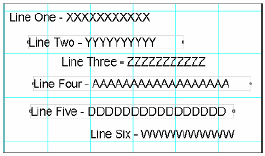{.center}

::: {style="text-align: left; text-indent: 0px; padding: 0px 0px 0px 0px; margin: 0px 0px 0px 19px;"}
  ---- --------------------------------------------------------------------------------------------------------------------------------------------------------------
  5.   поскольку все компоненты уже выбраны, нажмите на иконку Align Left Edges на панели выравнивания. Заметим, что все три компонента выровнялись по левому краю;
  ---- --------------------------------------------------------------------------------------------------------------------------------------------------------------
:::

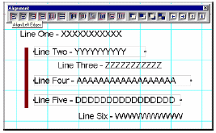{.center}

::: {style="text-align: left; text-indent: 0px; padding: 0px 0px 0px 0px; margin: 0px 0px 0px 19px;"}
  ---- --------------------------------------------------------------------------------------------------------
  6.   что бы посмотреть, как работает выравнивание, нажмите иконку Align Right Edges на панели выравнивания;
  ---- --------------------------------------------------------------------------------------------------------
:::

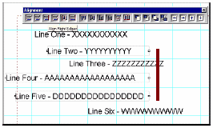{.center}

::: {style="text-align: left; text-indent: 0px; padding: 0px 0px 0px 0px; margin: 0px 0px 0px 19px;"}
  ---- ---------------------------------------------------------------------------------------
  7.   пройдитесь по оставшимся функциям панели выравнивания и посмотрите, как они работают;
  ---- ---------------------------------------------------------------------------------------
:::

::: {style="text-align: left; text-indent: 0px; padding: 0px 0px 0px 0px; margin: 0px 0px 0px 19px;"}
  ---- --------------------------------------------------------------------------------------------------------------------------------------------------
  8.   попробуем теперь выравнить второй набор строк. Сначала выберите первичный компонент, как базу для выравнивания, в данном случае, это строка три;
  ---- --------------------------------------------------------------------------------------------------------------------------------------------------
:::

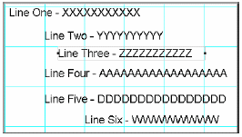{.center}

::: {style="text-align: left; text-indent: 0px; padding: 0px 0px 0px 0px; margin: 0px 0px 0px 19px;"}
  ---- ----------------------------------------------------------------------------------------------------------------
  9.   затем выберите другие компоненты, которые Вы хотите выравнить, удерживая клавишу shift, выберите строку шесть;
  ---- ----------------------------------------------------------------------------------------------------------------
:::

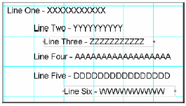{.center}

::: {style="text-align: left; text-indent: 0px; padding: 0px 0px 0px 0px; margin: 0px 0px 0px 19px;"}
  ----- --------------------------------------------------------------------------
  10.   затем нажмите на иконку the Align Left Edges для выравнивания компонент.
  ----- --------------------------------------------------------------------------
:::

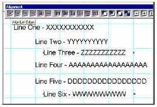{.center}

Упражнение 14: порядок компонент

Для изменения порядка компонент по Z-оси, должны использоваться иконки
на панели выравнивания.

::: {style="text-align: left; text-indent: 0px; padding: 0px 0px 0px 0px; margin: 0px 0px 0px 19px;"}
  ---- -------------------------------------------------------------------------------------------------------------------------------------------------------
  1.   чтобы начать упражнение, нам нужны компоненты на странице. Это могут быть любые компоненты. В данном примере используются прямоугольник, овал и круг;
  ---- -------------------------------------------------------------------------------------------------------------------------------------------------------
:::

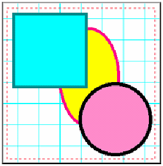{.center}

::: {style="text-align: left; text-indent: 0px; padding: 0px 0px 0px 0px; margin: 0px 0px 0px 19px;"}
  ---- ---------------------------------------------------------------------------------------------------------------------------------------------------------------------
  2.   сначала выберите компонент, который будет перемещать. В примере будем перемещать прямоугольник за овал. Посмотрим в дереве проекта размещение компонента Rectangle;
  ---- ---------------------------------------------------------------------------------------------------------------------------------------------------------------------
:::

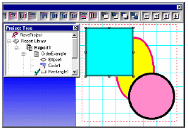{.center}

::: {style="text-align: left; text-indent: 0px; padding: 0px 0px 0px 0px; margin: 0px 0px 0px 19px;"}
  ---- -----------------------------------------------------------------------------------------------------------------------------------------------------------------------------------------------------------------------
  3.   как только прямоугольник будет выбран, нажмите иконку Move Behind на панели выравнивания. Заметим, что после нажатия прямоугольник еще никуда не поместился, но в дереве проекта уже сменил свою позицию на шаг выше;
  ---- -----------------------------------------------------------------------------------------------------------------------------------------------------------------------------------------------------------------------
:::

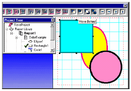{.center}

::: {style="text-align: left; text-indent: 0px; padding: 0px 0px 0px 0px; margin: 0px 0px 0px 19px;"}
  ---- -------------------------------------------------------------------------------------------------------------------------
  4.   теперь нажмите на иконку Move Behind button еще раз. Прямоугольник переместился и в дереве проекта на странице за овал;
  ---- -------------------------------------------------------------------------------------------------------------------------
:::

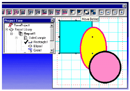{.center}

::: {style="text-align: left; text-indent: 0px; padding: 0px 0px 0px 0px; margin: 0px 0px 0px 19px;"}
  ---- -------------------------------------------------------------------------------------------------------------------------
  5.   для второго компонента, выберите круг и нажмите на иконку Move Behind. Круг переместился по дереву ин странице за овал;
  ---- -------------------------------------------------------------------------------------------------------------------------
:::

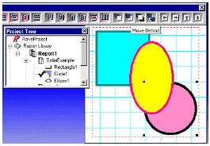{.center}

::: {style="text-align: left; text-indent: 0px; padding: 0px 0px 0px 0px; margin: 0px 0px 0px 19px;"}
  ---- --------------------------------------------------------------------------------------------------------------
  6.   щелкните по иконке Move Behind еще раз и заметьте, что круг перемещается по дереву, но остается сзади овала;
  ---- --------------------------------------------------------------------------------------------------------------
:::

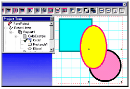{.center}

Упражнение 15: привязка к сетке

Привязка к сетке перемещение относится к перемещению и изменению размера
компонент к узлам сетки на странице.

::: {style="text-align: left; text-indent: 0px; padding: 0px 0px 0px 0px; margin: 0px 0px 0px 19px;"}
  ---- --------------------------------------------------------------------
  1.   сначала, вызовите диалог Preferences, пункт Preferences меню Edit;
  ---- --------------------------------------------------------------------
:::

::: {style="text-align: left; text-indent: 0px; padding: 0px 0px 0px 0px; margin: 0px 0px 0px 19px;"}
  ---- ----------------------------------------------------------------
  2.   выберите закладку Default и посмотрите в область Grid Spacing;
  ---- ----------------------------------------------------------------
:::

::: {style="text-align: left; text-indent: 0px; padding: 0px 0px 0px 0px; margin: 0px 0px 0px 19px;"}
  ---- ---------------------------------------------------------------------------------------------------
  3.   В Grid Spacing смените, значение на .02. затем посмотрите на область, называемую Draw Grid Every;
  ---- ---------------------------------------------------------------------------------------------------
:::

::: {style="text-align: left; text-indent: 0px; padding: 0px 0px 0px 0px; margin: 0px 0px 0px 19px;"}
  ---- ----------------------------------------------------------------------------------------------------------------------------------------------------------------------------------------------------------------------------------------------------
  4.   в Draw Grid Every, введите 1 line (напечатайте или используйте выпадающий список). Draw Grid Every 1 line, будет показывать каждую строку сетки. Если это сменить на Draw Grid Every 3 lines, то будет показана только каждая третья строка сетки;
  ---- ----------------------------------------------------------------------------------------------------------------------------------------------------------------------------------------------------------------------------------------------------
:::

::: {style="text-align: left; text-indent: 0px; padding: 0px 0px 0px 0px; margin: 0px 0px 0px 19px;"}
  ---- ------------------------------------------------------------------------------------------------------------------------------------------------------------------------------------------------------------------------------------------------------------------------------------------------------
  5.   затем перейдите в меню Project и выберите New. Это создаст новый проект, также и новую страницу отчета, которая будет базироваться на предпочтениях, которые мы сменили в предыдущих шагах. Помните, что линии сетки используются только для разработки отчета и не показываются при его исполнении;
  ---- ------------------------------------------------------------------------------------------------------------------------------------------------------------------------------------------------------------------------------------------------------------------------------------------------------
:::

::: {style="text-align: left; text-indent: 0px; padding: 0px 0px 0px 0px; margin: 0px 0px 0px 19px;"}
  ---- ---------------------------------------------------------------
  6.   прейдите в панель дизайнера и нажмите на иконку Snap To Grid;
  ---- ---------------------------------------------------------------
:::

::: {style="text-align: left; text-indent: 0px; padding: 0px 0px 0px 0px; margin: 0px 0px 0px 19px;"}
  ---- -------------------------------------------
  7.   теперь бросьте прямоугольник на страницу;
  ---- -------------------------------------------
:::

::: {style="text-align: left; text-indent: 0px; padding: 0px 0px 0px 0px; margin: 0px 0px 0px 19px;"}
  ---- ----------------------------------------------------------------------------------------------------------------------------------------------------------
  8.   затем перемещайте прямоугольник и обратите внимание, что прямоугольник перемещается только по сетке. Попробуйте сделать тоже самое кнопками перемещения.
  ---- ----------------------------------------------------------------------------------------------------------------------------------------------------------
:::

::: {style="text-align: left; text-indent: 0px; padding: 0px 0px 0px 0px; margin: 0px 0px 0px 19px;"}
  ---- -----------------------------------------------------------------------------------------------
  9.   опять перейдите в панель дизайнера и нажмите на иконку Snap To Grid, для отключения привязки;
  ---- -----------------------------------------------------------------------------------------------
:::

::: {style="text-align: left; text-indent: 0px; padding: 0px 0px 0px 0px; margin: 0px 0px 0px 19px;"}
  ----- --------------------------------------------------------------------------------------------------------------------
  10.   пробуйте перемещать прямоугольник и обратите внимание, что теперь прямоугольник перемещается и между узлами сетки.
  ----- --------------------------------------------------------------------------------------------------------------------
:::

Упражнение 16: изменение размера линии и цвета прямоугольника

::: {style="text-align: left; text-indent: 0px; padding: 0px 0px 0px 0px; margin: 0px 0px 0px 19px;"}
  ---- -----------------------
  1.   создайте новый отчет;
  ---- -----------------------
:::

::: {style="text-align: left; text-indent: 0px; padding: 0px 0px 0px 0px; margin: 0px 0px 0px 19px;"}
  ---- ------------------------------------
  2.   бросьте прямоугольник на страницу;
  ---- ------------------------------------
:::

::: {style="text-align: left; text-indent: 0px; padding: 0px 0px 0px 0px; margin: 0px 0px 0px 19px;"}
  ---- -----------------------------------------------------------------------------------------------------------------------------------------------------
  3.   посмотрите на панель палитры цветов. Обратите внимание, что на конкретных цветах есть символы 1 и 2, которые указывают первичный и вторичный цвета;
  ---- -----------------------------------------------------------------------------------------------------------------------------------------------------
:::

::: {style="text-align: left; text-indent: 0px; padding: 0px 0px 0px 0px; margin: 0px 0px 0px 19px;"}
  ---- -----------------------------------------------------------------------------------------------------------------------------------------------------------------------------------------------------------------------------------------------------
  4.   что бы сделать изменение цвета более заметным в примере, мы изменим ширину линии прямоугольника. Перейдем на панель редактора. Выберем прямоугольник. Затем изменим в выпадающем списке толщину линии. В примере сменено с hairline на 2.25 пункта;
  ---- -----------------------------------------------------------------------------------------------------------------------------------------------------------------------------------------------------------------------------------------------------
:::

::: {style="text-align: left; text-indent: 0px; padding: 0px 0px 0px 0px; margin: 0px 0px 0px 19px;"}
  ---- -----------------------------------------------------------------------------------------------------------------------------------------------------------------------------------------------------------------------------------------------------------
  5.   Щелкните левой кнопкой мыши на любом цвете в панели цветов. В данном примере был выбран цвет Olive. Заметьте, что цвет границы сменился на оливковый цвет. Также обратите внимание, что изменился первичный цвет. Первичный цвет определяет цвет границы;
  ---- -----------------------------------------------------------------------------------------------------------------------------------------------------------------------------------------------------------------------------------------------------------
:::

::: {style="text-align: left; text-indent: 0px; padding: 0px 0px 0px 0px; margin: 0px 0px 0px 19px;"}
  ---- -----------------------------------------------------------------------------------------------------------------------------------------------------------------------------------------------------------------------
  6.   Щелкните правой кнопкой мыши на любом цвете. В примере был выбран цвет Blue. Заметим, что прямоугольник закрасился синим цветом. Также заметим, что изменился вторичный цвет. Вторичный цвет определяет цвет заливки.
  ---- -----------------------------------------------------------------------------------------------------------------------------------------------------------------------------------------------------------------------
:::

Упражнение 17: смена шрифтов

1.        создайте новую страницу отчета; 
{.center}

2.          бросьте на
нее четыре компоненты Text;

3.        выберите компонент и посмотрите на панель шрифтов;
{.center}

4.        в выпадающем меню отображаются имена шрифтов, выберите
подходящий шрифт;

5.        перейдите на следующий компонент, и повторите шаги 3 и 4.
повторите это же для оставшихся компонент;

6.        Также попробуйте изменять размеры шрифтов. И конечно атрибуты
Bold, Italic и Underline;

7.        Три оставшихся кнопки управляют выравниванием влево, вправо и
по центру. Попробуйте поработать и с ними.

 
