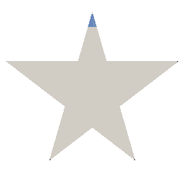
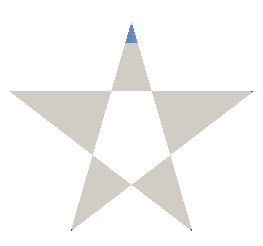
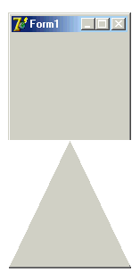
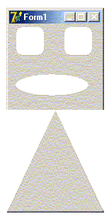
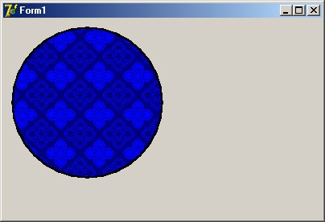
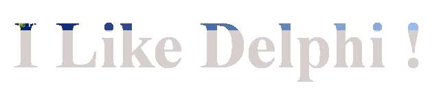

Работа с регионами (статья)
===========================

## Общее описание

Windows API предоставляет набор функций, позволяющих описать
произвольную (при желании - достаточно сложную) геометрическую фигуру,
которая потом может использоваться при работе с окнами, или, в
терминологии Delphi, элементами управления. Использование может
заключаться, например, в отрисовке на холсте, в задании специфического
региона обновления окна, и т.д. Помимо таких вот относительно невинных
возможностей, технология регионов позволяяет также глумиться над
благородными очертаниями любого потомка TWinControl (иными словами,
любым контролом, имеющим Handle, aka TForm, TButton, и т.д.). Особенно
широко регионы используются в формах, при их отрисовке и обновлении.

Итак, для начала, давайте разберёмся, что такое этот самый регион.

Win32 SDK регион определяет следующим образом:

> В Microsoft Windows регионом называется прямоугольник, полигон или
> эллипс (либо комбинация двух или более этих фигур), которые могут быть
> заполненны, нарисованы, инвертированы, обрамлены и могут использоваться
> для определения местонахождения курсора (имеется в виду, что есть
> стандартная функция, определяющая входит ли точка (X,Y) в наш регион).

В SDK упомянуты три основных типа регионов: прямоугольные,
эллиптические, и полигональные. О чётвёртом типе, прямоугольном с
закруглёнными краями, стыдливо умалчивается, ну да и фиг с ним. Видимо
это связано с тем, что его можно получить из первых двух. Дело в том,
что регионы могут комбинироваться между собой с применением логических
операций OR, XOR и т.д. Но к этому мы вернёмся позже.

С точки зрения Windows, регион является обыкновенным объектом GDI,
задаваемым дескриптором HRGN. В Delphi также доступен этот тип, и
объявление его выглядит следующим образом:

    HRGN = type LongWord;

Как видим, ничего сверхъестественного. По сути это указатель на некую
структуру в памяти. Структура эта описана следующим образом:

    TRgnData = _RGNDATA;
     
    _RGNDATA = record
     rdh: TRgnDataHeader;
     Buffer: array[0..0] of CHAR;
     Reserved: array[0..2] of CHAR;
    end;

Что примечательно, в Win32 SDK \_RGNDATA объявлена немного иначе.
Наиболее любопытный член этой записи, безусловно, TRgnDataHeader. В
модуле Windows.pas фигурирует и он:

    TRgnDataHeader = _RGNDATAHEADER;
     
    _RGNDATAHEADER = packed record
     dwSize: DWORD;
     iType: DWORD;
     nCount: DWORD;
     nRgnSize: DWORD;
     rcBound: TRect;
    end;

Вот его стоит рассмотреть подробнее.

`dwSize`: Указывает размер заголовка (т.е. \_RGNDATAHEADER) в байтах;

`iType`: Тип региона, всегда равен `RDH_RECTANGLES = 1;`

`nCount`: Кол-во прямоугольников, из которых составлен регион;

`nRgnSize`: Размер буфера, необходимого для получения структуры TRect,
указывающей координаты прямоугольников, составляющих регион. Если размер
неизвестен, поле может быть равно нулю;

`rcBound`: Координаты прямоугольника, в который вписан регион.

Вот именно эта структура и задаёт регион, как таковой, и именно с ней
работают практически все функции API. Пора познакомиться с ними поближе.

Условно все эти функции можно разбить на три группы: создание/удаление,
отрисовка и прочие. Расмотрим их все по порядку. Для удобства я буду
приводить не си-шные декларации из SDK, а паскалевские декларации,
объявленные в модуле Windows, ибо именно с ними нам и предстоит
работать.

## Функции создания/удаления регионов

function CombineRgn (p1, p2, p3: HRGN; p4: Integer): Integer; stdcall;
: Создаёт новый регион `p1`, комбинируя регионы `p2` и `p3` на основе режима `p4`

function CreateEllipticRgn (p1, p2, p3, p4: Integer): HRGN; stdcall;
: Создаёт эллиптический регион по четырём координатам

function CreateEllipticRgnIndirect (const p1: TRect): HRGN; stdcall;
: [i] Создаёт эллиптический регион, впсанный в заданный прямоугольник `p1`

function CreatePolygonRgn (const Points; Count, FillMode: Integer): HRGN; stdcall;
: Создаёт полигональный регион по массиву точек `Points` с числом вершин `Count`
  с режимом заливки `FillMode`

function CreatePolyPolygonRgn (const pPtStructs; const pIntArray; p3, p4: Integer): HRGN; stdcall;
: Создаёт регион, состоящий из серии полигонов, задаваемых массивом точек
  `pPtStructs`, число вершин каждого из которых указывается в массиве
  `pIntArray` с общим числом вершин `p3` и режимом заливки `p4`

function CreateRectRgn (p1, p2, p3, p4: Integer): HRGN; stdcall;
: Создаёт прямоугольный регион по четырём координатам

function CreateRectRgnIndirect (const p1: TRect): HRGN; stdcall;
: Создаёт прямоугольный регион по заданному прямоугольнику `p1`

function CreateRoundRectRgn (p1, p2, p3, p4, p5, p6: Integer): HRGN; stdcall;
: Создаёт прямоугольный регион по координатам `p1-p4` с эллиптически
  закруглёнными краями с высотой эллипса скругления `p5` и шириной `p6`

function ExtCreateRegion (XForm: PXForm; Count: DWORD; const RgnData: TRgnData): HRGN; stdcall;
: Создаёт регион по его данным `RgnData` размером `Count`
  с указанной трансформацией `XForm`

function DeleteObject (p1: HGDIOBJ): BOOL; stdcall;
: Удаляет регион и освобождает все, занятые под него ресурсы

Надо сказать, что последняя функция `DeleteObject` не фигурирует в разделе
по работе с регионами в явном виде, т.к. предназначена она для более
широкого использования. По большому счёту, она удаляет любой логический
объект `GDI` (перо, кисть, шрифт, битмап) и освобождает все отведённые под
этот объект ресурсы. Для полных даунов `SDK` ласково уточняет, что после
вызова сей функции ссылка на удаляемый объект становится неопределённой.

## Функции отображения регионов

function SetPolyFillMode (DC: HDC; PolyFillMode: Integer): Integer; stdcall;
: Устанавливает режим заливки регионов `PolyFillMode` для контекста `dc`

function GetPolyFillMode (DC: HDC): Integer; stdcall;
: Возвращает текущий режим заливки регионов на конктексте `dc`

function PaintRgn (DC: HDC; RGN: HRGN): BOOL; stdcall;
: Рисует регион `rgn` на контексте `dc` текущей кистью контекста

function FillRgn (DC: HDC; hrgn: HRGN; hbr: HBRUSH): BOOL; stdcall;
: Заливает регион `hrgn` на контексте `dc` с заданной кистью `hbr`

function FrameRgn (DC: HDC; hrgn: HRGN; hbr: HBRUSH; Width, Height: Integer): BOOL; stdcall;
: Рисует на контексте `dc` рамку вокруг региона `hrgn` кистью `hbr`
  соответствующей ширины `Width` и высоты `Height`

## Прочие функции

function EqualRgn (p1, p2: HRGN): BOOL; stdcall;
: Проверяет, являются ли размеры и форма регионов `p1` и `p2` идентичными

function InvertRgn (DC: HDC; p2: HRGN): BOOL; stdcall;
: Инвертирует цвета региона `p2` на контексте `dc`

function OffsetRgn (RGN: HRGN; XOffset, YOffset: Integer): Integer; stdcall;
: Сдвигает регион `rgn` по осям `X` и `Y` на `XOffset` и `YOffset` соответственно

function SetRectRgn (Rgn: HRgn; X1, Y1, X2, Y2: Integer): BOOL; stdcall;
: Конвертирует регион `rgn` в прямоугольный, заданный четырьмя координатами

function GetRgnBox (RGN: HRGN; var p2: TRect): Integer; stdcall;
: Возвращает прямоугольник `p2`, в который вписан указанный регион `rgn`

function RectInRegion (RGN: HRGN; const Rect: TRect): BOOL; stdcall;
: Определяет, "влазит" ли прямоугольник `Rect` в границы региона `rgn`

function PtInRegion (RGN: HRGN; X, Y: Integer): BOOL; stdcall;
: Определяет, входит ли точка (`X,Y`) в регион `rgn`

function GetRegionData (RGN: HRGN; p2: DWORD; p3: PRgnData): DWORD; stdcall;
: Заполняет данными региона `rgn` буфер `PRgnData` размером `p2`,
  при `pRgnData = nil` - возвращает размер региона в памяти

Каким же образом это безобидное и абстрактное, в общем-то, понятие
взаимодействует со вполне реальными элементами управления? Ведь все
перечисленные функции служат, по большому счёту, для того, чтобы создать
некую замысловатую фигуру и тем или другим способом отрисовать её в
чьём-то контексте, `DC`, а о том, чтобы каким-то образом изменить форму
той же кнопки и речи даже нет.
Дело здесь в том, что мы пока мельком
рассмотрели функции, касающиеся создания и манипуляций регионами. А ещё
существуют функции работы с окнами, и вот там-то нам все наши созданные
регионы и пригодятся. Поглядим, что это за функции.

## Функции работы с окнами и регионами

function SetWindowRgn(hWnd: HWND; hRgn: HRGN; bRedraw: BOOL): Integer; stdcall;
: Устанавливает для окна с дескриптором `hWnd` регион отображения `hRgn`,
  при взведённом флаге `bRedraw` - перерисовывая окно

function GetWindowRgn(hWnd: HWND; hRgn: HRGN): Integer; stdcall;
: Возвращает регион отображения `hRgn` для окна с дескриптором `hWnd`

Сразу оговорюсь, что на самом деле этих функций гораздо больше, равно
как и область применения регионов гораздо ширше. Но нас они пока не
волнуют. Итак, мы знаем, как создать и модифицировать регион, как
скормить его окну (ибо параметр `hWnd` есть ни что иное, как
`TWinControl.Handle`), и как его уничтожить.

Настало время слегка поэксперементировать.

## Создание региона

Запускаем среду, заводим новый проект, тщательно сохраняем куда попало.
В обработчике `OnCreate` пишем первое, что, по идее, приходит в голову:

    procedure TForm1.FormCreate(Sender: TObject);
    var
     r: hRGN;
    begin
     r := CreateEllipticRgn (0, 0, Width, Height);
     try
       SetWindowRgn (Handle, r, TRUE);
     finally
       DeleteObject (r);
     end;
    end; 

Результатом запуска окажется симпатичный эллипс на экране. А теперь
попробуйте дописать такой простенький обработчик на `OnKeyPress`:

    procedure TForm1.FormKeyPress(Sender: TObject; var Key: Char);
    var
     bmp: TBitmap;
    begin
     if Key = 'p' then begin
       bmp := GetFormImage;
       try
         bmp.SaveToFile ('c:\temp.bmp');
       finally
         bmp.Free;
       end;
     end;
    end;

В момент выполнения программы при нажатии "p" мы, по идее должны
получить картинку нашей формы. Но как это ни покажется странным, мы
получим картинку полной, т.е. неусечённой формы. Собственно, если
взглянуть на реализацию GetFormImage - ничего странного не обнаружиться,
создаётся виртуальный битмап, на который себя отрисовывает форма и все
контролы на ней. Но об этой забавной фиче стоит помнить: для любой,
самой извратной формы всегда можно получить её первоначальную картинку
функцией GetFormBitmap, а любой
загруглённый/продырявленный/звездообразный контрол всегда можно
отрисовать на любой левый канвас в его первозданном виде функцией
`PaintTo`.

Аналогичным образом создаются и другие типы регионов, единственное
внимание стоит, пожалуй, уделить полигональным. Начнём с самого
простого. В делкарации функции есть интересный параметр: `FillMode`.
Согласно `SDK` он может принимать два значения - `ALTERNATE` и `WINDING`.
Со вторым всё просто - вычисляются границы, и всё, что между - заливается
текущей кистью. А вот первый при заливке анализирует, по какую сторону
ребра (чётную или нечётную) он находится. Что это означает, мы увидим на
следующем примере.

    procedure TForm1.FormCreate(Sender: TObject);
    var
     ap: array [1..5] of TPoint;
     r: hRGN;
    begin
     ap [1] := Point (Width div 2, 0);
     ap [2] := Point (Width div 3 * 2, Height);
     ap [3] := Point (0, Height div 3);
     ap [4] := Point (Width, Height div 3);
     ap [5] := Point (Width div 3, Height);
     r := CreatePolygonRgn (ap, 5, WINDING);
     try
       SetWindowRgn (Handle, r, TRUE);
     finally
       DeleteObject (r);
     end;
    end; 

Запустите программу, посмотрите на результат (она превратит форму в
звезду), и поменяйте значение параметра `FillMode` на `ALTERNATE`.
И запустите её снова. На тот случай, если по каким-то причинам вам влом
напрягаться со всякими там модами, ниже приведёны примеры того, что вы
могли увидеть:

FillMode = WINDING:

FillMode = ALTERNATE:

Обратите внимание, что если вы кликаете мышкой на "дырку", сообщение
получает окно, лежащее под вашей формой. Если форма выведена на пустом
десктопе, вы вполне успешно можете из "дырки" вызвать контекстное меню
экрана. Т.е. это действительно "дыра", а не просто прозрачная
отрисовка.

Теперь разберёмся, как работает функция `CreatePolyPolygonRgn`.
Её предназначение в том, чтобы рисовать сразу несколько регионов, которые
могут даже не пересекаться. А могут - и пересекаться, именно для этого и
нужен параметр `FillMode`.
Поглядим, как это выглядит, и что оно делает:

    procedure TForm1.FormCreate(Sender: TObject);
    var
     ap: array [1..7] of TPoint;
     av: array [1..2] of integer;
     r: hRGN;
    begin
     ap [1] := Point (0, 0);
     ap [2] := Point (Width, 0);
     ap [3] := Point (Width, Height div 2);
     ap [4] := Point (0, Height div 2);
     ap [5] := Point (Width div 2, Height div 2);
     ap [6] := Point (0, Height);
     ap [7] := Point (Width, Height);
     av [1] := 4;
     av [2] := 3;
     r := CreatePolyPolygonRgn (ap, av, 2, WINDING);
     try
       SetWindowRgn (Handle, r, TRUE);
     finally
       DeleteObject (r);
     end;
    end; 

Из первой серии функций осталось только разобраться с комбинированием
регионов, о чем и пойдёт речь далее.

Комбинирование регионов

Результат комбинирования определяется четвёртым параметром функции
`CombineRgn`.

Давайте посмотрим, какие значения он может принимать.

**RGN\_ADD** - Пересечение двух регионов p2 и p3

**RGN\_COPY** - Создаёт копию региона p2

**RGN\_DIFF** - Вернёт часть p2, не являющуюся частью p3

**RGN\_OR** - Объединение двух регионов p2 и p3

**RGN\_XOR** - Объединяет регионы p2 и p3, исключая пересекающиеся области

Возвращаемые значения могут быть `NULLREGION` (пустой регион),
`SIMPLEREGION` (один прямоугольник), `COMPLEXREGION` (всё остальное)
и `ERROR` (нифига не создано).
Посмотрим, как это выглядит на практике (чтобы не
сильно мучитья, я просто дописывал предыдущий пример).

    procedure TForm1.FormCreate(Sender: TObject);
    var
     ap: array [1..7] of TPoint;
     av: array [1..2] of integer;
     r, r2, r3, r4: hRGN;
    begin
     ap [1] := Point (0, 0);
     ap [2] := Point (Width, 0);
     ap [3] := Point (Width, Height div 2);
     ap [4] := Point (0, Height div 2);
     ap [5] := Point (Width div 2, Height div 2);
     ap [6] := Point (0, Height);
     ap [7] := Point (Width, Height);
     av [1] := 4;
     av [2] := 3;
     r := CreatePolyPolygonRgn (ap, av, 2, WINDING);
     try
       r2 := CreateRoundRectRgn
         (Width div 4 - 20, Height div 6 - 20,
          Width div 4 + 20, Height div 6 + 20, 16, 16);
       r3 := CreateRoundRectRgn 
         (Width div 4 * 3 - 20, Height div 6 - 20,
          Width div 4 * 3 + 20, Height div 6 + 20, 16, 16);
       r4 := CreateEllipticRgn
          (Width div 10, Height div 9 * 3,
          Width div 10 * 9, Height div 9 * 4);
       try
         CombineRgn (r, r, r2, RGN_XOR);
         CombineRgn (r, r, r3, RGN_XOR);
         CombineRgn (r, r, r4, RGN_XOR);
       finally
         DeleteObject (r2);
         DeleteObject (r3);
         DeleteObject (r4);
       end;
       SetWindowRgn (Handle, r, TRUE);
     finally
       DeleteObject (r);
     end;
    end;

Важно помнить, что первый параметр, вновь создаваемый регион, должен
существовать до вызова функции.

Нерасмотренной из первой группы функций осталась только `ExtCreateRgn`.
Я сейчас не буду на ней заостряться, скажу только, что на пару с функцией
`GetRegionData`, она может пригодиться, например, для сохранения и
загрузки регионов в файл / из файла.

## Рисование регионов

Регионы нужны не только для того, чтобы резать дырки в формах. Иногда
они могут оказаться довольно полезным инструментом именно в своём
"родном" качестве, т.е. для отрисовки на экране достаточно сложных
геометрических фигур. Например, для вывода карт, представляющих собой
совокупность ломанных линий, построенных по массивам точек. Создать
такую линию нам уже не составит труда, пора разобраться, как её показать
юзеру.

Из функций отрисовки две первые нам уже смутно знакомы: они делают то же,
что делает параметр `FillMode` (ALTERNATE/WINDING) для функций
`CreatePolygonRgn` и `CreatePolyPolygonRgn`.

`GetPolyFillMode` получает заданный для указанного контекста режим заливки,
а `SetPolyFillMode` устанавливает его.
Просто на этот раз речь идёт не о создании региона, а
всего лишь о его отрисовке. Установленное значение будет иметь смысл для
всех функций, заливающих регион, т.е. `PaintRgn` и `FillRgn`, при этом сам
регион останется таким, каким он и был создан, а вот раскрашен будет по
разному, в том случае, если он состоит из нескольких пересекающихся
регионов. Для простых регионов типа прямоугольника или элипса установка
данного значения ничего не меняет.

Итак. Давайте срочно что-нить создадим и нарисуем. Можно, конечно,
сделать это в одной функции, например в OnCreate, но тогда изображение
будет весьма недолговечным - до первой перерисовки формы. Поэтому
поступим иначе:

- объявим `private property fRgn`,
- в `OnCreate` его инициализируем,
- в `OnPaint` будем его отображать,
- а в `OnDestroy` - уничтожим.

Код методов представлен ниже:

    procedure TForm1.FormCreate(Sender: TObject);
    begin
     fRgn := CreateEllipticRgn (10, 10, 200, 200);
    end;
     
    procedure TForm1.FormDestroy(Sender: TObject);
    begin
     DeleteObject (fRgn);
    end;
     
    procedure TForm1.FormPaint(Sender: TObject);
    begin
     Canvas.Brush.Color := clBlack;
     PaintRgn (Canvas.Handle, fRgn);
    end; 

Следует помнить, что Функции отрисовки регионов всегда работают с
цветом, указанным в `Canvas.Brush.Color`.
Даже рисуя бордюр (frame) использоваться будет не цвет `Canvas.Pen`,
что, в общем-то, представляется более логичным, а цвет `Canvas.Brush`.

Ничего такой получился кружочек. Погребального вида.
Давайте сделаем его более жизнерадостным, и заодно разберёмся, как работает `FrameRgn`:

    procedure TForm1.FormPaint(Sender: TObject);
    var
     bmp: TBitmap;
    begin
     bmp := TBitmap.Create;
     try
       bmp.LoadFromFile ('C:\WINDOWS\Голубые кружева 16.bmp');
       Canvas.Brush.Bitmap := bmp;
       PaintRgn (Canvas.Handle, fRgn);
       Canvas.Brush.Color := clBlack;
       FrameRgn (Canvas.Handle, fRgn, Canvas.Brush.Handle, 2, 2);
     finally
       Canvas.Brush.Bitmap := nil;
       bmp.Free;
     end;
    end; 

У меня получилась такая вот картинка:

Насколько я могу судить, функции `FillRgn` и `PaintRgn` отличаются друг от
друга только тем, что первая позволяет указать дескриптор кисти, не
связанной с текущим canvas-ом. Сомнительная фича с точки зрения
дельфей, т.к. манипулировать с текущим цветом кисти канваса всяко легче,
чем создавать отдельный экземпляр класса `TBrush`.
Вот, собственно, и всё
об отрисовке. Примечательно то, что для того, чтобы нарисовать регион
нам не нужно знать, что он из себя представляет. Мы просто передаём
дескриптор одной и той же процедуре, а она отобразит на экране круг,
овал, треугольник, звезду Давида - всё, что угодно.

Функции, представленные в разделе прочее ничего особенно интересного из
себя не представляют, и, в общем-то, интуитивно понятны. поэтому
рассотрим лишь некоторые из них.

## Прочие функции

Сделаем это на примере. Давайте озадачимся возможностью таскать мышкой
по всей форме круг, созданный в предыдущем примере. Что нам нужно.
Во-первых, запоминать, где началось перетаскивание (`fStartX`, `fStartY`).
Во-вторых, флаг (`fDragging`), указывающий, что юзер действительно
перетскивает наш регион, а не просто гоняет с экрана мух. В третьих,
надо узнать, ткнул ли он на регион, а не мимо (`PtInRegion`).
В четвёртых,
надо двигать регион по мере того, как он двигает мышь (`OffsetRgn`).
Вот, пожалуй, и всё. На этот раз текст модуля приведу полностью. Единственное
что там стоит упомянуть - это свойство `DoubleBuffered`.
Оно выставлено в `TRUE`, т.к. иначе появляется мерцание.

Итак:

    unit Unit1;
     
    interface
     
    uses
     Windows, Messages, SysUtils, Variants, Classes, Graphics, Controls, Forms,
     Dialogs;
     
    type
     TForm1 = class(TForm)
       procedure FormCreate(Sender: TObject);
       procedure FormDestroy(Sender: TObject);
       procedure FormPaint(Sender: TObject);
       procedure FormMouseDown(Sender: TObject; Button: TMouseButton;
           Shift: TShiftState; X, Y: Integer);
       procedure FormMouseMove(Sender: TObject; Shift: TShiftState; X,
           Y: Integer);
     private
       { Private declarations }
       fDragging: boolean;
       fRgn: hRGN;
       fStartX,
       fStartY: integer;
     public
       { Public declarations }
     end;
     
    var
     Form1: TForm1;
     
    implementation
     
    {$R *.dfm}
     
    procedure TForm1.FormCreate(Sender: TObject);
    begin
     fRgn := CreateEllipticRgn (10, 10, 200, 200);
     fDragging := FALSE;
     DoubleBuffered := TRUE;
    end;
     
    procedure TForm1.FormDestroy(Sender: TObject);
    begin
     DeleteObject (fRgn);
    end;
     
    procedure TForm1.FormPaint(Sender: TObject);
    var
     bmp: TBitmap;
    begin
     bmp := TBitmap.Create;
     try
       bmp.LoadFromFile ('C:\WINDOWS\Aieoaua e?o?aaa 16.bmp');
       Canvas.Brush.Bitmap := bmp;
       PaintRgn (Canvas.Handle, fRgn);
       Canvas.Brush.Color := clBlack;
       FrameRgn (Canvas.Handle, fRgn, Canvas.Brush.Handle, 2, 2);
     finally
       Canvas.Brush.Bitmap := nil;
       bmp.Free;
     end;
    end;
     
    procedure TForm1.FormMouseDown(Sender: TObject; Button: TMouseButton;
     Shift: TShiftState; X, Y: Integer);
    begin
     if (Button = mbLeft) and (PtInRegion (fRgn, X, Y)) then begin
       fDragging := TRUE;
       fStartX := X;
       fStartY := Y;
     end;
    end;
     
    procedure TForm1.FormMouseMove(Sender: TObject; Shift: TShiftState; X,
     Y: Integer);
    begin
     if (ssLeft in Shift) and fDragging then begin
       OffsetRgn (fRgn, X - fStartX, Y - fStartY);
       fStartX := X;
       fStartY := Y;
       Refresh;
     end;
    end;
     
    procedure TForm1.FormMouseUp(Sender: TObject; Button: TMouseButton;
     Shift: TShiftState; X, Y: Integer);
    begin
     fDragging := FALSE;
    end;
     
    end.

Как видим, абсолютно ничего сложного в работе с регионами нет. А вот
возможности они дают довольно интересные. Фигуру любой формы можно
раскрасить как угодно (в т.ч. и битмапом), вывести на экран, определить,
входит ли точка (X,Y) в эту фигуру, двигать её, и многое ещё другое. Для
полноты картины нам осталось только научиться сохранять регионы на диск
и считывать обратно.

## Сохранение и загрузка региона

Как уже говорилось в самом начале, все данные о регионе храняться в
структуре RGNDATA. Упоминалась также и функция, позволяющая эту
структуру получить: `GetRegionData`. У этой функции есть приятная
особенность: если в третий параметр передать `nil`, то она вернёт размер
памяти, необходимый для сохранения региона.

    procedure SaveRegion (FileName: string);
    var
     s: TStream;
     size: cardinal;
     data: pointer;
    begin
     s := TFileStream.Create (FileName, fmCreate);
     try
       size := GetRegionData (fRgn, SizeOf (RGNDATA), nil);
       data := GlobalAllocPtr(GPTR, size);
       try
         GetRegionData(fRgn, size, data);
         s.Write(data^, size);
       finally
         GlobalFreePtr(data);
       end;
     finally
       s.Free;
     end;
    end; 

Аналогичным образом можно и прочитать записанный на диск регион:

    function LoadRegion (FileName: string): hRGN;
    var
     data: PRgnData;
     s: TStream;
    begin
     s := TFileStream.Create (FileName, fmOpenRead);
     try
       data := GlobalAllocPtr(GPTR, s.size);
       try
         s.Read(data^, s.Size);
         Result := ExtCreateRegion(nil, s.Size, data^);
       finally
         GlobalFreePtr(data);
       end;
     finally
       s.Free;
     end;
    end; 

В заключении рассмотрим ещё одну любопытную возможность: создание
региона на основе маски.

## Создание региона по картинке

Реализовать это достаточно просто: создадим прямоугольный регион,
размерами равный картинке, а потом потом "вычтем" из него все точки с
заданным цветом прозрачности.
Ниже приведён исходный код:

    function RgnByMask (bmp: TBitmap; Color: TColor): hRgn;
    var
     i, j: integer;  
     tmp: hRgn;
    begin
     Result := CreateRectRgn (0, 0, bmp.Width - 1, bmp.Height - 1);
     for j := 0 to bmp.Height - 2 do begin
       for i := 0 to bmp.Width - 2 do begin
         if bmp.Canvas.Pixels [i, j] = Color then begin
           tmp := CreateRectRgn (i, j, i + 1, j + 1);
           try
             CombineRgn (Result, Result, tmp, RGN_DIFF);
           finally
             DeleteObject (tmp);
           end;
         end;
       end;
     end;
    end;

Для примера я написал несколько слов в Paint-е, сохранил на диск,
и использовал вышеприведённую процедуру.
Получилось примерно следующее:

Вверху видны синие остатки безвозвратно загубленного Caption-а формы.

Вот на этом, пожалуй, можно закончить этот обзор, отнюдь не претендующий
на исчерпываемость. Хочется надеятся, что кого-то сей опус подвигнет на
создание чего-нить хорошего, или просто сэкономит несколько часов
ползанья по Win32 SDK...

Удачи.

x77, http://club.shelek.com/

