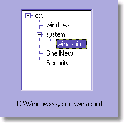

Как получить строковый путь узла TTreeView?
===========================================

Вариант 1:

Source: <https://www.swissdelphicenter.ch/en/tipsindex.php>

{.center}

    {*--------------------------------------------- 
     Parent Text 
     ---------------------------------------------*} 
     
    function SrNodeTree(pTreeNode: TTreeNode; var sRuta: string): string; 
    begin 
      sRuta := pTreeNode.Text + ' > ' + sRuta; 
      if pTreeNode.Level = 0 then Result := sRuta 
      else  
        Result := SrNodeTree(pTreeNode.Parent, sRuta); 
    end; 
     
    {*--------------------------------------------- 
      Click an Item 
     ---------------------------------------------*} 
    procedure TForm1.TreeView1Click(Sender: TObject); 
    var 
      sPath: string; 
    begin 
      label1.Caption := SrNodeTree(TreeView1.Selected, sPath); 
    end; 

------------------------------------------------------------------------

Вариант 2:

Author: lipskiy, lipskiy@mail.ru

Date: 02.05.2002

    { **** UBPFD *********** by delphibase.endimus.com ****
    >> Получение пути заголовков к узлу в TreeView
     
    Функция выдает путь к указанному узлу (к ноде) в TreeView
    в виде строки заголовков узлов, разделенных символом Separator.
     
    Зависимости: ComCtrls
    Автор:       lipskiy, lipskiy@mail.ru, ICQ:51219290, Санкт-Петербург
    Copyright:   Собственное написание (lipskiy)
    Дата:        02 мая 2002 г.
    ***************************************************** }
     
    function GetPathToNode(Node: TTreeNode; Separator: Char): string;
    begin
      Result := '';
      if Node = nil then
        exit;
      while Node <> nil do
      begin
        Result := Node.Text + Separator + Result;
        Node := Node.Parent;
      end;
      Delete(Result, length(Result), 1);
    end;
