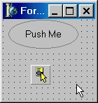
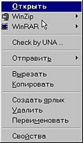
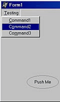
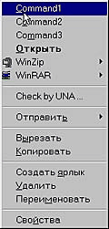

Shell Extensions и как с ними бороться (статья)
===============================================

::: {.date}
07.05.2004
:::

Shell Extensions и как с ними бороться

Думаю, вы замечали, что некоторые программы добавляют собственные пункты
в системное контекстное меню. Например, WinRAR добавляет "Сжать" и
"Распаковать в...", ICQ - "Переслать пользователю" и пр. Механизм, с
помощью которого ваш код "внедряется" в оболочку Windows, называется
Shell Extensions - именно о нем пойдет речь...

Определения

В дальнейшем, говоря "программист среднего уровня", мы будем
подразумевать человека, который уже написал свой первый текстовый
редактор и знаком с практикой создания собственных компонент.

{.center}

Shell Extensions - набор сервисных функций Windows API, призванный
обеспечить расширение базовых функций оболочки Windows Explorer за счет
наших надстроек. В числе основных функций Shell Extensions:

  --- ----------------------------------------
  ·   работа с системными контекстными меню;
  --- ----------------------------------------

  --- ---------------------------------------------------------------------------------------------------------------------
  ·   работа с папками и объектами из пространства имен оболочки Windows (Мои Документы, Принтеры, Панель управления...);
  --- ---------------------------------------------------------------------------------------------------------------------

  --- ------------------------------------
  ·   использование механизма Drag&Drop;
  --- ------------------------------------

  --- -----------------------------------
  ·   создание и использование ярлыков.
  --- -----------------------------------

Итак...

Для реализации задуманного нам понадобятся интерфейсы IContextMenu и
IShellFolder. Указатель на главный интерфейс IshellFolder,
соответствующий "Рабочему столу" оболочки, можно получить, используя
функцию SHGetDesktopFolder, объявление которой выглядит так:

    function SHGetDesktopFolder (var ppshf: IShellFolder): HResult; stdcall; 

Эта функция возвращает нам указатель на интерфейс IShellFolder, который
возвращается в переменной ppshf. Далее допустим, что у нас в компоненте
имеется поле под названием ShellObject типа String, в котором хранится
путь к необходимому объекту (к примеру - C:\\Windows\\NotePad.exe), и
что нам нужно получить его контекстное меню (рис. 2).

{.center}

Для этого сначала используем метод из интерфейса IShellFolder:

    function GetUIObjectOf (hwndOwner: HWND; cidl: UINT; var apidl: PItemIDList;const riid: TIID; prgfInOut: Pointer; out ppvOut): HResult; stdcall; 

Параметры:

- hwndOwner - дескриптор родительского окна (0);

- cidl - количество элементов, на которое указывает значение apidl (1);

- apidl - параметр, представляющий собой уникальный идентификатор объекта;

- riid - глобальный уникальный идентификатор системы Windows (IID\_IContextMenu из файла ShlObj.pas);

- prgfInOut - зарезервировано, должно быть nil;

- ppvOut - переменная, которая получит указатель на "заказанный" интерфейс.

После использования этого оператора нам понадобится обратиться к
функциям WinAPI - для работы с контекстными меню. Это, в первую очередь:

    Function CreatePopupMenu: HMENU; stdcall; 
    Function TrackPopupMenu (hMenu: HMENU; uFlags: UINT; x, y, nReserved: Integer;hWnd: HWND; prcRect: PRect): BOOL; stdcall; 
    Function DestroyMenu (Menu:HMENU):LogBool; stdcall; 

Синтаксис первой и последней функции, я думаю, понятен и без
разъяснений. Функция TrackPopupMenu, собственно, и выводит на экран
контекстное меню. Параметры этой функции принимают значения:

- hMenu - дескриптор контекстного меню. Это тот самый Menu, который мы создали с помощью CreatePopupMenu;

- uFlags - выравнивание относительно координат. Возможные значения: TPM\_CENTERALIGN, TPM\_LEFTALIGN, TPM\_RIGHTALIGN, TPM\_LEFTBUTTON, TPM\_RIGHTBUTTON, TPM\_RETURNCMD. Этот параметр используется для возврата команды (как будет показано ниже);

- x, y - координаты, по которым будем "впрыгивать" наше меню;

- nReserved - соответственно, приравниваем к нулю;

- hWnd - дескриптор родительского окна;

- prcRect - указатель на структуру TRect, которая задает "окно" в экранных координатах в пределах которого пользователь может щелкать без каких-либо исчезновений контекстного меню. Если = nil, то при нажатии мышкой за пределами контекстного меню оное исчезнет.

Возвращаемое значение показывает наличие команды или ее отсутствие. Если
True - пользователь выбрал пункт; False - соответственно, не выбрал.

А теперь - самое главное

Ну что ж, сделали мы Menu - остается наполнить его содержимым,
соответствующим нашему ShellObject. Для этого узнаем сначала его
идентификатор (PItemIDList) - сделаем это при помощи метода
ParseDisplayName из интерфейса IshellFolder. Этот метод объявлен
следующим образом:

    function ParseDisplayName (hwndOwner: HWND;
                               pbcReserved: Pointer; 
                               lpszDisplayName: POLESTR; 
                           out pchEaten: ULONG;
                           out ppidl: PItemIDList; 
                           var dwAttributes: ULONG): HResult; stdcall; 

Расклад такой:

- lpszDisplayName - имя объекта, для которого надо найти PItemIDList;

- pchEaten - возвращает символы, которые были правильно разобраны;

- ppidl - как раз то, что нам нужно (сохраняем в FItemIDList);

- dwAttributes - атрибуты для только что найденного FItemIDList.

Но здесь следует проявлять осторожность. Как вы помните, нам нужно
вывести контекстное меню для C:\\Windows\\NotePad.exe. Но сделать это
прямо нельзя. Поэтому найдем сначала PItemIDList для папки C:\\Windows -
контейнера нашего NotePad.exe. Пишем:

    OleCheck (ShellFolder.ParseDisplayName (Handle,nil,StringToOleStr (ExtractFileDir (ShellObject)), FEaten,FItemIDList,FAtt)); 

где:

- ShellFolder - значение, которое мы получили из SHGetDesktopFolder;

- FEaten,FAtt - как я уже говорил, мне они не пригодились - но, чем черт не шутит, лучше их все-таки придержать;

- FItemIDList - сохраняем, он нам еще понадобится.

После удачного завершения надо бы перейти к классу родителя нашего
NotePad.exe. Воспользуемся для этого функцией IShellFolder.BindToObject,
объявленной следующим образом:

    Function BindToObject (pidl: PItemIDList; pbcReserved: Pointer;const riid: TIID; out ppvOut): HResult; stdcall; 

Тут:

- pidl - наш FItemIDList;

- riid - в этом случае указывает на экземпляр IID\_IshellFolder;

- ppvOut - указывает, куда нам его запихнут (скажем, ShellFolder1).

И после очередной строчки кода:

    OleCheck (ShellFolder.BindToObject (FItemIDList,nil,IID_IShellFolder,ShellFolder0));

мы получим в переменной ShellFolder0 указатель на интерфейс
IShellFolder, соответствующий папке C:\\Windows. Теперь мы можем узнать
PItemIDList нашего NotePad:

    OleCheck (ShellFolder0.ParseDisplayName (Handle,nil,StringToOleStr (ExtractFileName (ShellObject)),FEaten,FItemIDList,FAtt)); 

Для чего все это было написано?

Теперь мы без зазрений совести можем приступать к выводу нашего
контекстного меню:

    OleCheck (ShellFolder0.GetUIObjectOf
    (Handle,1,FItemIDList,IID_IContextMenu,nil,ICM));
    Menu:=CreatePopupMenu;
    Try
    ICM.QueryContextMenu (Menu,1,$7FFF,CMF_EXPLORE
    or CMF_CANRENAME);
    Command:=TrackPopupMenu (Menu, TPM_LEFTALIGN or
    TPM_LEFTBUTTON or TPM_RETURNCMD,100,100,0,Handle,nil);
    If Command then
    Begin
    ICmd:=Longint (Command)-1;
    OleCheck (ICM.GetCommandString
    (ICmd,GCS_VERBA,nil,CommandStr,SizeOf (CommandStr)));
    CHandled:=False;
    DoCommandEvent (StrPas (CommandStr),CHandled);
    if not CHandled then
    begin
    FillChar (ICI,SizeOf (ICI),#0);
    ICI.cbSize:=SizeOf (ICI);
    ICI.hwnd:=Handle;
    ICI.lpVerb:=MakeIntResource (ICmd);
    ICI.nShow:=SW_SHOWNORMAL;
    OleCheck (ICM.InvokeCommand (ICI));
    end;
    End;
    Finally
    ICM:=nil;
    End;

Что тут написано. Во-первых - вызов интерфейса IcontextMenu,
сопряженного с объектом FItemIDList папки ShellFolder0. Во-вторых,
создание дескриптора пустого контекстного меню; заполнение контекстного
QueryContextMenu; использование команды TrackPopupMenu для вывода
контекстного меню в точку (100, 100).

Обработка результата команды TrackPopupMenu:

- переменная Command типа LongBool преобразуется в тип Longint;

- CommandStr - переменная, в которую заносится название команды;

- DoCommandEvent - процедура обработки события;

- структура ICI типа \_CMINVOKECOMMANDINFO задает параметры, необходимые для запуска на исполнение кода, приписанного выбранному пункту меню по умолчанию;

- InvokeCommand (ICI) - запуск кода по умолчанию.

Недоработки...

...а где их нет? То есть, конечно, этот компонент работает, я его
использую, но в нем (пока) отсутствуют некоторые полезные функции. К
примеру, если вы заглянете в файл ShlObj.pas, то обнаружите, что там,
помимо использованного нами интерфейса IcontextMenu, объявлены также
интерфейсы IContextMenu2 и IContextMenu3, которые используются для
расширения базовых функций интерфейса (к примеру, IContextMenu2
используется для работы с элементами подменю). Кроме того, небольшая
доработка компонента даст возможность включать в него свои собственные
пункты меню (сравните рис. 3 и рис. 4).

{.center}

{.center}

Так что не стоит рассматривать эту статью как исчерпывающее руководство
по Shell Extensions - она призвана всего лишь пробудить в вас аппетит к
дальнейшим исследованиям.

2004.05.07 Автор: Михаил Продан
<https://www.cpp.com.ua>

