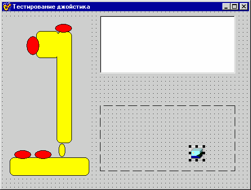
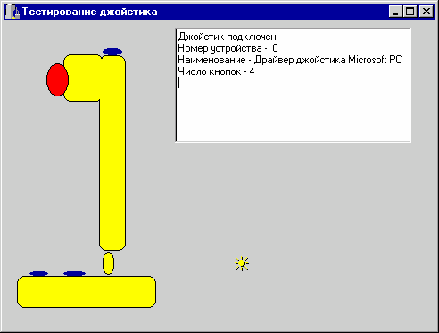

Немного о джойстиках
====================

::: {.date}
01.01.2007
:::

Немного о джойстиках

Наталия Елманова
Компьютер Пресс - CD, 1999, N 7

© Copyright N.Elmanova & ComputerPress Magazine.

Посвящается всем любителям компьютерных игр...

В предыдущей статье данного цикла (\"Компьютер Пресс\", 1999, N 3) были
рассмотрены некоторые из вопросов, связанных с использованием внешних
устройств. Данная статья продолжает начатую тему. Так как данный номер
посвящен приложениям multimedia, а примеры использования компонента
TMediaPlayer и создания проигрывателя звуковых компакт-дисков доступны
российским читателям в нескольких различных модификациях (см., например,
недавно вышедшую книгу С.Тейксейра и К.Пачеко \"Borland Delphi 4:
руководство разработчика\"; подобные примеры есть и в других
источниках), данная статья посвящена теме довольно экзотической -
использованию джойстика. Некоторые (но далеко не все) идеи, послужившие
основой для рассмотренного ниже примера, заимствованы из малодоступного
российскому читателю источника \"C++Builder - how-to\" (J.Miano,
T.Cabanski, H.Howe. - Waite Group Press, 1997).

Использование джойстика базируется на использовании нескольких функций
Windows API и структур Windows, описанных в файле mmsystem.h.

Сервисы, обслуживающие джойстики, загружаются при загрузке операционной
системы. В 32-разрядных версиях Windows джойстиков может быть два, и
каждый может иметь от одной до четырех кнопок. Каков именно ваш джойстик
и каковы характеристики его драйвера, можно определить с помощью
соответствующих функций Windows API. Помимо этого, с помощью других
функций можно определить, какие из кнопок нажаты в данный момент, и
каковы текущие координаты, связанные с наклоном его ручки (joystick\'s
positional information). Это можно сделать, либо опрашивая джойстик
периодически, либо обрабатывая полученные от него события.

Создадим простейшее приложение для тестирования джойстика. С этой целью
создадим форму, на которую поместим компонент TImage с изображением
джойстика, и четыре компонента TShape (в данном случае это красные
эллипсы) для изображения нажатых кнопок. Сделаем компоненты TShape
невидимыми. Кроме того, поместим на форму компоненты TMemo и TPaintBox.
И, наконец, поместим на форму компонент TImageList, в который поместим
одно-единственное изображение, более или менее похожее на прицел
джойстика (рис.1):

{.center}

Рис.1. Главная форма приложения для тестирования джойстика

Интерфейс приложения готов. Теперь можно приступить к созданию кода.

Для начала следует не забыть сослаться в приложении сослаться на файл
mmsystem.h (в нем описаны необходимые структуры и функции для управления
джойстиком и получения информации от него).

Первое, что нужно сделать - это узнать, установлен ли вообще драйвер
джойстика, и если да, подключен ли джойстик. Для этой цели используется
функция joyGetNumDevs(). Если она возвращает значение, отличное от нуля,
это означает, что драйвер джойстика установлен. Однако это еще не
означает, что сам джойстик подключен:

    int joycount=joyGetNumDevs();
      if (joycount=0) Memo1->Lines->Add("Драйверы джойстика не установлены");

Чтобы узнать, подключен ли джойстик, следует обратиться к функции
joyGetPosEx и убедиться, что она не возвращает кода ошибки.

    jr=joyGetPosEx(JOYSTICKID1,&JoyInfo);
       if (jr ==JOYERR_NOERROR)
       {
       connect=true;
        jnum= JOYSTICKID1;
           }
         else if (jr == MMSYSERR_INVALPARAM)
        ShowMessage("Ошибка определения наличия джойстика");
       else if((jr=joyGetPosEx(JOYSTICKID2,&JoyInfo)) == JOYERR_NOERROR)
        {
          connect = true;
          jnum= JOYSTICKID2;
         }

Если джойстик подключен, можно узнать о его характеристиках с помощью
структуры JOYCAPS. Список доступных характеристик весьма обширен, и мы
выведем в компонент TMemo информацию о некоторые из них. Сведения об
остальных можно получить аналогичным способом.

    Memo1->Lines->Add("Номер устройства -  "+ IntToStr(jnum));
    Memo1->Lines->Add("Наименование - " + AnsiString(JoyCaps.szPname));
    Memo1->Lines->Add("Число кнопок - " + IntToStr(JoyCaps.wNumButtons));

Если джойстик подключен, можно обрабатывать его события. Функция
joySetCapture предназначена для перенаправления сообщений джойстика
данному окну (в нашем случае - главному окну нашего приложения).
Параметры этой функции содержат дескриптор окна, указатель на то, первый
или второй джойстик должен посылать сообщения, частоту отправки этих
сообщений (в данном случае используется минимально возможный период,
определяемый с помощью все той же структуры JOYCAPS), а также параметр,
указывающий на то, нужно ли посылать сообщения, если в состоянии
джойстика ничего не изменилось.

if (connect) joySetCapture(Handle,jnum,2*JoyCaps.wPeriodMin,FALSE);

Соответственно для того, чтобы остановить поток этих сообщений, перед
закрытием формы следует вызвать функцию joyReleaseCapture.

    if (connect) joyReleaseCapture(jnum);

Теперь можно создать функции, реагирующие на события джойстика. Одна из
них должна делать видимыми те из объектов TShape, которые соответствуют
нажатым кнопкам. Вторая должна отображать \"прицел\", перемещая его
внутри компонента TPaintBox. Помимо этого, следует сослаться на эти
функции в h-файле, указав, что они являются реакцией на соответствующие
сообщения Windows. Текст h-файла, таким образом, имеет вид:

    #ifndef joy1H
    #define joy1H
    //---------------------------------------------------------------------------
    #include <Classes.hpp>
    #include <Controls.hpp>
    #include <StdCtrls.hpp>
    #include <Forms.hpp>
    #include <ExtCtrls.hpp>
    #include <Graphics.hpp>
    #include <ImgList.hpp>
    #include <Buttons.hpp>
    //---------------------------------------------------------------------------
    class TForm1 : public TForm
    {
    __published:        // IDE-managed Components
            TImage *Image1;
            TShape *Shape2;
            TShape *Shape1;
            TShape *Shape3;
            TShape *Shape4;
            TMemo *Memo1;
            TImageList *ImageList1;
            TPaintBox *PaintBox1;
            void __fastcall FormCreate(TObject *Sender);
            void __fastcall UpdButton(TMessage &msg);
            void __fastcall UpdCoord(TMessage &msg);
            void __fastcall FormDestroy(TObject *Sender);
    private:
     int jnum;  JOYCAPS JoyCaps;
     bool connect;
     int stepX,stepY;
      TPoint Pos;
     
            // User declarations
    public:                // User declarations
            __fastcall TForm1(TComponent* Owner);
    BEGIN_MESSAGE_MAP
      MESSAGE_HANDLER(MM_JOY1BUTTONDOWN,TMessage,UpdButton)
      MESSAGE_HANDLER(MM_JOY1BUTTONUP,TMessage,UpdButton)
      MESSAGE_HANDLER(MM_JOY1MOVE,TMessage,UpdCoord)
      MESSAGE_HANDLER(MM_JOY2BUTTONDOWN,TMessage,UpdButton)
      MESSAGE_HANDLER(MM_JOY2BUTTONUP,TMessage,UpdButton)
      MESSAGE_HANDLER(MM_JOY2MOVE,TMessage,UpdCoord)
    END_MESSAGE_MAP(TForm)
    };
    //---------------------------------------------------------------------------
    extern PACKAGE TForm1 *Form1;
    //---------------------------------------------------------------------------
    #endif
    Сам исходный текст модуля, связанного с главной формой приложения, имеет вид: 
    //---------------------------------------------------------------------------
    #include <vcl.h>
    #pragma hdrstop
    #include <mmsystem.h>
    #include "joy1.h"
    //---------------------------------------------------------------------------
    #pragma package(smart_init)
    #pragma resource "*.dfm"
    TForm1 *Form1;
    //---------------------------------------------------------------------------
    __fastcall TForm1::TForm1(TComponent* Owner)
            : TForm(Owner)
    {
    }
    //---------------------------------------------------------------------------
    void __fastcall TForm1::FormCreate(TObject *Sender)
    {
       MMRESULT jr;    JOYINFOEX JoyInfo;
       int joycount=joyGetNumDevs();
      if (joycount=0) Memo1->Lines->Add("Драйверы джойстика не установлены");
      else
      {
      connect=false;
    jr=joyGetPosEx(JOYSTICKID1,&JoyInfo);
       if (jr ==JOYERR_NOERROR)
       {
       connect=true;
        jnum= JOYSTICKID1;
           }
         else if (jr == MMSYSERR_INVALPARAM)
        ShowMessage("Ошибка определения наличия джойстика");
       else if((jr=joyGetPosEx(JOYSTICKID2,&JoyInfo)) == JOYERR_NOERROR)
        {
          connect = true;
          jnum= JOYSTICKID2;
         }
    }
      joyGetDevCaps(jnum,&JoyCaps, sizeof(JOYCAPS));
      if (connect) Memo1->Lines->Add("Джойстик подключен") ;
      else  Memo1->Lines->Add("Джойстик не подключен")    ;
       Memo1->Lines->Add("Номер устройства -  "+ IntToStr(jnum));
       Memo1->Lines->Add("Наименование - " + AnsiString(JoyCaps.szPname));
    Memo1->Lines->Add("Число кнопок - " +   IntToStr(JoyCaps.wNumButtons));
    if (connect)  joySetCapture(Handle,jnum,2*JoyCaps.wPeriodMin,FALSE);
    stepX = (JoyCaps.wXmax - JoyCaps.wXmin)/ PaintBox1->Width;
    stepY = (JoyCaps.wYmax - JoyCaps.wYmin)/ PaintBox1->Height;
    }
    //---------------------------------------------------------------------------
    void __fastcall TForm1::UpdButton(TMessage &msg)
    {
     Shape1->Visible= (msg.WParam &JOY_BUTTON1);
     Shape2->Visible= (msg.WParam &JOY_BUTTON2);
     Shape3->Visible= (msg.WParam &JOY_BUTTON3);
     Shape4->Visible= (msg.WParam &JOY_BUTTON4);
    }
    //---------------------------------------------------------------------------
    void __fastcall TForm1::UpdCoord(TMessage &msg)
    {
    JOYINFO JoyInfo;
    TCanvas *pCanvas = PaintBox1->Canvas;
    pCanvas->Brush->Color=Form1->Color;
    pCanvas->FillRect(Rect(0,0,PaintBox1->Width,PaintBox1->Height));
    Pos.x =  msg.LParamLo;
    Pos.y =  msg.LParamHi;
    int x=(Pos.x-JoyCaps.wXmin)/stepX-ImageList1->Width/2;
    int y=(Pos.y-JoyCaps.wYmin)/stepY-ImageList1->Height/2;
    ImageList1->Draw(pCanvas,x,y,0,true);
    }
    //---------------------------------------------------------------------------
    void __fastcall TForm1::FormDestroy(TObject *Sender)
    {
    if (connect) joyReleaseCapture(jnum);
    }
    //---------------------------------------------------------------------------

Запустив приложение при корректно установленном драйвере и подключенном
джойстике, можно попробовать нажимать на кнопки и перемещать рычаг. При
этом изображение прицела будет перемещаться внутри компонента TPaintBox,
а при нажатии на кнопки на экране будут появляться красные эллипсы в
соответствующих местах (рис.2).

{.center}

Рис.2. Приложение для тестирования джойстика на этапе выполнения

P.S. для дельфи практически всё так же, использованные функции api
находятся в модуле mmsystem.pas

Взято из [http://delphi.chertenok.ru](https://delphi.chertenok.ru)
