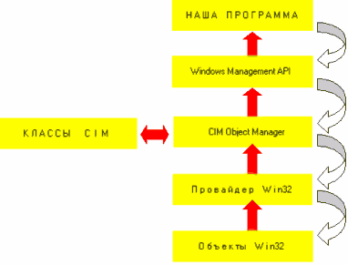
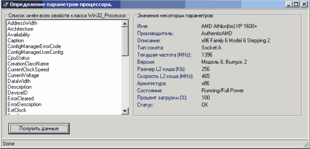
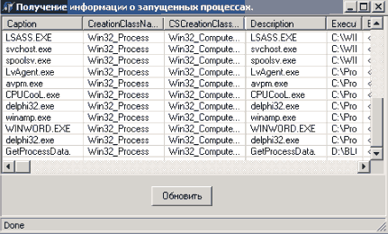

WMI - практика применения в Delphi
===================================

::: {.date}
01.01.2007
:::

Автор: Алексей Павлов

1. Предисловие.

Приветствую всех любителей Delphi! В этой статье я хочу
поведать вам об одной из замечательных, с моей точки зрения, технологии,
разработанной Microsoft для облегчения нашей жизни. Теперь любой
программист, используя любой современный язык программирования (не
исключая и скрип языков!) может с лёгкостью узнать о своём компьютере
практически всё. Теперь программисты всех "вероисповеданий" могут
определить, какое оборудование установлено на их компьютере, узнать
информацию о материнской плате и процессоре, параметры БИОСа, какие
процессы запущены в данный момент, какова температура процессора и
скорость вращения кулера, какие настройки графической системы, какие....
Одним словом, все о чём вы так долго мечтали, стало доступно благодаря
WMI. Звучит заманчиво, не так ли? ;)

Естественно, что WMI - это не только набор параметров. А что это такое -
читайте ниже.

2. Введение.

Для того, чтобы не лишиться большей части потенциальных
читателей на начальном этапе, скажу сразу, что применение Windows
Management Instrumentation (WMI) я буду рассматривать в основном с
практической точки зрения (т.е. теории в этой статье будет немного).
Сразу хочу оговориться, что т.к. я собираюсь осветить вопрос
практического использования технологии WMI в Delphi и намериваюсь
достигнуть этой цели достаточно быстро, то я не стану разжёвывать все, с
чем нам придётся сталкиваться по ходу повествования и ограничусь
минимумом теории. Так что материал изначально ориентирован на тех
читателей, кто уверено чувствует себя в области применения интерфейсов,
технологии COM и кто умеет работать с литературой.

Так же, я не стану излагать всю теорию, непосредственно связанную с
технологией WMI, т.к. во-первых, это достаточно утомительно, а
во-вторых, это уже сделано в лучшем виде, и заниматься перепечатыванием
не имеет смысла. Итак, дальнейшее прочтение статьи и использование
прилагаемых к ней примеров возможно и без понимания самой сути WMI, но,
согласитесь, смысла в этом чуть. Так что очень рекомендую прочитать
следующее:

- "Внутри Windows Management Interface".

- "Сценарии WMI для начинающих"

Примечание:

: авторы статьи "Внутри Windows Management Interface" интерпретируют
аббревиатуру WMI как Windows Management Interface, хотя сами создатели
(фирма Microsoft) придерживаются следующей трактовки: Windows Management
Instrumentation, что в общем говоря правильнее. Но и интерпретация буквы
"I", как "Interface", а не как " Instrumentation " вполне понятна
и простительна, т.к. многие разработчики рассматривают WMI не иначе как
набор интерфейсов, позволяющих получать доступ к определённым
компонентам системы.

Надеюсь, что предложенные мной к прочтению статьи были прочитаны и
поняты, т.к. дальнейшие повествование подразумевает собой понимание
структуры WMI и назначения всех её составляющих. Все даваемые мной ниже
пояснения всего лишь дополнение к общей теории, а даваемые определения -
дополнения к тем, что были даны в вышеупомянутых статьях (или же
умышленно утрированные для акцентирования внимания на наиболее важных
для понимания моментах). Если же вы прочли вышеперечисленные статьи и
всё чётко поняли, то вас не запутают и не введут в заблуждение мои, не
претендующие на непогрешимость и полноту, определения :)

Итак, начали.

3. Теория.

Windows Management Instrumentation (WMI) - технология, входящая в состав
ядра Windows 2000 и предоставляющая доступ с помощью интерфейсов к
объектам системы.

Представлю несколько упрощённую архитектуру WMI в том виде, в котором
она нас будет интересовать в нашем конкретном случае. Быстро пробежимся
по всем её компонентам.

Объекты Win32

- с этим элементом ассоциированы компоненты Win32, к данным которых мы
желаем получить доступ

Провайдер Win32

- представители объектов Win32, т.е. провайдер осуществляет связь между
"внешним миром" и компонентами системы. Нас провайдеры будут
интересовать как COM (DCOM) серверы, которые могут быть реализованы как
внутренние (в виде DLL), так и внешние (в виде самостоятельных
приложений).

CIM Object Manager

- попросту говоря, это служба координации данных передаваемых в обоих
направлениях (будь то запрос от управляющей программы к провайдеру или
данные предоставляемые провайдером приложению).

Классы CIM

- вернее база данных, содержащая классы, которые есть не что иное, как
шаблоны управляемых элементов, т.е. каждый класс описывает какой-то
элемент и содержит свойства и методы для работы с этим элементом.

Windows Management API

- интерфейс прикладного программирования, по средствам которого
управляющие приложения обращаются к объектам, а провайдеры поставляют
данные и определения класса.

Наша программа является в данном случае не чем иным как контроллером,
работающим с помощью Windows Management API с провайдерами (серверами).

На этом я закончу теоретическое вступление и перейду к практической
части.

4. Практика.

Подготовка.

Итак, начнём с того, что нам необходимо сделать перед тем, как
непосредственно начать использовать мощь технологии WMI в своих
программах:

- установить систему Windows 2000 или NT 4.0 SP4 и выше;

- установить Microsoft Internet Explorer (IE) 5.0 и выше;

- установить WMI SDK;

После того, как вы установили WMI SDK, импортируйте следующие библиотеки
типов:

- Active DS Type Library (Version 1.0)

- Microsoft WMI Scripting v1.1 Library (Version 1.1)

Отлично, теперь в палитре компонентов у вас появились новые элементы,
которые мы и будем в дальнейшем использовать.

Порядок действий.

1.   Первым делом нам необходимо
       подсоединиться к интересующему
       нас пространству имён. Для данной
       цели используется интерфейс
       IWbemLocator и его единственный
       метод ConnectServer, который
       позволит нашей программе (в
       данном случае наша программа
       является WMI клиентом) получить
       указатель на интерфейс
       IWbemServices, который связан с
       выбранным нами пространством имён
       на выбранном нами компьютере (не
       стоит забывать, что технология
       WMI основана на COM/DCOM, что
       позволяет использовать её
       удалённо). Методы объектов типа
       SWbemServices предназначены для
       произведения операций в выбранном
       пространстве имён.

       Да, надеюсь, вы знаете, где можно
       посмотреть имя интересующего вас
       пространства имён и WMI класса,
       если нет, то перечитываем
       предложенные к прочтению статьи
       или открываем WMI SDK и
       просматриваем раздел Win32
       Classes.

1.   После того, как мы подсоединились к выбранному нами пространству имён и получили указатель на объект, связанный с данным пространством имён, нам необходимо получить описание интересующего нас класса в выбранном нами пространстве имён (возможно, звучит мудрёно, но на практике всё гораздо проще, в чём вы скоро сами убедитесь). Для этого воспользуемся методом Get объекта SWbemServices, который вернёт описание (definition) указанного нами класса (на этом этапе вы уже можете считать имена свойств класса и названия поддерживаемых им методов, естественно, все свойства будут содержать null; так же вы можете создать свой класс на базе полученного описания и дополнить его своими свойствами и методами). Таким образом, мы получим указатель на объект типа SWbemObject.

1.   Затем нам необходимо получить непосредственно экземпляр (instance) класса, описание которого мы получили. Для этого воспользуемся методом Instances\_ объекта SWbemObject, который создаст объект, осуществляющий нумерацию всех экземпляров (instances) данного класса типа SWbemObjectSet. Говоря по-русски, будет создана коллекция всех объектов данного класса. Полученный объект SWbemObjectSet будет содержать объекты SWbemObject.

1.   Вот собственно и всё. Получив из объекта SWbemObjectSet экземпляр класса, нам остаётся считать его свойства и воспользоваться его методами.

Теперь перейдём к рассмотрению самих примеров. Вашему вниманию будут
предложены четыре примера, полные исходные тексты и рабочие exe-файлы
которых вы найдёте в прилагаемом к статье архиве.

5. Примеры.

5.1. Получение данных о центральном процессоре.

Этот первый пример я старался сделать как можно нагляднее и разберу я
его достаточно подробно. В остальных же 3-х примерах я не буду
повторяться в комментариях, а постараюсь продемонстрировать некоторые
приёмы, которые, возможно, помогут вам в дальнейшем в ваших собственных
программах.

Создаём новый проект и добавляем к нему компоненту TSWbemLocator,
которая должна появиться в палитре компонент после импортирования
указанных выше библиотек типов. Далее я буду давать комментарии
непосредственно в коде программы.

    unit Unit1;
     
    interface
     
    uses
      …, WbemScripting_TLB, OleServer, ActiveX;
    type
      TForm1 = class(TForm)
        …
          SWbemLocator1: TSWbemLocator;
        …;
      private
        { Private declarations }
        procedure ShowProp(SProp: SWBemProperty);
      public
        { Public declarations }
      end;
     
    var
      Form1: TForm1;
     
    implementation
     
    {$R *.dfm}
     
    procedure TForm1.Button1Click(Sender: TObject);
    var
      Service: ISWbemServices;
      ObjectSet: ISWbemObjectSet;
      SObject: ISWbemObject;
      PropSet: ISWbemPropertySet;
      SProp: ISWbemProperty;
     
      PropEnum, Enum: IEnumVariant;
      TempObj: OleVariant;
      Value: Cardinal;
      StrValue: string;
    begin
      // см. Примечание 1
      Service := SWbemLocator1.ConnectServer('.', 'root\CIMV2', '', '', '', '', 0,
        nil);
      // см. Примечание 2
      SObject := Service.Get('Win32_Processor', wbemFlagUseAmendedQualifiers, nil);
      // см. Примечание 3
      ObjectSet := SObject.Instances_(0, nil);
      {
      Далее нам нужно из коллекции ObjectSet получить экземпляр объекта,
      соответствующий классу Win32_Processor.
      Делается это с помощью метода Item объекта ObjectSet.
      В качестве первого параметра этого метода указывается путь к объекту,
      экземпляр которого вы желаете извлечь из коллекции.
      Данный метод возвращает объект типа SWbemObject. Но нам не известно, как выглядит этот путь.
      Использовать дополнительный класс SwbemObjectPath тоже нет никакого желания.
      Так что делаю "финт ушами":
      }
      //  SObject:= ObjectSet.Item('???', 0);
     
      Enum := (ObjectSet._NewEnum) as IEnumVariant;
      Enum.Next(1, TempObj, Value);
      SObject := IUnknown(TempObj) as SWBemObject;
      {
      Полагаю, что данный приём понятен читателю и в комментариях не нуждается.
     
      Вот практически и всё - осталось прочитать интересующие нас свойства.
      Сколько было слов и как всё просто оказалось в действительности :)
     
      Перебираем свойства объекта SObject:
     }
      while (PropEnum.Next(1, TempObj, Value) = S_OK) do
      begin
        SProp := IUnknown(TempObj) as SWBemProperty;
        StrValue := '';
        ListBox1.AddItem(SProp.Name, nil);
        ShowProp(SProp);
      end;
    end;
     
    procedure TForm1.ShowProp(SProp: SWBemProperty);
    begin
      if (SProp.Get_Value &lt; &gt; null) then
      begin
        with SProp do
        begin
          if Name = 'Name' then
            Label2.Caption := Get_Value
          else if Name = 'Manufacturer' then
            ….
     
        end; { with }
      end; { if }
    end;
     
    end.

Пояснения к коду:

Примечание 1

Подсоединяемся к пространству имён \'root\\CIMV2\' нашего компьютера.
Метод ConnectServer принимает следующие параметры:

objwbemServices = ConnectServer(

[strServer = ""],

[strNameSpace = ""],

[strUser = ""],

[strPassword = ""],

[strLocale = ""],

[strAuthority = ""],

[iSecurityFlags = 0],

[objwbemNamedValueSet = null]

)

- strServer - необязательный к указанию параметр, содержащий имя компьютера к пространству имён которого вы желаете подключиться. Если не указан, имеется в виду данный компьютер;

- strNameSpace - необязательный к указанию параметр, содержащий строку, указывающую к какому пространству имён вы собираетесь подключиться. Если не указан, то устанавливается в значение по умолчанию.

- StrUser - необязательный к указанию параметр, содержащий строку с именем пользователя, которое будет использовано при подключении. При применении на локальной машине должна содержать нулевую строку. Применяется только при подключении к удалённой машине.

- StrPassword - см. StrUser.

- StrLocale - необязательный к указанию параметр, содержащий код местности (localization code). Должен содержать нулевую строку для применения действующего кода местности.

- StrAuthority - необязательный к указанию параметр, предназначенный для работы в сетях с системой Kerberos.

- ISecurityFlags - необязательный к указанию параметр. Если содержит 0, то метод ConnectServer вернёт результат только после того, как соединение с сервером будет установлено, т.е. если соединение установить не удалось - ваша программа повиснет. Если содержит значение wbemConnectFlagUseMaxWait, то приложение ждёт две минуты после чего возвращает код ошибки.

- ObjwbemNamedValueSet - необязательный к указанию параметр. Обычно его не определяют (nil). Вообще говоря, можно указать объект типа SWbemNamedValueSet, который будет содержать информацию, которая может быть использована провайдером, обслуживающим данный запрос.

Подробнее обо всех свойствах см. Platform SDK.

 

Примечание 2

Теперь получим описание интересующего нас класса, т.е.
Win32\_Processor.
Делается это с помощью метода Get полученного нами объекта Service.

Метод Get принимает следующие параметры:

objWbemObject = Get(

[strObjectPath = ""],

[iFlags = 0],

[objWbemNamedValueSet = null]

)

- strObjectPath - необязательный к указанию параметр, содержащий название класса, описание которого мы желаем получить. Если данный параметр будет содержать нулевую строку, то будет создан новый класс.

- IFlags - необязательный к указанию параметр. Принимает только одно значение: wbemFlagUseAmendedQualifiers.

- ObjWbemNamedValueSet - см. выше.

Подробнее обо всех свойствах см. Platform SDK.

 

Примечание 3

Теперь надо получить коллекцию экземпляров класса Win32\_Processor.
Делается это с помощью метода Instances\_ объекта SObject.

Метод Instances\_ принимает следующие параметры:

objWbemObjectSet = Instances\_(

[iFlags = wbemFlagReturnImmediately],

[objwbemNamedValueSet = null]

)

- iFlags - необязательный к указанию параметр, содержащий числовое значение типа Integer, определяющее поведение данного запроса.

- ObjwbemNamedValueSet - см. выше.

Подробнее обо всех свойствах см. Platform SDK.

 

Исходный код и exe-файл данного примера вы сможете найти в прилагаемом к
статье архиве в каталогах \\source\\GetProcessorData и \\Exe-files
соответственно.

Вот что у меня получилось:

5.2. Получение данных о запущенных процессах.

Данный пример будет отличаться от предыдущего только тем, что я
использую нехитрый приём и покажу, как вывести все свойства объекта
некого класса, не зная самих имён этих свойств. Действуем так же, как и
в первом примере:

    var
      Form1: TForm1;
      ListItem: TListItem;
     
    implementation
     
    {$R *.dfm}
     
    procedure TForm1.Button1Click(Sender: TObject);
    var
      Service: ISWbemServices;
      ObjectSet: ISWbemObjectSet;
      SObject: ISWbemObject;
      PropSet: ISWbemPropertySet;
      SProp: ISWbemProperty;
     
      PropEnum, Enum: IEnumVariant;
      TempObj: OleVariant;
      Value: Cardinal;
      Column: TListColumn;
    begin
      ListView1.Items.BeginUpdate;
      ListView1.Items.Clear;
     
      Service := SWbemLocator1.ConnectServer('.', 'root\CIMV2', '', '', '', '', 0,
        nil);
      SObject := Service.Get('Win32_Process', wbemFlagUseAmendedQualifiers, nil);
      ObjectSet := SObject.Instances_(0, nil);
      Enum := (ObjectSet._NewEnum) as IEnumVariant;
     
      {
      На данном этапе начинаются некоторые незначительные отличия от первого примера.
      В предыдущем примере, мы знали, что у нас был единственный экземпляр класса
      Win32_Processor, характеризующий центральный процессор.
      В данном примере мы имеем столько экземпляров, сколько запущенных процессов,
      поэтому их все необходимо перебрать и получить их свойства:
      }
     
    // в этом цикле перебираю все имеющиеся экземпляры
      while (Enum.Next(1, TempObj, Value) = S_OK) do
      begin
        SObject := IUnknown(TempObj) as SWBemObject;
        PropSet := SObject.Properties_;
        PropEnum := (PropSet._NewEnum) as IEnumVariant;
        ListItem := ListView1.Items.Add;
     
        // перебираю свойства
        while (PropEnum.Next(1, TempObj, Value) = S_OK) do
        begin
          SProp := IUnknown(TempObj) as SWBemProperty;
          if ListView1.Items.Count = 1 then
          begin
            Column := ListView1.Columns.Add;
            Column.Width := 100;
            Column.Caption := SProp.Name;
          end;
          ShowProp(SProp);
        end;
      end; { while }
      ListView1.Items.EndUpdate;
    end;
    // В процедуре ShowProp происходит определение типа свойства
    // и соответствующие приведение типа.
     
    procedure TForm1.ShowProp(SProp: ISWbemProperty);
    var
      StrValue: string;
      Count: Cardinal;
    begin
      StrValue := '';
      if VarIsNull(SProp.Get_Value) then
        StrValue := '&lt;empty&gt;'
      else
        case SProp.CIMType of
          //******************************************************************//
          wbemCimtypeUint8, wbemCimtypeSint8, wbemCimtypeUint16, wbemCimtypeSint16,
            wbemCimtypeUint32, wbemCimtypeSint32, wbemCimtypeSint64:
            if VarIsArray(SProp.Get_Value) then
            begin
              if VarArrayHighBound(SProp.Get_Value, 1)&gt;
              0 then
                for Count := 1 to VarArrayHighBound(SProp.Get_Value, 1) do
                  StrValue := StrValue + ' ' + IntToStr(SProp.Get_Value[Count]);
            end
            else
              StrValue := IntToStr(SProp.Get_Value);
          //******************************************************************//
          wbemCimtypeReal32, wbemCimtypeReal64:
            StrValue := FloatToStr(SProp.Get_Value);
          //******************************************************************//
     
          …
     
          //******************************************************************//
        else
          MessageBox(0, PChar('Unknown type'), PChar(Form1.Caption), MB_OK);
        end; {case}
      if ListItem.Caption = '' then
        ListItem.Caption := StrValue
      else
        ListItem.SubItems.Add(StrValue);
    end;
     
    end.

Исходный код и exe-файл данного примера вы сможете найти в прилагаемом к
статье архиве в каталогах \\source\\ GetProcessData и \\Exe-files
соответственно.

5.3. Запуск приложений и выключение компьютера.

В данном примере я продемонстрирую, как использовать методы,
предоставляемые провайдерами.

    var
      Form1: TForm1;
      ListItem: TListItem;
     
    implementation
     
    {$R *.dfm}
     
    procedure TForm1.Button1Click(Sender: TObject);
    var
      Service: ISWbemServices;
      ObjectSet: ISWbemObjectSet;
      SObject: ISWbemObject;
      PropSet: ISWbemPropertySet;
      SProp: ISWbemProperty;
     
      PropEnum, Enum: IEnumVariant;
      TempObj: OleVariant;
      Value: Cardinal;
      Column: TListColumn;
    begin
      ListView1.Items.BeginUpdate;
      ListView1.Items.Clear;
     
      Service := SWbemLocator1.ConnectServer('.', 'root\CIMV2', '', '', '', '', 0,
        nil);
      SObject := Service.Get('Win32_Process', wbemFlagUseAmendedQualifiers, nil);
      ObjectSet := SObject.Instances_(0, nil);
      Enum := (ObjectSet._NewEnum) as IEnumVariant;
     
      {
      На данном этапе начинаются некоторые незначительные отличия от первого примера.
      В предыдущем примере, мы знали, что у нас был единственный экземпляр класса
      Win32_Processor, характеризующий центральный процессор.
      В данном примере мы имеем столько экземпляров, сколько запущенных процессов,
      поэтому их все необходимо перебрать и получить их свойства:
      }
     
    // в этом цикле перебираю все имеющиеся экземпляры
      while (Enum.Next(1, TempObj, Value) = S_OK) do
      begin
        SObject := IUnknown(TempObj) as SWBemObject;
        PropSet := SObject.Properties_;
        PropEnum := (PropSet._NewEnum) as IEnumVariant;
        ListItem := ListView1.Items.Add;
     
        // перебираю свойства
        while (PropEnum.Next(1, TempObj, Value) = S_OK) do
        begin
          SProp := IUnknown(TempObj) as SWBemProperty;
          if ListView1.Items.Count = 1 then
          begin
            Column := ListView1.Columns.Add;
            Column.Width := 100;
            Column.Caption := SProp.Name;
          end;
          ShowProp(SProp);
        end;
      end; { while }
      ListView1.Items.EndUpdate;
    end;
    // В процедуре ShowProp происходит определение типа свойства
    // и соответствующие приведение типа.
     
    procedure TForm1.ShowProp(SProp: ISWbemProperty);
    var
      StrValue: string;
      Count: Cardinal;
    begin
      StrValue := '';
      if VarIsNull(SProp.Get_Value) then
        StrValue := '&lt;empty&gt;'
      else
        case SProp.CIMType of
          //******************************************************************//
          wbemCimtypeUint8, wbemCimtypeSint8, wbemCimtypeUint16, wbemCimtypeSint16,
            wbemCimtypeUint32, wbemCimtypeSint32, wbemCimtypeSint64:
            if VarIsArray(SProp.Get_Value) then
            begin
              if VarArrayHighBound(SProp.Get_Value, 1)&gt;
              0 then
                for Count := 1 to VarArrayHighBound(SProp.Get_Value, 1) do
                  StrValue := StrValue + ' ' + IntToStr(SProp.Get_Value[Count]);
            end
            else
              StrValue := IntToStr(SProp.Get_Value);
          //******************************************************************//
          wbemCimtypeReal32, wbemCimtypeReal64:
            StrValue := FloatToStr(SProp.Get_Value);
          //******************************************************************//
     
          …
     
          //******************************************************************//
        else
          MessageBox(0, PChar('Unknown type'), PChar(Form1.Caption), MB_OK);
        end; {case}
      if ListItem.Caption = '' then
        ListItem.Caption := StrValue
      else
        ListItem.SubItems.Add(StrValue);
    end;
     
    end.

Пояснения к коду:

Примечание 1

Security\_ - данное свойство используется в том случае, когда вы
собираетесь считать или установить настройки безопасности для объекта
SWbemServices. Объект SWbemSecurity имеет следующие свойства:
AuthenticationLevel, ImpersonationLevel, Privileges. Нас в данном случае
будет интересовать только второе свойство. ImpersonationLevel - Числовое
значение. Данное свойство определяет, может ли процесс, владельцем
которого является WMI, пользоваться правами вашей учётной записи, что
может быть необходимо при обращении к другим процессам. Я буду
пользоваться значением \'3\' (wbemImpersonationLevelImpersonate), что
означает, что я наделяю данный объект правами того, кто его вызвал. Об
остальных уровнях наследования прав читайте в SDK.

 

 

Примечание 2

Свойство Methods\_ объекта SWbemObject представляет собой объект типа
SWbemMethodSet, который является не чем иным, как коллекцией методов
данного класса (или экземпляра класса).
Данное свойство предназначено только для чтения (read-only).

Единственный метод Item объекта SWbemMethodSet возвращает объект типа
SWbemMethod.

Метод Item принимает следующие параметры:

objMethod = Item(

strName,

[iFlags = 0]

)

strName - необходимый параметр. Имя метода, указатель на который должен
быть возвращён данным методом.

 

 

Примечание 3

Свойство InParameters объекта SWbemMethod определяет входные параметры
для данного метода. Метод SpawnInstance\_ объекта SWbemObject создаёт
новый экземпляр класса.

Данный метод имеет следующие входные параметры:

objNewInstance = SpawnInstance\_(

[iFlags = 0]

)

Единственный параметр iFlags зарезервирован и не обязателен к указанию.
Если указывается, то должен быть равен 0.

 

 

Примечание 4

Свойство Properties\_ объекта SWbemObject представляет собой объект типа
SWbemPropertySet, который является коллекцией свойств для данного класса
или экземпляра.
Метод Add объекта SWbemPrivilegeSet добавляет объект типа SWbemProperty
к объекту SWbemPrivilegeSet.

Данный метод имеет следующие входные параметры:

objProperty = Add(

strName,

iCIMType,

[bIsArray = FALSE],

[iFlags = 0]

)

- strName - обязательный к указанию параметр. Имя нового свойства.

- iCIMType - обязательный к указанию параметр. Определяет тип (CIMType) свойства.

- bIsArray - необязательный к указанию параметр. Определяющий является ли данное свойство массивом. По умолчанию False.

- iFlags - необязательный к указанию параметр. Зарезервирован. Если указывается, то должен быть равен 0.

 

 

Примечание 5

Для получения коллекции экземпляров Win32\_OperatingSystem я намеренно
воспользовался методом ExecQuery объекта ISWbemServices, что бы
продемонстрировать работу данной ф-ии.
Использование данного метода равносильно используемой мною ранее
конструкции.

Кстати, синтаксис WQL вам ничего не напоминает? ;) Правильно - WQL
прямой потомок ANSI SQL, и соответствует синтаксису SQL. В WQL введены
незначительные семантические изменения необходимые для работы с WMI. Так
что вам даже не придётся учить новый язык запросов, для того что бы
использовать WMI - Microsoft оказалась гуманной и мудрой в этом
отношении и в очередной раз не усложнила нашу жизнь :)

Для интересующихся правилами составления запросов: откруваем SDK, раздел
"Querying with WQL", всё понятно и доступно.

 

Исходный код и exe-файл данного примера вы сможете найти в прилагаемом к
статье архиве в каталогах \\source\\ UseMethods и \\Exe-files
соответственно.

5.4. Получения значений c температурных сенсоров и с установленных
вентиляторов.

Данный пример не содержит каких-либо новых решений или приёмов, кроме
проверки на существование провайдера (вернее возможности работать с
ним), осуществляющего связь между требуемым компонентом системы и
программой. У меня (Chaintech 7VJL (Apogee) VIA KT333 / Athlon XP 1600+
/ Windows 2000 Professional SP3) не удаётся получить свойства некоторых
классов, например, Win32\_Fan и Win32\_TemperatureProbe. Выражается это
в том, что не удаётся получить экземпляр ни одного из этих классов. Дело
в том, что WMI не может получить доступ к WMI провайдеру. Но, т.к.
данные классы имеются в хранилище CIM классов, то получить описание
данных классов удаётся:

    Service := SWbemLocator1.ConnectServer('.', 'root\CIMV2', '', '', '', '', 0, nil);
    SObject := Service.Get('Win32_Fan', wbemFlagUseAmendedQualifiers, nil);

Но при выполнении:

ObjectSet := SObject.Instances\_(0, nil);

Метод Instances\_ не возвращает требуемой коллекции экземпляров и
функция Enum.Next(1, TempObj, Value) вернёт значение S\_FALSE, а при
попытке выполнить PropSet := SObject.Properties\_; как я сделал в первом
примере, вы получите отказ в доступе (Access Violation), причина
понятна....

Я проверял работу данного примера и на материнской плате Gigabyte VIA
KT266 с аналогичным процессором и операционной системой - результат тот
же.

Думаю, не нужно говорить о том, что обе материнских платы имеют
соответствующие сенсоры для диагностики температурного режима и контроля
вращения вентиляторов.

Между тем, имеется информация о том, что данные параметры удаётся без
проблем получить на материнских платах с чипсетами (chipset) фирмы
Intel. Ничего по этому поводу сказать не могу - у меня в момент
написания данной статьи не было возможности протестировать данный пример
на компьютерах на базе чипсетов от Intel.

Исходный код и exe-файл данного примера вы сможете найти в прилагаемом к
статье архиве в каталогах \\source\\ FanAndTemperature и \\Exe-files
соответственно.

6. Послесловие.На этом я закончу рассказ о применении технологии WMI.
Надеюсь, что теперь вы прониклись мыслью о том, что WMI крайне удобная и
относительно несложная в реализации технология, которая поможет решить
массу ваших проблем :) Microsoft продолжает активно развивать WMI, и в
скором времени мы получим мощнейший инструмент, области применения
которого очень и очень обширны. Нам, людям занимающимся
программированием, как никому другому приходится год от года, месяц от
месяца пополнять свой "боевой" арсенал всё новыми и новыми знаниями,
приёмами, инструментами и методологиями. На мой взгляд, технология WMI
может занять достойное место в вашем личном арсенале знаний.

P.S.

Если вам что-то не понятно в примерах или самой теории, то прежде чем
отягощать кого-либо своими расспросами, откройте Platform SDK
Documentation, затратьте немного своего драгоценного времени и поищите
самостоятельно ответы на свои вопросы. Как показывает практика многих
поколений - решение, найденное самостоятельно, стоит нескольких,
полученных от кого-то. Но если всё же у вас ничего не выйдет - пишите
мне, будем разбираться вместе :)

7. Список использованной литературы.

* Platform SDK Release: August 2002.

Алексей Павлов, Специально для Королевства Delphi
 
Moscow Power Engineering Institute (Technical University)  
Faculty of Nuclear Power Plants  
21.10.02

Взято из http://forum.sources.ru
